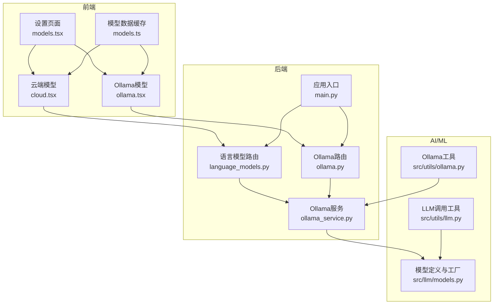
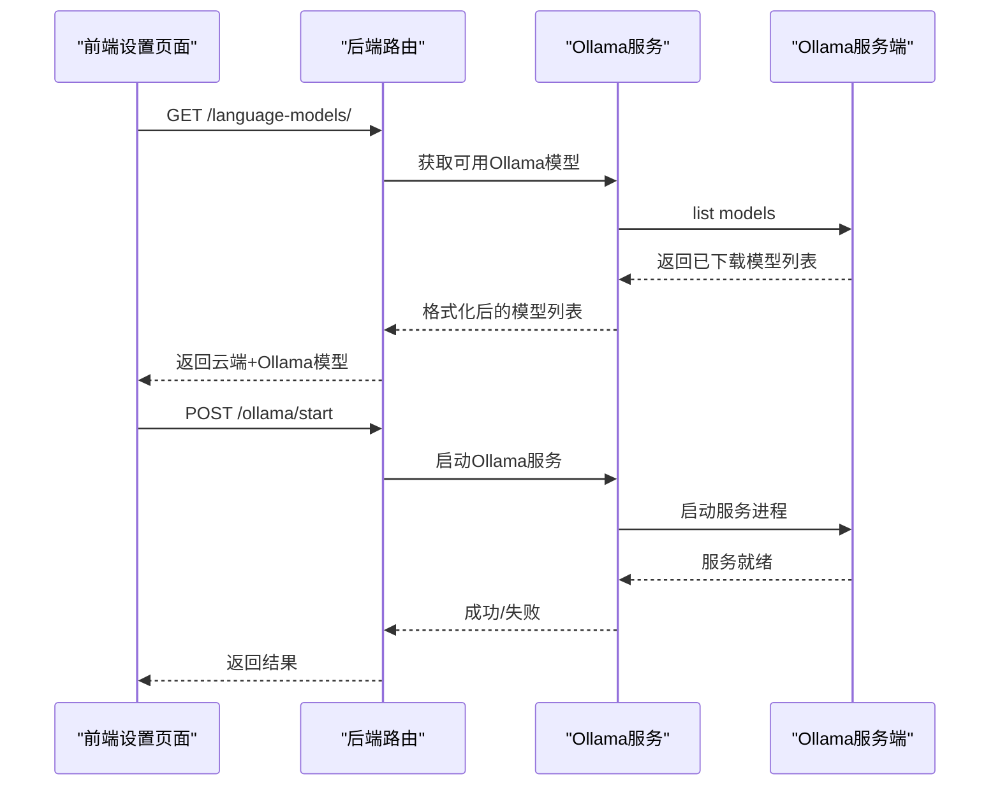
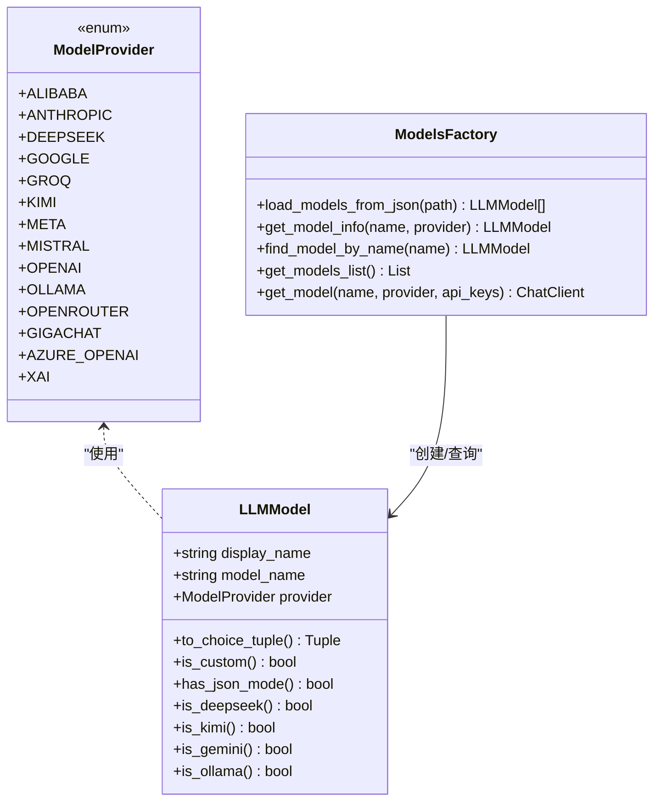
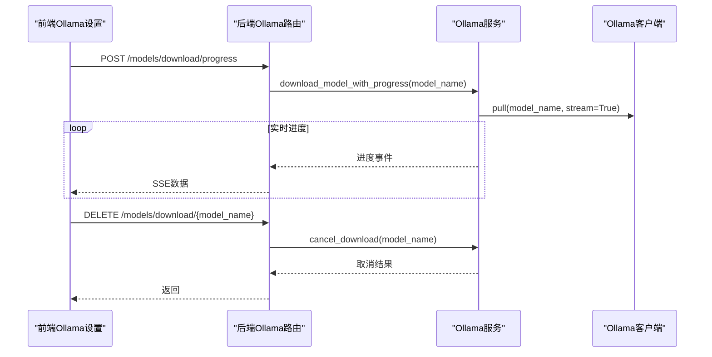
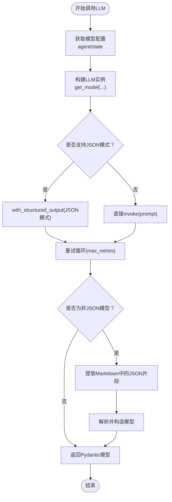
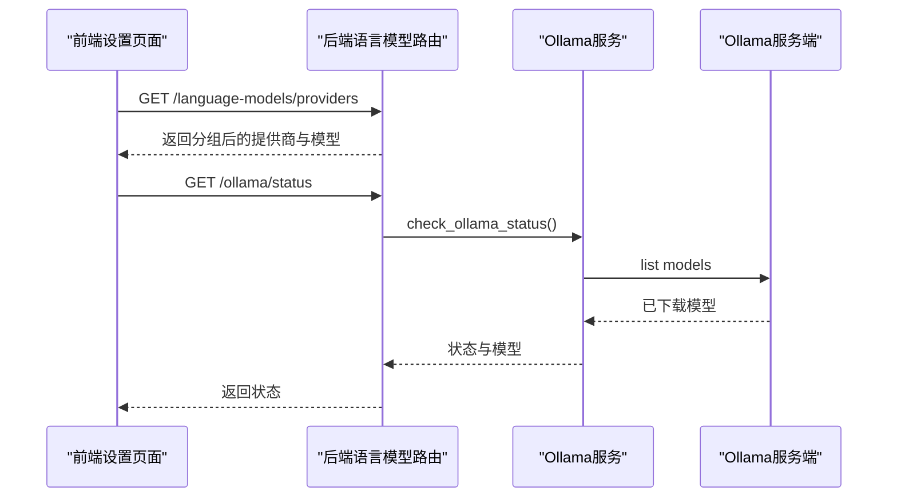
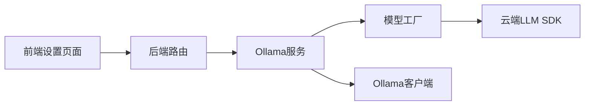

# AI/ML集成

<cite>
**本文引用的文件**
- [src/llm/models.py](file://src/llm/models.py)
- [src/llm/api_models.json](file://src/llm/api_models.json)
- [src/llm/ollama_models.json](file://src/llm/ollama_models.json)
- [app/backend/services/ollama_service.py](file://app/backend/services/ollama_service.py)
- [app/backend/routes/ollama.py](file://app/backend/routes/ollama.py)
- [app/backend/routes/language_models.py](file://app/backend/routes/language_models.py)
- [src/utils/llm.py](file://src/utils/llm.py)
- [src/utils/ollama.py](file://src/utils/ollama.py)
- [app/frontend/src/data/models.ts](file://app/frontend/src/data/models.ts)
- [app/frontend/src/components/settings/models/cloud.tsx](file://app/frontend/src/components/settings/models/cloud.tsx)
- [app/frontend/src/components/settings/models/ollama.tsx](file://app/frontend/src/components/settings/models/ollama.tsx)
- [app/frontend/src/components/settings/models.tsx](file://app/frontend/src/components/settings/models.tsx)
- [app/backend/main.py](file://app/backend/main.py)
- [src/graph/state.py](file://src/graph/state.py)
- [README.md](file://README.md)
</cite>

## 目录
1. [简介](#简介)
2. [项目结构](#项目结构)
3. [核心组件](#核心组件)
4. [架构总览](#架构总览)
5. [详细组件分析](#详细组件分析)
6. [依赖关系分析](#依赖关系分析)
7. [性能考虑](#性能考虑)
8. [故障排除指南](#故障排除指南)
9. [结论](#结论)
10. [附录](#附录)

## 简介
本项目是一个用于探索AI在交易决策中应用的教育性项目。系统通过多个AI代理协作完成投资决策流程，支持本地Ollama模型与多家云端大语言模型提供商（如OpenAI、Anthropic、Groq等）的集成。本文档聚焦于AI/ML集成方案，涵盖以下主题：
- 大语言模型的云端与本地（Ollama）集成配置
- 模型选择、参数调优与推理优化策略
- 提示工程最佳实践、模板设计与上下文管理
- LLM服务的负载均衡、错误处理与性能监控
- 模型切换、版本管理与A/B测试方案
- AI输出解析、结果验证与质量控制机制
- 开发者扩展指南：如何新增模型、集成新提供商与优化性能

## 项目结构
后端采用FastAPI，前端使用React + TypeScript，AI/ML相关能力主要集中在Python侧的LLM封装与Ollama服务，以及前端设置界面中的模型管理。

图表来源
- [app/backend/main.py:15-31](file://app/backend/main.py#L15-L31)
- [app/backend/routes/language_models.py:8-32](file://app/backend/routes/language_models.py#L8-L32)
- [app/backend/routes/ollama.py:12-55](file://app/backend/routes/ollama.py#L12-L55)
- [app/backend/services/ollama_service.py:19-519](file://app/backend/services/ollama_service.py#L19-L519)
- [src/llm/models.py:36-258](file://src/llm/models.py#L36-L258)
- [src/utils/llm.py:10-148](file://src/utils/llm.py#L10-L148)
- [src/utils/ollama.py:1-408](file://src/utils/ollama.py#L1-L408)

章节来源
- [README.md:1-158](file://README.md#L1-L158)
- [app/backend/main.py:15-56](file://app/backend/main.py#L15-L56)

## 核心组件
- 模型定义与工厂
  - 支持多家提供商（OpenAI、Anthropic、Groq、DeepSeek、Google、xAI、GigaChat、Azure OpenAI等），并提供统一的模型信息查询与实例化接口。
  - 本地Ollama模型通过独立JSON配置加载，支持按需过滤与格式化返回给前端。
- LLM调用工具
  - 封装统一的LLM调用流程，自动判断是否支持结构化输出（JSON模式），对不支持的模型进行内容提取与解析。
  - 提供重试机制与默认响应生成，确保在异常情况下仍能返回可消费的数据结构。
- Ollama服务与工具
  - 后端服务负责Ollama安装检测、服务器启停、模型下载/删除、进度流式返回与状态查询。
  - 命令行工具提供本地环境下的安装、启动、模型下载/删除等操作。
- 前端模型设置
  - 提供云端模型与Ollama模型的可视化管理界面，支持状态检查、服务器启停、模型下载进度查看与取消、模型删除等。

章节来源
- [src/llm/models.py:36-258](file://src/llm/models.py#L36-L258)
- [src/utils/llm.py:10-148](file://src/utils/llm.py#L10-L148)
- [app/backend/services/ollama_service.py:19-519](file://app/backend/services/ollama_service.py#L19-L519)
- [src/utils/ollama.py:1-408](file://src/utils/ollama.py#L1-L408)
- [app/frontend/src/components/settings/models/ollama.tsx:36-931](file://app/frontend/src/components/settings/models/ollama.tsx#L36-L931)

## 架构总览
系统采用前后端分离架构，AI/ML能力通过后端路由暴露REST接口，前端通过设置页面进行交互。核心链路如下：
- 前端设置页面调用后端语言模型路由获取可用模型列表（云端+Ollama）
- 对于Ollama，前端可发起服务器启停、模型下载（含进度流）、删除等操作
- 后端通过服务层与Ollama客户端交互，同时根据模型配置选择合适的LLM客户端实例
- 应用主程序在启动时检查Ollama可用性并记录日志

图表来源
- [app/backend/routes/language_models.py:20-32](file://app/backend/routes/language_models.py#L20-L32)
- [app/backend/routes/ollama.py:65-82](file://app/backend/routes/ollama.py#L65-L82)
- [app/backend/services/ollama_service.py:57-79](file://app/backend/services/ollama_service.py#L57-L79)

章节来源
- [app/backend/main.py:32-56](file://app/backend/main.py#L32-L56)
- [app/backend/routes/language_models.py:8-62](file://app/backend/routes/language_models.py#L8-L62)
- [app/backend/routes/ollama.py:12-319](file://app/backend/routes/ollama.py#L12-L319)

## 详细组件分析

### 组件A：模型工厂与配置加载
- 负责从JSON文件加载云端与Ollama模型清单，构建统一的模型信息对象
- 提供模型实例化方法，按提供商注入对应的API密钥或基础URL
- 支持JSON模式能力检测与模型类型识别（如DeepSeek、Gemini、Ollama）

图表来源
- [src/llm/models.py:17-258](file://src/llm/models.py#L17-L258)

章节来源
- [src/llm/models.py:80-140](file://src/llm/models.py#L80-L140)
- [src/llm/api_models.json:1-87](file://src/llm/api_models.json#L1-L87)
- [src/llm/ollama_models.json:1-57](file://src/llm/ollama_models.json#L1-L57)

### 组件B：Ollama服务与路由
- 服务层提供Ollama安装检测、服务器启停、模型下载/删除、进度流与状态查询
- 路由层暴露REST接口，支持Server-Sent Events流式传输下载进度
- 前端通过设置页面与后端交互，实现完整的Ollama生命周期管理

图表来源
- [app/backend/routes/ollama.py:165-195](file://app/backend/routes/ollama.py#L165-L195)
- [app/backend/routes/ollama.py:303-319](file://app/backend/routes/ollama.py#L303-L319)
- [app/backend/services/ollama_service.py:93-96](file://app/backend/services/ollama_service.py#L93-L96)
- [app/backend/services/ollama_service.py:405-441](file://app/backend/services/ollama_service.py#L405-L441)

章节来源
- [app/backend/services/ollama_service.py:19-519](file://app/backend/services/ollama_service.py#L19-L519)
- [app/backend/routes/ollama.py:12-319](file://app/backend/routes/ollama.py#L12-L319)

### 组件C：LLM调用与输出解析
- 统一的LLM调用入口，自动选择模型与API密钥，支持结构化输出（JSON模式）
- 对不支持JSON模式的模型，从响应中提取JSON片段并解析为Pydantic模型
- 提供重试与默认值回退，保证系统鲁棒性

图表来源
- [src/utils/llm.py:10-148](file://src/utils/llm.py#L10-L148)
- [src/llm/models.py:51-61](file://src/llm/models.py#L51-L61)

章节来源
- [src/utils/llm.py:10-148](file://src/utils/llm.py#L10-L148)
- [src/graph/state.py:15-52](file://src/graph/state.py#L15-L52)

### 组件D：前端模型设置与交互
- 提供云端模型与Ollama模型的可视化管理界面
- 支持状态刷新、服务器启停、模型下载进度查看与取消、模型删除
- 使用缓存避免重复请求云端模型列表

图表来源
- [app/frontend/src/components/settings/models/cloud.tsx:29-50](file://app/frontend/src/components/settings/models/cloud.tsx#L29-L50)
- [app/frontend/src/components/settings/models/ollama.tsx:65-80](file://app/frontend/src/components/settings/models/ollama.tsx#L65-L80)
- [app/backend/routes/language_models.py:41-62](file://app/backend/routes/language_models.py#L41-L62)

章节来源
- [app/frontend/src/components/settings/models.tsx:19-95](file://app/frontend/src/components/settings/models.tsx#L19-L95)
- [app/frontend/src/components/settings/models/cloud.tsx:24-126](file://app/frontend/src/components/settings/models/cloud.tsx#L24-L126)
- [app/frontend/src/components/settings/models/ollama.tsx:36-931](file://app/frontend/src/components/settings/models/ollama.tsx#L36-L931)
- [app/frontend/src/data/models.ts:16-42](file://app/frontend/src/data/models.ts#L16-L42)

## 依赖关系分析
- 模块耦合
  - 后端路由依赖服务层；服务层依赖LLM模型工厂与Ollama客户端
  - 前端设置页面依赖后端路由；数据层依赖API封装
- 外部依赖
  - 云端模型通过各提供商SDK接入（如ChatOpenAI、ChatAnthropic等）
  - Ollama通过AsyncClient与同步Client进行异步/同步操作
- 循环依赖
  - 服务层在格式化Ollama模型时动态导入模型清单，避免循环导入

图表来源
- [app/backend/services/ollama_service.py:502-516](file://app/backend/services/ollama_service.py#L502-L516)
- [src/llm/models.py:142-258](file://src/llm/models.py#L142-L258)

章节来源
- [app/backend/services/ollama_service.py:19-519](file://app/backend/services/ollama_service.py#L19-L519)
- [src/llm/models.py:100-140](file://src/llm/models.py#L100-L140)

## 性能考虑
- 异步与并发
  - Ollama下载使用异步客户端与Server-Sent Events，避免阻塞主线程
  - 前端轮询活跃下载以减少不必要的长连接
- 缓存与去重
  - 前端对模型列表进行缓存，减少重复请求
  - 后端在聚合云端与Ollama模型时进行去重与过滤
- 资源管理
  - 服务层在停止Ollama时尝试优雅终止，必要时强制清理进程
  - 下载完成后及时清理进度缓存，避免内存泄漏

## 故障排除指南
- Ollama未安装或未运行
  - 后端启动时会记录Ollama状态；可通过设置页面启动或手动启动
  - 前端显示“未安装/未运行”状态并引导用户操作
- 模型下载失败
  - 检查网络与磁盘空间；查看下载进度与错误信息
  - 可取消下载并重新发起；确认Ollama服务处于运行状态
- API密钥缺失
  - 云端模型调用前会校验对应提供商的API密钥；请在环境变量或API键管理中配置
- 结构化输出失败
  - 对不支持JSON模式的模型，系统会尝试从响应中提取JSON片段；若失败则返回默认值

章节来源
- [app/backend/main.py:32-56](file://app/backend/main.py#L32-L56)
- [app/backend/routes/ollama.py:134-156](file://app/backend/routes/ollama.py#L134-L156)
- [src/llm/models.py:142-258](file://src/llm/models.py#L142-L258)
- [src/utils/llm.py:72-84](file://src/utils/llm.py#L72-L84)

## 结论
本项目提供了完整的AI/ML集成方案，覆盖云端与本地模型的统一管理、模型实例化、调用与输出解析、以及前端可视化设置。通过模块化的服务层与清晰的路由设计，系统具备良好的可扩展性与可维护性。建议在生产环境中进一步完善：
- 增加负载均衡与熔断降级策略
- 加强错误分类与可观测性指标
- 支持模型版本管理与A/B测试框架
- 完善提示模板与上下文管理的标准化流程

## 附录
- 快速开始与API密钥配置参见项目根目录说明
- 命令行与Web应用运行方式详见README

章节来源
- [README.md:54-158](file://README.md#L54-L158)