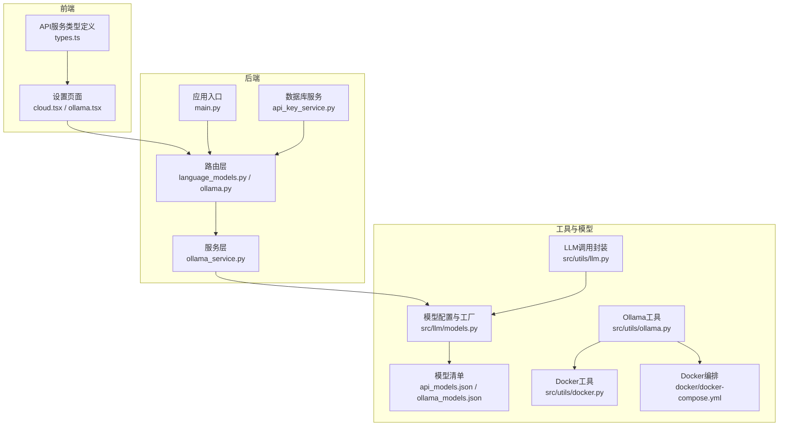
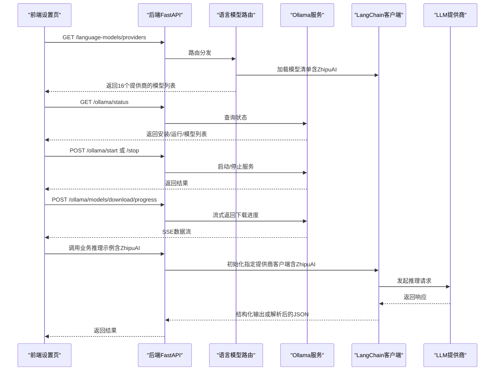
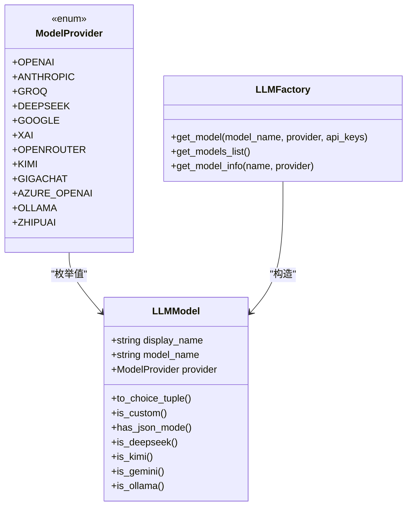
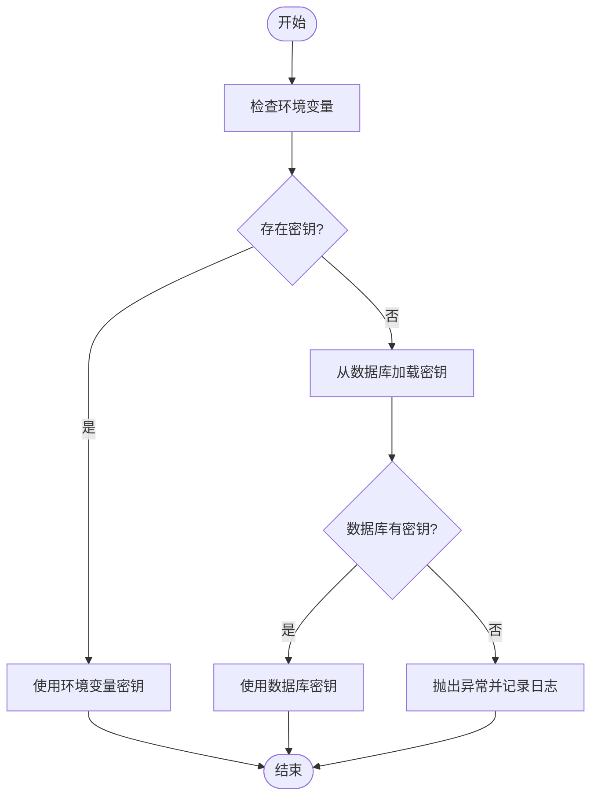
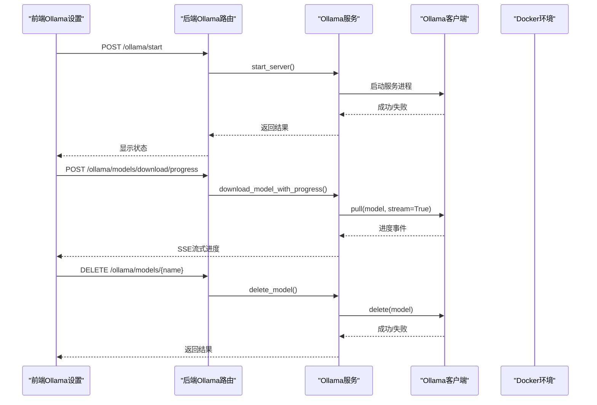
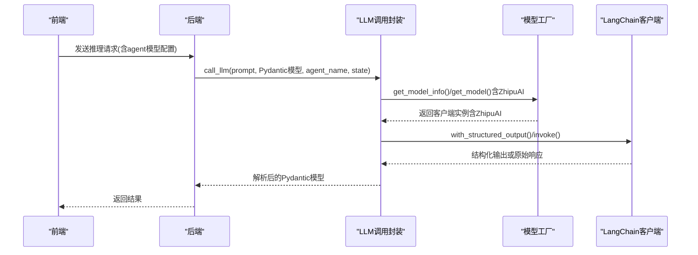
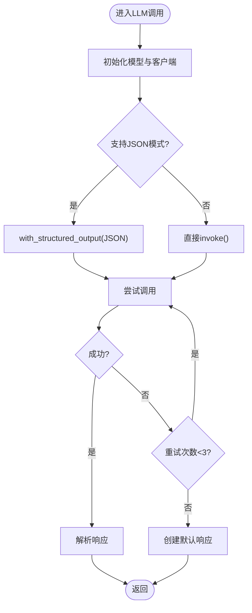
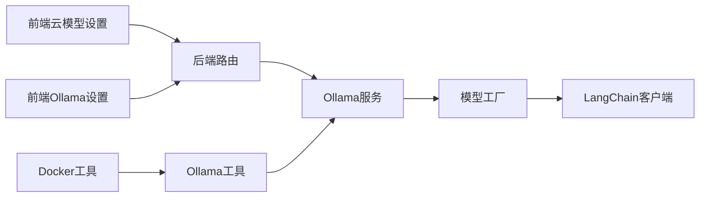

# LLM服务集成

<cite>
**本文档引用的文件**
- [src/llm/models.py](file://src/llm/models.py)
- [src/utils/llm.py](file://src/utils/llm.py)
- [app/backend/services/ollama_service.py](file://app/backend/services/ollama_service.py)
- [src/utils/ollama.py](file://src/utils/ollama.py)
- [app/backend/routes/language_models.py](file://app/backend/routes/language_models.py)
- [app/backend/routes/ollama.py](file://app/backend/routes/ollama.py)
- [src/llm/api_models.json](file://src/llm/api_models.json)
- [src/llm/ollama_models.json](file://src/llm/ollama_models.json)
- [src/utils/docker.py](file://src/utils/docker.py)
- [docker/docker-compose.yml](file://docker/docker-compose.yml)
- [app/backend/main.py](file://app/backend/main.py)
- [app/frontend/src/components/settings/models/cloud.tsx](file://app/frontend/src/components/settings/models/cloud.tsx)
- [app/frontend/src/components/settings/models/ollama.tsx](file://app/frontend/src/components/settings/models/ollama.tsx)
- [app/frontend/src/services/types.ts](file://app/frontend/src/services/types.ts)
- [app/frontend/src/services/api-keys-api.ts](file://app/frontend/src/services/api-keys-api.ts)
- [app/backend/services/api_key_service.py](file://app/backend/services/api_key_service.py)
- [pyproject.toml](file://pyproject.toml)
- [poetry.lock](file://poetry.lock)
</cite>

## 更新摘要
**变更内容**
- 新增ZhipuAI模型支持，包括GLM-4系列模型的完整集成
- 增强LangChain社区集成，支持更多第三方模型提供商
- 更新模型提供商列表，新增ZhipuAI作为第16个支持的提供商
- 添加ZhipuAI API密钥管理机制和错误处理策略
- 扩展模型配置文件，包含3个ZhipuAI模型选项

## 目录
1. [简介](#简介)
2. [项目结构](#项目结构)
3. [核心组件](#核心组件)
4. [架构总览](#架构总览)
5. [详细组件分析](#详细组件分析)
6. [依赖关系分析](#依赖关系分析)
7. [性能考虑](#性能考虑)
8. [故障排查指南](#故障排查指南)
9. [结论](#结论)

## 简介
本技术文档面向AI对冲基金项目的LLM服务集成，系统性说明LangChain集成方案、多提供商客户端初始化与配置、API密钥管理机制、Ollama本地部署集成（含Docker配置）、统一LLM接口设计、服务配置与超时处理、以及故障转移与重试机制。文档同时覆盖前后端交互流程、状态管理与进度展示，并提供可操作的排障建议。**最新更新**：新增ZhipuAI模型支持和LangChain社区集成增强，现已支持16个主流LLM提供商。

## 项目结构
项目采用前后端分离架构，后端使用FastAPI提供REST接口，前端使用React构建用户界面。LLM相关能力主要集中在后端服务层与工具模块中，前端通过HTTP接口调用后端能力。

**图表来源**
- [app/backend/main.py:1-56](file://app/backend/main.py#L1-L56)
- [app/backend/routes/language_models.py:1-62](file://app/backend/routes/language_models.py#L1-L62)
- [app/backend/routes/ollama.py:1-319](file://app/backend/routes/ollama.py#L1-L319)
- [app/backend/services/ollama_service.py:1-519](file://app/backend/services/ollama_service.py#L1-L519)
- [src/utils/llm.py:1-148](file://src/utils/llm.py#L1-L148)
- [src/llm/models.py:1-269](file://src/llm/models.py#L1-L269)
- [src/llm/api_models.json:1-102](file://src/llm/api_models.json#L1-L102)
- [src/llm/ollama_models.json:1-57](file://src/llm/ollama_models.json#L1-L57)
- [src/utils/ollama.py:1-408](file://src/utils/ollama.py#L1-L408)
- [src/utils/docker.py:1-124](file://src/utils/docker.py#L1-L124)
- [docker/docker-compose.yml:1-95](file://docker/docker-compose.yml#L1-L95)

**章节来源**
- [app/backend/main.py:1-56](file://app/backend/main.py#L1-L56)
- [app/backend/routes/language_models.py:1-62](file://app/backend/routes/language_models.py#L1-L62)
- [app/backend/routes/ollama.py:1-319](file://app/backend/routes/ollama.py#L1-L319)

## 核心组件
- **模型工厂与配置**：负责从JSON清单加载可用模型，按提供商生成LangChain客户端实例，支持16种云厂商与Ollama本地模型。
- **LLM调用封装**：统一LLM调用入口，内置重试、结构化输出、非JSON模型的JSON提取逻辑。
- **Ollama服务**：封装Ollama安装检测、服务器启停、模型下载/删除、进度流式返回等能力。
- **前后端集成**：后端提供REST接口，前端通过HTTP请求获取模型列表、管理Ollama状态与进度；API密钥通过数据库服务集中管理。

**章节来源**
- [src/llm/models.py:142-269](file://src/llm/models.py#L142-L269)
- [src/utils/llm.py:10-148](file://src/utils/llm.py#L10-L148)
- [app/backend/services/ollama_service.py:19-519](file://app/backend/services/ollama_service.py#L19-L519)

## 架构总览
下图展示了从前端到后端再到LLM提供商的整体调用链路，以及本地Ollama与云端模型的并行接入方式。**新增**：ZhipuAI模型现已完全集成到架构中。

**图表来源**
- [app/backend/routes/language_models.py:13-62](file://app/backend/routes/language_models.py#L13-L62)
- [app/backend/routes/ollama.py:41-319](file://app/backend/routes/ollama.py#L41-L319)
- [app/backend/services/ollama_service.py:34-151](file://app/backend/services/ollama_service.py#L34-L151)
- [src/utils/llm.py:10-84](file://src/utils/llm.py#L10-L84)

## 详细组件分析

### LangChain集成与多提供商客户端初始化
- **支持提供商**：OpenAI、Anthropic、Groq、DeepSeek、Google、xAI、OpenRouter、Kimi、GigaChat、Azure OpenAI、Ollama、**ZhipuAI**等16个提供商。
- **客户端初始化策略**：
  - 云厂商：优先从环境变量读取API密钥，若未提供则从数据库API密钥服务注入；部分提供商支持自定义base_url。
  - **ZhipuAI集成**：新增ZhipuAI支持，通过ChatZhipuAI类初始化，支持GLM-4系列模型（GLM-4 Plus、GLM-4 Air、GLM-4 Flash）。
  - Ollama：通过环境变量OLLAMA_BASE_URL或OLLAMA_HOST确定服务地址，默认http://localhost:11434。
  - Azure OpenAI：需要同时提供API密钥、端点与部署名称。
- **JSON模式支持**：根据模型能力判断是否启用结构化输出（JSON模式），不支持的模型自动从响应中提取JSON。

**图表来源**
- [src/llm/models.py:17-36](file://src/llm/models.py#L17-L36)
- [src/llm/models.py:36-78](file://src/llm/models.py#L36-L78)
- [src/llm/models.py:142-269](file://src/llm/models.py#L142-L269)

**章节来源**
- [src/llm/models.py:142-269](file://src/llm/models.py#L142-L269)
- [src/llm/api_models.json:1-102](file://src/llm/api_models.json#L1-L102)
- [src/llm/ollama_models.json:1-57](file://src/llm/ollama_models.json#L1-L57)

### API密钥管理机制
- **环境变量读取**：优先从环境变量获取各提供商API密钥，如OPENAI_API_KEY、GROQ_API_KEY、**ZHIPUAI_API_KEY**等。
- **数据库存储**：后端提供API密钥服务，将密钥持久化至数据库，按提供商聚合为字典供请求使用。
- **错误处理**：当密钥缺失时抛出明确异常并打印错误信息，避免静默失败。

**图表来源**
- [src/llm/models.py:142-269](file://src/llm/models.py#L142-L269)
- [app/backend/services/api_key_service.py:12-23](file://app/backend/services/api_key_service.py#L12-L23)

**章节来源**
- [src/llm/models.py:142-269](file://src/llm/models.py#L142-L269)
- [app/backend/services/api_key_service.py:12-23](file://app/backend/services/api_key_service.py#L12-L23)
- [app/frontend/src/services/api-keys-api.ts:1-96](file://app/frontend/src/services/api-keys-api.ts#L1-L96)

### Ollama本地部署集成
- **本地安装与检测**：通过命令行检测安装状态与服务运行状态，支持macOS/Linux/Windows平台。
- **服务器启停**：后端提供启动/停止接口，内部通过子进程管理服务生命周期。
- **模型管理**：支持下载、删除、进度查询；下载过程通过SSE流式返回进度。
- **Docker集成**：在容器环境中通过环境变量OLLAMA_BASE_URL指向宿主机或容器内的Ollama服务，提供远程模型拉取与删除能力。

**图表来源**
- [app/backend/routes/ollama.py:57-319](file://app/backend/routes/ollama.py#L57-L319)
- [app/backend/services/ollama_service.py:57-151](file://app/backend/services/ollama_service.py#L57-L151)
- [src/utils/ollama.py:83-358](file://src/utils/ollama.py#L83-L358)
- [src/utils/docker.py:8-124](file://src/utils/docker.py#L8-L124)

**章节来源**
- [app/backend/routes/ollama.py:1-319](file://app/backend/routes/ollama.py#L1-L319)
- [app/backend/services/ollama_service.py:19-519](file://app/backend/services/ollama_service.py#L19-L519)
- [src/utils/ollama.py:1-408](file://src/utils/ollama.py#L1-L408)
- [src/utils/docker.py:1-124](file://src/utils/docker.py#L1-L124)
- [docker/docker-compose.yml:1-95](file://docker/docker-compose.yml#L1-L95)

### 统一LLM接口设计
- **模型选择**：前端通过后端提供的模型列表进行选择，后端将云模型与本地Ollama模型合并返回。**新增**：现支持16个提供商的模型选择。
- **参数传递**：请求体包含全局模型配置与代理特定模型配置，后端从状态对象中提取模型名与提供商。
- **响应处理**：优先使用结构化输出（JSON模式），对不支持的模型自动从Markdown格式响应中提取JSON。

**图表来源**
- [src/utils/llm.py:10-84](file://src/utils/llm.py#L10-L84)
- [src/llm/models.py:118-140](file://src/llm/models.py#L118-L140)
- [app/frontend/src/services/types.ts:9-13](file://app/frontend/src/services/types.ts#L9-L13)

**章节来源**
- [src/utils/llm.py:10-148](file://src/utils/llm.py#L10-L148)
- [src/llm/models.py:118-140](file://src/llm/models.py#L118-L140)
- [app/frontend/src/services/types.ts:1-83](file://app/frontend/src/services/types.ts#L1-L83)

### 服务配置、连接池与超时处理
- **后端应用**：FastAPI应用在启动时检查Ollama可用性并记录日志，配置CORS允许前端访问。
- **Ollama客户端**：后端使用同步/异步客户端分别处理状态查询与模型下载，异步客户端用于SSE流式传输。
- **超时控制**：Ollama工具模块在HTTP请求中设置超时时间，避免阻塞；Docker环境中的模型拉取轮询设置最大等待时间。
- **连接池**：LangChain客户端默认行为满足一般场景；如需高并发可结合外部连接池或限流策略。

**章节来源**
- [app/backend/main.py:32-56](file://app/backend/main.py#L32-L56)
- [app/backend/services/ollama_service.py:26-28](file://app/backend/services/ollama_service.py#L26-L28)
- [src/utils/ollama.py:61-64](file://src/utils/ollama.py#L61-L64)
- [src/utils/docker.py:84-105](file://src/utils/docker.py#L84-L105)

### 故障转移、重试机制与性能监控
- **重试机制**：LLM调用封装内置最多3次重试，异常时更新进度状态并回退到安全默认响应。
- **故障转移**：当前实现以重试为主；可扩展为多提供商备选（在模型工厂中增加备选逻辑）。
- **性能监控**：后端记录Ollama状态与模型可用数量；前端显示下载进度与状态徽章，便于用户感知。

**图表来源**
- [src/utils/llm.py:10-84](file://src/utils/llm.py#L10-L84)

**章节来源**
- [src/utils/llm.py:10-148](file://src/utils/llm.py#L10-L148)

## 依赖关系分析
- **模块耦合**：
  - 路由层依赖服务层；服务层依赖模型工厂与LangChain客户端。
  - 工具模块（ollama.py、docker.py）被服务层与前端脚本复用。
  - 前端设置页通过HTTP接口与后端交互，不直接依赖后端实现细节。
- **外部依赖**：
  - LangChain生态客户端（OpenAI、Anthropic、Groq、Google、xAI、GigaChat、Azure OpenAI、Ollama、**ZhipuAI**）。
  - **LangChain社区集成**：新增langchain-community包支持更多第三方模型提供商。
  - Ollama Python SDK与HTTP API。
  - FastAPI、SQLAlchemy（API密钥存储）。

**图表来源**
- [app/backend/routes/language_models.py:13-62](file://app/backend/routes/language_models.py#L13-L62)
- [app/backend/routes/ollama.py:41-319](file://app/backend/routes/ollama.py#L41-L319)
- [app/backend/services/ollama_service.py:19-519](file://app/backend/services/ollama_service.py#L19-L519)
- [src/llm/models.py:142-269](file://src/llm/models.py#L142-L269)
- [src/utils/ollama.py:1-408](file://src/utils/ollama.py#L1-L408)
- [src/utils/docker.py:1-124](file://src/utils/docker.py#L1-L124)

**章节来源**
- [app/backend/routes/language_models.py:1-62](file://app/backend/routes/language_models.py#L1-L62)
- [app/backend/routes/ollama.py:1-319](file://app/backend/routes/ollama.py#L1-L319)
- [app/backend/services/ollama_service.py:19-519](file://app/backend/services/ollama_service.py#L19-L519)

## 性能考虑
- **并发与流式**：Ollama下载使用SSE流式返回，避免长时间阻塞；前端按模型维度跟踪进度。
- **超时与重试**：工具模块设置合理超时，避免长时间等待；LLM调用封装内置重试，提升鲁棒性。
- **本地加速**：Ollama在本地运行可显著降低网络延迟；Docker环境下通过环境变量正确配置服务地址。
- **扩展建议**：高并发场景可引入连接池、限流与缓存；对大模型下载可考虑断点续传与镜像加速。
- **ZhipuAI优化**：GLM-4系列模型具有优秀的中文理解和推理能力，适合中国市场应用场景。

## 故障排查指南
- **Ollama未安装/未运行**
  - 症状：后端启动日志提示未安装或未运行。
  - 排查：检查系统是否安装Ollama，确认服务已启动；查看前端Ollama设置页状态。
  - 参考
    - [app/backend/main.py:32-56](file://app/backend/main.py#L32-L56)
    - [src/utils/ollama.py:37-112](file://src/utils/ollama.py#L37-L112)
- **密钥缺失**
  - 症状：调用云模型时报错"API Key not found"。
  - 排查：确认环境变量或数据库API密钥已正确配置；检查提供商名称与密钥是否匹配。**新增**：ZhipuAI需要设置ZHIPUAI_API_KEY环境变量。
  - 参考
    - [src/llm/models.py:142-269](file://src/llm/models.py#L142-L269)
    - [app/backend/services/api_key_service.py:12-23](file://app/backend/services/api_key_service.py#L12-L23)
- **Docker环境模型不可用**
  - 症状：容器内无法拉取/删除模型。
  - 排查：确认OLLAMA_BASE_URL指向正确的容器或宿主机地址；检查网络连通性与权限。
  - 参考
    - [docker/docker-compose.yml:28](file://docker/docker-compose.yml#L28)
    - [src/utils/docker.py:8-124](file://src/utils/docker.py#L8-L124)
- **下载进度异常**
  - 症状：SSE流中断或进度停滞。
  - 排查：检查后端日志与前端轮询逻辑；确认Ollama服务正常运行且磁盘空间充足。
  - 参考
    - [app/backend/routes/ollama.py:158-195](file://app/backend/routes/ollama.py#L158-L195)
    - [app/backend/services/ollama_service.py:405-441](file://app/backend/services/ollama_service.py#L405-L441)
- **ZhipuAI模型调用失败**
  - 症状：调用ZhipuAI模型时报错"ZhipuAI API key not found"。
  - 排查：确认已设置ZHIPUAI_API_KEY环境变量；检查API密钥有效性；确认所选模型在ZhipuAI平台可用。
  - 参考
    - [src/llm/models.py:259-264](file://src/llm/models.py#L259-L264)
    - [src/llm/api_models.json:88-101](file://src/llm/api_models.json#L88-L101)

**章节来源**
- [app/backend/main.py:32-56](file://app/backend/main.py#L32-L56)
- [src/utils/ollama.py:37-112](file://src/utils/ollama.py#L37-L112)
- [docker/docker-compose.yml:28](file://docker/docker-compose.yml#L28)
- [src/utils/docker.py:8-124](file://src/utils/docker.py#L8-L124)
- [app/backend/routes/ollama.py:158-195](file://app/backend/routes/ollama.py#L158-L195)
- [app/backend/services/ollama_service.py:405-441](file://app/backend/services/ollama_service.py#L405-L441)
- [src/llm/models.py:259-264](file://src/llm/models.py#L259-L264)
- [src/llm/api_models.json:88-101](file://src/llm/api_models.json#L88-L101)

## 结论
本项目通过LangChain统一抽象多提供商LLM接入，结合本地Ollama与云端模型，形成灵活的推理服务架构。**最新增强**：现已支持16个主流LLM提供商，包括新增的ZhipuAI模型支持和LangChain社区集成增强。后端提供完善的模型管理、状态监控与流式进度能力，前端通过直观界面完成模型选择与运维操作。API密钥管理与错误处理策略确保了系统的可靠性与安全性。后续可在多提供商备选、连接池优化与性能监控方面进一步增强，为AI对冲基金提供更强大的智能决策支持。