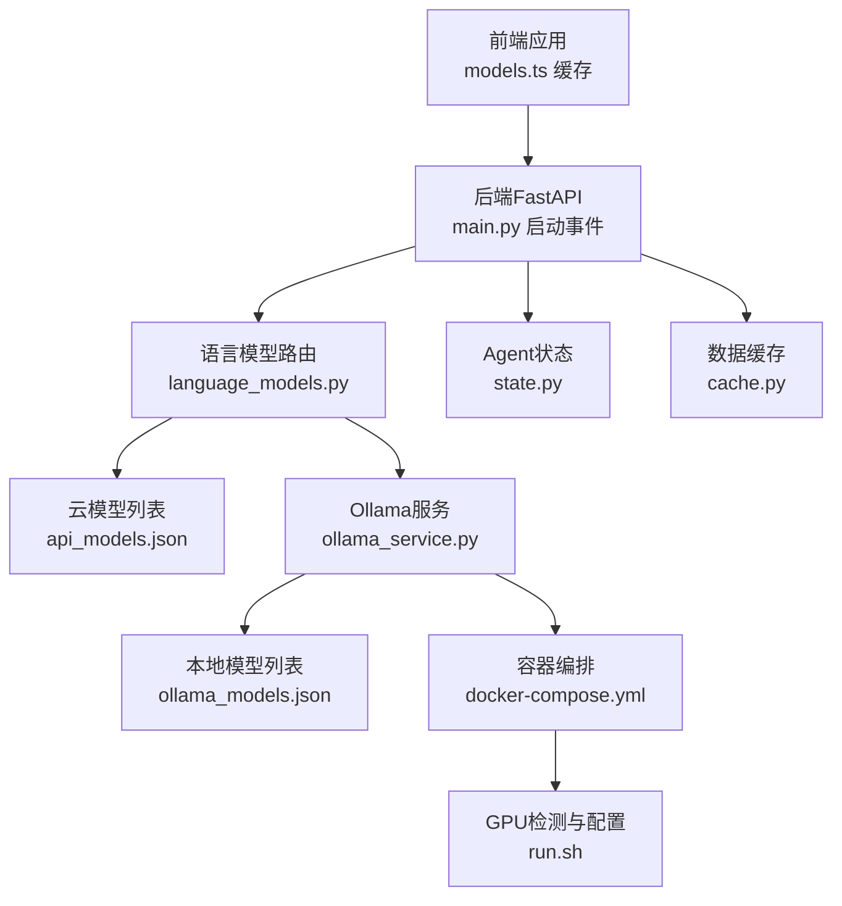
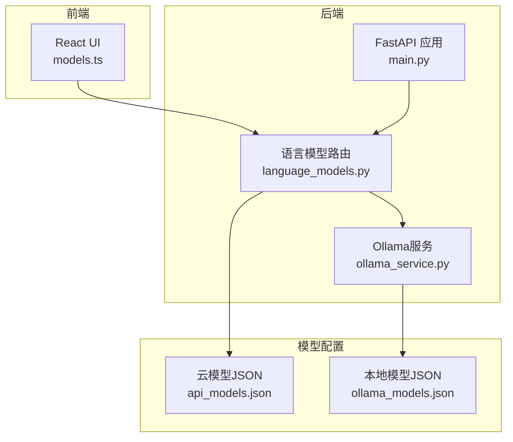
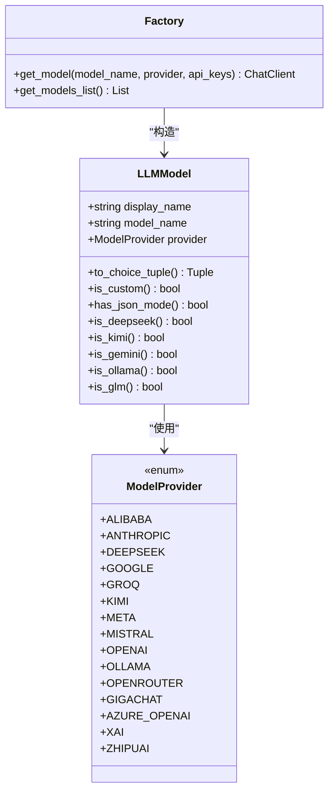
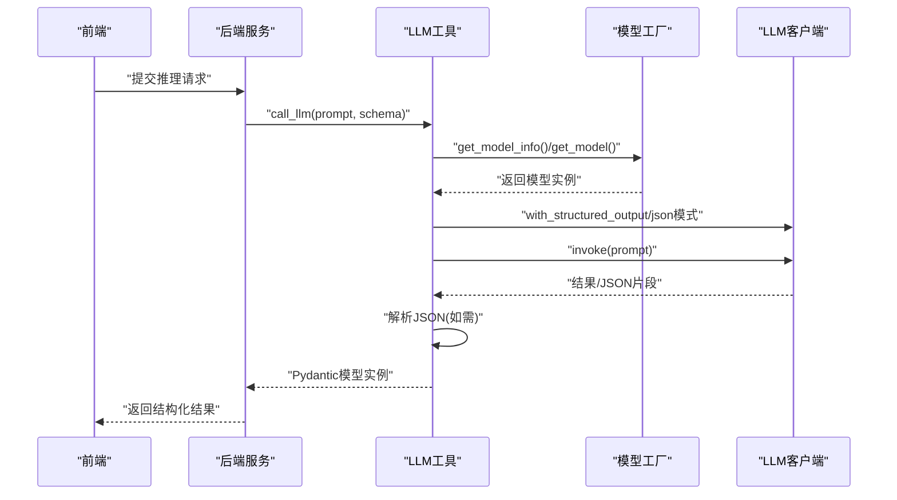
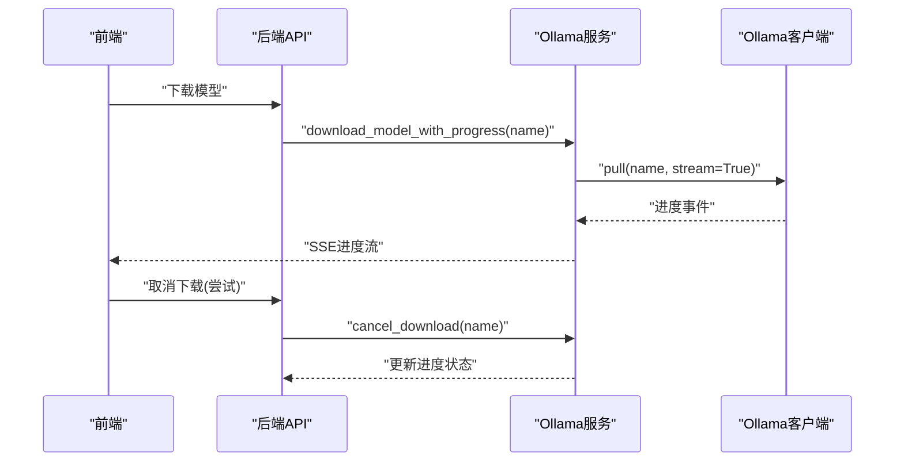
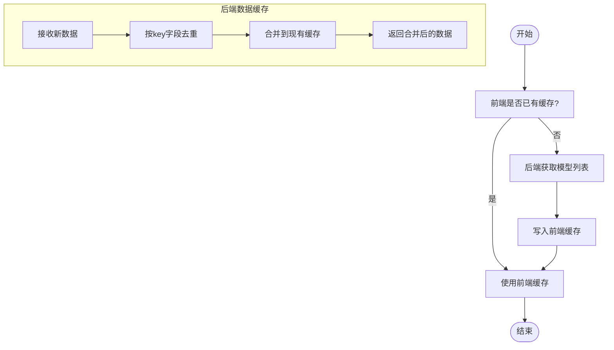
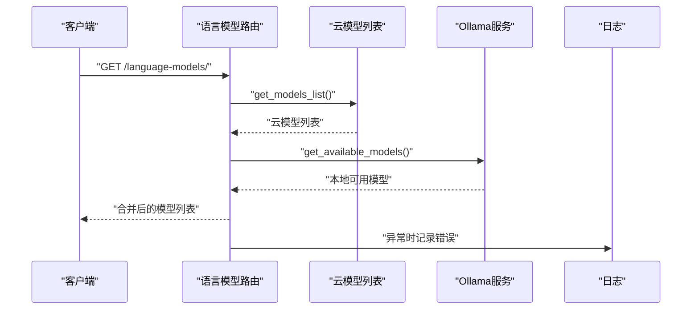
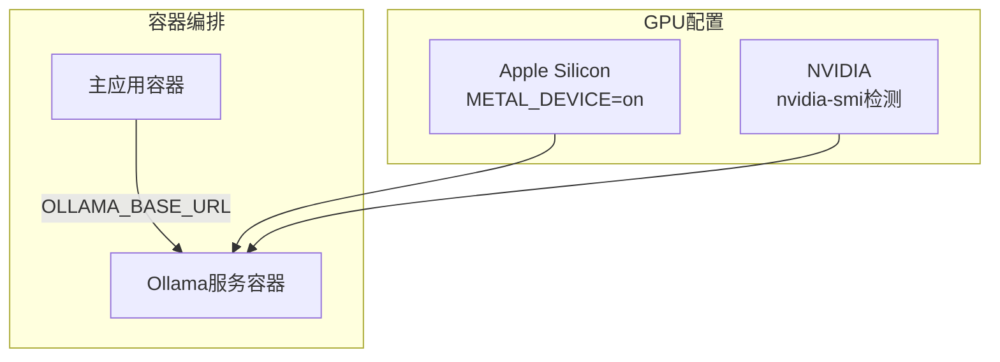
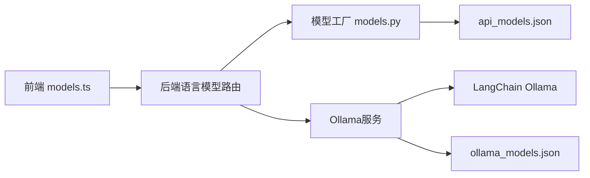

# 推理优化

<cite>
**本文引用的文件**
- [src/llm/models.py](file://src/llm/models.py)
- [src/utils/llm.py](file://src/utils/llm.py)
- [app/backend/services/ollama_service.py](file://app/backend/services/ollama_service.py)
- [src/data/cache.py](file://src/data/cache.py)
- [app/backend/routes/language_models.py](file://app/backend/routes/language_models.py)
- [app/backend/main.py](file://app/backend/main.py)
- [src/llm/api_models.json](file://src/llm/api_models.json)
- [src/llm/ollama_models.json](file://src/llm/ollama_models.json)
- [src/graph/state.py](file://src/graph/state.py)
- [src/backtesting/controller.py](file://src/backtesting/controller.py)
- [app/frontend/src/data/models.ts](file://app/frontend/src/data/models.ts)
- [src/utils/docker.py](file://src/utils/docker.py)
- [docker/docker-compose.yml](file://docker/docker-compose.yml)
- [docker/run.sh](file://docker/run.sh)
</cite>

## 目录
1. [引言](#引言)
2. [项目结构](#项目结构)
3. [核心组件](#核心组件)
4. [架构总览](#架构总览)
5. [详细组件分析](#详细组件分析)
6. [依赖分析](#依赖分析)
7. [性能考虑](#性能考虑)
8. [故障排查指南](#故障排查指南)
9. [结论](#结论)
10. [附录](#附录)

## 引言
本技术文档聚焦于推理优化，围绕LLM（大语言模型）在本项目中的性能优化策略展开，涵盖以下主题：
- 批量处理与并发控制：通过异步接口、并发下载与流式进度、以及状态化数据结构提升吞吐与稳定性
- 缓存机制：前端与后端双层缓存，避免重复请求与模型列表抖动
- 模型选择优化：统一模型抽象、按能力特性（如JSON模式支持）自动适配输出方式
- 上下文长度与令牌控制：通过统一的AgentState消息结构与提示工程实践进行上下文管理
- 成本效益分析：多供应商接入与本地Ollama推理路径，结合速率限制与重试策略
- 负载均衡与故障隔离：后端路由聚合云模型与本地模型，Ollama服务独立封装，异常隔离
- 内存管理与GPU加速：容器编排中针对Apple Silicon与NVIDIA GPU的配置
- 性能监控与延迟优化：日志记录、错误处理与重试、进度流与超时控制

## 项目结构
该项目采用前后端分离与模块化设计，推理优化相关的关键位置如下：
- 后端FastAPI应用：负责模型列表聚合、Ollama服务集成与启动事件检查
- 前端React应用：模型列表缓存、默认模型选择
- LLM模型抽象与配置：统一模型枚举、模型信息加载与实例化
- 数据缓存：通用内存缓存，用于历史数据去重合并
- Ollama服务：封装安装检测、服务启停、模型下载/删除与进度流
- 容器与GPU：Docker编排与GPU配置脚本

**图表来源**
- [app/backend/main.py:32-56](file://app/backend/main.py#L32-L56)
- [app/backend/routes/language_models.py:20-33](file://app/backend/routes/language_models.py#L20-L33)
- [src/llm/models.py:106-122](file://src/llm/models.py#L106-L122)
- [app/backend/services/ollama_service.py:34-56](file://app/backend/services/ollama_service.py#L34-L56)
- [src/llm/api_models.json:1-102](file://src/llm/api_models.json#L1-L102)
- [src/llm/ollama_models.json:1-57](file://src/llm/ollama_models.json#L1-L57)
- [src/graph/state.py:15-19](file://src/graph/state.py#L15-L19)
- [src/data/cache.py:1-72](file://src/data/cache.py#L1-L72)
- [docker/docker-compose.yml:1-54](file://docker/docker-compose.yml#L1-L54)
- [docker/run.sh:149-173](file://docker/run.sh#L149-L173)

**章节来源**
- [app/backend/main.py:15-56](file://app/backend/main.py#L15-L56)
- [app/backend/routes/language_models.py:8-62](file://app/backend/routes/language_models.py#L8-L62)
- [src/llm/models.py:18-122](file://src/llm/models.py#L18-L122)
- [app/backend/services/ollama_service.py:19-519](file://app/backend/services/ollama_service.py#L19-L519)
- [src/llm/api_models.json:1-102](file://src/llm/api_models.json#L1-L102)
- [src/llm/ollama_models.json:1-57](file://src/llm/ollama_models.json#L1-L57)
- [src/graph/state.py:15-52](file://src/graph/state.py#L15-L52)
- [src/data/cache.py:1-72](file://src/data/cache.py#L1-L72)
- [docker/docker-compose.yml:1-54](file://docker/docker-compose.yml#L1-L54)
- [docker/run.sh:149-173](file://docker/run.sh#L149-L173)

## 核心组件
- 模型抽象与工厂
  - 统一的模型枚举与模型信息类，支持从JSON加载、转换为UI选项、判断是否支持JSON模式等
  - 工厂方法根据提供商返回对应LangChain客户端实例，并注入API Key或基础URL
- LLM调用封装
  - 自动识别模型JSON模式支持，非支持模型时采用结构化输出与手动JSON提取
  - 支持重试与默认回退响应，保障稳定性
- Ollama服务
  - 封装安装检测、服务启停、模型下载/删除与进度流；支持跨平台进程管理
  - 提供可用模型列表，仅返回已下载且推荐的模型
- 前后端缓存
  - 前端缓存模型列表，避免重复请求
  - 后端缓存历史数据，按字段去重合并，降低重复计算与IO
- Agent状态
  - 统一的消息与元数据结构，便于在多智能体流程中传递上下文与配置

**章节来源**
- [src/llm/models.py:18-270](file://src/llm/models.py#L18-L270)
- [src/utils/llm.py:10-148](file://src/utils/llm.py#L10-L148)
- [app/backend/services/ollama_service.py:19-519](file://app/backend/services/ollama_service.py#L19-L519)
- [app/frontend/src/data/models.ts:16-42](file://app/frontend/src/data/models.ts#L16-L42)
- [src/data/cache.py:1-72](file://src/data/cache.py#L1-L72)
- [src/graph/state.py:15-52](file://src/graph/state.py#L15-L52)

## 架构总览
推理优化的整体架构由“前端缓存 + 后端聚合 + 模型工厂 + Ollama服务”构成，后端在启动时检查Ollama可用性，路由层聚合云模型与本地模型，提供统一的模型列表接口。

**图表来源**
- [app/backend/main.py:32-56](file://app/backend/main.py#L32-L56)
- [app/backend/routes/language_models.py:20-33](file://app/backend/routes/language_models.py#L20-L33)
- [src/llm/api_models.json:1-102](file://src/llm/api_models.json#L1-L102)
- [app/backend/services/ollama_service.py:124-151](file://app/backend/services/ollama_service.py#L124-L151)
- [src/llm/ollama_models.json:1-57](file://src/llm/ollama_models.json#L1-L57)

## 详细组件分析

### 组件A：模型工厂与选择优化
- 统一模型抽象
  - 使用枚举定义支持的提供商，模型类包含显示名、模型名与提供商
  - JSON加载与UI选项转换，便于前端展示
- JSON模式支持判定
  - 针对不同提供商与模型类型，判断是否支持结构化输出（JSON模式）
  - 对不支持的模型，采用结构化输出+手动JSON提取的组合策略
- 工厂方法
  - 根据提供商返回对应的LangChain客户端实例
  - 注入API Key或基础URL，支持多种云与本地提供商
- 动态模型切换
  - 通过AgentState与请求对象提取模型配置，优先使用代理特定配置，否则回退到系统默认
  - 在LLM调用封装中自动应用模型能力特性，减少上层逻辑复杂度

**图表来源**
- [src/llm/models.py:18-122](file://src/llm/models.py#L18-L122)
- [src/llm/models.py:148-270](file://src/llm/models.py#L148-L270)

**章节来源**
- [src/llm/models.py:18-270](file://src/llm/models.py#L18-L270)
- [src/utils/llm.py:124-148](file://src/utils/llm.py#L124-L148)

### 组件B：LLM调用封装与重试策略
- 结构化输出与JSON提取
  - 对支持JSON模式的模型直接使用结构化输出
  - 对不支持的模型，调用后解析响应中的JSON片段并反序列化
- 重试与默认回退
  - 多次尝试失败后，依据模型字段类型生成安全默认值，保证系统可用性
- 进度与状态更新
  - 在代理调用过程中更新进度状态，便于前端反馈

**图表来源**
- [src/utils/llm.py:10-85](file://src/utils/llm.py#L10-L85)
- [src/llm/models.py:148-270](file://src/llm/models.py#L148-L270)

**章节来源**
- [src/utils/llm.py:10-148](file://src/utils/llm.py#L10-L148)

### 组件C：Ollama服务与并发下载
- 并发与异步
  - 使用异步客户端执行模型拉取与删除，避免阻塞主线程
  - 下载过程以流式事件形式返回进度，前端可实时渲染
- 进程管理与跨平台
  - 跨平台启动/停止Ollama服务进程，支持SIGTERM/SIGKILL优雅终止
- 可用模型过滤
  - 仅返回已下载且在推荐列表中的模型，确保API可用性

**图表来源**
- [app/backend/services/ollama_service.py:93-173](file://app/backend/services/ollama_service.py#L93-L173)
- [app/backend/services/ollama_service.py:405-441](file://app/backend/services/ollama_service.py#L405-L441)

**章节来源**
- [app/backend/services/ollama_service.py:19-519](file://app/backend/services/ollama_service.py#L19-L519)

### 组件D：缓存机制与上下文长度优化
- 前端缓存
  - 模型列表缓存，避免重复请求；默认模型选择从缓存中查找
- 后端数据缓存
  - 价格、财务指标、明细、内部人交易、公司新闻等历史数据缓存
  - 基于关键字段去重合并，避免重复计算与IO
- 上下文长度与令牌控制
  - AgentState统一承载messages与data/metadata，便于在流程中裁剪与拼接上下文
  - 在提示工程层面控制输入长度，结合缓存减少重复检索

**图表来源**
- [app/frontend/src/data/models.ts:16-28](file://app/frontend/src/data/models.ts#L16-L28)
- [src/data/cache.py:11-22](file://src/data/cache.py#L11-L22)

**章节来源**
- [app/frontend/src/data/models.ts:16-42](file://app/frontend/src/data/models.ts#L16-L42)
- [src/data/cache.py:1-72](file://src/data/cache.py#L1-L72)
- [src/graph/state.py:15-19](file://src/graph/state.py#L15-L19)

### 组件E：负载均衡与故障隔离
- 路由聚合
  - 语言模型路由同时返回云模型与Ollama本地模型，形成统一入口
- 故障隔离
  - Ollama服务独立封装，异常不影响主业务；启动事件中检查Ollama状态
- 速率限制与重试
  - LLM调用封装内置重试与默认回退；外部数据客户端具备429重试策略

**图表来源**
- [app/backend/routes/language_models.py:20-33](file://app/backend/routes/language_models.py#L20-L33)
- [app/backend/main.py:32-56](file://app/backend/main.py#L32-L56)

**章节来源**
- [app/backend/routes/language_models.py:8-62](file://app/backend/routes/language_models.py#L8-L62)
- [app/backend/main.py:32-56](file://app/backend/main.py#L32-L56)

### 组件F：内存管理、GPU加速与分布式推理
- 容器编排
  - Docker Compose启用Ollama服务，挂载持久化卷，暴露端口
  - 针对Apple Silicon与NVIDIA GPU分别设置环境变量与Compose配置文件
- GPU加速
  - Apple Silicon：启用Metal设备参数
  - NVIDIA：通过检测nvidia-smi自动附加GPU配置文件
- 分布式推理
  - 通过环境变量将后端指向Ollama容器地址，实现本地分布式推理

**图表来源**
- [docker/docker-compose.yml:1-54](file://docker/docker-compose.yml#L1-L54)
- [docker/run.sh:149-173](file://docker/run.sh#L149-L173)

**章节来源**
- [docker/docker-compose.yml:1-54](file://docker/docker-compose.yml#L1-L54)
- [docker/run.sh:149-173](file://docker/run.sh#L149-L173)

## 依赖分析
- 组件耦合
  - 后端路由依赖模型工厂与Ollama服务；Ollama服务依赖LangChain Ollama客户端
  - 前端依赖后端模型列表API，存在单点依赖风险，可通过缓存缓解
- 外部依赖
  - LangChain系列客户端、Ollama Python/HTTP客户端、FastAPI、Docker
- 循环依赖
  - 当前结构未发现循环导入；Ollama服务在格式化API响应时延迟导入模型列表，避免循环

**图表来源**
- [app/frontend/src/data/models.ts:16-28](file://app/frontend/src/data/models.ts#L16-L28)
- [app/backend/routes/language_models.py:20-33](file://app/backend/routes/language_models.py#L20-L33)
- [src/llm/models.py:106-122](file://src/llm/models.py#L106-L122)
- [app/backend/services/ollama_service.py:502-516](file://app/backend/services/ollama_service.py#L502-L516)

**章节来源**
- [app/frontend/src/data/models.ts:16-42](file://app/frontend/src/data/models.ts#L16-L42)
- [app/backend/routes/language_models.py:8-62](file://app/backend/routes/language_models.py#L8-L62)
- [src/llm/models.py:106-122](file://src/llm/models.py#L106-L122)
- [app/backend/services/ollama_service.py:502-516](file://app/backend/services/ollama_service.py#L502-L516)

## 性能考虑
- 批量处理与并发
  - 使用异步客户端与流式进度，避免阻塞；在下载与推理环节尽量并行化
  - 前端缓存减少重复请求，后端缓存减少重复IO
- 缓存策略
  - 前端模型列表缓存；后端历史数据缓存，按关键字段去重合并
- 模型选择与切换
  - 通过has_json_mode自动选择结构化输出路径，减少后处理开销
  - 代理特定模型配置优先，系统默认作为兜底，避免全局一致性问题
- 上下文与令牌控制
  - 使用AgentState统一承载消息与元数据，便于在流程中裁剪与拼接上下文
- 成本效益
  - 云模型与本地Ollama双通道，结合速率限制与重试策略，平衡成本与性能
- 内存与GPU
  - 容器编排中启用GPU加速参数，减少推理延迟；合理设置容器内存上限
- 监控与可观测性
  - 启动事件记录Ollama状态；LLM调用封装记录错误与重试；Ollama服务记录下载进度与异常

[本节为通用指导，无需具体文件分析]

## 故障排查指南
- Ollama不可用
  - 后端启动事件会检查安装与运行状态；若未安装或未运行，记录日志并提示用户
  - 前端模型列表可能为空，检查后端日志与网络连通性
- 模型下载失败
  - Ollama服务提供进度流与错误信息；确认服务器运行、磁盘空间与网络
  - 可尝试取消后重试，或检查镜像源与代理设置
- API Key缺失
  - 模型工厂在缺少必要Key时抛出明确错误；检查环境变量与密钥管理服务
- 速率限制
  - LLM调用封装内置重试；外部数据客户端对429进行指数退避重试
- 默认回退
  - 多次失败后返回默认响应，避免系统崩溃；可在上层捕获并记录

**章节来源**
- [app/backend/main.py:32-56](file://app/backend/main.py#L32-L56)
- [app/backend/services/ollama_service.py:34-56](file://app/backend/services/ollama_service.py#L34-L56)
- [src/utils/llm.py:76-84](file://src/utils/llm.py#L76-L84)
- [src/llm/models.py:148-270](file://src/llm/models.py#L148-L270)

## 结论
本项目在推理优化方面形成了“统一模型抽象 + 结构化输出 + 异步并发 + 缓存 + 本地Ollama”的完整闭环。通过前端与后端双层缓存、异步下载与进度流、自动模型能力适配与重试回退，有效提升了吞吐与稳定性；容器编排与GPU配置进一步降低了推理延迟。建议在生产环境中结合监控指标（如延迟、吞吐、错误率、重试次数、下载进度）持续迭代模型选择与上下文控制策略，以实现更优的成本效益。

[本节为总结，无需具体文件分析]

## 附录
- 关键实现路径参考
  - 模型工厂与JSON模式判定：[src/llm/models.py:53-63](file://src/llm/models.py#L53-L63)
  - LLM调用封装与重试：[src/utils/llm.py:10-85](file://src/utils/llm.py#L10-L85)
  - Ollama服务下载与进度流：[app/backend/services/ollama_service.py:405-441](file://app/backend/services/ollama_service.py#L405-L441)
  - 前端模型列表缓存：[app/frontend/src/data/models.ts:16-28](file://app/frontend/src/data/models.ts#L16-L28)
  - 后端数据缓存去重合并：[src/data/cache.py:11-22](file://src/data/cache.py#L11-L22)
  - Agent状态结构：[src/graph/state.py:15-19](file://src/graph/state.py#L15-L19)
  - 启动事件与Ollama检查：[app/backend/main.py:32-56](file://app/backend/main.py#L32-L56)
  - 容器与GPU配置：[docker/docker-compose.yml:1-54](file://docker/docker-compose.yml#L1-L54)，[docker/run.sh:149-173](file://docker/run.sh#L149-L173)