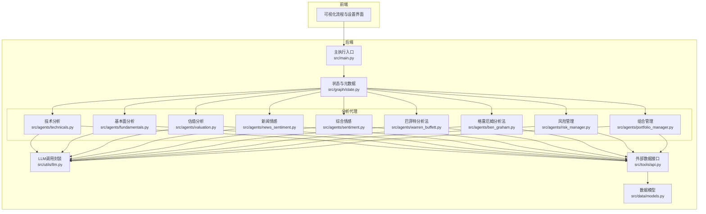
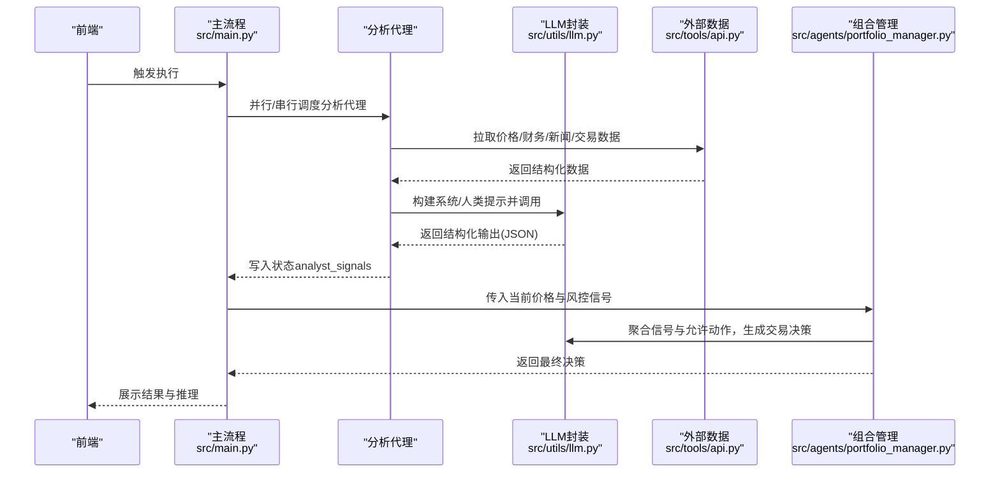
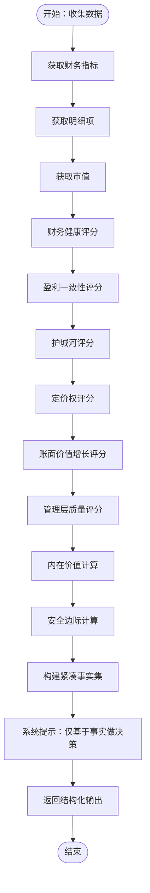
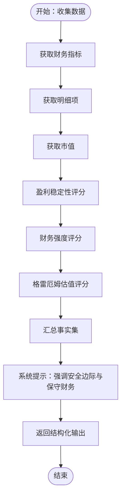
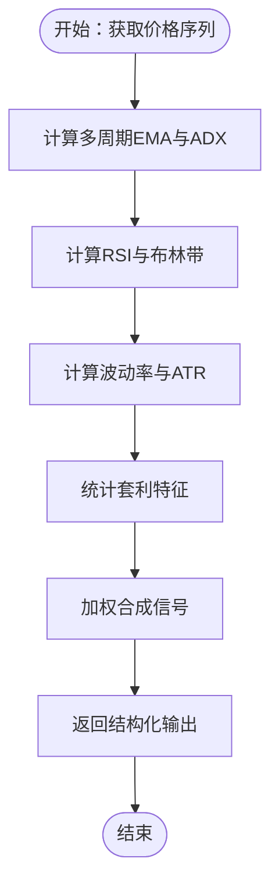
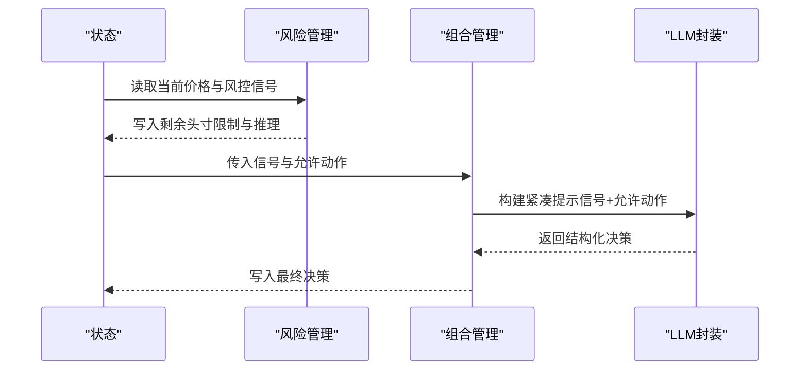
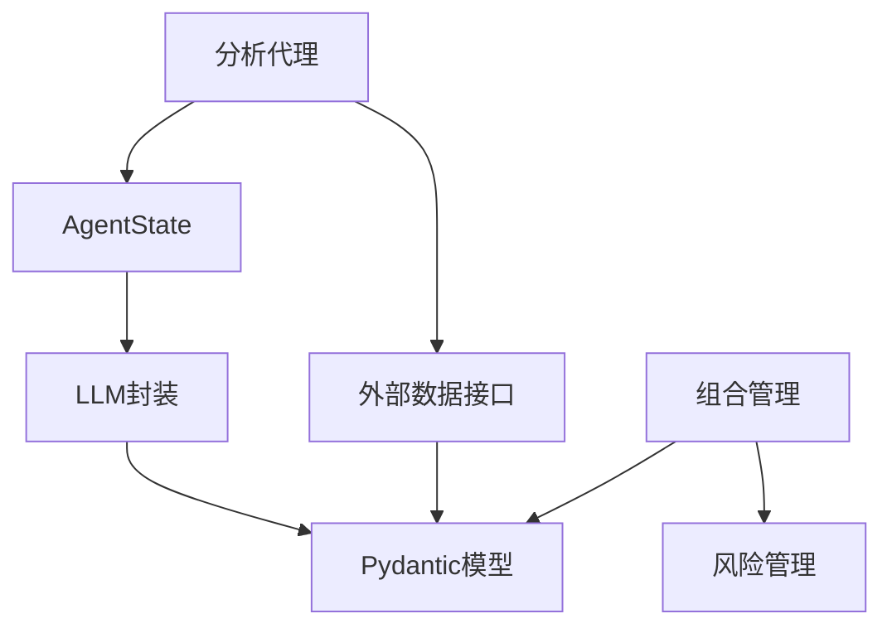

# 提示工程

<cite>
**本文引用的文件**
- [src/agents/warren_buffett.py](file://src/agents/warren_buffett.py)
- [src/agents/ben_graham.py](file://src/agents/ben_graham.py)
- [src/agents/technicals.py](file://src/agents/technicals.py)
- [src/agents/fundamentals.py](file://src/agents/fundamentals.py)
- [src/agents/valuation.py](file://src/agents/valuation.py)
- [src/agents/news_sentiment.py](file://src/agents/news_sentiment.py)
- [src/agents/sentiment.py](file://src/agents/sentiment.py)
- [src/agents/portfolio_manager.py](file://src/agents/portfolio_manager.py)
- [src/agents/risk_manager.py](file://src/agents/risk_manager.py)
- [src/graph/state.py](file://src/graph/state.py)
- [src/utils/llm.py](file://src/utils/llm.py)
- [src/tools/api.py](file://src/tools/api.py)
- [src/data/models.py](file://src/data/models.py)
- [src/main.py](file://src/main.py)
- [app/backend/models/schemas.py](file://app/backend/models/schemas.py)
- [src/utils/display.py](file://src/utils/display.py)
- [src/utils/progress.py](file://src/utils/progress.py)
</cite>

## 目录
1. [引言](#引言)
2. [项目结构](#项目结构)
3. [核心组件](#核心组件)
4. [架构总览](#架构总览)
5. [详细组件分析](#详细组件分析)
6. [依赖分析](#依赖分析)
7. [性能考量](#性能考量)
8. [故障排查指南](#故障排查指南)
9. [结论](#结论)
10. [附录](#附录)

## 引言
本技术文档聚焦于金融分析场景下的提示工程实践，系统梳理了巴菲特分析法、格雷厄姆分析法、技术分析与基本面分析的提示模板设计原则；阐述了上下文构建策略（股票数据、财务指标、新闻情感与市场环境的整合）；总结了JSON模式提示在结构化输出与数据解析中的应用；并给出了多智能体协作的提示协调机制（任务分解、结果聚合与冲突解决）。此外，文档还提供了提示优化技巧、A/B测试方法与效果评估指标，并强调金融术语标准化、风险提示与合规性注意事项。

## 项目结构
该项目采用“多智能体 + 图编排”的架构：前端通过可视化流程定义分析链路，后端以LangGraph状态机驱动各分析代理（技术面、基本面、估值、新闻情感、风险管理、组合管理），最终由组合管理代理进行统一决策与下单指令生成。提示工程贯穿于每个代理内部，结合结构化输出模型与统一的状态/元数据传递，形成可追踪、可解释、可回测的完整交易闭环。

图示来源
- [src/main.py:100-130](file://src/main.py#L100-L130)
- [src/graph/state.py:14-18](file://src/graph/state.py#L14-L18)
- [src/agents/technicals.py:35-157](file://src/agents/technicals.py#L35-L157)
- [src/agents/fundamentals.py:11-163](file://src/agents/fundamentals.py#L11-L163)
- [src/agents/valuation.py:21-220](file://src/agents/valuation.py#L21-L220)
- [src/agents/news_sentiment.py:25-164](file://src/agents/news_sentiment.py#L25-L164)
- [src/agents/sentiment.py:12-138](file://src/agents/sentiment.py#L12-L138)
- [src/agents/warren_buffett.py:19-153](file://src/agents/warren_buffett.py#L19-L153)
- [src/agents/ben_graham.py:20-94](file://src/agents/ben_graham.py#L20-L94)
- [src/agents/risk_manager.py:11-219](file://src/agents/risk_manager.py#L11-L219)
- [src/agents/portfolio_manager.py:25-93](file://src/agents/portfolio_manager.py#L25-L93)
- [src/utils/llm.py:10-84](file://src/utils/llm.py#L10-L84)
- [src/tools/api.py:63-366](file://src/tools/api.py#L63-L366)
- [src/data/models.py:18-175](file://src/data/models.py#L18-L175)

章节来源
- [src/main.py:100-130](file://src/main.py#L100-L130)
- [src/graph/state.py:14-18](file://src/graph/state.py#L14-L18)

## 核心组件
- 多智能体分析代理：技术面、基本面、估值、新闻情感、综合情感、巴菲特/格雷厄姆分析法、风险管理、组合管理。
- 统一状态与元数据：AgentState承载messages、data、metadata，支持进度跟踪、推理展示与模型配置注入。
- LLM调用封装：call_llm统一处理结构化输出、重试、默认值与非结构化模型的JSON提取。
- 数据接口：统一的外部数据获取与缓存，涵盖价格、财务指标、新闻、大股东交易等。
- 结构化输出：Pydantic模型作为JSON Schema约束，确保提示输出的稳定性与可解析性。
- 可视化与展示：格式化输出表格、实时进度条、推理日志打印。

章节来源
- [src/graph/state.py:14-18](file://src/graph/state.py#L14-L18)
- [src/utils/llm.py:10-84](file://src/utils/llm.py#L10-L84)
- [src/data/models.py:152-175](file://src/data/models.py#L152-L175)
- [src/utils/display.py:17-255](file://src/utils/display.py#L17-L255)
- [src/utils/progress.py:12-116](file://src/utils/progress.py#L12-L116)

## 架构总览
提示工程在以下层面协同工作：
- 上下文构建：从API拉取多源数据，按代理需求切片与拼装，形成紧凑事实集。
- 模型选择与提示：根据代理类型选择合适的系统提示与人类提示，结合结构化输出约束。
- 输出解析与聚合：统一的Pydantic模型解析，便于后续组合管理代理进行决策。
- 多智能体协调：通过状态共享与顺序连接，实现“分析 → 风控 → 组合管理”的流水线。

图示来源
- [src/main.py:64-89](file://src/main.py#L64-L89)
- [src/agents/portfolio_manager.py:177-262](file://src/agents/portfolio_manager.py#L177-L262)
- [src/utils/llm.py:10-84](file://src/utils/llm.py#L10-L84)
- [src/tools/api.py:63-366](file://src/tools/api.py#L63-L366)

## 详细组件分析

### 巴菲特分析法代理（Warren Buffett）
- 设计要点
  - 将巴菲特的核心维度（财务健康、护城河、管理层质量、定价权、账面价值增长、内在价值与安全边际）转化为可量化的评分与逻辑链。
  - 使用系统提示限定决策范围（仅基于提供的事实），并给出明确的信号规则与置信度区间。
  - 通过generate_buffett_output将紧凑事实集注入提示，减少上下文冗余，提升LLM稳定性。
- JSON模式提示
  - 输出模型为WarrenBuffettSignal，字段包含信号、置信度与简短理由，满足结构化解析与可视化展示。
- 上下文构建策略
  - 融合财务指标、现金流量、历史趋势与市值信息，计算内在价值与安全边际，形成可解释的事实依据。
- 多智能体协作
  - 与其他分析代理并行运行，最终由组合管理代理统一决策。

图示来源
- [src/agents/warren_buffett.py:19-153](file://src/agents/warren_buffett.py#L19-L153)
- [src/agents/warren_buffett.py:746-800](file://src/agents/warren_buffett.py#L746-L800)

章节来源
- [src/agents/warren_buffett.py:19-153](file://src/agents/warren_buffett.py#L19-L153)
- [src/agents/warren_buffett.py:746-800](file://src/agents/warren_buffett.py#L746-L800)

### 格雷厄姆分析法代理（Benjamin Graham）
- 设计要点
  - 强调安全边际、净额资产价值（NCAV）、格雷厄姆数与保守财务状况，形成稳健的价值投资信号。
  - 通过generate_graham_output注入量化指标与阈值，使LLM推理具备可追溯性。
- JSON模式提示
  - 输出模型为BenGrahamSignal，字段严格约束，便于下游解析与展示。
- 上下文构建策略
  - 融合多期财务指标与股价，计算NCAV折扣与格雷厄姆数的安全边际，形成明确的阈值判断。

图示来源
- [src/agents/ben_graham.py:20-94](file://src/agents/ben_graham.py#L20-L94)
- [src/agents/ben_graham.py:282-348](file://src/agents/ben_graham.py#L282-L348)

章节来源
- [src/agents/ben_graham.py:20-94](file://src/agents/ben_graham.py#L20-L94)
- [src/agents/ben_graham.py:282-348](file://src/agents/ben_graham.py#L282-L348)

### 技术分析代理（Technicals）
- 设计要点
  - 多策略融合（趋势、动量、均值回归、波动率、统计套利），加权合成信号，兼顾短期交易机会。
  - 对每种策略输出独立置信度与指标，便于回溯与解释。
- JSON模式提示
  - 输出为结构化字典，包含总体信号与各子策略的详细指标，便于组合管理代理复用。
- 上下文构建策略
  - 基于OHLCV序列计算EMA、ADX、RSI、布林带、ATR、赫斯特指数等指标，形成多维信号。

图示来源
- [src/agents/technicals.py:35-157](file://src/agents/technicals.py#L35-L157)
- [src/agents/technicals.py:160-404](file://src/agents/technicals.py#L160-L404)

章节来源
- [src/agents/technicals.py:35-157](file://src/agents/technicals.py#L35-L157)
- [src/agents/technicals.py:160-404](file://src/agents/technicals.py#L160-L404)

### 基本面分析代理（Fundamentals）
- 设计要点
  - 以ROE、利润率、营收/利润/账面价值增长率、流动性与杠杆、估值比率等指标进行打分，形成总体信号。
  - 置信度基于信号多数票与指标阈值达成情况。
- JSON模式提示
  - 输出包含总体信号、置信度与各维度细节，便于展示与审计。

章节来源
- [src/agents/fundamentals.py:11-163](file://src/agents/fundamentals.py#L11-L163)

### 估值分析代理（Valuation）
- 设计要点
  - 组合多种估值方法（DCF、EV/EBITDA、残差收益模型、巴菲特式自由现金流折现），并计算权重缺口与置信度。
  - 支持多情景（熊/牛/中）DCF分析，增强鲁棒性。
- JSON模式提示
  - 输出包含各方法的估值、缺口与置信度，以及DCF情景摘要。

章节来源
- [src/agents/valuation.py:21-220](file://src/agents/valuation.py#L21-L220)
- [src/agents/valuation.py:451-494](file://src/agents/valuation.py#L451-L494)

### 新闻情感代理（News Sentiment）
- 设计要点
  - 对缺失情感标注的新闻标题进行LLM分类，结合置信度与信号比例计算最终信号与置信度。
  - 输出包含各维度统计与推理摘要。
- JSON模式提示
  - 输出模型为Sentiment，字段严格约束，便于聚合与展示。

章节来源
- [src/agents/news_sentiment.py:25-164](file://src/agents/news_sentiment.py#L25-L164)
- [src/agents/news_sentiment.py:167-221](file://src/agents/news_sentiment.py#L167-L221)

### 综合情感代理（Sentiment）
- 设计要点
  - 融合大股东交易与新闻情感，按权重合并信号，输出结构化结果与推理明细。
- JSON模式提示
  - 输出包含两路信号与合并推理，便于组合管理代理参考。

章节来源
- [src/agents/sentiment.py:12-138](file://src/agents/sentiment.py#L12-L138)

### 风险管理代理（Risk Management）
- 设计要点
  - 基于波动率与相关性调整头寸上限，计算剩余可用头寸，输出当前价格、波动率与相关性指标及推理摘要。
- JSON模式提示
  - 输出包含剩余头寸限制、当前价格与推理明细，供组合管理代理使用。

章节来源
- [src/agents/risk_manager.py:11-219](file://src/agents/risk_manager.py#L11-L219)
- [src/agents/risk_manager.py:270-317](file://src/agents/risk_manager.py#L270-L317)

### 组合管理代理（Portfolio Management）
- 设计要点
  - 基于分析师信号与允许动作集合，生成交易决策（买卖/做空/平仓/持有），并返回置信度与简短理由。
  - 通过最小提示与结构化输出，降低令牌消耗并保证可解析性。
- JSON模式提示
  - 输出模型为PortfolioManagerOutput，包含每个标的的决策对象。

图示来源
- [src/agents/risk_manager.py:11-219](file://src/agents/risk_manager.py#L11-L219)
- [src/agents/portfolio_manager.py:25-93](file://src/agents/portfolio_manager.py#L25-L93)
- [src/agents/portfolio_manager.py:177-262](file://src/agents/portfolio_manager.py#L177-L262)
- [src/utils/llm.py:10-84](file://src/utils/llm.py#L10-L84)

章节来源
- [src/agents/portfolio_manager.py:25-93](file://src/agents/portfolio_manager.py#L25-L93)
- [src/agents/portfolio_manager.py:177-262](file://src/agents/portfolio_manager.py#L177-L262)

## 依赖分析
- 组件耦合
  - 分析代理之间低耦合，通过统一状态共享数据；组合管理代理依赖风险管理代理提供的头寸限制。
- 外部依赖
  - 外部数据接口集中于src/tools/api.py，统一缓存与错误处理；LLM封装统一结构化输出与重试。
- 模型契约
  - 所有代理输出均遵循Pydantic模型，确保跨代理一致性与可解析性。

图示来源
- [src/graph/state.py:14-18](file://src/graph/state.py#L14-L18)
- [src/utils/llm.py:10-84](file://src/utils/llm.py#L10-L84)
- [src/tools/api.py:63-366](file://src/tools/api.py#L63-L366)
- [src/data/models.py:152-175](file://src/data/models.py#L152-L175)
- [src/agents/portfolio_manager.py:25-93](file://src/agents/portfolio_manager.py#L25-L93)
- [src/agents/risk_manager.py:11-219](file://src/agents/risk_manager.py#L11-L219)

章节来源
- [src/graph/state.py:14-18](file://src/graph/state.py#L14-L18)
- [src/utils/llm.py:10-84](file://src/utils/llm.py#L10-L84)
- [src/tools/api.py:63-366](file://src/tools/api.py#L63-L366)
- [src/data/models.py:152-175](file://src/data/models.py#L152-L175)

## 性能考量
- 数据获取与缓存
  - 使用统一缓存键与缓存层，避免重复请求；对429限流采用线性退避，保障稳定性。
- 提示长度控制
  - 各代理尽量压缩上下文，仅传递必要字段；组合管理代理采用紧凑提示与结构化输出，显著降低令牌消耗。
- 并行与顺序
  - 分析代理并行执行，风控与组合管理串行，平衡吞吐与一致性。
- 可视化与调试
  - 实时进度条与推理打印，便于快速定位问题与优化提示。

章节来源
- [src/tools/api.py:29-61](file://src/tools/api.py#L29-L61)
- [src/utils/progress.py:12-116](file://src/utils/progress.py#L12-L116)
- [src/agents/portfolio_manager.py:212-233](file://src/agents/portfolio_manager.py#L212-L233)

## 故障排查指南
- LLM调用失败
  - call_llm提供重试与默认响应工厂，若多次失败则返回默认值，避免流程中断。
- JSON解析异常
  - 对非结构化模型自动提取JSON片段；对解析失败的响应进行降级处理。
- 数据缺失或为空
  - 各代理对空数据进行显式分支与降级处理（如默认波动率、默认信号），并记录进度状态。
- 进度与推理
  - 使用progress与show_agent_reasoning辅助定位问题；必要时开启元数据中的推理显示。

章节来源
- [src/utils/llm.py:58-84](file://src/utils/llm.py#L58-L84)
- [src/utils/llm.py:109-121](file://src/utils/llm.py#L109-L121)
- [src/graph/state.py:21-52](file://src/graph/state.py#L21-L52)
- [src/agents/technicals.py:63-65](file://src/agents/technicals.py#L63-L65)
- [src/agents/risk_manager.py:37-45](file://src/agents/risk_manager.py#L37-L45)

## 结论
本项目在金融分析场景下实现了高内聚、低耦合的多智能体提示工程体系：通过严谨的上下文构建、严格的JSON模式提示与统一的状态/模型契约，确保输出稳定可解析；通过风控与组合管理的有序衔接，形成从分析到执行的闭环。建议持续优化提示模板与上下文裁剪策略，完善A/B测试与效果评估指标，强化合规与风险提示，以进一步提升系统的可靠性与可解释性。

## 附录

### 提示设计原则与最佳实践
- 明确角色与边界：系统提示限定角色职责与决策范围，避免LLM“发明”未提供数据。
- 紧凑事实集：仅传递必要字段，减少令牌与噪声；在代理内部完成复杂计算后再注入提示。
- 结构化输出：以Pydantic模型约束输出，统一字段与类型，便于解析与展示。
- 可解释性：保留推理摘要与指标明细，支持回溯与审计。
- 安全与合规：在提示中强调“不虚构数据”“仅基于事实”“保持谨慎”，并在系统层面限制过度乐观假设。

### 上下文构建策略清单
- 股票数据：OHLCV序列、成交量、时间窗口与频率。
- 财务指标：TTM/年度指标、多期对比、比率类指标与趋势。
- 新闻情感：标题/正文、时间窗口、缺失标注的二次分类与置信度。
- 市场环境：波动率、相关性矩阵、宏观事件影响（可扩展）。

### JSON模式提示设计要点
- 字段命名与类型：严格一致，避免歧义。
- 默认值与边界：为可选字段提供合理默认，防止解析失败。
- 输出示例：在系统提示中给出期望格式示例，提升LLM稳定性。

### 多智能体协作机制
- 任务分解：分析代理各自负责单一领域，输出结构化信号。
- 结果聚合：组合管理代理读取所有信号与风控限制，生成统一决策。
- 冲突解决：通过置信度与允许动作集合进行加权与约束，避免越界操作。

### 提示优化与A/B测试
- 优化技巧
  - 渐进式提示：先简单规则，再引入LLM；逐步增加复杂度。
  - 上下文裁剪：移除冗余字段，保留关键指标与阈值。
  - 示例注入：在系统提示中加入少量正反例，提升一致性。
- A/B测试
  - 对比不同系统提示版本与阈值设定，记录信号分布与回测收益差异。
- 效果评估指标
  - 信号准确率、置信度校准、回撤与夏普比率、交易成本与换手率。

### 金融术语标准化与合规
- 术语对齐：统一“内在价值”“安全边际”“NCAV”“护城河”等术语口径。
- 合规提示：在系统提示中强调“不构成投资建议”“请自行验证数据”“遵守适用法律”。