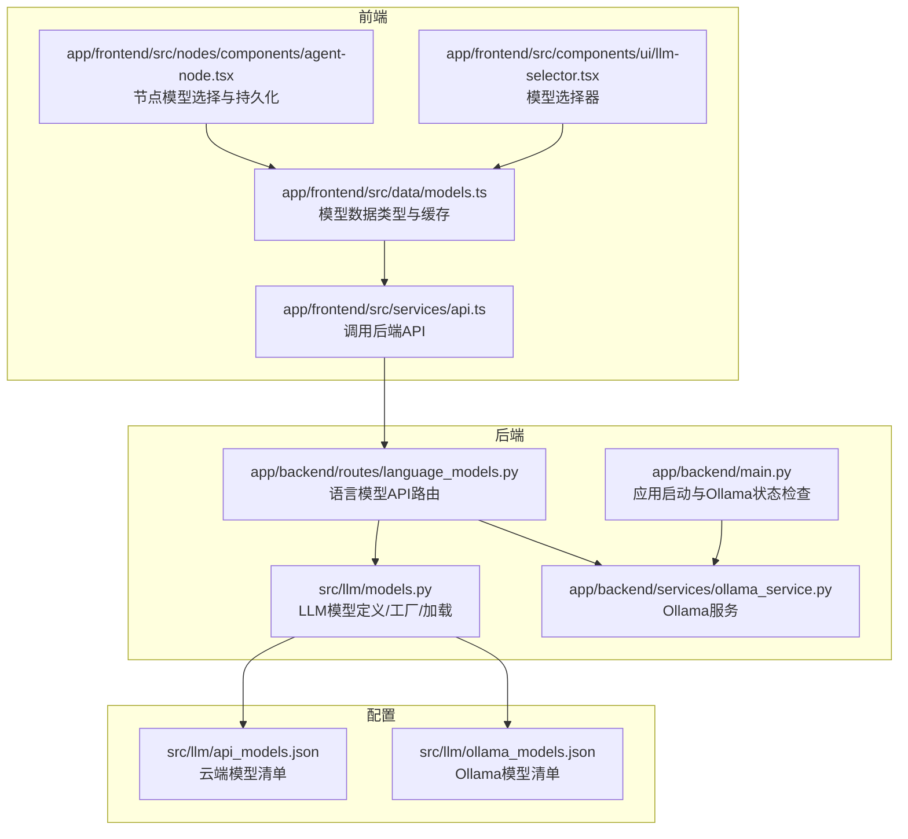
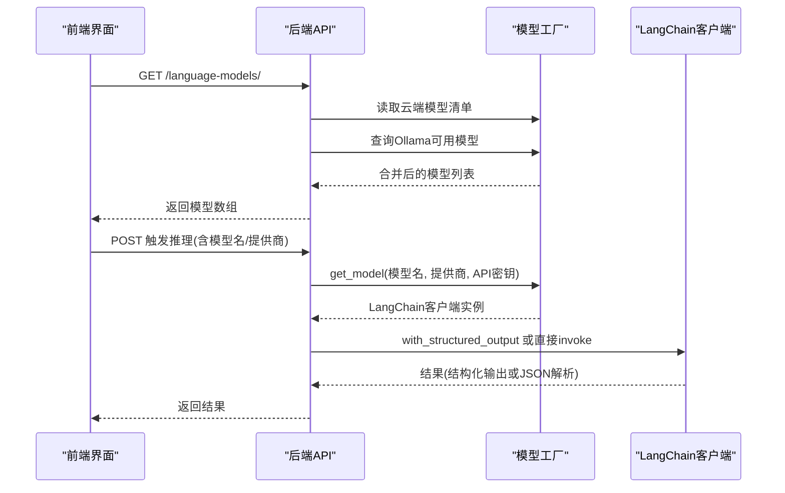
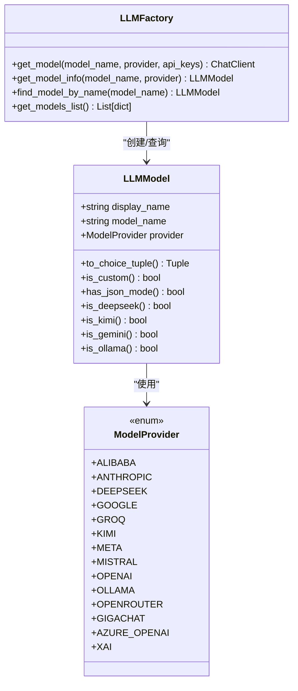
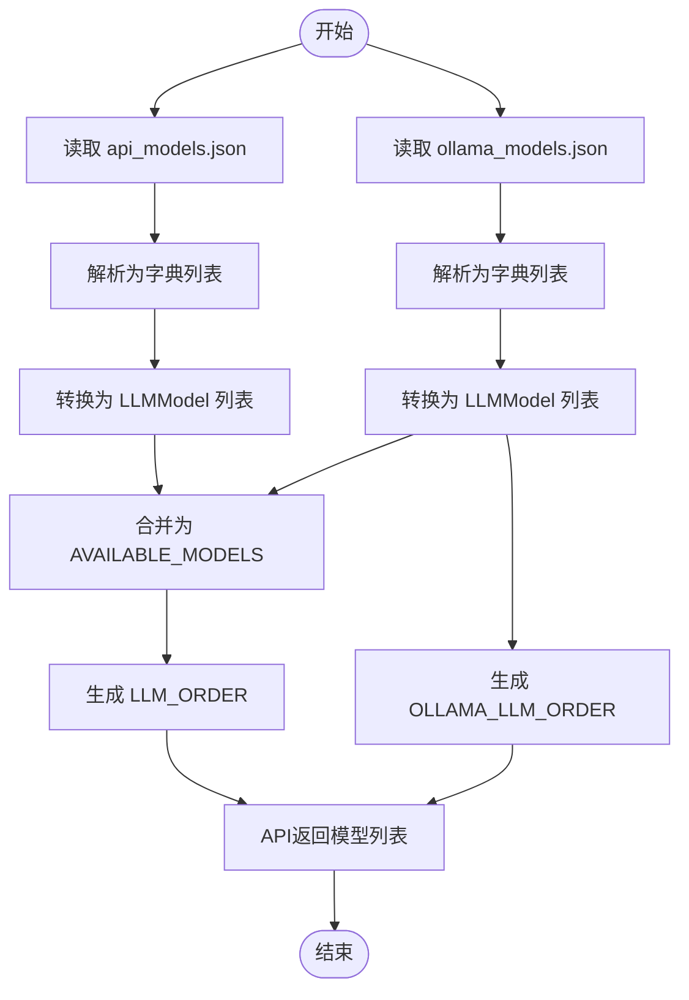
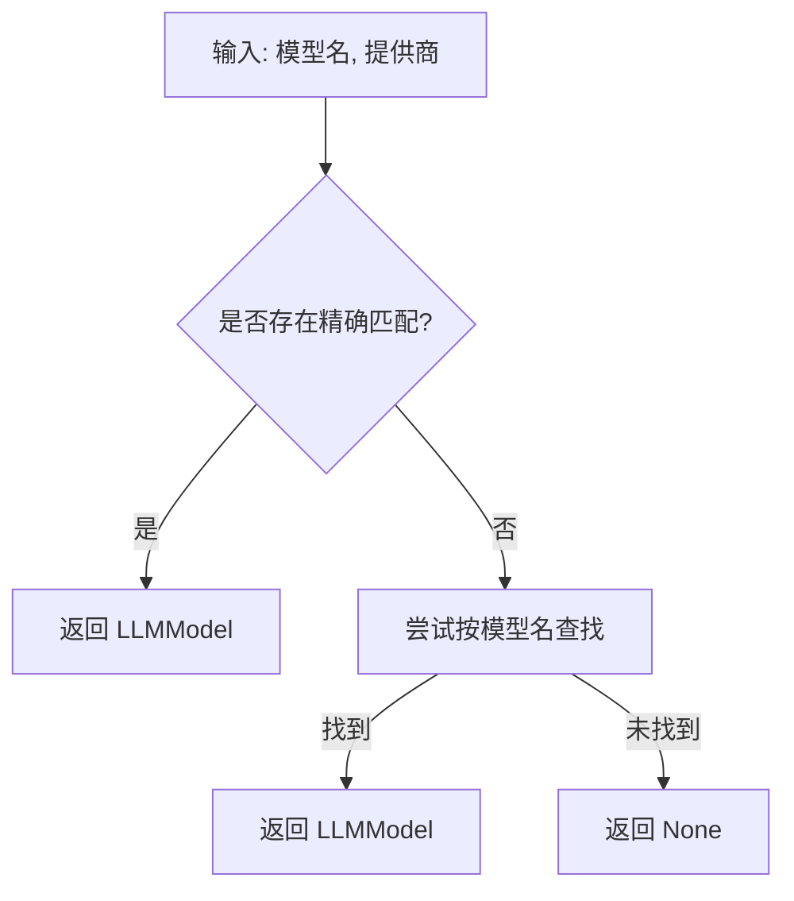
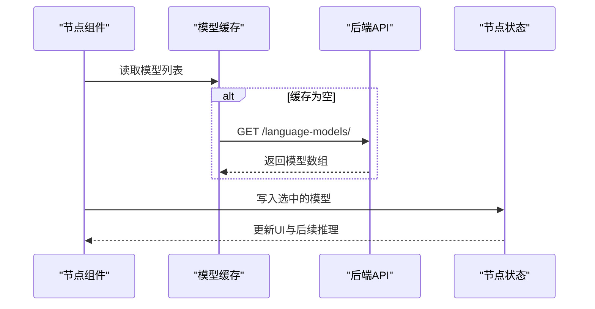
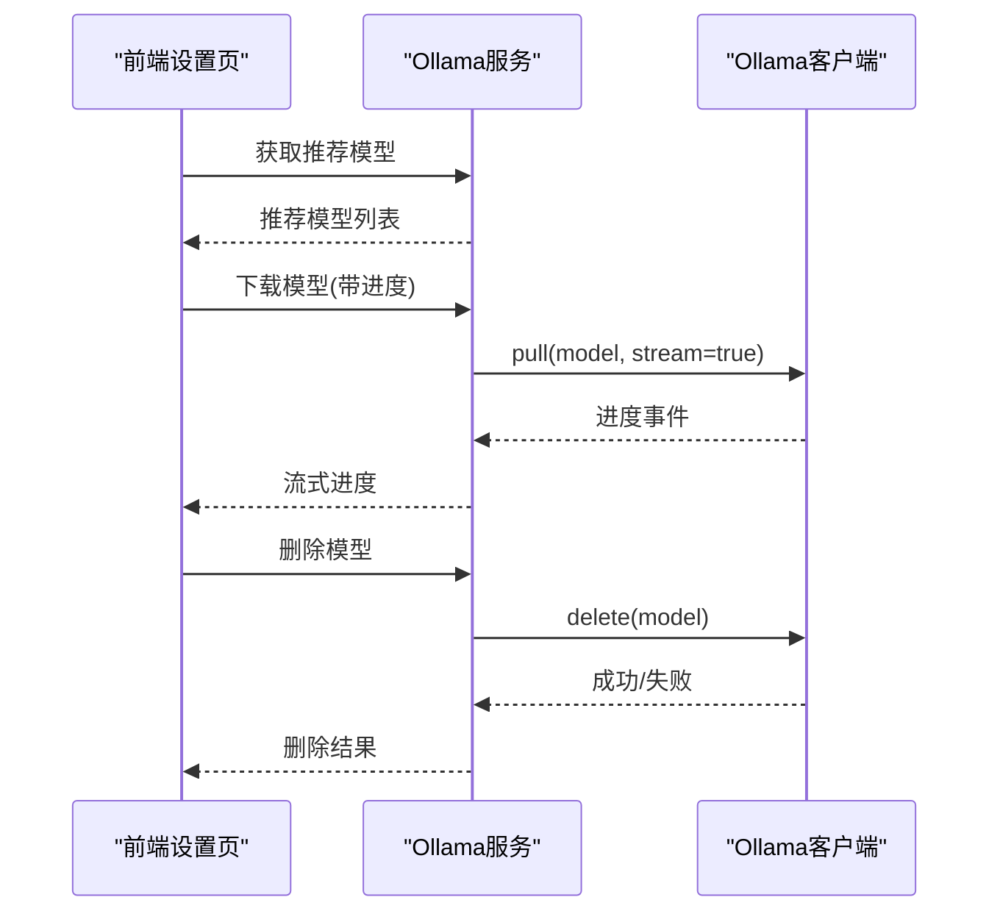
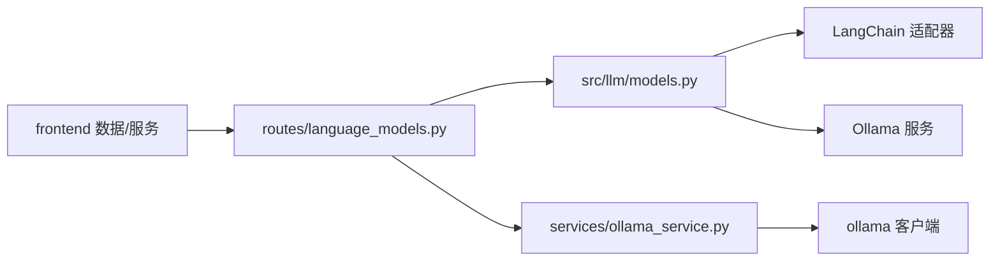

# 模型管理

<cite>
**本文引用的文件**
- [src/llm/models.py](file://src/llm/models.py)
- [src/llm/api_models.json](file://src/llm/api_models.json)
- [src/llm/ollama_models.json](file://src/llm/ollama_models.json)
- [src/utils/llm.py](file://src/utils/llm.py)
- [app/backend/routes/language_models.py](file://app/backend/routes/language_models.py)
- [app/backend/services/ollama_service.py](file://app/backend/services/ollama_service.py)
- [app/backend/main.py](file://app/backend/main.py)
- [src/utils/api_key.py](file://src/utils/api_key.py)
- [app/frontend/src/data/models.ts](file://app/frontend/src/data/models.ts)
- [app/frontend/src/services/api.ts](file://app/frontend/src/services/api.ts)
- [app/frontend/src/components/ui/llm-selector.tsx](file://app/frontend/src/components/ui/llm-selector.tsx)
- [app/frontend/src/nodes/components/agent-node.tsx](file://app/frontend/src/nodes/components/agent-node.tsx)
</cite>

## 目录
1. [简介](#简介)
2. [项目结构](#项目结构)
3. [核心组件](#核心组件)
4. [架构总览](#架构总览)
5. [详细组件分析](#详细组件分析)
6. [依赖关系分析](#依赖关系分析)
7. [性能考虑](#性能考虑)
8. [故障排查指南](#故障排查指南)
9. [结论](#结论)
10. [附录](#附录)

## 简介
本文件为“模型管理”子系统的详细技术文档，聚焦于LLMModel类的设计与实现、模型配置与提供商标识、模型信息获取机制、支持的模型提供商及配置方法、模型加载机制（从JSON文件加载与模型列表生成）、模型属性检查（JSON模式支持、自定义模型检测）、模型查找算法、API密钥管理与环境变量设置、模型切换与版本兼容性建议以及性能优化策略。该系统同时支持云端模型（OpenAI、Anthropic、Groq、Google、DeepSeek、xAI、GigaChat、OpenRouter、Azure OpenAI等）与本地Ollama模型，并通过FastAPI后端与React前端协同工作。

## 项目结构
模型管理涉及以下关键模块：
- 后端Python逻辑：LLM模型定义与工厂、模型加载与查找、语言模型API路由、Ollama服务
- 前端React逻辑：模型选择器UI、模型数据类型与缓存、调用后端API
- 配置文件：云端模型清单与Ollama模型清单（JSON）

图表来源
- [src/llm/models.py:1-258](file://src/llm/models.py#L1-L258)
- [app/backend/routes/language_models.py:1-62](file://app/backend/routes/language_models.py#L1-L62)
- [app/backend/services/ollama_service.py:1-519](file://app/backend/services/ollama_service.py#L1-L519)
- [app/backend/main.py:1-56](file://app/backend/main.py#L1-L56)
- [src/llm/api_models.json:1-87](file://src/llm/api_models.json#L1-L87)
- [src/llm/ollama_models.json:1-57](file://src/llm/ollama_models.json#L1-L57)
- [app/frontend/src/data/models.ts:1-42](file://app/frontend/src/data/models.ts#L1-L42)
- [app/frontend/src/services/api.ts:1-309](file://app/frontend/src/services/api.ts#L1-L309)
- [app/frontend/src/components/ui/llm-selector.tsx:1-51](file://app/frontend/src/components/ui/llm-selector.tsx#L1-L51)
- [app/frontend/src/nodes/components/agent-node.tsx:33-77](file://app/frontend/src/nodes/components/agent-node.tsx#L33-L77)

章节来源
- [src/llm/models.py:1-258](file://src/llm/models.py#L1-L258)
- [app/backend/routes/language_models.py:1-62](file://app/backend/routes/language_models.py#L1-L62)
- [app/backend/services/ollama_service.py:1-519](file://app/backend/services/ollama_service.py#L1-L519)
- [app/backend/main.py:1-56](file://app/backend/main.py#L1-L56)
- [src/llm/api_models.json:1-87](file://src/llm/api_models.json#L1-L87)
- [src/llm/ollama_models.json:1-57](file://src/llm/ollama_models.json#L1-L57)
- [app/frontend/src/data/models.ts:1-42](file://app/frontend/src/data/models.ts#L1-L42)
- [app/frontend/src/services/api.ts:1-309](file://app/frontend/src/services/api.ts#L1-L309)
- [app/frontend/src/components/ui/llm-selector.tsx:1-51](file://app/frontend/src/components/ui/llm-selector.tsx#L1-L51)
- [app/frontend/src/nodes/components/agent-node.tsx:33-77](file://app/frontend/src/nodes/components/agent-node.tsx#L33-L77)

## 核心组件
- LLMModel类：封装模型显示名、模型名与提供商标识，提供转换为选择项元组、自定义模型判断、JSON模式支持判断等方法
- 模型工厂函数：根据提供商标识返回对应LangChain客户端实例，负责API密钥与基础URL解析
- 模型加载器：从JSON文件读取模型配置，构建可用模型列表与Ollama模型列表
- 模型查找器：按模型名或模型名+提供商标识检索模型信息
- 前端模型选择器：展示模型列表、支持选择与持久化到节点上下文

章节来源
- [src/llm/models.py:36-258](file://src/llm/models.py#L36-L258)
- [src/utils/llm.py:10-148](file://src/utils/llm.py#L10-L148)
- [app/frontend/src/data/models.ts:1-42](file://app/frontend/src/data/models.ts#L1-L42)
- [app/frontend/src/components/ui/llm-selector.tsx:1-51](file://app/frontend/src/components/ui/llm-selector.tsx#L1-L51)

## 架构总览
模型管理采用“后端配置驱动 + 前端选择器”的架构：
- 后端通过JSON配置文件维护云端与Ollama模型清单，提供统一的模型列表API
- 前端在挂载时拉取模型列表并缓存；用户在节点中选择模型后持久化到节点状态
- 调用LLM时，后端根据模型配置与API密钥动态构造LangChain客户端并执行推理

图表来源
- [app/backend/routes/language_models.py:13-62](file://app/backend/routes/language_models.py#L13-L62)
- [src/llm/models.py:142-258](file://src/llm/models.py#L142-L258)
- [src/utils/llm.py:10-84](file://src/utils/llm.py#L10-L84)

## 详细组件分析

### LLMModel类与模型工厂
- 设计要点
  - 使用Pydantic BaseModel作为数据模型，确保字段校验与序列化
  - 提供to_choice_tuple用于UI选择器格式化
  - is_custom用于识别自定义模型（例如特定占位符）
  - has_json_mode用于判断是否支持JSON模式（不同提供商/模型有差异）
  - is_deepseek/is_kimi/is_gemini/is_ollama等辅助判断方法便于扩展
- 模型工厂
  - 支持的提供商：OpenAI、Anthropic、Groq、Google、DeepSeek、Ollama、OpenRouter、Kimi、xAI、GigaChat、Azure OpenAI
  - API密钥优先级：传入字典 > 环境变量；部分提供商支持备用键名（如Kimi兼容Moonshot/Kimi）
  - Ollama使用base_url而非API密钥，支持自定义主机与端口
  - Azure OpenAI需要endpoint、deployment name与API key三要素
- 错误处理
  - 缺少API密钥时打印错误并抛出异常，避免静默失败

图表来源
- [src/llm/models.py:17-34](file://src/llm/models.py#L17-L34)
- [src/llm/models.py:36-78](file://src/llm/models.py#L36-L78)
- [src/llm/models.py:142-258](file://src/llm/models.py#L142-L258)

章节来源
- [src/llm/models.py:17-78](file://src/llm/models.py#L17-L78)
- [src/llm/models.py:142-258](file://src/llm/models.py#L142-L258)

### 模型加载机制与列表生成
- JSON配置文件
  - 云端模型清单：api_models.json
  - Ollama模型清单：ollama_models.json
- 加载流程
  - 读取JSON → 解析为字典 → 转换为ModelProvider枚举 → 构造LLMModel对象
  - 生成AVAILABLE_MODELS与OLLAMA_MODELS两个列表
  - 生成UI期望的LLM_ORDER与OLLAMA_LLM_ORDER
- 列表API
  - /language-models/返回合并后的模型列表（云端+已下载的Ollama）
  - /language-models/providers按提供商分组返回模型

图表来源
- [src/llm/models.py:80-116](file://src/llm/models.py#L80-L116)
- [app/backend/routes/language_models.py:13-62](file://app/backend/routes/language_models.py#L13-L62)
- [src/llm/api_models.json:1-87](file://src/llm/api_models.json#L1-L87)
- [src/llm/ollama_models.json:1-57](file://src/llm/ollama_models.json#L1-L57)

章节来源
- [src/llm/models.py:80-116](file://src/llm/models.py#L80-L116)
- [app/backend/routes/language_models.py:13-62](file://app/backend/routes/language_models.py#L13-L62)
- [src/llm/api_models.json:1-87](file://src/llm/api_models.json#L1-L87)
- [src/llm/ollama_models.json:1-57](file://src/llm/ollama_models.json#L1-L57)

### 模型属性检查与查找算法
- 属性检查
  - JSON模式支持：DeepSeek/Gemini默认不支持；Ollama仅部分模型支持；OpenRouter通常支持
  - 自定义模型：以特定占位符标识（如“-”），用于特殊场景
- 查找算法
  - get_model_info：按模型名与提供商精确匹配
  - find_model_by_name：仅按模型名匹配（用于回退或通用场景）
  - get_models_list：返回可用于API响应的标准化模型信息

图表来源
- [src/llm/models.py:118-128](file://src/llm/models.py#L118-L128)

章节来源
- [src/llm/models.py:51-78](file://src/llm/models.py#L51-L78)
- [src/llm/models.py:118-128](file://src/llm/models.py#L118-L128)

### API密钥管理与环境变量设置
- 密钥来源优先级
  - 传入api_keys字典（来自请求上下文）
  - 环境变量（os.getenv）
- 关键环境变量
  - OpenAI：OPENAI_API_KEY，可选OPENAI_API_BASE
  - Anthropic：ANTHROPIC_API_KEY
  - Groq：GROQ_API_KEY
  - Google：GOOGLE_API_KEY
  - DeepSeek：DEEPSEEK_API_KEY
  - OpenRouter：OPENROUTER_API_KEY，额外HTTP头需配合YOUR_SITE_URL/YOUR_SITE_NAME
  - Kimi/Moonshot：MOONSHOT_API_KEY或KIMI_API_KEY，可选MOONSHOT_BASE_URL/KIMI_BASE_URL
  - xAI：XAI_API_KEY
  - GigaChat：GIGACHAT_API_KEY或GIGACHAT_CREDENTIALS，也可使用GIGACHAT_USER/GIGACHAT_PASSWORD
  - Azure OpenAI：AZURE_OPENAI_API_KEY、AZURE_OPENAI_ENDPOINT、AZURE_OPENAI_DEPLOYMENT_NAME
  - Ollama：OLLAMA_HOST（默认localhost）、OLLAMA_BASE_URL（默认http://{host}:11434）
- 前端密钥存储
  - 后端数据库保存密钥摘要，前端仅在需要时获取完整值，避免泄露

章节来源
- [src/llm/models.py:142-258](file://src/llm/models.py#L142-L258)
- [src/utils/api_key.py:1-9](file://src/utils/api_key.py#L1-L9)

### 前端模型切换与节点集成
- 数据类型与缓存
  - LanguageModel接口定义模型显示名、模型名与提供商
  - 缓存最近一次拉取的模型列表，减少重复请求
- 选择器与持久化
  - ModelSelector组件支持搜索与选择
  - AgentNode在挂载时加载模型列表，选择后写入节点状态，实现“每个节点独立模型配置”
- 默认模型
  - 默认选择“gpt-4.1”，若不存在则选择首个模型

图表来源
- [app/frontend/src/data/models.ts:1-42](file://app/frontend/src/data/models.ts#L1-L42)
- [app/frontend/src/services/api.ts:31-47](file://app/frontend/src/services/api.ts#L31-L47)
- [app/frontend/src/nodes/components/agent-node.tsx:33-77](file://app/frontend/src/nodes/components/agent-node.tsx#L33-L77)
- [app/frontend/src/components/ui/llm-selector.tsx:1-51](file://app/frontend/src/components/ui/llm-selector.tsx#L1-L51)

章节来源
- [app/frontend/src/data/models.ts:1-42](file://app/frontend/src/data/models.ts#L1-L42)
- [app/frontend/src/services/api.ts:31-47](file://app/frontend/src/services/api.ts#L31-L47)
- [app/frontend/src/nodes/components/agent-node.tsx:33-77](file://app/frontend/src/nodes/components/agent-node.tsx#L33-L77)
- [app/frontend/src/components/ui/llm-selector.tsx:1-51](file://app/frontend/src/components/ui/llm-selector.tsx#L1-L51)

### Ollama集成与模型生命周期
- 后端服务
  - 检测安装状态、服务器运行状态、可用模型列表
  - 下载/删除模型，支持进度流式返回
  - 将已下载且在推荐列表中的模型格式化为API响应
- 前端交互
  - 在设置页面展示推荐模型，支持下载/取消/删除
  - 下载进度实时更新，状态可视化

图表来源
- [app/backend/services/ollama_service.py:109-151](file://app/backend/services/ollama_service.py#L109-L151)
- [app/backend/services/ollama_service.py:405-441](file://app/backend/services/ollama_service.py#L405-L441)
- [app/backend/services/ollama_service.py:485-516](file://app/backend/services/ollama_service.py#L485-L516)

章节来源
- [app/backend/services/ollama_service.py:19-519](file://app/backend/services/ollama_service.py#L19-L519)

## 依赖关系分析
- 组件耦合
  - 后端语言模型API依赖模型工厂与Ollama服务
  - 前端模型选择器依赖后端API与本地缓存
  - 模型工厂依赖LangChain各提供商适配器
- 外部依赖
  - LangChain适配器：ChatOpenAI、ChatAnthropic、ChatGroq、ChatGoogleGenerativeAI、ChatDeepSeek、ChatOllama、ChatXAI、GigaChat、AzureChatOpenAI
  - Ollama Python客户端
- 潜在循环依赖
  - Ollama服务内部通过延迟导入避免循环导入（从src.llm.models导入OLLAMA_MODELS）

图表来源
- [src/llm/models.py:1-15](file://src/llm/models.py#L1-L15)
- [app/backend/routes/language_models.py:1-11](file://app/backend/routes/language_models.py#L1-L11)
- [app/backend/services/ollama_service.py:1-28](file://app/backend/services/ollama_service.py#L1-L28)

章节来源
- [src/llm/models.py:1-15](file://src/llm/models.py#L1-L15)
- [app/backend/routes/language_models.py:1-11](file://app/backend/routes/language_models.py#L1-L11)
- [app/backend/services/ollama_service.py:1-28](file://app/backend/services/ollama_service.py#L1-L28)

## 性能考虑
- 模型列表缓存
  - 前端对模型列表进行缓存，避免重复网络请求
- 重试与降级
  - LLM调用具备最大重试次数与默认响应构造，提升稳定性
- JSON模式与结构化输出
  - 对支持JSON模式的模型使用with_structured_output(json_mode)，减少后处理开销
  - 对不支持的模型自动提取Markdown中的JSON片段，保证一致性
- Ollama下载进度流
  - 异步流式返回下载进度，降低阻塞与内存占用

章节来源
- [app/frontend/src/data/models.ts:9-28](file://app/frontend/src/data/models.ts#L9-L28)
- [src/utils/llm.py:10-84](file://src/utils/llm.py#L10-L84)
- [app/backend/services/ollama_service.py:405-441](file://app/backend/services/ollama_service.py#L405-L441)

## 故障排查指南
- API密钥缺失
  - 现象：抛出异常并打印错误提示
  - 处理：在后端设置环境变量或通过请求注入api_keys字典
- Azure OpenAI参数缺失
  - 现象：缺少endpoint/deployment name时报错
  - 处理：确保AZURE_OPENAI_ENDPOINT与AZURE_OPENAI_DEPLOYMENT_NAME正确配置
- Ollama不可用
  - 现象：服务器未运行或未安装
  - 处理：通过后端启动服务或手动执行“ollama serve”；前端可在设置页查看状态
- 模型未找到
  - 现象：get_model_info/find_model_by_name返回None
  - 处理：确认模型名与提供商拼写一致；检查JSON配置文件与Ollama实际已下载模型

章节来源
- [src/llm/models.py:142-258](file://src/llm/models.py#L142-L258)
- [app/backend/main.py:32-56](file://app/backend/main.py#L32-L56)
- [app/backend/services/ollama_service.py:34-56](file://app/backend/services/ollama_service.py#L34-L56)

## 结论
本模型管理系统通过清晰的配置驱动与前后端协作，实现了对多提供商模型的统一管理与灵活切换。其核心优势在于：
- 易扩展的模型清单与工厂设计
- 健壮的API密钥与环境变量管理
- 前端节点级模型选择与持久化
- Ollama本地模型的全生命周期管理
建议在生产环境中结合缓存、重试与监控策略，持续优化模型切换与推理性能。

## 附录

### 支持的模型提供商与配置要点
- OpenAI：OPENAI_API_KEY（可选OPENAI_API_BASE）
- Anthropic：ANTHROPIC_API_KEY
- Groq：GROQ_API_KEY
- Google：GOOGLE_API_KEY
- DeepSeek：DEEPSEEK_API_KEY
- OpenRouter：OPENROUTER_API_KEY + 可选HTTP头（YOUR_SITE_URL/YOUR_SITE_NAME）
- Kimi/Moonshot：MOONSHOT_API_KEY或KIMI_API_KEY，可选MOONSHOT_BASE_URL/KIMI_BASE_URL
- xAI：XAI_API_KEY
- GigaChat：GIGACHAT_API_KEY或GIGACHAT_CREDENTIALS，也可使用GIGACHAT_USER/GIGACHAT_PASSWORD
- Azure OpenAI：AZURE_OPENAI_API_KEY、AZURE_OPENAI_ENDPOINT、AZURE_OPENAI_DEPLOYMENT_NAME
- Ollama：OLLAMA_HOST（默认localhost）、OLLAMA_BASE_URL（默认http://{host}:11434）

章节来源
- [src/llm/models.py:142-258](file://src/llm/models.py#L142-L258)