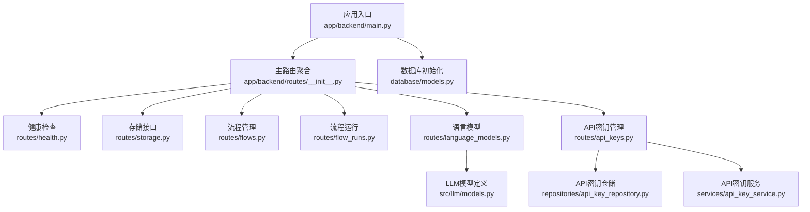
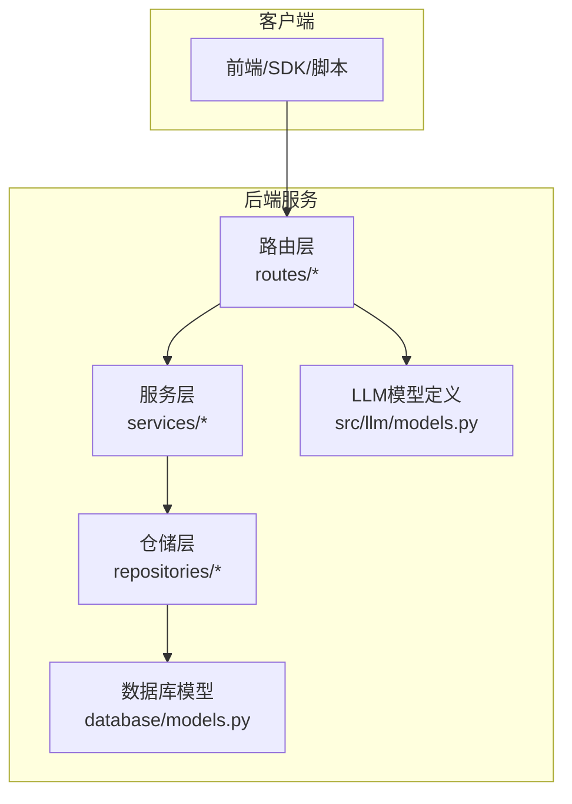
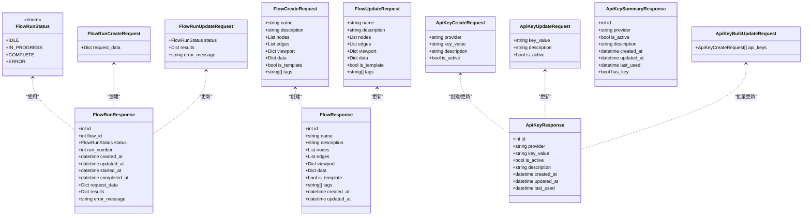
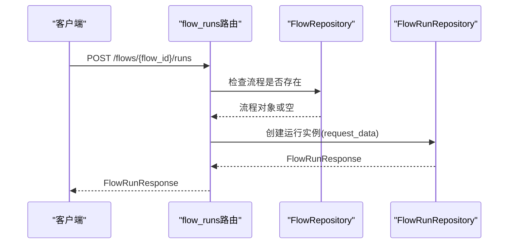
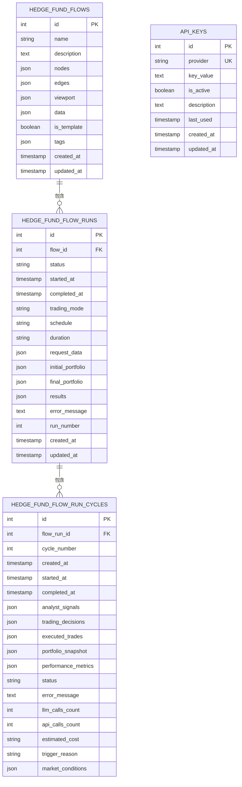

# API参考文档

<cite>
**本文档引用的文件**
- [main.py](file://app/backend/main.py)
- [routes/__init__.py](file://app/backend/routes/__init__.py)
- [routes/api_keys.py](file://app/backend/routes/api_keys.py)
- [routes/flows.py](file://app/backend/routes/flows.py)
- [routes/flow_runs.py](file://app/backend/routes/flow_runs.py)
- [routes/health.py](file://app/backend/routes/health.py)
- [routes/storage.py](file://app/backend/routes/storage.py)
- [routes/language_models.py](file://app/backend/routes/language_models.py)
- [models/schemas.py](file://app/backend/models/schemas.py)
- [repositories/api_key_repository.py](file://app/backend/repositories/api_key_repository.py)
- [database/models.py](file://app/backend/database/models.py)
- [services/api_key_service.py](file://app/backend/services/api_key_service.py)
- [src/llm/models.py](file://src/llm/models.py)
- [README.md](file://README.md)
</cite>

## 目录
1. [简介](#简介)
2. [项目结构](#项目结构)
3. [核心组件](#核心组件)
4. [架构总览](#架构总览)
5. [详细组件分析](#详细组件分析)
6. [依赖关系分析](#依赖关系分析)
7. [性能考虑](#性能考虑)
8. [故障排除指南](#故障排除指南)
9. [结论](#结论)
10. [附录](#附录)

## 简介
本API参考文档面向开发者与集成方，系统性梳理后端FastAPI服务的所有RESTful端点，涵盖HTTP方法、URL模式、请求参数、响应格式、错误码与处理策略，并补充认证授权机制、API密钥管理、访问控制、速率限制、性能优化与监控建议。同时提供从基础调用到高级集成的实践指导。

## 项目结构
后端采用FastAPI框架，通过主应用入口注册路由分组，按功能域划分子路由（健康检查、存储、流程与运行、语言模型、API密钥等），数据层使用SQLAlchemy模型与仓储模式，服务层封装业务逻辑。

**图表来源**
- [main.py:15-30](file://app/backend/main.py#L15-L30)
- [routes/__init__.py:12-24](file://app/backend/routes/__init__.py#L12-L24)

**章节来源**
- [main.py:15-30](file://app/backend/main.py#L15-L30)
- [routes/__init__.py:12-24](file://app/backend/routes/__init__.py#L12-L24)

## 核心组件
- 应用入口与CORS：在应用启动时初始化数据库表并配置跨域策略，统一挂载所有子路由。
- 路由分组：以标签区分功能域，便于文档化与维护。
- 数据模型：定义流程、运行、周期与API密钥的数据库结构。
- 模型与Schema：统一请求/响应结构，含枚举类型与字段校验。
- 仓储与服务：分离数据访问与业务逻辑，便于测试与扩展。

**章节来源**
- [main.py:15-30](file://app/backend/main.py#L15-L30)
- [database/models.py:6-115](file://app/backend/database/models.py#L6-L115)
- [models/schemas.py:9-292](file://app/backend/models/schemas.py#L9-L292)

## 架构总览
下图展示API端点与内部组件的交互关系，包括路由、仓储、服务与外部模型提供者。

**图表来源**
- [routes/api_keys.py:16-201](file://app/backend/routes/api_keys.py#L16-L201)
- [routes/flows.py:15-174](file://app/backend/routes/flows.py#L15-L174)
- [routes/flow_runs.py:17-303](file://app/backend/routes/flow_runs.py#L17-L303)
- [routes/language_models.py:8-62](file://app/backend/routes/language_models.py#L8-L62)
- [repositories/api_key_repository.py:9-131](file://app/backend/repositories/api_key_repository.py#L9-L131)
- [database/models.py:6-115](file://app/backend/database/models.py#L6-L115)
- [src/llm/models.py:17-258](file://src/llm/models.py#L17-L258)

## 详细组件分析

### 健康检查端点
- GET /
  - 功能：返回欢迎消息
  - 成功响应：JSON对象
  - 错误码：无特定错误场景
- GET /ping
  - 功能：Server-Sent Events心跳流，连续发送多条ping消息
  - 成功响应：text/event-stream
  - 错误码：无特定错误场景

**章节来源**
- [routes/health.py:9-28](file://app/backend/routes/health.py#L9-L28)

### 存储接口
- POST /storage/save-json
  - 功能：保存JSON数据至项目outputs目录
  - 请求体字段：filename（字符串）、data（字典）
  - 成功响应：包含成功标志、消息与文件名的对象
  - 错误码：400（参数无效）、500（服务器错误）

**章节来源**
- [routes/storage.py:14-44](file://app/backend/routes/storage.py#L14-L44)

### 流程管理（Flows）
- POST /flows
  - 功能：创建新流程
  - 请求体字段：name、description、nodes、edges、viewport、data、is_template、tags
  - 成功响应：FlowResponse
  - 错误码：400（请求无效）、500（服务器错误）
- GET /flows
  - 功能：获取所有流程摘要
  - 查询参数：include_templates（布尔，默认true）
  - 成功响应：FlowSummaryResponse数组
  - 错误码：500（服务器错误）
- GET /flows/{flow_id}
  - 功能：按ID获取流程详情
  - 成功响应：FlowResponse
  - 错误码：404（未找到）、500（服务器错误）
- PUT /flows/{flow_id}
  - 功能：更新现有流程
  - 成功响应：FlowResponse
  - 错误码：404（未找到）、500（服务器错误）
- DELETE /flows/{flow_id}
  - 功能：删除流程
  - 成功响应：204（无内容）
  - 错误码：404（未找到）、500（服务器错误）
- POST /flows/{flow_id}/duplicate
  - 功能：复制现有流程
  - 查询参数：new_name（可选）
  - 成功响应：FlowResponse
  - 错误码：404（未找到）、500（服务器错误）
- GET /flows/search/{name}
  - 功能：按名称搜索流程
  - 成功响应：FlowSummaryResponse数组
  - 错误码：500（服务器错误）

**章节来源**
- [routes/flows.py:18-174](file://app/backend/routes/flows.py#L18-L174)
- [models/schemas.py:144-195](file://app/backend/models/schemas.py#L144-L195)

### 流程运行（Flow Runs）
- POST /flows/{flow_id}/runs/
  - 功能：为指定流程创建新的运行实例
  - 请求体字段：request_data（可选字典）
  - 成功响应：FlowRunResponse
  - 错误码：404（流程不存在）、500（服务器错误）
- GET /flows/{flow_id}/runs
  - 功能：获取指定流程的所有运行记录
  - 查询参数：limit（1-100，默认50）、offset（>=0，默认0）
  - 成功响应：FlowRunSummaryResponse数组
  - 错误码：404（流程不存在）、500（服务器错误）
- GET /flows/{flow_id}/runs/active
  - 功能：获取当前进行中的运行（IN_PROGRESS）
  - 成功响应：FlowRunResponse或null
  - 错误码：404（流程不存在）、500（服务器错误）
- GET /flows/{flow_id}/runs/latest
  - 功能：获取最近一次运行
  - 成功响应：FlowRunResponse或null
  - 错误码：404（流程不存在）、500（服务器错误）
- GET /flows/{flow_id}/runs/{run_id}
  - 功能：按ID获取运行详情
  - 成功响应：FlowRunResponse
  - 错误码：404（运行不存在）、500（服务器错误）
- PUT /flows/{flow_id}/runs/{run_id}
  - 功能：更新现有运行（支持修改状态、结果、错误信息）
  - 成功响应：FlowRunResponse
  - 错误码：404（运行不存在）、500（服务器错误）
- DELETE /flows/{flow_id}/runs/{run_id}
  - 功能：删除单个运行
  - 成功响应：204（无内容）
  - 错误码：404（运行不存在）、500（服务器错误）
- DELETE /flows/{flow_id}/runs
  - 功能：删除指定流程的所有运行
  - 成功响应：包含删除数量的消息对象
  - 错误码：404（流程不存在）、500（服务器错误）
- GET /flows/{flow_id}/runs/count
  - 功能：获取指定流程的运行总数
  - 成功响应：包含flow_id与total_runs的对象
  - 错误码：404（流程不存在）、500（服务器错误）

**章节来源**
- [routes/flow_runs.py:20-303](file://app/backend/routes/flow_runs.py#L20-L303)
- [models/schemas.py:197-241](file://app/backend/models/schemas.py#L197-L241)

### 语言模型接口
- GET /language-models/
  - 功能：获取可用的云模型与本地Ollama模型列表
  - 成功响应：包含models数组的对象
  - 错误码：500（服务器错误）
- GET /language-models/providers
  - 功能：按提供商分组列出可用模型
  - 成功响应：包含providers数组的对象
  - 错误码：500（服务器错误）

**章节来源**
- [routes/language_models.py:13-62](file://app/backend/routes/language_models.py#L13-L62)
- [src/llm/models.py:130-139](file://src/llm/models.py#L130-L139)

### API密钥管理
- POST /api-keys/
  - 功能：创建或更新API密钥
  - 请求体字段：provider、key_value、description、is_active
  - 成功响应：ApiKeyResponse
  - 错误码：400（请求无效）、500（服务器错误）
- GET /api-keys
  - 功能：获取所有API密钥（不含实际密钥值）
  - 查询参数：include_inactive（布尔，默认false）
  - 成功响应：ApiKeySummaryResponse数组
  - 错误码：500（服务器错误）
- GET /api-keys/{provider}
  - 功能：按提供商获取API密钥详情
  - 成功响应：ApiKeyResponse
  - 错误码：404（未找到）、500（服务器错误）
- PUT /api-keys/{provider}
  - 功能：更新现有API密钥
  - 请求体字段：key_value、description、is_active
  - 成功响应：ApiKeyResponse
  - 错误码：404（未找到）、500（服务器错误）
- DELETE /api-keys/{provider}
  - 功能：删除API密钥
  - 成功响应：204（无内容）
  - 错误码：404（未找到）、500（服务器错误）
- PATCH /api-keys/{provider}/deactivate
  - 功能：停用API密钥（不删除）
  - 成功响应：ApiKeySummaryResponse
  - 错误码：404（未找到）、500（服务器错误）
- POST /api-keys/bulk
  - 功能：批量创建或更新多个API密钥
  - 请求体字段：api_keys（数组，元素为ApiKeyCreateRequest）
  - 成功响应：ApiKeyResponse数组
  - 错误码：400（请求无效）、500（服务器错误）
- PATCH /api-keys/{provider}/last-used
  - 功能：更新API密钥最后使用时间
  - 成功响应：包含成功消息的对象
  - 错误码：404（未找到）、500（服务器错误）

**章节来源**
- [routes/api_keys.py:19-201](file://app/backend/routes/api_keys.py#L19-L201)
- [models/schemas.py:243-292](file://app/backend/models/schemas.py#L243-L292)
- [repositories/api_key_repository.py:15-131](file://app/backend/repositories/api_key_repository.py#L15-L131)
- [database/models.py:97-115](file://app/backend/database/models.py#L97-L115)

## 依赖关系分析

### 类关系图（核心模型与枚举）

**图表来源**
- [models/schemas.py:9-292](file://app/backend/models/schemas.py#L9-L292)

### API调用序列图（创建流程运行）

**图表来源**
- [routes/flow_runs.py:28-51](file://app/backend/routes/flow_runs.py#L28-L51)
- [routes/flows.py:70-81](file://app/backend/routes/flows.py#L70-L81)

### 数据模型关系图（数据库）

**图表来源**
- [database/models.py:6-115](file://app/backend/database/models.py#L6-L115)

## 性能考虑
- 分页与查询限制
  - 流程运行列表接口支持limit与offset，建议客户端按需分页，避免一次性拉取过多数据。
- 并发与异步
  - 应用已启用异步事件生成用于健康检查，建议在I/O密集型操作中保持异步特性。
- 缓存与持久化
  - 对频繁读取的模型列表与流程元数据可考虑缓存；大体量JSON输出建议分块写入磁盘。
- 数据库索引
  - 关键查询字段（如flow_id、provider）已建立索引，确保查询效率。
- 外部服务依赖
  - LLM提供商调用存在网络延迟，建议实现重试与超时策略，并在前端提供加载态反馈。

[本节为通用性能建议，无需具体文件引用]

## 故障排除指南
- 常见错误码
  - 400：请求参数无效（如API密钥创建缺少必要字段）
  - 404：资源不存在（如流程、运行、API密钥）
  - 500：服务器内部错误（数据库异常、外部服务不可达）
- 错误响应结构
  - 统一使用ErrorResponse模型，包含message与可选error字段
- 排查步骤
  - 检查请求参数是否符合Schema约束
  - 确认目标资源存在且状态正常
  - 查看服务日志定位异常堆栈
  - 验证外部依赖（如Ollama、第三方LLM服务）可用性

**章节来源**
- [models/schemas.py:55-58](file://app/backend/models/schemas.py#L55-L58)
- [routes/api_keys.py:22-27](file://app/backend/routes/api_keys.py#L22-L27)
- [routes/flows.py:21-42](file://app/backend/routes/flows.py#L21-L42)
- [routes/flow_runs.py:23-51](file://app/backend/routes/flow_runs.py#L23-L51)

## 结论
本API提供了从流程编排、运行跟踪到模型选择与密钥管理的完整能力。通过清晰的路由分组、严谨的Schema定义与完善的错误处理，开发者可以快速完成集成。建议在生产环境中结合速率限制、鉴权与监控体系，持续优化性能与稳定性。

[本节为总结性内容，无需具体文件引用]

## 附录

### 认证与授权机制
- 当前路由未内置全局鉴权中间件；建议在应用入口添加统一鉴权逻辑（如基于API密钥的请求头校验）。
- API密钥管理端点可用于集中维护密钥，配合服务层动态注入至下游调用。

**章节来源**
- [main.py:21-27](file://app/backend/main.py#L21-L27)
- [services/api_key_service.py:12-23](file://app/backend/services/api_key_service.py#L12-L23)

### API密钥管理最佳实践
- 使用POST /api-keys/创建或更新密钥
- 使用GET /api-keys?include_inactive=false仅获取活跃密钥
- 使用PATCH /api-keys/{provider}/deactivate临时禁用而非删除
- 使用PATCH /api-keys/{provider}/last-used记录使用情况

**章节来源**
- [routes/api_keys.py:19-201](file://app/backend/routes/api_keys.py#L19-L201)
- [repositories/api_key_repository.py:48-118](file://app/backend/repositories/api_key_repository.py#L48-L118)

### SDK与客户端开发模板
- 建议客户端封装以下模板：
  - 基础HTTP客户端：设置超时、重试、错误处理
  - 认证拦截器：自动注入API密钥
  - 分页加载：对/flows/runs等列表接口实现分页
  - SSE订阅：对/ping实现事件流监听
- 示例路径参考：
  - [README.md:67-82](file://README.md#L67-L82) 提供环境变量与密钥设置指引
  - [src/llm/models.py:142-257](file://src/llm/models.py#L142-L257) 展示如何根据Provider与密钥构造LLM客户端

**章节来源**
- [README.md:67-82](file://README.md#L67-L82)
- [src/llm/models.py:142-257](file://src/llm/models.py#L142-L257)

### 版本管理、兼容性与弃用策略
- 版本号：应用标题与描述中包含版本信息，建议在路由前缀中体现版本（如/versions/v1/flows）
- 向后兼容：新增字段建议保持默认值，避免破坏既有客户端
- 弃用策略：变更前保留过渡期，先标记弃用再移除，发布变更日志

**章节来源**
- [main.py:15](file://app/backend/main.py#L15)

### 速率限制与配额
- 当前路由未实现内置限流；建议在网关或中间件层引入限流策略（如基于IP或API密钥）
- 可结合外部服务的配额限制调整请求频率

**章节来源**
- [routes/language_models.py:20-32](file://app/backend/routes/language_models.py#L20-L32)

### 监控指标建议
- 关键指标：请求量、响应时间、错误率、数据库查询耗时、外部服务调用耗时
- 建议埋点位置：路由入口、仓储层、服务层、外部LLM调用前后
- 可视化：结合Prometheus/Grafana或平台自带监控面板

[本节为通用监控建议，无需具体文件引用]