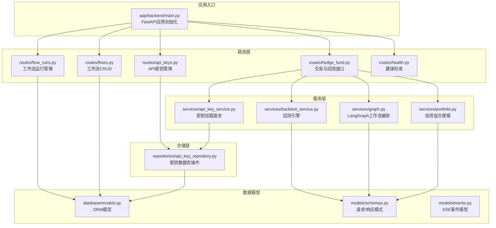
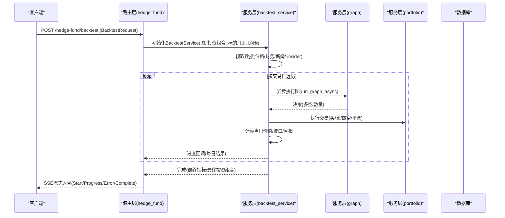
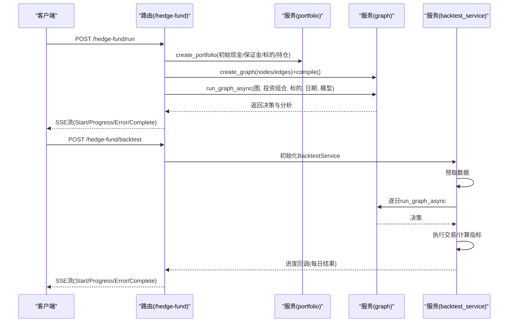
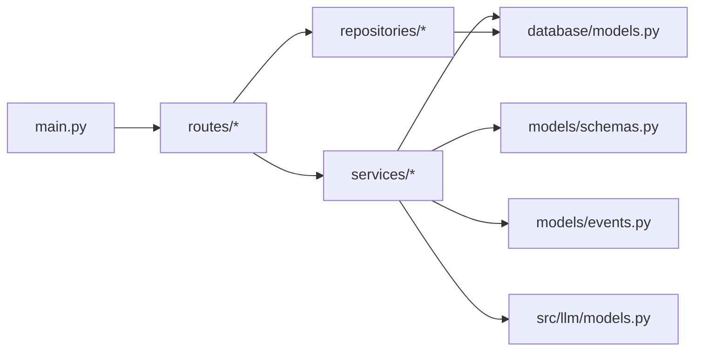

# 对冲基金API

<cite>
**本文档引用的文件**
- [app/backend/main.py](file://app/backend/main.py)
- [app/backend/routes/hedge_fund.py](file://app/backend/routes/hedge_fund.py)
- [app/backend/routes/flows.py](file://app/backend/routes/flows.py)
- [app/backend/routes/flow_runs.py](file://app/backend/routes/flow_runs.py)
- [app/backend/routes/api_keys.py](file://app/backend/routes/api_keys.py)
- [app/backend/routes/health.py](file://app/backend/routes/health.py)
- [app/backend/models/schemas.py](file://app/backend/models/schemas.py)
- [app/backend/models/events.py](file://app/backend/models/events.py)
- [app/backend/services/portfolio.py](file://app/backend/services/portfolio.py)
- [app/backend/services/backtest_service.py](file://app/backend/services/backtest_service.py)
- [app/backend/services/graph.py](file://app/backend/services/graph.py)
- [app/backend/services/api_key_service.py](file://app/backend/services/api_key_service.py)
- [app/backend/repositories/api_key_repository.py](file://app/backend/repositories/api_key_repository.py)
- [app/backend/database/models.py](file://app/backend/database/models.py)
- [src/llm/models.py](file://src/llm/models.py)
</cite>

## 目录
1. [简介](#简介)
2. [项目结构](#项目结构)
3. [核心组件](#核心组件)
4. [架构总览](#架构总览)
5. [详细组件分析](#详细组件分析)
6. [依赖关系分析](#依赖关系分析)
7. [性能考量](#性能考量)
8. [故障排查指南](#故障排查指南)
9. [结论](#结论)
10. [附录](#附录)

## 简介
本项目为一个基于FastAPI的对冲基金自动化交易与投资组合管理平台，提供以下能力：
- 实时交易执行与流式进度反馈（Server-Sent Events）
- 回测引擎（支持日频回测与流式结果）
- 投资组合建模与风险控制（保证金、多空头寸、已实现损益）
- API密钥集中管理（支持批量更新与最后使用时间追踪）
- 可视化工作流（React Flow）的保存、复用与运行
- 多模型提供商（OpenAI、Anthropic、Groq、Ollama等）集成

该API采用流式SSE响应，便于前端实时展示交易决策、分析信号与回测进展；同时通过数据库持久化工作流与运行记录，支持历史回放与审计。

## 项目结构
后端采用分层设计：路由层（routes）、服务层（services）、仓储层（repositories）、数据模型（database/models）与Pydantic模式（models/schemas）。前端通过CORS允许本地开发环境访问。

**图表来源**
- [app/backend/main.py:1-56](file://app/backend/main.py#L1-L56)
- [app/backend/routes/hedge_fund.py:1-353](file://app/backend/routes/hedge_fund.py#L1-L353)
- [app/backend/routes/flows.py:1-174](file://app/backend/routes/flows.py#L1-L174)
- [app/backend/routes/flow_runs.py:1-303](file://app/backend/routes/flow_runs.py#L1-L303)
- [app/backend/routes/api_keys.py:1-201](file://app/backend/routes/api_keys.py#L1-L201)
- [app/backend/routes/health.py:1-28](file://app/backend/routes/health.py#L1-L28)
- [app/backend/services/portfolio.py:1-52](file://app/backend/services/portfolio.py#L1-L52)
- [app/backend/services/backtest_service.py:1-539](file://app/backend/services/backtest_service.py#L1-L539)
- [app/backend/services/graph.py:1-193](file://app/backend/services/graph.py#L1-L193)
- [app/backend/services/api_key_service.py:1-23](file://app/backend/services/api_key_service.py#L1-L23)
- [app/backend/repositories/api_key_repository.py:1-131](file://app/backend/repositories/api_key_repository.py#L1-L131)
- [app/backend/database/models.py:1-115](file://app/backend/database/models.py#L1-L115)
- [app/backend/models/schemas.py:1-292](file://app/backend/models/schemas.py#L1-L292)
- [app/backend/models/events.py:1-46](file://app/backend/models/events.py#L1-L46)

**章节来源**
- [app/backend/main.py:1-56](file://app/backend/main.py#L1-L56)

## 核心组件
- FastAPI应用与CORS配置：统一入口、数据库表初始化、SSE健康检查。
- 路由模块：
  - /hedge-fund：交易执行（流式）、回测（流式）、可用代理列表。
  - /flows：工作流的创建、查询、更新、删除、复制与搜索。
  - /flows/{flow_id}/runs：工作流运行的创建、查询、更新、删除与统计。
  - /api-keys：API密钥的增删改查、批量更新与最后使用时间更新。
  - /health：基础欢迎与SSE ping。
- 服务模块：
  - 投资组合建模：现金、多空头寸、成本与保证金占用。
  - 回测服务：预取数据、逐日回测、执行交易、计算收益与风险指标。
  - 图编排：根据React Flow结构构建LangGraph，异步执行并解析结果。
  - API密钥服务：从数据库加载活跃密钥字典。
- 数据模型与模式：
  - ORM模型：工作流、运行、周期与API密钥。
  - Pydantic模式：请求/响应体、SSE事件、枚举（模型提供商、运行状态）。
- LLM模型配置：统一抽象不同提供商SDK，按需注入API Key或本地Ollama。

**章节来源**
- [app/backend/routes/hedge_fund.py:1-353](file://app/backend/routes/hedge_fund.py#L1-L353)
- [app/backend/routes/flows.py:1-174](file://app/backend/routes/flows.py#L1-L174)
- [app/backend/routes/flow_runs.py:1-303](file://app/backend/routes/flow_runs.py#L1-L303)
- [app/backend/routes/api_keys.py:1-201](file://app/backend/routes/api_keys.py#L1-L201)
- [app/backend/routes/health.py:1-28](file://app/backend/routes/health.py#L1-L28)
- [app/backend/services/portfolio.py:1-52](file://app/backend/services/portfolio.py#L1-L52)
- [app/backend/services/backtest_service.py:1-539](file://app/backend/services/backtest_service.py#L1-L539)
- [app/backend/services/graph.py:1-193](file://app/backend/services/graph.py#L1-L193)
- [app/backend/services/api_key_service.py:1-23](file://app/backend/services/api_key_service.py#L1-L23)
- [app/backend/database/models.py:1-115](file://app/backend/database/models.py#L1-L115)
- [app/backend/models/schemas.py:1-292](file://app/backend/models/schemas.py#L1-L292)
- [app/backend/models/events.py:1-46](file://app/backend/models/events.py#L1-L46)
- [src/llm/models.py:1-258](file://src/llm/models.py#L1-L258)

## 架构总览
系统以FastAPI为核心，通过路由层接收请求，服务层完成业务逻辑（投资组合、回测、图编排），仓储层与数据库交互，模式层保证输入输出一致性。LLM模型抽象屏蔽多提供商差异。

**图表来源**
- [app/backend/routes/hedge_fund.py:162-336](file://app/backend/routes/hedge_fund.py#L162-L336)
- [app/backend/services/backtest_service.py:285-512](file://app/backend/services/backtest_service.py#L285-L512)
- [app/backend/services/graph.py:132-177](file://app/backend/services/graph.py#L132-L177)
- [app/backend/services/portfolio.py:6-52](file://app/backend/services/portfolio.py#L6-L52)

## 详细组件分析

### 交易执行与回测接口（/hedge-fund）
- 接口概览
  - POST /hedge-fund/run：启动一次性的交易执行，返回SSE流，包含开始、进度、错误与完成事件。
  - POST /hedge-fund/backtest：在指定时间范围内进行连续回测，返回SSE流，包含每日进度与最终指标。
  - GET /hedge-fund/agents：列出可用代理名称。
- 请求参数
  - 共享基类字段：tickers、graph_nodes、graph_edges、agent_models、model_name、model_provider、margin_requirement、portfolio_positions、api_keys。
  - 交易请求特有：initial_cash、start_date（可选，默认end_date前90天）、end_date。
  - 回测请求特有：initial_capital、start_date、end_date。
- 响应与事件
  - StartEvent：开始执行。
  - ProgressUpdateEvent：包含agent、ticker、status、analysis（JSON字符串）。
  - ErrorEvent：错误消息。
  - CompleteEvent：data包含decisions、analyst_signals、current_prices（交易）或performance_metrics、final_portfolio、total_days（回测）。
- 错误处理
  - 参数校验失败返回400，内部异常返回500，HTTP异常直接抛出。
- 示例用法
  - 创建交易流程：POST /hedge-fund/run，传入工作流节点/边、标的、初始现金、模型配置与可选API密钥。
  - 查询交易状态：订阅SSE流，读取progress事件了解各代理分析与决策。
  - 获取回测结果：订阅SSE流，读取progress事件中的每日结果，完成后读取complete事件中的指标。

**图表来源**
- [app/backend/routes/hedge_fund.py:18-161](file://app/backend/routes/hedge_fund.py#L18-L161)
- [app/backend/routes/hedge_fund.py:170-336](file://app/backend/routes/hedge_fund.py#L170-L336)
- [app/backend/services/portfolio.py:6-52](file://app/backend/services/portfolio.py#L6-L52)
- [app/backend/services/graph.py:36-129](file://app/backend/services/graph.py#L36-L129)
- [app/backend/services/backtest_service.py:285-512](file://app/backend/services/backtest_service.py#L285-L512)

**章节来源**
- [app/backend/routes/hedge_fund.py:18-353](file://app/backend/routes/hedge_fund.py#L18-L353)
- [app/backend/models/events.py:16-46](file://app/backend/models/events.py#L16-L46)
- [app/backend/models/schemas.py:61-141](file://app/backend/models/schemas.py#L61-L141)
- [app/backend/models/schemas.py:94-129](file://app/backend/models/schemas.py#L94-L129)

### 工作流管理接口（/flows）
- 接口概览
  - POST /flows：创建新工作流。
  - GET /flows：获取工作流列表（摘要）。
  - GET /flows/{flow_id}：按ID获取完整工作流。
  - PUT /flows/{flow_id}：更新工作流。
  - DELETE /flows/{flow_id}：删除工作流。
  - POST /flows/{flow_id}/duplicate：复制工作流。
  - GET /flows/search/{name}：按名称搜索工作流。
- 请求/响应
  - 请求体：FlowCreateRequest/FlowUpdateRequest。
  - 响应体：FlowResponse（含nodes/edges/data等）或FlowSummaryResponse（列表）。
- 权限与安全
  - 当前路由未显式添加鉴权装饰器，建议结合应用级中间件或自定义依赖实现鉴权。

**章节来源**
- [app/backend/routes/flows.py:18-174](file://app/backend/routes/flows.py#L18-L174)
- [app/backend/models/schemas.py:144-195](file://app/backend/models/schemas.py#L144-L195)

### 工作流运行接口（/flows/{flow_id}/runs）
- 接口概览
  - POST /flows/{flow_id}/runs：为指定工作流创建一次运行。
  - GET /flows/{flow_id}/runs：分页获取运行列表（限制每页最多100条）。
  - GET /flows/{flow_id}/runs/active：获取当前进行中的运行。
  - GET /flows/{flow_id}/runs/latest：获取最近一次运行。
  - GET /flows/{flow_id}/runs/{run_id}：按ID获取运行详情。
  - PUT /flows/{flow_id}/runs/{run_id}：更新运行状态/结果/错误。
  - DELETE /flows/{flow_id}/runs/{run_id}：删除单个运行。
  - DELETE /flows/{flow_id}/runs：删除该工作流下所有运行。
  - GET /flows/{flow_id}/runs/count：统计总数。
- 关键行为
  - 更新运行时会校验run_id与flow_id匹配，避免跨流篡改。
  - 分页参数limit默认50，最小1，最大100。
- 数据持久化
  - 运行状态枚举：IDLE、IN_PROGRESS、COMPLETE、ERROR。
  - 支持存储请求参数、初始/最终投资组合、结果与错误信息。

**章节来源**
- [app/backend/routes/flow_runs.py:20-303](file://app/backend/routes/flow_runs.py#L20-L303)
- [app/backend/models/schemas.py:9-14](file://app/backend/models/schemas.py#L9-L14)
- [app/backend/database/models.py:29-56](file://app/backend/database/models.py#L29-L56)

### API密钥管理接口（/api-keys）
- 接口概览
  - POST /api-keys：创建或更新密钥。
  - GET /api-keys：获取所有密钥（摘要，不包含真实值）。
  - GET /api-keys/{provider}：按提供商获取完整密钥。
  - PUT /api-keys/{provider}：更新密钥。
  - DELETE /api-keys/{provider}：删除密钥。
  - PATCH /api-keys/{provider}/deactivate：停用密钥。
  - POST /api-keys/bulk：批量创建/更新。
  - PATCH /api-keys/{provider}/last-used：更新最后使用时间。
- 安全考虑
  - 密钥存储于数据库，响应中敏感值仅在完整模型中返回；摘要模型不含真实密钥。
  - 建议配合HTTPS与应用级鉴权使用。
- 服务与仓储
  - ApiKeyService：从数据库加载活跃密钥字典，供交易/回测注入。
  - ApiKeyRepository：提供增删改查、批量更新、停用与最后使用时间更新。

**章节来源**
- [app/backend/routes/api_keys.py:19-201](file://app/backend/routes/api_keys.py#L19-L201)
- [app/backend/services/api_key_service.py:12-23](file://app/backend/services/api_key_service.py#L12-L23)
- [app/backend/repositories/api_key_repository.py:15-131](file://app/backend/repositories/api_key_repository.py#L15-L131)
- [app/backend/models/schemas.py:244-292](file://app/backend/models/schemas.py#L244-L292)
- [app/backend/database/models.py:97-115](file://app/backend/database/models.py#L97-L115)

### 健康检查与SSE
- GET /：返回欢迎信息。
- GET /health/ping：SSE流，发送5次心跳，便于前端连接测试。

**章节来源**
- [app/backend/routes/health.py:9-28](file://app/backend/routes/health.py#L9-L28)

### 投资组合建模
- 功能要点
  - 初始现金、保证金要求、多空头寸、加权平均成本、已实现损益。
  - 支持从外部传入初始持仓，自动计算短期保证金占用与总占用。
- 复杂度
  - 初始化O(N)（N为标的数），每次交易O(1)。

**章节来源**
- [app/backend/services/portfolio.py:6-52](file://app/backend/services/portfolio.py#L6-L52)
- [app/backend/models/schemas.py:22-33](file://app/backend/models/schemas.py#L22-L33)

### 回测服务
- 核心流程
  - 预取所需数据（价格、财务、新闻、 insider）。
  - 逐日回测：获取当日价格，复制当前投资组合状态，调用图执行得到决策，执行交易，计算当日价值与风险指标。
  - 流式进度：通过回调向SSE事件生成器推送每日结果。
- 交易执行
  - 支持买/卖（多头）、做空/平仓（空头），考虑保证金约束与可用现金。
- 性能指标
  - 日度回报、夏普/索提诺比率、最大回撤及日期、总/净敞口、多空比率。

**章节来源**
- [app/backend/services/backtest_service.py:285-512](file://app/backend/services/backtest_service.py#L285-L512)
- [app/backend/services/backtest_service.py:60-205](file://app/backend/services/backtest_service.py#L60-L205)

### 图编排与LLM模型
- 图编排
  - 根据React Flow节点/边动态构建LangGraph，连接起始节点、分析师节点、风险经理节点与投资组合管理节点。
  - 提供异步执行包装，避免阻塞事件循环。
- LLM模型
  - 统一抽象不同提供商（OpenAI、Anthropic、Groq、Ollama等），按需注入API Key或本地服务地址。
  - 支持JSON模式检测与模型特性判断。

**章节来源**
- [app/backend/services/graph.py:36-177](file://app/backend/services/graph.py#L36-L177)
- [src/llm/models.py:17-258](file://src/llm/models.py#L17-L258)

## 依赖关系分析

**图表来源**
- [app/backend/main.py:1-56](file://app/backend/main.py#L1-L56)
- [app/backend/routes/hedge_fund.py:1-353](file://app/backend/routes/hedge_fund.py#L1-L353)
- [app/backend/routes/flows.py:1-174](file://app/backend/routes/flows.py#L1-L174)
- [app/backend/routes/flow_runs.py:1-303](file://app/backend/routes/flow_runs.py#L1-L303)
- [app/backend/routes/api_keys.py:1-201](file://app/backend/routes/api_keys.py#L1-L201)
- [app/backend/services/portfolio.py:1-52](file://app/backend/services/portfolio.py#L1-L52)
- [app/backend/services/backtest_service.py:1-539](file://app/backend/services/backtest_service.py#L1-L539)
- [app/backend/services/graph.py:1-193](file://app/backend/services/graph.py#L1-L193)
- [app/backend/services/api_key_service.py:1-23](file://app/backend/services/api_key_service.py#L1-L23)
- [app/backend/repositories/api_key_repository.py:1-131](file://app/backend/repositories/api_key_repository.py#L1-L131)
- [app/backend/database/models.py:1-115](file://app/backend/database/models.py#L1-L115)
- [app/backend/models/schemas.py:1-292](file://app/backend/models/schemas.py#L1-L292)
- [app/backend/models/events.py:1-46](file://app/backend/models/events.py#L1-L46)
- [src/llm/models.py:1-258](file://src/llm/models.py#L1-L258)

**章节来源**
- [app/backend/main.py:1-56](file://app/backend/main.py#L1-L56)
- [app/backend/database/models.py:1-115](file://app/backend/database/models.py#L1-L115)

## 性能考量
- 流式SSE
  - 使用StreamingResponse与事件队列，避免一次性聚合大量数据，降低内存峰值。
- 异步执行
  - 回测与图执行均采用异步封装，避免阻塞事件循环，提升并发吞吐。
- 数据预取
  - 回测开始前统一预取所需数据，减少运行期网络抖动带来的延迟。
- 交易执行
  - 严格检查可用现金与保证金约束，避免无效尝试；整数股交易减少浮点误差。
- 指标计算
  - 日度回报与滚动最大回撤在内存中计算，建议在大规模回测时分批输出或降采样。

[本节为通用性能建议，无需特定文件引用]

## 故障排查指南
- SSE连接中断
  - 后端通过请求上下文监听断开事件，一旦检测到断开立即取消任务并清理资源。
- 回测失败
  - 若某日缺失价格数据则跳过该日；若图执行异常，记录错误并继续后续日期。
- 参数校验失败
  - Pydantic模式对交易价格等字段进行校验，非法值将触发400。
- API密钥问题
  - 不同提供商需要对应API Key；若缺失会在模型工厂处抛出明确错误提示。
- 健康检查
  - 使用GET /health/ping验证SSE连通性与服务器存活。

**章节来源**
- [app/backend/routes/hedge_fund.py:51-155](file://app/backend/routes/hedge_fund.py#L51-L155)
- [app/backend/routes/hedge_fund.py:209-331](file://app/backend/routes/hedge_fund.py#L209-L331)
- [app/backend/services/backtest_service.py:344-352](file://app/backend/services/backtest_service.py#L344-L352)
- [app/backend/models/schemas.py:27-32](file://app/backend/models/schemas.py#L27-L32)
- [src/llm/models.py:142-257](file://src/llm/models.py#L142-L257)
- [app/backend/routes/health.py:14-27](file://app/backend/routes/health.py#L14-L27)

## 结论
本对冲基金API围绕“工作流驱动的智能交易”展开，通过清晰的分层架构与流式SSE输出，实现了从策略编排、回测评估到实时交易的闭环。建议在生产环境中：
- 强化鉴权与速率限制；
- 对敏感API Key进行加密存储与轮换；
- 对长回测任务增加队列与断点续跑；
- 在前端侧实现SSE重连与断点续播。

[本节为总结性内容，无需特定文件引用]

## 附录

### API端点一览与示例路径
- 交易执行
  - POST /hedge-fund/run
    - 请求体：HedgeFundRequest
    - 响应：SSE流（Start/Progress/Error/Complete）
    - 示例路径：[交易执行路由:18-161](file://app/backend/routes/hedge_fund.py#L18-L161)
- 回测
  - POST /hedge-fund/backtest
    - 请求体：BacktestRequest
    - 响应：SSE流（Start/Progress/Error/Complete）
    - 示例路径：[回测路由:170-336](file://app/backend/routes/hedge_fund.py#L170-L336)
- 工作流
  - POST /flows
    - 请求体：FlowCreateRequest
    - 响应体：FlowResponse
    - 示例路径：[工作流创建:26-42](file://app/backend/routes/flows.py#L26-L42)
  - GET /flows
    - 响应体：List[FlowSummaryResponse]
    - 示例路径：[工作流列表:52-59](file://app/backend/routes/flows.py#L52-L59)
  - GET /flows/{flow_id}
    - 响应体：FlowResponse
    - 示例路径：[工作流详情:70-81](file://app/backend/routes/flows.py#L70-L81)
  - PUT /flows/{flow_id}
    - 请求体：FlowUpdateRequest
    - 响应体：FlowResponse
    - 示例路径：[更新工作流:92-113](file://app/backend/routes/flows.py#L92-L113)
  - DELETE /flows/{flow_id}
    - 响应体：204/404/500
    - 示例路径：[删除工作流:124-135](file://app/backend/routes/flows.py#L124-L135)
  - POST /flows/{flow_id}/duplicate
    - 响应体：FlowResponse
    - 示例路径：[复制工作流:146-157](file://app/backend/routes/flows.py#L146-L157)
  - GET /flows/search/{name}
    - 响应体：List[FlowSummaryResponse]
    - 示例路径：[搜索工作流:167-173](file://app/backend/routes/flows.py#L167-L173)
- 工作流运行
  - POST /flows/{flow_id}/runs
    - 请求体：FlowRunCreateRequest
    - 响应体：FlowRunResponse
    - 示例路径：[创建运行:28-51](file://app/backend/routes/flow_runs.py#L28-L51)
  - GET /flows/{flow_id}/runs
    - 响应体：List[FlowRunSummaryResponse]
    - 示例路径：[运行列表:62-83](file://app/backend/routes/flow_runs.py#L62-L83)
  - GET /flows/{flow_id}/runs/active
    - 响应体：FlowRunResponse 或 null
    - 示例路径：[活动运行:94-110](file://app/backend/routes/flow_runs.py#L94-L110)
  - GET /flows/{flow_id}/runs/latest
    - 响应体：FlowRunResponse 或 null
    - 示例路径：[最新运行:121-137](file://app/backend/routes/flow_runs.py#L121-L137)
  - GET /flows/{flow_id}/runs/{run_id}
    - 响应体：FlowRunResponse
    - 示例路径：[运行详情:148-167](file://app/backend/routes/flow_runs.py#L148-L167)
  - PUT /flows/{flow_id}/runs/{run_id}
    - 请求体：FlowRunUpdateRequest
    - 响应体：FlowRunResponse
    - 示例路径：[更新运行:178-213](file://app/backend/routes/flow_runs.py#L178-L213)
  - DELETE /flows/{flow_id}/runs/{run_id}
    - 响应体：204/404/500
    - 示例路径：[删除运行:224-247](file://app/backend/routes/flow_runs.py#L224-L247)
  - DELETE /flows/{flow_id}/runs
    - 响应体：{"message": "..."}
    - 示例路径：[删除全部运行:258-275](file://app/backend/routes/flow_runs.py#L258-L275)
  - GET /flows/{flow_id}/runs/count
    - 响应体：{"flow_id": int, "total_runs": int}
    - 示例路径：[运行计数:286-299](file://app/backend/routes/flow_runs.py#L286-L299)
- API密钥
  - POST /api-keys
    - 请求体：ApiKeyCreateRequest
    - 响应体：ApiKeyResponse
    - 示例路径：[创建/更新密钥:27-39](file://app/backend/routes/api_keys.py#L27-L39)
  - GET /api-keys
    - 响应体：List[ApiKeySummaryResponse]
    - 示例路径：[获取密钥列表:49-56](file://app/backend/routes/api_keys.py#L49-L56)
  - GET /api-keys/{provider}
    - 响应体：ApiKeyResponse
    - 示例路径：[获取指定密钥:67-78](file://app/backend/routes/api_keys.py#L67-L78)
  - PUT /api-keys/{provider}
    - 请求体：ApiKeyUpdateRequest
    - 响应体：ApiKeyResponse
    - 示例路径：[更新密钥:89-105](file://app/backend/routes/api_keys.py#L89-L105)
  - DELETE /api-keys/{provider}
    - 响应体：204/404/500
    - 示例路径：[删除密钥:116-127](file://app/backend/routes/api_keys.py#L116-L127)
  - PATCH /api-keys/{provider}/deactivate
    - 响应体：ApiKeySummaryResponse
    - 示例路径：[停用密钥:138-149](file://app/backend/routes/api_keys.py#L138-L149)
  - POST /api-keys/bulk
    - 请求体：ApiKeyBulkUpdateRequest
    - 响应体：List[ApiKeyResponse]
    - 示例路径：[批量更新密钥:163-179](file://app/backend/routes/api_keys.py#L163-L179)
  - PATCH /api-keys/{provider}/last-used
    - 响应体：{"message": "..."}
    - 示例路径：[更新最后使用时间:190-197](file://app/backend/routes/api_keys.py#L190-L197)
- 健康检查
  - GET /
    - 响应体：{"message": "..."}
    - 示例路径：[根路径:10-11](file://app/backend/routes/health.py#L10-L11)
  - GET /health/ping
    - 响应体：SSE流（5次心跳）
    - 示例路径：[SSE ping:14-27](file://app/backend/routes/health.py#L14-L27)

### 认证机制、权限控制与安全
- 认证机制
  - 当前路由未内置鉴权装饰器，建议在应用级中间件或路由依赖中加入API Key/Token校验。
- 权限控制
  - 建议为不同用户/租户划分独立工作流与运行空间，并在路由层进行ID归属校验。
- 安全考虑
  - API密钥仅在完整响应模型中暴露真实值；摘要模型用于列表场景。
  - 建议启用HTTPS、CORS白名单、速率限制与审计日志。

**章节来源**
- [app/backend/routes/api_keys.py:49-56](file://app/backend/routes/api_keys.py#L49-L56)
- [app/backend/database/models.py:97-115](file://app/backend/database/models.py#L97-L115)

### 最佳实践
- 使用SSE时实现断线重连与事件去重。
- 回测前预估数据量与API配额，必要时缓存中间结果。
- 将模型提供商切换与密钥管理解耦，通过请求体或服务层动态选择。
- 对外暴露的接口尽量使用分页与过滤，避免一次性返回过多数据。

[本节为通用最佳实践，无需特定文件引用]