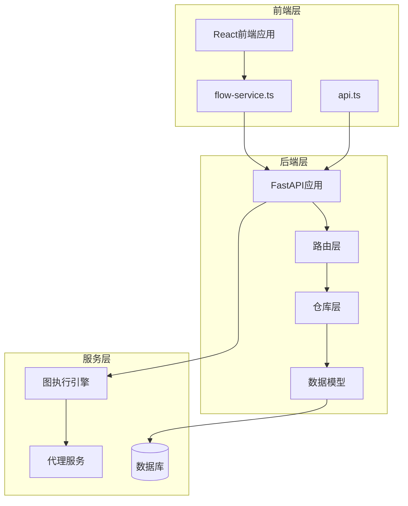
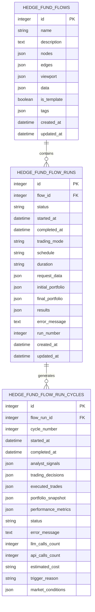
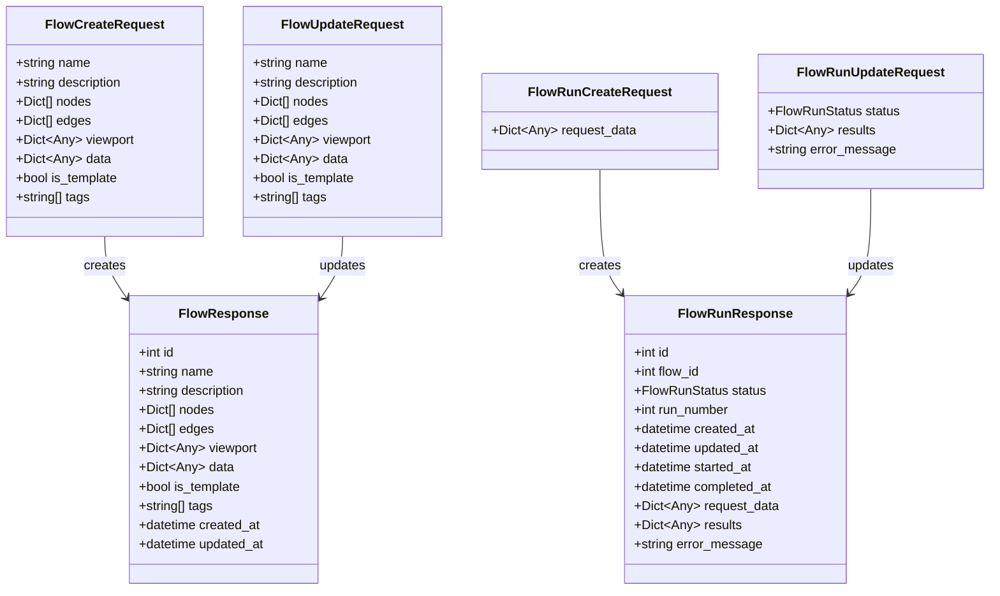
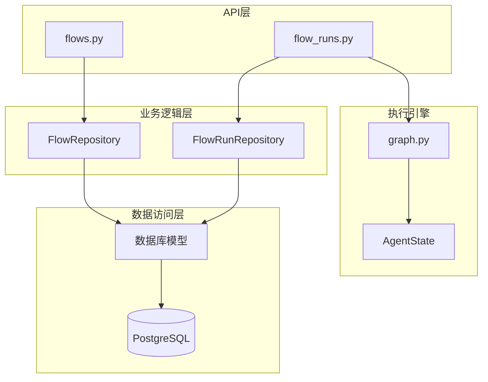
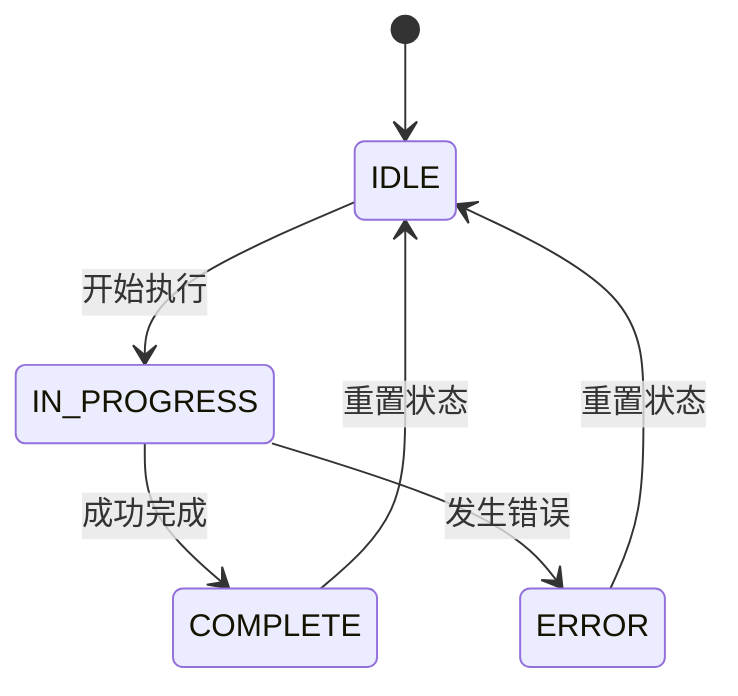
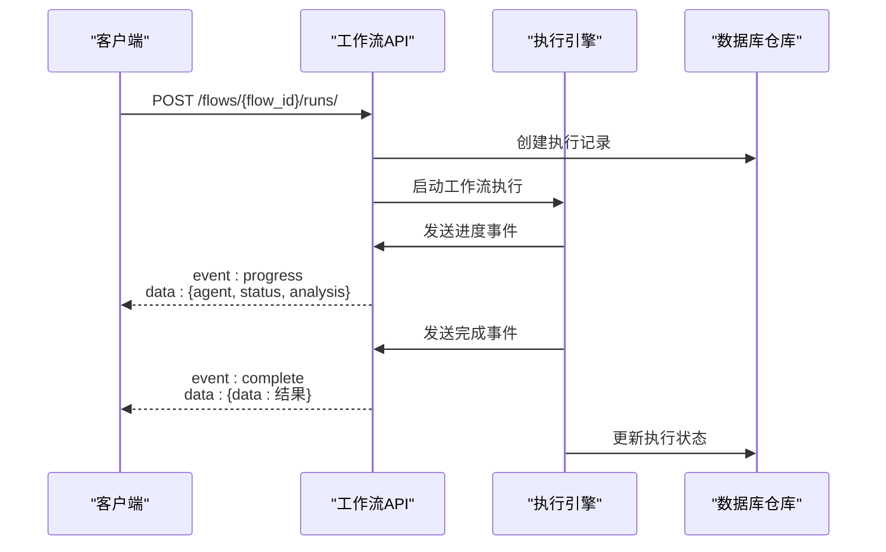
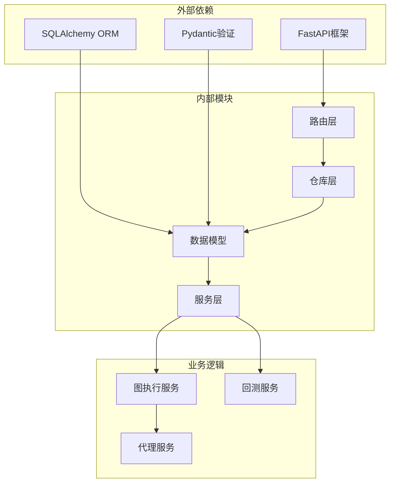
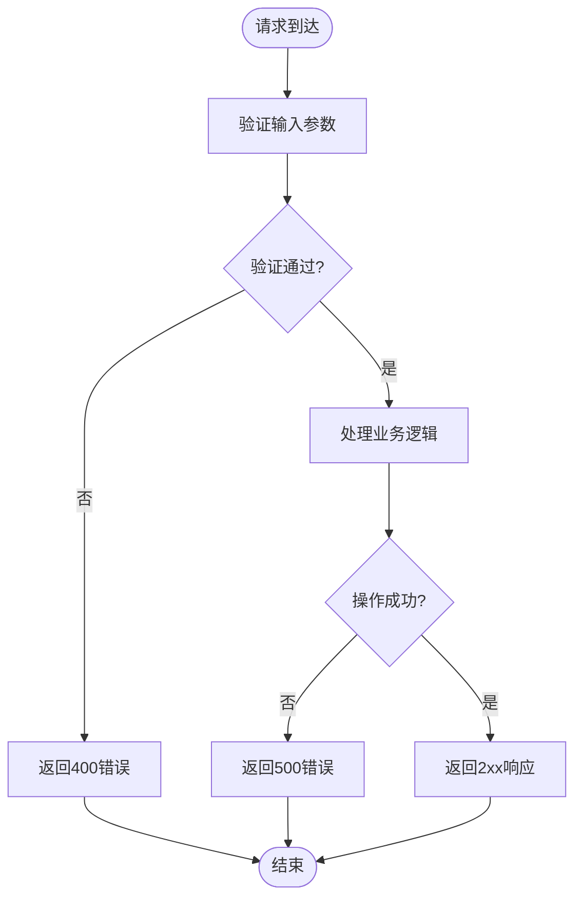

# 工作流API

<cite>
**本文档引用的文件**
- [flows.py](file://app/backend/routes/flows.py)
- [flow_runs.py](file://app/backend/routes/flow_runs.py)
- [flow_repository.py](file://app/backend/repositories/flow_repository.py)
- [flow_run_repository.py](file://app/backend/repositories/flow_run_repository.py)
- [schemas.py](file://app/backend/models/schemas.py)
- [models.py](file://app/backend/database/models.py)
- [main.py](file://app/backend/main.py)
- [graph.py](file://app/backend/services/graph.py)
- [flow-service.ts](file://app/frontend/src/services/flow-service.ts)
- [api.ts](file://app/frontend/src/services/api.ts)
- [flow.ts](file://app/frontend/src/types/flow.ts)
</cite>

## 目录
1. [简介](#简介)
2. [项目结构](#项目结构)
3. [核心组件](#核心组件)
4. [架构概览](#架构概览)
5. [详细组件分析](#详细组件分析)
6. [依赖关系分析](#依赖关系分析)
7. [性能考虑](#性能考虑)
8. [故障排除指南](#故障排除指南)
9. [结论](#结论)
10. [附录](#附录)

## 简介

AI对冲基金工作流API是一个基于FastAPI构建的RESTful服务，专门用于管理和执行复杂的AI驱动投资决策工作流。该系统允许用户创建、编辑、复制和删除工作流，配置工作流节点和连接关系，并监控执行状态。

系统的核心特性包括：
- 完整的工作流生命周期管理（创建、编辑、删除、复制）
- 实时状态监控和调试接口
- 模板化工作流设计
- 批量操作和导入导出功能
- 与前端React Flow图形界面的无缝集成

## 项目结构

工作流API采用分层架构设计，主要分为以下几个层次：

**图表来源**
- [main.py:15-30](file://app/backend/main.py#L15-L30)
- [routes/__init__.py:13-24](file://app/backend/routes/__init__.py#L13-L24)

**章节来源**
- [main.py:1-56](file://app/backend/main.py#L1-L56)
- [routes/__init__.py:1-24](file://app/backend/routes/__init__.py#L1-L24)

## 核心组件

### 数据模型架构

系统使用SQLAlchemy ORM定义了三个核心数据表：

**图表来源**
- [models.py:6-115](file://app/backend/database/models.py#L6-L115)

### 请求响应模型

系统定义了完整的工作流和执行状态的数据传输对象：

**图表来源**
- [schemas.py:144-241](file://app/backend/models/schemas.py#L144-L241)

**章节来源**
- [models.py:1-115](file://app/backend/database/models.py#L1-L115)
- [schemas.py:1-292](file://app/backend/models/schemas.py#L1-L292)

## 架构概览

工作流API采用经典的三层架构模式，实现了清晰的关注点分离：

**图表来源**
- [flows.py:15-174](file://app/backend/routes/flows.py#L15-L174)
- [flow_runs.py:17-303](file://app/backend/routes/flow_runs.py#L17-L303)

系统支持多种工作流执行模式：
- **一次性执行**：单次分析和决策
- **持续执行**：定时或事件驱动的周期性分析
- **咨询模式**：提供分析建议但不自动执行交易

## 详细组件分析

### 工作流管理API

#### 创建工作流
- **端点**：POST `/flows/`
- **功能**：创建新的工作流定义
- **参数**：工作流名称、描述、节点配置、边连接、视口状态、数据存储、模板标记、标签
- **响应**：完整的FlowResponse对象

#### 获取工作流列表
- **端点**：GET `/flows/`
- **功能**：获取所有工作流摘要信息
- **参数**：include_templates（是否包含模板）
- **响应**：FlowSummaryResponse数组

#### 获取特定工作流
- **端点**：GET `/flows/{flow_id}`
- **功能**：根据ID获取完整工作流定义
- **响应**：FlowResponse对象

#### 更新工作流
- **端点**：PUT `/flows/{flow_id}`
- **功能**：更新现有工作流的配置
- **参数**：可选字段更新（名称、描述、节点、边等）

#### 删除工作流
- **端点**：DELETE `/flows/{flow_id}`
- **功能**：删除指定工作流及其关联的执行记录

#### 复制工作流
- **端点**：POST `/flows/{flow_id}/duplicate`
- **功能**：创建现有工作流的副本
- **参数**：new_name（新名称）
- **响应**：复制后的工作流对象

#### 搜索工作流
- **端点**：GET `/flows/search/{name}`
- **功能**：按名称搜索工作流
- **响应**：匹配的工作流摘要列表

**章节来源**
- [flows.py:18-174](file://app/backend/routes/flows.py#L18-L174)
- [flow_repository.py:12-103](file://app/backend/repositories/flow_repository.py#L12-L103)

### 工作流执行API

#### 创建执行实例
- **端点**：POST `/flows/{flow_id}/runs/`
- **功能**：为指定工作流创建新的执行实例
- **参数**：request_data（执行参数）
- **响应**：FlowRunResponse对象

#### 获取执行历史
- **端点**：GET `/flows/{flow_id}/runs/`
- **功能**：获取工作流的执行历史
- **参数**：limit（限制数量）、offset（偏移量）
- **响应**：FlowRunSummaryResponse数组

#### 获取活动执行
- **端点**：GET `/flows/{flow_id}/runs/active`
- **功能**：获取当前正在执行的实例
- **响应**：FlowRunResponse对象或None

#### 获取最新执行
- **端点**：GET `/flows/{flow_id}/runs/latest`
- **功能**：获取最近一次执行
- **响应**：FlowRunResponse对象或None

#### 获取特定执行
- **端点**：GET `/flows/{flow_id}/runs/{run_id}`
- **功能**：获取指定执行实例的详细信息

#### 更新执行状态
- **端点**：PUT `/flows/{flow_id}/runs/{run_id}`
- **功能**：更新执行状态和结果
- **参数**：status、results、error_message

#### 删除执行
- **端点**：DELETE `/flows/{flow_id}/runs/{run_id}`
- **功能**：删除指定执行记录

#### 批量删除执行
- **端点**：DELETE `/flows/{flow_id}/runs/`
- **功能**：删除工作流的所有执行记录
- **响应**：删除计数信息

#### 获取执行统计
- **端点**：GET `/flows/{flow_id}/runs/count`
- **功能**：获取执行总数
- **响应**：包含flow_id和total_runs的对象

**章节来源**
- [flow_runs.py:20-303](file://app/backend/routes/flow_runs.py#L20-L303)
- [flow_run_repository.py:15-133](file://app/backend/repositories/flow_run_repository.py#L15-L133)

### 执行状态管理

系统支持四种执行状态：

状态转换逻辑：
- **IDLE**：初始状态，等待执行
- **IN_PROGRESS**：执行中，设置started_at时间戳
- **COMPLETE**：成功完成，设置completed_at时间戳
- **ERROR**：执行失败，记录错误信息

**图表来源**
- [schemas.py:9-14](file://app/backend/models/schemas.py#L9-L14)
- [flow_run_repository.py:66-96](file://app/backend/repositories/flow_run_repository.py#L66-L96)

### 实时状态监控

系统通过Server-Sent Events (SSE) 提供实时状态更新：

**图表来源**
- [api.ts:153-229](file://app/frontend/src/services/api.ts#L153-L229)
- [flow_runs.py:20-51](file://app/backend/routes/flow_runs.py#L20-L51)

## 依赖关系分析

### 组件耦合度

**图表来源**
- [main.py:1-56](file://app/backend/main.py#L1-L56)
- [graph.py:1-193](file://app/backend/services/graph.py#L1-L193)

### 错误处理机制

系统采用统一的错误处理策略：

**图表来源**
- [flows.py:26-42](file://app/backend/routes/flows.py#L26-L42)
- [flow_runs.py:34-51](file://app/backend/routes/flow_runs.py#L34-L51)

**章节来源**
- [flows.py:1-174](file://app/backend/routes/flows.py#L1-L174)
- [flow_runs.py:1-303](file://app/backend/routes/flow_runs.py#L1-L303)

## 性能考虑

### 数据库优化

1. **索引策略**：
   - flow_id在hedge_fund_flow_runs表上建立索引
   - created_at和updated_at字段使用服务器默认值

2. **查询优化**：
   - 使用limit和offset参数控制结果集大小
   - 支持最大100条记录的限制

3. **内存管理**：
   - 流式处理大型执行结果
   - 及时清理已完成的执行记录

### 并发处理

系统支持高并发执行：
- 异步工作流执行引擎
- 连接池管理
- 无阻塞的SSE事件推送

## 故障排除指南

### 常见错误类型

1. **404 Not Found**：工作流或执行记录不存在
2. **400 Bad Request**：请求参数验证失败
3. **500 Internal Server Error**：服务器内部错误

### 调试建议

1. **检查数据库连接**：确认PostgreSQL服务正常运行
2. **验证JSON格式**：确保节点和边数据符合预期格式
3. **监控执行状态**：使用实时事件流跟踪执行进度
4. **查看日志输出**：检查后端日志中的错误信息

**章节来源**
- [flows.py:75-81](file://app/backend/routes/flows.py#L75-L81)
- [flow_runs.py:158-167](file://app/backend/routes/flow_runs.py#L158-L167)

## 结论

AI对冲基金工作流API提供了一个完整、可扩展的解决方案，用于构建和管理复杂的AI驱动投资决策系统。系统具有以下优势：

1. **完整的生命周期管理**：从创建到执行再到监控的全流程支持
2. **灵活的配置选项**：支持模板化、批量操作和自定义配置
3. **实时状态监控**：通过SSE提供即时反馈
4. **强大的扩展性**：模块化设计便于功能扩展
5. **完善的错误处理**：统一的错误处理机制确保系统稳定性

该API为金融技术应用提供了坚实的基础，支持从简单的投资策略到复杂的多代理决策系统的各种需求。

## 附录

### API端点汇总

| 方法 | 端点 | 功能 |
|------|------|------|
| POST | /flows/ | 创建工作流 |
| GET | /flows/ | 获取工作流列表 |
| GET | /flows/{flow_id} | 获取特定工作流 |
| PUT | /flows/{flow_id} | 更新工作流 |
| DELETE | /flows/{flow_id} | 删除工作流 |
| POST | /flows/{flow_id}/duplicate | 复制工作流 |
| GET | /flows/search/{name} | 搜索工作流 |
| POST | /flows/{flow_id}/runs/ | 创建执行实例 |
| GET | /flows/{flow_id}/runs/ | 获取执行历史 |
| GET | /flows/{flow_id}/runs/active | 获取活动执行 |
| GET | /flows/{flow_id}/runs/latest | 获取最新执行 |
| GET | /flows/{flow_id}/runs/{run_id} | 获取特定执行 |
| PUT | /flows/{flow_id}/runs/{run_id} | 更新执行状态 |
| DELETE | /flows/{flow_id}/runs/{run_id} | 删除执行 |
| DELETE | /flows/{flow_id}/runs/ | 批量删除执行 |
| GET | /flows/{flow_id}/runs/count | 获取执行统计 |

### 数据模型字段说明

**HedgeFundFlow表字段**：
- id：主键标识符
- name：工作流名称（200字符限制）
- description：描述信息
- nodes：节点配置（JSON格式）
- edges：连接关系（JSON格式）
- viewport：视口状态（缩放、位置）
- data：节点内部状态
- is_template：是否为模板
- tags：标签数组

**HedgeFundFlowRun表字段**：
- status：执行状态（IDLE/IN_PROGRESS/COMPLETE/ERROR）
- request_data：执行参数
- results：执行结果
- error_message：错误信息
- run_number：序列号
- timing字段：created_at、updated_at、started_at、completed_at