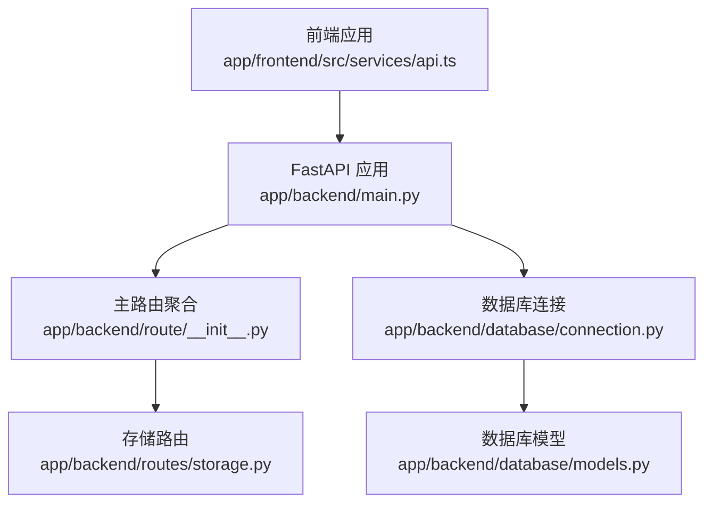
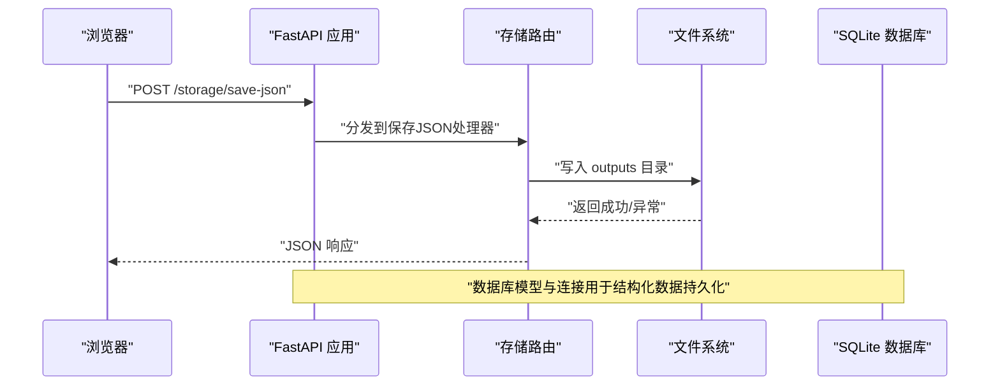
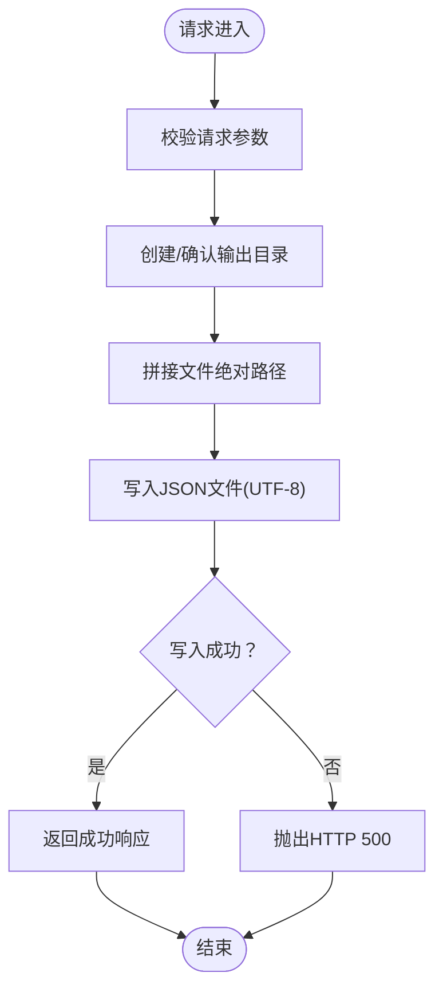
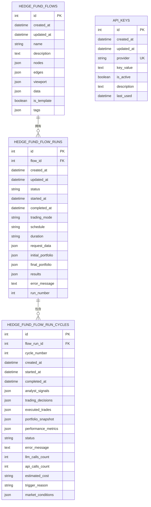
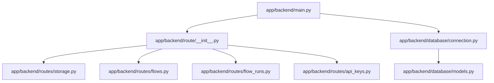

# 数据存储API

<cite>
**本文档引用的文件**
- [app/backend/routes/storage.py](file://app/backend/routes/storage.py)
- [app/backend/models/schemas.py](file://app/backend/models/schemas.py)
- [app/backend/database/models.py](file://app/backend/database/models.py)
- [app/backend/database/connection.py](file://app/backend/database/connection.py)
- [app/backend/route/__init__.py](file://app/backend/route/__init__.py)
- [app/backend/main.py](file://app/backend/main.py)
- [app/frontend/src/services/api.ts](file://app/frontend/src/services/api.ts)
- [app/frontend/src/utils/text-utils.ts](file://app/frontend/src/utils/text-utils.ts)
</cite>

## 目录
1. [简介](#简介)
2. [项目结构](#项目结构)
3. [核心组件](#核心组件)
4. [架构总览](#架构总览)
5. [详细组件分析](#详细组件分析)
6. [依赖关系分析](#依赖关系分析)
7. [性能考虑](#性能考虑)
8. [故障排除指南](#故障排除指南)
9. [结论](#结论)
10. [附录](#附录)

## 简介
本文件面向后端与前端开发者，系统化梳理项目中的数据存储API，重点覆盖以下能力：
- 文件上传（以JSON为主）、下载、管理与检索
- CSV导入、JSON数据存储、二进制文件处理与数据备份恢复
- 数据格式验证、存储策略与访问权限控制
- 批量数据操作、数据同步与版本管理
- 数据完整性检查、压缩加密与存储空间管理
- 实际使用示例与性能优化建议

当前仓库中已实现的存储API主要为“保存JSON到本地文件”的轻量接口；同时数据库层提供了完整的结构化数据持久化能力，可用于后续扩展CSV导入、二进制文件、备份恢复等高级功能。

## 项目结构
后端采用FastAPI + SQLAlchemy + SQLite的组合，路由通过主路由器统一挂载。存储API位于独立的子路由下，数据库模型定义了结构化数据表，连接配置支持SQLite文件数据库。

图表来源
- [app/backend/main.py:15-31](file://app/backend/main.py#L15-L31)
- [app/backend/route/__init__.py:12-24](file://app/backend/route/__init__.py#L12-L24)
- [app/backend/routes/storage.py:8](file://app/backend/routes/storage.py#L8)
- [app/backend/database/connection.py:15-24](file://app/backend/database/connection.py#L15-L24)
- [app/backend/database/models.py:6-115](file://app/backend/database/models.py#L6-L115)

章节来源
- [app/backend/main.py:15-31](file://app/backend/main.py#L15-L31)
- [app/backend/route/__init__.py:12-24](file://app/backend/route/__init__.py#L12-L24)

## 核心组件
- 存储路由：提供“保存JSON”接口，将请求体中的JSON数据写入项目根目录下的输出目录。
- 数据库模型：定义了流程、运行、周期、API密钥等表结构，支持JSON字段存储复杂数据。
- 数据库连接：基于SQLite，提供会话依赖注入。
- 前端服务：封装了调用后端存储API的方法，并在工具函数中提供JSON格式校验逻辑。

章节来源
- [app/backend/routes/storage.py:14-44](file://app/backend/routes/storage.py#L14-L44)
- [app/backend/database/models.py:6-115](file://app/backend/database/models.py#L6-L115)
- [app/backend/database/connection.py:15-32](file://app/backend/database/connection.py#L15-L32)
- [app/frontend/src/services/api.ts:55-78](file://app/frontend/src/services/api.ts#L55-L78)

## 架构总览
存储API的调用链路从浏览器发起，经由FastAPI路由，进入业务处理函数，最终写入本地文件系统。数据库层通过SQLAlchemy ORM提供结构化数据持久化能力，可作为未来CSV导入、二进制文件、备份恢复等功能的承载层。

图表来源
- [app/backend/routes/storage.py:22-44](file://app/backend/routes/storage.py#L22-L44)
- [app/backend/main.py:29-31](file://app/backend/main.py#L29-L31)
- [app/backend/database/connection.py:15-32](file://app/backend/database/connection.py#L15-L32)

## 详细组件分析

### 存储路由：保存JSON文件
- 接口路径：POST /storage/save-json
- 请求体：包含文件名与JSON数据对象
- 处理流程：计算项目根目录，确保输出目录存在，构造文件路径，序列化并写入UTF-8编码的JSON文件
- 响应：包含成功标志、消息与文件名
- 错误处理：捕获异常并抛出HTTP 500

图表来源
- [app/backend/routes/storage.py:22-44](file://app/backend/routes/storage.py#L22-L44)

章节来源
- [app/backend/routes/storage.py:14-44](file://app/backend/routes/storage.py#L14-L44)

### 数据模型与存储策略
- 流程表：存储React Flow的节点、边、视口与自定义数据，均以JSON字段持久化，便于直接读取与渲染。
- 运行表：记录每次执行的状态、时间戳、请求参数、初始/最终投资组合、结果与错误信息，JSON字段承载复杂数据。
- 周期表：记录单次交易会话内的分析信号、交易决策、已执行交易、快照与性能指标，JSON字段支持灵活扩展。
- API密钥表：存储服务提供商标识、密钥值、启用状态与最后使用时间，支持批量更新与禁用。

图表来源
- [app/backend/database/models.py:6-115](file://app/backend/database/models.py#L6-L115)

章节来源
- [app/backend/database/models.py:6-115](file://app/backend/database/models.py#L6-L115)

### 数据库连接与依赖注入
- 使用SQLite文件数据库，通过绝对路径定位数据库文件
- 提供会话工厂与依赖函数，供路由层注入数据库会话
- 启动时自动创建所有表结构

章节来源
- [app/backend/database/connection.py:15-32](file://app/backend/database/connection.py#L15-L32)
- [app/backend/main.py:17-18](file://app/backend/main.py#L17-L18)

### 前端调用与JSON格式校验
- 前端服务封装了保存JSON文件的调用方法，使用fetch发送POST请求
- 工具函数提供JSON字符串校验逻辑，支持标准JSON与JavaScript特例值的规范化处理

章节来源
- [app/frontend/src/services/api.ts:55-78](file://app/frontend/src/services/api.ts#L55-L78)
- [app/frontend/src/utils/text-utils.ts:73-117](file://app/frontend/src/utils/text-utils.ts#L73-L117)

## 依赖关系分析
- 路由聚合器将健康检查、存储、流程、运行、Ollama、语言模型、API密钥等子路由统一注册
- 主应用启动时初始化数据库表并挂载路由
- 存储路由不依赖数据库，但数据库模型为后续扩展提供基础

图表来源
- [app/backend/main.py:29-31](file://app/backend/main.py#L29-L31)
- [app/backend/route/__init__.py:12-24](file://app/backend/route/__init__.py#L12-L24)

章节来源
- [app/backend/route/__init__.py:12-24](file://app/backend/route/__init__.py#L12-L24)
- [app/backend/main.py:29-31](file://app/backend/main.py#L29-L31)

## 性能考虑
- 文件I/O：当前保存JSON为同步写入，建议在高并发场景下引入异步I/O或队列机制，避免阻塞事件循环
- JSON序列化：大对象序列化可能占用内存，建议分块写入或流式输出
- 数据库：SQLite适合开发与小规模生产，若需高并发与强一致，建议迁移到PostgreSQL/MySQL并启用连接池
- 缓存：对频繁读取的结构化数据可增加Redis缓存层，减少数据库压力
- 压缩与加密：对于大体量JSON或敏感数据，可在入库前进行压缩与加密，出库时解压解密

## 故障排除指南
- 保存失败（HTTP 500）：检查输出目录权限、磁盘空间与文件名合法性
- JSON解析错误：前端工具函数可辅助识别非法JSON，必要时在后端增加更严格的Schema校验
- 数据库连接问题：确认数据库文件路径正确，SQLite文件未被其他进程锁定
- 跨域问题：确认CORS配置允许前端域名访问

章节来源
- [app/backend/routes/storage.py:43-44](file://app/backend/routes/storage.py#L43-L44)
- [app/frontend/src/utils/text-utils.ts:73-117](file://app/frontend/src/utils/text-utils.ts#L73-L117)
- [app/backend/main.py:20-27](file://app/backend/main.py#L20-L27)

## 结论
当前数据存储API以“保存JSON文件”为核心，具备简单易用、快速落地的特点。结合数据库模型，可平滑扩展CSV导入、二进制文件处理、备份恢复、版本管理与权限控制等高级能力。建议在生产环境中引入异步I/O、缓存、数据库迁移与安全加固，以提升稳定性与可维护性。

## 附录

### API规范概览
- 保存JSON文件
  - 方法：POST
  - 路径：/storage/save-json
  - 请求体字段：filename（字符串），data（对象）
  - 成功响应：包含success、message、filename
  - 错误码：400（参数无效），500（服务器内部错误）

章节来源
- [app/backend/routes/storage.py:14-44](file://app/backend/routes/storage.py#L14-L44)

### 数据格式验证与存储策略
- JSON格式验证：前端工具函数支持标准JSON与JavaScript特例值的兼容处理
- 存储策略：结构化数据使用JSON字段存储，便于直接序列化/反序列化；非结构化数据可采用文件系统+索引的方式管理

章节来源
- [app/frontend/src/utils/text-utils.ts:73-117](file://app/frontend/src/utils/text-utils.ts#L73-L117)
- [app/backend/database/models.py:19-26](file://app/backend/database/models.py#L19-L26)

### 访问权限控制与安全建议
- 当前路由未实现鉴权中间件，建议在网关或路由层增加认证/授权校验
- 对于敏感数据（如API密钥），建议在数据库侧加密存储并在传输层启用TLS
- 文件系统层面限制输出目录的写入权限，防止越权写入

章节来源
- [app/backend/main.py:20-27](file://app/backend/main.py#L20-L27)
- [app/backend/database/models.py:97-113](file://app/backend/database/models.py#L97-L113)

### 批量操作、同步与版本管理
- 批量操作：可通过前端循环调用保存接口或后端新增批量接口
- 同步：结构化数据通过数据库事务保证一致性；文件系统写入建议使用原子写入（临时文件+重命名）
- 版本管理：可在数据模型中增加版本号字段，配合历史表实现变更追踪

章节来源
- [app/backend/database/models.py:6-115](file://app/backend/database/models.py#L6-L115)

### 数据完整性检查、压缩加密与空间管理
- 完整性检查：写入后可计算哈希值并持久化，读取时进行校验
- 压缩加密：对大体积JSON或敏感字段进行压缩与加密，降低存储成本并增强安全性
- 空间管理：定期清理过期输出文件与归档历史数据，设置配额与告警

章节来源
- [app/backend/routes/storage.py:22-44](file://app/backend/routes/storage.py#L22-L44)

### 实际使用示例
- 前端调用保存JSON文件：参考前端服务封装的保存方法，传入文件名与JSON对象
- 数据库查询：通过依赖注入获取会话，查询流程、运行或周期表，读取JSON字段还原为对象

章节来源
- [app/frontend/src/services/api.ts:55-78](file://app/frontend/src/services/api.ts#L55-L78)
- [app/backend/database/connection.py:27-32](file://app/backend/database/connection.py#L27-L32)