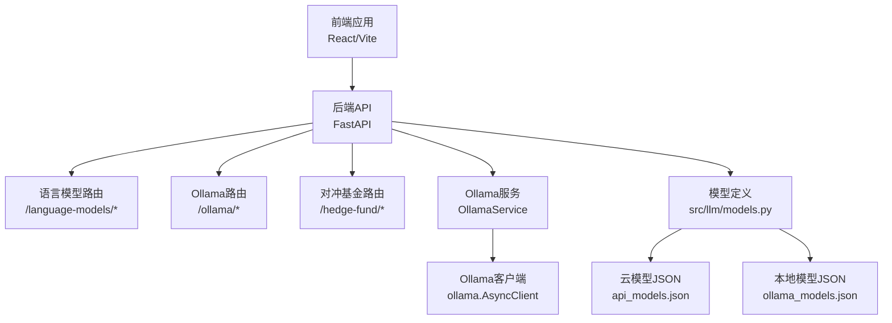
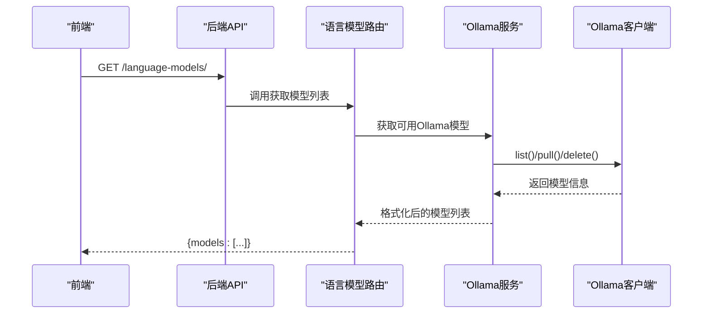
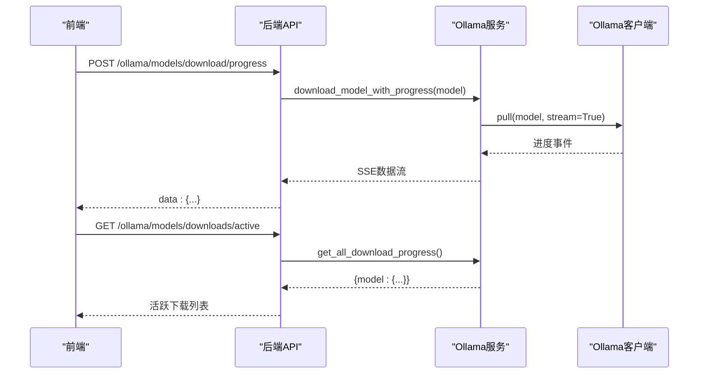
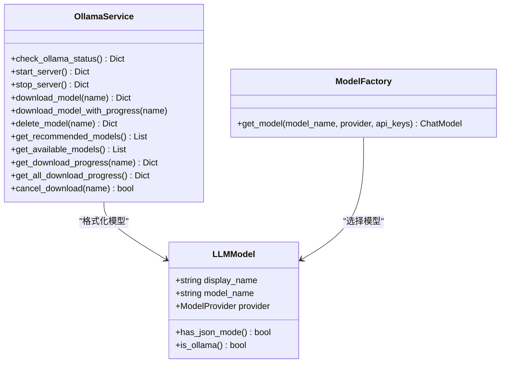
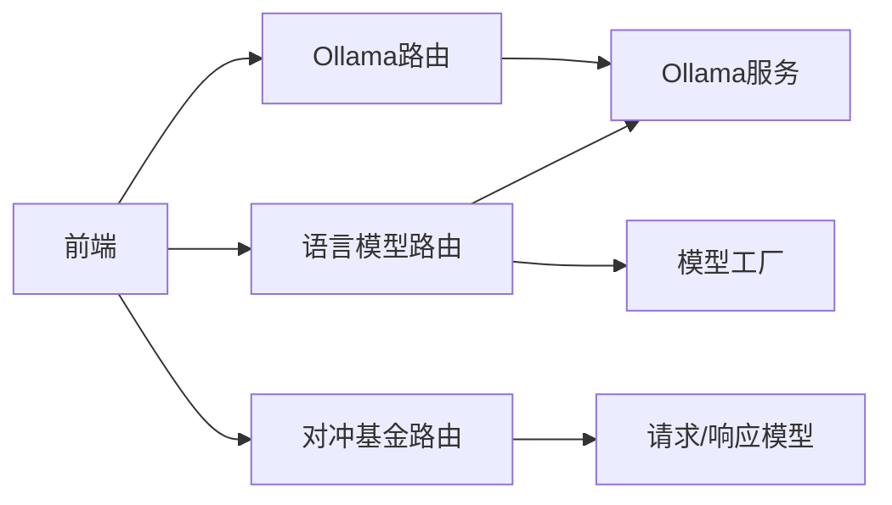

# 模型集成API

<cite>
**本文档引用的文件**
- [app/backend/routes/language_models.py](file://app/backend/routes/language_models.py)
- [app/backend/routes/ollama.py](file://app/backend/routes/ollama.py)
- [app/backend/services/ollama_service.py](file://app/backend/services/ollama_service.py)
- [src/llm/models.py](file://src/llm/models.py)
- [src/llm/api_models.json](file://src/llm/api_models.json)
- [src/llm/ollama_models.json](file://src/llm/ollama_models.json)
- [src/utils/ollama.py](file://src/utils/ollama.py)
- [app/backend/main.py](file://app/backend/main.py)
- [app/backend/models/schemas.py](file://app/backend/models/schemas.py)
- [app/backend/routes/hedge_fund.py](file://app/backend/routes/hedge_fund.py)
- [app/frontend/src/services/api.ts](file://app/frontend/src/services/api.ts)
- [app/frontend/src/data/models.ts](file://app/frontend/src/data/models.ts)
- [app/frontend/src/components/settings/models/cloud.tsx](file://app/frontend/src/components/settings/models/cloud.tsx)
- [app/frontend/src/components/settings/models/ollama.tsx](file://app/frontend/src/components/settings/models/ollama.tsx)
</cite>

## 目录
1. [简介](#简介)
2. [项目结构](#项目结构)
3. [核心组件](#核心组件)
4. [架构总览](#架构总览)
5. [详细组件分析](#详细组件分析)
6. [依赖关系分析](#依赖关系分析)
7. [性能考虑](#性能考虑)
8. [故障排除指南](#故障排除指南)
9. [结论](#结论)

## 简介
本文件为“模型集成API”的完整技术文档，覆盖以下内容：
- Ollama服务集成与本地模型管理
- 语言模型列表查询与提供商分组
- 推理请求与结果获取（含流式事件）
- 本地模型部署、远程模型调用与混合推理模式
- 模型版本管理、热更新与故障转移集成方案
- 性能监控、资源使用统计与负载均衡建议
- 完整调用示例与错误处理策略

## 项目结构
后端采用FastAPI框架，前端为React/Vite应用。模型集成主要涉及：
- 路由层：语言模型路由与Ollama管理路由
- 服务层：Ollama服务封装与模型工厂
- 前端：模型列表获取、设置界面与流式事件消费

图表来源
- [app/backend/routes/language_models.py:1-62](file://app/backend/routes/language_models.py#L1-L62)
- [app/backend/routes/ollama.py:1-319](file://app/backend/routes/ollama.py#L1-L319)
- [app/backend/services/ollama_service.py:1-519](file://app/backend/services/ollama_service.py#L1-L519)
- [src/llm/models.py:1-270](file://src/llm/models.py#L1-L270)
- [src/llm/api_models.json:1-102](file://src/llm/api_models.json#L1-L102)
- [src/llm/ollama_models.json:1-57](file://src/llm/ollama_models.json#L1-L57)

章节来源
- [app/backend/main.py:1-56](file://app/backend/main.py#L1-L56)
- [app/backend/routes/language_models.py:1-62](file://app/backend/routes/language_models.py#L1-L62)
- [app/backend/routes/ollama.py:1-319](file://app/backend/routes/ollama.py#L1-L319)
- [app/backend/services/ollama_service.py:1-519](file://app/backend/services/ollama_service.py#L1-L519)
- [src/llm/models.py:1-270](file://src/llm/models.py#L1-L270)

## 核心组件
- 语言模型路由：提供云模型与本地Ollama模型的统一列表与按提供商分组
- Ollama路由：提供状态检查、服务器启停、模型下载/删除、进度查询等管理能力
- Ollama服务：封装Ollama客户端、进程管理、下载进度追踪与模型格式化
- 模型工厂：根据提供商返回对应的LangChain模型实例
- 推理路由：以Server-Sent Events流式返回对冲基金执行结果

章节来源
- [app/backend/routes/language_models.py:13-62](file://app/backend/routes/language_models.py#L13-L62)
- [app/backend/routes/ollama.py:41-319](file://app/backend/routes/ollama.py#L41-L319)
- [app/backend/services/ollama_service.py:19-151](file://app/backend/services/ollama_service.py#L19-L151)
- [src/llm/models.py:148-270](file://src/llm/models.py#L148-L270)
- [app/backend/routes/hedge_fund.py:18-156](file://app/backend/routes/hedge_fund.py#L18-L156)

## 架构总览
模型集成API通过三层协作实现：
- 前端通过REST与SSE与后端交互
- 后端路由负责参数校验与响应格式
- 服务层负责与Ollama客户端及操作系统交互
- 模型工厂负责根据提供商选择合适的推理引擎

图表来源
- [app/backend/routes/language_models.py:20-32](file://app/backend/routes/language_models.py#L20-L32)
- [app/backend/services/ollama_service.py:124-150](file://app/backend/services/ollama_service.py#L124-L150)
- [src/llm/models.py:136-145](file://src/llm/models.py#L136-L145)

## 详细组件分析

### 语言模型管理API
- 列表查询
  - 方法：GET /language-models/
  - 行为：合并云模型与本地Ollama可用模型
  - 返回：{"models": [...]}
- 提供商分组
  - 方法：GET /language-models/providers
  - 行为：按provider分组返回模型清单
  - 返回：{"providers": [{"name": "...", "models": [...]}]}

章节来源
- [app/backend/routes/language_models.py:13-62](file://app/backend/routes/language_models.py#L13-L62)
- [src/llm/models.py:136-145](file://src/llm/models.py#L136-L145)

### Ollama服务管理API
- 状态查询
  - 方法：GET /ollama/status
  - 返回：安装状态、运行状态、可用模型、服务器URL、错误信息
- 启动/停止服务器
  - 方法：POST /ollama/start, POST /ollama/stop
  - 行为：跨平台启动/停止Ollama服务进程
  - 返回：{"success": true/false, "message": "..."}
- 模型下载与进度
  - 方法：POST /ollama/models/download
  - 方法：POST /ollama/models/download/progress（SSE）
  - 方法：GET /ollama/models/download/progress/{model_name}
  - 方法：GET /ollama/models/downloads/active
  - 行为：异步拉取模型，支持实时进度事件
- 模型删除
  - 方法：DELETE /ollama/models/{model_name}
  - 行为：删除本地已下载模型
- 推荐模型
  - 方法：GET /ollama/models/recommended
  - 返回：推荐的Ollama模型清单
- 取消下载
  - 方法：DELETE /ollama/models/download/{model_name}
  - 行为：标记下载为取消（内存中）

图表来源
- [app/backend/routes/ollama.py:158-240](file://app/backend/routes/ollama.py#L158-L240)
- [app/backend/services/ollama_service.py:93-113](file://app/backend/services/ollama_service.py#L93-L113)
- [app/backend/services/ollama_service.py:405-441](file://app/backend/services/ollama_service.py#L405-L441)

章节来源
- [app/backend/routes/ollama.py:41-319](file://app/backend/routes/ollama.py#L41-L319)
- [app/backend/services/ollama_service.py:34-173](file://app/backend/services/ollama_service.py#L34-L173)

### 模型工厂与推理集成
- 模型工厂
  - 功能：根据provider返回对应LangChain模型实例
  - 支持：OpenAI、Anthropic、Groq、Google、OpenRouter、Ollama等
  - Ollama基地址：可从环境变量读取，默认 http://localhost:11434
- 推理请求
  - 对冲基金路由：POST /hedge-fund/run
  - 流式事件：start、progress、complete、error
  - 前端SSE解析：按事件类型更新节点状态与输出

图表来源
- [src/llm/models.py:38-270](file://src/llm/models.py#L38-L270)
- [app/backend/services/ollama_service.py:19-173](file://app/backend/services/ollama_service.py#L19-L173)

章节来源
- [src/llm/models.py:148-270](file://src/llm/models.py#L148-L270)
- [app/backend/routes/hedge_fund.py:18-156](file://app/backend/routes/hedge_fund.py#L18-L156)

### 前端集成与调用示例
- 获取模型列表
  - 前端：GET http://localhost:8000/language-models/
  - 响应：{"models": [...]}
- 设置界面
  - 云模型提供商：GET http://localhost:8000/language-models/providers
  - Ollama模型：SSE流监控下载进度
- 推理执行
  - 前端：POST http://localhost:8000/hedge-fund/run
  - 响应：SSE事件流，逐条推送进度与最终结果

章节来源
- [app/frontend/src/services/api.ts:35-47](file://app/frontend/src/services/api.ts#L35-L47)
- [app/frontend/src/components/settings/models/cloud.tsx:29-46](file://app/frontend/src/components/settings/models/cloud.tsx#L29-L46)
- [app/frontend/src/components/settings/models/ollama.tsx:402-499](file://app/frontend/src/components/settings/models/ollama.tsx#L402-L499)
- [app/backend/routes/hedge_fund.py:18-156](file://app/backend/routes/hedge_fund.py#L18-L156)

## 依赖关系分析
- 路由依赖
  - 语言模型路由依赖模型工厂与Ollama服务
  - Ollama路由依赖Ollama服务
- 服务依赖
  - Ollama服务依赖ollama.AsyncClient与系统进程
- 前端依赖
  - 前端通过fetch与SSE消费后端接口
- 数据模型
  - 请求/响应模型在schemas中定义，确保类型安全

图表来源
- [app/backend/routes/language_models.py:1-11](file://app/backend/routes/language_models.py#L1-L11)
- [app/backend/routes/ollama.py:1-12](file://app/backend/routes/ollama.py#L1-L12)
- [app/backend/routes/hedge_fund.py:1-16](file://app/backend/routes/hedge_fund.py#L1-L16)
- [app/backend/models/schemas.py:61-141](file://app/backend/models/schemas.py#L61-L141)

章节来源
- [app/backend/routes/language_models.py:1-11](file://app/backend/routes/language_models.py#L1-L11)
- [app/backend/routes/ollama.py:1-12](file://app/backend/routes/ollama.py#L1-L12)
- [app/backend/models/schemas.py:61-141](file://app/backend/models/schemas.py#L61-L141)

## 性能考虑
- 下载性能
  - 使用SSE实时进度，避免轮询
  - 并发下载需谨慎控制，避免带宽与磁盘争用
- 推理性能
  - 本地Ollama推理受GPU/CPU与显存限制
  - 建议在UI中限制同时执行的推理任务数量
- 资源统计
  - 当前未提供内置指标采集；可在前端记录开始/结束时间与事件数量估算吞吐
- 负载均衡
  - 多Ollama实例或多后端实例时，建议通过反向代理实现会话亲和或无状态调度

## 故障排除指南
- Ollama未安装/未运行
  - 现象：状态查询返回installed=false或running=false
  - 处理：调用启动接口或手动执行服务命令
- 下载失败
  - 现象：SSE事件包含error字段
  - 处理：检查网络、磁盘空间与模型名称；必要时重试或取消后重新下载
- 模型不存在
  - 现象：删除/推理时报错
  - 处理：先下载模型再进行操作
- API键缺失
  - 现象：调用云模型时报错
  - 处理：在后端数据库中配置API密钥或在请求中传入

章节来源
- [app/backend/routes/ollama.py:57-119](file://app/backend/routes/ollama.py#L57-L119)
- [app/backend/routes/ollama.py:129-156](file://app/backend/routes/ollama.py#L129-L156)
- [src/llm/models.py:148-270](file://src/llm/models.py#L148-L270)

## 结论
本模型集成API提供了从模型发现、下载管理到推理执行的完整链路，支持本地Ollama与多家云模型提供商。通过SSE事件流与统一的模型工厂，系统实现了灵活的混合推理模式与良好的用户体验。建议在生产环境中结合外部监控与限流策略，确保稳定与可观测性。