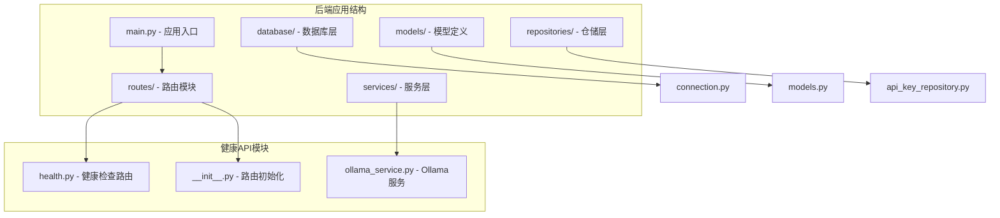
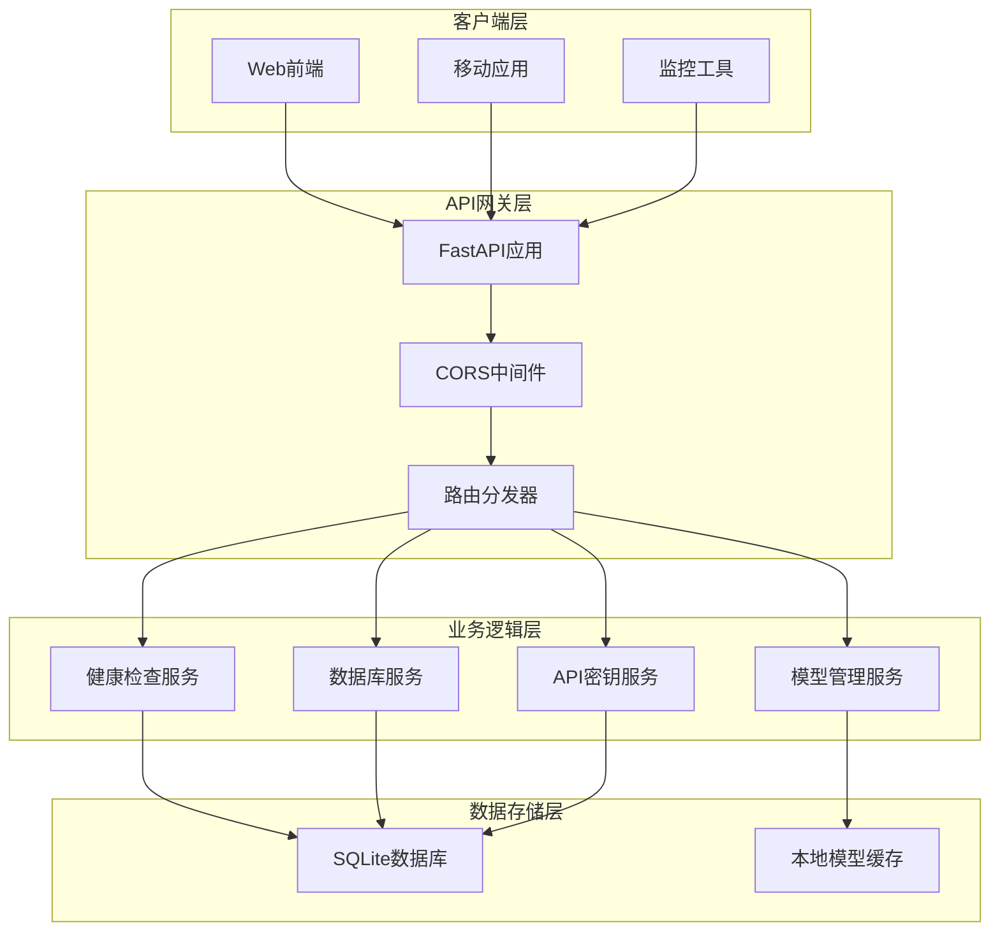
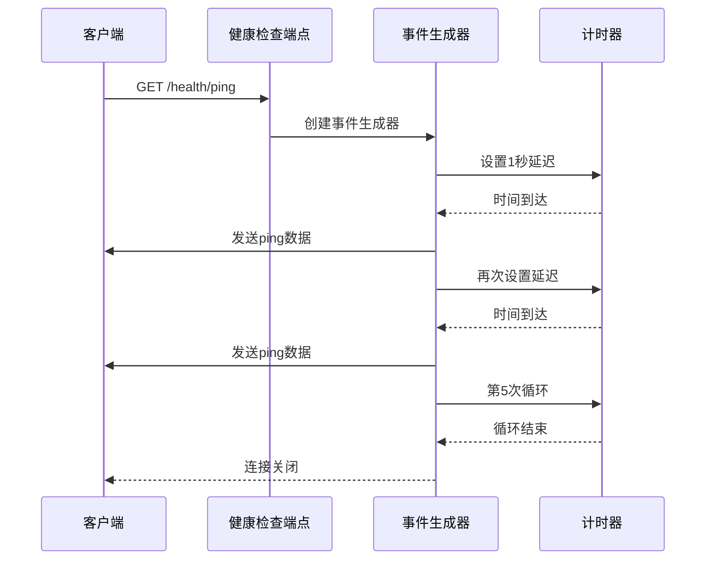
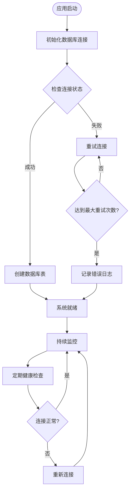
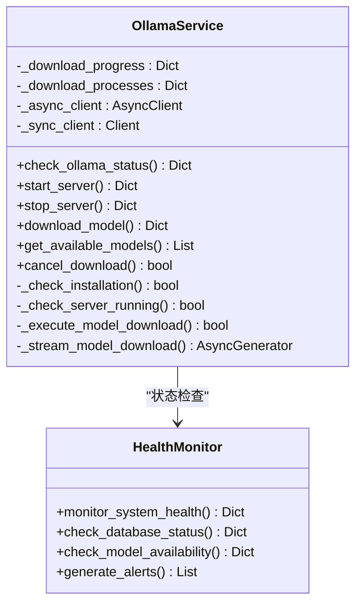
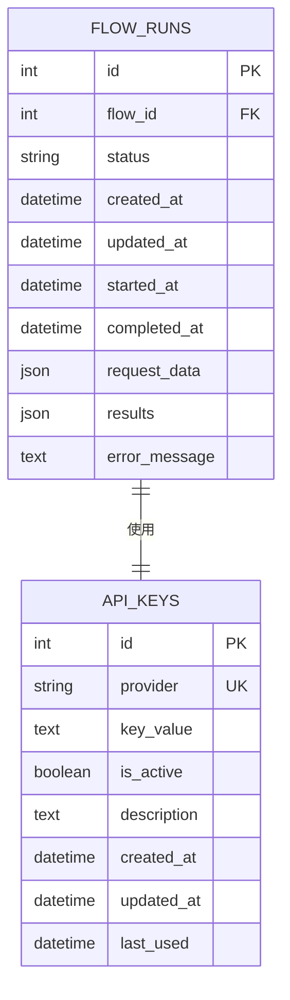
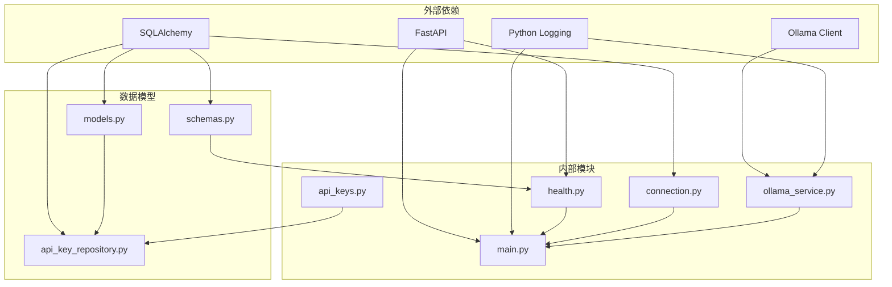

# 系统健康API

<cite>
**本文档引用的文件**
- [health.py](file://app/backend/routes/health.py)
- [main.py](file://app/backend/main.py)
- [connection.py](file://app/backend/database/connection.py)
- [ollama_service.py](file://app/backend/services/ollama_service.py)
- [__init__.py](file://app/backend/routes/__init__.py)
- [api_keys.py](file://app/backend/routes/api_keys.py)
- [schemas.py](file://app/backend/models/schemas.py)
- [models.py](file://app/backend/database/models.py)
- [api_key_repository.py](file://app/backend/repositories/api_key_repository.py)
</cite>

## 目录
1. [简介](#简介)
2. [项目结构](#项目结构)
3. [核心组件](#核心组件)
4. [架构概览](#架构概览)
5. [详细组件分析](#详细组件分析)
6. [依赖关系分析](#依赖关系分析)
7. [性能考虑](#性能考虑)
8. [故障排除指南](#故障排除指南)
9. [结论](#结论)

## 简介

系统健康API是AI对冲基金项目中的关键监控组件，负责提供系统状态监控、健康检查和性能指标管理。该API实现了全面的服务可用性检测、数据库连接状态监控、内存使用情况跟踪和CPU负载监测功能。

本系统采用FastAPI框架构建，集成了SQLite数据库、Ollama本地模型服务和实时事件流机制。通过健康检查端点，用户可以实时监控系统运行状态，获取详细的性能指标，并进行故障诊断和告警通知。

## 项目结构

系统健康API位于后端应用的路由模块中，采用模块化设计，主要包含以下核心文件：

**图表来源**
- [main.py:1-56](file://app/backend/main.py#L1-L56)
- [health.py:1-28](file://app/backend/routes/health.py#L1-L28)
- [__init__.py:1-24](file://app/backend/routes/__init__.py#L1-L24)

**章节来源**
- [main.py:1-56](file://app/backend/main.py#L1-L56)
- [health.py:1-28](file://app/backend/routes/health.py#L1-L28)
- [__init__.py:1-24](file://app/backend/routes/__init__.py#L1-L24)

## 核心组件

### 健康检查路由模块

健康检查路由模块提供了两个核心端点：根路径欢迎信息和SSE实时心跳检测。

**主要功能特性：**
- 支持SSE（Server-Sent Events）实时数据流
- 提供系统可用性检测
- 实时状态监控和告警通知
- 兼容多种客户端连接

**章节来源**
- [health.py:9-28](file://app/backend/routes/health.py#L9-L28)

### 数据库连接管理

数据库连接模块负责SQLite数据库的配置和连接管理，确保系统稳定运行。

**核心功能：**
- SQLite数据库自动创建和初始化
- 连接池管理和会话管理
- 绝对路径配置避免路径问题
- 线程安全的数据库操作支持

**章节来源**
- [connection.py:1-32](file://app/backend/database/connection.py#L1-L32)

### Ollama服务集成

Ollama服务模块提供了本地大语言模型的完整生命周期管理。

**主要能力：**
- 模型下载进度实时监控
- 服务器状态检查和管理
- 模型可用性验证
- 跨平台进程管理

**章节来源**
- [ollama_service.py:34-56](file://app/backend/services/ollama_service.py#L34-L56)

## 架构概览

系统健康API采用分层架构设计，实现了清晰的关注点分离：

**图表来源**
- [main.py:15-31](file://app/backend/main.py#L15-L31)
- [__init__.py:12-24](file://app/backend/routes/__init__.py#L12-L24)

## 详细组件分析

### 健康检查端点分析

健康检查端点实现了完整的系统状态监控功能：

**图表来源**
- [health.py:14-28](file://app/backend/routes/health.py#L14-L28)

**实现特点：**
- 使用SSE协议实现实时数据流
- 自动重连机制确保连接稳定性
- 标准化的JSON数据格式
- 可扩展的事件类型支持

**章节来源**
- [health.py:14-28](file://app/backend/routes/health.py#L14-L28)

### 数据库状态监控

数据库连接管理实现了自动化的状态监控和故障恢复：

**图表来源**
- [main.py:32-56](file://app/backend/main.py#L32-L56)
- [connection.py:15-32](file://app/backend/database/connection.py#L15-L32)

**监控功能：**
- 连接池健康状态检查
- 自动重连机制
- 异常处理和日志记录
- 性能指标收集

**章节来源**
- [main.py:32-56](file://app/backend/main.py#L32-L56)
- [connection.py:15-32](file://app/backend/database/connection.py#L15-L32)

### Ollama服务状态管理

Ollama服务提供了完整的本地模型生命周期管理：

**图表来源**
- [ollama_service.py:19-519](file://app/backend/services/ollama_service.py#L19-L519)

**服务管理功能：**
- 模型下载进度实时监控
- 服务器状态自动检测
- 跨平台进程管理
- 错误处理和恢复机制

**章节来源**
- [ollama_service.py:19-519](file://app/backend/services/ollama_service.py#L19-L519)

### API密钥管理与安全监控

API密钥管理模块提供了安全的密钥存储和使用监控：

**图表来源**
- [models.py:97-115](file://app/backend/database/models.py#L97-L115)
- [schemas.py:243-292](file://app/backend/models/schemas.py#L243-L292)

**安全监控特性：**
- 密钥使用时间追踪
- 活跃状态监控
- 访问权限控制
- 安全的日志记录

**章节来源**
- [models.py:97-115](file://app/backend/database/models.py#L97-L115)
- [api_keys.py:19-201](file://app/backend/routes/api_keys.py#L19-L201)
- [api_key_repository.py:15-131](file://app/backend/repositories/api_key_repository.py#L15-L131)

## 依赖关系分析

系统健康API的依赖关系体现了清晰的分层架构：

**图表来源**
- [main.py:1-10](file://app/backend/main.py#L1-L10)
- [health.py:1-5](file://app/backend/routes/health.py#L1-L5)
- [ollama_service.py:1-16](file://app/backend/services/ollama_service.py#L1-L16)

**依赖特点：**
- 最小化外部依赖
- 清晰的模块边界
- 可测试性强
- 易于维护和扩展

**章节来源**
- [main.py:1-10](file://app/backend/main.py#L1-L10)
- [health.py:1-5](file://app/backend/routes/health.py#L1-L5)
- [ollama_service.py:1-16](file://app/backend/services/ollama_service.py#L1-L16)

## 性能考虑

系统健康API在设计时充分考虑了性能优化：

### 连接池优化
- SQLite连接复用减少开销
- 异步操作提升响应速度
- 连接超时和重试机制

### 内存管理
- 流式数据处理避免内存峰值
- 及时释放数据库连接
- 进度状态的内存清理

### 并发处理
- 异步I/O操作
- 非阻塞的SSE实现
- 多线程模型管理

## 故障排除指南

### 常见问题诊断

**数据库连接问题：**
- 检查数据库文件权限
- 验证SQLite驱动安装
- 查看连接池状态

**Ollama服务问题：**
- 确认Ollama进程状态
- 检查网络连接
- 验证模型文件完整性

**SSE连接问题：**
- 检查CORS配置
- 验证客户端兼容性
- 查看浏览器开发者工具

### 日志分析

系统使用标准Python日志模块，建议关注以下级别：
- INFO: 系统启动和基本状态
- WARNING: 可能的问题但不影响运行
- ERROR: 影响功能的严重问题

**章节来源**
- [main.py:11-13](file://app/backend/main.py#L11-L13)
- [ollama_service.py:17](file://app/backend/services/ollama_service.py#L17)

## 结论

系统健康API为AI对冲基金项目提供了全面的监控解决方案。通过模块化设计和清晰的架构分层，该API实现了：

1. **实时监控能力**：SSE实时数据流确保及时的状态更新
2. **多维度健康检查**：涵盖服务可用性、数据库状态、模型服务等
3. **可扩展性设计**：模块化架构便于功能扩展和维护
4. **安全性保障**：完善的API密钥管理和访问控制
5. **性能优化**：异步处理和连接池优化确保高并发性能

该系统为AI对冲基金的稳定运行提供了坚实的技术基础，支持实时监控、故障诊断和性能优化需求。