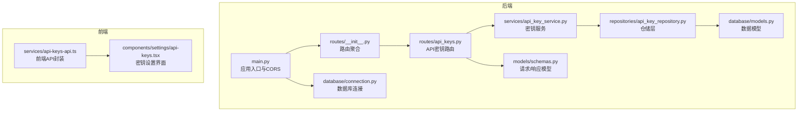
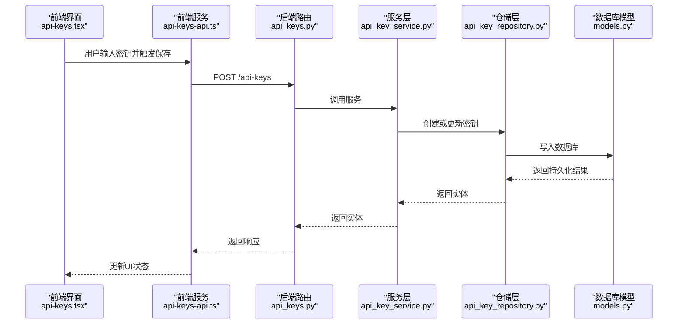
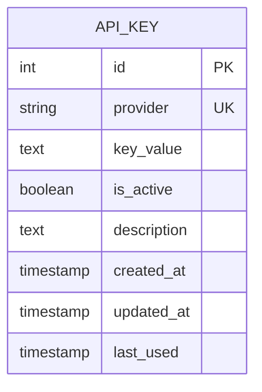
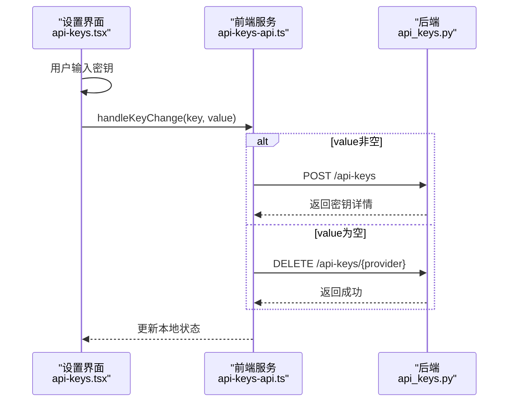
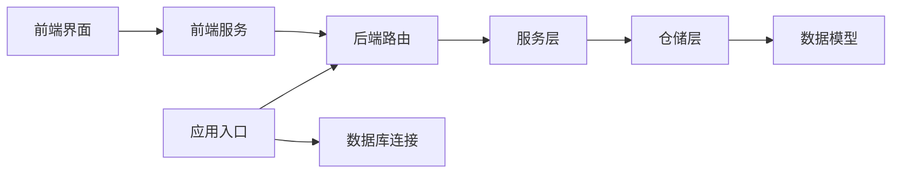

# 认证授权API

<cite>
**本文档引用的文件**
- [app/backend/main.py](file://app/backend/main.py)
- [app/backend/routes/__init__.py](file://app/backend/routes/__init__.py)
- [app/backend/routes/api_keys.py](file://app/backend/routes/api_keys.py)
- [app/backend/repositories/api_key_repository.py](file://app/backend/repositories/api_key_repository.py)
- [app/backend/services/api_key_service.py](file://app/backend/services/api_key_service.py)
- [app/backend/database/models.py](file://app/backend/database/models.py)
- [app/backend/database/connection.py](file://app/backend/database/connection.py)
- [app/backend/models/schemas.py](file://app/backend/models/schemas.py)
- [app/frontend/src/services/api-keys-api.ts](file://app/frontend/src/services/api-keys-api.ts)
- [app/frontend/src/components/settings/api-keys.tsx](file://app/frontend/src/components/settings/api-keys.tsx)
- [tests/test_api_rate_limiting.py](file://tests/test_api_rate_limiting.py)
</cite>

## 目录
1. [简介](#简介)
2. [项目结构](#项目结构)
3. [核心组件](#核心组件)
4. [架构总览](#架构总览)
5. [详细组件分析](#详细组件分析)
6. [依赖关系分析](#依赖关系分析)
7. [性能考虑](#性能考虑)
8. [故障排除指南](#故障排除指南)
9. [结论](#结论)
10. [附录](#附录)

## 简介
本文件系统化梳理并文档化本项目的认证授权API，重点覆盖以下方面：
- API密钥管理：创建、更新、轮换、禁用与删除的REST端点与流程
- 用户认证与权限控制：当前仓库未实现传统用户注册/登录/会话/角色权限体系，但提供了API密钥的本地存储与使用模式
- OAuth/第三方认证与单点登录：当前仓库未实现OAuth或SSO集成
- 安全审计与访问日志：当前仓库未实现集中式访问日志与安全审计
- 速率限制与并发控制：金融数据API调用具备客户端侧的速率限制与退避重试逻辑
- 集成示例与最佳实践：提供前后端对接示例与安全建议

## 项目结构
后端基于FastAPI，采用分层架构（路由-服务-仓储-模型），数据库为SQLite，ORM为SQLAlchemy。前端通过React组件与后端API交互。



**图表来源**
- [app/backend/main.py:1-56](file://app/backend/main.py#L1-L56)
- [app/backend/routes/__init__.py:1-24](file://app/backend/routes/__init__.py#L1-L24)
- [app/backend/routes/api_keys.py:1-201](file://app/backend/routes/api_keys.py#L1-L201)
- [app/backend/services/api_key_service.py:1-23](file://app/backend/services/api_key_service.py#L1-L23)
- [app/backend/repositories/api_key_repository.py:1-131](file://app/backend/repositories/api_key_repository.py#L1-L131)
- [app/backend/database/models.py:1-115](file://app/backend/database/models.py#L1-L115)
- [app/backend/database/connection.py:1-32](file://app/backend/database/connection.py#L1-L32)
- [app/backend/models/schemas.py:1-292](file://app/backend/models/schemas.py#L1-L292)
- [app/frontend/src/services/api-keys-api.ts:1-158](file://app/frontend/src/services/api-keys-api.ts#L1-L158)
- [app/frontend/src/components/settings/api-keys.tsx:1-319](file://app/frontend/src/components/settings/api-keys.tsx#L1-L319)

**章节来源**
- [app/backend/main.py:1-56](file://app/backend/main.py#L1-L56)
- [app/backend/routes/__init__.py:1-24](file://app/backend/routes/__init__.py#L1-L24)

## 核心组件
- 路由层：定义API密钥管理的REST端点，包括创建/查询/更新/删除/禁用/批量更新/最后使用时间更新等
- 服务层：提供加载活跃密钥字典与按提供商获取密钥值的能力
- 仓储层：封装数据库操作，支持创建/更新/查询/删除/禁用/批量更新/更新最后使用时间
- 数据模型：定义API密钥表结构及字段约束
- 前端服务：封装与后端的HTTP交互，提供密钥列表、详情、创建/更新/删除/禁用/批量更新/最后使用时间更新等方法
- 前端界面：提供密钥设置UI，自动保存与可见性切换

**章节来源**
- [app/backend/routes/api_keys.py:1-201](file://app/backend/routes/api_keys.py#L1-L201)
- [app/backend/services/api_key_service.py:1-23](file://app/backend/services/api_key_service.py#L1-L23)
- [app/backend/repositories/api_key_repository.py:1-131](file://app/backend/repositories/api_key_repository.py#L1-L131)
- [app/backend/database/models.py:97-115](file://app/backend/database/models.py#L97-L115)
- [app/frontend/src/services/api-keys-api.ts:1-158](file://app/frontend/src/services/api-keys-api.ts#L1-L158)
- [app/frontend/src/components/settings/api-keys.tsx:1-319](file://app/frontend/src/components/settings/api-keys.tsx#L1-L319)

## 架构总览
后端通过FastAPI提供REST接口，前端通过fetch与后端通信。密钥存储在本地SQLite数据库中，前端界面负责密钥的输入、显示/隐藏与自动保存。



**图表来源**
- [app/frontend/src/components/settings/api-keys.tsx:122-150](file://app/frontend/src/components/settings/api-keys.tsx#L122-L150)
- [app/frontend/src/services/api-keys-api.ts:69-82](file://app/frontend/src/services/api-keys-api.ts#L69-L82)
- [app/backend/routes/api_keys.py:27-39](file://app/backend/routes/api_keys.py#L27-L39)
- [app/backend/services/api_key_service.py:12-18](file://app/backend/services/api_key_service.py#L12-L18)
- [app/backend/repositories/api_key_repository.py:22-46](file://app/backend/repositories/api_key_repository.py#L22-L46)
- [app/backend/database/models.py:97-115](file://app/backend/database/models.py#L97-L115)

## 详细组件分析

### API密钥管理接口规范
- 基础路径：/api-keys
- 支持的操作：
  - 创建或更新：POST /
  - 查询所有（不含密钥值）：GET /
  - 按提供商查询：GET /{provider}
  - 更新：PUT /{provider}
  - 删除：DELETE /{provider}
  - 禁用：PATCH /{provider}/deactivate
  - 批量更新：POST /bulk
  - 更新最后使用时间：PATCH /{provider}/last-used

```mermaid
flowchart TD
Start(["请求进入"]) --> Method{"HTTP方法？"}
Method --> |POST| Create["创建或更新密钥"]
Method --> |GET /| List["列出活跃密钥摘要"]
Method --> |GET /{provider}| Detail["按提供商获取密钥详情"]
Method --> |PUT /{provider}| Update["更新密钥"]
Method --> |DELETE /{provider}| Delete["删除密钥"]
Method --> |PATCH /{provider}/deactivate| Deact["禁用密钥"]
Method --> |POST /bulk| Bulk["批量更新密钥"]
Method --> |PATCH /{provider}/last-used| LastUsed["更新最后使用时间"]
Create --> Repo["仓储层执行数据库操作"]
List --> Repo
Detail --> Repo
Update --> Repo
Delete --> Repo
Deact --> Repo
Bulk --> Repo
LastUsed --> Repo
Repo --> Resp["返回标准化响应模型"]
Resp --> End(["结束"])
```

**图表来源**
- [app/backend/routes/api_keys.py:19-201](file://app/backend/routes/api_keys.py#L19-L201)
- [app/backend/repositories/api_key_repository.py:15-131](file://app/backend/repositories/api_key_repository.py#L15-L131)
- [app/backend/models/schemas.py:244-292](file://app/backend/models/schemas.py#L244-L292)

**章节来源**
- [app/backend/routes/api_keys.py:19-201](file://app/backend/routes/api_keys.py#L19-L201)
- [app/backend/models/schemas.py:244-292](file://app/backend/models/schemas.py#L244-L292)

### 数据模型与仓储
- 数据模型：ApiKey表包含provider唯一索引、密钥值、启用状态、描述、创建/更新时间戳与最后使用时间
- 仓储能力：支持按提供商查询、查询全部（可含非活跃）、更新、删除、禁用、批量创建/更新、更新最后使用时间



**图表来源**
- [app/backend/database/models.py:97-115](file://app/backend/database/models.py#L97-L115)

**章节来源**
- [app/backend/database/models.py:97-115](file://app/backend/database/models.py#L97-L115)
- [app/backend/repositories/api_key_repository.py:48-118](file://app/backend/repositories/api_key_repository.py#L48-L118)

### 前端集成与用户体验
- 前端服务封装了所有API密钥相关HTTP请求，并处理错误码
- 设置界面提供密钥输入框、显示/隐藏切换、一键清空、自动保存与错误提示
- 自动保存策略：当输入非空时立即调用创建/更新；输入为空时尝试删除



**图表来源**
- [app/frontend/src/components/settings/api-keys.tsx:122-150](file://app/frontend/src/components/settings/api-keys.tsx#L122-L150)
- [app/frontend/src/services/api-keys-api.ts:69-113](file://app/frontend/src/services/api-keys-api.ts#L69-L113)
- [app/backend/routes/api_keys.py:27-127](file://app/backend/routes/api_keys.py#L27-L127)

**章节来源**
- [app/frontend/src/components/settings/api-keys.tsx:85-172](file://app/frontend/src/components/settings/api-keys.tsx#L85-L172)
- [app/frontend/src/services/api-keys-api.ts:42-158](file://app/frontend/src/services/api-keys-api.ts#L42-L158)

### 用户认证、会话管理与角色权限
- 当前仓库未实现传统用户注册/登录/会话/角色权限体系
- API密钥用于标识不同服务提供商的凭据，不涉及用户身份验证
- 若需引入用户认证，可在现有路由基础上扩展用户管理模块，并结合中间件进行鉴权

**章节来源**
- [app/backend/routes/api_keys.py:1-201](file://app/backend/routes/api_keys.py#L1-L201)
- [app/backend/main.py:1-56](file://app/backend/main.py#L1-L56)

### OAuth集成、第三方认证与单点登录
- 当前仓库未实现OAuth、第三方认证或单点登录（SSO）
- 如需集成，可在后端新增用户认证路由与中间件，并在前端添加登录/登出UI与回调处理

**章节来源**
- [app/backend/routes/__init__.py:1-24](file://app/backend/routes/__init__.py#L1-L24)

### 访问日志记录、安全审计与异常检测
- 当前仓库未实现集中式访问日志与安全审计
- 可通过中间件或装饰器收集请求元数据（IP、User-Agent、端点、耗时、状态码），并写入审计表或外部日志系统
- 异常检测可通过统一异常处理器捕获未处理异常并记录上下文信息

**章节来源**
- [app/backend/main.py:11-27](file://app/backend/main.py#L11-L27)

### 速率限制、并发控制与安全防护
- 金融数据API调用具备客户端侧的速率限制与退避重试逻辑（测试覆盖）
- 后端未实现全局速率限制中间件，建议在生产环境引入限流中间件或网关
- 安全防护建议：
  - 使用HTTPS与安全头
  - 对敏感字段加密存储
  - 输入校验与参数清理
  - 最小权限原则与最小暴露面

**章节来源**
- [tests/test_api_rate_limiting.py:1-249](file://tests/test_api_rate_limiting.py#L1-L249)

## 依赖关系分析
- 路由依赖服务层，服务层依赖仓储层，仓储层依赖数据库模型与连接
- 前端服务依赖后端路由，前端界面依赖前端服务
- 应用入口配置CORS与数据库初始化



**图表来源**
- [app/backend/main.py:1-56](file://app/backend/main.py#L1-L56)
- [app/backend/routes/__init__.py:1-24](file://app/backend/routes/__init__.py#L1-L24)
- [app/backend/routes/api_keys.py:1-201](file://app/backend/routes/api_keys.py#L1-L201)
- [app/backend/services/api_key_service.py:1-23](file://app/backend/services/api_key_service.py#L1-L23)
- [app/backend/repositories/api_key_repository.py:1-131](file://app/backend/repositories/api_key_repository.py#L1-L131)
- [app/backend/database/models.py:1-115](file://app/backend/database/models.py#L1-L115)
- [app/backend/database/connection.py:1-32](file://app/backend/database/connection.py#L1-L32)
- [app/frontend/src/services/api-keys-api.ts:1-158](file://app/frontend/src/services/api-keys-api.ts#L1-L158)
- [app/frontend/src/components/settings/api-keys.tsx:1-319](file://app/frontend/src/components/settings/api-keys.tsx#L1-L319)

**章节来源**
- [app/backend/routes/__init__.py:1-24](file://app/backend/routes/__init__.py#L1-L24)
- [app/backend/database/connection.py:1-32](file://app/backend/database/connection.py#L1-L32)

## 性能考虑
- 数据库：SQLite适用于开发与小型部署；生产建议迁移到PostgreSQL/MySQL以获得更好的并发与可靠性
- ORM：合理使用延迟加载与批量操作减少查询次数
- 前端：自动保存采用防抖/去抖策略避免频繁网络请求
- 速率限制：客户端已具备退避重试，后端可引入令牌桶/漏桶算法进行全局限流

## 故障排除指南
- 密钥不存在：后端在查询/更新/删除/禁用时若找不到提供商，返回404
- 服务器错误：后端在异常情况下返回500与错误详情
- 前端错误：统一捕获HTTP错误并提示用户
- 速率限制：客户端对429进行重试与退避，其他错误直接透传

**章节来源**
- [app/backend/routes/api_keys.py:67-78](file://app/backend/routes/api_keys.py#L67-L78)
- [app/backend/routes/api_keys.py:89-105](file://app/backend/routes/api_keys.py#L89-L105)
- [app/backend/routes/api_keys.py:116-127](file://app/backend/routes/api_keys.py#L116-L127)
- [app/backend/routes/api_keys.py:138-152](file://app/backend/routes/api_keys.py#L138-L152)
- [app/backend/routes/api_keys.py:190-201](file://app/backend/routes/api_keys.py#L190-L201)
- [app/frontend/src/services/api-keys-api.ts:58-155](file://app/frontend/src/services/api-keys-api.ts#L58-L155)
- [tests/test_api_rate_limiting.py:10-245](file://tests/test_api_rate_limiting.py#L10-L245)

## 结论
本项目提供了完善的API密钥管理能力，满足多提供商密钥的本地存储与使用需求。当前未实现用户认证、会话管理、角色权限、OAuth/SSO、集中式审计与后端限流。建议在生产环境中补充：
- 用户认证与权限体系
- OAuth/SSO集成
- 访问日志与安全审计
- 后端速率限制与并发控制
- 加密存储与传输安全

## 附录

### API密钥管理端点一览
- POST /api-keys：创建或更新密钥
- GET /api-keys：获取所有密钥摘要（不含密钥值）
- GET /api-keys/{provider}：按提供商获取密钥详情
- PUT /api-keys/{provider}：更新密钥
- DELETE /api-keys/{provider}：删除密钥
- PATCH /api-keys/{provider}/deactivate：禁用密钥
- POST /api-keys/bulk：批量更新密钥
- PATCH /api-keys/{provider}/last-used：更新最后使用时间

**章节来源**
- [app/backend/routes/api_keys.py:19-201](file://app/backend/routes/api_keys.py#L19-L201)

### 前端集成要点
- 使用apiKeysService封装HTTP请求
- 设置界面自动保存与错误提示
- 可视化切换与一键清空

**章节来源**
- [app/frontend/src/services/api-keys-api.ts:42-158](file://app/frontend/src/services/api-keys-api.ts#L42-L158)
- [app/frontend/src/components/settings/api-keys.tsx:85-172](file://app/frontend/src/components/settings/api-keys.tsx#L85-L172)