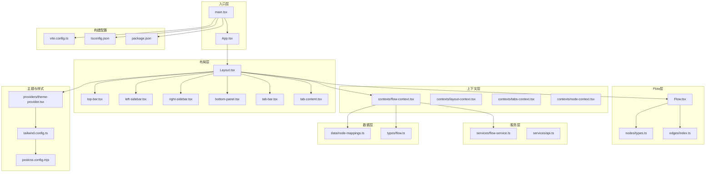
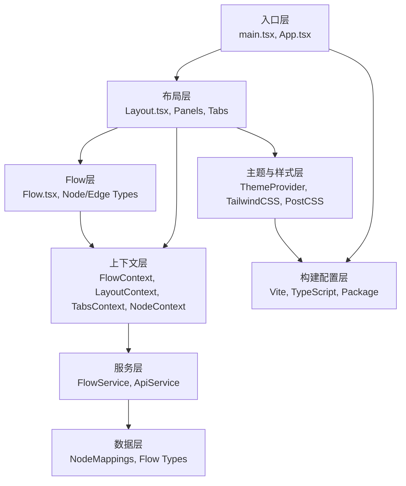
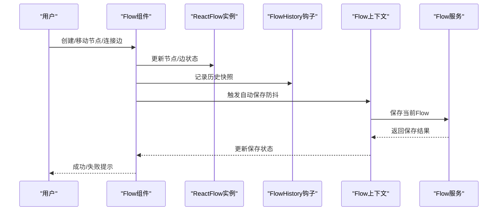
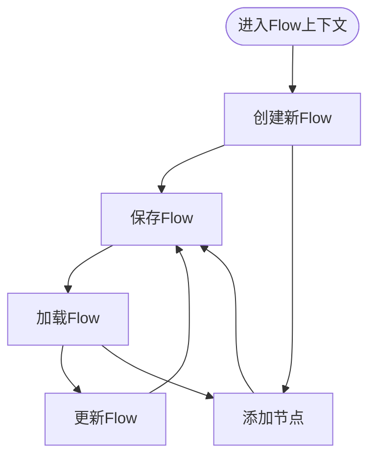
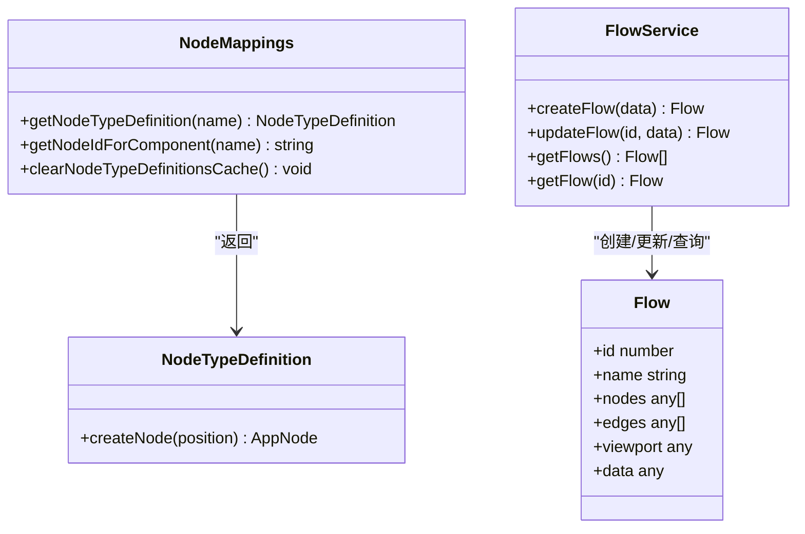
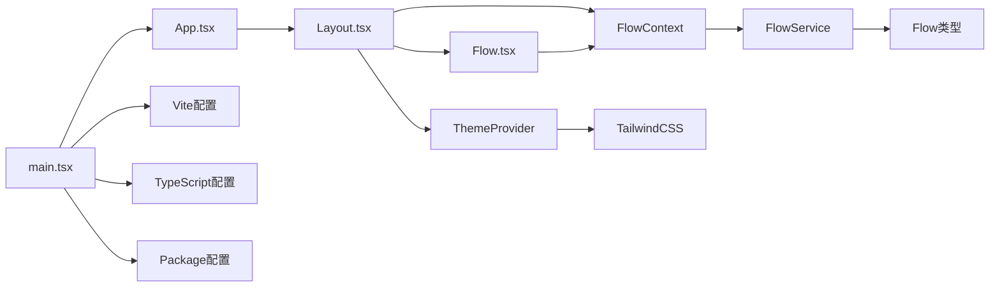

# React应用架构

<cite>
**本文档引用的文件**
- [main.tsx](file://app/frontend/src/main.tsx)
- [App.tsx](file://app/frontend/src/App.tsx)
- [Layout.tsx](file://app/frontend/src/components/Layout.tsx)
- [Flow.tsx](file://app/frontend/src/components/Flow.tsx)
- [vite.config.ts](file://app/frontend/vite.config.ts)
- [package.json](file://app/frontend/package.json)
- [tsconfig.json](file://app/frontend/tsconfig.json)
- [tailwind.config.ts](file://app/frontend/tailwind.config.ts)
- [postcss.config.mjs](file://app/frontend/postcss.config.mjs)
- [theme-provider.tsx](file://app/frontend/src/providers/theme-provider.tsx)
- [flow-context.tsx](file://app/frontend/src/contexts/flow-context.tsx)
- [flow-service.ts](file://app/frontend/src/services/flow-service.ts)
- [flow.ts](file://app/frontend/src/types/flow.ts)
- [node-mappings.ts](file://app/frontend/src/data/node-mappings.ts)
- [use-flow-management.ts](file://app/frontend/src/hooks/use-flow-management.ts)
</cite>

## 目录
1. [简介](#简介)
2. [项目结构](#项目结构)
3. [核心组件](#核心组件)
4. [架构总览](#架构总览)
5. [详细组件分析](#详细组件分析)
6. [依赖关系分析](#依赖关系分析)
7. [性能考虑](#性能考虑)
8. [故障排除指南](#故障排除指南)
9. [结论](#结论)

## 简介
本项目是一个基于React与Vite的可视化交易流编辑器，采用TypeScript进行类型安全开发，结合TailwindCSS实现主题化UI，并通过ReactFlow实现节点图编辑功能。应用采用分层架构：前端入口负责应用初始化与Provider注入；布局层负责多面板与侧边栏管理；Flow层负责节点图渲染与交互；上下文层提供状态共享；服务层负责与后端API通信；数据层提供节点映射与类型定义。

## 项目结构
前端项目采用按功能域组织的目录结构，主要分为以下模块：
- 入口与根组件：main.tsx、App.tsx
- 布局与页面：components/layout、components/panels、components/tabs
- UI组件库：components/ui（基于Radix UI与shadcn/ui）
- 节点系统：nodes、edges、data（节点映射与类型）
- 上下文与状态：contexts、hooks
- 服务层：services（API封装）
- 主题与样式：providers/theme-provider、tailwind.config.ts、postcss.config.mjs
- 构建配置：vite.config.ts、tsconfig.json、package.json

**图表来源**
- [main.tsx:1-19](file://app/frontend/src/main.tsx#L1-L19)
- [App.tsx:1-12](file://app/frontend/src/App.tsx#L1-L12)
- [Layout.tsx:1-201](file://app/frontend/src/components/Layout.tsx#L1-L201)
- [Flow.tsx:1-313](file://app/frontend/src/components/Flow.tsx#L1-L313)
- [flow-context.tsx:1-358](file://app/frontend/src/contexts/flow-context.tsx#L1-L358)
- [flow-service.ts:1-108](file://app/frontend/src/services/flow-service.ts#L1-L108)
- [node-mappings.ts:1-140](file://app/frontend/src/data/node-mappings.ts#L1-L140)
- [flow.ts:1-13](file://app/frontend/src/types/flow.ts#L1-L13)
- [theme-provider.tsx:1-19](file://app/frontend/src/providers/theme-provider.tsx#L1-L19)
- [tailwind.config.ts:1-144](file://app/frontend/tailwind.config.ts#L1-L144)
- [postcss.config.mjs:1-10](file://app/frontend/postcss.config.mjs#L1-L10)
- [vite.config.ts:1-14](file://app/frontend/vite.config.ts#L1-L14)
- [tsconfig.json:1-40](file://app/frontend/tsconfig.json#L1-L40)
- [package.json:1-56](file://app/frontend/package.json#L1-L56)

**章节来源**
- [main.tsx:1-19](file://app/frontend/src/main.tsx#L1-L19)
- [App.tsx:1-12](file://app/frontend/src/App.tsx#L1-L12)
- [Layout.tsx:1-201](file://app/frontend/src/components/Layout.tsx#L1-L201)
- [Flow.tsx:1-313](file://app/frontend/src/components/Flow.tsx#L1-L313)

## 核心组件
本节深入分析应用的核心组件及其职责与协作关系。

### 应用启动与入口
应用从main.tsx开始执行，创建根DOM节点并挂载应用。入口处通过ThemeProvider与NodeProvider为整个应用注入主题与节点上下文能力，随后渲染App根组件。

- 入口点职责
  - 初始化React DOM根实例
  - 注入主题提供者与节点提供者
  - 渲染根组件App

- 启动流程要点
  - 使用StrictMode确保开发期严格模式
  - Provider嵌套顺序影响上下文可用性
  - 样式在入口统一引入，保证全局样式一致性

**章节来源**
- [main.tsx:1-19](file://app/frontend/src/main.tsx#L1-L19)

### 根组件与布局容器
App.tsx作为根组件，简单地组合了Layout与全局通知组件。Layout是应用的主要容器，负责多面板布局、侧边栏控制、标签页管理以及Flow图的渲染。

- 根组件职责
  - 组合布局与全局通知
  - 提供最小化的应用外壳

- 布局容器职责
  - 多面板管理：顶部工具栏、左右侧边栏、底部面板
  - 标签页系统：顶部标签栏与内容区域
  - Flow图容器：ReactFlow提供者与节点/边渲染
  - 键盘快捷键：侧边栏开关、视图适配等
  - 状态持久化：侧边栏状态与Flow历史记录

**章节来源**
- [App.tsx:1-12](file://app/frontend/src/App.tsx#L1-L12)
- [Layout.tsx:1-201](file://app/frontend/src/components/Layout.tsx#L1-L201)

### Flow图组件
Flow.tsx是节点图的核心渲染组件，负责：
- 节点与边的状态管理
- 主题感知的背景与网格
- 自动保存机制（防抖）
- 撤销/重做历史记录
- 连接创建与即时保存

- 关键特性
  - 防抖自动保存：仅在结构性变更或拖拽结束后触发
  - 历史快照：每个Flow独立维护历史栈
  - 主题同步：根据resolvedTheme切换Light/Dark模式
  - 即时连接保存：新连接创建后立即持久化

**章节来源**
- [Flow.tsx:1-313](file://app/frontend/src/components/Flow.tsx#L1-L313)

### Flow上下文与状态管理
flow-context.tsx提供了Flow相关的全局状态与操作方法，包括：
- 当前Flow的增删改查
- 节点/边的添加与删除
- 视口适配与位置计算
- Flow保存与加载（含内部状态）

- 设计要点
  - 流程ID隔离：通过setNodeStateFlowId确保不同Flow的内部状态互不干扰
  - 加载恢复：支持从后端恢复节点内部状态与运行时状态
  - 批量操作：支持多节点组的批量创建与连接

**章节来源**
- [flow-context.tsx:1-358](file://app/frontend/src/contexts/flow-context.tsx#L1-L358)

### 节点映射与类型定义
node-mappings.ts定义了所有可创建的节点类型，包括基础节点与动态代理节点（来自后端）。该模块还实现了缓存机制以减少API调用开销。

- 节点映射职责
  - 定义节点创建工厂函数
  - 生成唯一节点ID（带随机后缀）
  - 支持代理节点（如各投资大师节点）的动态加载

**章节来源**
- [node-mappings.ts:1-140](file://app/frontend/src/data/node-mappings.ts#L1-L140)

### Flow服务与API集成
flow-service.ts封装了与后端的交互逻辑，包括：
- Flow列表获取、单个Flow获取
- Flow创建、更新、删除、复制
- 默认Flow创建

- 服务特点
  - 明确的请求/响应接口类型
  - 统一的错误处理与异常抛出
  - 支持模板Flow与标签管理

**章节来源**
- [flow-service.ts:1-108](file://app/frontend/src/services/flow-service.ts#L1-L108)
- [flow.ts:1-13](file://app/frontend/src/types/flow.ts#L1-L13)

## 架构总览
应用采用分层架构，自上而下分别为：入口层、布局层、Flow层、上下文层、服务层、数据层、主题与样式层、构建配置层。各层之间通过清晰的边界与依赖关系协作，形成高内聚、低耦合的体系。

**图表来源**
- [main.tsx:1-19](file://app/frontend/src/main.tsx#L1-L19)
- [Layout.tsx:1-201](file://app/frontend/src/components/Layout.tsx#L1-L201)
- [Flow.tsx:1-313](file://app/frontend/src/components/Flow.tsx#L1-L313)
- [flow-context.tsx:1-358](file://app/frontend/src/contexts/flow-context.tsx#L1-L358)
- [flow-service.ts:1-108](file://app/frontend/src/services/flow-service.ts#L1-L108)
- [node-mappings.ts:1-140](file://app/frontend/src/data/node-mappings.ts#L1-L140)
- [theme-provider.tsx:1-19](file://app/frontend/src/providers/theme-provider.tsx#L1-L19)
- [tailwind.config.ts:1-144](file://app/frontend/tailwind.config.ts#L1-L144)
- [vite.config.ts:1-14](file://app/frontend/vite.config.ts#L1-L14)
- [tsconfig.json:1-40](file://app/frontend/tsconfig.json#L1-L40)
- [package.json:1-56](file://app/frontend/package.json#L1-L56)

## 详细组件分析

### Flow组件工作流
Flow组件通过ReactFlow提供者渲染节点图，结合撤销/重做历史与自动保存机制，确保用户操作的可靠性与持久化。

**图表来源**
- [Flow.tsx:57-89](file://app/frontend/src/components/Flow.tsx#L57-L89)
- [Flow.tsx:91-143](file://app/frontend/src/components/Flow.tsx#L91-L143)
- [flow-context.tsx:74-131](file://app/frontend/src/contexts/flow-context.tsx#L74-L131)
- [flow-service.ts:47-74](file://app/frontend/src/services/flow-service.ts#L47-L74)

**章节来源**
- [Flow.tsx:1-313](file://app/frontend/src/components/Flow.tsx#L1-L313)
- [flow-context.tsx:1-358](file://app/frontend/src/contexts/flow-context.tsx#L1-L358)
- [flow-service.ts:1-108](file://app/frontend/src/services/flow-service.ts#L1-L108)

### Flow上下文状态流转
Flow上下文负责Flow的生命周期管理，包括创建、保存、加载与新建。其内部通过ReactFlow实例与服务层协作完成状态持久化。

**图表来源**
- [flow-context.tsx:190-214](file://app/frontend/src/contexts/flow-context.tsx#L190-L214)
- [flow-context.tsx:74-131](file://app/frontend/src/contexts/flow-context.tsx#L74-L131)
- [flow-context.tsx:134-188](file://app/frontend/src/contexts/flow-context.tsx#L134-L188)

**章节来源**
- [flow-context.tsx:1-358](file://app/frontend/src/contexts/flow-context.tsx#L1-L358)

### 节点映射与类型系统
节点映射模块定义了所有可创建的节点类型，并通过缓存机制提升性能。类型系统确保节点创建过程中的类型安全。

**图表来源**
- [node-mappings.ts:5-121](file://app/frontend/src/data/node-mappings.ts#L5-L121)
- [flow-service.ts:27-108](file://app/frontend/src/services/flow-service.ts#L27-L108)
- [flow.ts:1-13](file://app/frontend/src/types/flow.ts#L1-L13)

**章节来源**
- [node-mappings.ts:1-140](file://app/frontend/src/data/node-mappings.ts#L1-L140)
- [flow-service.ts:1-108](file://app/frontend/src/services/flow-service.ts#L1-L108)
- [flow.ts:1-13](file://app/frontend/src/types/flow.ts#L1-L13)

### Flow管理钩子
use-flow-management.ts整合了Flow的CRUD操作、搜索过滤、分组展示与默认Flow创建逻辑，同时负责状态增强保存与加载。

- 功能概览
  - Flow列表加载与默认Flow创建
  - 搜索与分组展示
  - 增强保存：同时保存内部状态与运行时上下文
  - 增强加载：恢复配置状态与运行时状态

**章节来源**
- [use-flow-management.ts:1-336](file://app/frontend/src/hooks/use-flow-management.ts#L1-L336)

## 依赖关系分析
应用的依赖关系呈现清晰的单向依赖链：入口层依赖布局层；布局层依赖上下文层与Flow层；Flow层依赖上下文层；上下文层依赖服务层；服务层依赖数据层；主题与样式层与构建配置层贯穿于各层之间。

**图表来源**
- [main.tsx:1-19](file://app/frontend/src/main.tsx#L1-L19)
- [Layout.tsx:1-201](file://app/frontend/src/components/Layout.tsx#L1-L201)
- [Flow.tsx:1-313](file://app/frontend/src/components/Flow.tsx#L1-L313)
- [flow-context.tsx:1-358](file://app/frontend/src/contexts/flow-context.tsx#L1-L358)
- [flow-service.ts:1-108](file://app/frontend/src/services/flow-service.ts#L1-L108)
- [flow.ts:1-13](file://app/frontend/src/types/flow.ts#L1-L13)
- [theme-provider.tsx:1-19](file://app/frontend/src/providers/theme-provider.tsx#L1-L19)
- [tailwind.config.ts:1-144](file://app/frontend/tailwind.config.ts#L1-L144)
- [vite.config.ts:1-14](file://app/frontend/vite.config.ts#L1-L14)
- [tsconfig.json:1-40](file://app/frontend/tsconfig.json#L1-L40)
- [package.json:1-56](file://app/frontend/package.json#L1-L56)

**章节来源**
- [main.tsx:1-19](file://app/frontend/src/main.tsx#L1-L19)
- [Layout.tsx:1-201](file://app/frontend/src/components/Layout.tsx#L1-L201)
- [Flow.tsx:1-313](file://app/frontend/src/components/Flow.tsx#L1-L313)
- [flow-context.tsx:1-358](file://app/frontend/src/contexts/flow-context.tsx#L1-L358)
- [flow-service.ts:1-108](file://app/frontend/src/services/flow-service.ts#L1-L108)
- [flow.ts:1-13](file://app/frontend/src/types/flow.ts#L1-L13)
- [theme-provider.tsx:1-19](file://app/frontend/src/providers/theme-provider.tsx#L1-L19)
- [tailwind.config.ts:1-144](file://app/frontend/tailwind.config.ts#L1-L144)
- [vite.config.ts:1-14](file://app/frontend/vite.config.ts#L1-L14)
- [tsconfig.json:1-40](file://app/frontend/tsconfig.json#L1-L40)
- [package.json:1-56](file://app/frontend/package.json#L1-L56)

## 性能考虑
- 自动保存防抖：Flow组件对节点/边变化采用1秒防抖，避免频繁网络请求；连接创建采用即时保存策略，确保结构性变更的及时持久化。
- 缓存策略：节点映射模块对后端代理节点定义进行缓存，减少重复API调用。
- 主题感知：Flow组件根据resolvedTheme选择Light/Dark模式，避免不必要的重渲染。
- 状态隔离：Flow上下文通过Flow ID隔离内部状态，防止跨Flow状态污染。
- 构建优化：Vite使用React插件与路径别名，提升开发体验与打包效率；TypeScript启用严格模式与bundler解析，确保类型安全与模块解析正确性。

## 故障排除指南
- Flow保存失败
  - 检查Flow服务端点可达性与响应状态
  - 查看Flow上下文中的错误日志与异常抛出
  - 确认自动保存触发条件与防抖时间设置

- 节点无法创建
  - 确认节点映射是否已缓存
  - 检查节点类型定义是否存在
  - 验证唯一ID生成逻辑

- 主题切换异常
  - 检查ThemeProvider配置与storageKey
  - 确认TailwindCSS类名与CSS变量映射

- 构建问题
  - 检查Vite配置中的路径别名与插件
  - 确认TypeScript编译选项与模块解析策略

**章节来源**
- [flow-service.ts:29-35](file://app/frontend/src/services/flow-service.ts#L29-L35)
- [flow-context.tsx:25-29](file://app/frontend/src/contexts/flow-context.tsx#L25-L29)
- [node-mappings.ts:85-116](file://app/frontend/src/data/node-mappings.ts#L85-L116)
- [theme-provider.tsx:8-19](file://app/frontend/src/providers/theme-provider.tsx#L8-L19)
- [vite.config.ts:6-13](file://app/frontend/vite.config.ts#L6-L13)
- [tsconfig.json:12-18](file://app/frontend/tsconfig.json#L12-L18)

## 结论
本React应用通过清晰的分层架构、完善的上下文与服务层设计、严格的TypeScript类型约束以及现代化的构建与样式配置，实现了高性能、可维护且用户体验优秀的可视化交易流编辑器。Flow组件的自动保存与历史管理机制、节点映射的缓存策略以及主题系统的无缝集成，共同构成了稳定可靠的前端基础设施。未来可在路由系统、代码分割与懒加载方面进一步扩展，以支持更复杂的导航与大型应用场景。