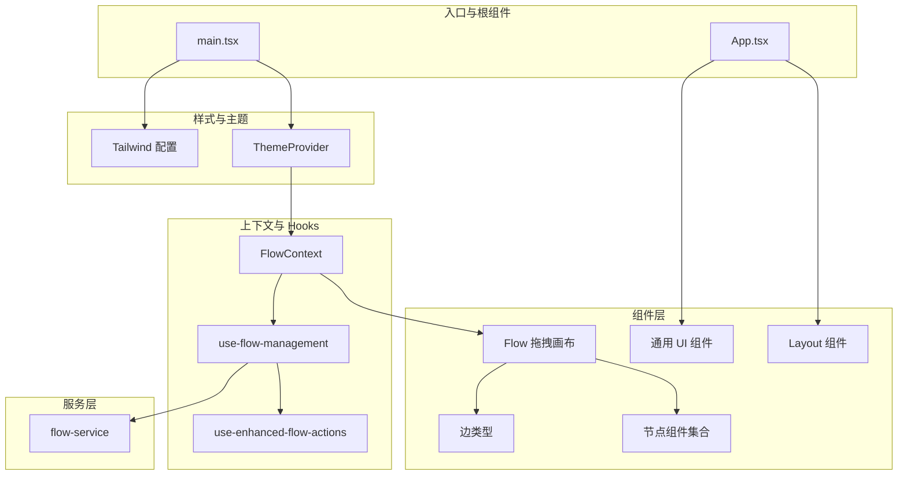
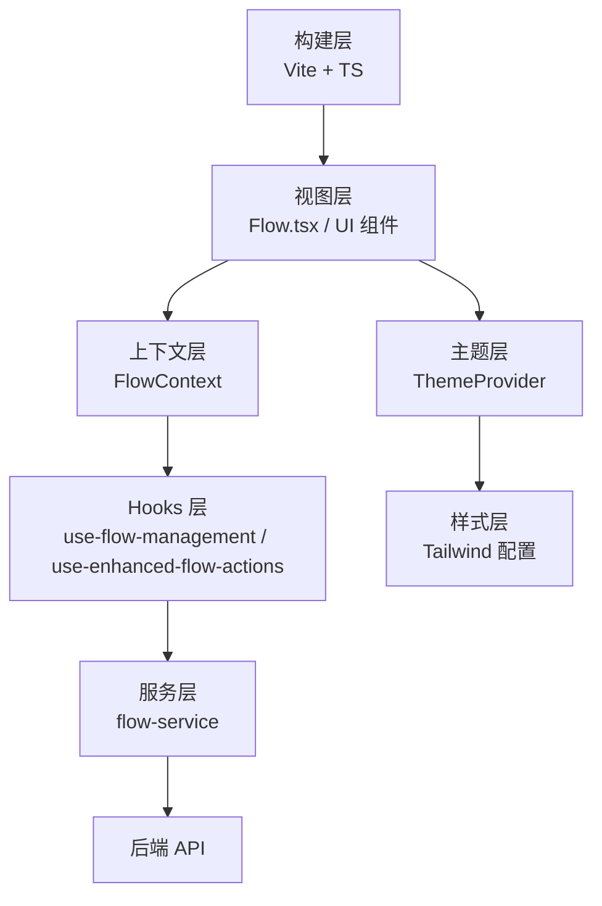
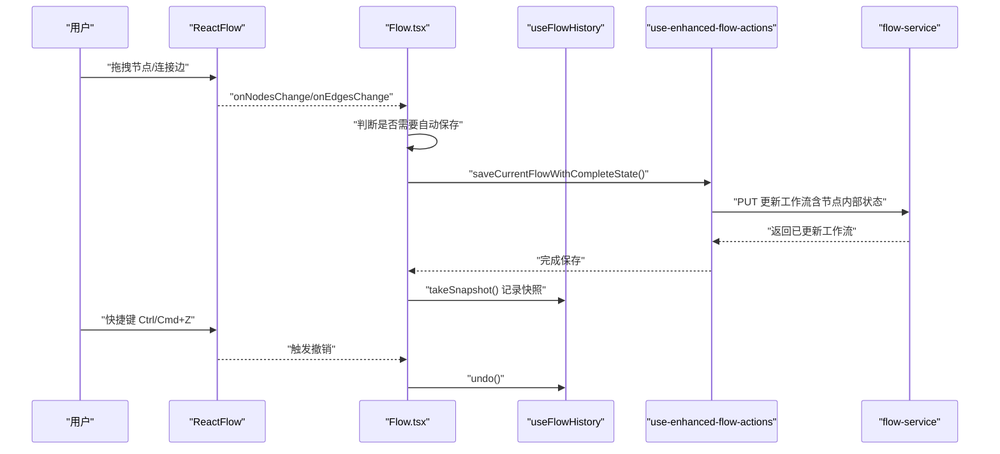
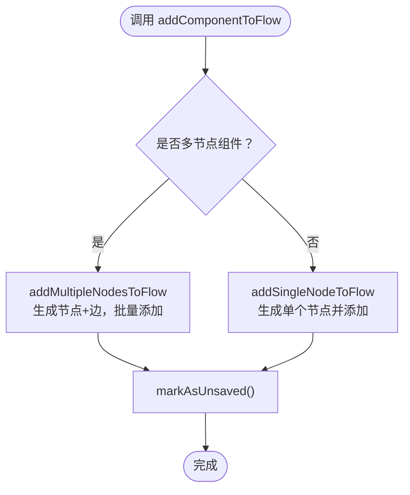
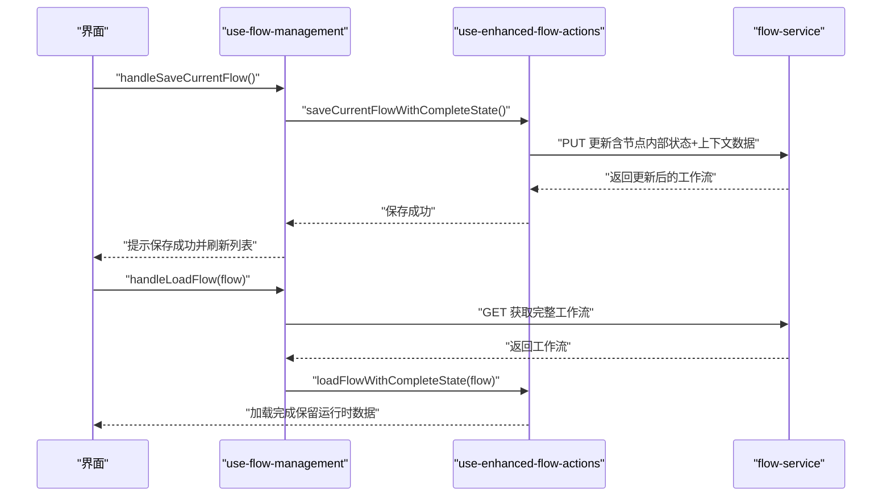
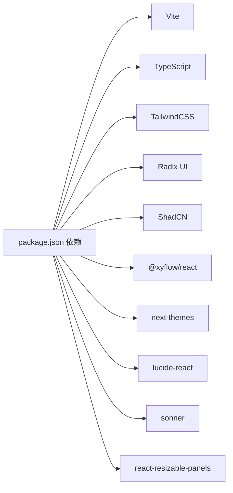

# 前端应用

<cite>
**本文引用的文件**
- [package.json](file://app/frontend/package.json)
- [main.tsx](file://app/frontend/src/main.tsx)
- [App.tsx](file://app/frontend/src/App.tsx)
- [vite.config.ts](file://app/frontend/vite.config.ts)
- [tailwind.config.ts](file://app/frontend/tailwind.config.ts)
- [tsconfig.json](file://app/frontend/tsconfig.json)
- [Flow.tsx](file://app/frontend/src/components/Flow.tsx)
- [flow-context.tsx](file://app/frontend/src/contexts/flow-context.tsx)
- [use-flow-management.ts](file://app/frontend/src/hooks/use-flow-management.ts)
- [nodes/index.ts](file://app/frontend/src/nodes/index.ts)
- [flow-service.ts](file://app/frontend/src/services/flow-service.ts)
- [theme-provider.tsx](file://app/frontend/src/providers/theme-provider.tsx)
- [button.tsx](file://app/frontend/src/components/ui/button.tsx)
- [node-mappings.ts](file://app/frontend/src/data/node-mappings.ts)
- [use-enhanced-flow-actions.ts](file://app/frontend/src/hooks/use-enhanced-flow-actions.ts)
- [custom-controls.tsx](file://app/frontend/src/components/custom-controls.tsx)
- [utils.ts](file://app/frontend/src/lib/utils.ts)
</cite>

## 目录
1. [简介](#简介)
2. [项目结构](#项目结构)
3. [核心组件](#核心组件)
4. [架构总览](#架构总览)
5. [详细组件分析](#详细组件分析)
6. [依赖关系分析](#依赖关系分析)
7. [性能考虑](#性能考虑)
8. [故障排查指南](#故障排查指南)
9. [结论](#结论)
10. [附录](#附录)

## 简介
本项目是一个基于 React 的 AI 对冲基金工作流编辑器前端应用，采用 Vite 构建工具与 TypeScript 开发，结合 Radix UI、ShadCN 组件库与 TailwindCSS 样式体系，实现拖拽式节点工作流编辑、多节点组合、状态持久化、主题系统与无障碍支持。应用通过 @xyflow/react 提供的可视化画布实现节点与边的拖拽、连接与渲染；通过自定义上下文与 Hooks 实现工作流生命周期管理、历史快照与自动保存；通过服务层对接后端 API 完成工作流的增删改查与复制。

## 项目结构
前端代码位于 app/frontend 目录，采用按功能域分层的组织方式：
- 入口与根组件：main.tsx、App.tsx
- 组件层：layout、panels、tabs、ui、nodes、edges 等
- 上下文与 Hooks：flow-context、node-context、tabs-context 等
- 服务层：flow-service、api-keys-api、backtest-api 等
- 数据与映射：node-mappings、multi-node-mappings、sidebar-components 等
- 工具与样式：lib/utils.ts、providers/theme-provider.tsx、tailwind.config.ts
- 配置：vite.config.ts、tsconfig.json、package.json

**图示来源**
- [main.tsx:1-19](file://app/frontend/src/main.tsx#L1-L19)
- [App.tsx:1-12](file://app/frontend/src/App.tsx#L1-L12)
- [Flow.tsx:1-313](file://app/frontend/src/components/Flow.tsx#L1-L313)
- [flow-context.tsx:1-358](file://app/frontend/src/contexts/flow-context.tsx#L1-L358)
- [use-flow-management.ts:1-336](file://app/frontend/src/hooks/use-flow-management.ts#L1-L336)
- [use-enhanced-flow-actions.ts:1-112](file://app/frontend/src/hooks/use-enhanced-flow-actions.ts#L1-L112)
- [flow-service.ts:1-108](file://app/frontend/src/services/flow-service.ts#L1-L108)
- [theme-provider.tsx:1-19](file://app/frontend/src/providers/theme-provider.tsx#L1-L19)
- [tailwind.config.ts:1-144](file://app/frontend/tailwind.config.ts#L1-L144)

**章节来源**
- [main.tsx:1-19](file://app/frontend/src/main.tsx#L1-L19)
- [App.tsx:1-12](file://app/frontend/src/App.tsx#L1-L12)
- [vite.config.ts:1-14](file://app/frontend/vite.config.ts#L1-L14)
- [tsconfig.json:1-40](file://app/frontend/tsconfig.json#L1-L40)

## 核心组件
- Flow 拖拽画布：负责节点与边的状态管理、连接处理、主题适配、自动保存与历史快照。
- FlowContext：提供工作流的创建、加载、保存、删除等上下文能力，并维护当前工作流 ID 与未保存状态。
- use-flow-management：封装工作流列表、搜索、分组、默认工作流创建与加载、完整状态保存/恢复。
- use-enhanced-flow-actions：在基础保存/加载基础上，额外持久化与恢复节点内部状态与运行时上下文数据。
- nodes/index：注册节点类型与初始节点/边，统一导出 nodeTypes。
- flow-service：封装与后端 API 的交互，包括获取、创建、更新、删除、复制工作流。
- ThemeProvider：基于 next-themes 实现明暗主题切换与系统偏好同步。
- UI 组件：基于 shadcn 和 Radix UI 的按钮、对话框、输入框等通用组件。
- 自定义控件：提供重置画布等操作按钮。

**章节来源**
- [Flow.tsx:1-313](file://app/frontend/src/components/Flow.tsx#L1-L313)
- [flow-context.tsx:1-358](file://app/frontend/src/contexts/flow-context.tsx#L1-L358)
- [use-flow-management.ts:1-336](file://app/frontend/src/hooks/use-flow-management.ts#L1-L336)
- [use-enhanced-flow-actions.ts:1-112](file://app/frontend/src/hooks/use-enhanced-flow-actions.ts#L1-L112)
- [nodes/index.ts:1-60](file://app/frontend/src/nodes/index.ts#L1-L60)
- [flow-service.ts:1-108](file://app/frontend/src/services/flow-service.ts#L1-L108)
- [theme-provider.tsx:1-19](file://app/frontend/src/providers/theme-provider.tsx#L1-L19)
- [button.tsx:1-58](file://app/frontend/src/components/ui/button.tsx#L1-L58)
- [custom-controls.tsx:1-21](file://app/frontend/src/components/custom-controls.tsx#L1-L21)

## 架构总览
应用采用“上下文 + Hooks + 服务层”的分层架构：
- 视图层：Flow 画布、UI 组件、布局组件
- 状态层：FlowContext 管理工作流全局状态；use-flow-management 管理列表与筛选；use-enhanced-flow-actions 负责完整状态持久化
- 数据层：flow-service 封装 API；node-mappings 提供节点类型与 ID 生成策略
- 主题与样式：ThemeProvider + TailwindCSS 变量与动画插件
- 构建与别名：Vite + TypeScript + 路径别名 @/*

**图示来源**
- [Flow.tsx:1-313](file://app/frontend/src/components/Flow.tsx#L1-L313)
- [flow-context.tsx:1-358](file://app/frontend/src/contexts/flow-context.tsx#L1-L358)
- [use-flow-management.ts:1-336](file://app/frontend/src/hooks/use-flow-management.ts#L1-L336)
- [use-enhanced-flow-actions.ts:1-112](file://app/frontend/src/hooks/use-enhanced-flow-actions.ts#L1-L112)
- [flow-service.ts:1-108](file://app/frontend/src/services/flow-service.ts#L1-L108)
- [theme-provider.tsx:1-19](file://app/frontend/src/providers/theme-provider.tsx#L1-L19)
- [tailwind.config.ts:1-144](file://app/frontend/tailwind.config.ts#L1-L144)
- [vite.config.ts:1-14](file://app/frontend/vite.config.ts#L1-L14)
- [tsconfig.json:1-40](file://app/frontend/tsconfig.json#L1-L40)

## 详细组件分析

### Flow 拖拽画布（Flow）
- 功能要点
  - 使用 @xyflow/react 的 ReactFlow 组件承载节点与边，支持拖拽、缩放、连接与背景网格
  - 主题适配：根据 next-themes 的 resolvedTheme 切换 light/dark 模式
  - 自动保存：对节点位置变更、新增/删除、连接建立进行防抖与即时保存
  - 历史快照：基于 useFlowHistory 维护每个工作流独立的历史栈，支持撤销/重做
  - 快捷键：支持 Ctrl/Cmd+Z 撤销、Shift+Ctrl/Cmd+Z 重做
  - 背景：根据主题动态设置网格颜色与背景色
- 关键流程
  - onNodesChange/onEdgesChange 增强处理，仅在必要变更类型触发自动保存
  - onConnect 连接建立后立即保存，避免丢失新连接
  - 初始化时 takeSnapshot 记录初始状态

**图示来源**
- [Flow.tsx:1-313](file://app/frontend/src/components/Flow.tsx#L1-L313)
- [use-enhanced-flow-actions.ts:1-112](file://app/frontend/src/hooks/use-enhanced-flow-actions.ts#L1-L112)
- [flow-service.ts:1-108](file://app/frontend/src/services/flow-service.ts#L1-L108)

**章节来源**
- [Flow.tsx:1-313](file://app/frontend/src/components/Flow.tsx#L1-L313)

### FlowContext（工作流上下文）
- 职责
  - 维护当前工作流 ID、名称与未保存状态
  - 提供添加组件到画布、保存/加载/创建新工作流、计算画布中心点等能力
  - 支持单节点与多节点（组）添加，自动居中与批量连接
  - 在加载时隔离节点内部状态（use-node-state），并在合适时机恢复
- 关键点
  - addComponentToFlow 根据是否为多节点组件路由到不同添加逻辑
  - loadFlow 中先设置 flowId 再渲染节点，确保 use-node-state 初始化正确
  - 与 flow-service 协作完成持久化与读取

**图示来源**
- [flow-context.tsx:1-358](file://app/frontend/src/contexts/flow-context.tsx#L1-L358)

**章节来源**
- [flow-context.tsx:1-358](file://app/frontend/src/contexts/flow-context.tsx#L1-L358)

### use-flow-management（工作流管理 Hooks）
- 职责
  - 管理工作流列表、搜索、分组（最近与模板）
  - 创建默认工作流、加载工作流、刷新列表、删除工作流
  - 与 use-enhanced-flow-actions 协作，实现“完整状态”保存/加载（包含节点内部状态与运行时上下文数据）
- 关键点
  - 保存时临时替换 React Flow 节点以注入 internal_state，保存后再恢复
  - 加载时仅恢复配置状态，运行时数据保持新鲜
  - 本地存储记录上次选择的工作流 ID

**图示来源**
- [use-flow-management.ts:1-336](file://app/frontend/src/hooks/use-flow-management.ts#L1-L336)
- [use-enhanced-flow-actions.ts:1-112](file://app/frontend/src/hooks/use-enhanced-flow-actions.ts#L1-L112)
- [flow-service.ts:1-108](file://app/frontend/src/services/flow-service.ts#L1-L108)

**章节来源**
- [use-flow-management.ts:1-336](file://app/frontend/src/hooks/use-flow-management.ts#L1-L336)

### use-enhanced-flow-actions（增强工作流动作）
- 职责
  - 在基础保存/加载之上，额外持久化与恢复节点内部状态（use-node-state）与节点上下文数据（node context）
  - 通过 exportNodeContextData 导出运行时数据，更新到 flow.data.nodeContextData
- 关键点
  - 保存前临时替换节点以注入 internal_state，保存后恢复原节点
  - 加载时仅恢复配置状态，不恢复运行时上下文数据

**章节来源**
- [use-enhanced-flow-actions.ts:1-112](file://app/frontend/src/hooks/use-enhanced-flow-actions.ts#L1-L112)

### 节点与边注册（nodes/index）
- 职责
  - 注册所有可用节点类型（如 agent-node、portfolio-manager-node 等）
  - 提供初始节点与初始边，便于首次体验
- 关键点
  - nodeTypes 映射到具体组件
  - initialNodes/initialEdges 用于演示与引导

**章节来源**
- [nodes/index.ts:1-60](file://app/frontend/src/nodes/index.ts#L1-L60)

### 节点类型映射（node-mappings）
- 职责
  - 将侧边栏组件名称映射为节点创建函数，支持动态生成唯一 ID 后缀
  - 缓存节点定义以减少重复请求
  - 提供提取基础代理键的能力，用于状态隔离与识别
- 关键点
  - generateUniqueIdSuffix 保证节点 ID 唯一性
  - getNodeTypeDefinition 异步获取代理列表并生成节点定义

**章节来源**
- [node-mappings.ts:1-140](file://app/frontend/src/data/node-mappings.ts#L1-L140)

### 主题系统（ThemeProvider）
- 职责
  - 基于 next-themes 提供明/暗/系统主题切换
  - 存储键为 theme，支持系统偏好跟随
- 关键点
  - attribute="class" 便于 TailwindCSS 使用类名切换
  - 默认系统主题，启用系统开关

**章节来源**
- [theme-provider.tsx:1-19](file://app/frontend/src/providers/theme-provider.tsx#L1-L19)

### UI 组件（以 Button 为例）
- 特点
  - 基于 class-variance-authority 的变体系统，支持多种 variant 与 size
  - 支持 asChild 渲染为任意元素
  - 与 TailwindCSS 类合并工具配合，实现可组合样式
- 关键点
  - ButtonVariants 定义默认样式与尺寸
  - forwardRef 透传 ref 与属性

**章节来源**
- [button.tsx:1-58](file://app/frontend/src/components/ui/button.tsx#L1-L58)

### 自定义控件（CustomControls）
- 功能
  - 提供重置画布的控件按钮，定位在底部中央
- 关键点
  - 使用 @xyflow/react 的 Controls 与 ControlButton
  - 样式通过 Tailwind 类名覆盖

**章节来源**
- [custom-controls.tsx:1-21](file://app/frontend/src/components/custom-controls.tsx#L1-L21)

### 工具与平台检测（utils）
- 功能
  - cn：合并与去重 CSS 类
  - isMac：平台检测
  - formatKeyboardShortcut：格式化快捷键显示（Mac 用 ⌘）
  - getProviderColor：占位的颜色提供函数（可扩展）

**章节来源**
- [utils.ts:1-39](file://app/frontend/src/lib/utils.ts#L1-L39)

## 依赖关系分析
- 构建与工具链
  - Vite：开发服务器与打包
  - TypeScript：类型检查与编译
  - TailwindCSS：原子化样式与主题变量
  - Radix UI + ShadCN：语义化 UI 组件
  - @xyflow/react：可视化画布与节点/边渲染
- 运行时依赖
  - next-themes：主题提供者
  - lucide-react：图标库
  - sonner：通知提示
  - react-resizable-panels：面板可调整大小
- 开发依赖
  - ESLint + 插件：代码规范与错误检查
  - PostCSS + Tailwind 插件：样式处理与动画

**图示来源**
- [package.json:1-56](file://app/frontend/package.json#L1-L56)

**章节来源**
- [package.json:1-56](file://app/frontend/package.json#L1-L56)

## 性能考虑
- 自动保存与快照
  - Flow.tsx 对节点位置变更与连接建立进行防抖保存，降低频繁写入
  - takeSnapshot 采用 500ms 防抖，避免历史栈过于频繁
- 状态隔离
  - FlowContext 在加载时优先设置 flowId，确保 use-node-state 初始化正确，避免跨流状态污染
- 组件懒加载与代码分割
  - 建议对大型面板与图表组件使用 React.lazy 与 Suspense，按需加载
- 图标与样式
  - lucide-react 为轻量 SVG 图标库，按需引入可减少体积
  - TailwindCSS 需开启 purge/Tree-shaking，避免无用样式进入产物
- 画布渲染
  - 大规模节点/边时，建议启用虚拟滚动或分页渲染策略（如 @xyflow/react 支持的优化项）

[本节为通用性能建议，不直接分析具体文件]

## 故障排查指南
- 保存失败
  - 现象：保存按钮无响应或报错
  - 排查：检查 use-flow-management 的保存流程与 use-enhanced-flow-actions 的状态注入是否成功；确认 flow-service 的 API 地址与权限
  - 参考路径：[use-flow-management.ts:58-109](file://app/frontend/src/hooks/use-flow-management.ts#L58-L109)、[use-enhanced-flow-actions.ts:21-72](file://app/frontend/src/hooks/use-enhanced-flow-actions.ts#L21-L72)、[flow-service.ts:47-74](file://app/frontend/src/services/flow-service.ts#L47-L74)
- 加载工作流后状态异常
  - 现象：节点状态错乱或运行时数据未清空
  - 排查：确认 loadFlowWithCompleteState 是否仅恢复配置状态，运行时数据应在执行前清空
  - 参考路径：[use-flow-management.ts:112-143](file://app/frontend/src/hooks/use-flow-management.ts#L112-L143)
- 主题切换无效
  - 现象：切换主题后样式未变化
  - 排查：确认 ThemeProvider 的 storageKey 与 attribute 设置；Tailwind 配置中的 darkMode 选项
  - 参考路径：[theme-provider.tsx:8-18](file://app/frontend/src/providers/theme-provider.tsx#L8-L18)、[tailwind.config.ts:6](file://app/frontend/tailwind.config.ts#L6)
- 快捷键不生效
  - 现象：Ctrl/Cmd+Z 无法撤销
  - 排查：确认 use-flow-management 中的快捷键绑定与 preventDefault 设置
  - 参考路径：[use-flow-management.ts:255-271](file://app/frontend/src/hooks/use-flow-management.ts#L255-L271)

**章节来源**
- [use-flow-management.ts:58-109](file://app/frontend/src/hooks/use-flow-management.ts#L58-L109)
- [use-flow-management.ts:112-143](file://app/frontend/src/hooks/use-flow-management.ts#L112-L143)
- [use-enhanced-flow-actions.ts:21-72](file://app/frontend/src/hooks/use-enhanced-flow-actions.ts#L21-L72)
- [flow-service.ts:47-74](file://app/frontend/src/services/flow-service.ts#L47-L74)
- [theme-provider.tsx:8-18](file://app/frontend/src/providers/theme-provider.tsx#L8-L18)
- [tailwind.config.ts:6](file://app/frontend/tailwind.config.ts#L6)
- [use-flow-management.ts:255-271](file://app/frontend/src/hooks/use-flow-management.ts#L255-L271)

## 结论
该前端应用围绕“拖拽式工作流编辑器”构建，通过 FlowContext 与多个 Hooks 实现了从节点添加、连接、保存到历史回溯的完整闭环；通过 use-enhanced-flow-actions 实现“配置状态 + 运行时上下文”的双重持久化；借助 ThemeProvider 与 TailwindCSS 提供一致的主题与样式体验。整体架构清晰、职责分离明确，具备良好的扩展性与可维护性。

## 附录

### 组件 API 文档（概要）
- Flow
  - 属性：className（可选）
  - 行为：主题适配、自动保存、历史快照、撤销/重做、连接建立即时保存
  - 参考路径：[Flow.tsx:30-313](file://app/frontend/src/components/Flow.tsx#L30-L313)
- FlowContext
  - 方法：addComponentToFlow、saveCurrentFlow、loadFlow、createNewFlow
  - 状态：currentFlowId、currentFlowName、isUnsaved
  - 参考路径：[flow-context.tsx:10-358](file://app/frontend/src/contexts/flow-context.tsx#L10-L358)
- use-flow-management
  - 返回值：flows、searchQuery、isLoading、openGroups、createDialogOpen、filteredFlows、recentFlows、templateFlows
  - 方法：setSearchQuery、setOpenGroups、setCreateDialogOpen、handleAccordionChange、handleCreateNewFlow、handleFlowCreated、handleSaveCurrentFlow、handleLoadFlow、handleDeleteFlow、handleRefresh、loadFlows、createDefaultFlow
  - 参考路径：[use-flow-management.ts:14-336](file://app/frontend/src/hooks/use-flow-management.ts#L14-L336)
- use-enhanced-flow-actions
  - 方法：saveCurrentFlowWithCompleteState、loadFlowWithCompleteState
  - 参考路径：[use-enhanced-flow-actions.ts:16-112](file://app/frontend/src/hooks/use-enhanced-flow-actions.ts#L16-L112)
- nodes/index
  - 导出：nodeTypes、initialNodes、initialEdges
  - 参考路径：[nodes/index.ts:14-60](file://app/frontend/src/nodes/index.ts#L14-L60)
- flow-service
  - 方法：getFlows、getFlow、createFlow、updateFlow、deleteFlow、duplicateFlow、createDefaultFlow
  - 参考路径：[flow-service.ts:27-108](file://app/frontend/src/services/flow-service.ts#L27-L108)
- ThemeProvider
  - 属性：children
  - 参考路径：[theme-provider.tsx:4-18](file://app/frontend/src/providers/theme-provider.tsx#L4-L18)
- Button（UI 组件）
  - 属性：variant、size、asChild 等
  - 参考路径：[button.tsx:37-58](file://app/frontend/src/components/ui/button.tsx#L37-L58)

### Hooks 使用指南与最佳实践
- 使用 FlowContext
  - 在需要访问工作流状态与操作的地方调用 useFlowContext，避免在 Provider 外部使用
  - 参考路径：[flow-context.tsx:23-29](file://app/frontend/src/contexts/flow-context.tsx#L23-L29)
- 使用 use-flow-management
  - 在工作流列表页面集中管理搜索、分组与加载逻辑
  - 保存时使用 saveCurrentFlowWithCompleteState，确保包含运行时上下文数据
  - 参考路径：[use-flow-management.ts:58-109](file://app/frontend/src/hooks/use-flow-management.ts#L58-L109)
- 使用 use-enhanced-flow-actions
  - 保存前不要直接修改 React Flow 节点，应通过其提供的方法注入 internal_state 并在 finally 中恢复
  - 参考路径：[use-enhanced-flow-actions.ts:43-67](file://app/frontend/src/hooks/use-enhanced-flow-actions.ts#L43-L67)
- 使用 ThemeProvider
  - 在应用根部包裹 ThemeProvider，确保全局主题一致性
  - 参考路径：[theme-provider.tsx:8-18](file://app/frontend/src/providers/theme-provider.tsx#L8-L18)

### 样式与主题定制
- Tailwind 配置
  - 支持系统主题、类名切换与自定义颜色变量（如 --background、--foreground、--node、--chart 等）
  - 参考路径：[tailwind.config.ts:5-141](file://app/frontend/tailwind.config.ts#L5-L141)
- 主题提供者
  - attribute="class"，storageKey="theme"，默认系统主题
  - 参考路径：[theme-provider.tsx:10-15](file://app/frontend/src/providers/theme-provider.tsx#L10-L15)

### 国际化与无障碍
- 国际化
  - 当前代码未见专门的 i18n 实现，建议引入 react-i18next 或类似方案，并在 UI 组件中使用 t 函数
- 无障碍
  - UI 组件基于 Radix UI，具备基础无障碍属性
  - 建议为按钮、对话框、菜单等组件补充 aria-label、role、tabIndex 等属性

### 性能优化与构建配置
- 构建工具
  - Vite：开发热更新与快速打包
  - TypeScript：严格模式与路径别名 @/*
  - 参考路径：[vite.config.ts:1-14](file://app/frontend/vite.config.ts#L1-L14)、[tsconfig.json:24-30](file://app/frontend/tsconfig.json#L24-L30)
- 代码分割
  - 建议对大型面板与图表组件使用 React.lazy 与 Suspense
- 样式优化
  - TailwindCSS 需开启内容扫描与 Tree-shaking，移除未使用样式

### 组件扩展与功能增强
- 新增节点类型
  - 在 nodes/index.ts 中注册新的 nodeTypes，并在 node-mappings.ts 中提供创建函数
  - 参考路径：[nodes/index.ts:52-60](file://app/frontend/src/nodes/index.ts#L52-L60)、[node-mappings.ts:85-121](file://app/frontend/src/data/node-mappings.ts#L85-L121)
- 扩展工作流行为
  - 在 FlowContext 中增加新的工作流操作（如复制、导入/导出）
  - 参考路径：[flow-context.tsx:342-358](file://app/frontend/src/contexts/flow-context.tsx#L342-L358)
- 增强状态持久化
  - 在 use-enhanced-flow-actions 中扩展导出/导入节点上下文数据的范围
  - 参考路径：[use-enhanced-flow-actions.ts:26-28](file://app/frontend/src/hooks/use-enhanced-flow-actions.ts#L26-L28)