# 数据可视化

<cite>
**本文引用的文件**
- [backtest-output.tsx](file://app/frontend/src/components/panels/bottom/tabs/backtest-output.tsx)
- [visualize.py](file://src/utils/visualize.py)
- [metrics.py](file://src/backtesting/metrics.py)
- [output.py](file://src/backtesting/output.py)
- [types.py](file://src/backtesting/types.py)
- [portfolio.py](file://src/backtesting/portfolio.py)
- [api.ts](file://app/frontend/src/services/api.ts)
- [backtest-api.ts](file://app/frontend/src/services/backtest-api.ts)
- [package.json](file://app/frontend/package.json)
- [index.css](file://app/frontend/src/index.css)
- [theme-provider.tsx](file://app/frontend/src/providers/theme-provider.tsx)
- [appearance.tsx](file://app/frontend/src/components/settings/appearance.tsx)
- [technicals.py](file://src/agents/technicals.py)
- [json-output-dialog.tsx](file://app/frontend/src/nodes/components/json-output-dialog.tsx)
- [json-output-node.tsx](file://app/frontend/src/nodes/components/json-output-node.tsx)
- [text-utils.ts](file://app/frontend/src/utils/text-utils.ts)
</cite>

## 目录
1. [简介](#简介)
2. [项目结构](#项目结构)
3. [核心组件](#核心组件)
4. [架构总览](#架构总览)
5. [详细组件分析](#详细组件分析)
6. [依赖分析](#依赖分析)
7. [性能考虑](#性能考虑)
8. [故障排查指南](#故障排查指南)
9. [结论](#结论)
10. [附录](#附录)

## 简介
本文件系统性梳理本项目的“数据可视化”能力，重点覆盖回测输出图表与面板、实时数据更新机制、图表刷新策略、性能优化、配置与主题、交互与可访问性、数据格式转换、坐标轴缩放与时间序列处理，以及图表导出、打印与无障碍支持。当前前端未直接使用专业可视化库（如 ECharts、Plotly、AntV G2），而是通过表格与基础卡片展示回测结果与性能指标；后端提供标准化的指标计算与数据结构，便于未来扩展为 K 线、收益曲线与风险指标图表。

## 项目结构
围绕可视化的关键目录与文件：
- 前端回测输出面板：用于展示回测进度、交易明细、最终结果与实时性能指标
- 后端指标计算：提供夏普比率、索提诺比率、最大回撤等指标
- 数据类型定义：统一回测数据结构，支撑前后端契约
- 可视化工具：提供流程图 PNG 导出能力
- 主题与样式：支持明暗主题切换与自定义配色
- 实时流：通过 SSE 推送回测进度与中间结果

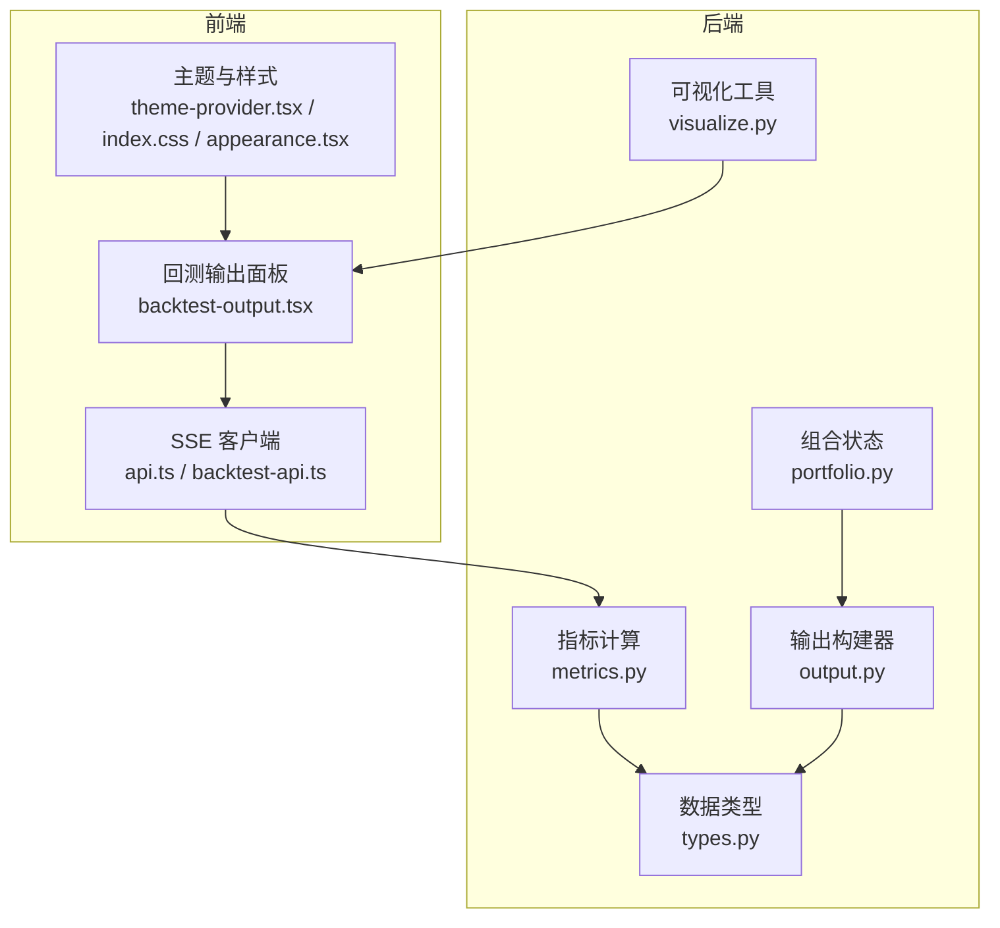

**图表来源**
- [backtest-output.tsx:1-416](file://app/frontend/src/components/panels/bottom/tabs/backtest-output.tsx#L1-L416)
- [api.ts:82-121](file://app/frontend/src/services/api.ts#L82-L121)
- [backtest-api.ts:34-266](file://app/frontend/src/services/backtest-api.ts#L34-L266)
- [metrics.py:1-78](file://src/backtesting/metrics.py#L1-L78)
- [types.py:1-106](file://src/backtesting/types.py#L1-L106)
- [portfolio.py:1-196](file://src/backtesting/portfolio.py#L1-L196)
- [output.py:1-99](file://src/backtesting/output.py#L1-L99)
- [visualize.py:1-9](file://src/utils/visualize.py#L1-L9)
- [theme-provider.tsx:1-19](file://app/frontend/src/providers/theme-provider.tsx#L1-L19)
- [index.css:86-128](file://app/frontend/src/index.css#L86-L128)
- [appearance.tsx:1-81](file://app/frontend/src/components/settings/appearance.tsx#L1-L81)

**章节来源**
- [backtest-output.tsx:1-416](file://app/frontend/src/components/panels/bottom/tabs/backtest-output.tsx#L1-L416)
- [metrics.py:1-78](file://src/backtesting/metrics.py#L1-L78)
- [types.py:1-106](file://src/backtesting/types.py#L1-L106)
- [portfolio.py:1-196](file://src/backtesting/portfolio.py#L1-L196)
- [output.py:1-99](file://src/backtesting/output.py#L1-L99)
- [visualize.py:1-9](file://src/utils/visualize.py#L1-L9)
- [api.ts:82-121](file://app/frontend/src/services/api.ts#L82-L121)
- [backtest-api.ts:34-266](file://app/frontend/src/services/backtest-api.ts#L34-L266)
- [theme-provider.tsx:1-19](file://app/frontend/src/providers/theme-provider.tsx#L1-L19)
- [index.css:86-128](file://app/frontend/src/index.css#L86-L128)
- [appearance.tsx:1-81](file://app/frontend/src/components/settings/appearance.tsx#L1-L81)

## 核心组件
- 回测输出面板：以卡片与表格形式展示回测进度、活动明细、最终结果与实时性能指标
- 指标计算器：基于日度净值序列计算夏普/索提诺比率与最大回撤
- 输出构建器：生成每日交易明细与汇总行，供前端展示
- 数据类型：统一 PortfolioValuePoint、PerformanceMetrics 等结构
- 组合管理：维护现金、保证金、头寸与已实现损益
- 可视化工具：将编译后的图结构导出为 PNG
- 主题系统：支持 light/dark/system 三模式，自定义配色变量
- 实时流：SSE 推送回测中间结果，前端增量更新

**章节来源**
- [backtest-output.tsx:1-416](file://app/frontend/src/components/panels/bottom/tabs/backtest-output.tsx#L1-L416)
- [metrics.py:1-78](file://src/backtesting/metrics.py#L1-L78)
- [output.py:1-99](file://src/backtesting/output.py#L1-L99)
- [types.py:74-106](file://src/backtesting/types.py#L74-L106)
- [portfolio.py:1-196](file://src/backtesting/portfolio.py#L1-L196)
- [visualize.py:1-9](file://src/utils/visualize.py#L1-L9)
- [theme-provider.tsx:1-19](file://app/frontend/src/providers/theme-provider.tsx#L1-L19)
- [index.css:86-128](file://app/frontend/src/index.css#L86-L128)
- [appearance.tsx:1-81](file://app/frontend/src/components/settings/appearance.tsx#L1-L81)
- [backtest-api.ts:34-266](file://app/frontend/src/services/backtest-api.ts#L34-L266)

## 架构总览
回测可视化由“前端展示 + 后端指标 + 实时流”构成。后端在运行时计算指标并以 SSE 推送，前端接收事件后更新本地状态，从而驱动 UI 刷新。

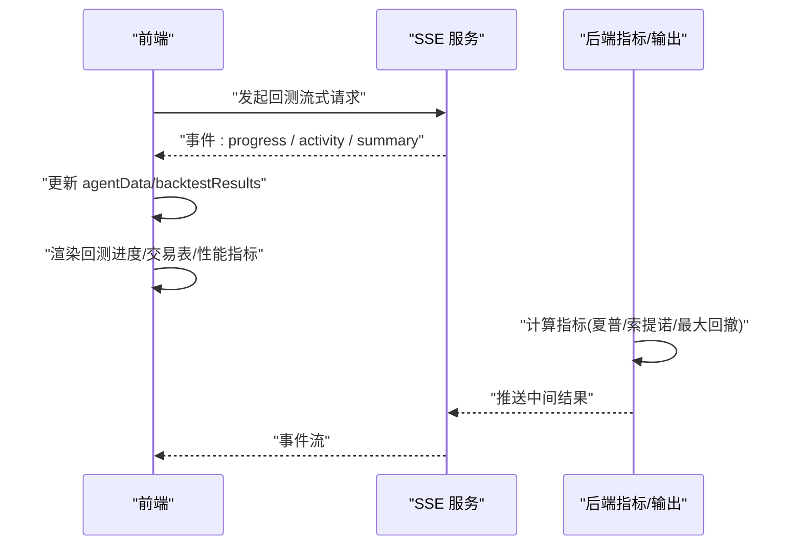

**图表来源**
- [backtest-api.ts:34-266](file://app/frontend/src/services/backtest-api.ts#L34-L266)
- [metrics.py:1-78](file://src/backtesting/metrics.py#L1-L78)
- [output.py:1-99](file://src/backtesting/output.py#L1-L99)

## 详细组件分析

### 回测输出面板组件
- 展示回测进度卡片：显示 runner 状态与消息
- 交易明细表格：按日期倒序展示每期的交易与头寸变化，限制最近 50 行避免性能问题
- 最终结果卡片：展示 Sharpe/Sortino、最大回撤、总天数、期末现金与保证金占用等
- 实时性能指标：计算总回报率、胜率、最大回撤、周期数、当前/初始净值、P&L、多空比率等

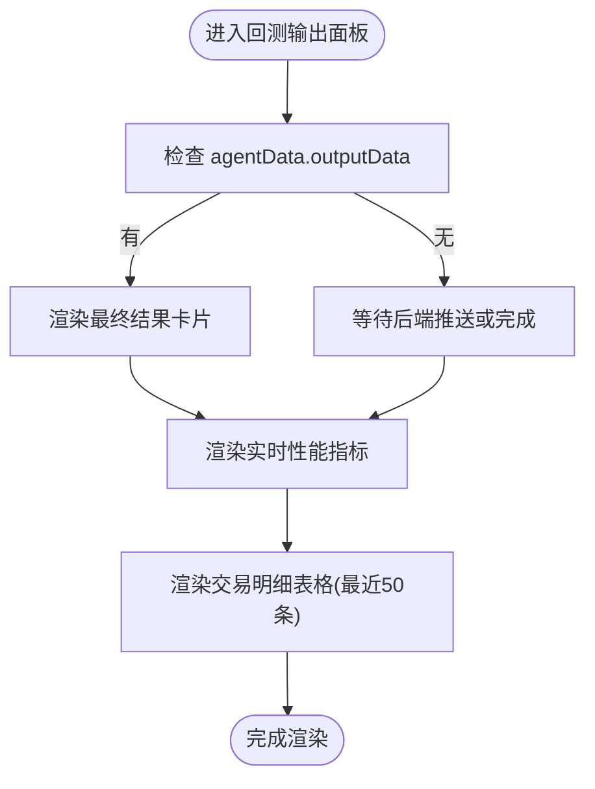

**图表来源**
- [backtest-output.tsx:1-416](file://app/frontend/src/components/panels/bottom/tabs/backtest-output.tsx#L1-L416)

**章节来源**
- [backtest-output.tsx:1-416](file://app/frontend/src/components/panels/bottom/tabs/backtest-output.tsx#L1-L416)

### 指标计算与数据结构
- 指标计算：基于日度净值序列，计算日收益率、超额收益、波动率、下行偏差，进而得到夏普与索提诺比率；最大回撤通过滚动最高净值与回撤序列计算
- 数据结构：PortfolioValuePoint 包含日期与净值等字段；PerformanceMetrics 定义可选指标键值，支持逐步计算

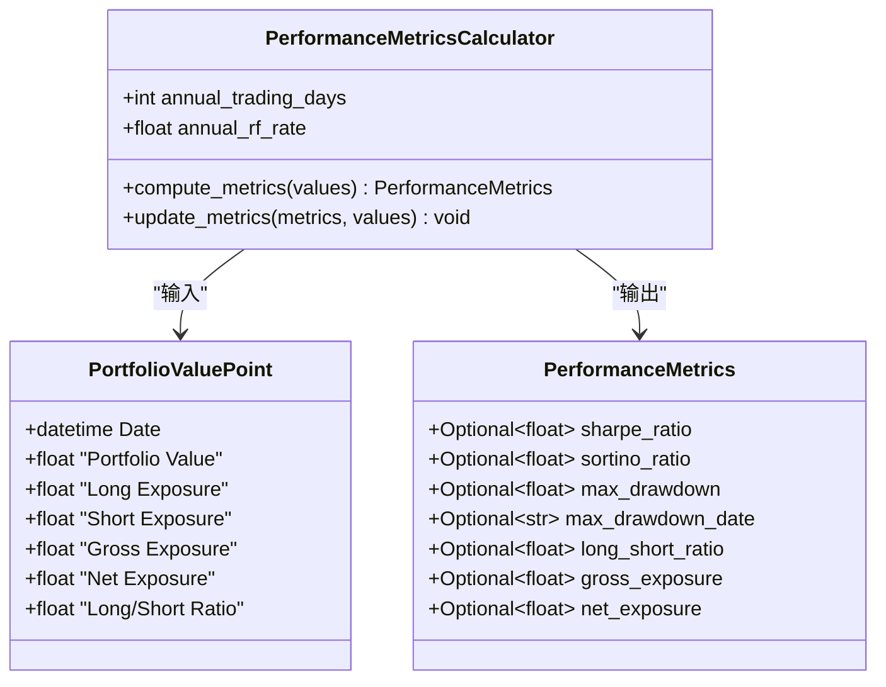

**图表来源**
- [metrics.py:1-78](file://src/backtesting/metrics.py#L1-L78)
- [types.py:74-106](file://src/backtesting/types.py#L74-L106)

**章节来源**
- [metrics.py:1-78](file://src/backtesting/metrics.py#L1-L78)
- [types.py:74-106](file://src/backtesting/types.py#L74-L106)

### 输出构建与数据格式
- 输出构建器：根据当日决策、成交、价格与组合状态，生成每期的交易明细行与汇总行
- 格式化：调用 display 工具函数格式化回测行，便于表格展示

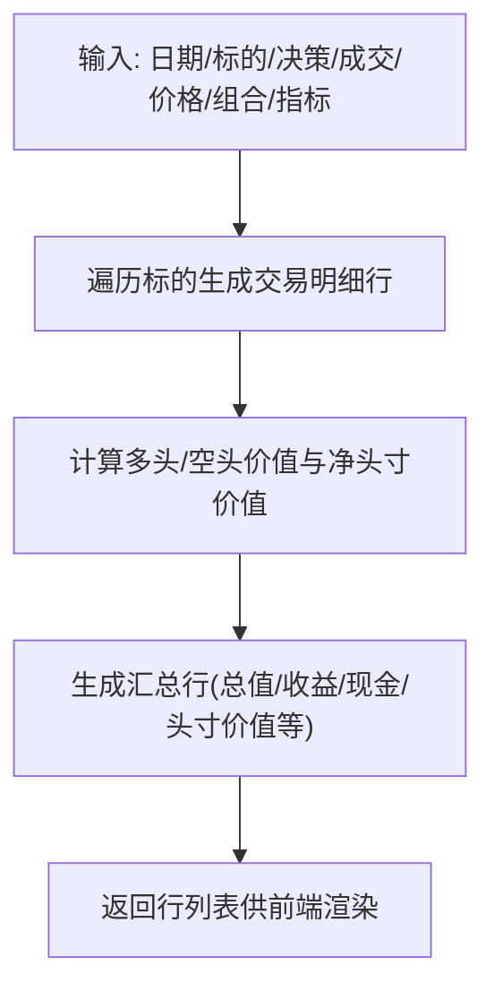

**图表来源**
- [output.py:1-99](file://src/backtesting/output.py#L1-L99)

**章节来源**
- [output.py:1-99](file://src/backtesting/output.py#L1-L99)

### 组合状态与暴露指标
- 组合管理：维护现金、保证金占用与要求、头寸与成本基础、已实现损益
- 暴露指标：支持多空头寸、总/净暴露与多空比率，便于前端展示与风控监控

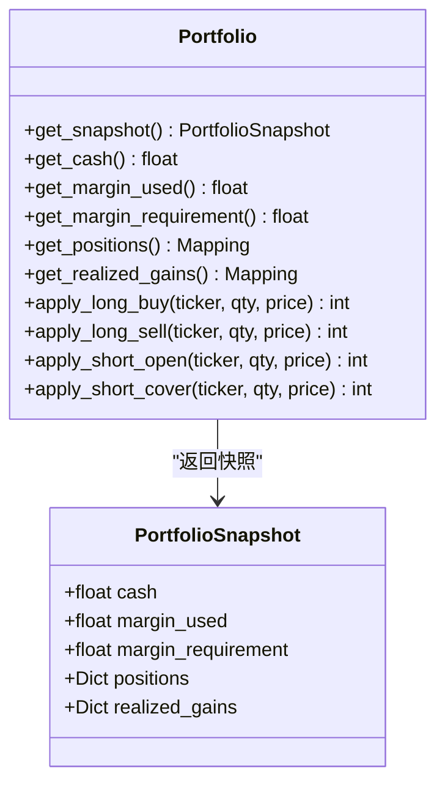

**图表来源**
- [portfolio.py:1-196](file://src/backtesting/portfolio.py#L1-L196)
- [types.py:38-50](file://src/backtesting/types.py#L38-L50)

**章节来源**
- [portfolio.py:1-196](file://src/backtesting/portfolio.py#L1-L196)
- [types.py:38-50](file://src/backtesting/types.py#L38-L50)

### 实时数据更新与刷新策略
- SSE 流式推送：前端通过 fetch + ReadableStream 解析事件，按事件类型更新 agentData 或输出数据
- 增量更新：仅追加最新回测结果，限制表格行数，避免全量重绘
- 连接管理：支持手动中断与错误状态上报，保证 UI 一致性

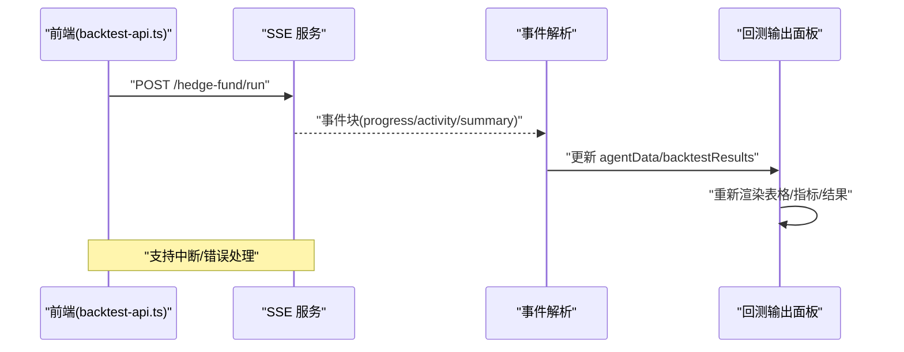

**图表来源**
- [backtest-api.ts:34-266](file://app/frontend/src/services/backtest-api.ts#L34-L266)
- [backtest-output.tsx:1-416](file://app/frontend/src/components/panels/bottom/tabs/backtest-output.tsx#L1-L416)

**章节来源**
- [backtest-api.ts:34-266](file://app/frontend/src/services/backtest-api.ts#L34-L266)
- [backtest-output.tsx:1-416](file://app/frontend/src/components/panels/bottom/tabs/backtest-output.tsx#L1-L416)

### 主题定制与交互
- 主题提供者：next-themes 配置默认主题与存储键
- 自定义 CSS 变量：深色主题下定义节点、面板、标签页等颜色变量
- 主题设置页：提供 light/dark/system 三种选择，便于用户切换

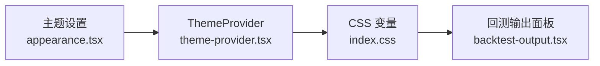

**图表来源**
- [theme-provider.tsx:1-19](file://app/frontend/src/providers/theme-provider.tsx#L1-L19)
- [index.css:86-128](file://app/frontend/src/index.css#L86-L128)
- [appearance.tsx:1-81](file://app/frontend/src/components/settings/appearance.tsx#L1-L81)
- [backtest-output.tsx:1-416](file://app/frontend/src/components/panels/bottom/tabs/backtest-output.tsx#L1-L416)

**章节来源**
- [theme-provider.tsx:1-19](file://app/frontend/src/providers/theme-provider.tsx#L1-L19)
- [index.css:86-128](file://app/frontend/src/index.css#L86-L128)
- [appearance.tsx:1-81](file://app/frontend/src/components/settings/appearance.tsx#L1-L81)
- [backtest-output.tsx:1-416](file://app/frontend/src/components/panels/bottom/tabs/backtest-output.tsx#L1-L416)

### 图表导出、打印与无障碍
- 图表导出：后端提供将编译后的图结构导出为 PNG 的工具函数
- JSON 输出：提供 JSON 对话框，支持复制与下载，便于导出回测中间结果
- 打印与无障碍：当前以表格与卡片为主，建议后续在新增图表时遵循 WCAG 指南（对比度、键盘导航、语义化标签）

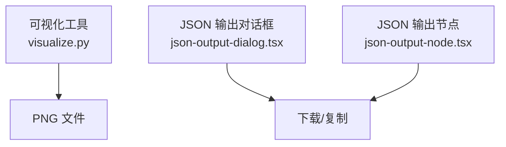

**图表来源**
- [visualize.py:1-9](file://src/utils/visualize.py#L1-L9)
- [json-output-dialog.tsx:1-114](file://app/frontend/src/nodes/components/json-output-dialog.tsx#L1-L114)
- [json-output-node.tsx:33-67](file://app/frontend/src/nodes/components/json-output-node.tsx#L33-L67)

**章节来源**
- [visualize.py:1-9](file://src/utils/visualize.py#L1-L9)
- [json-output-dialog.tsx:1-114](file://app/frontend/src/nodes/components/json-output-dialog.tsx#L1-L114)
- [json-output-node.tsx:33-67](file://app/frontend/src/nodes/components/json-output-node.tsx#L33-L67)

### 数据格式转换、坐标轴缩放与时间序列处理
- 时间序列：指标计算以日期为索引，支持按工作日频率的时间范围
- 指标计算：日度回报、滚动最高净值、回撤序列，便于绘制收益曲线与回撤曲线
- 技术指标：RSI、布林带、EMA、ADX、ATR、Hurst 指数等，可用于 K 线技术分析（建议在新增图表时使用）

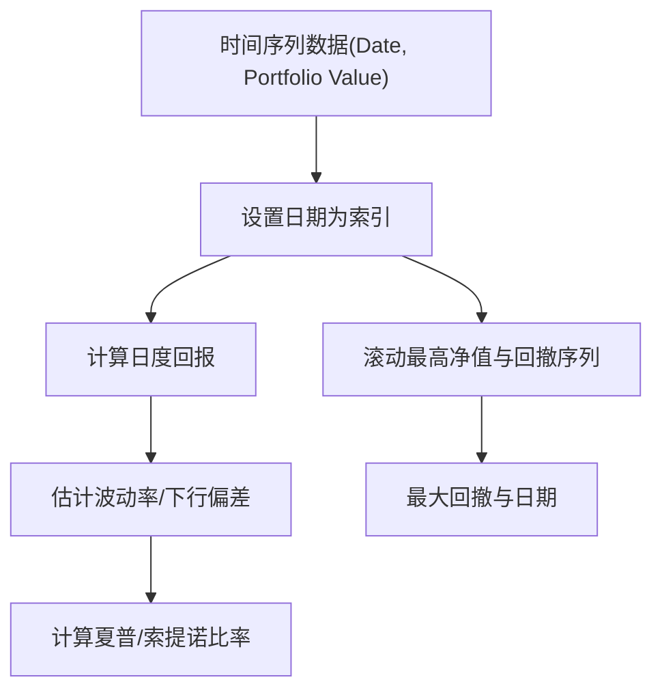

**图表来源**
- [metrics.py:22-75](file://src/backtesting/metrics.py#L22-L75)
- [technicals.py:420-531](file://src/agents/technicals.py#L420-L531)

**章节来源**
- [metrics.py:22-75](file://src/backtesting/metrics.py#L22-L75)
- [technicals.py:420-531](file://src/agents/technicals.py#L420-L531)

### 可视化库选择与集成方案
- 当前状态：前端以表格与卡片展示回测结果，未直接引入专业可视化库
- 推荐方案：若需 K 线、收益曲线与风险指标图表，建议引入轻量级可视化库（如 Reaviz、Vega/Altair、Observable Plot 等），并与现有数据结构无缝对接
- 集成步骤：定义统一的数据格式（时间序列、指标序列）、事件驱动的增量更新、主题适配与无障碍增强

[本节为概念性内容，不直接分析具体文件，故不附“章节来源”]

## 依赖分析
- 前端依赖：React、Radix UI、Lucide Icons、Tailwind CSS、next-themes 等
- 可视化相关：d3-* 依赖存在于锁文件中，但当前未在可视化组件中直接使用
- 后端依赖：pandas、numpy 用于指标计算

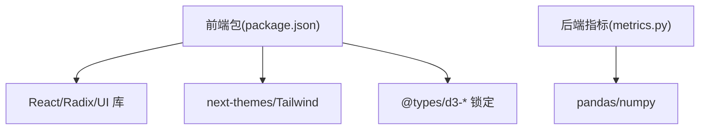

**图表来源**
- [package.json:11-35](file://app/frontend/package.json#L11-L35)
- [metrics.py:23-24](file://src/backtesting/metrics.py#L23-L24)

**章节来源**
- [package.json:11-35](file://app/frontend/package.json#L11-L35)
- [metrics.py:23-24](file://src/backtesting/metrics.py#L23-L24)

## 性能考虑
- 前端渲染：交易明细表格限制最近 50 条记录，避免长列表导致的卡顿
- 指标计算：日度序列长度不足时跳过指标计算，减少无效开销
- SSE 流式：按事件增量更新，避免全量刷新
- 主题切换：CSS 变量集中管理，减少重排与重绘

[本节为通用指导，不直接分析具体文件，故不附“章节来源”]

## 故障排查指南
- SSE 连接失败：检查后端路由与 CORS 设置，确认事件分隔符与格式正确
- 指标为空：确认输入序列至少包含两条日度净值，否则指标将被置空
- 表格不更新：确认事件类型与数据结构匹配，且前端正确更新 agentData/backtestResults
- 主题异常：检查 next-themes 配置与 CSS 变量是否生效

**章节来源**
- [backtest-api.ts:34-266](file://app/frontend/src/services/backtest-api.ts#L34-L266)
- [metrics.py:26-37](file://src/backtesting/metrics.py#L26-L37)
- [backtest-output.tsx:1-416](file://app/frontend/src/components/panels/bottom/tabs/backtest-output.tsx#L1-L416)
- [theme-provider.tsx:1-19](file://app/frontend/src/providers/theme-provider.tsx#L1-L19)

## 结论
当前项目以表格与卡片为核心实现了回测结果的可视化，具备良好的实时性与可读性。后端提供了完善的指标计算与数据结构，为后续扩展 K 线、收益曲线与风险指标图表奠定了基础。建议在保持现有 SSE 与增量更新机制的同时，引入轻量级可视化库，并完善主题、导出、打印与无障碍支持，以满足更丰富的可视化需求。

[本节为总结性内容，不直接分析具体文件，故不附“章节来源”]

## 附录
- 数据格式要点
  - 日度净值序列：日期为索引，包含净值与暴露指标
  - 性能指标：可选键值，支持逐步计算
- 可视化扩展建议
  - K 线图：使用 OHLC 数据与技术指标叠加
  - 收益曲线：时间序列净值折线图，支持滚动窗口与对数缩放
  - 风险指标：最大回撤、波动率、VaR 等统计图表
- 交互与可访问性
  - 为图表添加语义化标题与描述
  - 提供键盘导航与高对比度主题
  - 支持缩放、平移与区域选择

[本节为通用附录，不直接分析具体文件，故不附“章节来源”]