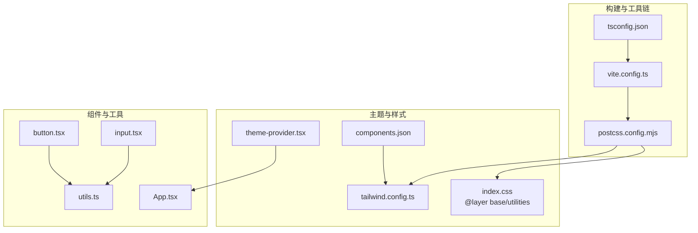
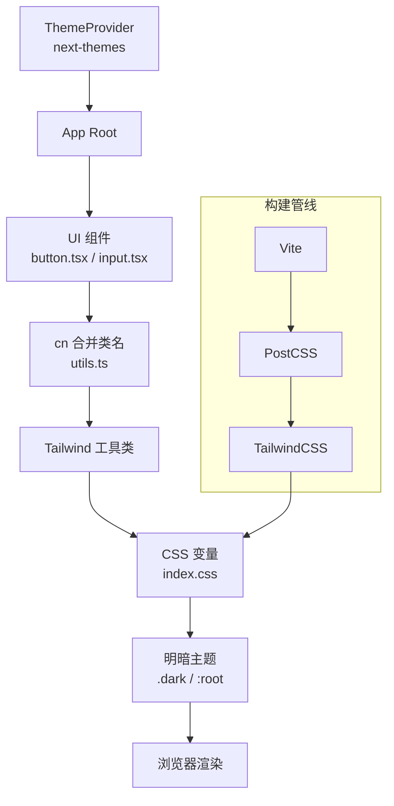
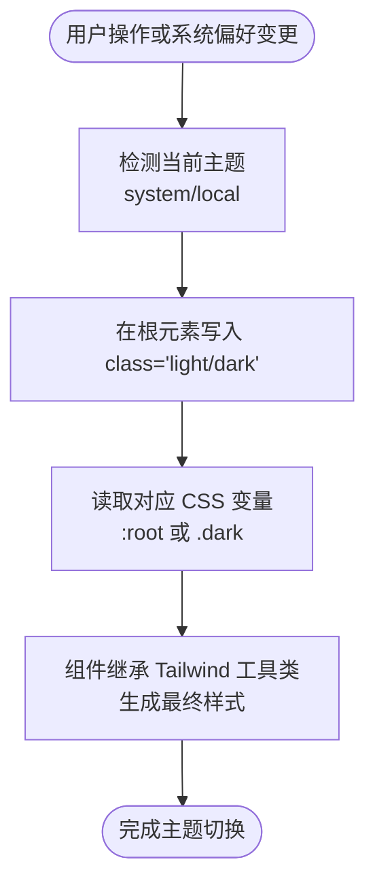
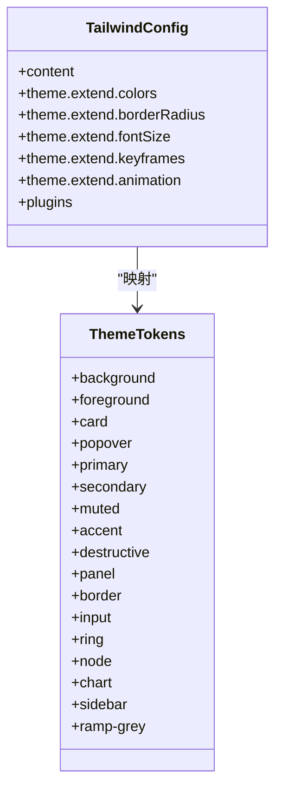
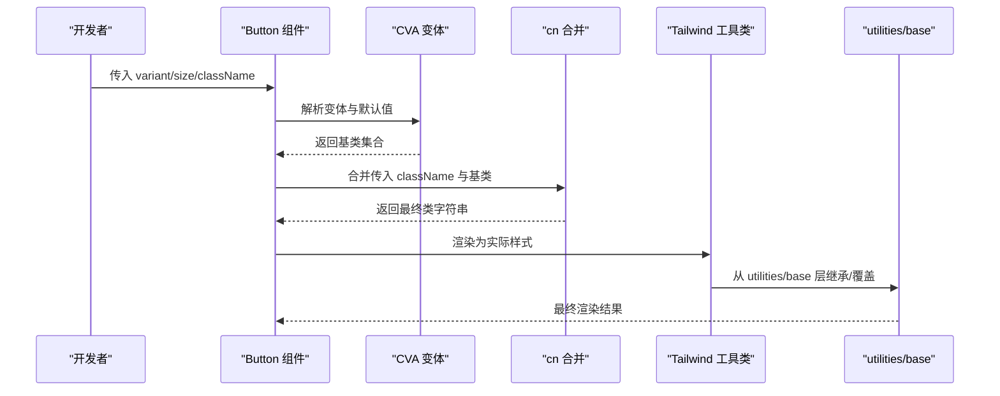
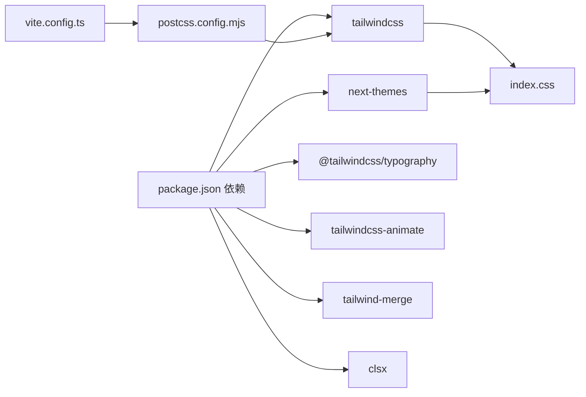

# 样式与主题

<cite>
**本文引用的文件**
- [tailwind.config.ts](file://app/frontend/tailwind.config.ts)
- [postcss.config.mjs](file://app/frontend/postcss.config.mjs)
- [index.css](file://app/frontend/src/index.css)
- [components.json](file://app/frontend/components.json)
- [package.json](file://app/frontend/package.json)
- [theme-provider.tsx](file://app/frontend/src/providers/theme-provider.tsx)
- [button.tsx](file://app/frontend/src/components/ui/button.tsx)
- [input.tsx](file://app/frontend/src/components/ui/input.tsx)
- [utils.ts](file://app/frontend/src/lib/utils.ts)
- [vite.config.ts](file://app/frontend/vite.config.ts)
- [tsconfig.json](file://app/frontend/tsconfig.json)
- [App.tsx](file://app/frontend/src/App.tsx)
</cite>

## 目录
1. [简介](#简介)
2. [项目结构](#项目结构)
3. [核心组件](#核心组件)
4. [架构总览](#架构总览)
5. [详细组件分析](#详细组件分析)
6. [依赖关系分析](#依赖关系分析)
7. [性能考量](#性能考量)
8. [故障排查指南](#故障排查指南)
9. [结论](#结论)
10. [附录](#附录)

## 简介
本文件系统化梳理前端样式与主题体系，涵盖 TailwindCSS 配置与定制策略（工具类、响应式断点、组件变体）、主题切换机制（明暗模式、颜色系统、字体配置）、组件样式隔离与覆盖规则、以及性能优化、打包策略与浏览器兼容性。同时给出设计系统规范与品牌视觉统一性建议。

## 项目结构
前端样式与主题相关的关键文件分布如下：
- 构建与工具链：Vite、PostCSS、TailwindCSS
- 主题与样式：Next Themes 提供者、Tailwind 配置、全局样式层叠
- 组件库与变体：shadcn/ui 风格的 UI 组件与 CVA 变体
- 工具函数：clsx 与 tailwind-merge 的组合工具

**图表来源**
- [vite.config.ts:1-14](file://app/frontend/vite.config.ts#L1-L14)
- [postcss.config.mjs:1-10](file://app/frontend/postcss.config.mjs#L1-L10)
- [tailwind.config.ts:1-144](file://app/frontend/tailwind.config.ts#L1-L144)
- [index.css:1-356](file://app/frontend/src/index.css#L1-L356)
- [components.json:1-21](file://app/frontend/components.json#L1-L21)
- [theme-provider.tsx:1-19](file://app/frontend/src/providers/theme-provider.tsx#L1-L19)
- [button.tsx:1-58](file://app/frontend/src/components/ui/button.tsx#L1-L58)
- [input.tsx:1-23](file://app/frontend/src/components/ui/input.tsx#L1-L23)
- [utils.ts:1-39](file://app/frontend/src/lib/utils.ts#L1-L39)
- [App.tsx:1-12](file://app/frontend/src/App.tsx#L1-L12)

**章节来源**
- [vite.config.ts:1-14](file://app/frontend/vite.config.ts#L1-L14)
- [postcss.config.mjs:1-10](file://app/frontend/postcss.config.mjs#L1-L10)
- [tailwind.config.ts:1-144](file://app/frontend/tailwind.config.ts#L1-L144)
- [index.css:1-356](file://app/frontend/src/index.css#L1-L356)
- [components.json:1-21](file://app/frontend/components.json#L1-L21)
- [theme-provider.tsx:1-19](file://app/frontend/src/providers/theme-provider.tsx#L1-L19)
- [button.tsx:1-58](file://app/frontend/src/components/ui/button.tsx#L1-L58)
- [input.tsx:1-23](file://app/frontend/src/components/ui/input.tsx#L1-L23)
- [utils.ts:1-39](file://app/frontend/src/lib/utils.ts#L1-L39)
- [App.tsx:1-12](file://app/frontend/src/App.tsx#L1-L12)

## 核心组件
- 主题提供者：通过 Next Themes 将明暗主题注入应用，支持系统默认、本地存储持久化与 class 属性驱动。
- Tailwind 配置：启用暗色模式 class 策略，扩展字体、圆角、颜色、关键帧与动画；集成 Typography 与 animate 插件。
- 全局样式层叠：定义 CSS 变量（HSL）作为设计令牌，分层声明 base 与 utilities，确保组件继承与覆盖一致。
- UI 组件变体：基于 class-variance-authority（CVA）为按钮等组件提供多变体与尺寸，结合 cn 工具合并类名。
- 构建与打包：Vite + PostCSS + Tailwind，TS 路径别名与模块解析配置。

**章节来源**
- [theme-provider.tsx:1-19](file://app/frontend/src/providers/theme-provider.tsx#L1-L19)
- [tailwind.config.ts:1-144](file://app/frontend/tailwind.config.ts#L1-L144)
- [index.css:1-356](file://app/frontend/src/index.css#L1-L356)
- [button.tsx:1-58](file://app/frontend/src/components/ui/button.tsx#L1-L58)
- [utils.ts:1-39](file://app/frontend/src/lib/utils.ts#L1-L39)
- [vite.config.ts:1-14](file://app/frontend/vite.config.ts#L1-L14)
- [tsconfig.json:1-40](file://app/frontend/tsconfig.json#L1-L40)

## 架构总览
样式与主题系统由“主题提供者 → Tailwind 配置 → 全局样式层叠 → 组件变体 → 构建管线”构成的闭环。

**图表来源**
- [theme-provider.tsx:1-19](file://app/frontend/src/providers/theme-provider.tsx#L1-L19)
- [button.tsx:1-58](file://app/frontend/src/components/ui/button.tsx#L1-L58)
- [input.tsx:1-23](file://app/frontend/src/components/ui/input.tsx#L1-L23)
- [utils.ts:1-39](file://app/frontend/src/lib/utils.ts#L1-L39)
- [index.css:1-356](file://app/frontend/src/index.css#L1-L356)
- [tailwind.config.ts:1-144](file://app/frontend/tailwind.config.ts#L1-L144)
- [vite.config.ts:1-14](file://app/frontend/vite.config.ts#L1-L14)
- [postcss.config.mjs:1-10](file://app/frontend/postcss.config.mjs#L1-L10)

## 详细组件分析

### 主题切换机制与颜色系统
- 明暗模式：Tailwind 配置启用 class 策略，Next Themes 在根节点写入 class 并持久化到本地存储；全局 CSS 定义 :root 与 .dark 两套 HSL 设计令牌，确保颜色变量随主题切换。
- 颜色系统：以 HSL 变量为核心，映射到背景、前景、卡片、弹出层、强调、次要、静默、强调破坏、面板、边框、输入、环、节点、图表、侧边栏等语义层级；提供灰阶 ramp 色带与标签页配色。
- 字体配置：在 Tailwind 主题中声明 sans 与 mono 字体族，全局 CSS 中补充 geist 与 geist-mono 字体资源，确保一致性与可访问性。
- 动画与过渡：扩展 keyframes 与 animation，用于折叠组件等交互；通过 utilities 层提供 hover/active 的通用样式钩子。

**图表来源**
- [theme-provider.tsx:1-19](file://app/frontend/src/providers/theme-provider.tsx#L1-L19)
- [tailwind.config.ts:1-144](file://app/frontend/tailwind.config.ts#L1-L144)
- [index.css:1-356](file://app/frontend/src/index.css#L1-L356)

**章节来源**
- [theme-provider.tsx:1-19](file://app/frontend/src/providers/theme-provider.tsx#L1-L19)
- [tailwind.config.ts:1-144](file://app/frontend/tailwind.config.ts#L1-L144)
- [index.css:1-356](file://app/frontend/src/index.css#L1-L356)

### Tailwind 配置与定制策略
- 内容扫描：自动扫描 HTML 与 TSX 源码，按需生成工具类，避免无用样式。
- 主题扩展：
  - 字体：自定义标题与副标题字号，统一字体族。
  - 圆角：基于 CSS 变量 --radius，提供 lg/md/sm 递减。
  - 颜色：以 HSL 变量映射语义色板，支持 card/popover/primary/secondary/muted/accent/destructive/panel/node/chart/sidebar 等。
  - 关键帧与动画：为 Accordion 等组件提供平滑过渡。
- 插件：启用 Typography 与 animate 插件，增强排版与动效能力。

**图表来源**
- [tailwind.config.ts:1-144](file://app/frontend/tailwind.config.ts#L1-L144)
- [index.css:1-356](file://app/frontend/src/index.css#L1-L356)

**章节来源**
- [tailwind.config.ts:1-144](file://app/frontend/tailwind.config.ts#L1-L144)
- [index.css:1-356](file://app/frontend/src/index.css#L1-L356)

### 组件样式隔离、继承与覆盖
- 隔离：每个组件通过 Tailwind 工具类与语义色板独立定义外观，减少跨组件污染。
- 继承：全局 CSS 在 base 层为 * 与 body 应用 border 与文本色，确保基础继承链一致。
- 覆盖：utilities 层提供 hover-bg/text、active-bg/text、node/border/status 等复用样式，便于在组件内叠加或替换。
- 变体：按钮等组件使用 CVA 定义变体与尺寸，配合 cn 工具进行条件合并，优先级清晰。

**图表来源**
- [button.tsx:1-58](file://app/frontend/src/components/ui/button.tsx#L1-L58)
- [utils.ts:1-39](file://app/frontend/src/lib/utils.ts#L1-L39)
- [index.css:147-191](file://app/frontend/src/index.css#L147-L191)

**章节来源**
- [button.tsx:1-58](file://app/frontend/src/components/ui/button.tsx#L1-L58)
- [input.tsx:1-23](file://app/frontend/src/components/ui/input.tsx#L1-L23)
- [utils.ts:1-39](file://app/frontend/src/lib/utils.ts#L1-L39)
- [index.css:147-191](file://app/frontend/src/index.css#L147-L191)

### CSS-in-JS 使用场景与 styled-components 集成
- 当前代码库未发现 styled-components 的直接使用。若未来需要为特定组件添加动态样式或主题感知的复杂样式逻辑，可在现有 Next Themes 与 Tailwind 基础上：
  - 保留语义化工具类为主，仅在必要处引入轻量 CSS-in-JS（如 emotion/styled-components），注意与 Tailwind 的冲突与优先级管理。
  - 通过 CSS 变量与主题提供者联动，确保动态样式与整体主题保持一致。

[本节为概念性说明，不直接分析具体文件]

### 设计系统规范与品牌视觉统一性
- 设计令牌：以 HSL 变量为核心，覆盖背景、前景、强调、次要、静默、破坏、边框、输入、环、节点、图表、侧边栏与灰阶 ramp。
- 字体与排版：统一 sans 与 mono 字体族，补充 geist/mono 字体资源，确保品牌字体一致性。
- 组件风格：遵循 shadcn/ui 风格，使用 CVA 定义变体与尺寸，保证组件行为与外观的一致性。
- 动效与交互：通过扩展 keyframes/animation 与 utilities 提供 hover/active 状态，提升交互体验。

**章节来源**
- [tailwind.config.ts:1-144](file://app/frontend/tailwind.config.ts#L1-L144)
- [index.css:1-356](file://app/frontend/src/index.css#L1-L356)
- [components.json:1-21](file://app/frontend/components.json#L1-L21)

## 依赖关系分析
- 构建链路：Vite 负责开发与打包，PostCSS 加载 Tailwind 与 autoprefixer，Tailwind 依据配置与内容扫描生成样式。
- 运行时：Next Themes 在运行时控制 class 属性，Tailwind 读取 CSS 变量，组件通过工具类与 CVA 渲染。
- 外部依赖：next-themes、tailwindcss、@tailwindcss/typography、tailwindcss-animate、tailwind-merge、clsx 等。

**图表来源**
- [package.json:1-56](file://app/frontend/package.json#L1-L56)
- [vite.config.ts:1-14](file://app/frontend/vite.config.ts#L1-L14)
- [postcss.config.mjs:1-10](file://app/frontend/postcss.config.mjs#L1-L10)
- [tailwind.config.ts:1-144](file://app/frontend/tailwind.config.ts#L1-L144)
- [index.css:1-356](file://app/frontend/src/index.css#L1-L356)

**章节来源**
- [package.json:1-56](file://app/frontend/package.json#L1-L56)
- [vite.config.ts:1-14](file://app/frontend/vite.config.ts#L1-L14)
- [postcss.config.mjs:1-10](file://app/frontend/postcss.config.mjs#L1-L10)
- [tailwind.config.ts:1-144](file://app/frontend/tailwind.config.ts#L1-L144)
- [index.css:1-356](file://app/frontend/src/index.css#L1-L356)

## 性能考量
- 按需生成：Tailwind 内容扫描仅产出实际使用的工具类，降低初始包体积。
- 类名合并：使用 clsx 与 tailwind-merge 合并类名，避免重复与冲突，减少 DOM 属性长度。
- 动画与渐变：合理使用 CSS 变量与简单动画，避免复杂 JS 动画造成主线程阻塞。
- 打包策略：Vite 默认生产构建已优化，Tailwind 产物由 PostCSS 与 autoprefixer 处理，建议开启压缩与 Tree-shaking。
- 浏览器兼容性：autoprefixer 自动添加厂商前缀；HSL 与 CSS 变量在现代浏览器支持良好，可结合特性降级策略。

[本节提供通用指导，不直接分析具体文件]

## 故障排查指南
- 主题不生效
  - 检查根元素是否正确写入 class（light/dark）。
  - 确认 CSS 变量在 :root 与 .dark 中均存在且命名一致。
  - 验证 Next Themes 的属性与存储键是否正确。
- 工具类无效
  - 确认内容扫描路径包含目标文件。
  - 检查 utilities/base 是否被意外覆盖。
  - 使用类名合并工具确保最终类字符串正确。
- 构建异常
  - 检查 Vite 与 PostCSS 配置，确保 Tailwind 插件加载顺序正确。
  - 确认 TS 路径别名与模块解析配置一致。

**章节来源**
- [theme-provider.tsx:1-19](file://app/frontend/src/providers/theme-provider.tsx#L1-L19)
- [tailwind.config.ts:1-144](file://app/frontend/tailwind.config.ts#L1-L144)
- [index.css:1-356](file://app/frontend/src/index.css#L1-L356)
- [vite.config.ts:1-14](file://app/frontend/vite.config.ts#L1-L14)
- [postcss.config.mjs:1-10](file://app/frontend/postcss.config.mjs#L1-L10)
- [utils.ts:1-39](file://app/frontend/src/lib/utils.ts#L1-L39)

## 结论
该样式与主题系统以 TailwindCSS 为核心，结合 CSS 变量与 Next Themes 实现了高可维护性的明暗主题方案；通过 CVA 与工具函数保障组件样式的一致性与可扩展性；构建链路简洁高效，具备良好的性能与兼容性基础。建议持续以设计令牌为中心，完善品牌视觉规范，并在必要时谨慎引入轻量 CSS-in-JS 以满足复杂交互需求。

## 附录
- 快速参考
  - 主题提供者：在应用根节点包裹，设置默认主题与存储键。
  - Tailwind 配置：扩展颜色、圆角、字体与动画，启用插件。
  - 全局样式：在 base 层统一继承，在 utilities 层提供复用状态样式。
  - 组件变体：使用 CVA 定义多变体与尺寸，配合 cn 合并类名。
  - 构建与别名：Vite + PostCSS + Tailwind，TS 路径别名统一导入。

**章节来源**
- [theme-provider.tsx:1-19](file://app/frontend/src/providers/theme-provider.tsx#L1-L19)
- [tailwind.config.ts:1-144](file://app/frontend/tailwind.config.ts#L1-L144)
- [index.css:1-356](file://app/frontend/src/index.css#L1-L356)
- [button.tsx:1-58](file://app/frontend/src/components/ui/button.tsx#L1-L58)
- [utils.ts:1-39](file://app/frontend/src/lib/utils.ts#L1-L39)
- [vite.config.ts:1-14](file://app/frontend/vite.config.ts#L1-L14)
- [tsconfig.json:1-40](file://app/frontend/tsconfig.json#L1-L40)