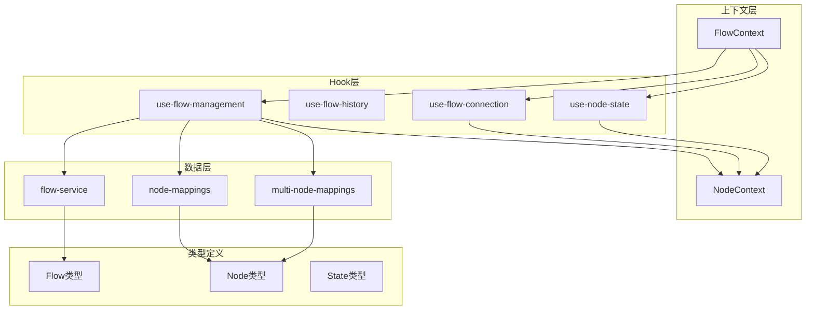
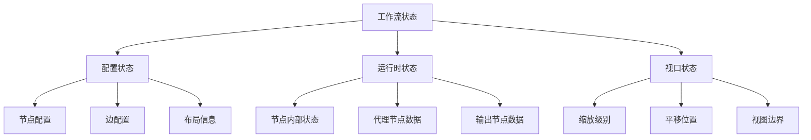
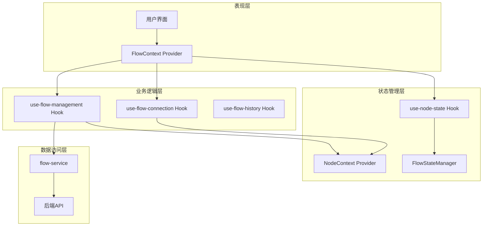
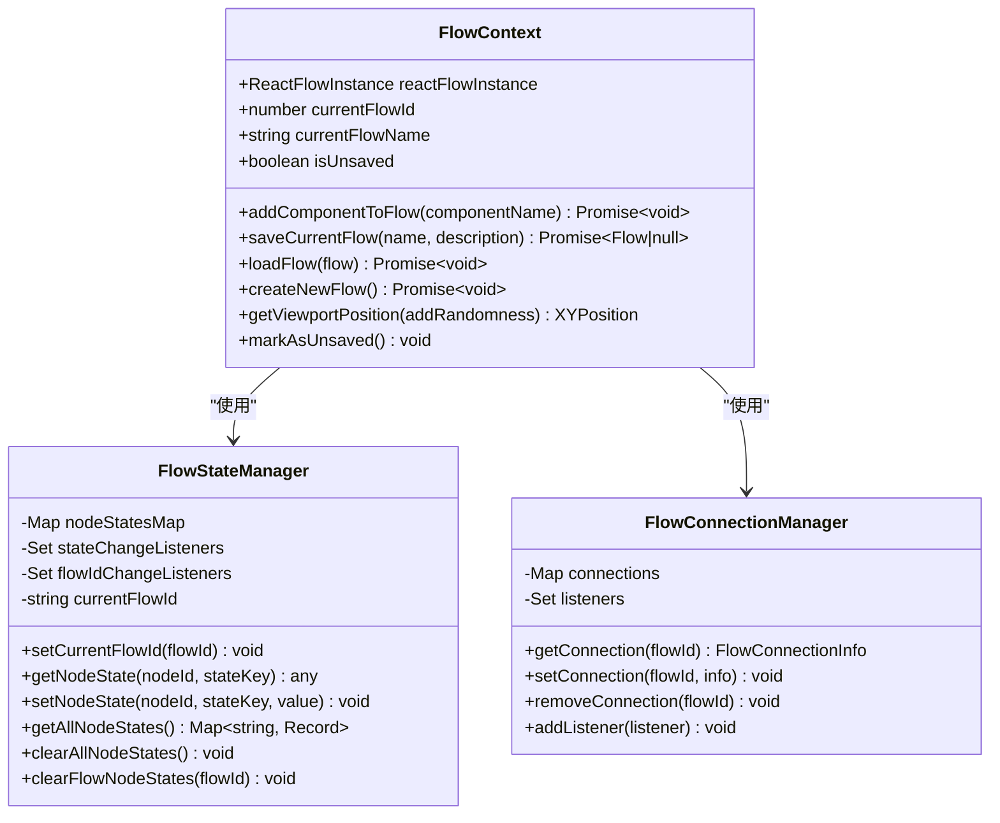
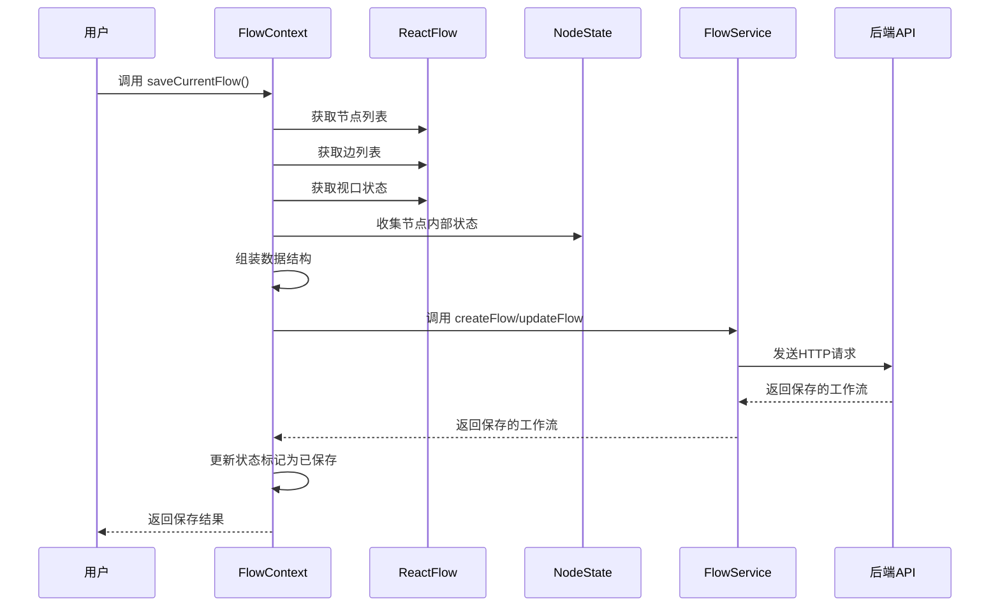
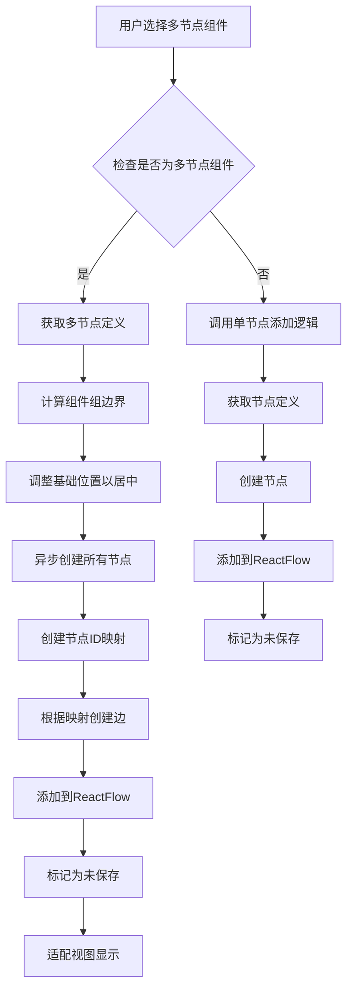
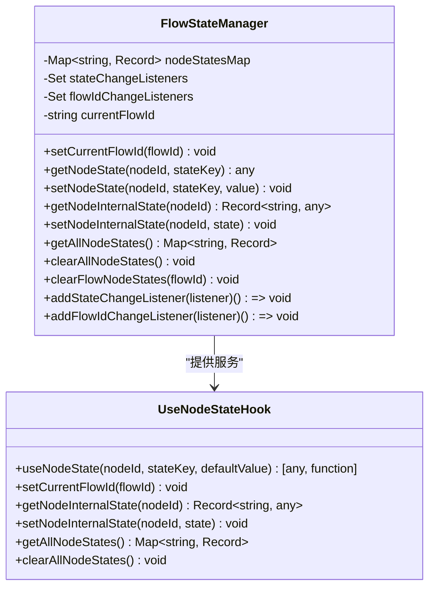
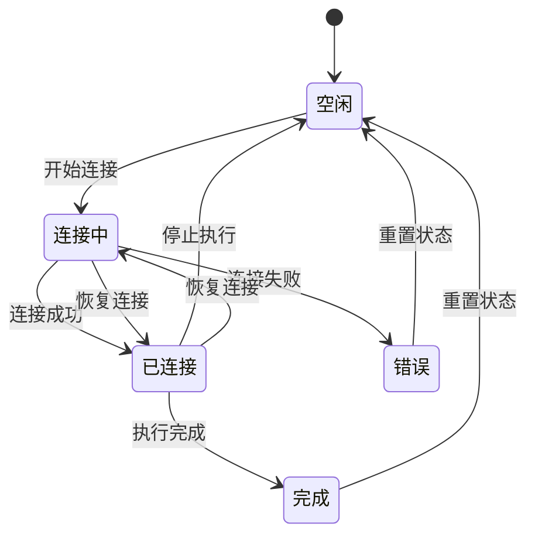
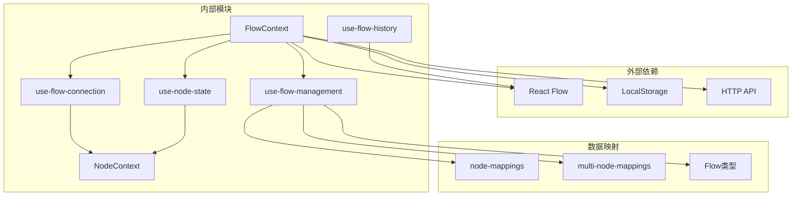

# 工作流上下文

<cite>
**本文档引用的文件**
- [flow-context.tsx](file://app/frontend/src/contexts/flow-context.tsx)
- [flow.ts](file://app/frontend/src/types/flow.ts)
- [flow-service.ts](file://app/frontend/src/services/flow-service.ts)
- [use-flow-management.ts](file://app/frontend/src/hooks/use-flow-management.ts)
- [use-flow-history.ts](file://app/frontend/src/hooks/use-flow-history.ts)
- [multi-node-mappings.ts](file://app/frontend/src/data/multi-node-mappings.ts)
- [node-mappings.ts](file://app/frontend/src/data/node-mappings.ts)
- [use-node-state.ts](file://app/frontend/src/hooks/use-node-state.ts)
- [node-context.tsx](file://app/frontend/src/contexts/node-context.tsx)
- [use-flow-connection.ts](file://app/frontend/src/hooks/use-flow-connection.ts)
- [types.ts](file://app/frontend/src/nodes/types.ts)
</cite>

## 目录
1. [简介](#简介)
2. [项目结构](#项目结构)
3. [核心组件](#核心组件)
4. [架构概览](#架构概览)
5. [详细组件分析](#详细组件分析)
6. [依赖关系分析](#依赖关系分析)
7. [性能考虑](#性能考虑)
8. [故障排除指南](#故障排除指南)
9. [最佳实践](#最佳实践)
10. [结论](#结论)

## 简介

工作流上下文（FlowContext）是AI对冲基金项目中的核心状态管理模块，负责管理用户创建、保存、加载和管理工作流的能力。该系统实现了复杂的工作流状态持久化机制，支持节点状态、边状态和视口状态的完整存储与恢复，同时提供了多节点组件和单节点组件的智能添加逻辑。

该系统采用React Context模式，结合自定义Hook和全局状态管理器，实现了以下关键功能：
- 工作流的创建、保存、加载和删除
- 节点内部状态和运行时状态的持久化
- 多节点组件组的批量添加和连接
- 工作流ID管理和未保存状态跟踪
- 本地存储集成和历史记录管理

## 项目结构

工作流上下文系统主要分布在前端应用的多个层次中：

**图表来源**
- [flow-context.tsx:35-358](file://app/frontend/src/contexts/flow-context.tsx#L35-L358)
- [use-flow-management.ts:44-336](file://app/frontend/src/hooks/use-flow-management.ts#L44-L336)
- [flow-service.ts:27-108](file://app/frontend/src/services/flow-service.ts#L27-L108)

**章节来源**
- [flow-context.tsx:1-358](file://app/frontend/src/contexts/flow-context.tsx#L1-L358)
- [use-flow-management.ts:1-336](file://app/frontend/src/hooks/use-flow-management.ts#L1-L336)

## 核心组件

### FlowContext 主要职责

FlowContext作为核心上下文，提供以下关键功能：

1. **工作流生命周期管理**
   - 创建新工作流：`createNewFlow()`
   - 保存当前工作流：`saveCurrentFlow()`
   - 加载工作流：`loadFlow()`

2. **节点添加管理**
   - 单节点组件添加：`addSingleNodeToFlow()`
   - 多节点组件组添加：`addMultipleNodesToFlow()`
   - 智能路由：`addComponentToFlow()`

3. **状态跟踪**
   - 当前工作流ID：`currentFlowId`
   - 工作流名称：`currentFlowName`
   - 未保存状态：`isUnsaved`
   - ReactFlow实例：`reactFlowInstance`

### 状态持久化机制

系统实现了三层状态持久化：

**图表来源**
- [flow-context.tsx:75-131](file://app/frontend/src/contexts/flow-context.tsx#L75-L131)
- [use-flow-management.ts:58-109](file://app/frontend/src/hooks/use-flow-management.ts#L58-L109)

**章节来源**
- [flow-context.tsx:10-358](file://app/frontend/src/contexts/flow-context.tsx#L10-L358)
- [use-flow-management.ts:14-42](file://app/frontend/src/hooks/use-flow-management.ts#L14-L42)

## 架构概览

工作流上下文系统采用分层架构设计，确保关注点分离和可维护性：

**图表来源**
- [flow-context.tsx:35-358](file://app/frontend/src/contexts/flow-context.tsx#L35-L358)
- [use-flow-management.ts:44-336](file://app/frontend/src/hooks/use-flow-management.ts#L44-L336)
- [use-node-state.ts:7-135](file://app/frontend/src/hooks/use-node-state.ts#L7-L135)

## 详细组件分析

### FlowContext 类实现

FlowContext类实现了工作流的核心功能，采用了函数式编程和面向对象编程的混合模式：

**图表来源**
- [flow-context.tsx:10-358](file://app/frontend/src/contexts/flow-context.tsx#L10-L358)
- [use-node-state.ts:7-135](file://app/frontend/src/hooks/use-node-state.ts#L7-L135)
- [use-flow-connection.ts:18-73](file://app/frontend/src/hooks/use-flow-connection.ts#L18-L73)

#### 工作流保存流程

工作流保存过程涉及多个步骤的状态转换：

**图表来源**
- [flow-context.tsx:75-131](file://app/frontend/src/contexts/flow-context.tsx#L75-L131)
- [flow-service.ts:47-74](file://app/frontend/src/services/flow-service.ts#L47-L74)

#### 多节点组件添加逻辑

系统支持复杂的多节点组件组添加，通过预定义的组件映射实现：

**图表来源**
- [flow-context.tsx:234-331](file://app/frontend/src/contexts/flow-context.tsx#L234-L331)
- [multi-node-mappings.ts:14-73](file://app/frontend/src/data/multi-node-mappings.ts#L14-L73)

**章节来源**
- [flow-context.tsx:35-358](file://app/frontend/src/contexts/flow-context.tsx#L35-L358)
- [multi-node-mappings.ts:1-81](file://app/frontend/src/data/multi-node-mappings.ts#L1-L81)

### 节点状态管理系统

节点状态管理系统是工作流持久化的关键组件，实现了流隔离和状态持久化：

**图表来源**
- [use-node-state.ts:7-268](file://app/frontend/src/hooks/use-node-state.ts#L7-L268)

#### 状态隔离机制

系统通过复合键实现跨流状态隔离：

| 流ID | 节点ID | 复合键示例 |
|------|--------|------------|
| null | node1 | node1 |
| flow1 | node1 | flow1:node1 |
| flow2 | node1 | flow2:node1 |

这种设计确保不同工作流之间的状态完全隔离，避免相互干扰。

**章节来源**
- [use-node-state.ts:1-268](file://app/frontend/src/hooks/use-node-state.ts#L1-L268)

### 连接状态管理

工作流连接状态管理器负责监控和控制工作流的执行状态：

**图表来源**
- [use-flow-connection.ts:7-250](file://app/frontend/src/hooks/use-flow-connection.ts#L7-L250)

**章节来源**
- [use-flow-connection.ts:1-268](file://app/frontend/src/hooks/use-flow-connection.ts#L1-L268)

## 依赖关系分析

工作流上下文系统的依赖关系体现了清晰的关注点分离：

**图表来源**
- [flow-context.tsx:1-8](file://app/frontend/src/contexts/flow-context.tsx#L1-L8)
- [use-flow-management.ts:1-12](file://app/frontend/src/hooks/use-flow-management.ts#L1-L12)

### 关键依赖关系

1. **FlowContext → use-flow-management**: FlowContext提供核心功能，use-flow-management扩展业务逻辑
2. **use-flow-management → flow-service**: 管理数据访问层
3. **use-flow-management → NodeContext**: 集成运行时状态管理
4. **use-flow-connection → NodeContext**: 监控执行状态
5. **use-node-state → FlowStateManager**: 实现状态持久化

**章节来源**
- [flow-context.tsx:1-358](file://app/frontend/src/contexts/flow-context.tsx#L1-L358)
- [use-flow-management.ts:1-336](file://app/frontend/src/hooks/use-flow-management.ts#L1-L336)

## 性能考虑

工作流上下文系统在设计时充分考虑了性能优化：

### 内存管理
- 使用Map数据结构替代对象属性，提高查找效率
- 实现状态清理机制，防止内存泄漏
- 智能缓存节点类型定义，避免重复API调用

### 渲染优化
- 使用React.memo和useCallback减少不必要的重新渲染
- 分离配置状态和运行时状态，避免无关状态变化触发渲染
- 实现增量更新策略，只更新发生变化的部分

### 异步处理
- 使用Promise和async/await处理异步操作
- 实现超时机制和错误恢复
- 采用防抖和节流技术优化频繁操作

## 故障排除指南

### 常见问题及解决方案

1. **工作流保存失败**
   - 检查网络连接和API可用性
   - 验证工作流数据格式正确性
   - 查看浏览器控制台错误日志

2. **节点状态丢失**
   - 确认FlowStateManager正确初始化
   - 检查复合键生成逻辑
   - 验证工作流ID设置是否正确

3. **多节点组件添加异常**
   - 验证组件映射配置完整性
   - 检查节点ID生成逻辑
   - 确认边连接关系正确性

**章节来源**
- [flow-context.tsx:127-131](file://app/frontend/src/contexts/flow-context.tsx#L127-L131)
- [use-flow-management.ts:267-271](file://app/frontend/src/hooks/use-flow-management.ts#L267-L271)

## 最佳实践

### 状态管理最佳实践

1. **工作流ID管理**
   - 始终在操作前设置正确的当前工作流ID
   - 使用setCurrentFlowId确保状态隔离
   - 在加载工作流时优先设置ID再渲染节点

2. **未保存状态跟踪**
   - 对所有修改操作调用markAsUnsaved
   - 实现自动保存机制避免数据丢失
   - 提供明确的未保存提示

3. **本地存储使用**
   - 使用localStorage存储最后选择的工作流ID
   - 实现数据备份和恢复机制
   - 处理localStorage容量限制

### 性能优化策略

1. **状态持久化优化**
   - 实现增量保存，只保存变更部分
   - 使用批处理机制合并多次保存操作
   - 实现智能缓存策略

2. **渲染性能优化**
   - 使用React.memo包装重型组件
   - 实现虚拟滚动处理大量节点
   - 采用分层渲染策略

3. **内存管理**
   - 及时清理不再使用的状态
   - 实现状态压缩和清理机制
   - 监控内存使用情况

### 错误处理策略

1. **容错设计**
   - 实现渐进式降级机制
   - 提供默认状态和回退方案
   - 实现错误边界和恢复机制

2. **用户体验**
   - 提供清晰的错误信息
   - 实现自动重试机制
   - 提供手动干预选项

**章节来源**
- [flow-context.tsx:69-72](file://app/frontend/src/contexts/flow-context.tsx#L69-L72)
- [use-flow-management.ts:255-271](file://app/frontend/src/hooks/use-flow-management.ts#L255-L271)

## 结论

工作流上下文系统通过精心设计的架构和实现，成功地解决了复杂工作流管理的各种挑战。系统的主要优势包括：

1. **完整的状态管理**：实现了配置状态、运行时状态和视口状态的完整持久化
2. **智能的组件管理**：支持单节点和多节点组件的统一处理
3. **强大的扩展性**：模块化设计便于功能扩展和维护
4. **优秀的性能表现**：通过多种优化策略确保系统响应速度

该系统为AI对冲基金项目提供了坚实的技术基础，能够支持复杂的金融建模和分析工作流。通过遵循本文档中的最佳实践，开发者可以进一步优化系统性能并扩展新的功能特性。