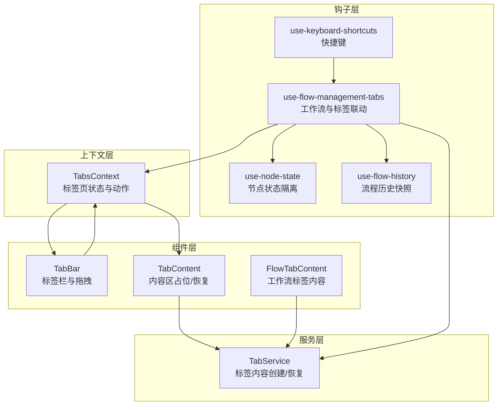
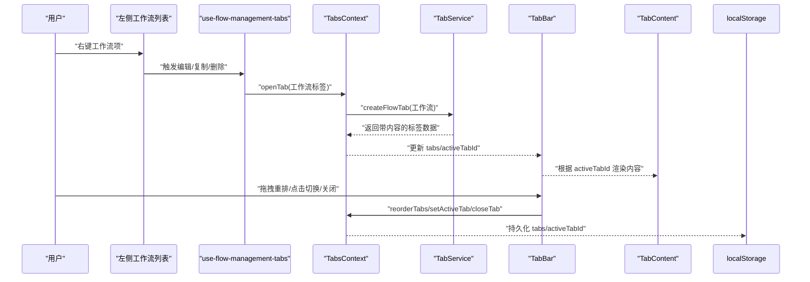
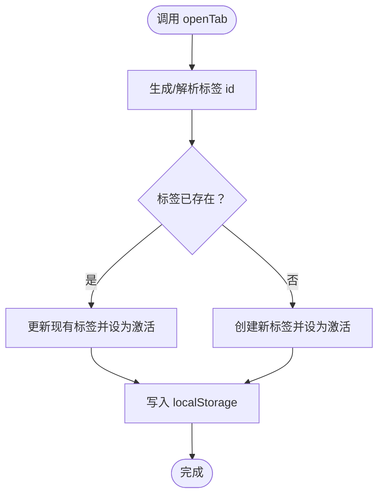
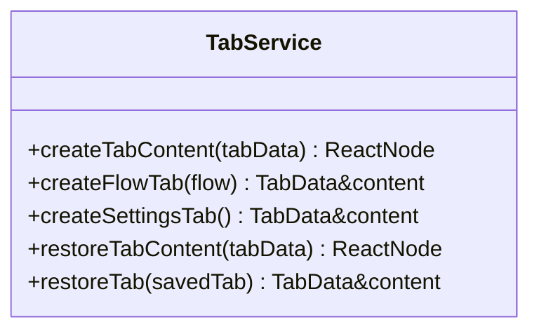
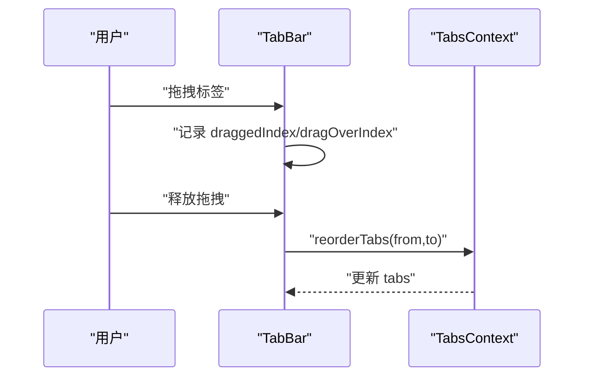
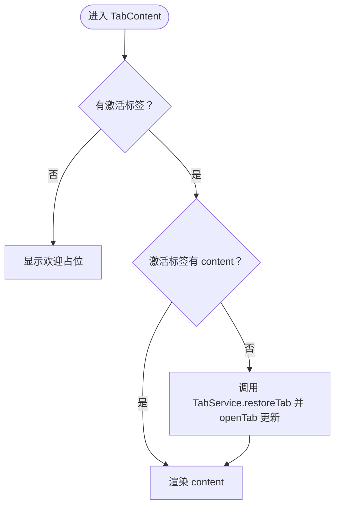
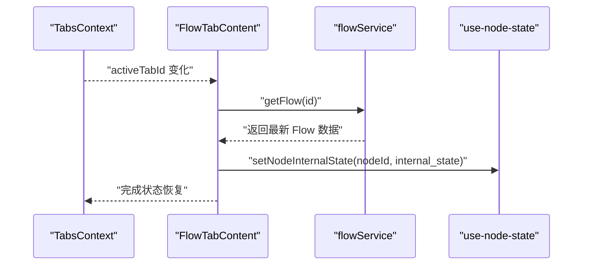
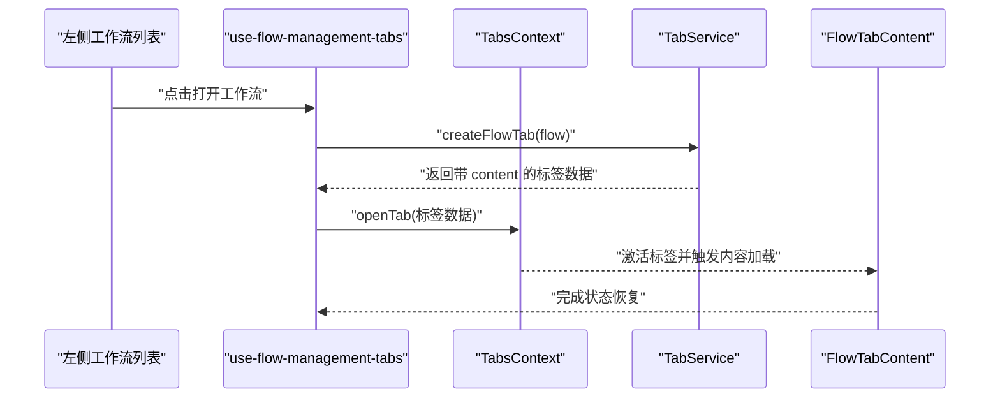
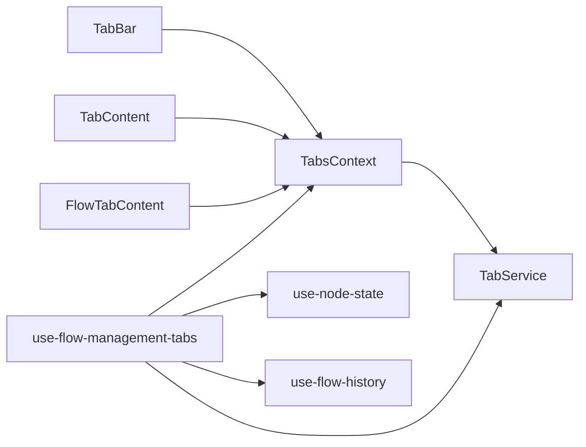

# 标签页上下文

<cite>
**本文引用的文件**
- [tabs-context.tsx](file://app/frontend/src/contexts/tabs-context.tsx)
- [use-flow-management-tabs.ts](file://app/frontend/src/hooks/use-flow-management-tabs.ts)
- [tab-service.ts](file://app/frontend/src/services/tab-service.ts)
- [tab-bar.tsx](file://app/frontend/src/components/tabs/tab-bar.tsx)
- [tab-content.tsx](file://app/frontend/src/components/tabs/tab-content.tsx)
- [flow-tab-content.tsx](file://app/frontend/src/components/tabs/flow-tab-content.tsx)
- [use-keyboard-shortcuts.ts](file://app/frontend/src/hooks/use-keyboard-shortcuts.ts)
- [flow-context-menu.tsx](file://app/frontend/src/components/panels/left/flow-context-menu.tsx)
- [flow-item.tsx](file://app/frontend/src/components/panels/left/flow-item.tsx)
- [flow.ts](file://app/frontend/src/types/flow.ts)
- [use-node-state.ts](file://app/frontend/src/hooks/use-node-state.ts)
- [use-flow-history.ts](file://app/frontend/src/hooks/use-flow-history.ts)
</cite>

## 目录
1. [简介](#简介)
2. [项目结构](#项目结构)
3. [核心组件](#核心组件)
4. [架构总览](#架构总览)
5. [详细组件分析](#详细组件分析)
6. [依赖关系分析](#依赖关系分析)
7. [性能考虑](#性能考虑)
8. [故障排查指南](#故障排查指南)
9. [结论](#结论)

## 简介
本文件围绕“标签页上下文（TabsContext）”进行深入技术文档说明，涵盖以下主题：
- 多个打开标签页的管理：创建、切换、关闭、重命名、拖拽重排
- 激活标签页的状态管理与持久化
- 标签页内容的延迟加载与恢复
- 标签页与工作流（Flow）的绑定与状态同步
- 键盘快捷键、右键菜单、拖拽等交互模式
- 性能优化与内存管理策略

## 项目结构
标签页系统由上下文、服务、组件与钩子共同组成，采用“上下文 + 服务 + 组件”的分层设计：
- 上下文层：提供全局状态与动作（TabsContext）
- 服务层：负责标签内容的创建与恢复（TabService）
- 组件层：展示标签栏、内容区与具体标签内容（TabBar、TabContent、FlowTabContent）
- 钩子层：封装业务逻辑（use-flow-management-tabs）、键盘快捷键（use-keyboard-shortcuts）、节点状态（use-node-state）、流程历史（use-flow-history）

图表来源
- [tabs-context.tsx:59-271](file://app/frontend/src/contexts/tabs-context.tsx#L59-L271)
- [tab-service.ts:13-68](file://app/frontend/src/services/tab-service.ts#L13-L68)
- [tab-bar.tsx:23-171](file://app/frontend/src/components/tabs/tab-bar.tsx#L23-L171)
- [tab-content.tsx:11-84](file://app/frontend/src/components/tabs/tab-content.tsx#L11-L84)
- [flow-tab-content.tsx:17-82](file://app/frontend/src/components/tabs/flow-tab-content.tsx#L17-L82)
- [use-flow-management-tabs.ts:45-337](file://app/frontend/src/hooks/use-flow-management-tabs.ts#L45-L337)
- [use-keyboard-shortcuts.ts:17-165](file://app/frontend/src/hooks/use-keyboard-shortcuts.ts#L17-L165)
- [use-node-state.ts:7-268](file://app/frontend/src/hooks/use-node-state.ts#L7-L268)
- [use-flow-history.ts:15-171](file://app/frontend/src/hooks/use-flow-history.ts#L15-L171)

章节来源
- [tabs-context.tsx:59-271](file://app/frontend/src/contexts/tabs-context.tsx#L59-L271)
- [tab-service.ts:13-68](file://app/frontend/src/services/tab-service.ts#L13-L68)
- [tab-bar.tsx:23-171](file://app/frontend/src/components/tabs/tab-bar.tsx#L23-L171)
- [tab-content.tsx:11-84](file://app/frontend/src/components/tabs/tab-content.tsx#L11-L84)
- [flow-tab-content.tsx:17-82](file://app/frontend/src/components/tabs/flow-tab-content.tsx#L17-L82)
- [use-flow-management-tabs.ts:45-337](file://app/frontend/src/hooks/use-flow-management-tabs.ts#L45-L337)
- [use-keyboard-shortcuts.ts:17-165](file://app/frontend/src/hooks/use-keyboard-shortcuts.ts#L17-L165)
- [use-node-state.ts:7-268](file://app/frontend/src/hooks/use-node-state.ts#L7-L268)
- [use-flow-history.ts:15-171](file://app/frontend/src/hooks/use-flow-history.ts#L15-L171)

## 核心组件
- TabsContext：提供标签页集合、当前激活标签、打开/关闭/重命名/重排等动作，以及本地存储的读写与初始化恢复
- TabService：根据标签类型创建对应内容组件，并在从本地恢复时重建内容
- TabBar：渲染标签项、处理点击切换、关闭按钮、拖拽重排
- TabContent：显示当前激活标签的内容，必要时从服务恢复内容
- FlowTabContent：工作流标签的具体内容，负责在激活时拉取最新数据并恢复配置状态
- use-flow-management-tabs：将工作流与标签页联动，处理新建、打开、保存、删除等流程
- use-keyboard-shortcuts：提供通用快捷键注册与匹配逻辑
- 右键菜单：在左侧工作流列表中提供编辑、复制、删除等操作

章节来源
- [tabs-context.tsx:27-49](file://app/frontend/src/contexts/tabs-context.tsx#L27-L49)
- [tab-service.ts:6-11](file://app/frontend/src/services/tab-service.ts#L6-L11)
- [tab-bar.tsx:23-171](file://app/frontend/src/components/tabs/tab-bar.tsx#L23-L171)
- [tab-content.tsx:11-84](file://app/frontend/src/components/tabs/tab-content.tsx#L11-L84)
- [flow-tab-content.tsx:17-82](file://app/frontend/src/components/tabs/flow-tab-content.tsx#L17-L82)
- [use-flow-management-tabs.ts:45-337](file://app/frontend/src/hooks/use-flow-management-tabs.ts#L45-L337)
- [use-keyboard-shortcuts.ts:17-165](file://app/frontend/src/hooks/use-keyboard-shortcuts.ts#L17-L165)
- [flow-context-menu.tsx:15-101](file://app/frontend/src/components/panels/left/flow-context-menu.tsx#L15-L101)

## 架构总览
标签页系统通过上下文集中管理状态，服务负责内容创建与恢复，组件负责用户交互，钩子负责业务逻辑与状态隔离。

图表来源
- [use-flow-management-tabs.ts:212-278](file://app/frontend/src/hooks/use-flow-management-tabs.ts#L212-L278)
- [tabs-context.tsx:154-212](file://app/frontend/src/contexts/tabs-context.tsx#L154-L212)
- [tab-service.ts:30-45](file://app/frontend/src/services/tab-service.ts#L30-L45)
- [tab-bar.tsx:24-65](file://app/frontend/src/components/tabs/tab-bar.tsx#L24-L65)
- [tab-content.tsx:11-40](file://app/frontend/src/components/tabs/tab-content.tsx#L11-L40)

## 详细组件分析

### TabsContext：标签页状态与生命周期
- 状态
  - tabs：标签数组，包含 id、type、title、content、flow、metadata
  - activeTabId：当前激活标签 id
  - isInitialized：是否完成本地恢复
- 动作
  - openTab：创建或聚焦已存在的标签；flow 类型使用 flow.id 作为标识
  - closeTab：关闭指定标签；若关闭的是激活标签，自动选择右侧或末尾标签
  - setActiveTab：设置激活标签
  - closeAllTabs：清空所有标签
  - reorderTabs：基于索引移动标签位置
  - updateTabTitle/updateFlowTabTitle：更新标题；flow 标题变更会同步 flow 对象
  - isTabOpen/getTabByIdentifier：按标识符查询标签是否存在与获取
- 持久化
  - 使用 localStorage 存储序列化后的标签列表与当前激活 id
  - 初始化时从 localStorage 恢复；每次状态变化后写入
  - 恢复时仅保存可序列化字段，content 延迟从服务重建
- 关键点
  - 生成唯一 id：flow 类型使用 "flow-{id}"，settings 固定为 "settings"，其他类型使用时间戳
  - 重命名同步：flow 标题更新同时更新 flow 对象的 name 字段

图表来源
- [tabs-context.tsx:154-177](file://app/frontend/src/contexts/tabs-context.tsx#L154-L177)
- [tabs-context.tsx:75-92](file://app/frontend/src/contexts/tabs-context.tsx#L75-L92)
- [tabs-context.tsx:114-133](file://app/frontend/src/contexts/tabs-context.tsx#L114-L133)

章节来源
- [tabs-context.tsx:27-49](file://app/frontend/src/contexts/tabs-context.tsx#L27-L49)
- [tabs-context.tsx:59-271](file://app/frontend/src/contexts/tabs-context.tsx#L59-L271)

### TabService：标签内容创建与恢复
- 职责
  - createTabContent：根据类型创建对应内容组件（flow/settings）
  - createFlowTab/createSettingsTab：构造完整标签数据（含 content）
  - restoreTabContent/restoreTab：从已保存数据重建内容（用于本地恢复）
- 设计要点
  - content 字段不参与序列化，避免存储大型 ReactNode
  - 通过服务在运行时按需创建，降低初始内存占用

图表来源
- [tab-service.ts:13-68](file://app/frontend/src/services/tab-service.ts#L13-L68)

章节来源
- [tab-service.ts:6-11](file://app/frontend/src/services/tab-service.ts#L6-L11)
- [tab-service.ts:13-68](file://app/frontend/src/services/tab-service.ts#L13-L68)

### TabBar：标签栏与交互
- 功能
  - 渲染 tabs，显示图标、标题与关闭按钮
  - 点击切换激活标签
  - 拖拽重排：记录拖拽源与目标索引，调用 reorderTabs
  - 关闭按钮：调用 closeTab
- 视觉与行为
  - 活动标签高亮、悬停态、拖拽态样式
  - 阻止拖拽事件冒泡，避免误触

图表来源
- [tab-bar.tsx:32-65](file://app/frontend/src/components/tabs/tab-bar.tsx#L32-L65)
- [tab-bar.tsx:24-65](file://app/frontend/src/components/tabs/tab-bar.tsx#L24-L65)

章节来源
- [tab-bar.tsx:23-171](file://app/frontend/src/components/tabs/tab-bar.tsx#L23-L171)

### TabContent：内容区与延迟恢复
- 行为
  - 若无激活标签，显示欢迎占位
  - 若激活标签缺少 content，尝试从 TabService 恢复
  - 渲染当前激活标签的 content
- 与本地存储的关系
  - 当从 localStorage 恢复时，content 为空，进入恢复流程

图表来源
- [tab-content.tsx:11-40](file://app/frontend/src/components/tabs/tab-content.tsx#L11-L40)
- [tab-content.tsx:42-84](file://app/frontend/src/components/tabs/tab-content.tsx#L42-L84)

章节来源
- [tab-content.tsx:11-84](file://app/frontend/src/components/tabs/tab-content.tsx#L11-L84)

### FlowTabContent：工作流标签内容
- 行为
  - 在标签激活时，拉取最新工作流数据并加载
  - 恢复节点内部状态（internal_state），但不恢复运行时上下文数据
  - 保持运行时状态在标签切换时不被重置，仅在显式执行时清理
- 与节点状态的关系
  - 通过 use-node-state 的 FlowStateManager 实现节点状态隔离与持久化

图表来源
- [flow-tab-content.tsx:55-75](file://app/frontend/src/components/tabs/flow-tab-content.tsx#L55-L75)
- [flow-tab-content.tsx:17-53](file://app/frontend/src/components/tabs/flow-tab-content.tsx#L17-L53)

章节来源
- [flow-tab-content.tsx:17-82](file://app/frontend/src/components/tabs/flow-tab-content.tsx#L17-L82)
- [use-node-state.ts:7-132](file://app/frontend/src/hooks/use-node-state.ts#L7-L132)

### 工作流与标签页的绑定与状态同步
- 绑定方式
  - 打开工作流时，使用 TabService.createFlowTab 生成标签数据
  - 标签 id 与工作流 id 绑定（flow-{id}），便于查询与去重
- 状态同步
  - 打开/刷新工作流时，仅恢复配置状态（internal_state），不恢复运行时上下文数据
  - 保存工作流时，先保存基础数据，再附加节点上下文数据（nodeContextData）

图表来源
- [use-flow-management-tabs.ts:212-278](file://app/frontend/src/hooks/use-flow-management-tabs.ts#L212-L278)
- [tab-service.ts:30-45](file://app/frontend/src/services/tab-service.ts#L30-L45)
- [tabs-context.tsx:154-177](file://app/frontend/src/contexts/tabs-context.tsx#L154-L177)

章节来源
- [use-flow-management-tabs.ts:45-337](file://app/frontend/src/hooks/use-flow-management-tabs.ts#L45-L337)
- [flow-item.tsx:26-201](file://app/frontend/src/components/panels/left/flow-item.tsx#L26-L201)
- [flow-context-menu.tsx:15-101](file://app/frontend/src/components/panels/left/flow-context-menu.tsx#L15-L101)

### 键盘快捷键支持
- 通用快捷键钩子
  - 支持组合键匹配（Ctrl/Cmd/Shift/Alt），可选择是否阻止默认行为
  - 提供针对保存与布局的便捷钩子
- 与标签页的结合
  - 通过 use-flow-management-tabs 中的保存回调，实现 Ctrl/Cmd+S 保存工作流

章节来源
- [use-keyboard-shortcuts.ts:17-165](file://app/frontend/src/hooks/use-keyboard-shortcuts.ts#L17-L165)
- [use-flow-management-tabs.ts:194-210](file://app/frontend/src/hooks/use-flow-management-tabs.ts#L194-L210)

### 右键菜单功能
- 在左侧工作流列表中提供编辑、复制、删除选项
- 点击外部或按 Esc 关闭菜单
- 删除前确认提示

章节来源
- [flow-context-menu.tsx:15-101](file://app/frontend/src/components/panels/left/flow-context-menu.tsx#L15-L101)
- [flow-item.tsx:42-88](file://app/frontend/src/components/panels/left/flow-item.tsx#L42-L88)

### 标签页拖拽重排
- 拖拽流程
  - 记录拖拽源索引与悬停目标索引
  - 释放时调用 reorderTabs，更新 tabs 顺序
- 视觉反馈
  - 拖拽中降低透明度与缩放，悬停时高亮边框

章节来源
- [tab-bar.tsx:32-65](file://app/frontend/src/components/tabs/tab-bar.tsx#L32-L65)
- [tabs-context.tsx:214-222](file://app/frontend/src/contexts/tabs-context.tsx#L214-L222)

## 依赖关系分析
- 上下文对服务的依赖：openTab/closeTab/reorderTabs 等动作依赖 TabService 创建/恢复内容
- 组件对上下文的依赖：TabBar、TabContent、FlowTabContent 通过 useTabsContext 获取状态与动作
- 钩子对上下文与服务的依赖：use-flow-management-tabs 联动工作流与标签页，use-node-state 提供状态隔离，use-flow-history 提供撤销/重做能力

图表来源
- [tabs-context.tsx:59-271](file://app/frontend/src/contexts/tabs-context.tsx#L59-L271)
- [tab-service.ts:13-68](file://app/frontend/src/services/tab-service.ts#L13-L68)
- [tab-bar.tsx:23-171](file://app/frontend/src/components/tabs/tab-bar.tsx#L23-L171)
- [tab-content.tsx:11-84](file://app/frontend/src/components/tabs/tab-content.tsx#L11-L84)
- [flow-tab-content.tsx:17-82](file://app/frontend/src/components/tabs/flow-tab-content.tsx#L17-L82)
- [use-flow-management-tabs.ts:45-337](file://app/frontend/src/hooks/use-flow-management-tabs.ts#L45-L337)
- [use-node-state.ts:7-268](file://app/frontend/src/hooks/use-node-state.ts#L7-L268)
- [use-flow-history.ts:15-171](file://app/frontend/src/hooks/use-flow-history.ts#L15-L171)

章节来源
- [use-flow-management-tabs.ts:45-337](file://app/frontend/src/hooks/use-flow-management-tabs.ts#L45-L337)
- [use-node-state.ts:7-268](file://app/frontend/src/hooks/use-node-state.ts#L7-L268)
- [use-flow-history.ts:15-171](file://app/frontend/src/hooks/use-flow-history.ts#L15-L171)

## 性能考虑
- 内存管理
  - content 不参与序列化，减少 localStorage 体积与渲染成本
  - 激活标签才加载内容，未激活标签不渲染重型组件
- 状态隔离
  - 使用 use-node-state 的 FlowStateManager 将节点状态按 flowId 隔离，避免跨标签污染
- 操作优化
  - 拖拽重排仅更新 tabs 数组，避免不必要的重渲染
  - 保存工作流时先保存基础数据，再附加节点上下文数据，减少一次网络请求
- 历史与快照
  - use-flow-history 限制最大历史条数，避免内存膨胀；仅对有意义的变更进行快照

章节来源
- [tab-service.ts:13-68](file://app/frontend/src/services/tab-service.ts#L13-L68)
- [flow-tab-content.tsx:17-53](file://app/frontend/src/components/tabs/flow-tab-content.tsx#L17-L53)
- [use-node-state.ts:7-132](file://app/frontend/src/hooks/use-node-state.ts#L7-L132)
- [use-flow-history.ts:15-171](file://app/frontend/src/hooks/use-flow-history.ts#L15-L171)

## 故障排查指南
- 打开标签后内容空白
  - 检查 TabContent 是否在等待内容恢复；确认 TabService.restoreTab 是否成功
  - 查看控制台错误日志
- 关闭标签后激活异常
  - 确认 closeTab 是否正确计算新的激活索引
- 标题更新不同步
  - 确认 updateFlowTabTitle 是否同时更新了 flow 对象的 name
- 运行时状态丢失
  - 确认 FlowTabContent 的状态恢复逻辑是否被调用
  - 检查 use-node-state 的 FlowStateManager 是否正确设置当前 flowId

章节来源
- [tab-content.tsx:11-40](file://app/frontend/src/components/tabs/tab-content.tsx#L11-L40)
- [tabs-context.tsx:179-212](file://app/frontend/src/contexts/tabs-context.tsx#L179-L212)
- [tabs-context.tsx:234-250](file://app/frontend/src/contexts/tabs-context.tsx#L234-L250)
- [flow-tab-content.tsx:55-75](file://app/frontend/src/components/tabs/flow-tab-content.tsx#L55-L75)
- [use-node-state.ts:147-175](file://app/frontend/src/hooks/use-node-state.ts#L147-L175)

## 结论
标签页上下文通过清晰的分层设计实现了对多标签页的高效管理：以 TabsContext 为中心的状态与动作、以 TabService 为核心的延迟内容创建与恢复、以 TabBar/TabContent 为主的用户交互与渲染，辅以 use-flow-management-tabs、use-keyboard-shortcuts、use-node-state、use-flow-history 等钩子，形成一套可扩展、可维护且具备良好性能表现的标签页体系。其关键特性包括：
- 标签页生命周期与持久化
- 标签页与工作流的强绑定与状态同步
- 交互模式完善（拖拽、快捷键、右键菜单）
- 性能与内存优化策略明确