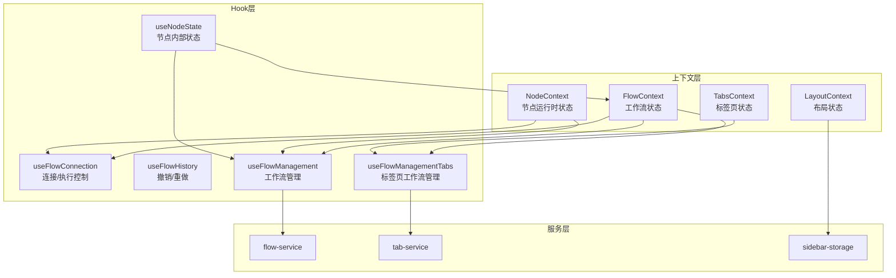
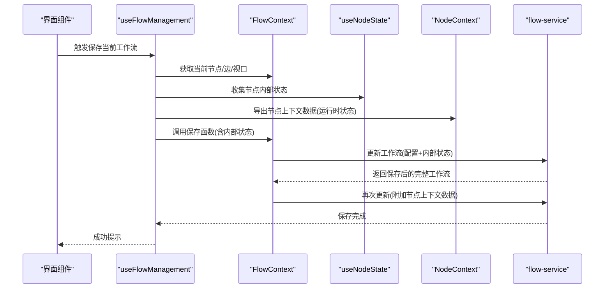
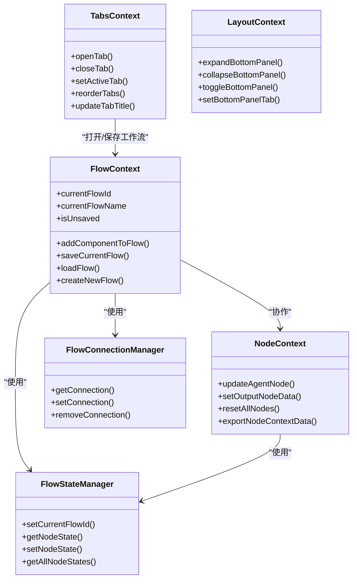

# 状态管理

<cite>
**本文引用的文件**
- [flow-context.tsx](file://app/frontend/src/contexts/flow-context.tsx)
- [tabs-context.tsx](file://app/frontend/src/contexts/tabs-context.tsx)
- [node-context.tsx](file://app/frontend/src/contexts/node-context.tsx)
- [layout-context.tsx](file://app/frontend/src/contexts/layout-context.tsx)
- [use-flow-connection.ts](file://app/frontend/src/hooks/use-flow-connection.ts)
- [use-node-state.ts](file://app/frontend/src/hooks/use-node-state.ts)
- [use-flow-history.ts](file://app/frontend/src/hooks/use-flow-history.ts)
- [use-flow-management.ts](file://app/frontend/src/hooks/use-flow-management.ts)
- [use-flow-management-tabs.ts](file://app/frontend/src/hooks/use-flow-management-tabs.ts)
- [tab-service.ts](file://app/frontend/src/services/tab-service.ts)
- [sidebar-storage.ts](file://app/frontend/src/services/sidebar-storage.ts)
- [flow.ts](file://app/frontend/src/types/flow.ts)
- [node-mappings.ts](file://app/frontend/src/data/node-mappings.ts)
</cite>

## 目录
1. [简介](#简介)
2. [项目结构与上下文概览](#项目结构与上下文概览)
3. [核心上下文与Hook](#核心上下文与hook)
4. [架构总览](#架构总览)
5. [详细组件分析](#详细组件分析)
6. [依赖关系分析](#依赖关系分析)
7. [性能与并发控制](#性能与并发控制)
8. [状态持久化与同步策略](#状态持久化与同步策略)
9. [调试与监控](#调试与监控)
10. [结论](#结论)

## 简介
本文件系统性梳理前端状态管理方案，围绕以下主题展开：
- Context API 使用模式与状态提升策略
- FlowContext 的工作流状态管理、节点状态与连接状态
- TabsContext 的标签页状态、激活状态与内容管理
- NodeContext 的节点选择、编辑状态与操作历史
- 自定义 Hook 的实现模式与最佳实践
- 状态持久化、状态同步与并发控制策略
- 状态调试工具与性能监控方法

## 项目结构与上下文概览
本项目采用“上下文 + 自定义Hook”的组合模式：
- 上下文层：FlowContext、TabsContext、NodeContext、LayoutContext 提供全局状态容器
- Hook 层：useFlowConnection、useNodeState、useFlowHistory、useFlowManagement、useFlowManagementTabs 等封装业务逻辑与副作用
- 服务层：flow-service、tab-service、sidebar-storage 等负责与后端或本地存储交互
- 类型层：flow.ts 定义工作流数据模型

图表来源
- [flow-context.tsx:35-358](file://app/frontend/src/contexts/flow-context.tsx#L35-L358)
- [tabs-context.tsx:59-271](file://app/frontend/src/contexts/tabs-context.tsx#L59-L271)
- [node-context.tsx:90-438](file://app/frontend/src/contexts/node-context.tsx#L90-L438)
- [layout-context.tsx:27-68](file://app/frontend/src/contexts/layout-context.tsx#L27-L68)
- [use-flow-connection.ts:80-250](file://app/frontend/src/hooks/use-flow-connection.ts#L80-L250)
- [use-node-state.ts:147-268](file://app/frontend/src/hooks/use-node-state.ts#L147-L268)
- [use-flow-history.ts:15-171](file://app/frontend/src/hooks/use-flow-history.ts#L15-L171)
- [use-flow-management.ts:44-336](file://app/frontend/src/hooks/use-flow-management.ts#L44-L336)
- [use-flow-management-tabs.ts:45-337](file://app/frontend/src/hooks/use-flow-management-tabs.ts#L45-L337)
- [tab-service.ts:13-68](file://app/frontend/src/services/tab-service.ts#L13-L68)
- [sidebar-storage.ts:7-237](file://app/frontend/src/services/sidebar-storage.ts#L7-L237)

章节来源
- [flow-context.tsx:10-358](file://app/frontend/src/contexts/flow-context.tsx#L10-L358)
- [tabs-context.tsx:18-271](file://app/frontend/src/contexts/tabs-context.tsx#L18-L271)
- [node-context.tsx:63-438](file://app/frontend/src/contexts/node-context.tsx#L63-L438)
- [layout-context.tsx:4-68](file://app/frontend/src/contexts/layout-context.tsx#L4-L68)

## 核心上下文与Hook
- FlowContext：统一管理当前工作流ID、名称、未保存标记、ReactFlow 实例；提供新增节点、保存/加载工作流、新建工作流等能力，并与 use-node-state、use-flow-connection 协作完成状态隔离与连接恢复。
- TabsContext：管理标签页集合、激活态、标题更新、重排、关闭等；通过 localStorage 持久化标签页列表与当前激活项。
- NodeContext：管理节点运行时状态（如代理节点消息、状态、输出节点结果），支持按工作流隔离的数据导出/导入与批量重置。
- LayoutContext：管理底部面板折叠状态与当前底部标签页，配合 sidebar-storage 进行持久化。
- useFlowConnection：全局连接管理器 + Hook，统一跟踪每个工作流的连接状态（空闲/连接中/已连接/错误/完成），并提供启动/停止/恢复等控制。
- useNodeState：为单个节点提供“自动持久化 + 流隔离”的状态 Hook，支持监听全局状态变化与流切换。
- useFlowHistory：基于 ReactFlow 的节点/边快照，提供撤销/重做与历史大小限制。
- useFlowManagement / useFlowManagementTabs：封装工作流的增删改查、保存/加载、默认工作流创建、标签页打开等流程，协调 FlowContext、NodeContext、localStorage 与服务层。

章节来源
- [flow-context.tsx:35-358](file://app/frontend/src/contexts/flow-context.tsx#L35-L358)
- [tabs-context.tsx:59-271](file://app/frontend/src/contexts/tabs-context.tsx#L59-L271)
- [node-context.tsx:90-438](file://app/frontend/src/contexts/node-context.tsx#L90-L438)
- [layout-context.tsx:27-68](file://app/frontend/src/contexts/layout-context.tsx#L27-L68)
- [use-flow-connection.ts:80-250](file://app/frontend/src/hooks/use-flow-connection.ts#L80-L250)
- [use-node-state.ts:147-268](file://app/frontend/src/hooks/use-node-state.ts#L147-L268)
- [use-flow-history.ts:15-171](file://app/frontend/src/hooks/use-flow-history.ts#L15-L171)
- [use-flow-management.ts:44-336](file://app/frontend/src/hooks/use-flow-management.ts#L44-L336)
- [use-flow-management-tabs.ts:45-337](file://app/frontend/src/hooks/use-flow-management-tabs.ts#L45-L337)

## 架构总览
下面以序列图展示“保存工作流”时的跨上下文协作流程，体现状态提升与持久化策略。

图表来源
- [use-flow-management.ts:58-109](file://app/frontend/src/hooks/use-flow-management.ts#L58-L109)
- [flow-context.tsx:74-131](file://app/frontend/src/contexts/flow-context.tsx#L74-L131)
- [use-node-state.ts:165-175](file://app/frontend/src/hooks/use-node-state.ts#L165-L175)
- [node-context.tsx:307-336](file://app/frontend/src/contexts/node-context.tsx#L307-L336)

章节来源
- [use-flow-management.ts:58-143](file://app/frontend/src/hooks/use-flow-management.ts#L58-L143)
- [flow-context.tsx:74-131](file://app/frontend/src/contexts/flow-context.tsx#L74-L131)
- [use-node-state.ts:165-175](file://app/frontend/src/hooks/use-node-state.ts#L165-L175)
- [node-context.tsx:307-336](file://app/frontend/src/contexts/node-context.tsx#L307-L336)

## 详细组件分析

### FlowContext：工作流状态管理
- 关键职责
  - 维护 currentFlowId、currentFlowName、isUnsaved
  - 与 ReactFlow 实例交互：设置节点/边、视口、fitView
  - 新增节点/多节点组：根据 node-mappings 动态生成节点与边
  - 保存/加载/新建工作流：整合 use-node-state 内部状态与 NodeContext 运行时状态
  - 与连接管理器协作：加载时检查并恢复连接状态
- 状态提升策略
  - 将“节点内部状态”与“节点上下文运行时状态”分别持久化到不同字段，避免混淆
  - 通过 setCurrentFlowId 实现 use-node-state 的流隔离
- 并发与一致性
  - 加载前先设置 flowId，确保 useNodeState 初始化正确
  - 保存时临时替换节点以注入 internal_state，再恢复原节点，保证 UI 与持久化一致

章节来源
- [flow-context.tsx:35-358](file://app/frontend/src/contexts/flow-context.tsx#L35-L358)
- [node-mappings.ts:118-140](file://app/frontend/src/data/node-mappings.ts#L118-L140)

### TabsContext：标签页状态与内容管理
- 关键职责
  - 维护 tabs 列表与 activeTabId
  - 打开/关闭/重排/更新标题等操作
  - 通过 localStorage 持久化 tabs 与 activeTabId
  - 与 TabService 协作生成/恢复标签页内容
- 内容管理
  - 仅持久化可序列化的元数据，content 延迟生成
  - 恢复时调用 TabService.createTabContent 动态渲染
- 并发与一致性
  - 通过唯一标识符（flow-id 或 settings）避免重复打开
  - 关闭标签时自动调整激活态

章节来源
- [tabs-context.tsx:59-271](file://app/frontend/src/contexts/tabs-context.tsx#L59-L271)
- [tab-service.ts:13-68](file://app/frontend/src/services/tab-service.ts#L13-L68)

### NodeContext：节点运行时状态
- 数据模型
  - AgentNodeData：节点状态、消息历史、最后更新时间等
  - OutputNodeData：输出节点的决策、信号、回测指标、最终投资组合等
- 流隔离
  - 通过复合键（flowId:nodeId）实现 per-flow 状态隔离
  - 提供导出/导入接口，支持按工作流维度持久化
- 批量操作
  - 支持批量更新节点状态、重置所有节点或仅重置状态
- 并发与一致性
  - 与 useFlowConnection 协作，运行前重置节点状态，停止时仅重置状态不丢失消息/结果

章节来源
- [node-context.tsx:63-438](file://app/frontend/src/contexts/node-context.tsx#L63-L438)

### LayoutContext：布局状态
- 关键职责
  - 底部面板折叠状态与当前底部标签页
  - 与 SidebarStorageService 配合进行 localStorage 持久化
- 并发与一致性
  - 状态变更时自动写入 localStorage，挂载时读取

章节来源
- [layout-context.tsx:27-68](file://app/frontend/src/contexts/layout-context.tsx#L27-L68)
- [sidebar-storage.ts:7-237](file://app/frontend/src/services/sidebar-storage.ts#L7-L237)

### useFlowConnection：连接状态与执行控制
- 全局连接管理器
  - 记录每个 flowId 的连接状态、开始时间、最后活动时间、错误信息
  - 提供监听器机制，用于驱动 UI 重新渲染
- Hook 行为
  - runFlow/runBacktest：在启动前重置节点状态，建立连接并记录 abortController
  - stopFlow：调用 abortController，重置节点状态为 idle
  - recoverFlowState：检测过期连接并恢复为空闲
- 并发与一致性
  - 通过 abortController 支持取消执行
  - 与 NodeContext 协作，确保运行前后状态一致

章节来源
- [use-flow-connection.ts:18-250](file://app/frontend/src/hooks/use-flow-connection.ts#L18-L250)

### useNodeState：节点内部状态 Hook
- 设计要点
  - FlowStateManager：全局状态管理器，支持按 flowId 隔离
  - useNodeState：返回值与 useState 类似，但具备持久化与流切换感知
  - 监听器：当全局状态或 flowId 变更时，自动同步到组件本地状态
- 并发与一致性
  - 使用 setTimeout 避免在渲染期间更新状态
  - 初始化时若无持久化值则写入默认值

章节来源
- [use-node-state.ts:7-268](file://app/frontend/src/hooks/use-node-state.ts#L7-L268)

### useFlowHistory：撤销/重做
- 设计要点
  - 以 flowId 为键维护各自的历史栈
  - 快照时排除 UI 专用属性，仅比较节点/边结构差异
  - 支持撤销/重做与历史清理
- 并发与一致性
  - 在撤销/重做过程中设置标志位，避免写入历史
  - 通过 ReactFlow 的 setNodes/setEdges 恢复状态

章节来源
- [use-flow-history.ts:15-171](file://app/frontend/src/hooks/use-flow-history.ts#L15-L171)

### useFlowManagement / useFlowManagementTabs：工作流生命周期
- useFlowManagement
  - 保存：合并节点内部状态与节点上下文运行时状态，分两步持久化
  - 加载：设置 flowId 后再渲染节点，恢复内部状态；不恢复运行时状态
  - 默认工作流：创建后立即加载
- useFlowManagementTabs
  - 以标签页形式打开工作流，延迟恢复运行时状态，仅恢复配置类内部状态
  - 删除工作流时关闭对应标签页并清理相关节点状态

章节来源
- [use-flow-management.ts:58-143](file://app/frontend/src/hooks/use-flow-management.ts#L58-L143)
- [use-flow-management-tabs.ts:212-278](file://app/frontend/src/hooks/use-flow-management-tabs.ts#L212-L278)

## 依赖关系分析

图表来源
- [flow-context.tsx:35-358](file://app/frontend/src/contexts/flow-context.tsx#L35-L358)
- [tabs-context.tsx:59-271](file://app/frontend/src/contexts/tabs-context.tsx#L59-L271)
- [node-context.tsx:90-438](file://app/frontend/src/contexts/node-context.tsx#L90-L438)
- [layout-context.tsx:27-68](file://app/frontend/src/contexts/layout-context.tsx#L27-L68)
- [use-node-state.ts:7-132](file://app/frontend/src/hooks/use-node-state.ts#L7-L132)
- [use-flow-connection.ts:18-73](file://app/frontend/src/hooks/use-flow-connection.ts#L18-L73)

章节来源
- [flow-context.tsx:35-358](file://app/frontend/src/contexts/flow-context.tsx#L35-L358)
- [tabs-context.tsx:59-271](file://app/frontend/src/contexts/tabs-context.tsx#L59-L271)
- [node-context.tsx:90-438](file://app/frontend/src/contexts/node-context.tsx#L90-L438)
- [layout-context.tsx:27-68](file://app/frontend/src/contexts/layout-context.tsx#L27-L68)
- [use-node-state.ts:7-132](file://app/frontend/src/hooks/use-node-state.ts#L7-L132)
- [use-flow-connection.ts:18-73](file://app/frontend/src/hooks/use-flow-connection.ts#L18-L73)

## 性能与并发控制
- 性能优化
  - useNodeState：通过监听器与流切换回调，避免不必要的重渲染
  - useFlowHistory：仅比较节点/边结构差异，跳过仅 UI 属性变化的快照
  - FlowContext：保存时临时替换节点以注入 internal_state，完成后恢复，减少 UI 抖动
- 并发控制
  - useFlowConnection：通过 abortController 支持取消执行；连接状态机避免并发冲突
  - FlowStateManager：全局状态变更通知，确保多组件一致感知
- 最佳实践
  - 在保存/加载前先设置 flowId，确保状态隔离
  - 运行前重置节点状态，停止后仅重置状态不丢失运行时数据
  - 使用 localStorage 持久化用户偏好与标签页状态，避免每次刷新重建

[本节为通用指导，无需特定文件来源]

## 状态持久化与同步策略
- 工作流持久化
  - 配置类状态：FlowContext.saveCurrentFlow 保存 nodes/edges/viewport/data
  - 节点内部状态：useNodeState.getAllNodeStates 导出，随工作流一起保存
  - 节点上下文运行时状态：NodeContext.exportNodeContextData 导出，单独更新到后端
- 标签页持久化
  - TabsContext 将 tabs 与 activeTabId 写入 localStorage；内容延迟生成
- 布局持久化
  - LayoutContext 与 SidebarStorageService 协作，保存底部面板折叠状态
- 同步策略
  - 加载工作流时：先设置 flowId，再渲染节点，最后恢复内部状态
  - 打开标签页时：仅恢复配置类内部状态，运行时状态在激活时清空

章节来源
- [flow-context.tsx:74-188](file://app/frontend/src/contexts/flow-context.tsx#L74-L188)
- [use-node-state.ts:68-103](file://app/frontend/src/hooks/use-node-state.ts#L68-L103)
- [node-context.tsx:307-368](file://app/frontend/src/contexts/node-context.tsx#L307-L368)
- [tabs-context.tsx:75-140](file://app/frontend/src/contexts/tabs-context.tsx#L75-L140)
- [layout-context.tsx:27-68](file://app/frontend/src/contexts/layout-context.tsx#L27-L68)
- [sidebar-storage.ts:41-49](file://app/frontend/src/services/sidebar-storage.ts#L41-L49)

## 调试与监控
- 连接状态监控
  - useFlowConnectionState：订阅全局连接状态，便于在任意组件中观察连接状态
- 运行时状态观察
  - useFlowConnection：在运行/停止时打印日志，辅助排查异常
  - NodeContext：导出运行时状态，便于导出诊断数据
- 性能监控建议
  - 对 FlowStateManager 的状态变更与流切换事件添加计数器
  - 对 useFlowHistory 的 takeSnapshot/undo/redo 操作添加耗时统计
  - 对 FlowContext 的保存/加载流程添加时间戳与错误上报

章节来源
- [use-flow-connection.ts:253-267](file://app/frontend/src/hooks/use-flow-connection.ts#L253-L267)
- [node-context.tsx:307-336](file://app/frontend/src/contexts/node-context.tsx#L307-L336)

## 结论
本项目通过“上下文 + 自定义Hook”的组合，实现了：
- 明确的状态边界与流隔离（useNodeState、NodeContext）
- 清晰的生命周期管理（保存/加载/新建/删除）
- 强大的持久化与同步策略（localStorage、后端数据合并）
- 友好的并发控制与调试手段（连接管理器、监听器、日志）

该设计既满足复杂工作流场景下的状态一致性需求，又保持了良好的扩展性与可维护性。