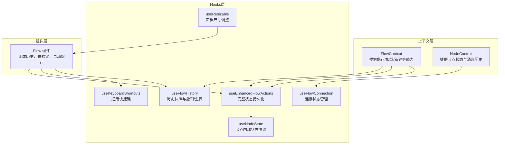
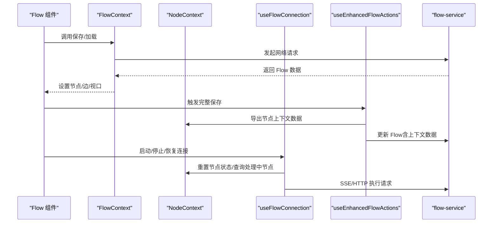
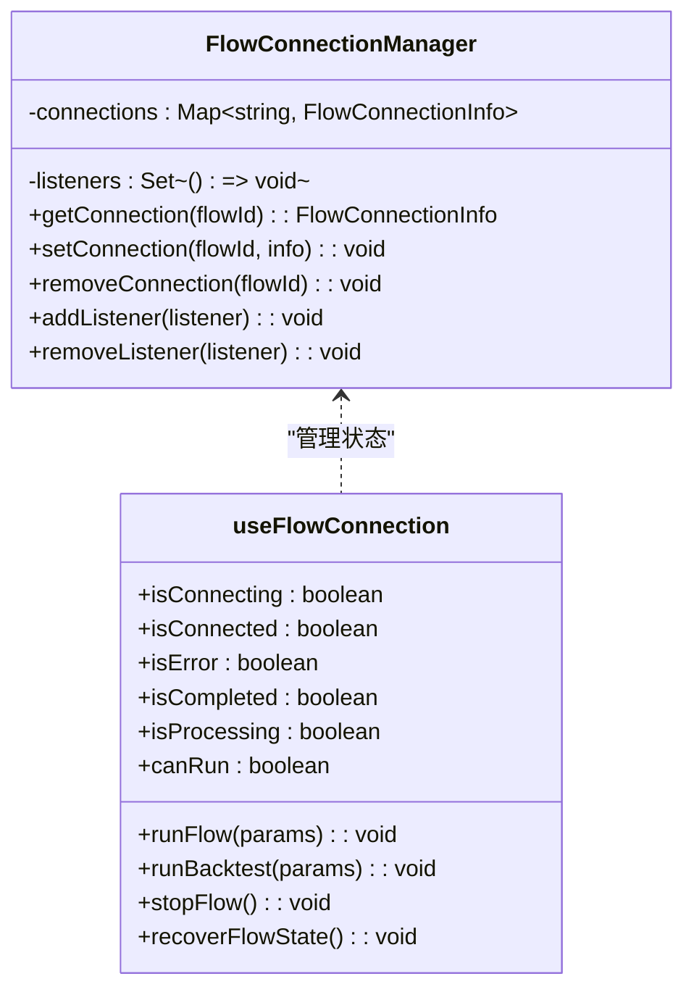
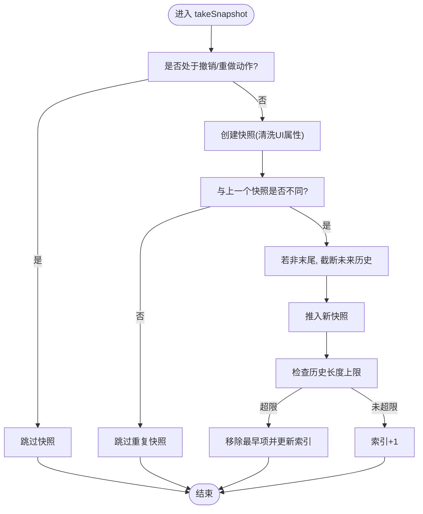
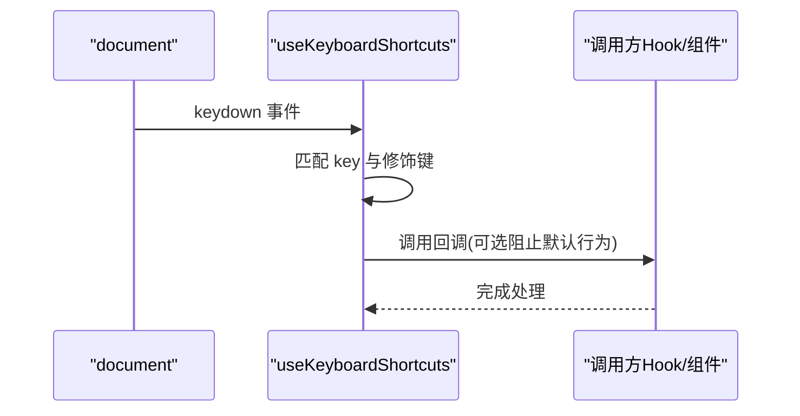
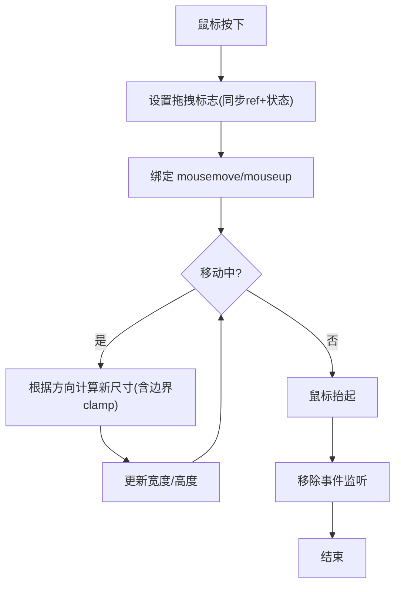
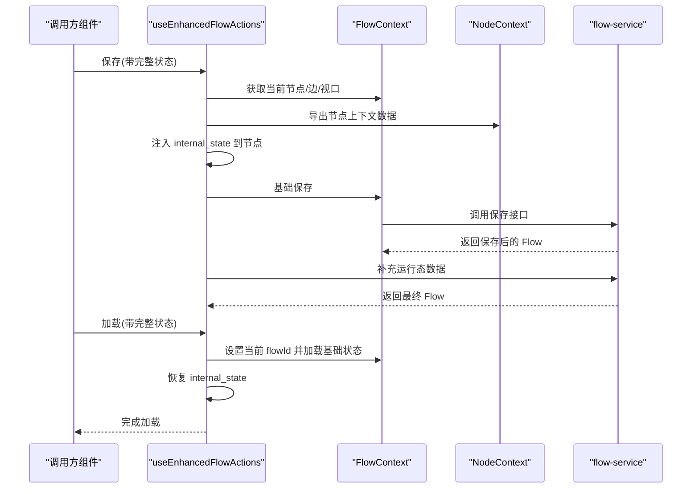
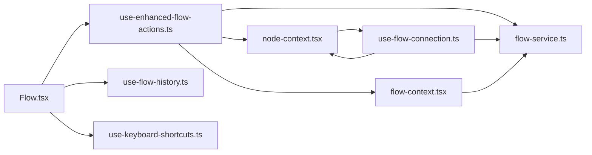

# 自定义Hooks

<cite>
**本文档引用的文件**
- [use-flow-connection.ts](file://app/frontend/src/hooks/use-flow-connection.ts)
- [use-flow-history.ts](file://app/frontend/src/hooks/use-flow-history.ts)
- [use-keyboard-shortcuts.ts](file://app/frontend/src/hooks/use-keyboard-shortcuts.ts)
- [use-resizable.ts](file://app/frontend/src/hooks/use-resizable.ts)
- [use-enhanced-flow-actions.ts](file://app/frontend/src/hooks/use-enhanced-flow-actions.ts)
- [use-node-state.ts](file://app/frontend/src/hooks/use-node-state.ts)
- [use-flow-management.ts](file://app/frontend/src/hooks/use-flow-management.ts)
- [use-flow-management-tabs.ts](file://app/frontend/src/hooks/use-flow-management-tabs.ts)
- [use-output-node-connection.ts](file://app/frontend/src/hooks/use-output-node-connection.ts)
- [flow-context.tsx](file://app/frontend/src/contexts/flow-context.tsx)
- [node-context.tsx](file://app/frontend/src/contexts/node-context.tsx)
- [flow-service.ts](file://app/frontend/src/services/flow-service.ts)
- [Flow.tsx](file://app/frontend/src/components/Flow.tsx)
</cite>

## 目录
1. [简介](#简介)
2. [项目结构](#项目结构)
3. [核心组件](#核心组件)
4. [架构总览](#架构总览)
5. [详细组件分析](#详细组件分析)
6. [依赖关系分析](#依赖关系分析)
7. [性能考量](#性能考量)
8. [故障排查指南](#故障排查指南)
9. [结论](#结论)
10. [附录](#附录)

## 简介
本文件系统性梳理前端自定义Hooks的设计与实现，重点覆盖以下主题：
- 连接状态管理：useFlowConnection 的全局连接状态、运行控制与恢复机制
- 操作历史追踪：useFlowHistory 的快照、撤销/重做与去重策略
- 快捷键处理：useKeyboardShortcuts 及其便捷封装的布局与流程快捷键
- 窗口大小调整：useResizable 的拖拽式尺寸控制与边界约束
- 增强操作功能：useEnhancedFlowActions 的完整状态持久化（配置态+运行态）
- 设计模式与最佳实践：状态提升、副作用处理、性能优化
- 测试策略与调试技巧：可测性设计与常见问题定位

## 项目结构
本项目采用“上下文 + Hooks”的分层架构，核心数据流通过 FlowContext 与 NodeContext 提供全局状态，各业务 Hooks 负责具体功能域的状态与副作用管理。

图表来源
- [flow-context.tsx:10-358](file://app/frontend/src/contexts/flow-context.tsx#L10-358)
- [node-context.tsx:63-438](file://app/frontend/src/contexts/node-context.tsx#L63-438)
- [use-flow-connection.ts:19-73](file://app/frontend/src/hooks/use-flow-connection.ts#L19-73)
- [use-flow-history.ts:15-171](file://app/frontend/src/hooks/use-flow-history.ts#L15-171)
- [use-keyboard-shortcuts.ts:17-50](file://app/frontend/src/hooks/use-keyboard-shortcuts.ts#L17-50)
- [use-resizable.ts:13-93](file://app/frontend/src/hooks/use-resizable.ts#L13-93)
- [use-enhanced-flow-actions.ts:16-112](file://app/frontend/src/hooks/use-enhanced-flow-actions.ts#L16-112)
- [use-node-state.ts:7-135](file://app/frontend/src/hooks/use-node-state.ts#L7-135)
- [Flow.tsx:34-313](file://app/frontend/src/components/Flow.tsx#L34-313)

章节来源
- [flow-context.tsx:10-358](file://app/frontend/src/contexts/flow-context.tsx#L10-358)
- [node-context.tsx:63-438](file://app/frontend/src/contexts/node-context.tsx#L63-438)
- [Flow.tsx:34-313](file://app/frontend/src/components/Flow.tsx#L34-313)

## 核心组件
- useFlowConnection：全局连接管理器 + 钩子，统一维护每个 flow 的连接状态、中止控制器与活动时间，支持运行/回测两种执行路径，并提供停止与恢复逻辑。
- useFlowHistory：基于 React Flow 状态的快照机制，支持按 flowId 分组的历史栈、去重比较与撤销/重做。
- useKeyboardShortcuts：通用键盘事件钩子，提供跨平台（Ctrl/Cmd）兼容与防重复默认行为；提供针对流程与布局的便捷封装。
- useResizable：拖拽式尺寸调整，支持左右侧边栏与底部面板，具备最小/最大值限制与同步 ref/state 更新。
- useEnhancedFlowActions：在基础保存/加载之上，额外持久化与恢复节点内部状态（配置态）与节点上下文数据（运行态），确保状态一致性。

章节来源
- [use-flow-connection.ts:19-268](file://app/frontend/src/hooks/use-flow-connection.ts#L19-268)
- [use-flow-history.ts:15-171](file://app/frontend/src/hooks/use-flow-history.ts#L15-171)
- [use-keyboard-shortcuts.ts:17-165](file://app/frontend/src/hooks/use-keyboard-shortcuts.ts#L17-165)
- [use-resizable.ts:13-93](file://app/frontend/src/hooks/use-resizable.ts#L13-93)
- [use-enhanced-flow-actions.ts:16-112](file://app/frontend/src/hooks/use-enhanced-flow-actions.ts#L16-112)

## 架构总览
下图展示从组件到上下文再到 Hooks 的调用链路与数据流向：

图表来源
- [Flow.tsx:48-210](file://app/frontend/src/components/Flow.tsx#L48-210)
- [flow-context.tsx:75-188](file://app/frontend/src/contexts/flow-context.tsx#L75-188)
- [node-context.tsx:238-336](file://app/frontend/src/contexts/node-context.tsx#L238-336)
- [use-flow-connection.ts:115-232](file://app/frontend/src/hooks/use-flow-connection.ts#L115-232)
- [use-enhanced-flow-actions.ts:21-106](file://app/frontend/src/hooks/use-enhanced-flow-actions.ts#L21-106)
- [flow-service.ts:27-108](file://app/frontend/src/services/flow-service.ts#L27-108)

## 详细组件分析

### useFlowConnection：连接状态管理
- 全局连接管理器
  - 使用 Map 存储每个 flowId 的连接信息，包含状态、中止控制器、开始时间与最后活动时间
  - 提供监听器集合，当连接状态变化时通知订阅者触发重渲染
- 钩子返回
  - 状态：连接中、已连接、错误、完成、处理中、是否可运行
  - 控制：运行流程/回测、停止、恢复过期状态
- 关键逻辑
  - 运行前重置节点状态，设置“连接中”并发起 API 请求，成功后切换为“已连接”
  - 停止时调用中止控制器并仅重置节点状态，保留运行结果与消息
  - 恢复逻辑：若连接处于“已连接/连接中”但无处理中节点且超过阈值时间，则恢复为空闲
- 与上下文协作
  - 读取 NodeContext 中的 agent 状态判断是否正在处理
  - 通过 FlowContext 的当前 flowId 作为键进行状态隔离

图表来源
- [use-flow-connection.ts:19-73](file://app/frontend/src/hooks/use-flow-connection.ts#L19-73)
- [use-flow-connection.ts:80-250](file://app/frontend/src/hooks/use-flow-connection.ts#L80-250)

章节来源
- [use-flow-connection.ts:19-268](file://app/frontend/src/hooks/use-flow-connection.ts#L19-268)
- [node-context.tsx:370-399](file://app/frontend/src/contexts/node-context.tsx#L370-399)
- [flow-context.tsx:134-188](file://app/frontend/src/contexts/flow-context.tsx#L134-188)

### useFlowHistory：操作历史追踪
- 快照机制
  - 清洗 UI 属性（如选择状态）后序列化节点/边，避免仅 UI 变更导致的冗余历史
  - 对比新旧快照，仅在节点或边发生结构性差异时入栈
- 历史栈管理
  - 按 flowId 分组维护独立历史栈，支持索引游标与上限控制
  - 撤销/重做时直接替换 React Flow 的节点/边状态
- 去重策略
  - 通过序列化字符串比较，忽略仅 UI 属性变更
- 与组件集成
  - 在节点/边变化时定时快照，初始空画布时记录首快照
  - 支持撤销/重做快捷键

图表来源
- [use-flow-history.ts:46-113](file://app/frontend/src/hooks/use-flow-history.ts#L46-113)

章节来源
- [use-flow-history.ts:15-171](file://app/frontend/src/hooks/use-flow-history.ts#L15-171)
- [Flow.tsx:54-178](file://app/frontend/src/components/Flow.tsx#L54-178)

### useKeyboardShortcuts：快捷键处理
- 通用逻辑
  - 监听 document 的 keydown 事件，匹配 key 与修饰键组合
  - 支持跨平台（Ctrl 与 Meta 同步匹配）、保存快捷键特殊处理、撤销/重做组合键
  - 可选阻止默认行为（如保存、撤销/重做）
- 便捷封装
  - 流程快捷键：保存（Ctrl/Cmd+S）
  - 布局快捷键：右侧/左侧侧边栏、适配视图、撤销/重做、底部面板、设置等

图表来源
- [use-keyboard-shortcuts.ts:18-49](file://app/frontend/src/hooks/use-keyboard-shortcuts.ts#L18-49)
- [use-keyboard-shortcuts.ts:53-165](file://app/frontend/src/hooks/use-keyboard-shortcuts.ts#L53-165)

章节来源
- [use-keyboard-shortcuts.ts:17-165](file://app/frontend/src/hooks/use-keyboard-shortcuts.ts#L17-165)
- [Flow.tsx:198-230](file://app/frontend/src/components/Flow.tsx#L198-230)

### useResizable：窗口大小调整
- 功能特性
  - 支持左/右/底部三种拖拽方向
  - 最小/最大宽高限制，防止布局异常
  - 同步 ref 与 state，保证拖拽过程中的即时反馈
- 交互流程
  - 鼠标按下：标记拖拽开始，绑定 mousemove/mouseup
  - 鼠标移动：根据方向计算新尺寸，clamp 到边界
  - 鼠标抬起：清理事件监听，结束拖拽

图表来源
- [use-resizable.ts:30-76](file://app/frontend/src/hooks/use-resizable.ts#L30-76)

章节来源
- [use-resizable.ts:13-93](file://app/frontend/src/hooks/use-resizable.ts#L13-93)

### useEnhancedFlowActions：增强操作功能
- 设计目标
  - 在基础保存/加载之上，同时持久化两类状态：
    - 配置态：来自 useNodeState 的内部状态（节点配置、临时参数等）
    - 运行态：来自 NodeContext 的运行时数据（消息、状态、回测结果等）
- 实现要点
  - 保存：先增强节点数据（注入 internal_state），调用基础保存，再通过服务端接口补充运行态数据
  - 加载：设置当前 flowId，加载基础状态，再逐节点恢复 internal_state；不恢复运行态以保证每次运行从干净状态开始
- 与上下文协作
  - 通过 FlowContext 获取 React Flow 实例与当前 flowId
  - 通过 NodeContext 导出/导入运行态数据
  - 通过 flow-service 与后端交互

图表来源
- [use-enhanced-flow-actions.ts:21-106](file://app/frontend/src/hooks/use-enhanced-flow-actions.ts#L21-106)
- [flow-context.tsx:75-188](file://app/frontend/src/contexts/flow-context.tsx#L75-188)
- [node-context.tsx:308-336](file://app/frontend/src/contexts/node-context.tsx#L308-336)
- [flow-service.ts:62-74](file://app/frontend/src/services/flow-service.ts#L62-74)

章节来源
- [use-enhanced-flow-actions.ts:16-112](file://app/frontend/src/hooks/use-enhanced-flow-actions.ts#L16-112)
- [use-node-state.ts:7-135](file://app/frontend/src/hooks/use-node-state.ts#L7-135)
- [flow-context.tsx:75-188](file://app/frontend/src/contexts/flow-context.tsx#L75-188)
- [node-context.tsx:308-336](file://app/frontend/src/contexts/node-context.tsx#L308-336)

### 补充：useNodeState（状态隔离与持久化）
- FlowStateManager
  - 以“flowId:nodeId”复合键隔离状态，支持当前 flowId 变化时的监听与重置
  - 提供节点级内部状态的读写、清空与导出
- useNodeState
  - React Hook 封装，提供与 useState 类似的 API，但具备跨保存/加载的状态持久化与 flow 隔离
  - 内部监听状态变化与 flow 切换，必要时强制刷新

章节来源
- [use-node-state.ts:7-135](file://app/frontend/src/hooks/use-node-state.ts#L7-135)
- [use-node-state.ts:194-268](file://app/frontend/src/hooks/use-node-state.ts#L194-268)

### 补充：useFlowManagement 与 useFlowManagementTabs（状态持久化与标签页）
- useFlowManagement
  - 在列表层面实现“完整状态保存/加载”，与 useEnhancedFlowActions 保持一致的策略
- useFlowManagementTabs
  - 在标签页层面实现“配置态恢复”，运行态在激活时从后端重新拉取，避免跨标签页污染

章节来源
- [use-flow-management.ts:58-143](file://app/frontend/src/hooks/use-flow-management.ts#L58-143)
- [use-flow-management-tabs.ts:60-148](file://app/frontend/src/hooks/use-flow-management-tabs.ts#L60-148)

### 补充：useOutputNodeConnection（输出节点连接状态）
- 基于 React Flow 的节点/边状态与 NodeContext 的 agent 输出状态，判断输出可用性、连接性与处理中状态
- 用于输出面板/对话框的启用/禁用与提示

章节来源
- [use-output-node-connection.ts:12-59](file://app/frontend/src/hooks/use-output-node-connection.ts#L12-59)

## 依赖关系分析
- 上下文依赖
  - FlowContext：提供保存/加载/新建等核心能力，被 useEnhancedFlowActions 与 useFlowManagement 复用
  - NodeContext：提供 agent 状态、消息历史与输出数据，被 useFlowConnection 与 useOutputNodeConnection 使用
- 服务依赖
  - flow-service：统一的后端交互入口，负责 CRUD 与默认流程创建
- 组件依赖
  - Flow 组件：集成历史、快捷键、自动保存与增强保存，形成完整的用户体验闭环

图表来源
- [Flow.tsx:48-230](file://app/frontend/src/components/Flow.tsx#L48-230)
- [use-enhanced-flow-actions.ts:16-112](file://app/frontend/src/hooks/use-enhanced-flow-actions.ts#L16-112)
- [use-flow-connection.ts:80-250](file://app/frontend/src/hooks/use-flow-connection.ts#L80-250)
- [flow-context.tsx:75-188](file://app/frontend/src/contexts/flow-context.tsx#L75-188)
- [node-context.tsx:238-336](file://app/frontend/src/contexts/node-context.tsx#L238-336)
- [flow-service.ts:27-108](file://app/frontend/src/services/flow-service.ts#L27-108)

章节来源
- [Flow.tsx:34-313](file://app/frontend/src/components/Flow.tsx#L34-313)
- [use-enhanced-flow-actions.ts:16-112](file://app/frontend/src/hooks/use-enhanced-flow-actions.ts#L16-112)
- [use-flow-connection.ts:80-250](file://app/frontend/src/hooks/use-flow-connection.ts#L80-250)

## 性能考量
- 历史快照去重
  - 仅在节点/边存在结构性差异时入栈，避免 UI 属性抖动导致的历史膨胀
- 自动保存节流
  - Flow 组件对节点/边变化采用去抖策略，减少频繁保存带来的网络压力
- 状态隔离与监听
  - useNodeState 通过监听器批量通知，避免细粒度状态分散更新
- 拖拽同步更新
  - useResizable 使用 ref 与 state 双写，确保拖拽过程的流畅性

## 故障排查指南
- 连接状态异常
  - 现象：已连接但无处理中节点，长时间无响应
  - 排查：调用恢复函数检查 lastActivity 与是否过期，必要时重置为 idle
  - 参考：[use-flow-connection.ts:214-232](file://app/frontend/src/hooks/use-flow-connection.ts#L214-232)
- 快捷键无效
  - 现象：Ctrl/Cmd 组合键不生效
  - 排查：确认修饰键匹配逻辑与 preventDefault 是否开启
  - 参考：[use-keyboard-shortcuts.ts:18-49](file://app/frontend/src/hooks/use-keyboard-shortcuts.ts#L18-49)
- 历史无法撤销/重做
  - 现象：快照未入栈或索引未前进
  - 排查：检查快照去重逻辑与历史上限，确认当前索引位置
  - 参考：[use-flow-history.ts:73-113](file://app/frontend/src/hooks/use-flow-history.ts#L73-113)
- 尺寸调整异常
  - 现象：拖拽后尺寸超出边界或不更新
  - 排查：确认最小/最大值设置与方向计算逻辑
  - 参考：[use-resizable.ts:47-67](file://app/frontend/src/hooks/use-resizable.ts#L47-67)
- 状态丢失或错乱
  - 现象：保存后加载状态不一致
  - 排查：确认 useEnhancedFlowActions 的保存/加载顺序与 internal_state 注入/恢复
  - 参考：[use-enhanced-flow-actions.ts:21-106](file://app/frontend/src/hooks/use-enhanced-flow-actions.ts#L21-106)

章节来源
- [use-flow-connection.ts:214-232](file://app/frontend/src/hooks/use-flow-connection.ts#L214-232)
- [use-keyboard-shortcuts.ts:18-49](file://app/frontend/src/hooks/use-keyboard-shortcuts.ts#L18-49)
- [use-flow-history.ts:73-113](file://app/frontend/src/hooks/use-flow-history.ts#L73-113)
- [use-resizable.ts:47-67](file://app/frontend/src/hooks/use-resizable.ts#L47-67)
- [use-enhanced-flow-actions.ts:21-106](file://app/frontend/src/hooks/use-enhanced-flow-actions.ts#L21-106)

## 结论
本项目通过一组精心设计的自定义 Hooks，实现了从连接管理、历史追踪、快捷键处理到窗口调整与状态持久化的完整能力闭环。其关键设计思想包括：
- 以上下文为中心的状态提升与共享
- 以 Hooks 为边界的功能解耦与复用
- 以去重与节流为核心的性能优化
- 以可测性与可观测性为导向的调试策略

## 附录
- 使用模式与最佳实践
  - 状态提升：将跨组件共享的状态置于上下文，Hooks 仅负责副作用与派生逻辑
  - 副作用处理：集中于 Hooks 内部，组件只关注渲染与事件绑定
  - 性能优化：对高频事件（拖拽、输入、快照）采用去抖/节流与条件更新
- 测试策略
  - 单元测试：对纯函数与状态计算逻辑（如快照去重、尺寸计算）进行断言
  - 集成测试：模拟上下文与服务交互，验证保存/加载流程与状态一致性
  - 回归测试：覆盖连接状态恢复、历史撤销/重做、快捷键触发等关键路径
- 调试技巧
  - 利用日志与时间戳定位异步流程（连接、保存、加载）
  - 使用浏览器开发者工具观察 React Flow 状态与事件流
  - 通过最小化复现步骤快速定位问题边界