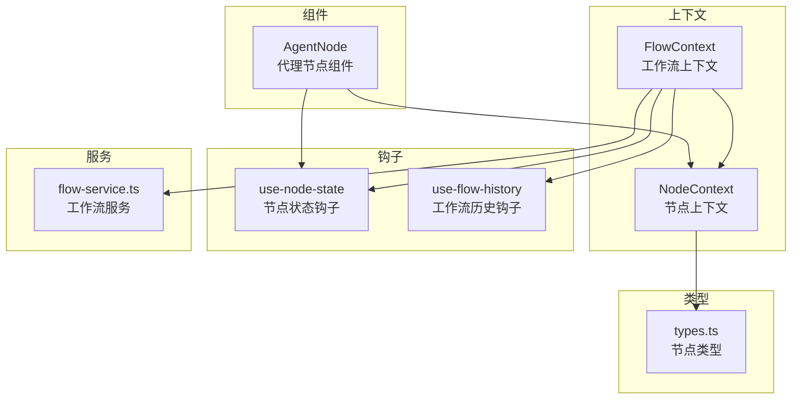
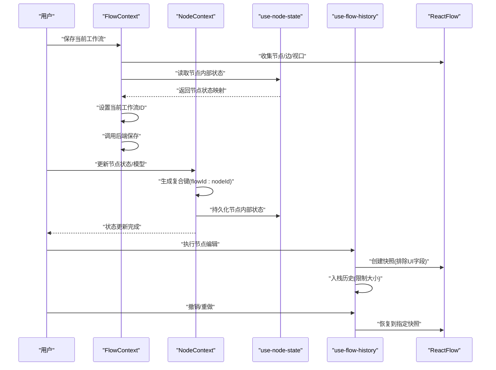
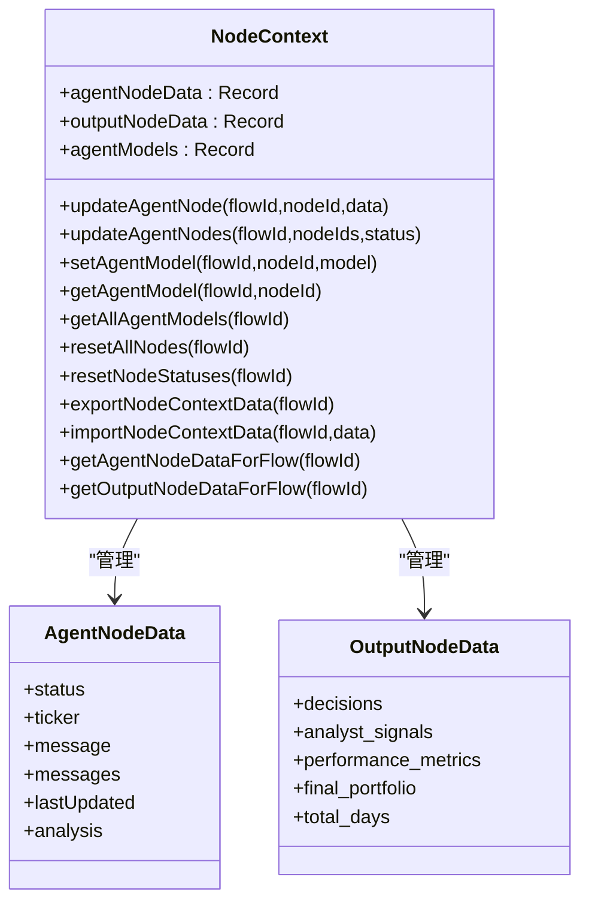
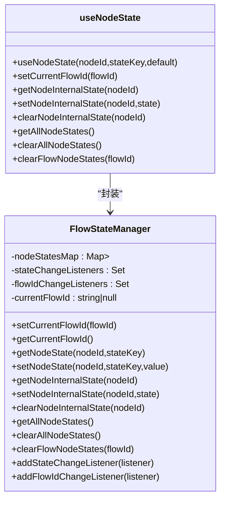
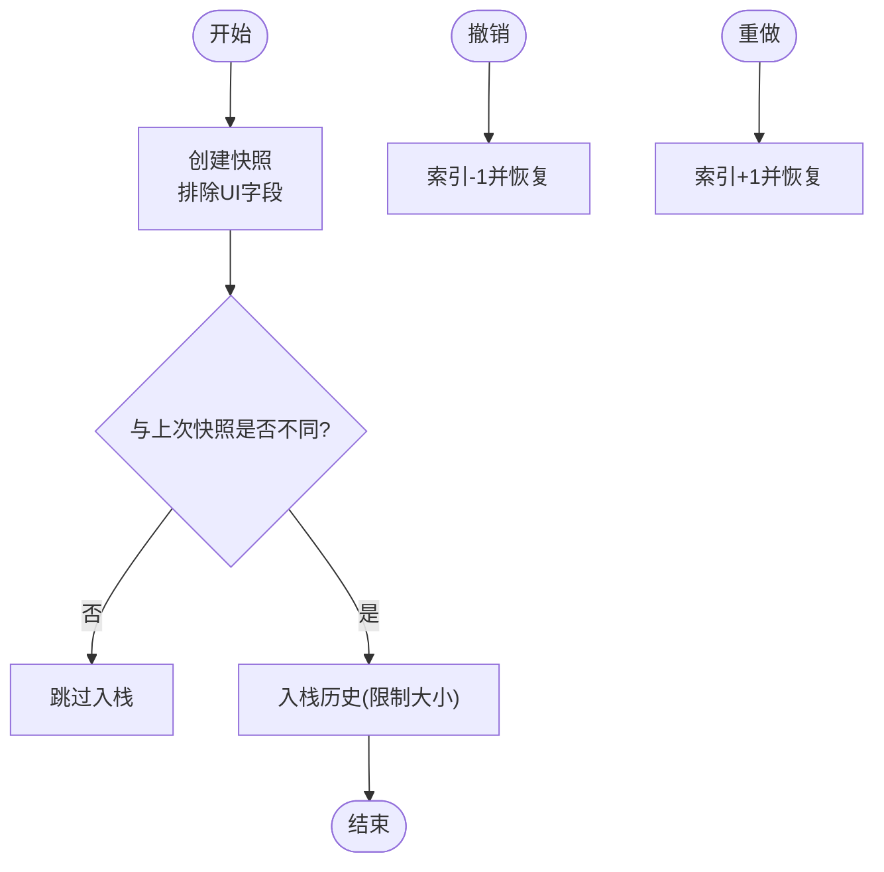
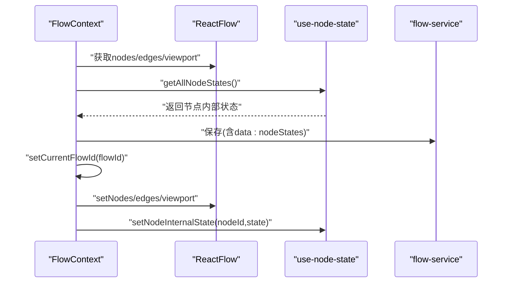
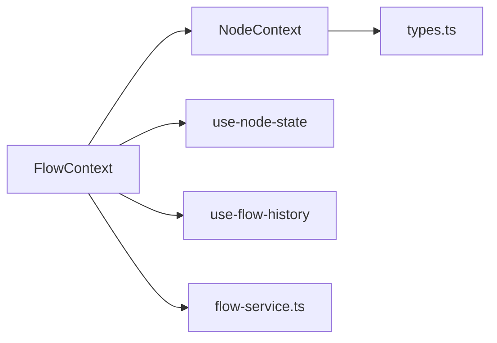

# 节点上下文

<cite>
**本文引用的文件**
- [node-context.tsx](file://app/frontend/src/contexts/node-context.tsx)
- [use-node-state.ts](file://app/frontend/src/hooks/use-node-state.ts)
- [use-flow-history.ts](file://app/frontend/src/hooks/use-flow-history.ts)
- [flow-context.tsx](file://app/frontend/src/contexts/flow-context.tsx)
- [agent-node.tsx](file://app/frontend/src/nodes/components/agent-node.tsx)
- [types.ts](file://app/frontend/src/nodes/types.ts)
- [flow-service.ts](file://app/frontend/src/services/flow-service.ts)
</cite>

## 目录
1. [简介](#简介)
2. [项目结构](#项目结构)
3. [核心组件](#核心组件)
4. [架构总览](#架构总览)
5. [详细组件分析](#详细组件分析)
6. [依赖关系分析](#依赖关系分析)
7. [性能考量](#性能考量)
8. [故障排查指南](#故障排查指南)
9. [结论](#结论)
10. [附录](#附录)

## 简介
本文件系统性阐述“节点上下文”（NodeContext）在前端应用中的职责与实现方式，重点覆盖以下方面：
- 节点选择状态与编辑状态的管理
- 节点消息与处理状态的持久化机制（含节点属性的存储与恢复）
- 工作流级操作历史（撤销/重做）与操作序列管理
- 节点上下文与工作流状态的关系（节点状态隔离与跨工作流数据管理）
- 节点操作的实现模式（批量操作、节点复制、状态同步策略）

## 项目结构
围绕节点上下文的相关模块分布如下：
- 上下文层：节点上下文（NodeContext）、工作流上下文（FlowContext）
- 钩子层：节点状态钩子（use-node-state）、工作流历史钩子（use-flow-history）
- 组件层：节点组件（如 AgentNode）
- 类型层：节点类型定义
- 服务层：工作流服务（flow-service）

图表来源
- [node-context.tsx:1-438](file://app/frontend/src/contexts/node-context.tsx#L1-L438)
- [use-node-state.ts:1-268](file://app/frontend/src/hooks/use-node-state.ts#L1-L268)
- [use-flow-history.ts:1-171](file://app/frontend/src/hooks/use-flow-history.ts#L1-L171)
- [flow-context.tsx:1-358](file://app/frontend/src/contexts/flow-context.tsx#L1-L358)
- [agent-node.tsx:1-148](file://app/frontend/src/nodes/components/agent-node.tsx#L1-L148)
- [types.ts:1-13](file://app/frontend/src/nodes/types.ts#L1-L13)
- [flow-service.ts:1-108](file://app/frontend/src/services/flow-service.ts#L1-L108)

章节来源
- [node-context.tsx:1-438](file://app/frontend/src/contexts/node-context.tsx#L1-L438)
- [use-node-state.ts:1-268](file://app/frontend/src/hooks/use-node-state.ts#L1-L268)
- [use-flow-history.ts:1-171](file://app/frontend/src/hooks/use-flow-history.ts#L1-L171)
- [flow-context.tsx:1-358](file://app/frontend/src/contexts/flow-context.tsx#L1-L358)
- [agent-node.tsx:1-148](file://app/frontend/src/nodes/components/agent-node.tsx#L1-L148)
- [types.ts:1-13](file://app/frontend/src/nodes/types.ts#L1-L13)
- [flow-service.ts:1-108](file://app/frontend/src/services/flow-service.ts#L1-L108)

## 核心组件
- 节点上下文（NodeContext）
  - 提供节点状态读写、模型选择、批量更新、导出/导入、按工作流隔离等能力
  - 关键接口：更新节点状态、批量更新、设置/获取模型、重置节点状态、导出/导入数据、按工作流查询
- 节点状态钩子（use-node-state）
  - 基于全局 FlowStateManager 实现节点内部状态的持久化与工作流隔离
  - 提供 useState 的替代方案，自动在保存/加载时保持状态
- 工作流历史钩子（use-flow-history）
  - 基于 React Flow 的节点/边快照实现撤销/重做，支持多工作流历史隔离
- 工作流上下文（FlowContext）
  - 负责当前工作流 ID 的设置与传播，保存/加载流程时同步节点状态与视口
- 节点组件（AgentNode）
  - 展示节点状态、模型选择，并通过 NodeContext 同步模型配置

章节来源
- [node-context.tsx:63-86](file://app/frontend/src/contexts/node-context.tsx#L63-L86)
- [use-node-state.ts:7-132](file://app/frontend/src/hooks/use-node-state.ts#L7-L132)
- [use-flow-history.ts:15-171](file://app/frontend/src/hooks/use-flow-history.ts#L15-L171)
- [flow-context.tsx:35-358](file://app/frontend/src/contexts/flow-context.tsx#L35-L358)
- [agent-node.tsx:18-148](file://app/frontend/src/nodes/components/agent-node.tsx#L18-L148)

## 架构总览
节点上下文与工作流上下文协同，通过复合键实现节点状态在不同工作流间的隔离与持久化；同时结合工作流历史钩子提供撤销/重做能力。

图表来源
- [flow-context.tsx:74-131](file://app/frontend/src/contexts/flow-context.tsx#L74-L131)
- [flow-context.tsx:134-188](file://app/frontend/src/contexts/flow-context.tsx#L134-L188)
- [node-context.tsx:98-163](file://app/frontend/src/contexts/node-context.tsx#L98-L163)
- [use-node-state.ts:194-268](file://app/frontend/src/hooks/use-node-state.ts#L194-L268)
- [use-flow-history.ts:46-113](file://app/frontend/src/hooks/use-flow-history.ts#L46-L113)

## 详细组件分析

### 节点上下文（NodeContext）
- 数据结构与职责
  - 聚合节点状态（含消息历史）、输出节点数据、代理模型选择
  - 支持按工作流隔离（通过复合键 flowId:nodeId）
- 关键能力
  - 更新单个/多个节点状态（含消息去重、时间戳更新）
  - 设置/获取代理模型（支持按工作流清理与导出）
  - 重置节点状态（仅复位处理状态，保留消息与结果）
  - 导出/导入节点上下文数据（按工作流切片）
- 消息历史与状态更新
  - 新增消息时进行去重校验，避免重复条目
  - 更新 lastUpdated 以反映最新变更
- 工作流隔离
  - 所有读写均基于复合键，确保不同工作流间状态互不干扰
  - 提供按工作流查询函数，便于组件按需渲染

图表来源
- [node-context.tsx:14-46](file://app/frontend/src/contexts/node-context.tsx#L14-L46)
- [node-context.tsx:63-86](file://app/frontend/src/contexts/node-context.tsx#L63-L86)

章节来源
- [node-context.tsx:14-46](file://app/frontend/src/contexts/node-context.tsx#L14-L46)
- [node-context.tsx:98-163](file://app/frontend/src/contexts/node-context.tsx#L98-L163)
- [node-context.tsx:165-182](file://app/frontend/src/contexts/node-context.tsx#L165-L182)
- [node-context.tsx:184-200](file://app/frontend/src/contexts/node-context.tsx#L184-L200)
- [node-context.tsx:202-227](file://app/frontend/src/contexts/node-context.tsx#L202-L227)
- [node-context.tsx:229-236](file://app/frontend/src/contexts/node-context.tsx#L229-L236)
- [node-context.tsx:238-305](file://app/frontend/src/contexts/node-context.tsx#L238-L305)
- [node-context.tsx:308-368](file://app/frontend/src/contexts/node-context.tsx#L308-L368)
- [node-context.tsx:371-399](file://app/frontend/src/contexts/node-context.tsx#L371-L399)

### 节点状态钩子（use-node-state）
- 设计要点
  - FlowStateManager 维护节点内部状态映射，键为复合键（flowId:nodeId）
  - 对外暴露 getNodeState/setNodeState/getAllNodeStates 等 API
  - useNodeState 作为 React Hook，自动在挂载/切换工作流时恢复状态
- 工作流隔离
  - 当前工作流 ID 变更时，强制刷新对应节点的状态值
  - 清理/导出时可按当前工作流过滤或全量处理

图表来源
- [use-node-state.ts:7-132](file://app/frontend/src/hooks/use-node-state.ts#L7-L132)
- [use-node-state.ts:194-268](file://app/frontend/src/hooks/use-node-state.ts#L194-L268)

章节来源
- [use-node-state.ts:7-132](file://app/frontend/src/hooks/use-node-state.ts#L7-L132)
- [use-node-state.ts:194-268](file://app/frontend/src/hooks/use-node-state.ts#L194-L268)

### 工作流历史钩子（use-flow-history）
- 功能特性
  - 为每个工作流维护独立历史栈，键为 flowId 或默认键
  - 快照创建时排除 UI 字段（如节点选中态），仅记录业务相关变化
  - 去重逻辑：若快照与上一快照无实质差异则跳过入栈
  - 支持撤销/重做、清空历史、最大历史长度限制
- 与节点上下文的协作
  - 节点上下文负责节点状态与消息历史；工作流历史负责节点/边布局与连接关系的版本控制

图表来源
- [use-flow-history.ts:46-113](file://app/frontend/src/hooks/use-flow-history.ts#L46-L113)
- [use-flow-history.ts:127-148](file://app/frontend/src/hooks/use-flow-history.ts#L127-L148)

章节来源
- [use-flow-history.ts:15-171](file://app/frontend/src/hooks/use-flow-history.ts#L15-L171)

### 工作流上下文（FlowContext）
- 关键职责
  - 维护当前工作流 ID 并向节点状态钩子广播，确保状态隔离
  - 保存/加载流程时，同步节点内部状态与 React Flow 的节点/边/视口
  - 创建/复制节点组（多节点）并自动生成边
- 与节点上下文的配合
  - 保存流程时，从 use-node-state 读取节点内部状态并写入后端
  - 加载流程时，先设置工作流 ID 再恢复节点内部状态，保证初始化正确

图表来源
- [flow-context.tsx:74-131](file://app/frontend/src/contexts/flow-context.tsx#L74-L131)
- [flow-context.tsx:134-188](file://app/frontend/src/contexts/flow-context.tsx#L134-L188)
- [flow-service.ts:47-74](file://app/frontend/src/services/flow-service.ts#L47-L74)

章节来源
- [flow-context.tsx:35-358](file://app/frontend/src/contexts/flow-context.tsx#L35-L358)
- [flow-service.ts:1-108](file://app/frontend/src/services/flow-service.ts#L1-L108)

### 节点组件（AgentNode）
- 与上下文的交互
  - 通过 NodeContext 获取当前工作流下的节点数据与模型
  - 使用 useNodeState 存储模型列表、当前选择等内部状态
  - 将模型选择同步回 NodeContext，实现“局部模型优先”的策略
- 状态展示
  - 基于节点状态渲染颜色与文本
  - 展示消息历史与最新消息

章节来源
- [agent-node.tsx:18-148](file://app/frontend/src/nodes/components/agent-node.tsx#L18-L148)
- [types.ts:1-13](file://app/frontend/src/nodes/types.ts#L1-L13)

## 依赖关系分析
- NodeContext 依赖 CompositeKey 生成规则，确保跨工作流隔离
- use-node-state 依赖 FlowContext 的工作流 ID，实现状态隔离
- use-flow-history 依赖 React Flow 的节点/边快照，实现布局层面的撤销/重做
- FlowContext 在保存/加载时协调 NodeContext 与 use-node-state 的数据一致性

图表来源
- [flow-context.tsx:35-358](file://app/frontend/src/contexts/flow-context.tsx#L35-L358)
- [node-context.tsx:58-61](file://app/frontend/src/contexts/node-context.tsx#L58-L61)
- [use-node-state.ts:147-150](file://app/frontend/src/hooks/use-node-state.ts#L147-L150)
- [use-flow-history.ts:15-24](file://app/frontend/src/hooks/use-flow-history.ts#L15-L24)
- [types.ts:1-13](file://app/frontend/src/nodes/types.ts#L1-L13)
- [flow-service.ts:1-108](file://app/frontend/src/services/flow-service.ts#L1-L108)

章节来源
- [flow-context.tsx:35-358](file://app/frontend/src/contexts/flow-context.tsx#L35-L358)
- [node-context.tsx:58-61](file://app/frontend/src/contexts/node-context.tsx#L58-L61)
- [use-node-state.ts:147-150](file://app/frontend/src/hooks/use-node-state.ts#L147-L150)
- [use-flow-history.ts:15-24](file://app/frontend/src/hooks/use-flow-history.ts#L15-L24)
- [types.ts:1-13](file://app/frontend/src/nodes/types.ts#L1-L13)
- [flow-service.ts:1-108](file://app/frontend/src/services/flow-service.ts#L1-L108)

## 性能考量
- 快照去重与大小限制
  - 仅在存在实质差异时入栈，避免冗余快照
  - 限制最大历史长度，防止内存膨胀
- 状态更新批量化
  - 批量更新节点状态时一次性合并，减少多次重渲染
- 复合键访问
  - 通过前缀匹配快速筛选当前工作流数据，降低遍历成本
- 消息历史去重
  - 插入消息前进行精确比对，避免重复条目影响渲染与存储

## 故障排查指南
- 节点状态未随工作流切换恢复
  - 检查 FlowContext 是否已设置当前工作流 ID
  - 确认 useNodeState 的监听回调是否触发
- 模型选择未同步至 NodeContext
  - 确认 AgentNode 中是否在模型变更时调用 setAgentModel
  - 检查复合键生成是否包含正确的 flowId
- 撤销/重做无效
  - 确认快照是否因仅 UI 字段而被去重
  - 检查当前工作流键是否正确（flowId 或默认键）
- 导出/导入数据不完整
  - 确认导出时是否按工作流前缀筛选
  - 导入时是否正确重建复合键

章节来源
- [flow-context.tsx:134-188](file://app/frontend/src/contexts/flow-context.tsx#L134-L188)
- [agent-node.tsx:59-70](file://app/frontend/src/nodes/components/agent-node.tsx#L59-L70)
- [use-flow-history.ts:83-89](file://app/frontend/src/hooks/use-flow-history.ts#L83-L89)
- [node-context.tsx:308-368](file://app/frontend/src/contexts/node-context.tsx#L308-L368)

## 结论
节点上下文通过复合键实现了节点状态在多工作流间的强隔离，结合 use-node-state 的持久化与 use-flow-history 的撤销/重做，构建了完整的节点生命周期管理闭环。配合 FlowContext 的保存/加载流程，实现了节点属性、消息历史与布局状态的一致性与可恢复性。

## 附录
- 节点操作实现模式建议
  - 批量操作：使用批量更新接口统一提交，减少多次渲染
  - 节点复制：在保存时同时导出节点上下文与内部状态，加载时重建复合键
  - 状态同步：组件内使用 useNodeState 管理 UI 状态，通过 NodeContext 管理业务状态与消息历史