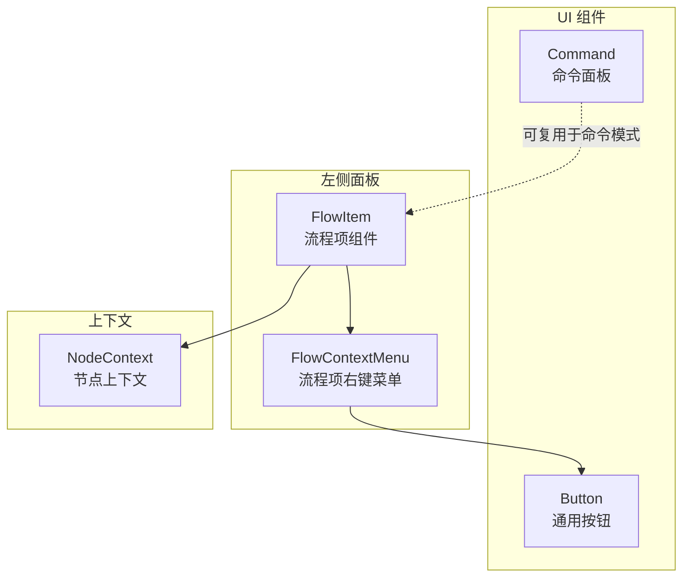
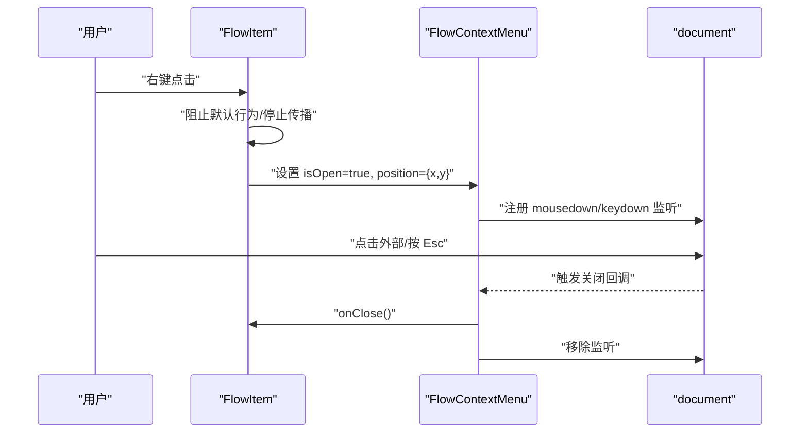
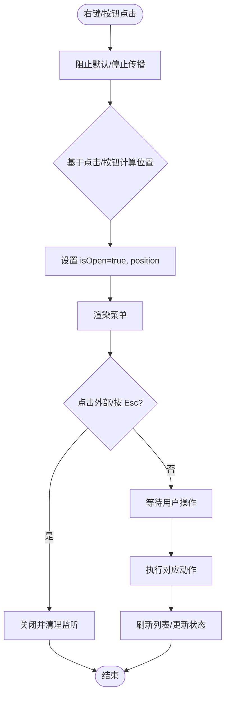
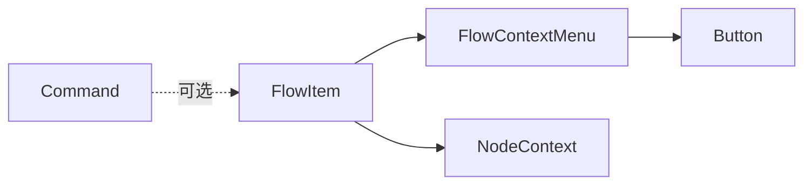

# 右键菜单与上下文操作

<cite>
**本文档引用的文件**
- [flow-context-menu.tsx](file://app/frontend/src/components/panels/left/flow-context-menu.tsx)
- [flow-item.tsx](file://app/frontend/src/components/panels/left/flow-item.tsx)
- [node-context.tsx](file://app/frontend/src/contexts/node-context.tsx)
- [button.tsx](file://app/frontend/src/components/ui/button.tsx)
- [command.tsx](file://app/frontend/src/components/ui/command.tsx)
- [flow-actions.tsx](file://app/frontend/src/components/panels/left/flow-actions.tsx)
- [flow-item-group.tsx](file://app/frontend/src/components/panels/left/flow-item-group.tsx)
</cite>

## 目录
1. [简介](#简介)
2. [项目结构](#项目结构)
3. [核心组件](#核心组件)
4. [架构总览](#架构总览)
5. [详细组件分析](#详细组件分析)
6. [依赖关系分析](#依赖关系分析)
7. [性能考虑](#性能考虑)
8. [故障排除指南](#故障排除指南)
9. [结论](#结论)

## 简介
本文件系统化梳理项目中“右键菜单与上下文操作”的实现与使用方式，覆盖以下主题：
- 触发机制：鼠标右键事件捕获与定位算法
- 层级管理：菜单层级、点击外部关闭、Esc 键处理
- 菜单类型：节点右键菜单、流程项菜单、空白区域菜单的行为差异
- 批量选择与多选：当前实现中的选择状态管理与扩展建议
- 权限控制与可用性：菜单项的可用性判断与动态生成策略
- 视觉与交互：图标设计、文本国际化、视觉反馈
- 无障碍访问：键盘导航、屏幕阅读器兼容与可访问性优化

## 项目结构
与右键菜单与上下文操作直接相关的核心文件位于前端侧的左侧面板与UI组件目录中，主要涉及：
- 流程项右键菜单组件与触发逻辑
- 菜单渲染与交互（按钮、命令面板等）
- 上下文状态（节点状态、模型选择等）与菜单行为的关系



图表来源
- [flow-item.tsx:1-201](file://app/frontend/src/components/panels/left/flow-item.tsx#L1-L201)
- [flow-context-menu.tsx:1-101](file://app/frontend/src/components/panels/left/flow-context-menu.tsx#L1-L101)
- [button.tsx:1-58](file://app/frontend/src/components/ui/button.tsx#L1-L58)
- [command.tsx:1-146](file://app/frontend/src/components/ui/command.tsx#L1-L146)
- [node-context.tsx:1-438](file://app/frontend/src/contexts/node-context.tsx#L1-L438)

章节来源
- [flow-item.tsx:1-201](file://app/frontend/src/components/panels/left/flow-item.tsx#L1-L201)
- [flow-context-menu.tsx:1-101](file://app/frontend/src/components/panels/left/flow-context-menu.tsx#L1-L101)
- [button.tsx:1-58](file://app/frontend/src/components/ui/button.tsx#L1-L58)
- [command.tsx:1-146](file://app/frontend/src/components/ui/command.tsx#L1-L146)
- [node-context.tsx:1-438](file://app/frontend/src/contexts/node-context.tsx#L1-L438)

## 核心组件
- 流程项右键菜单组件：负责渲染菜单、处理点击外部关闭、Esc 关闭、定位与动画展示
- 流程项组件：负责捕获右键事件、计算菜单定位、传递回调给菜单组件
- 通用按钮组件：为菜单项提供一致的样式与可访问性基元
- 命令面板组件：提供可扩展的命令入口，便于未来集成快捷命令或搜索式菜单
- 节点上下文：为节点状态、消息历史、模型选择等提供集中管理，影响菜单项的可用性与行为

章节来源
- [flow-context-menu.tsx:15-101](file://app/frontend/src/components/panels/left/flow-context-menu.tsx#L15-L101)
- [flow-item.tsx:26-65](file://app/frontend/src/components/panels/left/flow-item.tsx#L26-L65)
- [button.tsx:37-58](file://app/frontend/src/components/ui/button.tsx#L37-L58)
- [command.tsx:9-22](file://app/frontend/src/components/ui/command.tsx#L9-L22)
- [node-context.tsx:63-86](file://app/frontend/src/contexts/node-context.tsx#L63-L86)

## 架构总览
右键菜单的调用链路从“流程项”开始，通过事件回调将位置信息与回调函数传递给“右键菜单”组件；菜单组件在打开时注册全局事件监听（点击外部关闭、Esc 关闭），并在关闭时清理监听；菜单项通过通用按钮组件渲染，具备统一的样式与可访问性。



图表来源
- [flow-item.tsx:42-61](file://app/frontend/src/components/panels/left/flow-item.tsx#L42-L61)
- [flow-context-menu.tsx:25-47](file://app/frontend/src/components/panels/left/flow-context-menu.tsx#L25-L47)

## 详细组件分析

### 流程项右键菜单组件（FlowContextMenu）
- 渲染逻辑：根据 isOpen 决定是否渲染；position 控制左上角定位；使用最小宽度与阴影类保证视觉一致性
- 交互行为：点击外部区域或按 Esc 关闭；点击菜单项后先执行动作再关闭
- 菜单项：编辑、复制（克隆）、删除；使用通用按钮组件，具备统一的尺寸与变体
- 动画与层级：使用固定定位与 z-index，配合动画类实现淡入/缩放效果

```mermaid
classDiagram
class FlowContextMenu {
+isOpen : boolean
+position : {x : number, y : number}
+onClose() : void
+onEdit() : void
+onDuplicate() : void
+onDelete() : void
-handleAction(action) : void
}
class Button {
+variant : string
+size : string
+onClick() : void
}
FlowContextMenu --> Button : "使用"
```

图表来源
- [flow-context-menu.tsx:6-22](file://app/frontend/src/components/panels/left/flow-context-menu.tsx#L6-L22)
- [button.tsx:37-58](file://app/frontend/src/components/ui/button.tsx#L37-L58)

章节来源
- [flow-context-menu.tsx:15-101](file://app/frontend/src/components/panels/left/flow-context-menu.tsx#L15-L101)
- [button.tsx:37-58](file://app/frontend/src/components/ui/button.tsx#L37-L58)

### 流程项组件（FlowItem）与触发机制
- 事件处理：捕获右键事件，阻止默认行为与事件冒泡；记录鼠标坐标用于菜单定位
- 按钮触发：右侧“更多选项”按钮也可触发菜单，此时以按钮右上角为基准向左偏移一定距离
- 回调处理：将编辑、复制、删除等回调传递给菜单组件，并在菜单项点击后刷新列表
- 交互细节：按钮在悬停时显示，提升发现性



图表来源
- [flow-item.tsx:42-61](file://app/frontend/src/components/panels/left/flow-item.tsx#L42-L61)
- [flow-context-menu.tsx:25-47](file://app/frontend/src/components/panels/left/flow-context-menu.tsx#L25-L47)

章节来源
- [flow-item.tsx:26-65](file://app/frontend/src/components/panels/left/flow-item.tsx#L26-L65)
- [flow-item.tsx:171-181](file://app/frontend/src/components/panels/left/flow-item.tsx#L171-L181)

### 菜单类型与行为差异
- 节点右键菜单：当前仓库未提供节点级右键菜单组件，但可通过扩展在节点层添加同构的菜单组件与事件绑定
- 流程项菜单：已实现，支持编辑、复制、删除
- 空白区域菜单：当前未实现，可在画布空白处添加右键菜单，作为全局操作入口（如新建流程）

章节来源
- [flow-context-menu.tsx:15-101](file://app/frontend/src/components/panels/left/flow-context-menu.tsx#L15-L101)
- [flow-item.tsx:107-181](file://app/frontend/src/components/panels/left/flow-item.tsx#L107-L181)

### 批量选择、多选与选择状态管理
- 当前实现：流程项组件未内置多选状态管理；菜单项操作针对单个流程
- 扩展建议：
  - 引入选择上下文（如 useSelectionContext），维护选中集合与状态
  - 在列表容器层实现 Shift/Ctrl 多选与全选
  - 将菜单项的可用性与选择数量联动（例如“删除”仅在多选时启用）
  - 使用节点上下文的数据结构承载节点状态，确保跨流程隔离

章节来源
- [node-context.tsx:63-86](file://app/frontend/src/contexts/node-context.tsx#L63-L86)
- [flow-item-group.tsx:1-46](file://app/frontend/src/components/panels/left/flow-item-group.tsx#L1-L46)

### 权限控制、可用性判断与动态菜单生成
- 可用性判断：结合流程状态、连接状态、用户权限决定菜单项可见性（例如运行中流程禁用某些操作）
- 动态生成：根据上下文数据动态决定菜单项集合（如模板流程与普通流程的菜单差异）
- 与节点上下文联动：利用节点状态（如 IDLE/IN_PROGRESS/COMPLETE/ERROR）控制菜单项可用性

章节来源
- [flow-item.tsx:33-36](file://app/frontend/src/components/panels/left/flow-item.tsx#L33-L36)
- [node-context.tsx:98-163](file://app/frontend/src/contexts/node-context.tsx#L98-L163)

### 图标设计、文本国际化与视觉反馈
- 图标设计：使用 Lucide 图标库，菜单项采用 Edit/Copy/Trash2 等语义明确的图标
- 文本国际化：当前菜单文本为英文；建议引入 i18n 工具，将文案提取为键值对，支持多语言切换
- 视觉反馈：按钮变体与尺寸统一；菜单使用阴影与动画增强出现感；运行指示器与状态色提升可感知性

章节来源
- [flow-context-menu.tsx:69-97](file://app/frontend/src/components/panels/left/flow-context-menu.tsx#L69-L97)
- [flow-item.tsx:142-147](file://app/frontend/src/components/panels/left/flow-item.tsx#L142-L147)

### 键盘导航、屏幕阅读器兼容与无障碍访问
- 可访问性基元：通用按钮组件提供焦点可见性与可访问属性，适合菜单项复用
- 键盘支持：菜单组件监听 Esc 关闭；建议在菜单内支持 Tab 切换、Enter/Space 触发
- 屏幕阅读器：按钮具备标题属性；建议为菜单容器增加 role、aria-* 属性，明确菜单角色与状态

章节来源
- [button.tsx:7-35](file://app/frontend/src/components/ui/button.tsx#L7-L35)
- [flow-context-menu.tsx:32-36](file://app/frontend/src/components/panels/left/flow-context-menu.tsx#L32-L36)

## 依赖关系分析
- FlowItem 依赖 FlowContextMenu 进行渲染与交互
- FlowContextMenu 依赖通用 Button 组件以保持一致的交互体验
- FlowItem 与 NodeContext 协作，通过上下文状态影响菜单项可用性
- 命令面板组件可作为未来命令式入口，与现有菜单形成互补



图表来源
- [flow-item.tsx:15-16](file://app/frontend/src/components/panels/left/flow-item.tsx#L15-L16)
- [flow-context-menu.tsx:1-3](file://app/frontend/src/components/panels/left/flow-context-menu.tsx#L1-L3)
- [button.tsx:1-5](file://app/frontend/src/components/ui/button.tsx#L1-L5)
- [command.tsx:1-6](file://app/frontend/src/components/ui/command.tsx#L1-L6)
- [node-context.tsx:1-2](file://app/frontend/src/contexts/node-context.tsx#L1-L2)

章节来源
- [flow-item.tsx:15-16](file://app/frontend/src/components/panels/left/flow-item.tsx#L15-L16)
- [flow-context-menu.tsx:1-3](file://app/frontend/src/components/panels/left/flow-context-menu.tsx#L1-L3)
- [button.tsx:1-5](file://app/frontend/src/components/ui/button.tsx#L1-L5)
- [command.tsx:1-6](file://app/frontend/src/components/ui/command.tsx#L1-L6)
- [node-context.tsx:1-2](file://app/frontend/src/contexts/node-context.tsx#L1-L2)

## 性能考虑
- 事件监听：菜单打开时注册全局监听，关闭时及时清理，避免内存泄漏
- 渲染开销：菜单使用固定定位与最小宽度，减少重排；动画类应避免在低端设备上造成掉帧
- 数据流：菜单项回调尽量轻量，必要时异步处理（如复制/删除），并在完成后刷新视图

## 故障排除指南
- 菜单无法关闭
  - 检查是否正确传入 onClose 并在点击菜单项后调用
  - 确认 Esc 监听与点击外部监听已注册且未被覆盖
- 定位异常
  - 右键触发时检查事件坐标是否正确传入
  - 按钮触发时确认按钮边界与偏移计算
- 交互冲突
  - 确保在右键事件中阻止默认行为与事件冒泡
  - 避免与浏览器上下文菜单冲突

章节来源
- [flow-context-menu.tsx:25-47](file://app/frontend/src/components/panels/left/flow-context-menu.tsx#L25-L47)
- [flow-item.tsx:42-61](file://app/frontend/src/components/panels/left/flow-item.tsx#L42-L61)

## 结论
本项目在“流程项右键菜单”方面提供了清晰、可扩展的实现：事件触发、定位算法、层级管理与可访问性均有良好基础。建议后续在以下方向持续演进：
- 扩展节点级右键菜单与空白区域菜单
- 引入批量选择与多选状态管理
- 加强权限控制与动态菜单生成
- 完善国际化与无障碍访问细节
- 以命令面板组件为补充，提供更丰富的快捷操作入口