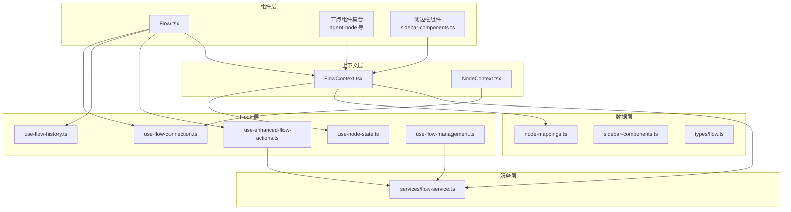
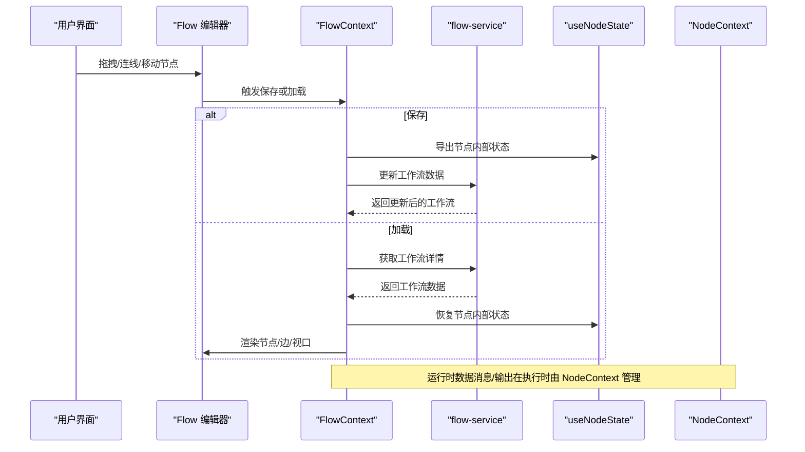
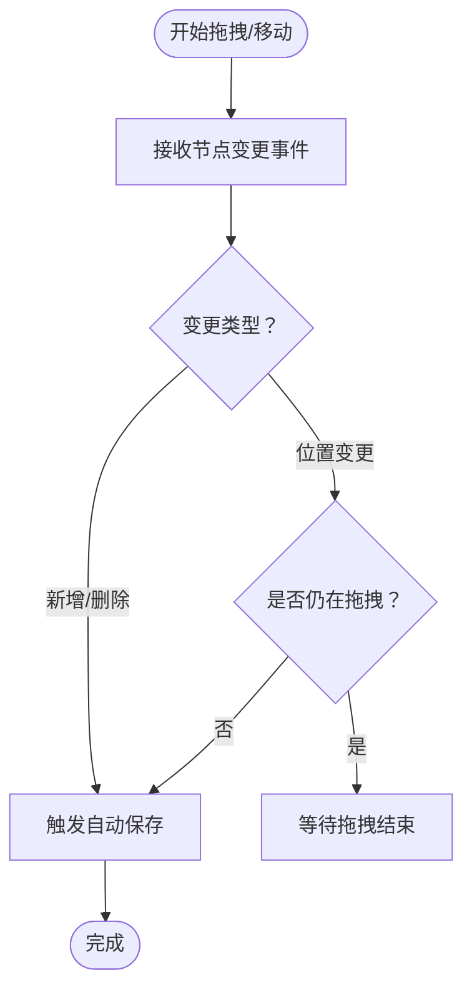
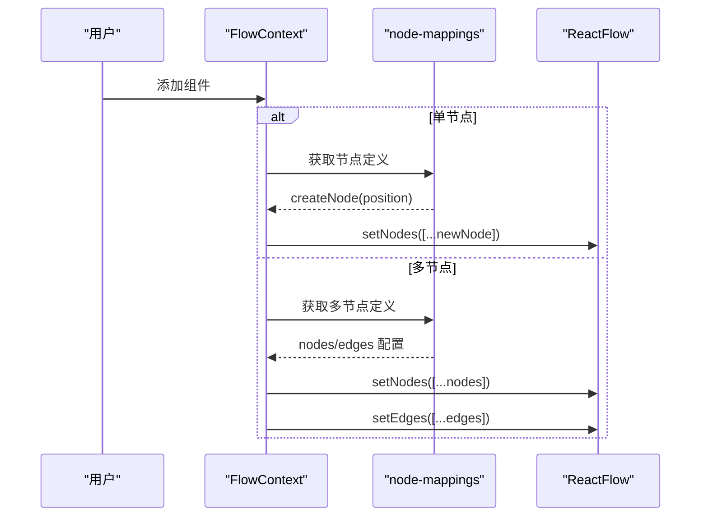
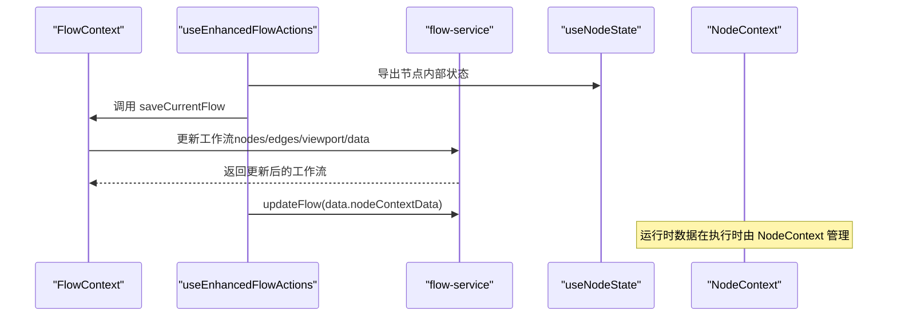
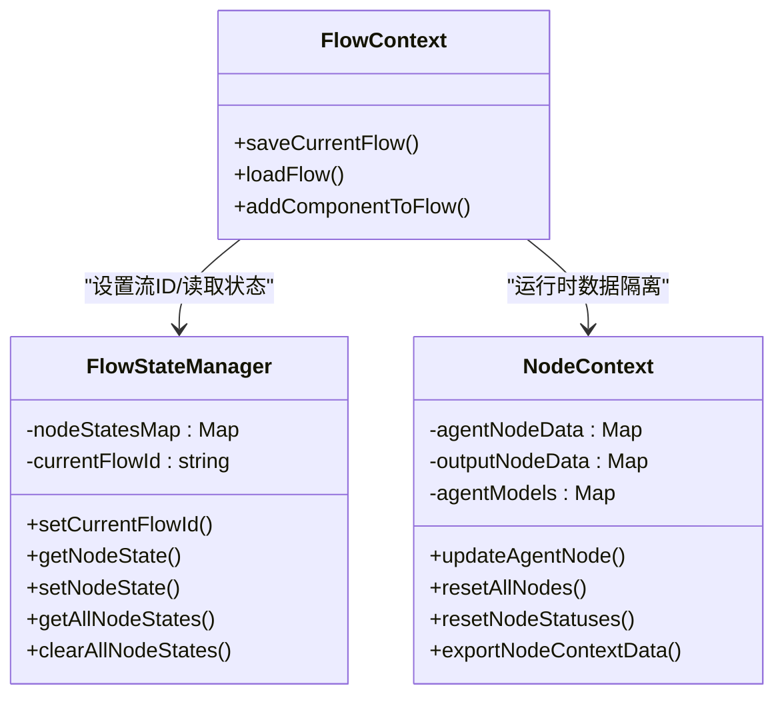
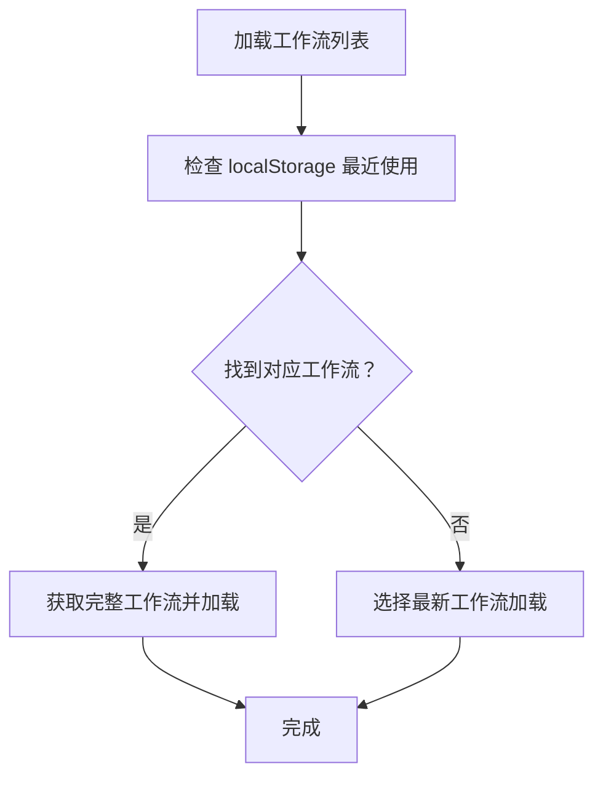
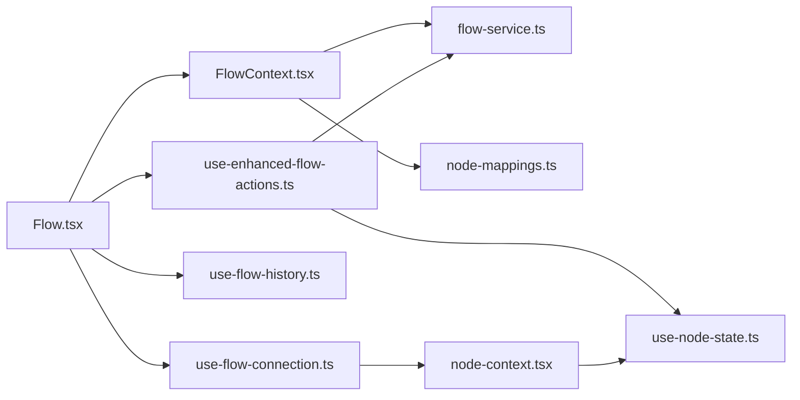

# 拖拽式工作流编辑器

<cite>
**本文档引用的文件**
- [Flow.tsx](file://app/frontend/src/components/Flow.tsx)
- [types.ts](file://app/frontend/src/nodes/types.ts)
- [index.ts](file://app/frontend/src/nodes/index.ts)
- [use-flow-connection.ts](file://app/frontend/src/hooks/use-flow-connection.ts)
- [flow-service.ts](file://app/frontend/src/services/flow-service.ts)
- [flow.ts](file://app/frontend/src/types/flow.ts)
- [use-enhanced-flow-actions.ts](file://app/frontend/src/hooks/use-enhanced-flow-actions.ts)
- [flow-context.tsx](file://app/frontend/src/contexts/flow-context.tsx)
- [use-flow-history.ts](file://app/frontend/src/hooks/use-flow-history.ts)
- [node-mappings.ts](file://app/frontend/src/data/node-mappings.ts)
- [node-context.tsx](file://app/frontend/src/contexts/node-context.tsx)
- [use-node-state.ts](file://app/frontend/src/hooks/use-node-state.ts)
- [utils.ts](file://app/frontend/src/nodes/utils.ts)
- [sidebar-components.ts](file://app/frontend/src/data/sidebar-components.ts)
- [use-flow-management.ts](file://app/frontend/src/hooks/use-flow-management.ts)
</cite>

## 目录
1. [简介](#简介)
2. [项目结构](#项目结构)
3. [核心组件](#核心组件)
4. [架构总览](#架构总览)
5. [详细组件分析](#详细组件分析)
6. [依赖关系分析](#依赖关系分析)
7. [性能考虑](#性能考虑)
8. [故障排除指南](#故障排除指南)
9. [结论](#结论)
10. [附录](#附录)

## 简介
本项目实现了一个基于 React Flow 的拖拽式工作流编辑器，支持节点拖拽、连接线绘制、自动保存与历史回退、节点状态持久化与运行时数据隔离、工作流模板与最近使用记录、以及视口缩放与布局重置等交互能力。编辑器通过上下文与自定义 Hook 将 React Flow 的可视化编辑与后端服务、节点状态管理、运行时数据隔离有机结合，形成完整的端到端工作流生命周期管理。

## 项目结构
前端采用模块化组织，围绕“上下文-Hook-组件-服务”的分层设计：
- 组件层：Flow 编辑器主容器、节点组件、侧边栏面板等
- 上下文层：FlowContext（工作流操作）、NodeContext（节点运行时数据）
- Hook 层：useFlowContext、useNodeState、useFlowHistory、useFlowConnection 等
- 数据层：节点类型映射、侧边栏组件分组、工作流服务接口
- 类型层：Flow 接口、节点类型定义

图表来源
- [Flow.tsx:1-313](file://app/frontend/src/components/Flow.tsx#L1-L313)
- [flow-context.tsx:1-358](file://app/frontend/src/contexts/flow-context.tsx#L1-L358)
- [use-enhanced-flow-actions.ts:1-112](file://app/frontend/src/hooks/use-enhanced-flow-actions.ts#L1-L112)
- [use-flow-history.ts:1-171](file://app/frontend/src/hooks/use-flow-history.ts#L1-L171)
- [use-flow-connection.ts:1-268](file://app/frontend/src/hooks/use-flow-connection.ts#L1-L268)
- [use-node-state.ts:1-268](file://app/frontend/src/hooks/use-node-state.ts#L1-L268)
- [flow-service.ts:1-108](file://app/frontend/src/services/flow-service.ts#L1-L108)
- [node-mappings.ts:1-140](file://app/frontend/src/data/node-mappings.ts#L1-L140)
- [sidebar-components.ts:1-74](file://app/frontend/src/data/sidebar-components.ts#L1-L74)
- [flow.ts:1-13](file://app/frontend/src/types/flow.ts#L1-L13)

章节来源
- [Flow.tsx:1-313](file://app/frontend/src/components/Flow.tsx#L1-L313)
- [flow-context.tsx:1-358](file://app/frontend/src/contexts/flow-context.tsx#L1-L358)

## 核心组件
- Flow 编辑器容器：封装 ReactFlow 实例、主题适配、自动保存、历史快照、键盘快捷键、背景网格等
- 节点类型系统：统一的 AppNode 类型与各节点组件注册，支持初始节点与初始连线
- 工作流上下文：负责节点添加、保存/加载、视口控制、多节点组合导入
- 节点状态管理：useNodeState 提供节点级状态持久化与跨流隔离；NodeContext 管理运行时消息与输出数据
- 连接状态管理：useFlowConnection 统一管理运行中连接、停止与恢复
- 历史管理：useFlowHistory 提供撤销/重做与快照去重
- 服务接口：flow-service 提供 CRUD、复制、默认工作流创建

章节来源
- [Flow.tsx:34-313](file://app/frontend/src/components/Flow.tsx#L34-L313)
- [types.ts:1-13](file://app/frontend/src/nodes/types.ts#L1-L13)
- [index.ts:1-60](file://app/frontend/src/nodes/index.ts#L1-L60)
- [flow-context.tsx:74-214](file://app/frontend/src/contexts/flow-context.tsx#L74-L214)
- [use-node-state.ts:147-180](file://app/frontend/src/hooks/use-node-state.ts#L147-L180)
- [node-context.tsx:63-86](file://app/frontend/src/contexts/node-context.tsx#L63-L86)
- [use-flow-connection.ts:80-250](file://app/frontend/src/hooks/use-flow-connection.ts#L80-L250)
- [use-flow-history.ts:15-171](file://app/frontend/src/hooks/use-flow-history.ts#L15-L171)
- [flow-service.ts:27-108](file://app/frontend/src/services/flow-service.ts#L27-L108)

## 架构总览
编辑器以 FlowContext 为核心协调 React Flow 与后端服务，结合 useEnhancedFlowActions 在保存/加载时同步“配置状态”（useNodeState）与“运行时数据”（NodeContext）。运行时通过 useFlowConnection 管理连接生命周期，并在停止时仅重置处理状态而不丢失历史结果。

图表来源
- [flow-context.tsx:74-188](file://app/frontend/src/contexts/flow-context.tsx#L74-L188)
- [use-enhanced-flow-actions.ts:20-112](file://app/frontend/src/hooks/use-enhanced-flow-actions.ts#L20-L112)
- [flow-service.ts:27-108](file://app/frontend/src/services/flow-service.ts#L27-L108)
- [use-node-state.ts:134-180](file://app/frontend/src/hooks/use-node-state.ts#L134-L180)
- [node-context.tsx:90-438](file://app/frontend/src/contexts/node-context.tsx#L90-L438)

## 详细组件分析

### React Flow 集成与拖拽/连线/碰撞检测
- 拖拽与位置变更：Flow 使用 useNodesState 管理节点，handleNodesChange 对新增、删除、位置变更进行响应；仅在拖拽结束的位置变更触发自动保存，避免频繁写入
- 连接线绘制：onConnect 创建带箭头标记的新边并立即持久化，确保连接结构变更即时落库
- 碰撞检测：未实现专用碰撞检测算法；路径选择与连通性检查通过 getNodesInCompletePaths 基于图遍历实现，用于高亮路径节点

图表来源
- [Flow.tsx:92-120](file://app/frontend/src/components/Flow.tsx#L92-L120)

章节来源
- [Flow.tsx:92-143](file://app/frontend/src/components/Flow.tsx#L92-L143)
- [utils.ts:28-81](file://app/frontend/src/nodes/utils.ts#L28-L81)

### 节点类型系统与节点创建/删除/编辑
- 节点类型定义：AppNode 聚合多种内置节点类型；nodeTypes 注册各节点组件
- 单节点创建：addComponentToFlow -> addSingleNodeToFlow，从 node-mappings 解析节点定义，计算视口中心位置后创建节点
- 多节点组合：addMultipleNodesToFlow 支持多节点组，自动计算组的边界并居中放置，生成内部边
- 删除与编辑：通过 React Flow 的 setNodes/setEdges 与 onNodesChange/onEdgesChange 事件驱动；删除边触发自动保存

图表来源
- [flow-context.tsx:216-340](file://app/frontend/src/contexts/flow-context.tsx#L216-L340)
- [node-mappings.ts:85-121](file://app/frontend/src/data/node-mappings.ts#L85-L121)
- [index.ts:52-60](file://app/frontend/src/nodes/index.ts#L52-L60)

章节来源
- [flow-context.tsx:216-340](file://app/frontend/src/contexts/flow-context.tsx#L216-L340)
- [node-mappings.ts:85-121](file://app/frontend/src/data/node-mappings.ts#L85-L121)
- [index.ts:14-51](file://app/frontend/src/nodes/index.ts#L14-L51)

### 连接规则与验证逻辑
- 连接规则：通过 React Flow 的 onConnect 自动为新边添加箭头标记；多节点导入时根据定义生成内部边
- 验证逻辑：未实现显式的连接约束（如端口类型匹配）；路径完整性检查通过 getNodesInCompletePaths 基于图遍历实现，用于 UI 高亮而非运行时强制约束

章节来源
- [Flow.tsx:240-278](file://app/frontend/src/components/Flow.tsx#L240-L278)
- [flow-context.tsx:299-327](file://app/frontend/src/contexts/flow-context.tsx#L299-L327)
- [utils.ts:28-81](file://app/frontend/src/nodes/utils.ts#L28-L81)

### 工作流保存、加载与序列化
- 保存流程：saveCurrentFlowWithCompleteState 先导出 useNodeState 内部状态，再调用基础 saveCurrentFlow 并通过 flow-service.updateFlow 同步 NodeContext 运行时数据
- 加载流程：loadFlowWithCompleteState 设置当前流 ID，渲染节点/边/视口，恢复每个节点的内部状态；不恢复 NodeContext 的运行时数据，保证每次运行从干净状态开始
- 序列化字段：nodes、edges、viewport、data（包含 nodeStates 与 nodeContextData）

图表来源
- [use-enhanced-flow-actions.ts:20-112](file://app/frontend/src/hooks/use-enhanced-flow-actions.ts#L20-L112)
- [flow-context.tsx:74-131](file://app/frontend/src/contexts/flow-context.tsx#L74-L131)
- [flow-service.ts:27-108](file://app/frontend/src/services/flow-service.ts#L27-L108)

章节来源
- [use-enhanced-flow-actions.ts:20-112](file://app/frontend/src/hooks/use-enhanced-flow-actions.ts#L20-L112)
- [flow-context.tsx:74-188](file://app/frontend/src/contexts/flow-context.tsx#L74-L188)
- [flow-service.ts:27-108](file://app/frontend/src/services/flow-service.ts#L27-L108)

### 节点状态管理、内部状态持久化与运行时数据隔离
- 内部状态持久化：useNodeState 以“流ID:节点ID:状态键”复合键存储节点内部状态，支持跨流隔离与跨保存恢复
- 运行时数据隔离：NodeContext 以复合键存储代理节点消息、输出数据与模型选择，支持按流清理与恢复
- 执行控制：useFlowConnection 管理连接状态、停止与恢复，停止时仅重置处理状态，保留历史结果

图表来源
- [use-node-state.ts:7-132](file://app/frontend/src/hooks/use-node-state.ts#L7-L132)
- [node-context.tsx:90-438](file://app/frontend/src/contexts/node-context.tsx#L90-L438)
- [flow-context.tsx:74-188](file://app/frontend/src/contexts/flow-context.tsx#L74-L188)

章节来源
- [use-node-state.ts:147-180](file://app/frontend/src/hooks/use-node-state.ts#L147-L180)
- [node-context.tsx:90-438](file://app/frontend/src/contexts/node-context.tsx#L90-L438)
- [flow-context.tsx:134-188](file://app/frontend/src/contexts/flow-context.tsx#L134-L188)

### 工作流模板系统、最近使用记录与搜索过滤
- 模板系统：Flow 接口包含 is_template 字段；模板与普通工作流在 UI 中分组展示
- 最近使用：localStorage 记录 lastSelectedFlowId，加载时优先恢复该工作流
- 搜索过滤：useFlowManagement 基于名称、描述、标签进行过滤，按更新时间排序并分组显示

图表来源
- [use-flow-management.ts:167-212](file://app/frontend/src/hooks/use-flow-management.ts#L167-L212)
- [flow.ts:1-13](file://app/frontend/src/types/flow.ts#L1-L13)

章节来源
- [use-flow-management.ts:219-236](file://app/frontend/src/hooks/use-flow-management.ts#L219-L236)
- [flow.ts:1-13](file://app/frontend/src/types/flow.ts#L1-L13)

### 视口缩放、平移与布局重置
- 视口中心计算：getViewportPosition 基于当前 zoom 与偏移计算画布中心位置，可选加入随机偏移
- 布局重置：fitView 自动适配节点范围；首次渲染或无视口数据时自动居中
- 缩放与平移：React Flow 提供原生交互，Flow 组件通过 getViewport/setViewport 控制视口

章节来源
- [flow-context.tsx:41-67](file://app/frontend/src/contexts/flow-context.tsx#L41-L67)
- [flow-context.tsx:161-168](file://app/frontend/src/contexts/flow-context.tsx#L161-L168)

## 依赖关系分析
- Flow.tsx 依赖 FlowContext、useEnhancedFlowActions、useFlowHistory、useFlowConnection、node-types、edge-types
- FlowContext 依赖 flow-service、node-mappings、use-node-state、React Flow
- useEnhancedFlowActions 依赖 FlowContext、NodeContext、flow-service
- NodeContext 与 useNodeState 双向协作，前者管理运行时数据，后者管理配置状态
- useFlowConnection 依赖 NodeContext 与 API 服务，统一管理连接生命周期

图表来源
- [Flow.tsx:1-313](file://app/frontend/src/components/Flow.tsx#L1-L313)
- [flow-context.tsx:1-358](file://app/frontend/src/contexts/flow-context.tsx#L1-L358)
- [use-enhanced-flow-actions.ts:1-112](file://app/frontend/src/hooks/use-enhanced-flow-actions.ts#L1-L112)
- [use-flow-history.ts:1-171](file://app/frontend/src/hooks/use-flow-history.ts#L1-L171)
- [use-flow-connection.ts:1-268](file://app/frontend/src/hooks/use-flow-connection.ts#L1-L268)
- [flow-service.ts:1-108](file://app/frontend/src/services/flow-service.ts#L1-L108)
- [node-mappings.ts:1-140](file://app/frontend/src/data/node-mappings.ts#L1-L140)
- [use-node-state.ts:1-268](file://app/frontend/src/hooks/use-node-state.ts#L1-L268)
- [node-context.tsx:1-438](file://app/frontend/src/contexts/node-context.tsx#L1-L438)

## 性能考虑
- 自动保存节流：节点位置变更与边删除触发自动保存，采用防抖策略减少写入频率
- 快照去重：useFlowHistory 在撤销/重做过程中跳过仅 UI 属性变化的重复快照
- 状态隔离：useNodeState 与 NodeContext 通过复合键实现流内隔离，避免全局状态污染
- 初始渲染优化：首次加载时延迟 fitView，确保节点渲染后再调整视口

## 故障排除指南
- 保存失败：检查网络请求与 flow-service 返回值；确认当前流 ID 是否正确传递
- 自动保存未触发：确认 handleNodesChange/handleEdgesChange 的变更类型判断逻辑
- 运行状态异常：使用 useFlowConnection.recoverFlowState 检测并恢复过期连接状态
- 节点状态不同步：确认 useNodeState.setCurrentFlowId 是否在加载前设置，以及 loadFlowWithCompleteState 是否正确恢复内部状态

章节来源
- [Flow.tsx:57-89](file://app/frontend/src/components/Flow.tsx#L57-L89)
- [use-flow-history.ts:72-113](file://app/frontend/src/hooks/use-flow-history.ts#L72-L113)
- [use-flow-connection.ts:213-232](file://app/frontend/src/hooks/use-flow-connection.ts#L213-L232)
- [use-enhanced-flow-actions.ts:74-106](file://app/frontend/src/hooks/use-enhanced-flow-actions.ts#L74-L106)

## 结论
该拖拽式工作流编辑器通过清晰的上下文与 Hook 分层，将 React Flow 的可视化编辑能力与后端持久化、节点状态管理、运行时数据隔离有效整合。其自动保存、历史回退、模板与最近使用记录等功能提升了用户体验；节点类型系统与多节点组合导入简化了复杂工作流的构建。未来可在连接规则与碰撞检测方面引入更严格的约束与可视化反馈，进一步提升编辑体验与运行安全性。

## 附录
- API 定义摘要
  - 获取工作流列表：GET /flows/
  - 获取工作流详情：GET /flows/:id
  - 创建工作流：POST /flows/
  - 更新工作流：PUT /flows/:id
  - 删除工作流：DELETE /flows/:id
  - 复制工作流：POST /flows/:id/duplicate

章节来源
- [flow-service.ts:27-108](file://app/frontend/src/services/flow-service.ts#L27-L108)