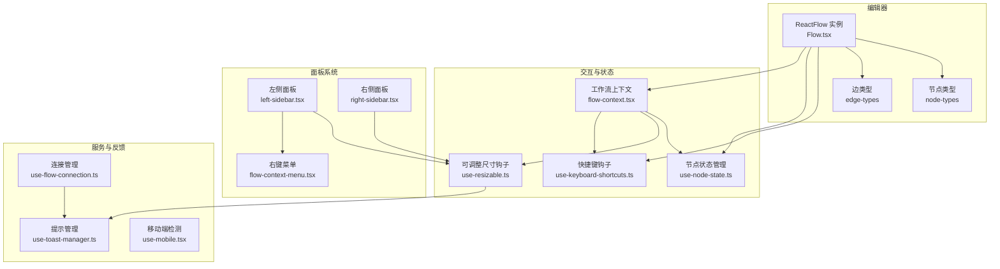
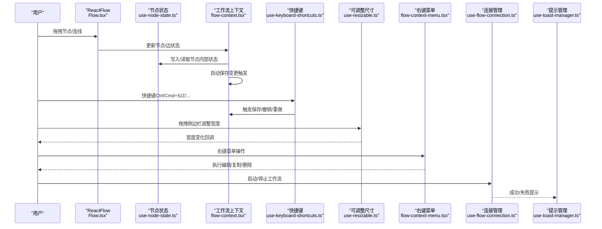
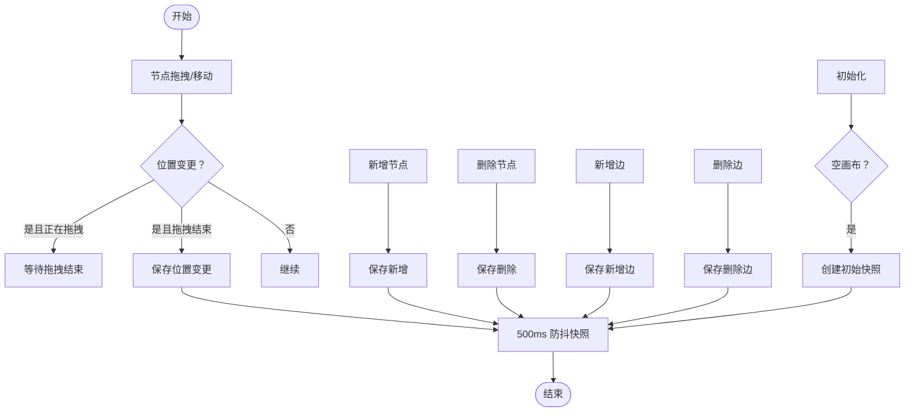
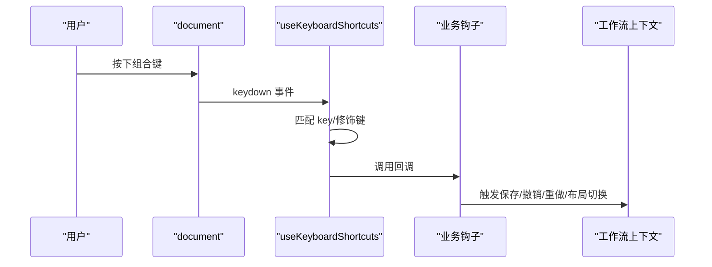
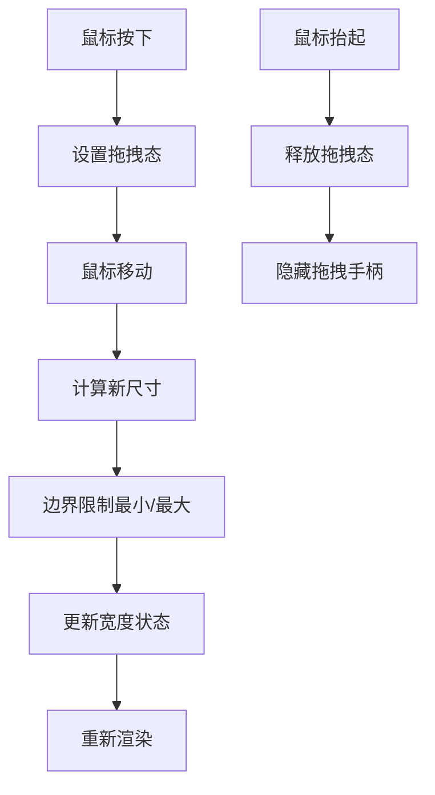
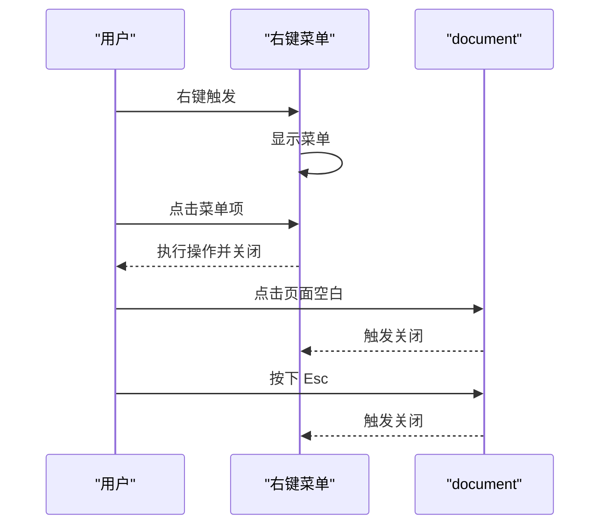
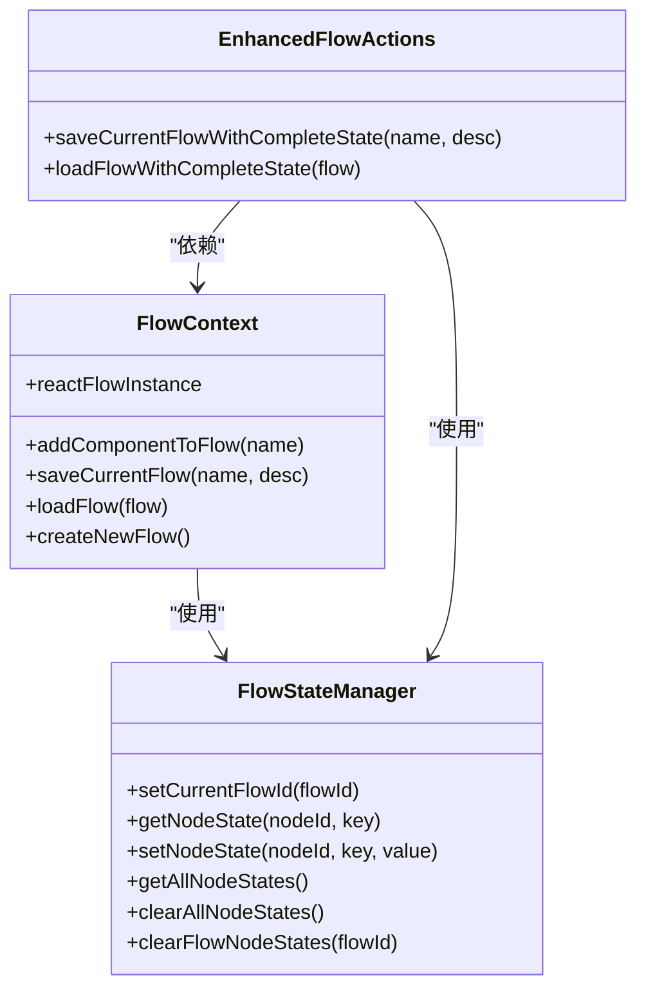
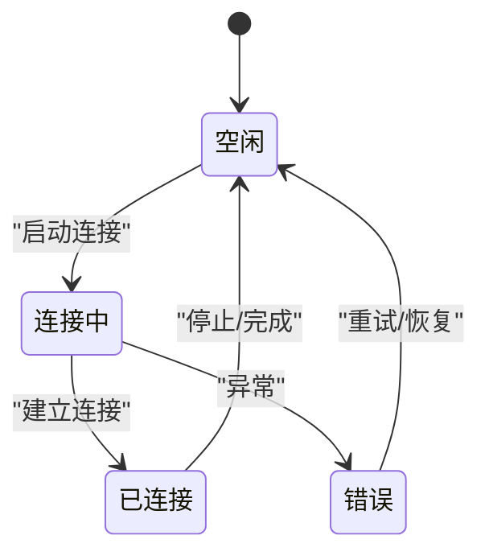
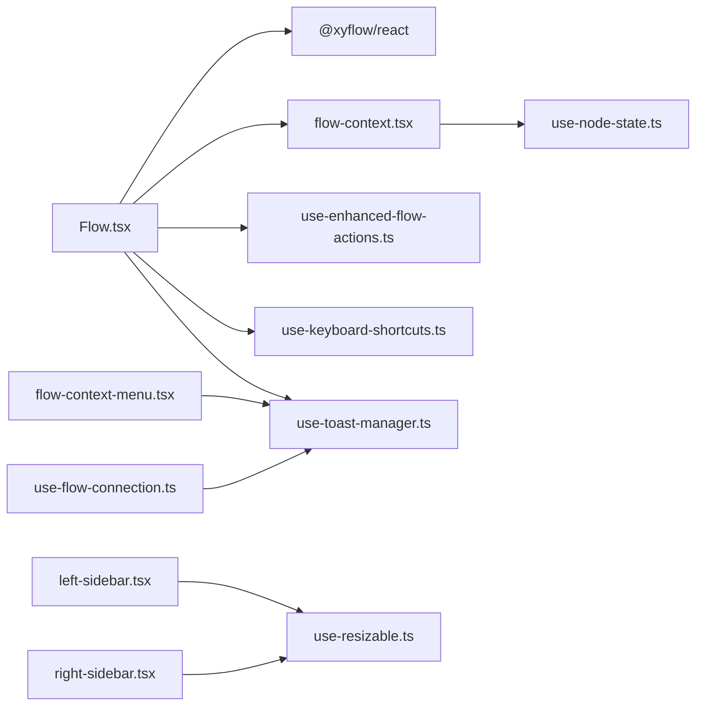

# 用户交互

<cite>
**本文引用的文件**
- [Flow.tsx](file://app/frontend/src/components/Flow.tsx)
- [use-keyboard-shortcuts.ts](file://app/frontend/src/hooks/use-keyboard-shortcuts.ts)
- [use-flow-connection.ts](file://app/frontend/src/hooks/use-flow-connection.ts)
- [use-resizable.ts](file://app/frontend/src/hooks/use-resizable.ts)
- [use-mobile.tsx](file://app/frontend/src/hooks/use-mobile.tsx)
- [left-sidebar.tsx](file://app/frontend/src/components/panels/left/left-sidebar.tsx)
- [right-sidebar.tsx](file://app/frontend/src/components/panels/right/right-sidebar.tsx)
- [flow-context-menu.tsx](file://app/frontend/src/components/panels/left/flow-context-menu.tsx)
- [resizable.tsx](file://app/frontend/src/components/ui/resizable.tsx)
- [flow-context.tsx](file://app/frontend/src/contexts/flow-context.tsx)
- [use-enhanced-flow-actions.ts](file://app/frontend/src/hooks/use-enhanced-flow-actions.ts)
- [use-flow-management-tabs.ts](file://app/frontend/src/hooks/use-flow-management-tabs.ts)
- [use-toast-manager.ts](file://app/frontend/src/hooks/use-toast-manager.ts)
- [use-node-state.ts](file://app/frontend/src/hooks/use-node-state.ts)
</cite>

## 目录
1. [简介](#简介)
2. [项目结构](#项目结构)
3. [核心组件](#核心组件)
4. [架构总览](#架构总览)
5. [详细组件分析](#详细组件分析)
6. [依赖关系分析](#依赖关系分析)
7. [性能考量](#性能考量)
8. [故障排查指南](#故障排查指南)
9. [结论](#结论)
10. [附录](#附录)

## 简介
本文件系统性梳理前端用户交互功能，围绕拖拽式工作流编辑器（基于 React Flow）展开，涵盖节点拖拽、连接线绘制与自动保存、键盘快捷键注册与处理、面板可调整大小与折叠展开、右键菜单与上下文操作、批量选择能力、触摸设备适配与手势识别、以及用户体验优化与错误处理策略。目标是帮助开发者快速理解并扩展交互层功能。

## 项目结构
前端交互相关代码主要集中在以下模块：
- 编辑器与画布：Flow.tsx 使用 @xyflow/react 提供的 ReactFlow 组件承载节点与边，配合自定义节点类型与边类型渲染。
- 面板系统：左右侧边栏支持拖拽调整宽度；底部面板在现有结构中未发现对应文件，但可按相同模式扩展。
- 键盘快捷键：统一的快捷键钩子，支持跨平台（Ctrl/Cmd）组合键。
- 连接状态管理：全局连接管理器用于跟踪运行中的工作流连接状态。
- 状态持久化：节点内部状态与节点上下文数据分离持久化，确保配置与运行时数据正确恢复。
- 反馈与提示：基于 Sonner 的 Toast 管理器，提供去重与位置控制。

图表来源
- [Flow.tsx:290-310](file://app/frontend/src/components/Flow.tsx#L290-L310)
- [use-keyboard-shortcuts.ts:17-50](file://app/frontend/src/hooks/use-keyboard-shortcuts.ts#L17-L50)
- [use-resizable.ts:13-93](file://app/frontend/src/hooks/use-resizable.ts#L13-L93)
- [left-sidebar.tsx:21-32](file://app/frontend/src/components/panels/left/left-sidebar.tsx#L21-L32)
- [right-sidebar.tsx:22-32](file://app/frontend/src/components/panels/right/right-sidebar.tsx#L22-L32)
- [flow-context-menu.tsx:15-47](file://app/frontend/src/components/panels/left/flow-context-menu.tsx#L15-L47)
- [use-flow-connection.ts:80-250](file://app/frontend/src/hooks/use-flow-connection.ts#L80-L250)
- [use-toast-manager.ts:42-144](file://app/frontend/src/hooks/use-toast-manager.ts#L42-L144)
- [use-mobile.tsx:5-19](file://app/frontend/src/hooks/use-mobile.tsx#L5-L19)

章节来源
- [Flow.tsx:34-313](file://app/frontend/src/components/Flow.tsx#L34-L313)
- [use-keyboard-shortcuts.ts:17-165](file://app/frontend/src/hooks/use-keyboard-shortcuts.ts#L17-L165)
- [use-resizable.ts:13-93](file://app/frontend/src/hooks/use-resizable.ts#L13-L93)
- [left-sidebar.tsx:17-101](file://app/frontend/src/components/panels/left/left-sidebar.tsx#L17-L101)
- [right-sidebar.tsx:17-97](file://app/frontend/src/components/panels/right/right-sidebar.tsx#L17-L97)
- [flow-context-menu.tsx:15-101](file://app/frontend/src/components/panels/left/flow-context-menu.tsx#L15-L101)
- [use-flow-connection.ts:80-250](file://app/frontend/src/hooks/use-flow-connection.ts#L80-L250)
- [use-toast-manager.ts:42-144](file://app/frontend/src/hooks/use-toast-manager.ts#L42-L144)
- [use-mobile.tsx:5-19](file://app/frontend/src/hooks/use-mobile.tsx#L5-L19)

## 核心组件
- 拖拽式工作流编辑器：基于 React Flow，提供节点增删改、连线、视口缩放与主题背景。
- 键盘快捷键系统：统一注册与匹配逻辑，支持跨平台（Ctrl/Cmd）组合键。
- 面板系统：左右侧边栏支持拖拽调整宽度，具备最小/最大宽度约束与拖拽态反馈。
- 右键菜单：点击外部或按 Esc 关闭，提供编辑、复制、删除等上下文操作。
- 节点状态管理：节点内部状态与节点上下文数据分离持久化，支持跨流程隔离。
- 连接状态管理：全局连接管理器跟踪运行中工作流的连接状态，支持停止与恢复。
- 反馈与提示：Toast 管理器提供成功/失败/信息/警告提示，并支持去重与位置控制。

章节来源
- [Flow.tsx:34-313](file://app/frontend/src/components/Flow.tsx#L34-L313)
- [use-keyboard-shortcuts.ts:17-165](file://app/frontend/src/hooks/use-keyboard-shortcuts.ts#L17-L165)
- [use-resizable.ts:13-93](file://app/frontend/src/hooks/use-resizable.ts#L13-L93)
- [flow-context-menu.tsx:15-101](file://app/frontend/src/components/panels/left/flow-context-menu.tsx#L15-L101)
- [use-node-state.ts:7-132](file://app/frontend/src/hooks/use-node-state.ts#L7-L132)
- [use-flow-connection.ts:80-250](file://app/frontend/src/hooks/use-flow-connection.ts#L80-L250)
- [use-toast-manager.ts:42-144](file://app/frontend/src/hooks/use-toast-manager.ts#L42-L144)

## 架构总览
下图展示用户交互的关键路径：从编辑器到状态持久化，再到快捷键与面板联动，以及运行时连接状态管理与反馈提示。

图表来源
- [Flow.tsx:92-143](file://app/frontend/src/components/Flow.tsx#L92-L143)
- [use-keyboard-shortcuts.ts:53-65](file://app/frontend/src/hooks/use-keyboard-shortcuts.ts#L53-L65)
- [use-resizable.ts:29-76](file://app/frontend/src/hooks/use-resizable.ts#L29-L76)
- [flow-context-menu.tsx:51-54](file://app/frontend/src/components/panels/left/flow-context-menu.tsx#L51-L54)
- [use-flow-connection.ts:115-211](file://app/frontend/src/hooks/use-flow-connection.ts#L115-L211)
- [use-toast-manager.ts:120-134](file://app/frontend/src/hooks/use-toast-manager.ts#L120-L134)

## 详细组件分析

### 拖拽式工作流编辑器（节点拖拽、连接线绘制与自动保存）
- 节点与边状态管理：通过 useNodesState 与 useEdgesState 管理节点与边列表，onNodesChange/onEdgesChange 增强处理以决定是否触发自动保存。
- 连接线绘制：onConnect 接收 Connection 并生成带箭头标记的新边，立即触发一次即时保存以保证结构变更持久化。
- 自动保存策略：
  - 节点新增/移除：立即保存
  - 节点位置变更：仅在拖拽结束时保存，避免频繁写入
  - 边移除：立即保存
  - 初始化后首次空画布快照：takeSnapshot
  - 变更后 500ms 防抖快照：历史记录与回滚
- 主题与背景：根据当前主题设置颜色模式与网格背景，提升可读性。

图表来源
- [Flow.tsx:92-143](file://app/frontend/src/components/Flow.tsx#L92-L143)
- [Flow.tsx:162-178](file://app/frontend/src/components/Flow.tsx#L162-L178)
- [Flow.tsx:240-278](file://app/frontend/src/components/Flow.tsx#L240-L278)

章节来源
- [Flow.tsx:92-143](file://app/frontend/src/components/Flow.tsx#L92-L143)
- [Flow.tsx:162-178](file://app/frontend/src/components/Flow.tsx#L162-L178)
- [Flow.tsx:240-278](file://app/frontend/src/components/Flow.tsx#L240-L278)

### 键盘快捷键系统（注册与处理）
- 注册机制：useKeyboardShortcuts 接收一组快捷键配置，监听 document 的 keydown 事件，逐条匹配 key、修饰键（ctrl/meta/shift/alt）与大小写无关的按键名。
- 特殊处理：
  - 保存快捷键（S）同时匹配 Ctrl+S 与 Cmd+S（通过逻辑合并）。
  - 统一支持 Ctrl/Cmd 组合键，便于跨平台使用。
  - 可选 preventDefault 控制是否阻止默认行为。
- 便捷钩子：
  - useFlowKeyboardShortcuts：绑定保存快捷键。
  - useLayoutKeyboardShortcuts：绑定侧边栏切换、视图适配、撤销/重做、底部面板开关、打开设置等常用布局快捷键。

图表来源
- [use-keyboard-shortcuts.ts:18-49](file://app/frontend/src/hooks/use-keyboard-shortcuts.ts#L18-L49)
- [use-keyboard-shortcuts.ts:53-65](file://app/frontend/src/hooks/use-keyboard-shortcuts.ts#L53-L65)
- [use-keyboard-shortcuts.ts:68-164](file://app/frontend/src/hooks/use-keyboard-shortcuts.ts#L68-L164)

章节来源
- [use-keyboard-shortcuts.ts:17-165](file://app/frontend/src/hooks/use-keyboard-shortcuts.ts#L17-L165)

### 面板系统（可调整大小、折叠展开与布局管理）
- 左右侧面板均使用 use-resizable 钩子实现拖拽调整宽度：
  - 支持最小/最大宽度限制与默认尺寸。
  - 拖拽方向区分（左侧边栏向右拖拽增加宽度；右侧边栏向左拖拽减少宽度）。
  - 拖拽过程中隐藏拖拽手柄，拖拽结束后恢复，提供视觉反馈。
  - 通过 onWidthChange 回调通知父组件宽度变化，便于整体布局同步。
- 折叠展开：面板组件接收 isCollapsed 与 onCollapse/onExpand 回调，由父级布局控制显示/隐藏。
- 底部面板：当前仓库未发现对应文件，可参考左右侧边栏模式进行扩展。

图表来源
- [use-resizable.ts:29-76](file://app/frontend/src/hooks/use-resizable.ts#L29-L76)
- [left-sidebar.tsx:21-32](file://app/frontend/src/components/panels/left/left-sidebar.tsx#L21-L32)
- [right-sidebar.tsx:22-32](file://app/frontend/src/components/panels/right/right-sidebar.tsx#L22-L32)

章节来源
- [use-resizable.ts:13-93](file://app/frontend/src/hooks/use-resizable.ts#L13-L93)
- [left-sidebar.tsx:17-101](file://app/frontend/src/components/panels/left/left-sidebar.tsx#L17-L101)
- [right-sidebar.tsx:17-97](file://app/frontend/src/components/panels/right/right-sidebar.tsx#L17-L97)

### 右键菜单、上下文操作与批量选择
- 右键菜单：flow-context-menu.tsx 提供编辑、复制、删除三项操作，支持点击外部区域或按 Esc 关闭。
- 上下文操作：菜单项点击后执行相应回调并关闭菜单，保持交互一致性。
- 批量选择：当前仓库未发现批量选择实现，可在节点选择与多选逻辑基础上扩展（例如按住 Shift 多选、框选等），需结合 React Flow 的 selection 功能与节点状态管理。

图表来源
- [flow-context-menu.tsx:25-47](file://app/frontend/src/components/panels/left/flow-context-menu.tsx#L25-L47)
- [flow-context-menu.tsx:51-54](file://app/frontend/src/components/panels/left/flow-context-menu.tsx#L51-L54)

章节来源
- [flow-context-menu.tsx:15-101](file://app/frontend/src/components/panels/left/flow-context-menu.tsx#L15-L101)

### 触摸设备适配与手势识别
- 移动端检测：use-mobile.tsx 提供窗口断点判断，返回布尔值表示是否为移动端。
- 适配建议：
  - 触摸拖拽：在 React Flow 中启用 touch 事件支持，或在移动端使用指针事件 polyfill。
  - 手势识别：可引入 Hammer.js 或 Gesture Events API，实现双指缩放、滑动切换面板等。
  - 触控反馈：增大点击热区、延迟触发与防抖，避免误触。
  - 当前仓库未发现触摸相关实现，建议在 Flow.tsx 或面板组件中扩展。

章节来源
- [use-mobile.tsx:5-19](file://app/frontend/src/hooks/use-mobile.tsx#L5-L19)

### 节点状态与工作流上下文
- 节点状态管理：use-node-state.ts 提供 FlowStateManager，支持节点内部状态的读写、流隔离、全量导出与清理。
- 工作流上下文：flow-context.tsx 提供添加组件、保存/加载工作流、创建新工作流、视口定位等能力，并与节点状态管理协同。
- 增强保存：use-enhanced-flow-actions.ts 在基础保存基础上附加节点上下文数据与内部状态，确保配置与运行时数据完整恢复。

图表来源
- [use-node-state.ts:7-132](file://app/frontend/src/hooks/use-node-state.ts#L7-L132)
- [flow-context.tsx:35-358](file://app/frontend/src/contexts/flow-context.tsx#L35-L358)
- [use-enhanced-flow-actions.ts:16-112](file://app/frontend/src/hooks/use-enhanced-flow-actions.ts#L16-L112)

章节来源
- [use-node-state.ts:7-132](file://app/frontend/src/hooks/use-node-state.ts#L7-L132)
- [flow-context.tsx:35-358](file://app/frontend/src/contexts/flow-context.tsx#L35-L358)
- [use-enhanced-flow-actions.ts:16-112](file://app/frontend/src/hooks/use-enhanced-flow-actions.ts#L16-L112)

### 连接状态管理与运行控制
- 全局连接管理：use-flow-connection.ts 提供 FlowConnectionManager，跟踪每个工作流的连接状态（idle/connecting/connected/error/completed），并暴露运行/停止/恢复等方法。
- 运行控制：runFlow/runBacktest 启动连接，stopFlow 停止并重置节点状态，recoverFlowState 检测过期状态并恢复。
- 与编辑器集成：Flow.tsx 通过 useFlowConnection 获取状态并在 UI 中呈现，结合 Toast 提示用户结果。

图表来源
- [use-flow-connection.ts:19-70](file://app/frontend/src/hooks/use-flow-connection.ts#L19-L70)
- [use-flow-connection.ts:115-211](file://app/frontend/src/hooks/use-flow-connection.ts#L115-L211)

章节来源
- [use-flow-connection.ts:80-250](file://app/frontend/src/hooks/use-flow-connection.ts#L80-L250)

### 用户体验优化与反馈机制
- 自动保存与历史记录：对结构性变更即时保存，对位置变更与批量变更进行防抖快照，兼顾性能与可靠性。
- Toast 提示：use-toast-manager.ts 提供统一的提示接口，支持去重、位置与持续时间控制，避免重复与干扰。
- 键盘快捷键：覆盖保存、撤销/重做、布局切换等高频操作，提升效率。
- 主题适配：根据当前主题动态设置网格与背景色，改善可读性。

章节来源
- [Flow.tsx:58-89](file://app/frontend/src/components/Flow.tsx#L58-L89)
- [Flow.tsx:169-178](file://app/frontend/src/components/Flow.tsx#L169-L178)
- [use-toast-manager.ts:42-144](file://app/frontend/src/hooks/use-toast-manager.ts#L42-L144)
- [use-keyboard-shortcuts.ts:53-65](file://app/frontend/src/hooks/use-keyboard-shortcuts.ts#L53-L65)

## 依赖关系分析
- Flow.tsx 依赖：
  - React Flow 实例与状态钩子（节点/边）
  - 工作流上下文（保存/加载/创建）
  - 增强保存钩子（完整状态持久化）
  - 快捷键钩子（保存、撤销/重做）
  - Toast 管理器（成功/失败提示）
- 面板系统依赖：
  - use-resizable 钩子提供拖拽与尺寸控制
  - 左右面板组件负责 UI 呈现与交互
- 状态与上下文：
  - use-node-state 与 flow-context 协同，确保节点状态与工作流数据一致
  - use-enhanced-flow-actions 在保存/加载时合并内部状态与上下文数据

图表来源
- [Flow.tsx:20-28](file://app/frontend/src/components/Flow.tsx#L20-L28)
- [left-sidebar.tsx:1-8](file://app/frontend/src/components/panels/left/left-sidebar.tsx#L1-L8)
- [right-sidebar.tsx:1-8](file://app/frontend/src/components/panels/right/right-sidebar.tsx#L1-L8)
- [flow-context-menu.tsx:1-4](file://app/frontend/src/components/panels/left/flow-context-menu.tsx#L1-L4)
- [use-flow-connection.ts:1-7](file://app/frontend/src/hooks/use-flow-connection.ts#L1-L7)

章节来源
- [Flow.tsx:20-28](file://app/frontend/src/components/Flow.tsx#L20-L28)
- [left-sidebar.tsx:1-8](file://app/frontend/src/components/panels/left/left-sidebar.tsx#L1-L8)
- [right-sidebar.tsx:1-8](file://app/frontend/src/components/panels/right/right-sidebar.tsx#L1-L8)
- [flow-context-menu.tsx:1-4](file://app/frontend/src/components/panels/left/flow-context-menu.tsx#L1-L4)
- [use-flow-connection.ts:1-7](file://app/frontend/src/hooks/use-flow-connection.ts#L1-L7)

## 性能考量
- 防抖与即时保存：
  - 位置变更采用“拖拽结束”触发保存，避免频繁写入。
  - 结构变更（新增/删除节点、删除边）即时保存，确保一致性。
  - 变更后 500ms 防抖快照，平衡历史记录与性能。
- 事件监听清理：
  - 自动保存超时与拖拽事件监听在组件卸载或切换工作流时清理，防止内存泄漏与跨流保存。
- 主题与渲染：
  - 主题切换时仅更新颜色模式与背景，不重建实例，降低开销。
- 建议：
  - 对于大量节点/边的场景，考虑分页加载与虚拟化渲染。
  - 将 Toast 去重与位置控制作为全局策略，避免重复提示造成性能浪费。

[本节为通用指导，无需列出具体文件来源]

## 故障排查指南
- 自动保存失败：
  - 检查 saveCurrentFlowWithCompleteState 是否抛错，确认网络请求与后端接口可用。
  - 查看控制台错误日志，确认 flowId 与当前工作流一致。
- 快捷键无效：
  - 确认 useKeyboardShortcuts 注册的快捷键与当前页面焦点一致（document 事件）。
  - 检查 preventDefault 行为是否影响浏览器默认快捷键。
- 面板拖拽异常：
  - 确认 use-resizable 的 side 参数与拖拽方向一致（左/右）。
  - 检查最小/最大宽度设置是否合理，避免被强制限制。
- 连接状态异常：
  - 使用 useFlowConnectionState 监听连接状态变化，检查是否处于过期状态。
  - 停止连接后应重置节点状态，避免残留运行态。
- 提示重复或不消失：
  - 使用去重 ID 控制 Toast，避免重复触发。
  - 检查 onDismiss/onAutoClose 回调是否正确清除可见状态。

章节来源
- [Flow.tsx:82-87](file://app/frontend/src/components/Flow.tsx#L82-L87)
- [use-keyboard-shortcuts.ts:18-49](file://app/frontend/src/hooks/use-keyboard-shortcuts.ts#L18-L49)
- [use-resizable.ts:79-84](file://app/frontend/src/hooks/use-resizable.ts#L79-L84)
- [use-flow-connection.ts:214-232](file://app/frontend/src/hooks/use-flow-connection.ts#L214-L232)
- [use-toast-manager.ts:50-80](file://app/frontend/src/hooks/use-toast-manager.ts#L50-L80)

## 结论
该用户交互体系以 React Flow 为核心，结合统一的快捷键、可调整尺寸面板、节点状态与上下文数据持久化、连接状态管理与 Toast 反馈，形成了高效、稳定且可扩展的拖拽式工作流编辑体验。建议后续在移动端手势、批量选择与底部面板方面进一步完善，以提升跨设备与复杂场景下的可用性。

[本节为总结性内容，无需列出具体文件来源]

## 附录
- 术语说明：
  - 节点内部状态：由 use-node-state 管理的配置类状态，随工作流保存与恢复。
  - 节点上下文数据：运行时产生的消息、输出与状态，加载时保留但不参与配置恢复。
- 最佳实践：
  - 保持“结构变更即时保存、位置变更拖拽结束保存”的策略。
  - 使用去重 ID 的 Toast，避免重复提示。
  - 在移动端优先使用指针事件与手势库，提升交互稳定性。

[本节为补充说明，无需列出具体文件来源]