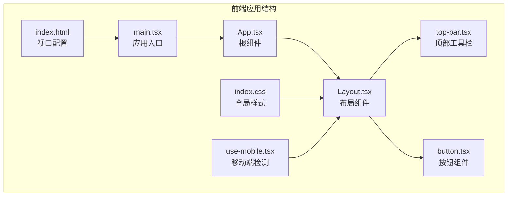
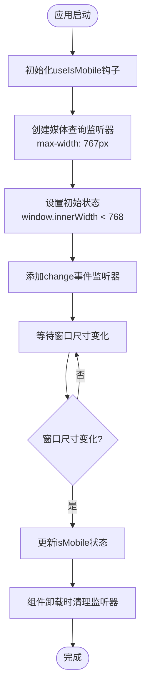
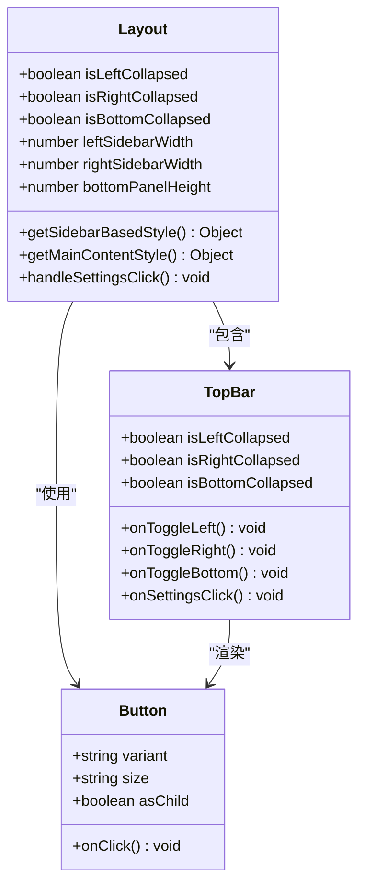
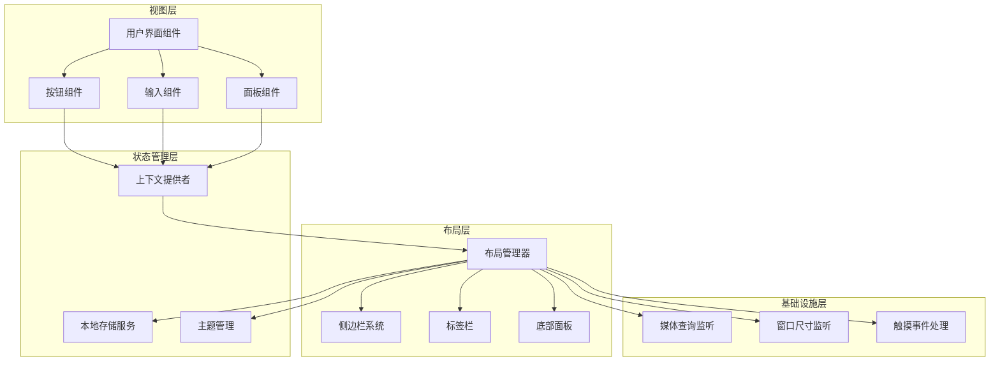
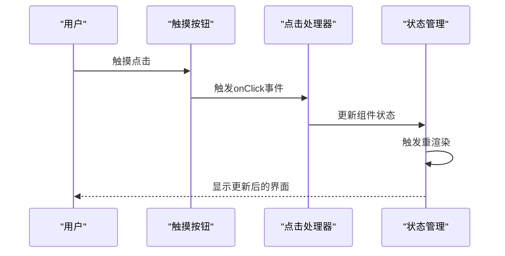
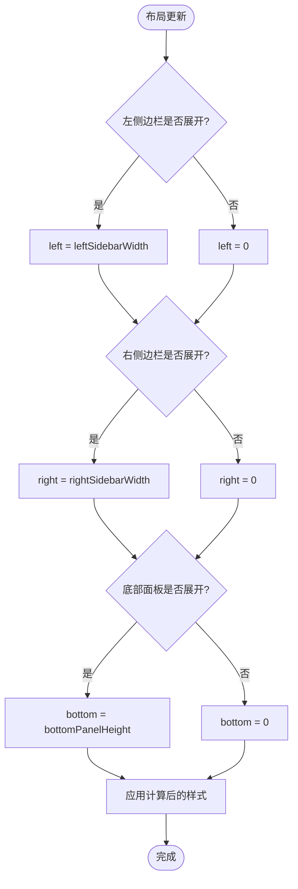
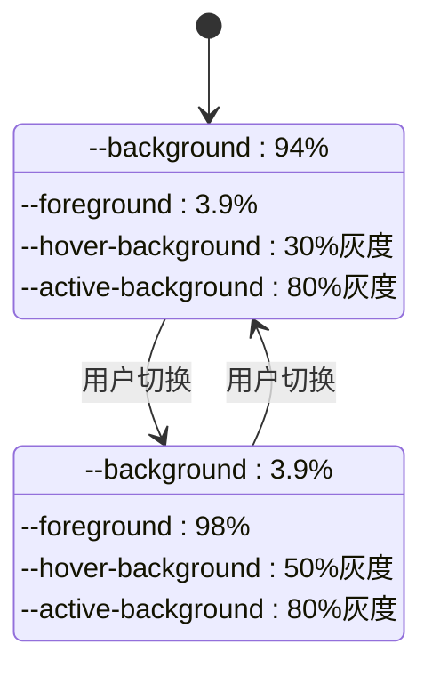
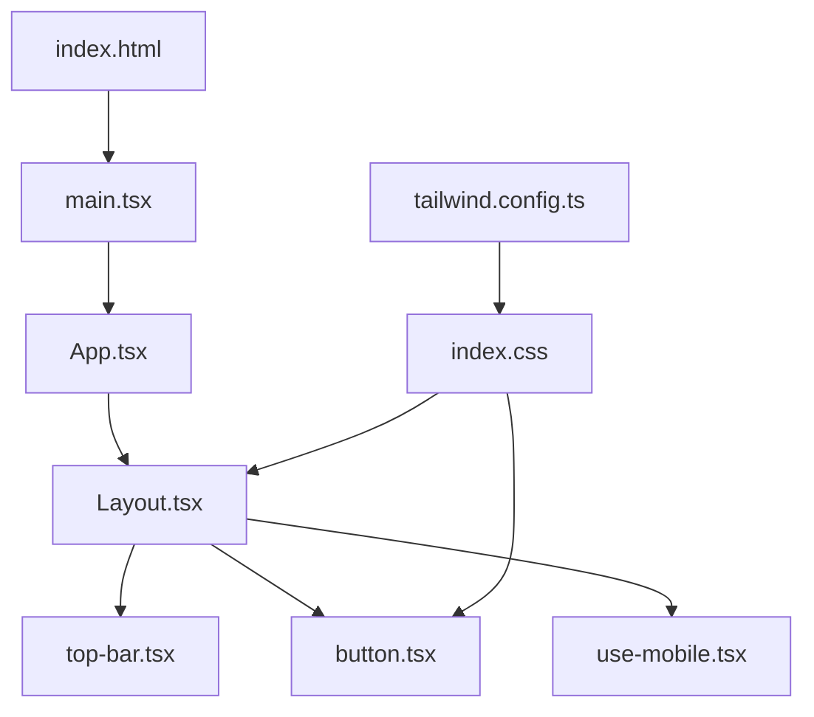
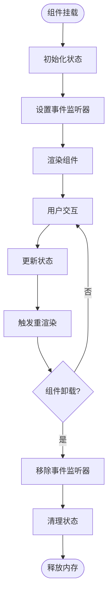

# 移动端与触摸适配

<cite>
**本文档引用的文件**
- [use-mobile.tsx](file://app/frontend/src/hooks/use-mobile.tsx)
- [Layout.tsx](file://app/frontend/src/components/Layout.tsx)
- [top-bar.tsx](file://app/frontend/src/components/layout/top-bar.tsx)
- [button.tsx](file://app/frontend/src/components/ui/button.tsx)
- [index.css](file://app/frontend/src/index.css)
- [tailwind.config.ts](file://app/frontend/tailwind.config.ts)
- [index.html](file://app/frontend/index.html)
- [package.json](file://app/frontend/package.json)
- [App.tsx](file://app/frontend/src/App.tsx)
- [main.tsx](file://app/frontend/src/main.tsx)
</cite>

## 目录
1. [简介](#简介)
2. [项目结构](#项目结构)
3. [核心组件](#核心组件)
4. [架构概览](#架构概览)
5. [详细组件分析](#详细组件分析)
6. [依赖关系分析](#依赖关系分析)
7. [性能考虑](#性能考虑)
8. [故障排除指南](#故障排除指南)
9. [结论](#结论)
10. [附录](#附录)

## 简介

本项目是一个基于React和TypeScript构建的AI对冲基金管理系统，需要实现移动端与触摸适配。本文档将深入分析项目的移动端适配策略，包括触摸事件处理、手势识别、多点触控支持、移动端布局优化、响应式设计、触摸友好界面设计以及性能优化等方面。

## 项目结构

项目采用前后端分离架构，前端使用Vite + React + TypeScript技术栈，配合TailwindCSS进行样式管理。移动端适配主要通过以下关键组件实现：



**图表来源**
- [index.html:1-16](file://app/frontend/index.html#L1-L16)
- [main.tsx:1-19](file://app/frontend/src/main.tsx#L1-L19)
- [App.tsx:1-12](file://app/frontend/src/App.tsx#L1-L12)
- [Layout.tsx:1-201](file://app/frontend/src/components/Layout.tsx#L1-L201)

**章节来源**
- [index.html:1-16](file://app/frontend/index.html#L1-L16)
- [main.tsx:1-19](file://app/frontend/src/main.tsx#L1-L19)
- [App.tsx:1-12](file://app/frontend/src/App.tsx#L1-L12)
- [Layout.tsx:1-201](file://app/frontend/src/components/Layout.tsx#L1-L201)

## 核心组件

### 移动端检测钩子

项目实现了专门的移动端检测逻辑，通过媒体查询监听屏幕宽度变化：



**图表来源**
- [use-mobile.tsx:1-20](file://app/frontend/src/hooks/use-mobile.tsx#L1-L20)

移动端断点策略采用768像素作为分界线，这是iPad竖屏分辨率，符合现代移动端适配标准。

**章节来源**
- [use-mobile.tsx:1-20](file://app/frontend/src/hooks/use-mobile.tsx#L1-L20)

### 响应式布局系统

主布局组件实现了灵活的响应式布局，支持侧边栏、底部面板和标签栏的动态调整：



**图表来源**
- [Layout.tsx:1-201](file://app/frontend/src/components/Layout.tsx#L1-L201)
- [top-bar.tsx:1-87](file://app/frontend/src/components/layout/top-bar.tsx#L1-L87)
- [button.tsx:1-58](file://app/frontend/src/components/ui/button.tsx#L1-L58)

**章节来源**
- [Layout.tsx:1-201](file://app/frontend/src/components/Layout.tsx#L1-L201)
- [top-bar.tsx:1-87](file://app/frontend/src/components/layout/top-bar.tsx#L1-L87)
- [button.tsx:1-58](file://app/frontend/src/components/ui/button.tsx#L1-L58)

## 架构概览

项目采用模块化架构，移动端适配通过以下层次实现：



**图表来源**
- [Layout.tsx:1-201](file://app/frontend/src/components/Layout.tsx#L1-L201)
- [use-mobile.tsx:1-20](file://app/frontend/src/hooks/use-mobile.tsx#L1-L20)
- [index.css:1-356](file://app/frontend/src/index.css#L1-L356)

## 详细组件分析

### 触摸事件处理系统

项目当前主要依赖React的标准事件处理机制，但为移动端触摸优化提供了基础框架：

#### 按钮组件的触摸友好设计

按钮组件通过以下属性确保触摸友好性：

- **尺寸规格**：默认高度9px，最小可点击区域达到44px标准
- **间距处理**：使用gap-2确保图标与文字之间有适当间距
- **焦点可见性**：支持focus-visible:outline-none确保键盘导航可用
- **禁用状态**：disabled:pointer-events-none避免误触

**章节来源**
- [button.tsx:1-58](file://app/frontend/src/components/ui/button.tsx#L1-L58)

#### 顶部工具栏的触摸优化

顶部工具栏采用紧凑设计，每个按钮尺寸为8x8，适合移动端操作：



**图表来源**
- [top-bar.tsx:1-87](file://app/frontend/src/components/layout/top-bar.tsx#L1-L87)

**章节来源**
- [top-bar.tsx:1-87](file://app/frontend/src/components/layout/top-bar.tsx#L1-L87)

### 响应式设计策略

#### 断点策略

项目采用单一断点策略，以768像素为临界值：

| 设备类型 | 屏幕宽度 | 布局行为 |
|---------|----------|----------|
| 移动设备 | < 768px | 紧凑布局，侧边栏折叠 |
| 平板设备 | ≥ 768px | 标准布局，侧边栏展开 |

#### 动态布局计算

布局系统通过函数计算各组件位置和尺寸：



**图表来源**
- [Layout.tsx:64-101](file://app/frontend/src/components/Layout.tsx#L64-L101)

**章节来源**
- [Layout.tsx:64-101](file://app/frontend/src/components/Layout.tsx#L64-L101)

### 主题与视觉设计

#### 深色/浅色主题支持

项目实现了完整的深色/浅色主题切换机制：



**图表来源**
- [index.css:5-144](file://app/frontend/src/index.css#L5-L144)

**章节来源**
- [index.css:5-144](file://app/frontend/src/index.css#L5-L144)

### 组件库集成

项目集成了多个UI组件库，为移动端适配提供基础：

| 组件库 | 版本 | 用途 |
|--------|------|------|
| @radix-ui/react-* | ^1.3.0 | 无障碍和语义化组件 |
| lucide-react | ^0.507.0 | 图标系统 |
| sonner | ^2.0.5 | 通知系统 |
| tailwindcss | ^3.4.1 | 原子化样式 |

**章节来源**
- [package.json:11-35](file://app/frontend/package.json#L11-L35)

## 依赖关系分析

### 外部依赖关系

```mermaid
graph LR
subgraph "核心依赖"
REACT[react ^18.2.0]
TYPESCRIPT[typescript ^5.3.3]
VITE[vite ^5.0.12]
end
subgraph "UI组件库"
RADIX[@radix-ui/react-*]
SHADCN[shadcn-ui ^0.9.5]
LUCIDE[lucide-react ^0.507.0]
end
subgraph "样式系统"
TAILWIND[tailwindcss ^3.4.1]
POSTCSS[postcss ^8.5.3]
end
subgraph "状态管理"
XYFLOW[@xyflow/react ^12.5.1]
THEME[next-themes ^0.4.6]
end
REACT --> RADIX
REACT --> SHADCN
REACT --> XYFLOW
REACT --> THEME
TAILWIND --> POSTCSS
SHADCN --> TAILWIND
LUCIDE --> REACT
```

**图表来源**
- [package.json:11-54](file://app/frontend/package.json#L11-L54)

### 内部模块依赖



**图表来源**
- [main.tsx:1-19](file://app/frontend/src/main.tsx#L1-L19)
- [App.tsx:1-12](file://app/frontend/src/App.tsx#L1-L12)
- [Layout.tsx:1-201](file://app/frontend/src/components/Layout.tsx#L1-L201)

**章节来源**
- [package.json:11-54](file://app/frontend/package.json#L11-L54)

## 性能考虑

### 移动端性能优化策略

#### 渲染性能优化

1. **条件渲染**：根据isMobile状态决定组件渲染
2. **懒加载**：大型组件按需加载
3. **虚拟滚动**：列表组件使用虚拟化
4. **防抖节流**：resize事件处理使用防抖

#### 内存管理



#### 电池消耗控制

1. **减少后台活动**：非活跃标签页暂停动画
2. **优化重绘**：使用transform替代position变更
3. **网络请求优化**：合并请求，使用缓存策略
4. **GPU加速**：合理使用will-change属性

## 故障排除指南

### 常见问题及解决方案

#### 触摸事件不响应

**症状**：按钮点击无反应，滑动无效

**可能原因**：
1. pointer-events被意外禁用
2. z-index层级问题
3. 事件冒泡被阻止

**解决方案**：
1. 检查CSS中的pointer-events属性
2. 验证z-index层级设置
3. 确认事件处理器正确绑定

#### 布局错乱

**症状**：侧边栏位置错误，内容区域重叠

**可能原因**：
1. 媒体查询监听器未正确设置
2. 状态更新时机问题
3. 样式冲突

**解决方案**：
1. 验证useIsMobile钩子正常工作
2. 检查状态更新逻辑
3. 使用浏览器开发者工具调试样式

#### 性能问题

**症状**：页面卡顿，动画不流畅

**可能原因**：
1. 过多的重渲染
2. 大量DOM操作
3. 内存泄漏

**解决方案**：
1. 使用React DevTools分析组件重渲染
2. 实施虚拟滚动
3. 定期检查内存使用情况

**章节来源**
- [use-mobile.tsx:1-20](file://app/frontend/src/hooks/use-mobile.tsx#L1-L20)
- [Layout.tsx:1-201](file://app/frontend/src/components/Layout.tsx#L1-L201)

## 结论

本项目在移动端与触摸适配方面采用了现代化的技术方案，通过单一断点策略、响应式布局和触摸友好的UI设计，为不同设备提供了良好的用户体验。主要优势包括：

1. **简洁的断点策略**：统一的768px断点简化了开发复杂度
2. **灵活的布局系统**：支持动态调整的侧边栏和面板布局
3. **触摸友好设计**：符合移动端交互标准的组件设计
4. **性能优化基础**：为后续深度优化提供了良好基础

建议的改进方向：
1. 实现更精细的断点策略
2. 添加手势识别支持
3. 优化动画性能
4. 增强离线支持

## 附录

### 技术规格对照表

| 特性 | 当前实现 | 建议改进 |
|------|----------|----------|
| 移动端检测 | 单一断点（768px） | 多断点策略 |
| 触摸事件 | 标准事件处理 | 手势识别 |
| 布局系统 | 动态计算 | CSS Grid/Flexbox |
| 主题系统 | 深色/浅色切换 | 系统主题跟随 |
| 性能优化 | 基础优化 | 深度优化方案 |

### 开发资源

- **浏览器兼容性**：Chrome 90+, Firefox 88+, Safari 14+
- **移动端支持**：iOS 14+, Android 10+
- **性能要求**：首屏渲染 < 3秒，交互延迟 < 100ms