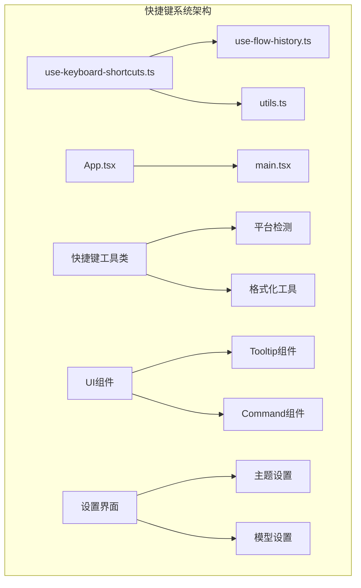
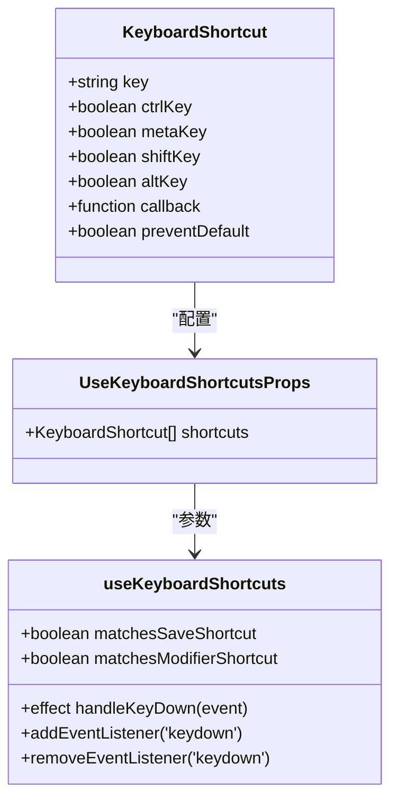
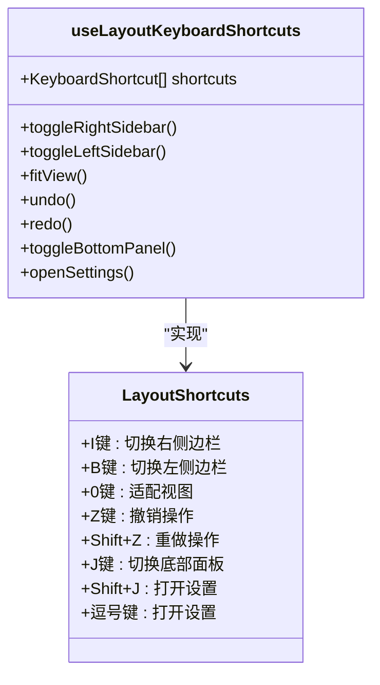
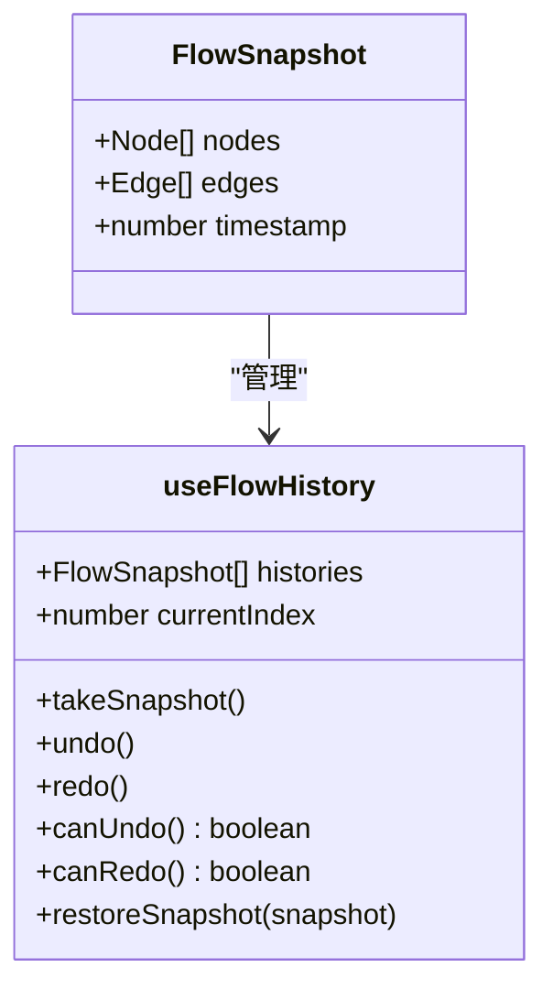
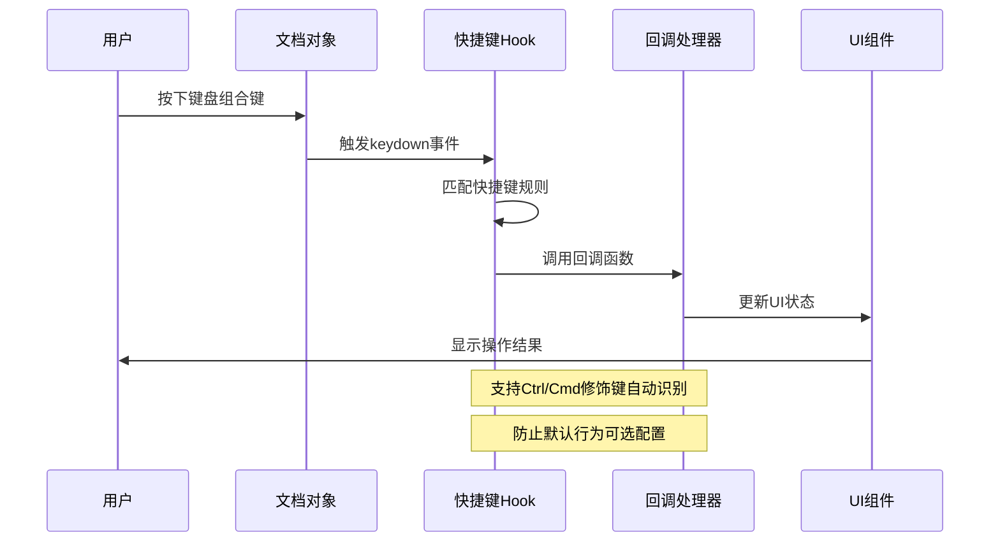
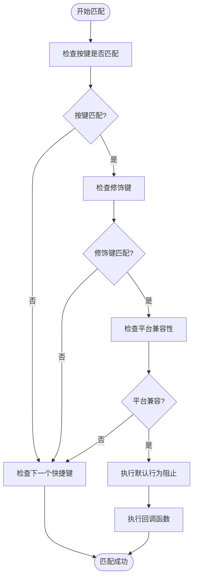
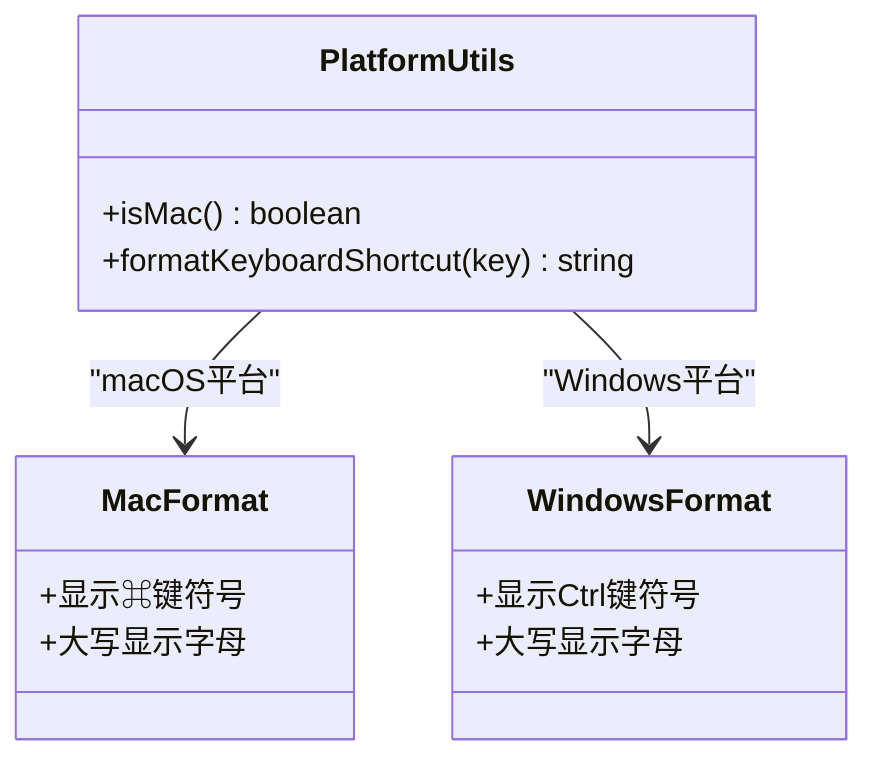
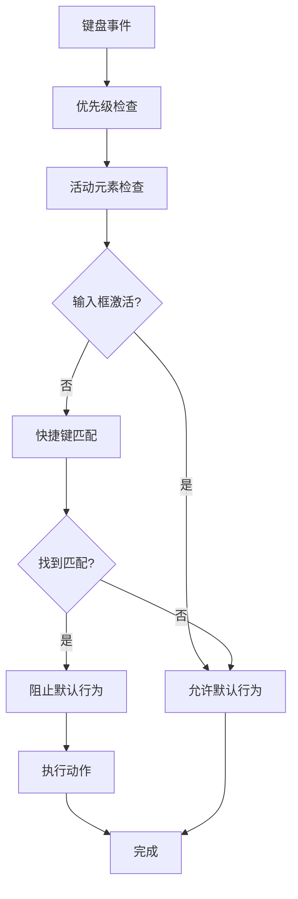
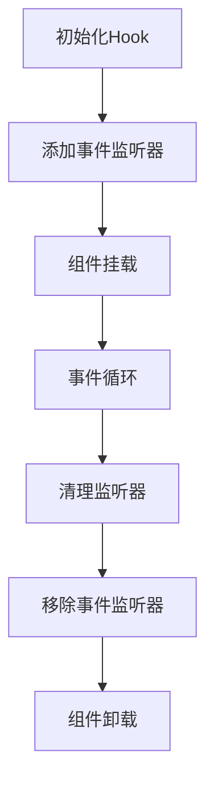

# 键盘快捷键系统

<cite>
**本文档引用的文件**
- [use-keyboard-shortcuts.ts](file://app/frontend/src/hooks/use-keyboard-shortcuts.ts)
- [use-flow-history.ts](file://app/frontend/src/hooks/use-flow-history.ts)
- [utils.ts](file://app/frontend/src/lib/utils.ts)
- [tooltip.tsx](file://app/frontend/src/components/ui/tooltip.tsx)
- [command.tsx](file://app/frontend/src/components/ui/command.tsx)
- [settings.tsx](file://app/frontend/src/components/settings/settings.tsx)
- [appearance.tsx](file://app/frontend/src/components/settings/appearance.tsx)
- [use-mobile.tsx](file://app/frontend/src/hooks/use-mobile.tsx)
- [App.tsx](file://app/frontend/src/App.tsx)
- [main.tsx](file://app/frontend/src/main.tsx)
</cite>

## 目录
1. [简介](#简介)
2. [项目结构](#项目结构)
3. [核心组件](#核心组件)
4. [架构概览](#架构概览)
5. [详细组件分析](#详细组件分析)
6. [依赖关系分析](#依赖关系分析)
7. [性能考虑](#性能考虑)
8. [故障排除指南](#故障排除指南)
9. [结论](#结论)
10. [附录](#附录)

## 简介

本文件详细介绍了AI对冲基金项目中的键盘快捷键系统。该系统提供了完整的快捷键注册机制、事件监听和冲突处理策略，支持常用的快捷键组合如保存(Ctrl+S)、撤销(Undo)、重做(Redo)、删除(Delete)等核心操作。系统还实现了快捷键与UI元素的绑定关系和优先级处理，提供了自定义快捷键的扩展机制和配置选项，并包含了快捷键提示显示、帮助文档和无障碍访问支持。

## 项目结构

键盘快捷键系统主要分布在前端应用的hooks目录中，通过自定义Hook的形式提供功能：



**图表来源**
- [use-keyboard-shortcuts.ts:1-165](file://app/frontend/src/hooks/use-keyboard-shortcuts.ts#L1-L165)
- [use-flow-history.ts:1-171](file://app/frontend/src/hooks/use-flow-history.ts#L1-L171)
- [utils.ts:1-38](file://app/frontend/src/lib/utils.ts#L1-L38)

**章节来源**
- [use-keyboard-shortcuts.ts:1-165](file://app/frontend/src/hooks/use-keyboard-shortcuts.ts#L1-L165)
- [use-flow-history.ts:1-171](file://app/frontend/src/hooks/use-flow-history.ts#L1-L171)
- [utils.ts:1-38](file://app/frontend/src/lib/utils.ts#L1-L38)

## 核心组件

### 快捷键注册机制

系统的核心是`useKeyboardShortcuts` Hook，它提供了灵活的快捷键注册和管理功能：



**图表来源**
- [use-keyboard-shortcuts.ts:3-15](file://app/frontend/src/hooks/use-keyboard-shortcuts.ts#L3-L15)
- [use-keyboard-shortcuts.ts:17-50](file://app/frontend/src/hooks/use-keyboard-shortcuts.ts#L17-L50)

### 布局快捷键系统

系统提供了专门的布局快捷键Hook，支持侧边栏切换、视图适配等功能：



**图表来源**
- [use-keyboard-shortcuts.ts:68-165](file://app/frontend/src/hooks/use-keyboard-shortcuts.ts#L68-L165)

### 流程历史管理

系统集成了撤销/重做功能，通过`useFlowHistory` Hook管理流程状态：



**图表来源**
- [use-flow-history.ts:4-171](file://app/frontend/src/hooks/use-flow-history.ts#L4-L171)

**章节来源**
- [use-keyboard-shortcuts.ts:1-165](file://app/frontend/src/hooks/use-keyboard-shortcuts.ts#L1-L165)
- [use-flow-history.ts:1-171](file://app/frontend/src/hooks/use-flow-history.ts#L1-L171)

## 架构概览

键盘快捷键系统采用模块化设计，通过多个Hook协同工作：



**图表来源**
- [use-keyboard-shortcuts.ts:18-42](file://app/frontend/src/hooks/use-keyboard-shortcuts.ts#L18-L42)

系统架构特点：
- **事件驱动**: 基于DOM事件的响应式设计
- **模块化**: 通过独立Hook实现功能分离
- **可扩展**: 支持动态添加和移除快捷键
- **跨平台**: 自动识别Windows/Linux和macOS平台

## 详细组件分析

### 快捷键匹配算法

系统实现了智能的快捷键匹配逻辑，支持复杂的修饰键组合：



**图表来源**
- [use-keyboard-shortcuts.ts:19-42](file://app/frontend/src/hooks/use-keyboard-shortcuts.ts#L19-L42)

### 平台兼容性处理

系统通过工具函数实现跨平台兼容：



**图表来源**
- [utils.ts:8-17](file://app/frontend/src/lib/utils.ts#L8-L17)

### 常用快捷键组合实现

系统实现了以下核心快捷键组合：

| 快捷键 | 功能 | 平台支持 | 修饰键要求 |
|--------|------|----------|------------|
| Ctrl+S / Cmd+S | 保存流程 | 所有平台 | Ctrl/Cmd |
| Ctrl+Z / Cmd+Z | 撤销操作 | 所有平台 | Ctrl/Cmd |
| Ctrl+Shift+Z / Cmd+Shift+Z | 重做操作 | 所有平台 | Ctrl/Cmd+Shift |
| Ctrl+I / Cmd+I | 切换右侧边栏 | 所有平台 | Ctrl/Cmd |
| Ctrl+B / Cmd+B | 切换左侧边栏 | 所有平台 | Ctrl/Cmd |
| Ctrl+0 / Cmd+O | 适配视图 | 所有平台 | Ctrl/Cmd |
| Ctrl+J / Cmd+J | 切换底部面板 | 所有平台 | Ctrl/Cmd |
| Ctrl+Shift+J / Cmd+Shift+J | 打开设置 | 所有平台 | Ctrl/Cmd+Shift |
| Ctrl+, / Cmd+, | 打开设置 | 所有平台 | Ctrl/Cmd |

**章节来源**
- [use-keyboard-shortcuts.ts:53-165](file://app/frontend/src/hooks/use-keyboard-shortcuts.ts#L53-L165)
- [utils.ts:8-17](file://app/frontend/src/lib/utils.ts#L8-L17)

### 冲突处理策略

系统采用多层冲突处理机制：



**图表来源**
- [use-keyboard-shortcuts.ts:18-42](file://app/frontend/src/hooks/use-keyboard-shortcuts.ts#L18-L42)

## 依赖关系分析

快捷键系统与其他组件的依赖关系：

```mermaid
graph TB
subgraph "核心依赖"
A[use-keyboard-shortcuts] --> B[React Hooks]
A --> C[DOM Events]
D[use-flow-history] --> E[@xyflow/react]
D --> F[React State]
end
subgraph "工具依赖"
G[utils.ts] --> H[Platform Detection]
G --> I[Keyboard Formatting]
J[tooltip.tsx] --> K[Radix UI]
L[command.tsx] --> M[Command Menu]
end
subgraph "UI集成"
N[App.tsx] --> O[Layout Components]
P[settings.tsx] --> Q[Appearance Settings]
R[use-mobile.tsx] --> S[Responsive Design]
end
A --> G
D --> A
N --> A
P --> Q
```

**图表来源**
- [use-keyboard-shortcuts.ts:1](file://app/frontend/src/hooks/use-keyboard-shortcuts.ts#L1)
- [use-flow-history.ts:1](file://app/frontend/src/hooks/use-flow-history.ts#L1)
- [utils.ts:1](file://app/frontend/src/lib/utils.ts#L1)

**章节来源**
- [use-keyboard-shortcuts.ts:1-165](file://app/frontend/src/hooks/use-keyboard-shortcuts.ts#L1-L165)
- [use-flow-history.ts:1-171](file://app/frontend/src/hooks/use-flow-history.ts#L1-L171)
- [utils.ts:1-38](file://app/frontend/src/lib/utils.ts#L1-L38)

## 性能考虑

### 事件监听优化

系统采用高效的事件监听策略：
- 使用单个keydown事件监听器处理所有快捷键
- 通过数组遍历实现O(n)匹配复杂度
- 支持动态添加和移除快捷键

### 内存管理



**图表来源**
- [use-keyboard-shortcuts.ts:44-49](file://app/frontend/src/hooks/use-keyboard-shortcuts.ts#L44-L49)

### 历史记录管理

撤销/重做功能的内存优化：
- 限制历史记录最大数量(默认50)
- 智能去重，忽略UI状态变化
- 支持按流程隔离的历史记录

## 故障排除指南

### 常见问题及解决方案

| 问题类型 | 症状 | 解决方案 |
|----------|------|----------|
| 快捷键不响应 | 按键无反应 | 检查活动元素状态，确认不在输入框中 |
| 平台兼容性问题 | macOS快捷键无效 | 验证平台检测逻辑，检查修饰键识别 |
| 冲突处理错误 | 快捷键被其他组件拦截 | 检查事件冒泡和默认行为阻止 |
| 性能问题 | 多个快捷键导致卡顿 | 优化快捷键数量，避免不必要的重渲染 |

### 调试技巧

1. **事件监听调试**: 在keydown事件处理器中添加日志输出
2. **平台检测验证**: 使用`isMac()`函数验证平台识别
3. **快捷键匹配测试**: 逐个测试修饰键组合的匹配逻辑
4. **内存泄漏检查**: 确保在组件卸载时正确移除事件监听器

**章节来源**
- [use-keyboard-shortcuts.ts:17-50](file://app/frontend/src/hooks/use-keyboard-shortcuts.ts#L17-L50)

## 结论

键盘快捷键系统为AI对冲基金项目提供了完整而灵活的键盘交互解决方案。系统通过模块化的Hook设计实现了高度的可扩展性和跨平台兼容性，支持丰富的快捷键组合和智能的冲突处理机制。通过合理的性能优化和完善的错误处理，系统能够为用户提供流畅而一致的键盘操作体验。

## 附录

### 扩展开发指南

开发者可以通过以下方式扩展快捷键系统：

1. **自定义Hook**: 创建新的快捷键Hook继承现有功能
2. **动态注册**: 在运行时动态添加或移除快捷键
3. **条件快捷键**: 实现基于应用状态的快捷键启用/禁用
4. **配置持久化**: 将用户自定义的快捷键配置存储到本地

### 最佳实践

- 保持快捷键组合的一致性和直观性
- 提供视觉反馈和无障碍支持
- 考虑不同平台的用户习惯差异
- 定期进行性能基准测试
- 建立完整的测试覆盖