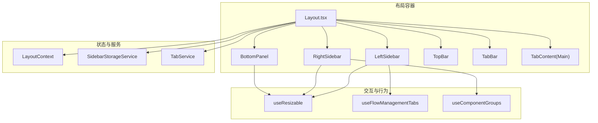
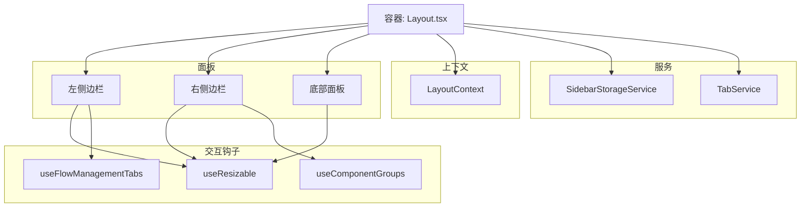
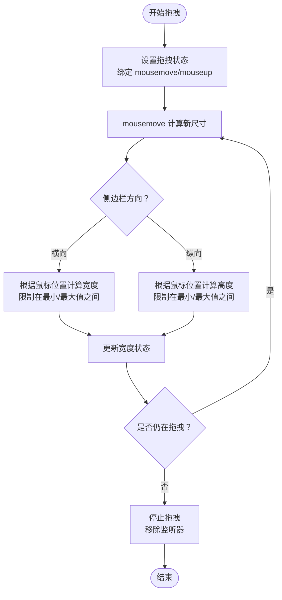
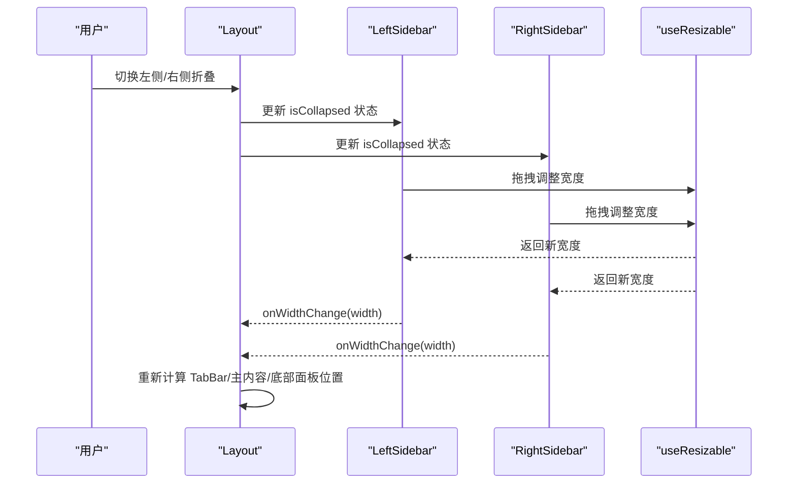
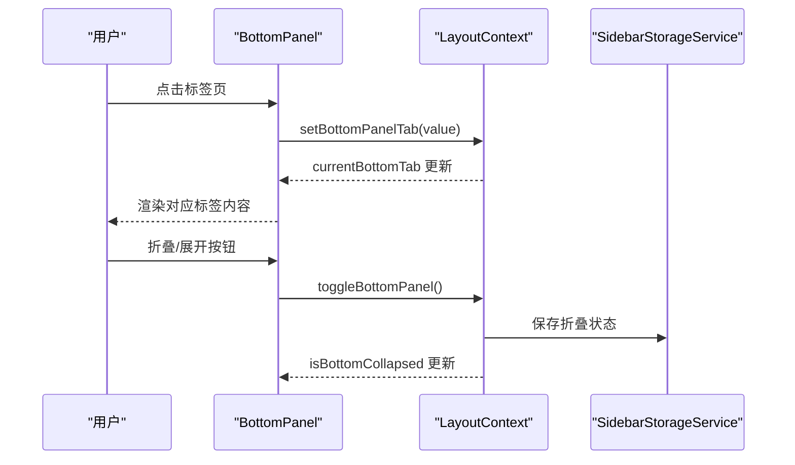
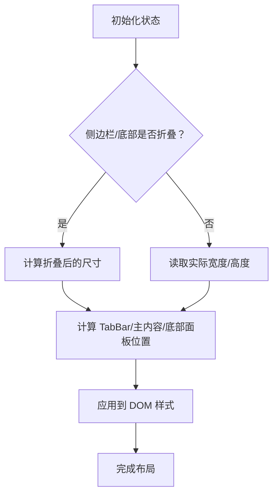
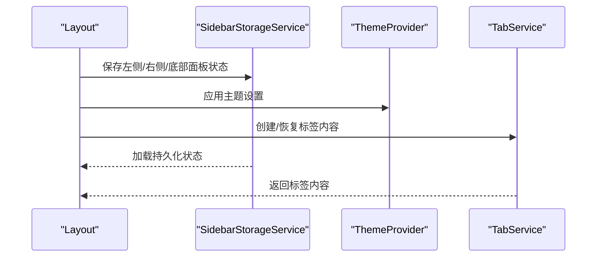
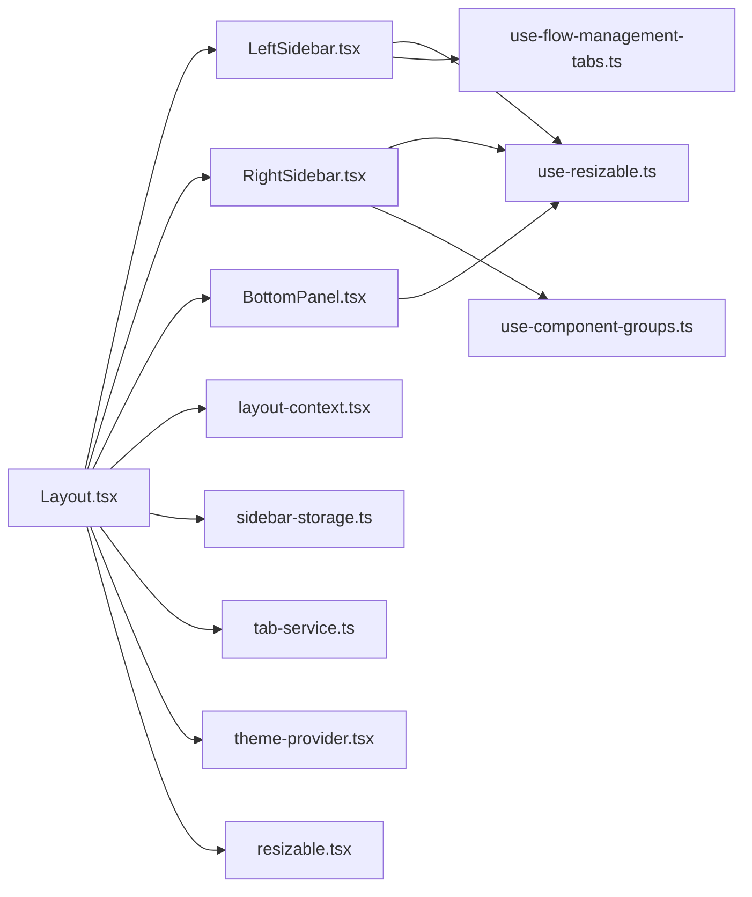

# 面板管理系统

<cite>
**本文引用的文件**
- [Layout.tsx](file://app/frontend/src/components/Layout.tsx)
- [left-sidebar.tsx](file://app/frontend/src/components/panels/left/left-sidebar.tsx)
- [right-sidebar.tsx](file://app/frontend/src/components/panels/right/right-sidebar.tsx)
- [bottom-panel.tsx](file://app/frontend/src/components/panels/bottom/bottom-panel.tsx)
- [use-resizable.ts](file://app/frontend/src/hooks/use-resizable.ts)
- [use-flow-management-tabs.ts](file://app/frontend/src/hooks/use-flow-management-tabs.ts)
- [use-component-groups.ts](file://app/frontend/src/hooks/use-component-groups.ts)
- [layout-context.tsx](file://app/frontend/src/contexts/layout-context.tsx)
- [sidebar-storage.ts](file://app/frontend/src/services/sidebar-storage.ts)
- [resizable.tsx](file://app/frontend/src/components/ui/resizable.tsx)
- [use-mobile.tsx](file://app/frontend/src/hooks/use-mobile.tsx)
- [theme-provider.tsx](file://app/frontend/src/providers/theme-provider.tsx)
- [tab-service.ts](file://app/frontend/src/services/tab-service.ts)
- [sidebar-components.ts](file://app/frontend/src/data/sidebar-components.ts)
</cite>

## 目录
1. [简介](#简介)
2. [项目结构](#项目结构)
3. [核心组件](#核心组件)
4. [架构总览](#架构总览)
5. [详细组件分析](#详细组件分析)
6. [依赖关系分析](#依赖关系分析)
7. [性能考量](#性能考量)
8. [故障排查指南](#故障排查指南)
9. [结论](#结论)
10. [附录](#附录)

## 简介
本文件系统性阐述该AI对冲基金前端中的面板管理系统，覆盖以下要点：
- 可调整大小面板的实现原理：拖拽边界检测、最小尺寸限制与动画过渡效果
- 左右侧边栏的内容组织、折叠展开状态管理与布局自适应
- 底部面板的标签页系统、内容切换与状态同步机制
- 面板间空间分配算法与响应式布局策略
- 面板配置持久化、主题适配与用户偏好存储方案
- 触摸设备的手势支持与移动端优化策略

## 项目结构
面板系统由三大侧边栏（左/右）与一个底部面板构成，配合顶部工具条、标签栏与主工作区共同组成整体布局。状态通过上下文与服务进行集中管理，并持久化到本地存储。

**图表来源**
- [Layout.tsx:18-201](file://app/frontend/src/components/Layout.tsx#L18-L201)
- [left-sidebar.tsx:17-101](file://app/frontend/src/components/panels/left/left-sidebar.tsx#L17-L101)
- [right-sidebar.tsx:17-97](file://app/frontend/src/components/panels/right/right-sidebar.tsx#L17-L97)
- [bottom-panel.tsx:19-99](file://app/frontend/src/components/panels/bottom/bottom-panel.tsx#L19-L99)
- [layout-context.tsx:27-68](file://app/frontend/src/contexts/layout-context.tsx#L27-L68)
- [sidebar-storage.ts:7-237](file://app/frontend/src/services/sidebar-storage.ts#L7-L237)
- [tab-service.ts:13-68](file://app/frontend/src/services/tab-service.ts#L13-L68)
- [use-resizable.ts:13-93](file://app/frontend/src/hooks/use-resizable.ts#L13-L93)
- [use-flow-management-tabs.ts:45-337](file://app/frontend/src/hooks/use-flow-management-tabs.ts#L45-L337)
- [use-component-groups.ts:4-71](file://app/frontend/src/hooks/use-component-groups.ts#L4-L71)

**章节来源**
- [Layout.tsx:18-201](file://app/frontend/src/components/Layout.tsx#L18-L201)

## 核心组件
- 布局容器：负责计算各面板位置与尺寸，协调键盘快捷键、折叠状态与主内容区域定位
- 左/右侧边栏：承载流程与组件列表，支持拖拽调整宽度与折叠展开
- 底部面板：包含标签页系统，支持垂直拖拽调整高度与折叠展开
- 状态上下文：统一管理底部面板的折叠状态与当前标签
- 持久化服务：将侧边栏与底部面板的折叠状态保存到本地存储
- 交互钩子：提供通用的拖拽调整能力与侧边栏内容过滤/分组逻辑

**章节来源**
- [Layout.tsx:18-201](file://app/frontend/src/components/Layout.tsx#L18-L201)
- [layout-context.tsx:27-68](file://app/frontend/src/contexts/layout-context.tsx#L27-L68)
- [sidebar-storage.ts:7-237](file://app/frontend/src/services/sidebar-storage.ts#L7-L237)
- [use-resizable.ts:13-93](file://app/frontend/src/hooks/use-resizable.ts#L13-L93)

## 架构总览
面板系统采用“容器-面板-钩子-上下文-服务”的分层设计：
- 容器层：Layout 负责全局布局、键盘快捷键与尺寸计算
- 面板层：Left/Right/Bottom 各自封装交互与样式
- 钩子层：use-resizable 提供拖拽与约束；use-flow-management-tabs 与 use-component-groups 提供业务数据与筛选
- 上下文层：LayoutContext 统一底部面板状态
- 服务层：SidebarStorageService 与 TabService 负责持久化与标签内容构造

**图表来源**
- [Layout.tsx:18-201](file://app/frontend/src/components/Layout.tsx#L18-L201)
- [use-resizable.ts:13-93](file://app/frontend/src/hooks/use-resizable.ts#L13-L93)
- [use-flow-management-tabs.ts:45-337](file://app/frontend/src/hooks/use-flow-management-tabs.ts#L45-L337)
- [use-component-groups.ts:4-71](file://app/frontend/src/hooks/use-component-groups.ts#L4-L71)
- [layout-context.tsx:27-68](file://app/frontend/src/contexts/layout-context.tsx#L27-L68)
- [sidebar-storage.ts:7-237](file://app/frontend/src/services/sidebar-storage.ts#L7-L237)
- [tab-service.ts:13-68](file://app/frontend/src/services/tab-service.ts#L13-L68)

## 详细组件分析

### 可调整大小面板与拖拽实现
- 拖拽边界检测与最小/最大尺寸限制：通过 use-resizable 在鼠标移动时计算新尺寸，并在水平方向（左右侧边栏）与垂直方向（底部面板）分别应用不同的计算规则，同时使用 clamp 将尺寸限制在配置范围内
- 动画过渡效果：面板容器在折叠/展开时使用 transform 与透明度过渡，resize handle 在拖拽期间禁用文本选择以提升交互体验
- 事件处理：startResize 设置拖拽状态并绑定全局 mousemove/mouseup；stopResize 清理状态与监听器；组件卸载时也确保清理

**图表来源**
- [use-resizable.ts:29-76](file://app/frontend/src/hooks/use-resizable.ts#L29-L76)

**章节来源**
- [use-resizable.ts:13-93](file://app/frontend/src/hooks/use-resizable.ts#L13-L93)
- [left-sidebar.tsx:22-32](file://app/frontend/src/components/panels/left/left-sidebar.tsx#L22-L32)
- [right-sidebar.tsx:22-32](file://app/frontend/src/components/panels/right/right-sidebar.tsx#L22-L32)
- [bottom-panel.tsx:27-37](file://app/frontend/src/components/panels/bottom/bottom-panel.tsx#L27-L37)

### 左右侧边栏：内容组织、折叠展开与布局自适应
- 内容组织：左侧侧边栏通过 use-flow-management-tabs 提供流程列表、搜索与分组；右侧侧边栏通过 use-component-groups 提供组件分组与搜索
- 折叠展开：Layout 通过状态控制侧边栏的可见性与位移，折叠时使用 transform 与透明度过渡，避免影响布局流
- 布局自适应：Layout 根据侧边栏折叠状态与实际宽度动态计算 TabBar 与主内容区域的位置与尺寸；底部面板同样基于左右侧宽度进行定位

**图表来源**
- [Layout.tsx:24-101](file://app/frontend/src/components/Layout.tsx#L24-L101)
- [left-sidebar.tsx:17-101](file://app/frontend/src/components/panels/left/left-sidebar.tsx#L17-L101)
- [right-sidebar.tsx:17-97](file://app/frontend/src/components/panels/right/right-sidebar.tsx#L17-L97)
- [use-resizable.ts:13-93](file://app/frontend/src/hooks/use-resizable.ts#L13-L93)

**章节来源**
- [Layout.tsx:24-101](file://app/frontend/src/components/Layout.tsx#L24-L101)
- [left-sidebar.tsx:17-101](file://app/frontend/src/components/panels/left/left-sidebar.tsx#L17-L101)
- [right-sidebar.tsx:17-97](file://app/frontend/src/components/panels/right/right-sidebar.tsx#L17-L97)
- [use-flow-management-tabs.ts:45-337](file://app/frontend/src/hooks/use-flow-management-tabs.ts#L45-L337)
- [use-component-groups.ts:4-71](file://app/frontend/src/hooks/use-component-groups.ts#L4-L71)

### 底部面板：标签页系统、内容切换与状态同步
- 标签页系统：底部面板使用 Tabs 组件管理输出标签页，当前标签由 LayoutContext 统一维护
- 内容切换：TabsContent 包裹 OutputTab，切换时仅渲染对应内容区域
- 状态同步：LayoutContext 提供 setBottomPanelTab 与 currentBottomTab，SidebarStorageService 将折叠状态持久化到 localStorage

**图表来源**
- [bottom-panel.tsx:64-96](file://app/frontend/src/components/panels/bottom/bottom-panel.tsx#L64-L96)
- [layout-context.tsx:27-68](file://app/frontend/src/contexts/layout-context.tsx#L27-L68)
- [sidebar-storage.ts:7-237](file://app/frontend/src/services/sidebar-storage.ts#L7-L237)

**章节来源**
- [bottom-panel.tsx:19-99](file://app/frontend/src/components/panels/bottom/bottom-panel.tsx#L19-L99)
- [layout-context.tsx:27-68](file://app/frontend/src/contexts/layout-context.tsx#L27-L68)
- [sidebar-storage.ts:7-237](file://app/frontend/src/services/sidebar-storage.ts#L7-L237)

### 面板间空间分配算法与响应式布局策略
- 空间分配：Layout 通过 getSidebarBasedStyle 与 getMainContentStyle 计算 TabBar、主内容区与底部面板的绝对定位与尺寸，考虑侧边栏折叠状态与实际宽度
- 响应式策略：使用 useIsMobile 判断移动端断点，结合折叠状态与容器尺寸进行自适应；底部面板高度上限为窗口高度，避免遮挡主内容

**图表来源**
- [Layout.tsx:64-101](file://app/frontend/src/components/Layout.tsx#L64-L101)
- [use-mobile.tsx:5-19](file://app/frontend/src/hooks/use-mobile.tsx#L5-L19)

**章节来源**
- [Layout.tsx:64-101](file://app/frontend/src/components/Layout.tsx#L64-L101)
- [use-mobile.tsx:5-19](file://app/frontend/src/hooks/use-mobile.tsx#L5-L19)

### 面板配置持久化、主题适配与用户偏好存储
- 配置持久化：SidebarStorageService 将左侧/右侧/底部面板的折叠状态分别保存到 localStorage，并提供加载、清除与重置接口
- 主题适配：ThemeProvider 使用 next-themes 将主题存储在 storageKey 中，支持系统默认与手动切换
- 用户偏好：TabService 提供标签内容的创建与恢复，用于在页面刷新后重建标签内容

**图表来源**
- [sidebar-storage.ts:7-237](file://app/frontend/src/services/sidebar-storage.ts#L7-L237)
- [theme-provider.tsx:8-19](file://app/frontend/src/providers/theme-provider.tsx#L8-L19)
- [tab-service.ts:13-68](file://app/frontend/src/services/tab-service.ts#L13-L68)

**章节来源**
- [sidebar-storage.ts:7-237](file://app/frontend/src/services/sidebar-storage.ts#L7-L237)
- [theme-provider.tsx:8-19](file://app/frontend/src/providers/theme-provider.tsx#L8-L19)
- [tab-service.ts:13-68](file://app/frontend/src/services/tab-service.ts#L13-L68)

### 触摸设备手势支持与移动端优化
- 移动端断点：通过 useIsMobile 判断小于等于 768px 的设备为移动端
- 交互优化：拖拽 handle 在拖拽期间禁用文本选择，减少误触；面板折叠使用 transform 与透明度过渡，保证流畅性
- 布局优化：底部面板高度上限为窗口高度，避免在小屏设备上被遮挡；侧边栏折叠时完全移出可视区域

**章节来源**
- [use-mobile.tsx:5-19](file://app/frontend/src/hooks/use-mobile.tsx#L5-L19)
- [use-resizable.ts:40-48](file://app/frontend/src/hooks/use-resizable.ts#L40-L48)
- [bottom-panel.tsx:30-31](file://app/frontend/src/components/panels/bottom/bottom-panel.tsx#L30-L31)

## 依赖关系分析
- 组件耦合：Layout 对所有面板具有直接控制权，面板内部通过钩子与上下文间接访问业务数据
- 外部依赖：react-resizable-panels 提供基础的面板分隔能力（ui/resizable），但面板系统主要使用自定义拖拽实现
- 状态契约：LayoutContext 与 SidebarStorageService 是状态同步的关键枢纽

**图表来源**
- [Layout.tsx:18-201](file://app/frontend/src/components/Layout.tsx#L18-L201)
- [left-sidebar.tsx:17-101](file://app/frontend/src/components/panels/left/left-sidebar.tsx#L17-L101)
- [right-sidebar.tsx:17-97](file://app/frontend/src/components/panels/right/right-sidebar.tsx#L17-L97)
- [bottom-panel.tsx:19-99](file://app/frontend/src/components/panels/bottom/bottom-panel.tsx#L19-L99)
- [use-resizable.ts:13-93](file://app/frontend/src/hooks/use-resizable.ts#L13-L93)
- [layout-context.tsx:27-68](file://app/frontend/src/contexts/layout-context.tsx#L27-L68)
- [sidebar-storage.ts:7-237](file://app/frontend/src/services/sidebar-storage.ts#L7-L237)
- [use-flow-management-tabs.ts:45-337](file://app/frontend/src/hooks/use-flow-management-tabs.ts#L45-L337)
- [use-component-groups.ts:4-71](file://app/frontend/src/hooks/use-component-groups.ts#L4-L71)
- [tab-service.ts:13-68](file://app/frontend/src/services/tab-service.ts#L13-L68)
- [theme-provider.tsx:8-19](file://app/frontend/src/providers/theme-provider.tsx#L8-L19)
- [resizable.tsx:6-44](file://app/frontend/src/components/ui/resizable.tsx#L6-L44)

**章节来源**
- [Layout.tsx:18-201](file://app/frontend/src/components/Layout.tsx#L18-L201)

## 性能考量
- 事件监听清理：拖拽结束后及时移除全局 mousemove/mouseup 监听，避免内存泄漏
- 状态更新节流：宽度/高度变化通过 useEffect 通知父级，减少不必要的重渲染
- 过渡动画：使用 transform 与 opacity 实现折叠/展开，避免触发布局抖动
- 搜索与分组：use-component-groups 与 use-flow-management-tabs 使用 useMemo 与受控状态，降低渲染成本

[本节为通用指导，不直接分析具体文件]

## 故障排查指南
- 拖拽无效或卡顿
  - 检查拖拽 handle 是否正确绑定 startResize，确认 isDragging 状态在拖拽期间为 true
  - 确认 stopResize 是否被调用，且监听器已移除
  - 参考路径：[use-resizable.ts:29-76](file://app/frontend/src/hooks/use-resizable.ts#L29-L76)
- 面板尺寸超出限制
  - 检查 minWidth/maxWidth/minHeight/maxHeight 配置是否合理
  - 参考路径：[use-resizable.ts:14-21](file://app/frontend/src/hooks/use-resizable.ts#L14-L21)
- 折叠状态未持久化
  - 确认 SidebarStorageService 的保存/加载方法调用链路
  - 参考路径：[sidebar-storage.ts:54-64](file://app/frontend/src/services/sidebar-storage.ts#L54-L64)
- 底部面板标签页不显示
  - 检查 LayoutContext 的 currentBottomTab 与 setBottomPanelTab 是否正确联动
  - 参考路径：[layout-context.tsx:50-52](file://app/frontend/src/contexts/layout-context.tsx#L50-L52)
- 移动端交互异常
  - 确认 useIsMobile 断点与折叠逻辑
  - 参考路径：[use-mobile.tsx:5-19](file://app/frontend/src/hooks/use-mobile.tsx#L5-L19)

**章节来源**
- [use-resizable.ts:29-76](file://app/frontend/src/hooks/use-resizable.ts#L29-L76)
- [sidebar-storage.ts:54-64](file://app/frontend/src/services/sidebar-storage.ts#L54-L64)
- [layout-context.tsx:50-52](file://app/frontend/src/contexts/layout-context.tsx#L50-L52)
- [use-mobile.tsx:5-19](file://app/frontend/src/hooks/use-mobile.tsx#L5-L19)

## 结论
该面板管理系统通过自定义拖拽钩子与上下文/服务层实现了灵活的布局控制与状态持久化，具备良好的扩展性与可维护性。横向与纵向的尺寸约束、折叠动画与响应式策略共同提供了优秀的用户体验。建议后续可引入 react-resizable-panels 的 PanelGroup/Panel 以进一步简化复杂布局场景下的面板协作。

[本节为总结性内容，不直接分析具体文件]

## 附录
- 侧边栏组件分组数据源：右侧侧边栏组件来源于后端代理的 agents 数据，按功能模块分组展示
- 标签页内容构造：TabService 根据类型创建 Flow 或 Settings 内容节点，支持恢复与重建

**章节来源**
- [sidebar-components.ts:31-74](file://app/frontend/src/data/sidebar-components.ts#L31-L74)
- [tab-service.ts:13-68](file://app/frontend/src/services/tab-service.ts#L13-L68)