# UI组件库

<cite>
**本文引用的文件**
- [button.tsx](file://app/frontend/src/components/ui/button.tsx)
- [dialog.tsx](file://app/frontend/src/components/ui/dialog.tsx)
- [table.tsx](file://app/frontend/src/components/ui/table.tsx)
- [input.tsx](file://app/frontend/src/components/ui/input.tsx)
- [accordion.tsx](file://app/frontend/src/components/ui/accordion.tsx)
- [tabs.tsx](file://app/frontend/src/components/ui/tabs.tsx)
- [card.tsx](file://app/frontend/src/components/ui/card.tsx)
- [tooltip.tsx](file://app/frontend/src/components/ui/tooltip.tsx)
- [badge.tsx](file://app/frontend/src/components/ui/badge.tsx)
- [checkbox.tsx](file://app/frontend/src/components/ui/checkbox.tsx)
- [command.tsx](file://app/frontend/src/components/ui/command.tsx)
- [popover.tsx](file://app/frontend/src/components/ui/popover.tsx)
- [resizable.tsx](file://app/frontend/src/components/ui/resizable.tsx)
- [separator.tsx](file://app/frontend/src/components/ui/separator.tsx)
- [sheet.tsx](file://app/frontend/src/components/ui/sheet.tsx)
- [sidebar.tsx](file://app/frontend/src/components/ui/sidebar.tsx)
</cite>

## 目录
1. [简介](#简介)
2. [项目结构](#项目结构)
3. [核心组件](#核心组件)
4. [架构总览](#架构总览)
5. [详细组件分析](#详细组件分析)
6. [依赖分析](#依赖分析)
7. [性能考虑](#性能考虑)
8. [故障排查指南](#故障排查指南)
9. [结论](#结论)
10. [附录：API 参考与使用示例](#附录api-参考与使用示例)

## 简介
本文件为该前端工程中的 UI 组件库文档，覆盖基础按钮、输入、卡片、手风琴、标签页、对话框、工具提示、命令面板、弹出层、可调整面板、分割线、侧边栏等组件的设计原则、实现模式与使用指南。文档同时提供样式定制、主题适配与可访问性建议，并给出各组件的 API 参考与使用示例路径。

## 项目结构
UI 组件集中位于前端源码的组件目录中，采用按功能域组织的方式，便于复用与维护。组件多基于 Radix UI 原子能力进行封装，结合 Tailwind CSS 类名与 class-variance-authority 的变体系统，形成一致的外观与交互体验。

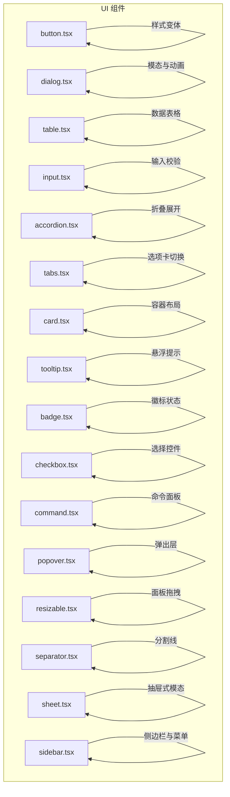

图表来源
- [button.tsx:1-58](file://app/frontend/src/components/ui/button.tsx#L1-L58)
- [dialog.tsx:1-113](file://app/frontend/src/components/ui/dialog.tsx#L1-L113)
- [table.tsx:1-121](file://app/frontend/src/components/ui/table.tsx#L1-L121)
- [input.tsx:1-23](file://app/frontend/src/components/ui/input.tsx#L1-L23)
- [accordion.tsx:1-56](file://app/frontend/src/components/ui/accordion.tsx#L1-L56)
- [tabs.tsx:1-54](file://app/frontend/src/components/ui/tabs.tsx#L1-L54)
- [card.tsx:1-78](file://app/frontend/src/components/ui/card.tsx#L1-L78)
- [tooltip.tsx:1-31](file://app/frontend/src/components/ui/tooltip.tsx#L1-L31)
- [badge.tsx:1-36](file://app/frontend/src/components/ui/badge.tsx#L1-L36)
- [checkbox.tsx:1-29](file://app/frontend/src/components/ui/checkbox.tsx#L1-L29)
- [command.tsx:1-146](file://app/frontend/src/components/ui/command.tsx#L1-L146)
- [popover.tsx:1-32](file://app/frontend/src/components/ui/popover.tsx#L1-L32)
- [resizable.tsx:1-44](file://app/frontend/src/components/ui/resizable.tsx#L1-L44)
- [separator.tsx:1-30](file://app/frontend/src/components/ui/separator.tsx#L1-L30)
- [sheet.tsx:1-141](file://app/frontend/src/components/ui/sheet.tsx#L1-L141)
- [sidebar.tsx:1-773](file://app/frontend/src/components/ui/sidebar.tsx#L1-L773)

章节来源
- [button.tsx:1-58](file://app/frontend/src/components/ui/button.tsx#L1-L58)
- [dialog.tsx:1-113](file://app/frontend/src/components/ui/dialog.tsx#L1-L113)
- [table.tsx:1-121](file://app/frontend/src/components/ui/table.tsx#L1-L121)
- [input.tsx:1-23](file://app/frontend/src/components/ui/input.tsx#L1-L23)
- [accordion.tsx:1-56](file://app/frontend/src/components/ui/accordion.tsx#L1-L56)
- [tabs.tsx:1-54](file://app/frontend/src/components/ui/tabs.tsx#L1-L54)
- [card.tsx:1-78](file://app/frontend/src/components/ui/card.tsx#L1-L78)
- [tooltip.tsx:1-31](file://app/frontend/src/components/ui/tooltip.tsx#L1-L31)
- [badge.tsx:1-36](file://app/frontend/src/components/ui/badge.tsx#L1-L36)
- [checkbox.tsx:1-29](file://app/frontend/src/components/ui/checkbox.tsx#L1-L29)
- [command.tsx:1-146](file://app/frontend/src/components/ui/command.tsx#L1-L146)
- [popover.tsx:1-32](file://app/frontend/src/components/ui/popover.tsx#L1-L32)
- [resizable.tsx:1-44](file://app/frontend/src/components/ui/resizable.tsx#L1-L44)
- [separator.tsx:1-30](file://app/frontend/src/components/ui/separator.tsx#L1-L30)
- [sheet.tsx:1-141](file://app/frontend/src/components/ui/sheet.tsx#L1-L141)
- [sidebar.tsx:1-773](file://app/frontend/src/components/ui/sidebar.tsx#L1-L773)

## 核心组件
- 按钮 Button：通过变体系统提供多种外观与尺寸，支持透传原生按钮属性与插槽渲染。
- 对话框 Dialog：基于 Radix UI 实现模态遮罩、内容区与关闭按钮，内置标题、描述、头部、底部等子组件。
- 表格 Table：提供 Table/TableHeader/TableBody/TableFooter/TableRow/TableHead/TableCell/TableCaption 完整语义化结构。
- 输入 Input：统一输入框样式与交互反馈，支持禁用、聚焦、占位符等通用行为。
- 手风琴 Accordion：折叠/展开内容区域，带旋转指示器与动画过渡。
- 标签页 Tabs：选项卡容器与触发器，配合内容区实现切换。
- 卡片 Card：容器型组件，包含头部、标题、描述、内容、底部等区域。
- 工具提示 Tooltip：提供悬浮提示，支持定位与动画。
- 徽标 Badge：状态类徽章，支持多种变体。
- 复选框 Checkbox：基于 Radix UI 的选择控件。
- 命令面板 Command：组合 Dialog 与 cmdk，提供搜索与快捷操作入口。
- 弹出层 Popover：触发后弹出内容，支持对齐与偏移。
- 可调整面板 Resizable：支持水平/垂直面板拖拽调整大小。
- 分割线 Separator：水平或垂直分割线。
- 抽屉 Sheet：从侧边滑入的模态容器，支持多方位进入。
- 侧边栏 Sidebar：复杂布局场景下的主侧边栏，支持折叠、浮动、嵌入等多种变体与键盘快捷键。

章节来源
- [button.tsx:1-58](file://app/frontend/src/components/ui/button.tsx#L1-L58)
- [dialog.tsx:1-113](file://app/frontend/src/components/ui/dialog.tsx#L1-L113)
- [table.tsx:1-121](file://app/frontend/src/components/ui/table.tsx#L1-L121)
- [input.tsx:1-23](file://app/frontend/src/components/ui/input.tsx#L1-L23)
- [accordion.tsx:1-56](file://app/frontend/src/components/ui/accordion.tsx#L1-L56)
- [tabs.tsx:1-54](file://app/frontend/src/components/ui/tabs.tsx#L1-L54)
- [card.tsx:1-78](file://app/frontend/src/components/ui/card.tsx#L1-L78)
- [tooltip.tsx:1-31](file://app/frontend/src/components/ui/tooltip.tsx#L1-L31)
- [badge.tsx:1-36](file://app/frontend/src/components/ui/badge.tsx#L1-L36)
- [checkbox.tsx:1-29](file://app/frontend/src/components/ui/checkbox.tsx#L1-L29)
- [command.tsx:1-146](file://app/frontend/src/components/ui/command.tsx#L1-L146)
- [popover.tsx:1-32](file://app/frontend/src/components/ui/popover.tsx#L1-L32)
- [resizable.tsx:1-44](file://app/frontend/src/components/ui/resizable.tsx#L1-L44)
- [separator.tsx:1-30](file://app/frontend/src/components/ui/separator.tsx#L1-L30)
- [sheet.tsx:1-141](file://app/frontend/src/components/ui/sheet.tsx#L1-L141)
- [sidebar.tsx:1-773](file://app/frontend/src/components/ui/sidebar.tsx#L1-L773)

## 架构总览
组件库以“原子能力 + 组合组件”的方式构建：
- 原子能力：Radix UI（如 Dialog、Tabs、Accordion、Tooltip、Popover、Separator 等）提供可访问性与状态管理。
- 样式系统：Tailwind CSS 提供基础样式；class-variance-authority 提供变体系统，统一风格与尺寸。
- 组合组件：在原子能力之上封装复合 UI，如 Button、Dialog、Sheet、Sidebar 等，暴露一致的 API 与可定制能力。

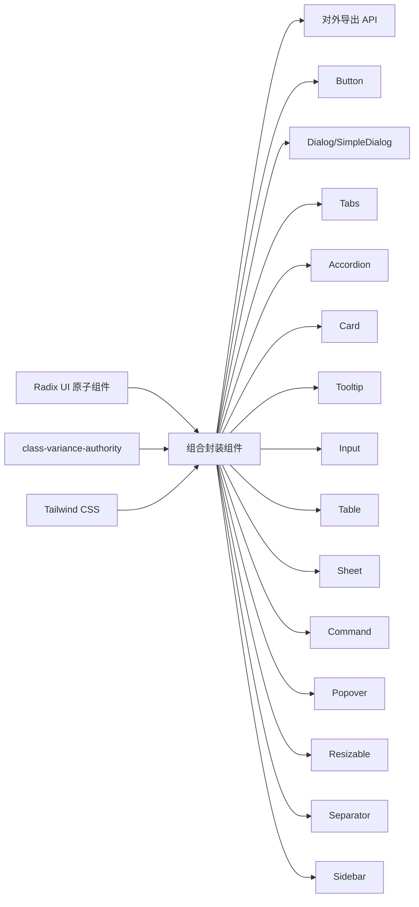

图表来源
- [button.tsx:1-58](file://app/frontend/src/components/ui/button.tsx#L1-L58)
- [dialog.tsx:1-113](file://app/frontend/src/components/ui/dialog.tsx#L1-L113)
- [tabs.tsx:1-54](file://app/frontend/src/components/ui/tabs.tsx#L1-L54)
- [accordion.tsx:1-56](file://app/frontend/src/components/ui/accordion.tsx#L1-L56)
- [card.tsx:1-78](file://app/frontend/src/components/ui/card.tsx#L1-L78)
- [tooltip.tsx:1-31](file://app/frontend/src/components/ui/tooltip.tsx#L1-L31)
- [input.tsx:1-23](file://app/frontend/src/components/ui/input.tsx#L1-L23)
- [table.tsx:1-121](file://app/frontend/src/components/ui/table.tsx#L1-L121)
- [sheet.tsx:1-141](file://app/frontend/src/components/ui/sheet.tsx#L1-L141)
- [command.tsx:1-146](file://app/frontend/src/components/ui/command.tsx#L1-L146)
- [popover.tsx:1-32](file://app/frontend/src/components/ui/popover.tsx#L1-L32)
- [resizable.tsx:1-44](file://app/frontend/src/components/ui/resizable.tsx#L1-L44)
- [separator.tsx:1-30](file://app/frontend/src/components/ui/separator.tsx#L1-L30)
- [sidebar.tsx:1-773](file://app/frontend/src/components/ui/sidebar.tsx#L1-L773)

## 详细组件分析

### 按钮 Button
- 设计原则
  - 通过变体系统区分默认、破坏性、描边、次级、幽灵、链接等外观。
  - 通过尺寸系统提供默认、小号、大号、图标四种尺寸。
  - 支持 asChild 插槽模式，允许将 Button 渲染为任意元素。
  - 保持可访问性：聚焦可见环、禁用态指针事件与透明度。
- 关键实现点
  - 使用 class-variance-authority 定义变体与默认值。
  - forwardRef 包裹，透传原生 button 属性。
  - 与 cn 工具函数组合，合并外部 className。
- 事件与状态
  - 作为原生 button，支持 onClick、onMouseDown 等事件。
  - 禁用态由 disabled 控制，视觉与交互均禁用。
- 可访问性
  - 聚焦环与动画、禁用态透明度与指针事件。
- 使用示例
  - 默认按钮与不同变体、尺寸、禁用态、作为链接使用等。

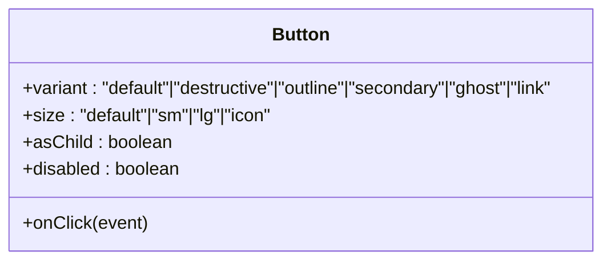

图表来源
- [button.tsx:37-55](file://app/frontend/src/components/ui/button.tsx#L37-L55)

章节来源
- [button.tsx:1-58](file://app/frontend/src/components/ui/button.tsx#L1-L58)

### 对话框 Dialog
- 设计原则
  - 模态遮罩：全屏覆盖，点击背景可关闭。
  - 内容区：居中展示，带动画入场/出场。
  - 结构化：Overlay、Portal、Content、Header/Footer、Title/Description、Close。
- 关键实现点
  - Portal 将内容挂载到指定容器，避免层级问题。
  - Overlay 使用 data-[state] 实现开合动画。
  - Content 使用 translate 与居中定位，配合动画类。
  - Close 按钮包含 sr-only 文本，提升可访问性。
- 状态与事件
  - 通过 Radix UI Root/Trigger/Close 控制打开/关闭。
  - 支持键盘 ESC 关闭（由 Radix UI 提供）。
- 可访问性
  - sr-only 文本、聚焦管理、动画状态同步。
- 使用示例
  - 触发器、标题、描述、按钮组、关闭按钮等组合使用。

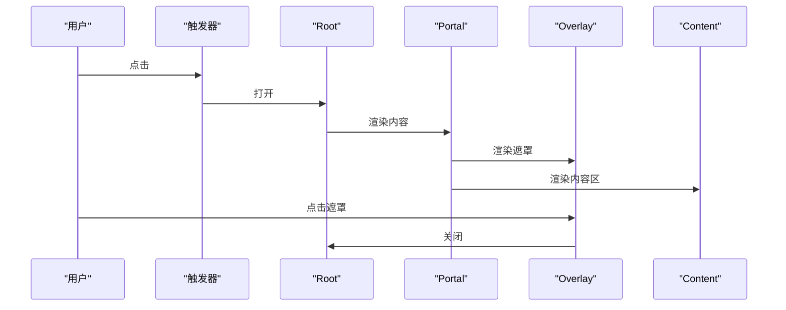

图表来源
- [dialog.tsx:7-52](file://app/frontend/src/components/ui/dialog.tsx#L7-L52)

章节来源
- [dialog.tsx:1-113](file://app/frontend/src/components/ui/dialog.tsx#L1-L113)

### 表格 Table
- 设计原则
  - 语义化结构：thead、tbody、tfoot、tr、th、td。
  - 响应式滚动容器，避免溢出。
  - 交互态：悬停高亮、选中态、复选框对齐。
- 关键实现点
  - Table 外层包裹滚动容器，保证小屏可横向滚动。
  - 各子组件 forwardRef 包裹，透传属性。
  - 通过 data-[state] 与 hover 类实现状态样式。
- 排序与筛选
  - 通过外部逻辑在组件外实现排序与筛选，组件仅负责渲染。
- 分页
  - 通过外部分页控件与 Table 组合使用，组件不内建分页。
- 使用示例
  - 表头、表体、表尾、行、单元格、标题、描述等组合使用。

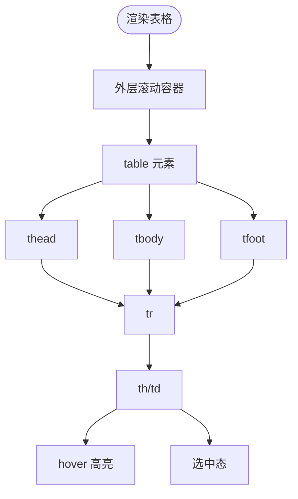

图表来源
- [table.tsx:5-119](file://app/frontend/src/components/ui/table.tsx#L5-L119)

章节来源
- [table.tsx:1-121](file://app/frontend/src/components/ui/table.tsx#L1-L121)

### 输入 Input
- 设计原则
  - 统一边框、背景、占位符颜色与聚焦环。
  - 禁用态透明度与指针样式。
  - 支持类型与通用属性透传。
- 关键实现点
  - forwardRef 包裹，透传原生 input 属性。
  - 使用 cn 合并外部样式。
- 验证与格式化
  - 通过外部表单库或受控组件实现校验与格式化。
- 使用示例
  - 文本输入、密码、数字、禁用态等。

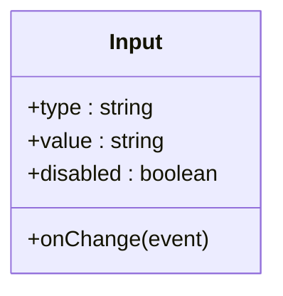

图表来源
- [input.tsx:5-20](file://app/frontend/src/components/ui/input.tsx#L5-L20)

章节来源
- [input.tsx:1-23](file://app/frontend/src/components/ui/input.tsx#L1-L23)

### 手风琴 Accordion
- 设计原则
  - Header/Trigger 带 ChevronDown 指示器，旋转表示展开状态。
  - Content 使用 data-[state] 控制动画开合。
- 关键实现点
  - Trigger 包含 ChevronDown，展开时旋转 180°。
  - Content 外层包裹 overflow-hidden 并设置动画类。
- 使用示例
  - Accordion.Root + Item + Trigger + Content 组合。

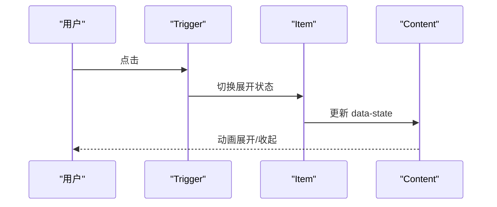

图表来源
- [accordion.tsx:21-53](file://app/frontend/src/components/ui/accordion.tsx#L21-L53)

章节来源
- [accordion.tsx:1-56](file://app/frontend/src/components/ui/accordion.tsx#L1-L56)

### 标签页 Tabs
- 设计原则
  - Tabs.List 提供容器背景与间距。
  - Tabs.Trigger 在激活态显示强调样式与阴影。
  - Tabs.Content 提供聚焦环与内容区。
- 关键实现点
  - 使用 data-[state=active] 控制激活态样式。
  - 聚焦可见环与禁用态透明度。
- 使用示例
  - Tabs.Root + List + Trigger + Content 组合。

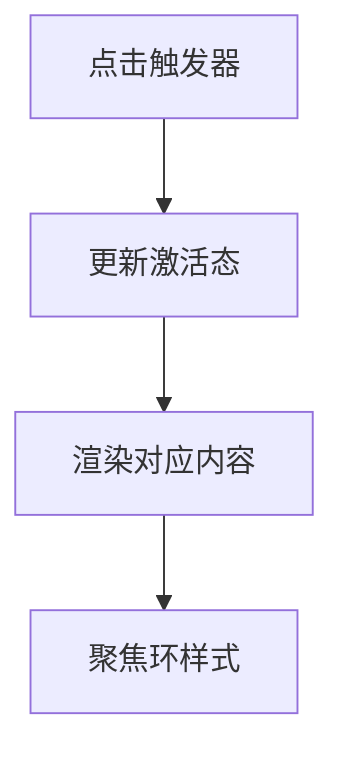

图表来源
- [tabs.tsx:8-51](file://app/frontend/src/components/ui/tabs.tsx#L8-L51)

章节来源
- [tabs.tsx:1-54](file://app/frontend/src/components/ui/tabs.tsx#L1-L54)

### 卡片 Card
- 设计原则
  - Card 容器提供边框与阴影，内部区域按 Header/Title/Description/Content/Footer 组织。
- 关键实现点
  - 各子组件 forwardRef 包裹，透传属性。
  - Footer 提供 Flex 对齐，Content 提供上边距控制。
- 使用示例
  - 标题、描述、内容、底部按钮等组合。

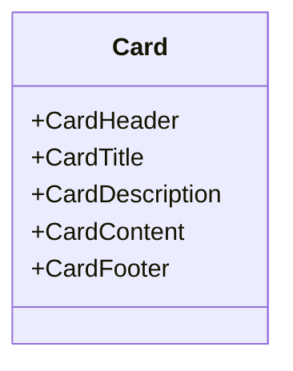

图表来源
- [card.tsx:5-76](file://app/frontend/src/components/ui/card.tsx#L5-L76)

章节来源
- [card.tsx:1-78](file://app/frontend/src/components/ui/card.tsx#L1-L78)

### 工具提示 Tooltip
- 设计原则
  - TooltipProvider 提供上下文，TooltipTrigger 触发，TooltipContent 显示。
  - 支持多方向定位与动画入场/出场。
- 关键实现点
  - Portal 渲染到文档根部，避免层级问题。
  - data-[state] 与 data-[side] 控制动画与定位。
- 使用示例
  - 触发器 + 内容 + 方向偏移。

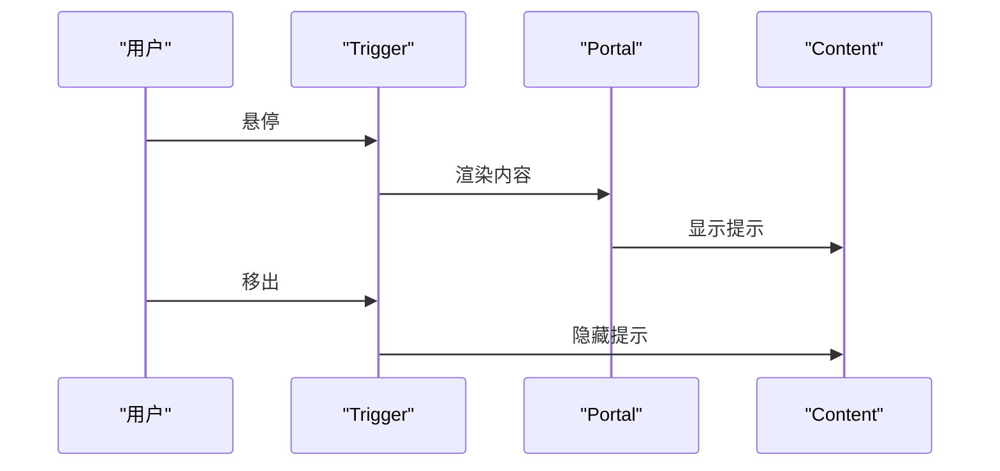

图表来源
- [tooltip.tsx:6-28](file://app/frontend/src/components/ui/tooltip.tsx#L6-L28)

章节来源
- [tooltip.tsx:1-31](file://app/frontend/src/components/ui/tooltip.tsx#L1-L31)

### 徽标 Badge
- 设计原则
  - 多种变体：次级、破坏性、警告、成功、描边等。
  - 统一圆角与内边距，支持边框与阴影。
- 关键实现点
  - 使用 cva 定义变体，forwardRef 包裹。
- 使用示例
  - 状态徽标、标签徽标等。

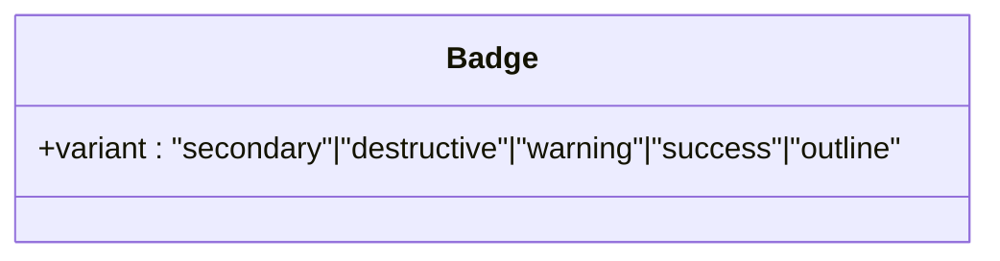

图表来源
- [badge.tsx:25-33](file://app/frontend/src/components/ui/badge.tsx#L25-L33)

章节来源
- [badge.tsx:1-36](file://app/frontend/src/components/ui/badge.tsx#L1-L36)

### 复选框 Checkbox
- 设计原则
  - 基于 Radix UI，支持选中态背景与文本色。
  - 焦点环、禁用态透明度与指针事件。
- 关键实现点
  - Indicator 内置 Check 图标，随选中态变化。
- 使用示例
  - 受控/非受控、禁用态。

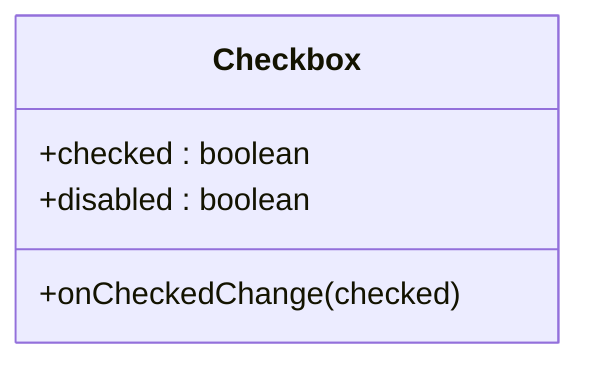

图表来源
- [checkbox.tsx:7-26](file://app/frontend/src/components/ui/checkbox.tsx#L7-L26)

章节来源
- [checkbox.tsx:1-29](file://app/frontend/src/components/ui/checkbox.tsx#L1-L29)

### 命令面板 Command
- 设计原则
  - 基于 Dialog 与 cmdk，提供搜索输入、分组、条目、快捷键显示。
  - 内置 CommandDialog、CommandInput、CommandList、CommandEmpty、CommandGroup、CommandItem、CommandSeparator、CommandShortcut。
- 关键实现点
  - CommandDialog 将 Dialog 与 Command 组合，设置样式与滚动。
  - CommandInput 内置 Search 图标与输入框。
  - CommandList 设置最大高度与纵向滚动。
- 使用示例
  - 打开命令面板、输入关键字、选择条目、显示分组与快捷键。

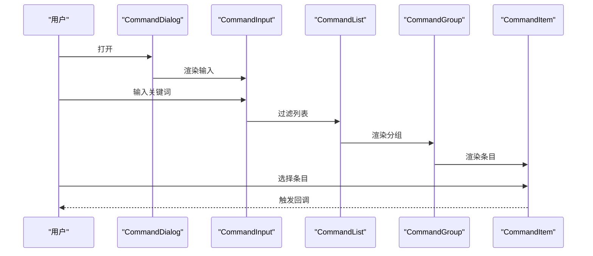

图表来源
- [command.tsx:24-145](file://app/frontend/src/components/ui/command.tsx#L24-L145)

章节来源
- [command.tsx:1-146](file://app/frontend/src/components/ui/command.tsx#L1-L146)

### 弹出层 Popover
- 设计原则
  - 触发后弹出内容，支持对齐与偏移。
  - 使用 Portal 避免层级问题。
- 关键实现点
  - Content 支持 align 与 sideOffset，默认居中对齐。
- 使用示例
  - 触发器 + 内容 + 对齐配置。

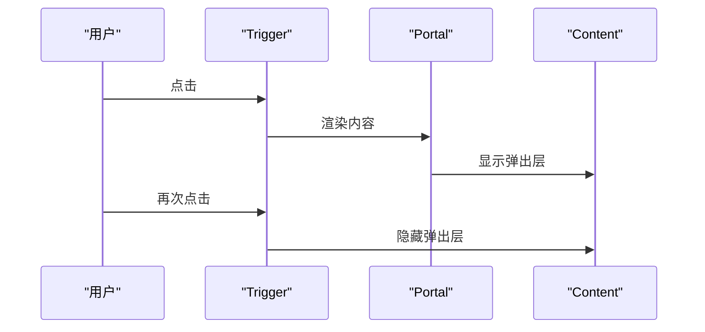

图表来源
- [popover.tsx:8-29](file://app/frontend/src/components/ui/popover.tsx#L8-L29)

章节来源
- [popover.tsx:1-32](file://app/frontend/src/components/ui/popover.tsx#L1-L32)

### 可调整面板 Resizable
- 设计原则
  - 支持水平/垂直面板拖拽，Handle 上可显示手柄。
  - 使用 react-resizable-panels 提供拖拽能力。
- 关键实现点
  - PanelGroup、Panel、PanelResizeHandle 组合。
  - Handle 支持 withHandle 显示 grip。
- 使用示例
  - 两列/多列布局、拖拽调整宽度/高度。

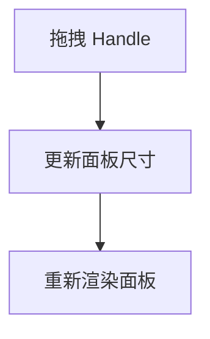

图表来源
- [resizable.tsx:6-41](file://app/frontend/src/components/ui/resizable.tsx#L6-L41)

章节来源
- [resizable.tsx:1-44](file://app/frontend/src/components/ui/resizable.tsx#L1-L44)

### 分割线 Separator
- 设计原则
  - 支持水平/垂直方向，提供装饰性与语义化控制。
- 关键实现点
  - 根据方向设置宽高与背景色。
- 使用示例
  - 水平分割线用于段落间分隔，垂直分割线用于侧栏分隔。

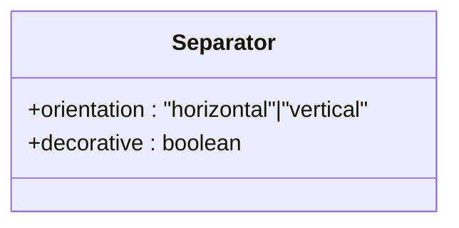

图表来源
- [separator.tsx:6-26](file://app/frontend/src/components/ui/separator.tsx#L6-L26)

章节来源
- [separator.tsx:1-30](file://app/frontend/src/components/ui/separator.tsx#L1-L30)

### 抽屉 Sheet
- 设计原则
  - 从侧边滑入的模态容器，支持 top、bottom、left、right 四个方向。
  - Overlay 与 Content 分离，支持关闭按钮与标题/描述。
- 关键实现点
  - sheetVariants 定义不同方向的动画与定位。
  - Portal 渲染，支持关闭按钮与 sr-only 文本。
- 使用示例
  - 侧边抽屉、顶部/底部抽屉、关闭按钮与标题描述。

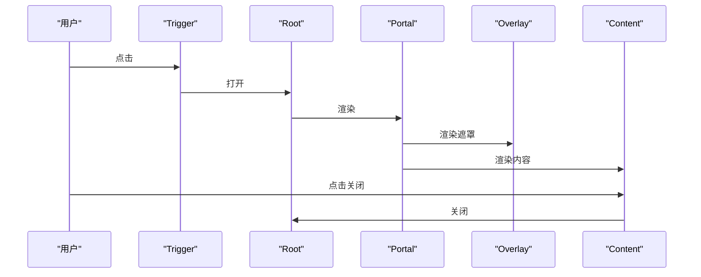

图表来源
- [sheet.tsx:10-75](file://app/frontend/src/components/ui/sheet.tsx#L10-L75)

章节来源
- [sheet.tsx:1-141](file://app/frontend/src/components/ui/sheet.tsx#L1-L141)

### 侧边栏 Sidebar
- 设计原则
  - 支持左侧/右侧、浮动/嵌入等变体，折叠/展开状态管理。
  - 移动端使用 Sheet，桌面端使用固定/浮动布局。
  - 键盘快捷键（Cmd/Ctrl+B）快速切换。
  - Cookie 记忆折叠状态。
- 关键实现点
  - SidebarProvider 管理状态与回调，useSidebar 提供上下文。
  - Sidebar 支持 collapsible 三种模式：offcanvas、icon、none。
  - 内置菜单组、菜单项、按钮、动作、子菜单等。
  - TooltipProvider 与 Tooltip 配合，折叠状态下显示提示。
- 使用示例
  - Provider + Sidebar + SidebarTrigger + SidebarContent + 菜单项组合。

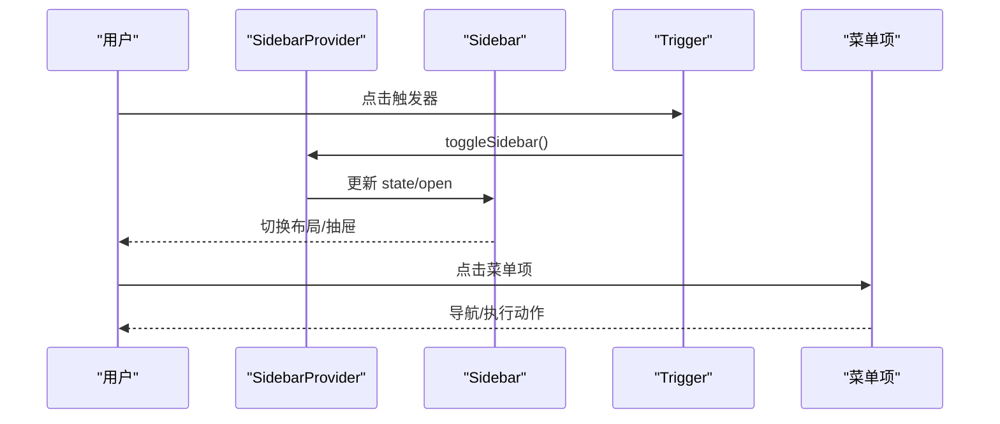

图表来源
- [sidebar.tsx:54-160](file://app/frontend/src/components/ui/sidebar.tsx#L54-L160)
- [sidebar.tsx:163-267](file://app/frontend/src/components/ui/sidebar.tsx#L163-L267)
- [sidebar.tsx:270-294](file://app/frontend/src/components/ui/sidebar.tsx#L270-L294)

章节来源
- [sidebar.tsx:1-773](file://app/frontend/src/components/ui/sidebar.tsx#L1-L773)

## 依赖分析
- 组件间耦合
  - 大多数组件为纯展示型，彼此低耦合。
  - Sidebar 依赖 Button、Input、Separator、Tooltip、Sheet、Skeleton 等组件。
  - Command 依赖 Dialog 与 cmdk。
  - Tooltip、Popover、Dialog、Sheet 均依赖 Radix UI。
- 外部依赖
  - @radix-ui/react-*：可访问性与状态管理。
  - lucide-react：图标。
  - class-variance-authority：变体系统。
  - cmdk：命令面板。
  - react-resizable-panels：可调整面板。
- 主题与样式
  - Tailwind CSS 提供基础样式，组件通过 cn 合并类名。
  - 变体系统统一尺寸与外观。

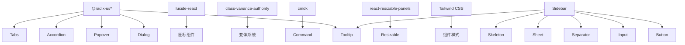

图表来源
- [dialog.tsx:1-3](file://app/frontend/src/components/ui/dialog.tsx#L1-L3)
- [tooltip.tsx:1-2](file://app/frontend/src/components/ui/tooltip.tsx#L1-L2)
- [popover.tsx:3-4](file://app/frontend/src/components/ui/popover.tsx#L3-L4)
- [accordion.tsx:2-3](file://app/frontend/src/components/ui/accordion.tsx#L2-L3)
- [tabs.tsx:1-2](file://app/frontend/src/components/ui/tabs.tsx#L1-L2)
- [command.tsx:1-2](file://app/frontend/src/components/ui/command.tsx#L1-L2)
- [resizable.tsx:2-3](file://app/frontend/src/components/ui/resizable.tsx#L2-L3)
- [sidebar.tsx:6-22](file://app/frontend/src/components/ui/sidebar.tsx#L6-L22)

章节来源
- [dialog.tsx:1-113](file://app/frontend/src/components/ui/dialog.tsx#L1-L113)
- [tooltip.tsx:1-31](file://app/frontend/src/components/ui/tooltip.tsx#L1-L31)
- [popover.tsx:1-32](file://app/frontend/src/components/ui/popover.tsx#L1-L32)
- [accordion.tsx:1-56](file://app/frontend/src/components/ui/accordion.tsx#L1-L56)
- [tabs.tsx:1-54](file://app/frontend/src/components/ui/tabs.tsx#L1-L54)
- [command.tsx:1-146](file://app/frontend/src/components/ui/command.tsx#L1-L146)
- [resizable.tsx:1-44](file://app/frontend/src/components/ui/resizable.tsx#L1-L44)
- [sidebar.tsx:1-773](file://app/frontend/src/components/ui/sidebar.tsx#L1-L773)

## 性能考虑
- 动画与渲染
  - 避免在动画过程中进行昂贵计算，优先使用 CSS 动画。
  - Portal 渲染减少 DOM 层级，降低重排影响。
- 事件与状态
  - 使用 React.memo 或稳定回调减少重渲染。
  - 控制状态粒度，避免不必要的全局状态更新。
- 可访问性
  - 保持焦点顺序与可见环，避免隐藏元素仍可接收焦点。
- 样式
  - 合理使用 Tailwind 工具类，避免生成过多未使用的类。

## 故障排查指南
- 对话框/抽屉无法关闭
  - 检查是否正确使用 Root/Trigger/Close 组合。
  - 确认 Portal 是否正确挂载。
- 焦点与键盘导航
  - 确保内容区有可聚焦元素，或显式管理焦点。
  - 检查是否有阻止默认行为的代码。
- 动画异常
  - 检查 data-[state] 是否正确传递。
  - 确认动画类名拼写与顺序。
- 可访问性
  - 确保 sr-only 文本存在且与交互一致。
  - 检查禁用态与不可用态的视觉反馈。

## 结论
该 UI 组件库以 Radix UI 为基础，结合 Tailwind CSS 与变体系统，提供了高可定制、强可访问性的组件集合。通过清晰的结构与一致的 API，开发者可以快速搭建复杂界面，并在不同设备与主题下保持一致体验。

## 附录：API 参考与使用示例
- 按钮 Button
  - API：支持 variant、size、asChild、disabled 等属性。
  - 示例路径：[button.tsx:37-55](file://app/frontend/src/components/ui/button.tsx#L37-L55)
- 对话框 Dialog
  - API：Dialog、DialogTrigger、DialogPortal、DialogOverlay、DialogContent、DialogHeader、DialogFooter、DialogTitle、DialogDescription、DialogClose。
  - 示例路径：[dialog.tsx:7-112](file://app/frontend/src/components/ui/dialog.tsx#L7-L112)
- 表格 Table
  - API：Table、TableHeader、TableBody、TableFooter、TableRow、TableHead、TableCell、TableCaption。
  - 示例路径：[table.tsx:5-120](file://app/frontend/src/components/ui/table.tsx#L5-L120)
- 输入 Input
  - API：支持 type、disabled、onChange 等原生属性。
  - 示例路径：[input.tsx:5-20](file://app/frontend/src/components/ui/input.tsx#L5-L20)
- 手风琴 Accordion
  - API：Accordion、AccordionItem、AccordionTrigger、AccordionContent。
  - 示例路径：[accordion.tsx:7-55](file://app/frontend/src/components/ui/accordion.tsx#L7-L55)
- 标签页 Tabs
  - API：Tabs、TabsList、TabsTrigger、TabsContent。
  - 示例路径：[tabs.tsx:6-53](file://app/frontend/src/components/ui/tabs.tsx#L6-L53)
- 卡片 Card
  - API：Card、CardHeader、CardTitle、CardDescription、CardContent、CardFooter。
  - 示例路径：[card.tsx:5-76](file://app/frontend/src/components/ui/card.tsx#L5-L76)
- 工具提示 Tooltip
  - API：TooltipProvider、Tooltip、TooltipTrigger、TooltipContent。
  - 示例路径：[tooltip.tsx:6-30](file://app/frontend/src/components/ui/tooltip.tsx#L6-L30)
- 徽标 Badge
  - API：Badge，支持 variant。
  - 示例路径：[badge.tsx:25-33](file://app/frontend/src/components/ui/badge.tsx#L25-L33)
- 复选框 Checkbox
  - API：Checkbox，支持 checked、onCheckedChange、disabled。
  - 示例路径：[checkbox.tsx:7-26](file://app/frontend/src/components/ui/checkbox.tsx#L7-L26)
- 命令面板 Command
  - API：Command、CommandDialog、CommandInput、CommandList、CommandEmpty、CommandGroup、CommandItem、CommandSeparator、CommandShortcut。
  - 示例路径：[command.tsx:9-145](file://app/frontend/src/components/ui/command.tsx#L9-L145)
- 弹出层 Popover
  - API：Popover、PopoverTrigger、PopoverContent。
  - 示例路径：[popover.tsx:8-31](file://app/frontend/src/components/ui/popover.tsx#L8-L31)
- 可调整面板 Resizable
  - API：ResizablePanelGroup、ResizablePanel、ResizableHandle。
  - 示例路径：[resizable.tsx:6-43](file://app/frontend/src/components/ui/resizable.tsx#L6-L43)
- 分割线 Separator
  - API：Separator，支持 orientation、decorative。
  - 示例路径：[separator.tsx:6-27](file://app/frontend/src/components/ui/separator.tsx#L6-L27)
- 抽屉 Sheet
  - API：Sheet、SheetTrigger、SheetPortal、SheetOverlay、SheetContent、SheetHeader、SheetFooter、SheetTitle、SheetDescription、SheetClose。
  - 示例路径：[sheet.tsx:10-140](file://app/frontend/src/components/ui/sheet.tsx#L10-L140)
- 侧边栏 Sidebar
  - API：SidebarProvider、Sidebar、SidebarTrigger、SidebarRail、SidebarInset、SidebarInput、SidebarHeader、SidebarFooter、SidebarSeparator、SidebarContent、SidebarGroup、SidebarGroupLabel、SidebarGroupAction、SidebarGroupContent、SidebarMenu、SidebarMenuItem、SidebarMenuButton、SidebarMenuAction、SidebarMenuBadge、SidebarMenuSkeleton、SidebarMenuSub、SidebarMenuSubItem、SidebarMenuSubButton、useSidebar。
  - 示例路径：[sidebar.tsx:54-771](file://app/frontend/src/components/ui/sidebar.tsx#L54-L771)