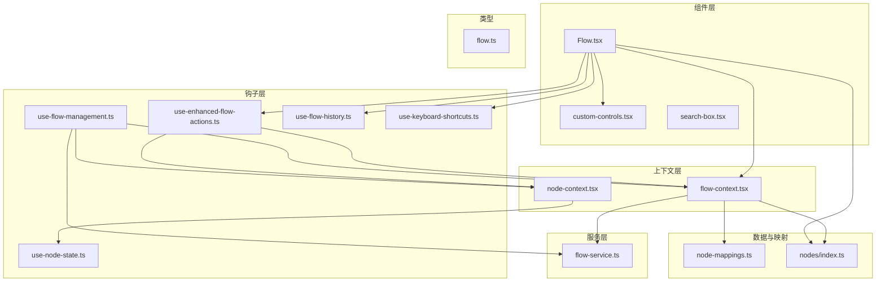
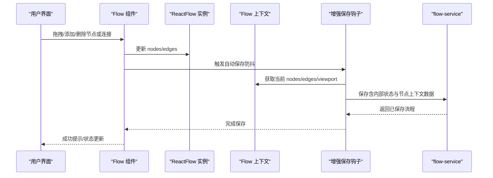
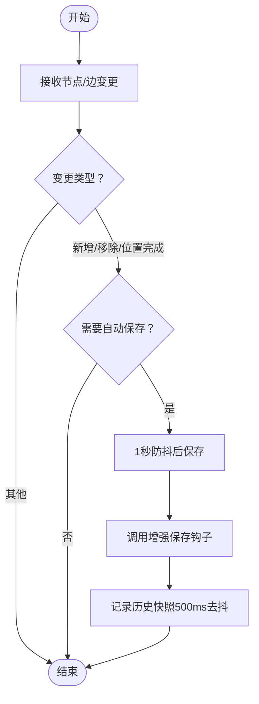
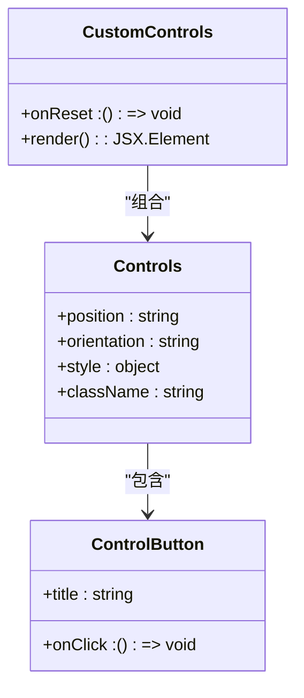
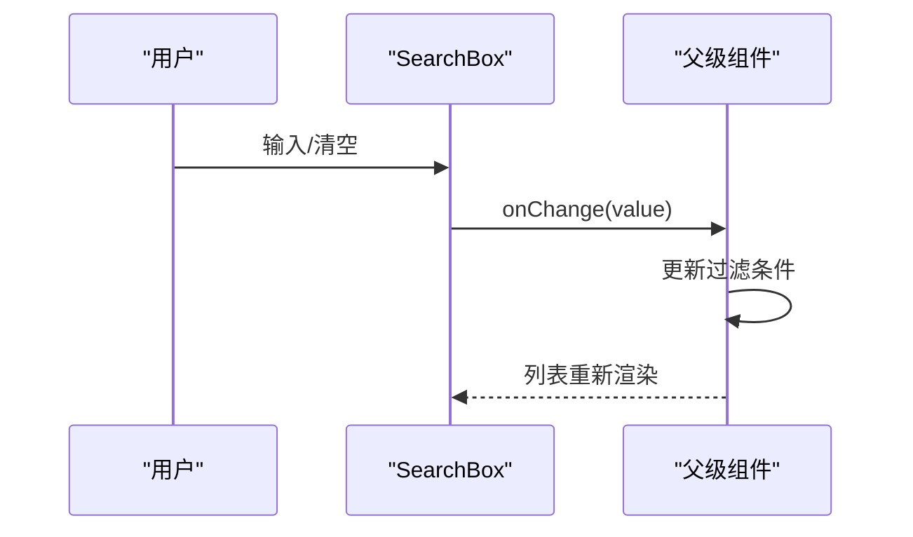
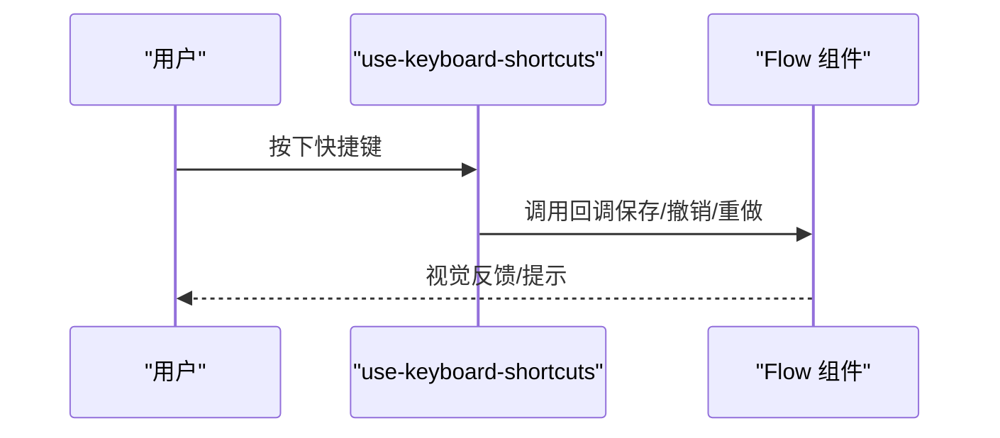
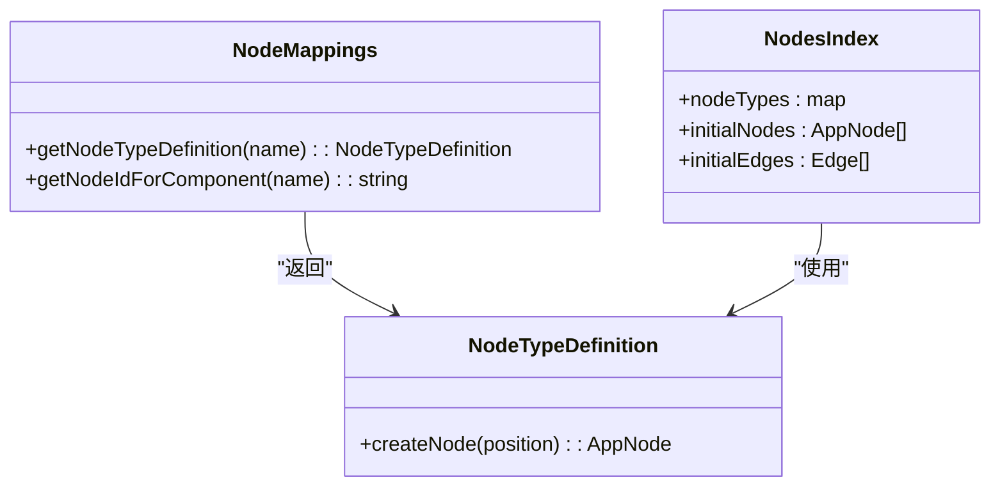
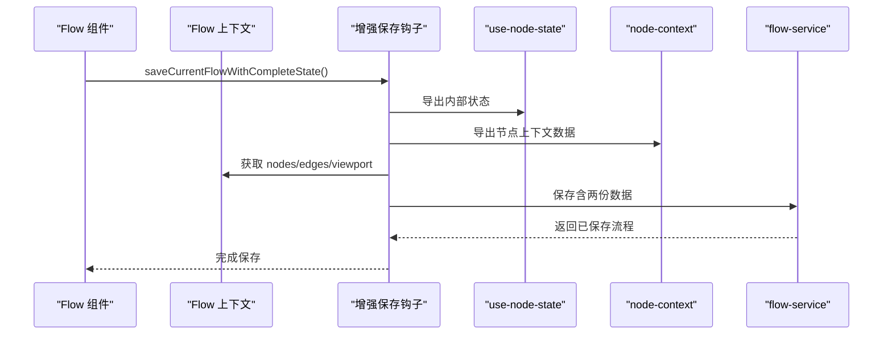
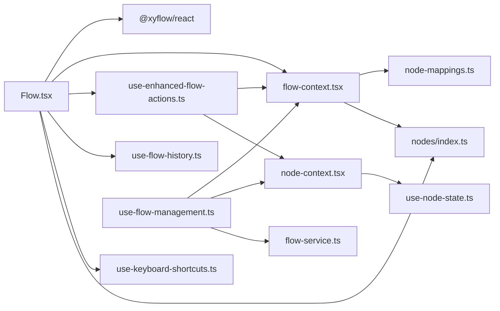

# 工作流组件

<cite>
**本文引用的文件**
- [Flow.tsx](file://app/frontend/src/components/Flow.tsx)
- [custom-controls.tsx](file://app/frontend/src/components/custom-controls.tsx)
- [flow-context.tsx](file://app/frontend/src/contexts/flow-context.tsx)
- [use-flow-management.ts](file://app/frontend/src/hooks/use-flow-management.ts)
- [search-box.tsx](file://app/frontend/src/components/panels/search-box.tsx)
- [use-keyboard-shortcuts.ts](file://app/frontend/src/hooks/use-keyboard-shortcuts.ts)
- [use-enhanced-flow-actions.ts](file://app/frontend/src/hooks/use-enhanced-flow-actions.ts)
- [use-flow-history.ts](file://app/frontend/src/hooks/use-flow-history.ts)
- [use-node-state.ts](file://app/frontend/src/hooks/use-node-state.ts)
- [node-context.tsx](file://app/frontend/src/contexts/node-context.tsx)
- [node-mappings.ts](file://app/frontend/src/data/node-mappings.ts)
- [nodes/index.ts](file://app/frontend/src/nodes/index.ts)
- [flow-service.ts](file://app/frontend/src/services/flow-service.ts)
- [flow.ts](file://app/frontend/src/types/flow.ts)
</cite>

## 目录
1. [简介](#简介)
2. [项目结构](#项目结构)
3. [核心组件](#核心组件)
4. [架构总览](#架构总览)
5. [详细组件分析](#详细组件分析)
6. [依赖关系分析](#依赖关系分析)
7. [性能考量](#性能考量)
8. [故障排查指南](#故障排查指南)
9. [结论](#结论)
10. [附录：使用示例与最佳实践](#附录使用示例与最佳实践)

## 简介
本文件系统性地解析前端工作流组件（Flow 组件）的设计与实现，覆盖以下主题：
- 工作流图的渲染、节点拖拽、连接线绘制与状态管理
- 顶部工具栏与快捷键支持
- 搜索框组件的节点搜索、过滤与导航
- 自定义控制组件的设计模式与扩展机制
- 组件间通信、事件处理与状态同步
- 实际使用示例与最佳实践

## 项目结构
工作流相关代码主要位于前端 src 目录下，采用按功能分层组织：
- 组件层：Flow.tsx、custom-controls.tsx、search-box.tsx
- 上下文层：flow-context.tsx、node-context.tsx
- 钩子层：use-flow-management.ts、use-enhanced-flow-actions.ts、use-flow-history.ts、use-keyboard-shortcuts.ts、use-node-state.ts
- 数据与映射：node-mappings.ts、nodes/index.ts
- 服务层：flow-service.ts
- 类型定义：flow.ts

**图表来源**
- [Flow.tsx:1-313](file://app/frontend/src/components/Flow.tsx#L1-L313)
- [custom-controls.tsx:1-21](file://app/frontend/src/components/custom-controls.tsx#L1-L21)
- [search-box.tsx:1-43](file://app/frontend/src/components/panels/search-box.tsx#L1-L43)
- [flow-context.tsx:1-358](file://app/frontend/src/contexts/flow-context.tsx#L1-L358)
- [use-flow-management.ts:1-336](file://app/frontend/src/hooks/use-flow-management.ts#L1-L336)
- [use-enhanced-flow-actions.ts:1-112](file://app/frontend/src/hooks/use-enhanced-flow-actions.ts#L1-L112)
- [use-flow-history.ts:1-171](file://app/frontend/src/hooks/use-flow-history.ts#L1-L171)
- [use-keyboard-shortcuts.ts:1-165](file://app/frontend/src/hooks/use-keyboard-shortcuts.ts#L1-L165)
- [use-node-state.ts:1-268](file://app/frontend/src/hooks/use-node-state.ts#L1-L268)
- [node-context.tsx:1-438](file://app/frontend/src/contexts/node-context.tsx#L1-L438)
- [node-mappings.ts:1-140](file://app/frontend/src/data/node-mappings.ts#L1-L140)
- [nodes/index.ts:1-60](file://app/frontend/src/nodes/index.ts#L1-L60)
- [flow-service.ts:1-108](file://app/frontend/src/services/flow-service.ts#L1-L108)
- [flow.ts:1-13](file://app/frontend/src/types/flow.ts#L1-L13)

**章节来源**
- [Flow.tsx:1-313](file://app/frontend/src/components/Flow.tsx#L1-L313)
- [flow-context.tsx:1-358](file://app/frontend/src/contexts/flow-context.tsx#L1-L358)

## 核心组件
- Flow 组件：基于 @xyflow/react 的画布容器，负责节点与边的状态管理、自动保存、历史快照、键盘快捷键绑定以及背景网格渲染。
- 自定义控制组件：在画布右下角提供重置等控制按钮，可扩展为缩放、适配视图等。
- 搜索框组件：左侧组件面板顶部的输入框，支持清空与实时过滤。
- 流上下文：集中管理当前流程 ID、名称、未保存标记、新增节点、保存/加载/新建流程等。
- 节点上下文：维护运行时状态（消息、分析、输出等），支持按流程隔离。
- 增强保存钩子：在保存时同时持久化“内部状态”和“节点上下文数据”。

**章节来源**
- [Flow.tsx:34-313](file://app/frontend/src/components/Flow.tsx#L34-L313)
- [custom-controls.tsx:8-21](file://app/frontend/src/components/custom-controls.tsx#L8-L21)
- [search-box.tsx:10-43](file://app/frontend/src/components/panels/search-box.tsx#L10-L43)
- [flow-context.tsx:35-358](file://app/frontend/src/contexts/flow-context.tsx#L35-L358)
- [node-context.tsx:90-438](file://app/frontend/src/contexts/node-context.tsx#L90-L438)
- [use-enhanced-flow-actions.ts:20-112](file://app/frontend/src/hooks/use-enhanced-flow-actions.ts#L20-L112)

## 架构总览
工作流组件围绕“React Flow + 自定义上下文 + 钩子”的模式构建，形成清晰的职责分离：
- 渲染与交互：Flow 组件负责 ReactFlow 实例、节点/边变更、连接、主题与背景。
- 状态与持久化：Flow 上下文与增强保存钩子负责配置状态与运行时状态的合并持久化。
- 历史与撤销：历史钩子为每个流程独立维护快照栈，支持撤销/重做。
- 快捷键与工具栏：键盘钩子统一处理快捷键；自定义控制组件提供可视化工具。
- 节点与映射：节点类型注册与节点映射负责节点创建与唯一 ID 生成。

**图表来源**
- [Flow.tsx:92-143](file://app/frontend/src/components/Flow.tsx#L92-L143)
- [use-enhanced-flow-actions.ts:21-72](file://app/frontend/src/hooks/use-enhanced-flow-actions.ts#L21-L72)
- [flow-context.tsx:75-131](file://app/frontend/src/contexts/flow-context.tsx#L75-L131)
- [flow-service.ts:47-74](file://app/frontend/src/services/flow-service.ts#L47-L74)

## 详细组件分析

### Flow 组件（工作流画布）
- 负责：
  - 初始化 ReactFlow 实例，设置节点/边类型与变更处理器
  - 主题感知的颜色模式与网格背景
  - 连接创建时追加箭头标记并立即触发保存
  - 节点/边变更的智能自动保存（新增、移除、位置变更完成时）
  - 初始快照与去抖动快照策略
  - 键盘快捷键：保存、撤销/重做
- 关键点：
  - 使用 useNodesState/useEdgesState 管理状态
  - onConnect 创建带箭头标记的边并立即持久化
  - handleNodesChange/handleEdgesChange 区分变更类型决定是否自动保存
  - 自动保存采用 1 秒防抖，避免频繁写入
  - 历史快照每 500ms 去抖一次，避免 UI 选择状态导致的重复快照

**图表来源**
- [Flow.tsx:92-143](file://app/frontend/src/components/Flow.tsx#L92-L143)
- [Flow.tsx:169-178](file://app/frontend/src/components/Flow.tsx#L169-L178)
- [use-enhanced-flow-actions.ts:21-72](file://app/frontend/src/hooks/use-enhanced-flow-actions.ts#L21-L72)

**章节来源**
- [Flow.tsx:34-313](file://app/frontend/src/components/Flow.tsx#L34-L313)

### 自定义控制组件（CustomControls）
- 设计模式：基于 @xyflow/react 的 Controls/ControlButton，提供可插拔的 UI 控件
- 扩展机制：通过 props 注入回调（如 onReset），可轻松增加缩放、适配视图、清空画布等功能
- 样式：使用 Tailwind 类名进行外观定制，保持与主题一致

**图表来源**
- [custom-controls.tsx:8-21](file://app/frontend/src/components/custom-controls.tsx#L8-L21)

**章节来源**
- [custom-controls.tsx:1-21](file://app/frontend/src/components/custom-controls.tsx#L1-L21)

### 搜索框组件（SearchBox）
- 功能：输入关键词过滤组件列表，支持清空按钮
- 导航：结合 use-flow-management 的过滤逻辑，实现“输入即过滤”
- 交互：onChange 回调驱动父级状态更新，从而影响列表渲染

**图表来源**
- [search-box.tsx:10-43](file://app/frontend/src/components/panels/search-box.tsx#L10-L43)
- [use-flow-management.ts:219-224](file://app/frontend/src/hooks/use-flow-management.ts#L219-L224)

**章节来源**
- [search-box.tsx:1-43](file://app/frontend/src/components/panels/search-box.tsx#L1-L43)
- [use-flow-management.ts:219-236](file://app/frontend/src/hooks/use-flow-management.ts#L219-L236)

### 快捷键与工具栏
- 快捷键钩子：统一处理 Ctrl/Cmd + S、Ctrl/Cmd + Z/Shift+Z、Ctrl/Cmd + I/B/J 等
- Flow 组件：绑定保存与撤销/重做快捷键，防止默认行为
- 工具栏：可扩展为菜单按钮、缩放、适配视图等，配合快捷键提升效率

**图表来源**
- [use-keyboard-shortcuts.ts:17-65](file://app/frontend/src/hooks/use-keyboard-shortcuts.ts#L17-L65)
- [Flow.tsx:197-230](file://app/frontend/src/components/Flow.tsx#L197-L230)

**章节来源**
- [use-keyboard-shortcuts.ts:1-165](file://app/frontend/src/hooks/use-keyboard-shortcuts.ts#L1-L165)
- [Flow.tsx:197-230](file://app/frontend/src/components/Flow.tsx#L197-L230)

### 节点与边的类型系统
- 节点类型注册：nodes/index.ts 将各节点组件注册到 ReactFlow
- 节点映射：node-mappings.ts 提供节点创建工厂与唯一 ID 生成策略
- 多节点组：flow-context.tsx 支持多节点组一次性添加并建立边

**图表来源**
- [node-mappings.ts:118-133](file://app/frontend/src/data/node-mappings.ts#L118-L133)
- [nodes/index.ts:52-60](file://app/frontend/src/nodes/index.ts#L52-L60)
- [flow-context.tsx:217-331](file://app/frontend/src/contexts/flow-context.tsx#L217-L331)

**章节来源**
- [nodes/index.ts:1-60](file://app/frontend/src/nodes/index.ts#L1-L60)
- [node-mappings.ts:1-140](file://app/frontend/src/data/node-mappings.ts#L1-L140)
- [flow-context.tsx:217-331](file://app/frontend/src/contexts/flow-context.tsx#L217-L331)

### 状态管理与持久化
- Flow 上下文：集中管理当前流程 ID、名称、未保存标记，提供保存/加载/新建流程能力
- 增强保存：在保存时合并“内部状态”（use-node-state）与“节点上下文数据”（node-context）
- 历史快照：use-flow-history 为每个流程维护独立的历史栈，支持撤销/重做
- 节点状态：use-node-state 提供跨保存/加载的节点内部状态持久化与流隔离

**图表来源**
- [use-enhanced-flow-actions.ts:21-72](file://app/frontend/src/hooks/use-enhanced-flow-actions.ts#L21-L72)
- [use-node-state.ts:165-175](file://app/frontend/src/hooks/use-node-state.ts#L165-L175)
- [node-context.tsx:308-336](file://app/frontend/src/contexts/node-context.tsx#L308-L336)
- [flow-context.tsx:75-131](file://app/frontend/src/contexts/flow-context.tsx#L75-L131)
- [flow-service.ts:47-74](file://app/frontend/src/services/flow-service.ts#L47-L74)

**章节来源**
- [flow-context.tsx:75-131](file://app/frontend/src/contexts/flow-context.tsx#L75-L131)
- [use-enhanced-flow-actions.ts:21-112](file://app/frontend/src/hooks/use-enhanced-flow-actions.ts#L21-L112)
- [use-flow-history.ts:73-113](file://app/frontend/src/hooks/use-flow-history.ts#L73-L113)
- [use-node-state.ts:165-268](file://app/frontend/src/hooks/use-node-state.ts#L165-L268)
- [node-context.tsx:308-438](file://app/frontend/src/contexts/node-context.tsx#L308-L438)

## 依赖关系分析
- Flow 组件依赖：
  - @xyflow/react：画布、节点/边状态、连接器
  - flow-context：当前流程上下文
  - use-enhanced-flow-actions：完整状态保存
  - use-flow-history：历史快照
  - use-keyboard-shortcuts：快捷键
  - node-types/edge-types：节点与边类型
- 上下文与钩子：
  - flow-context 依赖 node-mappings 与 nodes/index
  - use-flow-management 依赖 flow-context、node-context、flow-service
  - use-enhanced-flow-actions 依赖 flow-context 与 node-context
  - use-node-state 与 node-context 协同提供状态隔离与持久化

**图表来源**
- [Flow.tsx:20-28](file://app/frontend/src/components/Flow.tsx#L20-L28)
- [flow-context.tsx:1-8](file://app/frontend/src/contexts/flow-context.tsx#L1-L8)
- [use-flow-management.ts:1-12](file://app/frontend/src/hooks/use-flow-management.ts#L1-L12)
- [use-enhanced-flow-actions.ts:1-10](file://app/frontend/src/hooks/use-enhanced-flow-actions.ts#L1-L10)
- [node-context.tsx:1-2](file://app/frontend/src/contexts/node-context.tsx#L1-L2)
- [node-mappings.ts:1-7](file://app/frontend/src/data/node-mappings.ts#L1-L7)
- [nodes/index.ts:1-9](file://app/frontend/src/nodes/index.ts#L1-L9)
- [flow-service.ts:1-3](file://app/frontend/src/services/flow-service.ts#L1-L3)

**章节来源**
- [Flow.tsx:20-28](file://app/frontend/src/components/Flow.tsx#L20-L28)
- [flow-context.tsx:1-8](file://app/frontend/src/contexts/flow-context.tsx#L1-L8)
- [use-flow-management.ts:1-12](file://app/frontend/src/hooks/use-flow-management.ts#L1-L12)
- [use-enhanced-flow-actions.ts:1-10](file://app/frontend/src/hooks/use-enhanced-flow-actions.ts#L1-L10)
- [node-context.tsx:1-2](file://app/frontend/src/contexts/node-context.tsx#L1-L2)
- [node-mappings.ts:1-7](file://app/frontend/src/data/node-mappings.ts#L1-L7)
- [nodes/index.ts:1-9](file://app/frontend/src/nodes/index.ts#L1-L9)
- [flow-service.ts:1-3](file://app/frontend/src/services/flow-service.ts#L1-L3)

## 性能考量
- 自动保存防抖：节点/边变更触发 1 秒防抖保存，减少频繁写入
- 历史快照去抖：500ms 去抖，避免 UI 选择状态导致的重复快照
- 状态隔离：use-node-state 与 node-context 的复合键设计，确保跨流程状态隔离
- 节点映射缓存：node-mappings 缓存节点定义，避免重复请求
- 仅持久化必要字段：历史快照清理 UI 专属字段，降低存储体积

[本节为通用性能建议，不直接分析具体文件]

## 故障排查指南
- 保存失败
  - 检查网络与后端接口可用性
  - 查看增强保存钩子与 flow-service 的错误日志
- 加载流程后状态异常
  - 确认 loadFlowWithStates 是否正确恢复内部状态与节点上下文数据
  - 核对当前流程 ID 设置与 use-node-state 的流隔离
- 快捷键无效
  - 确认 use-keyboard-shortcuts 的修饰键匹配（Ctrl/Cmd）
  - 检查 preventDefault 是否被正确调用
- 历史撤销/重做无响应
  - 确认 use-flow-history 的当前索引与历史栈长度
  - 避免在撤销/重做过程中再次取快照

**章节来源**
- [use-enhanced-flow-actions.ts:69-72](file://app/frontend/src/hooks/use-enhanced-flow-actions.ts#L69-L72)
- [flow-service.ts:47-74](file://app/frontend/src/services/flow-service.ts#L47-L74)
- [use-flow-management.ts:112-143](file://app/frontend/src/hooks/use-flow-management.ts#L112-L143)
- [use-keyboard-shortcuts.ts:18-50](file://app/frontend/src/hooks/use-keyboard-shortcuts.ts#L18-L50)
- [use-flow-history.ts:127-148](file://app/frontend/src/hooks/use-flow-history.ts#L127-L148)

## 结论
该工作流组件以 React Flow 为核心，结合上下文与钩子实现了：
- 高效的画布渲染与交互（拖拽、连接、背景网格）
- 完整的状态持久化（配置状态 + 运行时状态）
- 可靠的历史管理与撤销/重做
- 易扩展的工具栏与快捷键体系
- 可复用的节点类型系统与唯一 ID 生成

通过模块化设计与清晰的职责划分，组件具备良好的可维护性与扩展性。

[本节为总结，不直接分析具体文件]

## 附录：使用示例与最佳实践
- 新增节点
  - 通过 Flow 上下文的 addComponentToFlow 或 addSingleNodeToFlow 添加单个节点
  - 对于多节点组，使用 addMultipleNodesToFlow 并自动建立内部边
- 保存与加载
  - 使用增强保存钩子 saveCurrentFlowWithCompleteState 同步持久化内部状态与节点上下文数据
  - 加载时使用 loadFlowWithStates 恢复配置与运行时状态
- 快捷键
  - 使用 useFlowKeyboardShortcuts 绑定保存快捷键
  - 使用 useLayoutKeyboardShortcuts 绑定布局类快捷键（侧栏、视图、撤销/重做等）
- 搜索与过滤
  - 在左侧组件面板使用 SearchBox 输入关键词，结合 use-flow-management 的过滤逻辑
- 自定义控制
  - 在 Flow 组件中注入自定义控制组件，扩展重置、缩放、适配视图等能力
- 最佳实践
  - 为节点 ID 添加唯一后缀，避免冲突
  - 使用防抖保存与历史快照，平衡用户体验与性能
  - 严格区分“配置状态”与“运行时状态”，仅在需要时持久化运行时数据

**章节来源**
- [flow-context.tsx:217-331](file://app/frontend/src/contexts/flow-context.tsx#L217-L331)
- [use-enhanced-flow-actions.ts:21-112](file://app/frontend/src/hooks/use-enhanced-flow-actions.ts#L21-L112)
- [use-flow-management.ts:219-236](file://app/frontend/src/hooks/use-flow-management.ts#L219-L236)
- [use-keyboard-shortcuts.ts:53-165](file://app/frontend/src/hooks/use-keyboard-shortcuts.ts#L53-L165)
- [custom-controls.tsx:8-21](file://app/frontend/src/components/custom-controls.tsx#L8-L21)
- [node-mappings.ts:13-40](file://app/frontend/src/data/node-mappings.ts#L13-L40)