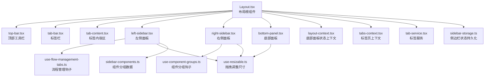
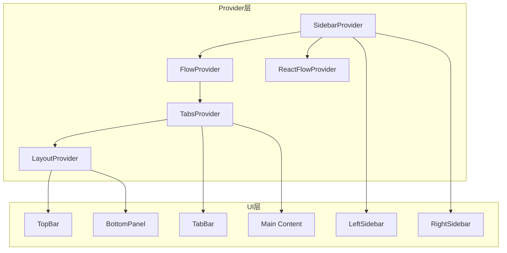
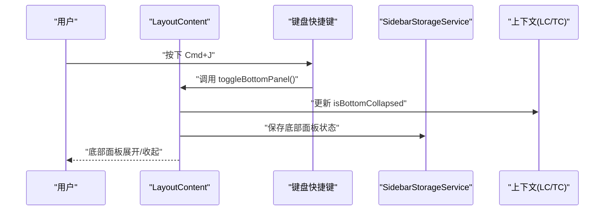
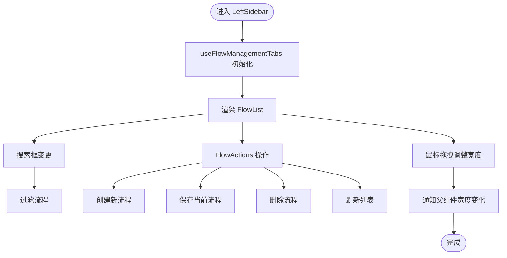
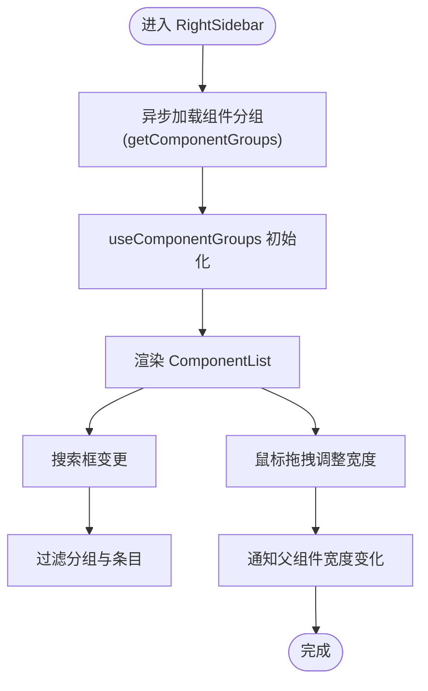
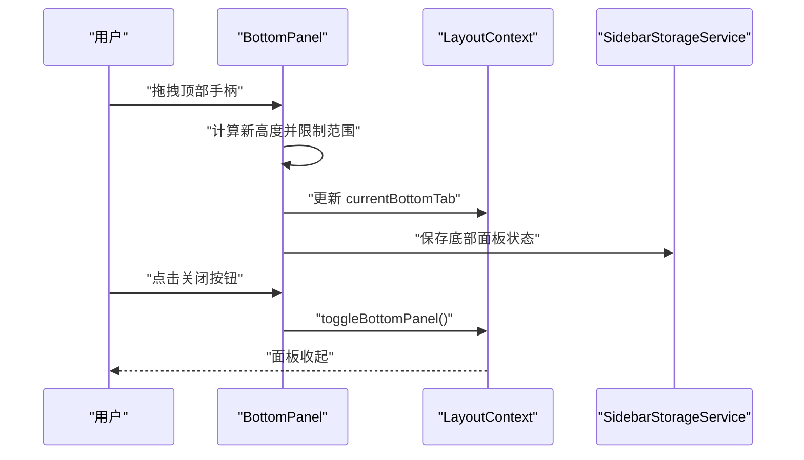
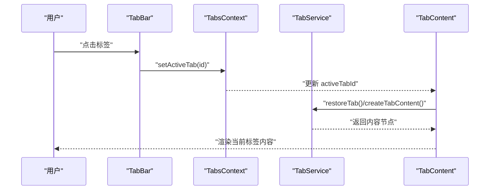
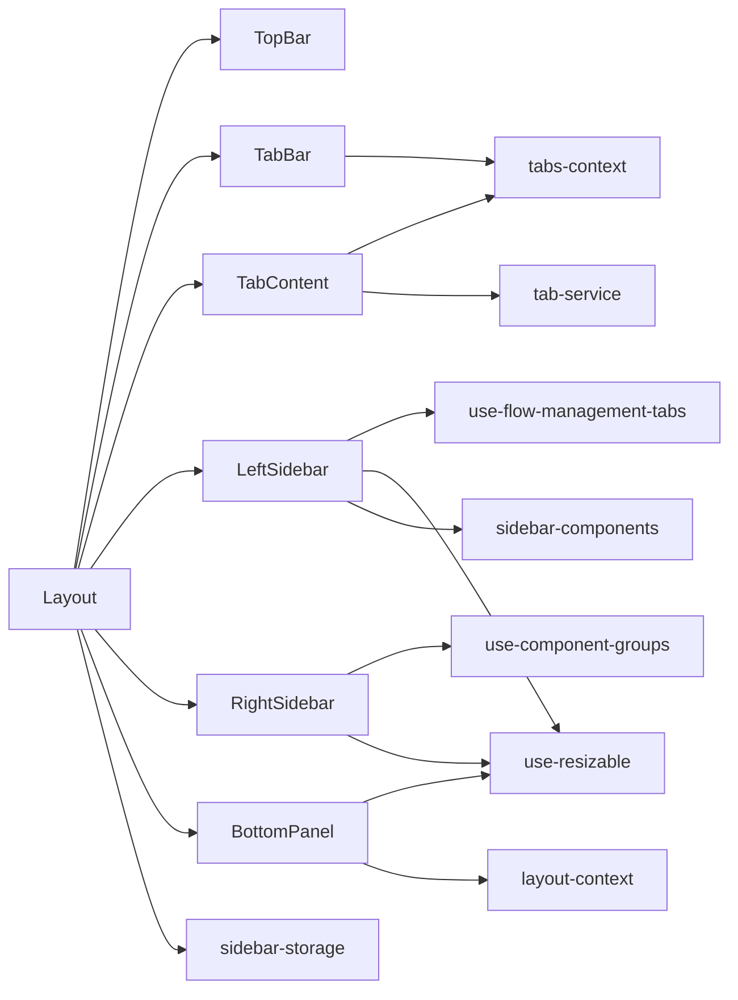

# 布局组件

<cite>
**本文引用的文件**
- [Layout.tsx](file://app/frontend/src/components/Layout.tsx)
- [layout-context.tsx](file://app/frontend/src/contexts/layout-context.tsx)
- [top-bar.tsx](file://app/frontend/src/components/layout/top-bar.tsx)
- [bottom-panel.tsx](file://app/frontend/src/components/panels/bottom/bottom-panel.tsx)
- [left-sidebar.tsx](file://app/frontend/src/components/panels/left/left-sidebar.tsx)
- [right-sidebar.tsx](file://app/frontend/src/components/panels/right/right-sidebar.tsx)
- [use-flow-management-tabs.ts](file://app/frontend/src/hooks/use-flow-management-tabs.ts)
- [use-component-groups.ts](file://app/frontend/src/hooks/use-component-groups.ts)
- [sidebar-storage.ts](file://app/frontend/src/services/sidebar-storage.ts)
- [use-resizable.ts](file://app/frontend/src/hooks/use-resizable.ts)
- [tab-service.ts](file://app/frontend/src/services/tab-service.ts)
- [tab-bar.tsx](file://app/frontend/src/components/tabs/tab-bar.tsx)
- [tab-content.tsx](file://app/frontend/src/components/tabs/tab-content.tsx)
- [tabs-context.tsx](file://app/frontend/src/contexts/tabs-context.tsx)
- [sidebar-components.ts](file://app/frontend/src/data/sidebar-components.ts)
</cite>

## 目录
1. [简介](#简介)
2. [项目结构](#项目结构)
3. [核心组件](#核心组件)
4. [架构总览](#架构总览)
5. [详细组件分析](#详细组件分析)
6. [依赖关系分析](#依赖关系分析)
7. [性能考量](#性能考量)
8. [故障排查指南](#故障排查指南)
9. [结论](#结论)
10. [附录](#附录)

## 简介
本文件系统化梳理前端布局组件（Layout）的整体架构与容器设计，覆盖底部面板、左右侧边栏、标签页系统、内容区域以及面板状态控制；解释左侧边栏的流程列表与节点库、右侧边栏的组件库与属性面板、设置选项与实时信息展示；提供响应式布局与断点管理、移动端适配策略；并总结布局组件的API接口、配置项与可扩展点。

## 项目结构
布局组件位于前端源码的组件层，围绕 Layout 根组件组织上下文 Provider、侧边栏、底部面板与标签页系统，形成“容器-子面板-内容区”的层级结构。关键目录与文件如下：
- 组件层：Layout、TopBar、LeftSidebar、RightSidebar、BottomPanel、TabBar、TabContent
- 上下文层：layout-context、tabs-context
- 钩子层：use-resizable、use-flow-management-tabs、use-component-groups
- 服务层：sidebar-storage、tab-service
- 数据层：sidebar-components

图表来源
- [Layout.tsx:187-201](file://app/frontend/src/components/Layout.tsx#L187-L201)
- [left-sidebar.tsx:17-101](file://app/frontend/src/components/panels/left/left-sidebar.tsx#L17-L101)
- [right-sidebar.tsx:17-97](file://app/frontend/src/components/panels/right/right-sidebar.tsx#L17-L97)
- [bottom-panel.tsx:19-99](file://app/frontend/src/components/panels/bottom/bottom-panel.tsx#L19-L99)
- [tab-bar.tsx:23-171](file://app/frontend/src/components/tabs/tab-bar.tsx#L23-L171)
- [tab-content.tsx:11-84](file://app/frontend/src/components/tabs/tab-content.tsx#L11-L84)
- [layout-context.tsx:27-68](file://app/frontend/src/contexts/layout-context.tsx#L27-L68)
- [tabs-context.tsx:59-271](file://app/frontend/src/contexts/tabs-context.tsx#L59-L271)
- [tab-service.ts:13-68](file://app/frontend/src/services/tab-service.ts#L13-L68)
- [sidebar-storage.ts:7-237](file://app/frontend/src/services/sidebar-storage.ts#L7-L237)
- [use-resizable.ts:13-93](file://app/frontend/src/hooks/use-resizable.ts#L13-L93)
- [sidebar-components.ts:31-74](file://app/frontend/src/data/sidebar-components.ts#L31-L74)

章节来源
- [Layout.tsx:187-201](file://app/frontend/src/components/Layout.tsx#L187-L201)
- [left-sidebar.tsx:17-101](file://app/frontend/src/components/panels/left/left-sidebar.tsx#L17-L101)
- [right-sidebar.tsx:17-97](file://app/frontend/src/components/panels/right/right-sidebar.tsx#L17-L97)
- [bottom-panel.tsx:19-99](file://app/frontend/src/components/panels/bottom/bottom-panel.tsx#L19-L99)
- [tab-bar.tsx:23-171](file://app/frontend/src/components/tabs/tab-bar.tsx#L23-L171)
- [tab-content.tsx:11-84](file://app/frontend/src/components/tabs/tab-content.tsx#L11-L84)
- [layout-context.tsx:27-68](file://app/frontend/src/contexts/layout-context.tsx#L27-L68)
- [tabs-context.tsx:59-271](file://app/frontend/src/contexts/tabs-context.tsx#L59-L271)
- [tab-service.ts:13-68](file://app/frontend/src/services/tab-service.ts#L13-L68)
- [sidebar-storage.ts:7-237](file://app/frontend/src/services/sidebar-storage.ts#L7-L237)
- [use-resizable.ts:13-93](file://app/frontend/src/hooks/use-resizable.ts#L13-L93)
- [sidebar-components.ts:31-74](file://app/frontend/src/data/sidebar-components.ts#L31-L74)

## 核心组件
- Layout 根组件：负责容器布局、上下文 Provider 注入、键盘快捷键绑定、侧边栏与底部面板状态同步、主内容区定位与尺寸计算。
- TopBar 顶部工具栏：提供左/右/底三面板开关按钮与设置入口。
- LeftSidebar 左侧边栏：流程列表、搜索、分组折叠、创建/保存/删除/刷新等操作。
- RightSidebar 右侧边栏：组件库分组、搜索、节点拖拽到画布。
- BottomPanel 底部面板：输出/调试/终端等标签页，支持高度拖拽调整。
- TabBar 标签栏：多标签页展示、拖拽重排、关闭、激活切换。
- TabContent 标签内容区：根据当前激活标签渲染对应内容或欢迎页。
- 上下文与服务：layout-context、tabs-context 提供状态共享；sidebar-storage、tab-service 提供持久化与内容构造。

章节来源
- [Layout.tsx:18-181](file://app/frontend/src/components/Layout.tsx#L18-L181)
- [top-bar.tsx:15-87](file://app/frontend/src/components/layout/top-bar.tsx#L15-L87)
- [left-sidebar.tsx:17-101](file://app/frontend/src/components/panels/left/left-sidebar.tsx#L17-L101)
- [right-sidebar.tsx:17-97](file://app/frontend/src/components/panels/right/right-sidebar.tsx#L17-L97)
- [bottom-panel.tsx:19-99](file://app/frontend/src/components/panels/bottom/bottom-panel.tsx#L19-L99)
- [tab-bar.tsx:23-171](file://app/frontend/src/components/tabs/tab-bar.tsx#L23-L171)
- [tab-content.tsx:11-84](file://app/frontend/src/components/tabs/tab-content.tsx#L11-L84)
- [layout-context.tsx:27-68](file://app/frontend/src/contexts/layout-context.tsx#L27-L68)
- [tabs-context.tsx:59-271](file://app/frontend/src/contexts/tabs-context.tsx#L59-L271)
- [tab-service.ts:13-68](file://app/frontend/src/services/tab-service.ts#L13-L68)
- [sidebar-storage.ts:7-237](file://app/frontend/src/services/sidebar-storage.ts#L7-L237)

## 架构总览
布局采用“Provider 包裹 + 绝对定位 + 拖拽调整”的组合模式：
- Provider 层：SidebarProvider、ReactFlowProvider、FlowProvider、TabsProvider、LayoutProvider 提供全局状态与能力。
- 定位层：TopBar、TabBar、Main Content、Left/Right/Bottom Panels 使用绝对定位与动态样式计算，随侧边栏与底部面板展开/收起而联动。
- 交互层：键盘快捷键、拖拽调整、标签页拖拽重排、内容区懒加载与恢复。

图表来源
- [Layout.tsx:187-201](file://app/frontend/src/components/Layout.tsx#L187-L201)
- [Layout.tsx:104-181](file://app/frontend/src/components/Layout.tsx#L104-L181)

章节来源
- [Layout.tsx:187-201](file://app/frontend/src/components/Layout.tsx#L187-L201)
- [Layout.tsx:104-181](file://app/frontend/src/components/Layout.tsx#L104-L181)

## 详细组件分析

### 布局容器与上下文
- Provider 注入顺序确保 Flow/Tabs/Layout 的状态在各子组件中可用。
- 键盘快捷键统一由 LayoutContent 管理，绑定到侧边栏/底部面板开关与视图适配。
- 侧边栏与底部面板状态通过 SidebarStorageService 从 localStorage 恢复与持久化。

图表来源
- [Layout.tsx:44-53](file://app/frontend/src/components/Layout.tsx#L44-L53)
- [layout-context.tsx:27-68](file://app/frontend/src/contexts/layout-context.tsx#L27-L68)
- [sidebar-storage.ts:41-49](file://app/frontend/src/services/sidebar-storage.ts#L41-L49)

章节来源
- [Layout.tsx:18-181](file://app/frontend/src/components/Layout.tsx#L18-L181)
- [layout-context.tsx:27-68](file://app/frontend/src/contexts/layout-context.tsx#L27-L68)
- [sidebar-storage.ts:41-49](file://app/frontend/src/services/sidebar-storage.ts#L41-L49)

### 顶部工具栏（TopBar）
- 提供左/右/底三面板开关按钮与设置入口。
- 按钮状态与标题提示与当前面板状态一致，支持键盘快捷键提示。

章节来源
- [top-bar.tsx:15-87](file://app/frontend/src/components/layout/top-bar.tsx#L15-L87)

### 左侧边栏（LeftSidebar）
- 功能：流程列表、搜索、分组折叠、创建/保存/删除/刷新。
- 交互：支持宽度拖拽调整，宽度变化通过回调通知父组件以重新计算定位。
- 数据：使用 useFlowManagementTabs 钩子加载/过滤/分组流程，支持模板与最近流程。

图表来源
- [left-sidebar.tsx:22-32](file://app/frontend/src/components/panels/left/left-sidebar.tsx#L22-L32)
- [use-flow-management-tabs.ts:133-153](file://app/frontend/src/hooks/use-flow-management-tabs.ts#L133-L153)
- [use-flow-management-tabs.ts:155-171](file://app/frontend/src/hooks/use-flow-management-tabs.ts#L155-L171)

章节来源
- [left-sidebar.tsx:17-101](file://app/frontend/src/components/panels/left/left-sidebar.tsx#L17-L101)
- [use-flow-management-tabs.ts:133-171](file://app/frontend/src/hooks/use-flow-management-tabs.ts#L133-L171)

### 右侧边栏（RightSidebar）
- 功能：组件库分组、搜索、节点拖拽到画布。
- 交互：支持宽度拖拽调整，宽度变化通过回调通知父组件。
- 数据：通过 sidebar-components.ts 获取后端动态代理的组件分组，使用 use-component-groups 钩子进行搜索与分组展开逻辑。

图表来源
- [right-sidebar.tsx:39-53](file://app/frontend/src/components/panels/right/right-sidebar.tsx#L39-L53)
- [use-component-groups.ts:10-26](file://app/frontend/src/hooks/use-component-groups.ts#L10-L26)
- [sidebar-components.ts:31-74](file://app/frontend/src/data/sidebar-components.ts#L31-L74)

章节来源
- [right-sidebar.tsx:17-97](file://app/frontend/src/components/panels/right/right-sidebar.tsx#L17-L97)
- [use-component-groups.ts:1-71](file://app/frontend/src/hooks/use-component-groups.ts#L1-L71)
- [sidebar-components.ts:31-74](file://app/frontend/src/data/sidebar-components.ts#L31-L74)

### 底部面板（BottomPanel）
- 功能：输出/调试/终端等标签页，支持高度拖拽调整。
- 交互：顶部拖拽手柄调整高度，关闭按钮收起面板。
- 状态：与 layout-context 共享当前激活标签与折叠状态，宽度联动左右侧边栏。

图表来源
- [bottom-panel.tsx:27-37](file://app/frontend/src/components/panels/bottom/bottom-panel.tsx#L27-L37)
- [bottom-panel.tsx:64-86](file://app/frontend/src/components/panels/bottom/bottom-panel.tsx#L64-L86)
- [layout-context.tsx:27-68](file://app/frontend/src/contexts/layout-context.tsx#L27-L68)
- [sidebar-storage.ts:41-49](file://app/frontend/src/services/sidebar-storage.ts#L41-L49)

章节来源
- [bottom-panel.tsx:19-99](file://app/frontend/src/components/panels/bottom/bottom-panel.tsx#L19-L99)
- [layout-context.tsx:27-68](file://app/frontend/src/contexts/layout-context.tsx#L27-L68)
- [sidebar-storage.ts:41-49](file://app/frontend/src/services/sidebar-storage.ts#L41-L49)

### 标签页系统（TabBar 与 TabContent）
- TabBar：支持拖拽重排、关闭、激活切换；VSCode 风格样式与图标。
- TabContent：根据激活标签渲染内容，支持从 localStorage 恢复内容。
- TabsProvider：提供标签页增删改查、持久化、标题更新等能力。

图表来源
- [tab-bar.tsx:24-171](file://app/frontend/src/components/tabs/tab-bar.tsx#L24-L171)
- [tabs-context.tsx:154-177](file://app/frontend/src/contexts/tabs-context.tsx#L154-L177)
- [tab-content.tsx:17-40](file://app/frontend/src/components/tabs/tab-content.tsx#L17-L40)
- [tab-service.ts:13-68](file://app/frontend/src/services/tab-service.ts#L13-L68)

章节来源
- [tab-bar.tsx:23-171](file://app/frontend/src/components/tabs/tab-bar.tsx#L23-L171)
- [tab-content.tsx:11-84](file://app/frontend/src/components/tabs/tab-content.tsx#L11-L84)
- [tabs-context.tsx:59-271](file://app/frontend/src/contexts/tabs-context.tsx#L59-L271)
- [tab-service.ts:13-68](file://app/frontend/src/services/tab-service.ts#L13-L68)

### 响应式布局与断点管理
- 绝对定位与动态样式：LayoutContent 根据侧边栏与底部面板状态动态计算 TabBar 与 Main Content 的 left/right/top/bottom。
- 尺寸限制：use-resizable 为左右侧边栏与底部面板提供最小/最大尺寸限制与拖拽事件处理。
- 移动端适配：当前实现未显式声明媒体查询或断点常量，建议在主题/样式层引入断点变量并在布局层按需切换为堆叠式布局或隐藏非关键面板。

章节来源
- [Layout.tsx:64-101](file://app/frontend/src/components/Layout.tsx#L64-L101)
- [use-resizable.ts:13-93](file://app/frontend/src/hooks/use-resizable.ts#L13-L93)

### API 接口与配置选项
- Layout Props
  - children: ReactNode
- LayoutContent 内部接口
  - 状态：isLeftCollapsed, isRightCollapsed, isBottomCollapsed, leftSidebarWidth, rightSidebarWidth, bottomPanelHeight
  - 回调：onCollapse/onExpand/onToggleCollapse/onWidthChange/onHeightChange
  - 快捷键：Cmd+I 切换右侧面板、Cmd+B 切换左侧面板、Cmd+J 切换底部面板、Shift+Cmd+J 打开设置
- TopBar Props
  - isLeftCollapsed, isRightCollapsed, isBottomCollapsed, onToggleLeft, onToggleRight, onToggleBottom, onSettingsClick
- LeftSidebar/RightSidebar Props
  - isCollapsed, onCollapse, onExpand, onWidthChange
- BottomPanel Props
  - isCollapsed, onCollapse, onExpand, onToggleCollapse, onHeightChange
- TabsProvider API
  - openTab, closeTab, setActiveTab, closeAllTabs, isTabOpen, getTabByIdentifier, reorderTabs, updateTabTitle, updateFlowTabTitle
- SidebarStorageService API
  - saveLeftSidebarState/saveRightSidebarState/saveBottomPanelState/saveSidebarStates
  - loadLeftSidebarState/loadRightSidebarState/loadBottomPanelState/loadSidebarStates
  - clearLeftSidebarState/clearRightSidebarState/clearBottomPanelState/clearSidebarStates/resetToDefaults
  - hasLeftSidebarState/hasRightSidebarState/hasSidebarStates
- TabService API
  - createTabContent/createFlowTab/createSettingsTab/restoreTabContent/restoreTab

章节来源
- [Layout.tsx:183-201](file://app/frontend/src/components/Layout.tsx#L183-L201)
- [top-bar.tsx:5-13](file://app/frontend/src/components/layout/top-bar.tsx#L5-L13)
- [left-sidebar.tsx:9-15](file://app/frontend/src/components/panels/left/left-sidebar.tsx#L9-L15)
- [right-sidebar.tsx:9-15](file://app/frontend/src/components/panels/right/right-sidebar.tsx#L9-L15)
- [bottom-panel.tsx:10-17](file://app/frontend/src/components/panels/bottom/bottom-panel.tsx#L10-L17)
- [tabs-context.tsx:27-39](file://app/frontend/src/contexts/tabs-context.tsx#L27-L39)
- [sidebar-storage.ts:7-237](file://app/frontend/src/services/sidebar-storage.ts#L7-L237)
- [tab-service.ts:13-68](file://app/frontend/src/services/tab-service.ts#L13-L68)

### 自定义扩展方法
- 扩展标签类型：在 TabService 中新增类型分支与内容构造函数，配合 TabsProvider 的 openTab/closeTab 进行集成。
- 扩展侧边栏面板：新增 Panel 组件并通过 Layout 的 Provider 注入与状态管理接入；参考 BottomPanel 的高度拖拽与状态持久化实现。
- 扩展快捷键：在 LayoutContent 的快捷键绑定处增加新的组合键映射。
- 扩展搜索与分组：在 use-component-groups 或 use-flow-management-tabs 中扩展过滤逻辑与分组策略。

章节来源
- [tab-service.ts:13-68](file://app/frontend/src/services/tab-service.ts#L13-L68)
- [tabs-context.tsx:154-177](file://app/frontend/src/contexts/tabs-context.tsx#L154-L177)
- [bottom-panel.tsx:27-37](file://app/frontend/src/components/panels/bottom/bottom-panel.tsx#L27-L37)
- [sidebar-storage.ts:41-49](file://app/frontend/src/services/sidebar-storage.ts#L41-L49)

## 依赖关系分析
- 组件间依赖
  - Layout 依赖 TopBar、TabBar、TabContent、LeftSidebar、RightSidebar、BottomPanel。
  - LeftSidebar 依赖 use-flow-management-tabs 与 use-resizable。
  - RightSidebar 依赖 use-component-groups、use-resizable 与 sidebar-components。
  - BottomPanel 依赖 layout-context 与 use-resizable。
  - TabBar/TabContent 依赖 tabs-context 与 tab-service。
- 上下文与服务
  - layout-context 与 tabs-context 提供状态共享。
  - sidebar-storage 与 tab-service 提供持久化与内容构造。

图表来源
- [Layout.tsx:18-181](file://app/frontend/src/components/Layout.tsx#L18-L181)
- [left-sidebar.tsx:17-101](file://app/frontend/src/components/panels/left/left-sidebar.tsx#L17-L101)
- [right-sidebar.tsx:17-97](file://app/frontend/src/components/panels/right/right-sidebar.tsx#L17-L97)
- [bottom-panel.tsx:19-99](file://app/frontend/src/components/panels/bottom/bottom-panel.tsx#L19-L99)
- [tab-bar.tsx:23-171](file://app/frontend/src/components/tabs/tab-bar.tsx#L23-L171)
- [tab-content.tsx:11-84](file://app/frontend/src/components/tabs/tab-content.tsx#L11-L84)
- [layout-context.tsx:27-68](file://app/frontend/src/contexts/layout-context.tsx#L27-L68)
- [tabs-context.tsx:59-271](file://app/frontend/src/contexts/tabs-context.tsx#L59-L271)
- [tab-service.ts:13-68](file://app/frontend/src/services/tab-service.ts#L13-L68)
- [sidebar-storage.ts:7-237](file://app/frontend/src/services/sidebar-storage.ts#L7-L237)
- [sidebar-components.ts:31-74](file://app/frontend/src/data/sidebar-components.ts#L31-L74)

章节来源
- [Layout.tsx:18-181](file://app/frontend/src/components/Layout.tsx#L18-L181)
- [left-sidebar.tsx:17-101](file://app/frontend/src/components/panels/left/left-sidebar.tsx#L17-L101)
- [right-sidebar.tsx:17-97](file://app/frontend/src/components/panels/right/right-sidebar.tsx#L17-L97)
- [bottom-panel.tsx:19-99](file://app/frontend/src/components/panels/bottom/bottom-panel.tsx#L19-L99)
- [tab-bar.tsx:23-171](file://app/frontend/src/components/tabs/tab-bar.tsx#L23-L171)
- [tab-content.tsx:11-84](file://app/frontend/src/components/tabs/tab-content.tsx#L11-L84)
- [layout-context.tsx:27-68](file://app/frontend/src/contexts/layout-context.tsx#L27-L68)
- [tabs-context.tsx:59-271](file://app/frontend/src/contexts/tabs-context.tsx#L59-L271)
- [tab-service.ts:13-68](file://app/frontend/src/services/tab-service.ts#L13-L68)
- [sidebar-storage.ts:7-237](file://app/frontend/src/services/sidebar-storage.ts#L7-L237)
- [sidebar-components.ts:31-74](file://app/frontend/src/data/sidebar-components.ts#L31-L74)

## 性能考量
- 渲染优化
  - 使用 useMemo 在组件分组与流程过滤中避免重复计算。
  - 仅在宽度/高度变化时触发父组件样式重算，减少不必要的重排。
- 状态持久化
  - 侧边栏与底部面板状态写入 localStorage，避免每次刷新重建布局。
- 内容懒加载
  - TabContent 在激活时才恢复/构造内容，减少初始渲染压力。
- 事件监听
  - use-resizable 在组件卸载时清理鼠标事件监听器，防止内存泄漏。

章节来源
- [use-component-groups.ts:10-26](file://app/frontend/src/hooks/use-component-groups.ts#L10-L26)
- [use-flow-management-tabs.ts:155-171](file://app/frontend/src/hooks/use-flow-management-tabs.ts#L155-L171)
- [tab-content.tsx:17-40](file://app/frontend/src/components/tabs/tab-content.tsx#L17-L40)
- [use-resizable.ts:79-84](file://app/frontend/src/hooks/use-resizable.ts#L79-L84)

## 故障排查指南
- 无法打开设置页
  - 检查 TopBar 的 onSettingsClick 是否正确调用 TabService.createSettingsTab 并 openTab。
- 流程保存失败
  - 查看 use-flow-management-tabs 的 saveCurrentFlowWithStates 流程，确认节点内部状态与运行时上下文数据是否正确合并与回滚。
- 标签页不显示内容
  - 确认 TabContent 在 activeTab.content 为空时是否成功调用 TabService.restoreTab。
- 侧边栏/底部面板状态不同步
  - 检查 SidebarStorageService 的读取/写入逻辑与 LayoutContent 的状态初始化。
- 拖拽无效
  - 确认 use-resizable 的 startResize、handleMouseMove、stopResize 事件绑定与元素 ref 是否正确。

章节来源
- [Layout.tsx:38-41](file://app/frontend/src/components/Layout.tsx#L38-L41)
- [use-flow-management-tabs.ts:60-111](file://app/frontend/src/hooks/use-flow-management-tabs.ts#L60-L111)
- [tab-content.tsx:17-40](file://app/frontend/src/components/tabs/tab-content.tsx#L17-L40)
- [sidebar-storage.ts:69-118](file://app/frontend/src/services/sidebar-storage.ts#L69-L118)
- [use-resizable.ts:30-76](file://app/frontend/src/hooks/use-resizable.ts#L30-L76)

## 结论
该布局组件以 Provider 为核心，结合绝对定位与拖拽调整，实现了高可定制的多面板工作区。通过上下文与服务层的清晰分离，既保证了功能模块的内聚性，也为后续扩展（如新增面板、标签类型、快捷键与断点适配）提供了稳定接口。建议在样式层补充断点与移动端布局策略，进一步提升跨设备体验。

## 附录
- 关键实现路径
  - 布局容器与定位：[Layout.tsx:64-101](file://app/frontend/src/components/Layout.tsx#L64-L101)
  - 底部面板状态与拖拽：[bottom-panel.tsx:27-37](file://app/frontend/src/components/panels/bottom/bottom-panel.tsx#L27-L37)、[layout-context.tsx:27-68](file://app/frontend/src/contexts/layout-context.tsx#L27-L68)
  - 左侧流程管理：[left-sidebar.tsx:34-53](file://app/frontend/src/components/panels/left/left-sidebar.tsx#L34-L53)、[use-flow-management-tabs.ts:133-171](file://app/frontend/src/hooks/use-flow-management-tabs.ts#L133-L171)
  - 右侧组件库：[right-sidebar.tsx:39-53](file://app/frontend/src/components/panels/right/right-sidebar.tsx#L39-L53)、[use-component-groups.ts:10-26](file://app/frontend/src/hooks/use-component-groups.ts#L10-L26)
  - 标签页系统：[tab-bar.tsx:24-171](file://app/frontend/src/components/tabs/tab-bar.tsx#L24-L171)、[tab-content.tsx:17-40](file://app/frontend/src/components/tabs/tab-content.tsx#L17-L40)、[tabs-context.tsx:154-177](file://app/frontend/src/contexts/tabs-context.tsx#L154-L177)
  - 持久化与存储：[sidebar-storage.ts:69-118](file://app/frontend/src/services/sidebar-storage.ts#L69-L118)、[tab-service.ts:47-67](file://app/frontend/src/services/tab-service.ts#L47-L67)
  - 拖拽调整：[use-resizable.ts:30-76](file://app/frontend/src/hooks/use-resizable.ts#L30-L76)