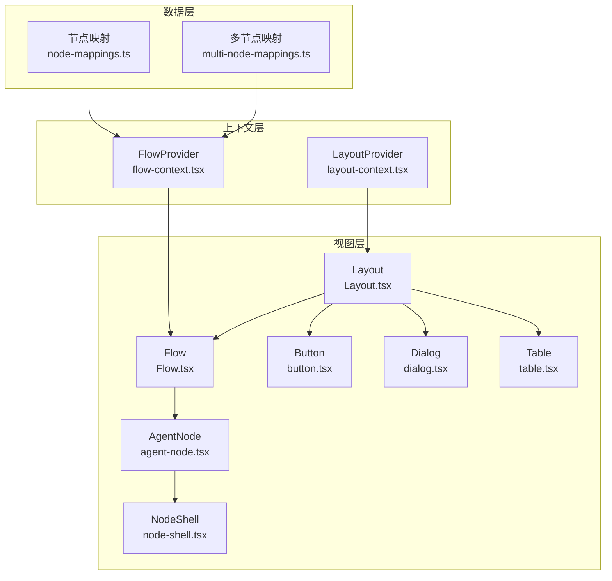
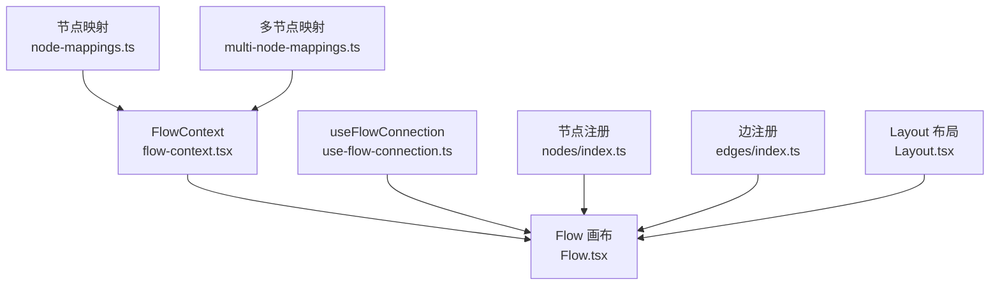
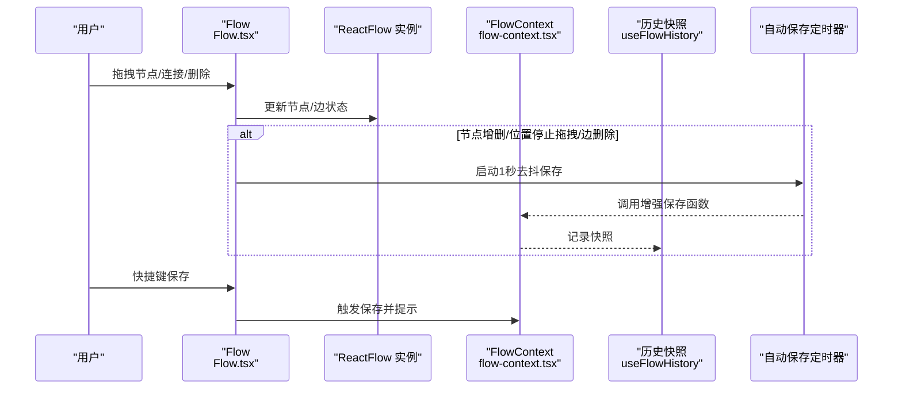
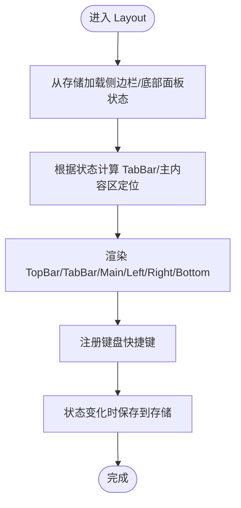
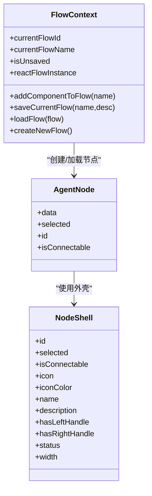
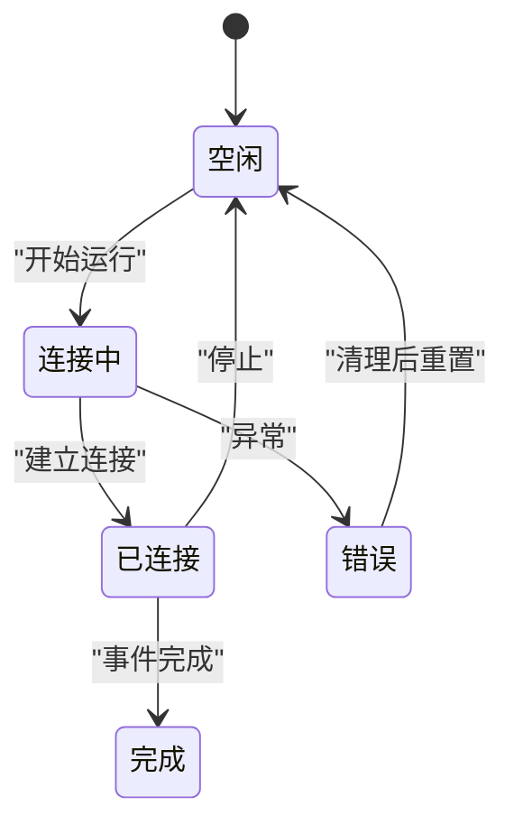
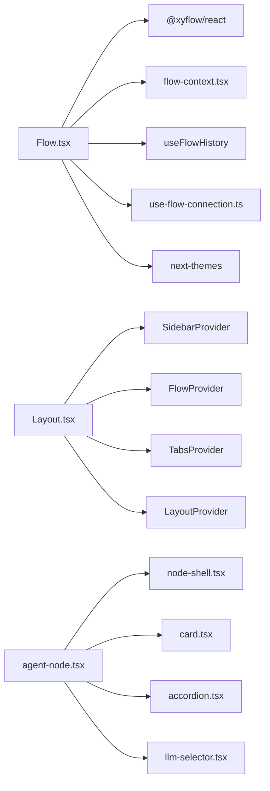

# 组件系统

<cite>
**本文引用的文件**
- [Flow.tsx](file://app/frontend/src/components/Flow.tsx)
- [Layout.tsx](file://app/frontend/src/components/Layout.tsx)
- [custom-controls.tsx](file://app/frontend/src/components/custom-controls.tsx)
- [flow-context.tsx](file://app/frontend/src/contexts/flow-context.tsx)
- [layout-context.tsx](file://app/frontend/src/contexts/layout-context.tsx)
- [node-mappings.ts](file://app/frontend/src/data/node-mappings.ts)
- [multi-node-mappings.ts](file://app/frontend/src/data/multi-node-mappings.ts)
- [index.ts（节点类型注册）](file://app/frontend/src/nodes/index.ts)
- [index.ts（边类型注册）](file://app/frontend/src/edges/index.ts)
- [use-flow-connection.ts](file://app/frontend/src/hooks/use-flow-connection.ts)
- [button.tsx](file://app/frontend/src/components/ui/button.tsx)
- [dialog.tsx](file://app/frontend/src/components/ui/dialog.tsx)
- [table.tsx](file://app/frontend/src/components/ui/table.tsx)
- [agent-node.tsx](file://app/frontend/src/nodes/components/agent-node.tsx)
- [node-shell.tsx](file://app/frontend/src/nodes/components/node-shell.tsx)
</cite>

## 目录
1. [简介](#简介)
2. [项目结构](#项目结构)
3. [核心组件](#核心组件)
4. [架构总览](#架构总览)
5. [详细组件分析](#详细组件分析)
6. [依赖关系分析](#依赖关系分析)
7. [性能考量](#性能考量)
8. [故障排查指南](#故障排查指南)
9. [结论](#结论)
10. [附录](#附录)

## 简介
本文件系统化梳理前端组件体系，重点覆盖以下方面：
- 自定义组件的设计原则与实现模式：统一节点外壳、状态管理与持久化、连接与执行生命周期。
- Flow 组件的工作流可视化实现：节点渲染、连接逻辑、自动保存与历史快照。
- Layout 组件的布局架构：侧边栏管理、底部面板、响应式定位与键盘快捷键。
- UI 组件库的使用与定制：按钮、对话框、表格等基础组件的变体与尺寸。
- 组件 API 文档：属性定义与使用示例路径。
- 复用策略、性能优化与可访问性实践。

## 项目结构
前端采用“上下文驱动 + 节点/边注册 + 可视化工作流”的分层组织方式：
- 上下文层：FlowProvider、LayoutProvider、TabsProvider 等，提供全局状态与行为。
- 数据层：节点映射与多节点组合映射，负责节点创建与组合。
- 视图层：Flow、Layout、各 UI 组件与节点组件。
- 交互层：钩子（如 use-flow-connection、use-flow-history）与工具服务（如 sidebar-storage）。

图表来源
- [Layout.tsx:187-201](file://app/frontend/src/components/Layout.tsx#L187-L201)
- [Flow.tsx:34-313](file://app/frontend/src/components/Flow.tsx#L34-L313)
- [flow-context.tsx:35-358](file://app/frontend/src/contexts/flow-context.tsx#L35-L358)
- [layout-context.tsx:27-68](file://app/frontend/src/contexts/layout-context.tsx#L27-L68)
- [node-mappings.ts:85-121](file://app/frontend/src/data/node-mappings.ts#L85-L121)
- [multi-node-mappings.ts:75-81](file://app/frontend/src/data/multi-node-mappings.ts#L75-L81)
- [agent-node.tsx:18-148](file://app/frontend/src/nodes/components/agent-node.tsx#L18-L148)
- [node-shell.tsx:21-90](file://app/frontend/src/nodes/components/node-shell.tsx#L21-L90)

章节来源
- [Layout.tsx:187-201](file://app/frontend/src/components/Layout.tsx#L187-L201)
- [Flow.tsx:34-313](file://app/frontend/src/components/Flow.tsx#L34-L313)
- [flow-context.tsx:35-358](file://app/frontend/src/contexts/flow-context.tsx#L35-L358)
- [layout-context.tsx:27-68](file://app/frontend/src/contexts/layout-context.tsx#L27-L68)
- [node-mappings.ts:85-121](file://app/frontend/src/data/node-mappings.ts#L85-L121)
- [multi-node-mappings.ts:75-81](file://app/frontend/src/data/multi-node-mappings.ts#L75-L81)
- [agent-node.tsx:18-148](file://app/frontend/src/nodes/components/agent-node.tsx#L18-L148)
- [node-shell.tsx:21-90](file://app/frontend/src/nodes/components/node-shell.tsx#L21-L90)

## 核心组件
- Flow：基于 @xyflow/react 的工作流画布，集成主题、自动保存、历史快照、键盘快捷键与背景网格。
- Layout：VSCode 风格布局容器，管理顶部栏、标签页、左右侧边栏、底部面板与键盘快捷键。
- 节点与边注册：集中声明节点类型与边类型，支持扩展。
- 节点映射与多节点映射：根据组件名生成节点定义或组合多个节点与边。
- 连接管理钩子：统一管理运行状态、连接生命周期与错误恢复。

章节来源
- [Flow.tsx:34-313](file://app/frontend/src/components/Flow.tsx#L34-L313)
- [Layout.tsx:187-201](file://app/frontend/src/components/Layout.tsx#L187-L201)
- [index.ts（节点类型注册）:52-60](file://app/frontend/src/nodes/index.ts#L52-L60)
- [index.ts（边类型注册）:4-7](file://app/frontend/src/edges/index.ts#L4-L7)
- [node-mappings.ts:85-121](file://app/frontend/src/data/node-mappings.ts#L85-L121)
- [multi-node-mappings.ts:75-81](file://app/frontend/src/data/multi-node-mappings.ts#L75-L81)
- [use-flow-connection.ts:80-250](file://app/frontend/src/hooks/use-flow-connection.ts#L80-L250)

## 架构总览
组件系统围绕“上下文-节点-边-可视化”四要素展开，通过 Provider 注入全局能力，通过映射与注册实现可扩展的节点生态，通过钩子与服务实现运行时控制与持久化。

图表来源
- [flow-context.tsx:35-358](file://app/frontend/src/contexts/flow-context.tsx#L35-L358)
- [use-flow-connection.ts:80-250](file://app/frontend/src/hooks/use-flow-connection.ts#L80-L250)
- [node-mappings.ts:85-121](file://app/frontend/src/data/node-mappings.ts#L85-L121)
- [multi-node-mappings.ts:75-81](file://app/frontend/src/data/multi-node-mappings.ts#L75-L81)
- [index.ts（节点类型注册）:52-60](file://app/frontend/src/nodes/index.ts#L52-L60)
- [index.ts（边类型注册）:4-7](file://app/frontend/src/edges/index.ts#L4-L7)
- [Flow.tsx:34-313](file://app/frontend/src/components/Flow.tsx#L34-L313)
- [Layout.tsx:187-201](file://app/frontend/src/components/Layout.tsx#L187-L201)

## 详细组件分析

### Flow 组件：工作流可视化与状态持久化
- 主要职责
  - 初始化 ReactFlow 实例，绑定节点/边类型与变更处理器。
  - 主题适配与背景网格渲染。
  - 自动保存与历史快照：对节点增删、位置变更、边移除进行防抖保存；首次初始化与结构变化即时保存。
  - 键盘快捷键：保存、撤销/重做。
  - 连接处理：创建带箭头标记的新边，立即触发保存。
- 关键实现要点
  - 使用 useNodesState/useEdgesState 管理节点/边状态。
  - 通过 FlowContext 提供的增强保存函数完成完整状态持久化。
  - 历史快照由 useFlowHistory 提供，支持撤销/重做。
  - 主题通过 next-themes 解析为 ReactFlow ColorMode。
- 性能与可靠性
  - 对保存操作进行去抖与跨流程保护，避免并发写入与跨流污染。
  - 结构性变更（新增/删除）优先级更高，确保一致性。

图表来源
- [Flow.tsx:92-143](file://app/frontend/src/components/Flow.tsx#L92-L143)
- [Flow.tsx:198-209](file://app/frontend/src/components/Flow.tsx#L198-L209)
- [Flow.tsx:240-278](file://app/frontend/src/components/Flow.tsx#L240-L278)
- [flow-context.tsx:74-131](file://app/frontend/src/contexts/flow-context.tsx#L74-L131)

章节来源
- [Flow.tsx:34-313](file://app/frontend/src/components/Flow.tsx#L34-L313)
- [flow-context.tsx:74-131](file://app/frontend/src/contexts/flow-context.tsx#L74-L131)

### Layout 组件：布局架构与侧边栏管理
- 主要职责
  - VSCode 风格布局：顶部栏、标签栏、主内容区、左右侧边栏、底部面板。
  - 侧边栏折叠/展开与宽度记忆，底部面板折叠状态与标签切换。
  - 键盘快捷键：切换侧边栏、适配视图、底部面板、打开设置。
  - 动态定位：根据侧边栏状态计算 TabBar 与主内容区的位置。
- 关键实现要点
  - 使用 SidebarStorageService 持久化侧边栏与底部面板状态。
  - 通过 LayoutProvider 管理底部面板折叠与当前标签。
  - 通过 useFlowContext 获取 ReactFlow 实例以支持“适配视图”快捷键。
- 响应式设计
  - 通过绝对定位与动态样式计算，保证在不同侧边栏状态下的正确布局。

图表来源
- [Layout.tsx:19-181](file://app/frontend/src/components/Layout.tsx#L19-L181)
- [layout-context.tsx:27-68](file://app/frontend/src/contexts/layout-context.tsx#L27-L68)

章节来源
- [Layout.tsx:187-201](file://app/frontend/src/components/Layout.tsx#L187-L201)
- [Layout.tsx:19-181](file://app/frontend/src/components/Layout.tsx#L19-L181)
- [layout-context.tsx:27-68](file://app/frontend/src/contexts/layout-context.tsx#L27-L68)

### 节点系统：节点渲染与连接逻辑
- 节点注册与类型
  - 在 nodes/index.ts 中集中注册节点类型，供 Flow 使用。
- 节点映射与多节点组合
  - node-mappings.ts：按组件名生成节点定义（含唯一 ID 后缀），支持代理类节点。
  - multi-node-mappings.ts：定义多节点组合（节点偏移与边连接），用于一键生成复杂流程。
- 节点外壳与连接句柄
  - node-shell.tsx：统一节点外壳、图标、标题、描述、状态色与左右连接句柄。
  - agent-node.tsx：代理节点示例，展示模型选择、状态显示与输出对话框。
- 连接逻辑
  - Flow.onConnect 创建带箭头标记的新边，立即触发保存。
  - 边类型注册在 edges/index.ts，可扩展自定义边样式。

图表来源
- [flow-context.tsx:10-351](file://app/frontend/src/contexts/flow-context.tsx#L10-L351)
- [node-shell.tsx:6-34](file://app/frontend/src/nodes/components/node-shell.tsx#L6-L34)
- [agent-node.tsx:18-36](file://app/frontend/src/nodes/components/agent-node.tsx#L18-L36)

章节来源
- [index.ts（节点类型注册）:52-60](file://app/frontend/src/nodes/index.ts#L52-L60)
- [node-mappings.ts:85-121](file://app/frontend/src/data/node-mappings.ts#L85-L121)
- [multi-node-mappings.ts:75-81](file://app/frontend/src/data/multi-node-mappings.ts#L75-L81)
- [node-shell.tsx:21-90](file://app/frontend/src/nodes/components/node-shell.tsx#L21-L90)
- [agent-node.tsx:18-148](file://app/frontend/src/nodes/components/agent-node.tsx#L18-L148)
- [Flow.tsx:240-278](file://app/frontend/src/components/Flow.tsx#L240-L278)

### UI 组件库：按钮、对话框、表格
- 按钮 Button
  - 支持多种变体（默认/破坏/轮廓/次级/幽灵/链接）与尺寸（默认/小/大/图标）。
  - 使用 class-variance-authority 定义变体，支持 asChild 渲染。
- 对话框 Dialog
  - 基于 Radix UI，提供 Root、Trigger、Portal、Overlay、Content、Header/Footer、Title/Description、Close。
  - 支持居中弹出、动画与关闭按钮。
- 表格 Table
  - 提供 Table、TableHeader、TableBody、TableFooter、TableRow、TableHead、TableCell、TableCaption。
  - 内置滚动容器与 hover/选中态样式。

章节来源
- [button.tsx:37-58](file://app/frontend/src/components/ui/button.tsx#L37-L58)
- [dialog.tsx:7-113](file://app/frontend/src/components/ui/dialog.tsx#L7-L113)
- [table.tsx:5-121](file://app/frontend/src/components/ui/table.tsx#L5-L121)

### 连接与执行：运行状态管理
- useFlowConnection
  - 全局连接管理器跟踪每个 flowId 的连接状态（空闲/连接中/已连接/错误/已完成）。
  - 提供 runFlow/runBacktest/stopFlow/recoverFlowState 等控制方法。
  - 与节点上下文协作，重置节点状态并在停止时仅重置状态而不丢失数据。

图表来源
- [use-flow-connection.ts:7-73](file://app/frontend/src/hooks/use-flow-connection.ts#L7-L73)
- [use-flow-connection.ts:114-250](file://app/frontend/src/hooks/use-flow-connection.ts#L114-L250)

章节来源
- [use-flow-connection.ts:80-250](file://app/frontend/src/hooks/use-flow-connection.ts#L80-L250)

## 依赖关系分析
- Flow 依赖 ReactFlow、FlowContext、useFlowHistory、useFlowConnection、主题与 Toast 管理。
- Layout 依赖 SidebarProvider、FlowProvider、TabsProvider、LayoutProvider、KeyboardShortcuts。
- 节点系统依赖节点映射与多节点映射，以及 UI 组件（Card、Accordion、ModelSelector 等）。
- UI 组件库提供通用控件，被 Flow、Layout 与节点组件广泛使用。

图表来源
- [Flow.tsx:14-28](file://app/frontend/src/components/Flow.tsx#L14-L28)
- [Layout.tsx:6-16](file://app/frontend/src/components/Layout.tsx#L6-L16)
- [agent-node.tsx:5-16](file://app/frontend/src/nodes/components/agent-node.tsx#L5-L16)

章节来源
- [Flow.tsx:14-28](file://app/frontend/src/components/Flow.tsx#L14-L28)
- [Layout.tsx:6-16](file://app/frontend/src/components/Layout.tsx#L6-L16)
- [agent-node.tsx:5-16](file://app/frontend/src/nodes/components/agent-node.tsx#L5-L16)

## 性能考量
- 自动保存去抖：节点/边变更采用 1 秒去抖，结构性变更（新增/删除/边移除）即时保存，避免频繁 IO。
- 跨流程保护：保存前校验当前 flowId，防止切换流程时的交叉写入。
- 历史快照：结构变更与初始化时记录快照，非结构变更采用 500ms 延迟快照，平衡性能与一致性。
- 节点渲染：统一 NodeShell 外壳减少重复样式代码，Handle 句柄仅在需要时渲染。
- 布局计算：侧边栏状态变化时重新计算定位，避免不必要的重排。

## 故障排查指南
- 无法保存/保存失败
  - 检查 FlowContext.saveCurrentFlow 是否抛错；确认网络与后端接口可用。
  - 查看 Flow.tsx 中自动保存的错误日志与 Toast 提示。
- 连接异常/长时间无响应
  - 使用 useFlowConnection 查看状态机是否停留在“连接中”，必要时调用 stopFlow 清理。
  - 检查后端 SSE 事件流与节点状态更新。
- 节点状态不一致
  - 加载流程时 FlowContext 会设置节点状态隔离；确认 flowId 设置顺序正确。
  - 多节点组合加载后检查边映射是否解析成功。
- 布局错位
  - 确认 Layout.tsx 中侧边栏宽度与底部面板高度回调是否正确更新。
  - 检查键盘快捷键是否影响了视图适配。

章节来源
- [flow-context.tsx:134-188](file://app/frontend/src/contexts/flow-context.tsx#L134-L188)
- [use-flow-connection.ts:186-232](file://app/frontend/src/hooks/use-flow-connection.ts#L186-L232)
- [Flow.tsx:198-209](file://app/frontend/src/components/Flow.tsx#L198-L209)

## 结论
该组件系统以 Flow 与 Layout 为核心，结合上下文、映射与钩子，实现了高内聚、低耦合的工作流可视化与布局管理。通过统一的节点外壳与状态持久化机制，既保证了扩展性，也兼顾了性能与可靠性。UI 组件库提供了标准化的基础控件，便于快速构建一致的界面体验。

## 附录

### 组件 API 文档与使用示例路径
- Flow
  - 属性
    - className?: string
  - 使用示例路径
    - [Flow.tsx:34-313](file://app/frontend/src/components/Flow.tsx#L34-L313)
- Layout
  - 属性
    - children: ReactNode
  - 使用示例路径
    - [Layout.tsx:187-201](file://app/frontend/src/components/Layout.tsx#L187-L201)
- Button
  - 属性
    - variant: 默认/破坏/轮廓/次级/幽灵/链接
    - size: 默认/小/大/图标
    - asChild?: boolean
  - 使用示例路径
    - [button.tsx:37-58](file://app/frontend/src/components/ui/button.tsx#L37-L58)
- Dialog
  - 属性
    - Root/Trigger/Portal/Overlay/Content/Header/Footer/Title/Description/Close
  - 使用示例路径
    - [dialog.tsx:7-113](file://app/frontend/src/components/ui/dialog.tsx#L7-L113)
- Table
  - 属性
    - Table/TableHeader/TableBody/TableFooter/TableRow/TableHead/TableCell/TableCaption
  - 使用示例路径
    - [table.tsx:5-121](file://app/frontend/src/components/ui/table.tsx#L5-L121)
- AgentNode
  - 属性
    - data/name/description/status/isConnectable/selected/id
  - 使用示例路径
    - [agent-node.tsx:18-148](file://app/frontend/src/nodes/components/agent-node.tsx#L18-L148)
- NodeShell
  - 属性
    - id/selected/isConnectable/icon/iconColor/name/description/hasLeftHandle/hasRightHandle/status/width
  - 使用示例路径
    - [node-shell.tsx:21-90](file://app/frontend/src/nodes/components/node-shell.tsx#L21-L90)