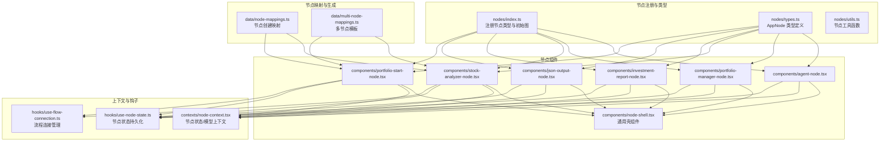
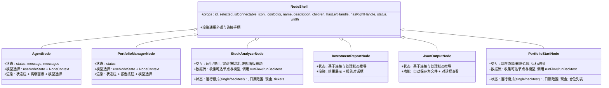
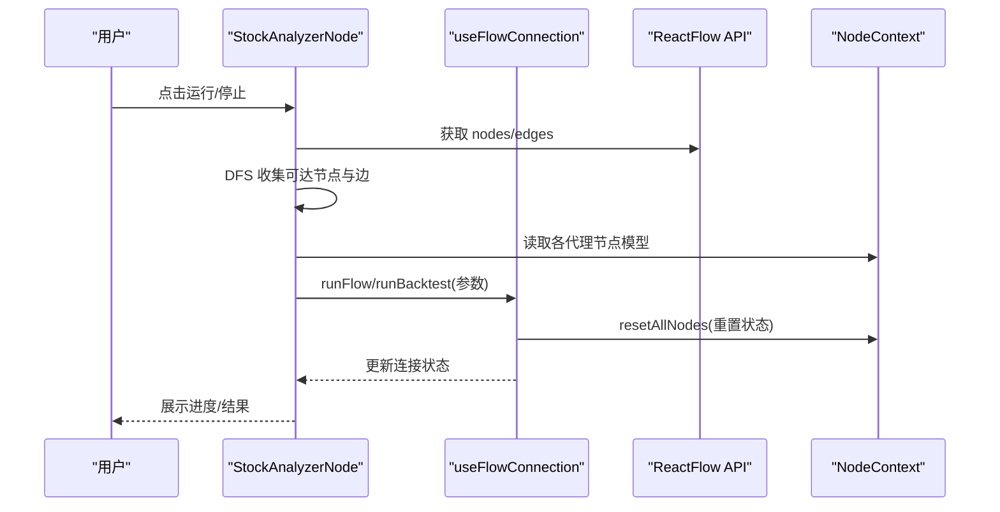
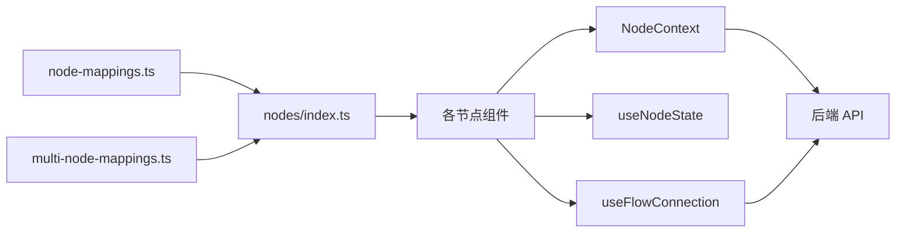

# 节点组件

<cite>
**本文引用的文件**
- [节点索引与注册](file://app/frontend/src/nodes/index.ts)
- [节点类型定义](file://app/frontend/src/nodes/types.ts)
- [节点工具与路径查找](file://app/frontend/src/nodes/utils.ts)
- [节点映射与生成器](file://app/frontend/src/data/node-mappings.ts)
- [多节点模板映射](file://app/frontend/src/data/multi-node-mappings.ts)
- [节点壳组件](file://app/frontend/src/nodes/components/node-shell.tsx)
- [代理节点](file://app/frontend/src/nodes/components/agent-node.tsx)
- [投资组合管理节点](file://app/frontend/src/nodes/components/portfolio-manager-node.tsx)
- [股票分析节点](file://app/frontend/src/nodes/components/stock-analyzer-node.tsx)
- [投资报告节点](file://app/frontend/src/nodes/components/investment-report-node.tsx)
- [JSON 输出节点](file://app/frontend/src/nodes/components/json-output-node.tsx)
- [投资组合起始节点](file://app/frontend/src/nodes/components/portfolio-start-node.tsx)
- [节点上下文（状态与模型）](file://app/frontend/src/contexts/node-context.tsx)
- [节点状态持久化钩子](file://app/frontend/src/hooks/use-node-state.ts)
- [流程连接管理钩子](file://app/frontend/src/hooks/use-flow-connection.ts)
</cite>

## 目录
1. [简介](#简介)
2. [项目结构](#项目结构)
3. [核心组件](#核心组件)
4. [架构总览](#架构总览)
5. [详细组件分析](#详细组件分析)
6. [依赖关系分析](#依赖关系分析)
7. [性能考量](#性能考量)
8. [故障排查指南](#故障排查指南)
9. [结论](#结论)
10. [附录：节点API与配置](#附录节点api与配置)

## 简介
本文件系统性梳理前端节点组件体系，覆盖代理节点、投资组合管理节点、股票分析节点、投资报告节点、JSON 输出节点以及投资组合起始节点。内容包括：
- 各节点的设计目标、渲染逻辑、状态显示与交互行为
- 节点壳组件的通用能力与扩展机制
- 连接点、输入输出端口与数据流处理
- 自定义开发指南：如何新增节点类型并集成到系统
- 样式定制、动画效果与用户体验优化建议
- 完整的节点 API 与配置项说明

## 项目结构
节点相关代码主要位于 app/frontend/src/nodes 及其子目录，配合上下文与钩子实现状态管理、持久化与流程控制。

图表来源
- [节点索引与注册:1-60](file://app/frontend/src/nodes/index.ts#L1-L60)
- [节点类型定义:1-13](file://app/frontend/src/nodes/types.ts#L1-L13)
- [节点映射与生成器:1-140](file://app/frontend/src/data/node-mappings.ts#L1-L140)
- [多节点模板映射:1-81](file://app/frontend/src/data/multi-node-mappings.ts#L1-L81)
- [节点壳组件:1-90](file://app/frontend/src/nodes/components/node-shell.tsx#L1-L90)
- [代理节点:1-148](file://app/frontend/src/nodes/components/agent-node.tsx#L1-L148)
- [投资组合管理节点:1-160](file://app/frontend/src/nodes/components/portfolio-manager-node.tsx#L1-L160)
- [股票分析节点:1-421](file://app/frontend/src/nodes/components/stock-analyzer-node.tsx#L1-L421)
- [投资报告节点:1-76](file://app/frontend/src/nodes/components/investment-report-node.tsx#L1-L76)
- [JSON 输出节点:1-122](file://app/frontend/src/nodes/components/json-output-node.tsx#L1-L122)
- [投资组合起始节点:1-454](file://app/frontend/src/nodes/components/portfolio-start-node.tsx#L1-L454)
- [节点上下文（状态与模型）:1-438](file://app/frontend/src/contexts/node-context.tsx#L1-L438)
- [节点状态持久化钩子:1-268](file://app/frontend/src/hooks/use-node-state.ts#L1-L268)
- [流程连接管理钩子:1-268](file://app/frontend/src/hooks/use-flow-connection.ts#L1-L268)

章节来源
- [节点索引与注册:1-60](file://app/frontend/src/nodes/index.ts#L1-L60)
- [节点类型定义:1-13](file://app/frontend/src/nodes/types.ts#L1-L13)
- [节点映射与生成器:1-140](file://app/frontend/src/data/node-mappings.ts#L1-L140)
- [多节点模板映射:1-81](file://app/frontend/src/data/multi-node-mappings.ts#L1-L81)

## 核心组件
- 节点壳组件 NodeShell：统一渲染节点外观、图标、标题、描述、左右连接手柄、状态高亮与动画。
- 节点类型集合：通过 nodes/index.ts 注册，支持代理节点、投资组合管理节点、股票分析节点、投资报告节点、JSON 输出节点、投资组合起始节点。
- 上下文与钩子：NodeContext 提供节点状态与模型的全局存储；useNodeState 实现节点级状态持久化与跨流程隔离；useFlowConnection 管理运行时连接状态与生命周期。

章节来源
- [节点壳组件:1-90](file://app/frontend/src/nodes/components/node-shell.tsx#L1-L90)
- [节点索引与注册:52-59](file://app/frontend/src/nodes/index.ts#L52-L59)
- [节点上下文（状态与模型）:63-86](file://app/frontend/src/contexts/node-context.tsx#L63-L86)
- [节点状态持久化钩子:194-268](file://app/frontend/src/hooks/use-node-state.ts#L194-L268)
- [流程连接管理钩子:80-250](file://app/frontend/src/hooks/use-flow-connection.ts#L80-L250)

## 架构总览
节点组件围绕“通用壳 + 具体业务实现”的分层设计，通过上下文与钩子解耦状态、模型与流程控制，形成可扩展的节点生态。

图表来源
- [节点壳组件:21-90](file://app/frontend/src/nodes/components/node-shell.tsx#L21-L90)
- [代理节点:18-148](file://app/frontend/src/nodes/components/agent-node.tsx#L18-L148)
- [投资组合管理节点:19-160](file://app/frontend/src/nodes/components/portfolio-manager-node.tsx#L19-L160)
- [股票分析节点:37-421](file://app/frontend/src/nodes/components/stock-analyzer-node.tsx#L37-L421)
- [投资报告节点:14-76](file://app/frontend/src/nodes/components/investment-report-node.tsx#L14-L76)
- [JSON 输出节点:16-122](file://app/frontend/src/nodes/components/json-output-node.tsx#L16-L122)
- [投资组合起始节点:42-454](file://app/frontend/src/nodes/components/portfolio-start-node.tsx#L42-L454)

## 详细组件分析

### 通用壳组件 NodeShell
- 设计要点
  - 左右连接手柄：默认启用，可通过 props 控制是否显示
  - 状态高亮：根据 status 切换背景色或渐变动画
  - 外观：卡片式头部（图标 + 名称），可选描述文本
  - 选中态与悬停态：视觉反馈增强交互体验
- 扩展机制
  - 通过 props 注入任意 children，实现不同节点的差异化内容区域
  - 通过 width 控制宽度，适配不同复杂度的节点
- 交互行为
  - Handle 的 isConnectable 控制连接有效性
  - 选中态与悬停态的边框与阴影变化提升可用性

章节来源
- [节点壳组件:21-90](file://app/frontend/src/nodes/components/node-shell.tsx#L21-L90)

### 代理节点 AgentNode
- 渲染逻辑
  - 展示状态栏与消息摘要
  - 高级面板：模型选择器，支持重置为全局自动
- 状态显示
  - 使用 NodeContext 获取当前流的节点数据
  - useNodeState 持久化模型选择
- 交互行为
  - 选择模型后写回 NodeContext
  - 支持打开输出对话框查看详细结果
- 数据流
  - 从上下文读取消息历史与状态
  - 将模型选择传递给流程执行层

章节来源
- [代理节点:18-148](file://app/frontend/src/nodes/components/agent-node.tsx#L18-L148)
- [节点上下文（状态与模型）:98-200](file://app/frontend/src/contexts/node-context.tsx#L98-L200)
- [节点状态持久化钩子:194-268](file://app/frontend/src/hooks/use-node-state.ts#L194-L268)

### 投资组合管理节点 PortfolioManagerNode
- 渲染逻辑
  - 展示状态栏与“查看投资报告”按钮
  - 高级面板：模型选择器（默认模型）
- 状态显示
  - 从上下文读取节点状态
- 交互行为
  - 点击按钮弹出投资报告对话框
  - 模型变更写回上下文
- 数据流
  - 与 AgentNode 类似，使用 NodeContext 与 useNodeState

章节来源
- [投资组合管理节点:19-160](file://app/frontend/src/nodes/components/portfolio-manager-node.tsx#L19-L160)
- [节点上下文（状态与模型）:229-265](file://app/frontend/src/contexts/node-context.tsx#L229-L265)
- [节点状态持久化钩子:194-268](file://app/frontend/src/hooks/use-node-state.ts#L194-L268)

### 股票分析节点 StockAnalyzerNode
- 渲染逻辑
  - 输入：多只股票代码、运行模式（单次/回测）、日期范围、初始资金
  - 高级面板：按模式切换的日期设置
- 状态显示
  - 基于连接状态、处理状态与运行状态综合判断
- 交互行为
  - 运行/停止按钮，支持 Cmd/Ctrl+Enter 快捷键
  - 回测时自动展开底部面板并跳转到输出标签
- 数据流
  - 使用 useFlowConnection 发起 runFlow 或 runBacktest
  - 通过 ReactFlow API 获取图结构，DFS 收集可达节点与边
  - 收集各代理节点的模型信息，组装请求参数

图表来源
- [股票分析节点:132-234](file://app/frontend/src/nodes/components/stock-analyzer-node.tsx#L132-L234)
- [流程连接管理钩子:115-148](file://app/frontend/src/hooks/use-flow-connection.ts#L115-L148)
- [节点上下文（状态与模型）:238-265](file://app/frontend/src/contexts/node-context.tsx#L238-L265)

章节来源
- [股票分析节点:37-421](file://app/frontend/src/nodes/components/stock-analyzer-node.tsx#L37-L421)
- [流程连接管理钩子:80-250](file://app/frontend/src/hooks/use-flow-connection.ts#L80-L250)

### 投资报告节点 InvestmentReportNode
- 渲染逻辑
  - 基于连接状态与处理状态推导节点状态
  - 结果区域：状态指示 + 查看输出按钮
- 交互行为
  - 弹出投资报告对话框，展示决策与信号等数据
- 数据流
  - 从 NodeContext 读取输出节点数据

章节来源
- [投资报告节点:14-76](file://app/frontend/src/nodes/components/investment-report-node.tsx#L14-L76)
- [节点上下文（状态与模型）:229-265](file://app/frontend/src/contexts/node-context.tsx#L229-L265)

### JSON 输出节点 JsonOutputNode
- 渲染逻辑
  - 结果区域：状态指示 + 查看输出按钮
  - 复选框：开启/关闭自动保存为文件
- 交互行为
  - 弹出 JSON 输出对话框
  - 自动保存：在输出可用且勾选时调用 API 保存
- 数据流
  - 从 NodeContext 读取输出节点数据

章节来源
- [JSON 输出节点:16-122](file://app/frontend/src/nodes/components/json-output-node.tsx#L16-L122)
- [节点上下文（状态与模型）:229-265](file://app/frontend/src/contexts/node-context.tsx#L229-L265)

### 投资组合起始节点 PortfolioStartNode
- 渲染逻辑
  - 输入：可用现金、多条持仓（代码、数量、成交价）、运行模式、日期范围
  - 动态添加/删除持仓
- 状态显示
  - 基于连接状态、处理状态与运行状态综合判断
- 交互行为
  - 运行/停止按钮，支持 Cmd/Ctrl+Enter 快捷键
  - 回测时自动展开底部面板并跳转到输出标签
- 数据流
  - 使用 useFlowConnection 发起 runFlow 或 runBacktest
  - 通过 ReactFlow API 获取图结构，DFS 收集可达节点与边
  - 收集各代理节点的模型信息，组装请求参数（含 portfolio_positions）

章节来源
- [投资组合起始节点:42-454](file://app/frontend/src/nodes/components/portfolio-start-node.tsx#L42-L454)
- [流程连接管理钩子:150-184](file://app/frontend/src/hooks/use-flow-connection.ts#L150-L184)

### 节点工具与路径查找
- 状态颜色映射：根据节点状态返回对应背景色类名
- 完整路径节点查找：基于连接边，深度优先搜索从起点到终点的所有完整路径节点集合

章节来源
- [节点工具与路径查找:3-80](file://app/frontend/src/nodes/utils.ts#L3-L80)

## 依赖关系分析
- 节点注册与类型
  - nodes/index.ts 统一导出节点类型与初始图，便于 Flow 编辑器识别
- 节点映射与生成
  - data/node-mappings.ts 将侧边栏组件名称映射为节点创建函数，支持动态生成唯一 ID
  - data/multi-node-mappings.ts 定义多节点模板，一键批量创建节点与连线
- 上下文与钩子
  - NodeContext 提供节点状态、输出数据与模型选择的全局存储
  - useNodeState 保证节点状态在流程保存/加载间持久化且按流隔离
  - useFlowConnection 统一管理连接状态、启动/停止流程与恢复状态

图表来源
- [节点索引与注册:1-60](file://app/frontend/src/nodes/index.ts#L1-L60)
- [节点映射与生成器:85-140](file://app/frontend/src/data/node-mappings.ts#L85-L140)
- [多节点模板映射:75-81](file://app/frontend/src/data/multi-node-mappings.ts#L75-L81)
- [节点上下文（状态与模型）:98-200](file://app/frontend/src/contexts/node-context.tsx#L98-L200)
- [节点状态持久化钩子:194-268](file://app/frontend/src/hooks/use-node-state.ts#L194-L268)
- [流程连接管理钩子:115-184](file://app/frontend/src/hooks/use-flow-connection.ts#L115-L184)

章节来源
- [节点索引与注册:1-60](file://app/frontend/src/nodes/index.ts#L1-L60)
- [节点映射与生成器:85-140](file://app/frontend/src/data/node-mappings.ts#L85-L140)
- [多节点模板映射:75-81](file://app/frontend/src/data/multi-node-mappings.ts#L75-L81)
- [节点上下文（状态与模型）:98-200](file://app/frontend/src/contexts/node-context.tsx#L98-L200)
- [节点状态持久化钩子:194-268](file://app/frontend/src/hooks/use-node-state.ts#L194-L268)
- [流程连接管理钩子:115-184](file://app/frontend/src/hooks/use-flow-connection.ts#L115-L184)

## 性能考量
- 状态持久化与流隔离
  - useNodeState 通过 FlowStateManager 在内存中维护节点状态，避免重复渲染与丢失
  - 流切换时自动恢复状态，减少用户操作成本
- 连接状态管理
  - useFlowConnection 使用全局连接管理器，集中跟踪连接状态与活动时间，支持“过期恢复”
- 图结构遍历
  - 节点运行前进行 DFS 收集可达节点与边，避免不必要的计算
- UI 交互
  - 使用渐变动画与过渡效果提示状态变化，但应避免在大量节点同时更新时造成卡顿

[本节为通用指导，不直接分析具体文件]

## 故障排查指南
- 节点状态未更新
  - 检查 NodeContext.updateAgentNode 是否正确调用，确认传入的 flowId 与 nodeId 组合键一致
  - 确认 useNodeState 的 defaultValue 与实际存储值一致
- 运行按钮不可用
  - useFlowConnection 返回 canRun 为 false，通常表示正在连接/连接中/处理中
  - 检查是否有代理节点处于 IN_PROGRESS 状态
- 连接异常或长时间无响应
  - useFlowConnection 管理器记录 lastActivity，超过阈值会触发恢复逻辑
  - 检查后端 SSE 事件是否正常推送完成事件
- 输出为空
  - 确认输出节点已连接到至少一个代理节点
  - 检查 NodeContext 中 outputNodeData 是否存在

章节来源
- [节点上下文（状态与模型）:98-200](file://app/frontend/src/contexts/node-context.tsx#L98-L200)
- [节点状态持久化钩子:210-242](file://app/frontend/src/hooks/use-node-state.ts#L210-L242)
- [流程连接管理钩子:214-232](file://app/frontend/src/hooks/use-flow-connection.ts#L214-L232)

## 结论
该节点组件体系以 NodeShell 为核心壳组件，结合 NodeContext 与 useNodeState、useFlowConnection，实现了状态持久化、模型选择、流程控制与可视化呈现的完整闭环。通过节点映射与多节点模板，系统具备良好的可扩展性与易用性。后续可在保持现有接口稳定的基础上，按需新增节点类型并复用通用能力。

[本节为总结性内容，不直接分析具体文件]

## 附录：节点API与配置

### 节点类型与属性
- AppNode 与各具体节点类型均在 nodes/types.ts 中定义，包含 name、description、status 等基础字段
- 节点类型注册在 nodes/index.ts 的 nodeTypes 中，供 Flow 编辑器识别

章节来源
- [节点类型定义:6-12](file://app/frontend/src/nodes/types.ts#L6-L12)
- [节点索引与注册:52-59](file://app/frontend/src/nodes/index.ts#L52-L59)

### 节点壳组件 NodeShell Props
- id: 节点 ID
- selected: 是否选中
- isConnectable: 连接有效性
- icon: 图标元素
- iconColor: 图标颜色类名
- name: 节点名称
- description: 描述文本
- children: 内容区域
- hasLeftHandle/hasRightHandle: 是否显示左右连接手柄
- status: 节点状态（用于高亮）
- width: 宽度类名（如 w-64、w-80）

章节来源
- [节点壳组件:6-19](file://app/frontend/src/nodes/components/node-shell.tsx#L6-L19)

### 代理节点 AgentNode
- 状态字段：status、message、messages、ticker、lastUpdated
- 模型选择：通过 useNodeState 与 NodeContext.setAgentModel/getAgentModel
- 交互：高级面板中的模型选择器，支持“重置为自动”

章节来源
- [代理节点:28-70](file://app/frontend/src/nodes/components/agent-node.tsx#L28-L70)
- [节点上下文（状态与模型）:184-227](file://app/frontend/src/contexts/node-context.tsx#L184-L227)

### 投资组合管理节点 PortfolioManagerNode
- 状态字段：status、message、messages、ticker、lastUpdated
- 模型选择：默认模型与手动选择
- 交互：查看投资报告对话框

章节来源
- [投资组合管理节点:29-83](file://app/frontend/src/nodes/components/portfolio-manager-node.tsx#L29-L83)
- [节点上下文（状态与模型）:229-265](file://app/frontend/src/contexts/node-context.tsx#L229-L265)

### 股票分析节点 StockAnalyzerNode
- 输入：tickers、runMode、initialCash、startDate、endDate
- 交互：运行/停止、键盘快捷键、底部面板联动
- 数据流：DFS 收集可达节点与边，收集代理模型，调用 runFlow/runBacktest

章节来源
- [股票分析节点:48-100](file://app/frontend/src/nodes/components/stock-analyzer-node.tsx#L48-L100)
- [流程连接管理钩子:115-148](file://app/frontend/src/hooks/use-flow-connection.ts#L115-L148)

### 投资报告节点 InvestmentReportNode
- 状态：基于连接与处理状态推导
- 交互：查看投资报告对话框

章节来源
- [投资报告节点:20-35](file://app/frontend/src/nodes/components/investment-report-node.tsx#L20-L35)

### JSON 输出节点 JsonOutputNode
- 输入：saveToFile（是否自动保存）
- 交互：查看 JSON 输出对话框；自动保存至 outputs 目录
- 数据流：调用 API 保存文件

章节来源
- [JSON 输出节点:29-41](file://app/frontend/src/nodes/components/json-output-node.tsx#L29-L41)

### 投资组合起始节点 PortfolioStartNode
- 输入：positions（多条持仓）、initialCash、runMode、startDate、endDate
- 交互：动态添加/删除持仓、运行/停止、键盘快捷键、底部面板联动
- 数据流：DFS 收集可达节点与边，收集代理模型，调用 runFlow/runBacktest（含 portfolio_positions）

章节来源
- [投资组合起始节点:53-107](file://app/frontend/src/nodes/components/portfolio-start-node.tsx#L53-L107)
- [流程连接管理钩子:150-184](file://app/frontend/src/hooks/use-flow-connection.ts#L150-L184)

### 节点映射与生成
- getNodeTypeDefinition(componentName): 根据组件名返回节点创建函数
- getNodeIdForComponent(componentName): 预估生成的节点 ID
- clearNodeTypeDefinitionsCache(): 清空缓存，强制刷新

章节来源
- [节点映射与生成器:118-140](file://app/frontend/src/data/node-mappings.ts#L118-L140)

### 多节点模板
- getMultiNodeDefinition(name): 获取模板定义
- isMultiNodeComponent(componentName): 判断是否为多节点组件

章节来源
- [多节点模板映射:75-81](file://app/frontend/src/data/multi-node-mappings.ts#L75-L81)

### 节点工具函数
- getStatusColor(status): 根据状态返回颜色类名
- getNodesInCompletePaths(params): 查找从起点到终点的完整路径节点集合

章节来源
- [节点工具与路径查找:3-80](file://app/frontend/src/nodes/utils.ts#L3-L80)

### 自定义开发指南
- 新增节点类型步骤
  - 在 nodes/types.ts 中定义新的 AppNode 类型别名
  - 在 nodes/components 下创建新节点组件，继承 NodeShell 并实现渲染与交互
  - 在 nodes/index.ts 的 nodeTypes 中注册新类型
  - 在 data/node-mappings.ts 中为新节点类型提供 createNode 函数与唯一 ID 生成策略
  - 如需模板，可在 data/multi-node-mappings.ts 中添加模板定义
- 扩展机制
  - 复用 NodeContext 与 useNodeState，确保状态持久化与流隔离
  - 使用 useFlowConnection 管理运行时状态与生命周期
  - 通过 NodeShell 统一外观与交互体验

章节来源
- [节点类型定义:6-12](file://app/frontend/src/nodes/types.ts#L6-L12)
- [节点索引与注册:52-59](file://app/frontend/src/nodes/index.ts#L52-L59)
- [节点映射与生成器:85-140](file://app/frontend/src/data/node-mappings.ts#L85-L140)
- [多节点模板映射:75-81](file://app/frontend/src/data/multi-node-mappings.ts#L75-L81)
- [节点上下文（状态与模型）:98-200](file://app/frontend/src/contexts/node-context.tsx#L98-L200)
- [节点状态持久化钩子:194-268](file://app/frontend/src/hooks/use-node-state.ts#L194-L268)
- [流程连接管理钩子:115-184](file://app/frontend/src/hooks/use-flow-connection.ts#L115-L184)

### 样式定制与动画
- 状态高亮：根据 status 切换背景色或应用渐变动画类名
- 连接手柄：左右手柄默认启用，支持禁用以适配单向节点
- 选中态与悬停态：边框与阴影变化提升交互反馈
- 动画效果：处理中节点可应用渐变动画类名，增强视觉提示

章节来源
- [节点壳组件:35-50](file://app/frontend/src/nodes/components/node-shell.tsx#L35-L50)
- [节点工具与路径查找:8-17](file://app/frontend/src/nodes/utils.ts#L8-L17)