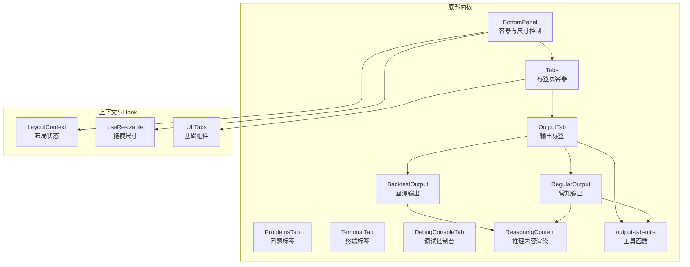
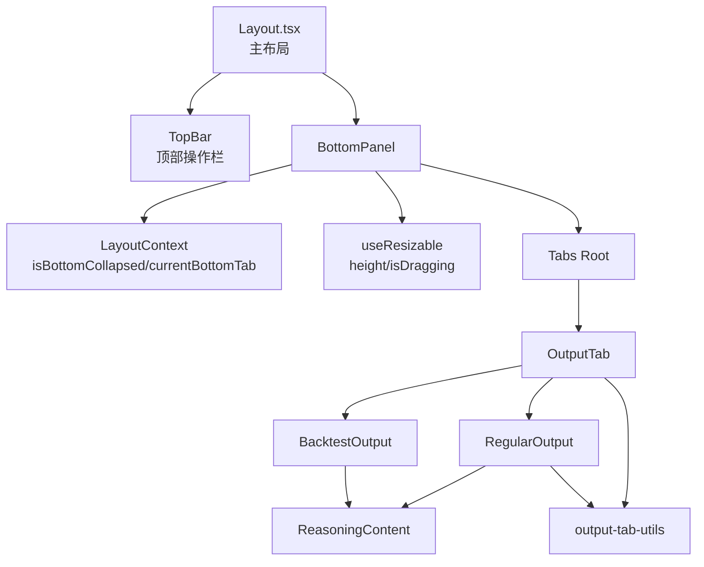
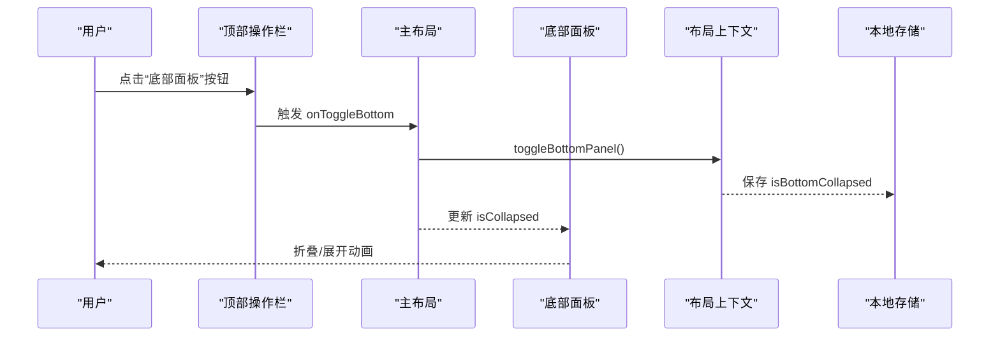
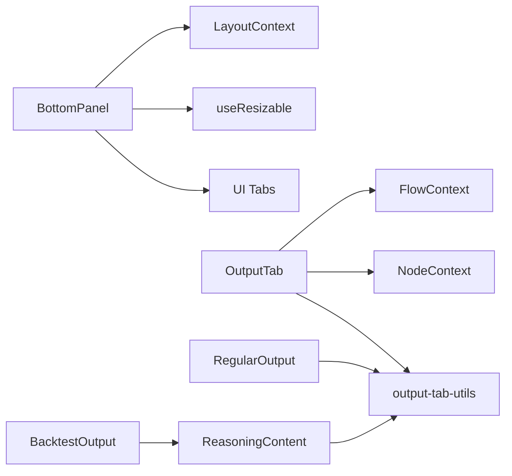

# 面板组件

<cite>
**本文引用的文件**
- [bottom-panel.tsx](file://app/frontend/src/components/panels/bottom/bottom-panel.tsx)
- [index.ts](file://app/frontend/src/components/panels/bottom/tabs/index.ts)
- [output-tab.tsx](file://app/frontend/src/components/panels/bottom/tabs/output-tab.tsx)
- [backtest-output.tsx](file://app/frontend/src/components/panels/bottom/tabs/backtest-output.tsx)
- [regular-output.tsx](file://app/frontend/src/components/panels/bottom/tabs/regular-output.tsx)
- [problems-tab.tsx](file://app/frontend/src/components/panels/bottom/tabs/problems-tab.tsx)
- [terminal-tab.tsx](file://app/frontend/src/components/panels/bottom/tabs/terminal-tab.tsx)
- [debug-console-tab.tsx](file://app/frontend/src/components/panels/bottom/tabs/debug-console-tab.tsx)
- [output-tab-utils.ts](file://app/frontend/src/components/panels/bottom/tabs/output-tab-utils.ts)
- [reasoning-content.tsx](file://app/frontend/src/components/panels/bottom/tabs/reasoning-content.tsx)
- [layout-context.tsx](file://app/frontend/src/contexts/layout-context.tsx)
- [use-resizable.ts](file://app/frontend/src/hooks/use-resizable.ts)
- [tabs.tsx](file://app/frontend/src/components/ui/tabs.tsx)
- [Layout.tsx](file://app/frontend/src/components/Layout.tsx)
- [sidebar-storage.ts](file://app/frontend/src/services/sidebar-storage.ts)
</cite>

## 目录
1. [简介](#简介)
2. [项目结构](#项目结构)
3. [核心组件](#核心组件)
4. [架构总览](#架构总览)
5. [组件详解](#组件详解)
6. [依赖关系分析](#依赖关系分析)
7. [性能与可扩展性](#性能与可扩展性)
8. [故障排查](#故障排查)
9. [结论](#结论)
10. [附录：API与配置](#附录api与配置)

## 简介
本文件系统化梳理底部面板组件的架构设计与功能组织，覆盖标签页体系（输出、调试控制台、回测输出、问题、终端）、面板切换与尺寸控制、状态管理、生命周期与事件处理、以及扩展机制与自定义标签页开发指南，并给出布局与响应式适配建议。

## 项目结构
底部面板位于前端组件树的“面板/底部”目录下，采用“主面板容器 + 标签页集合”的分层组织方式；标签页通过统一导出入口集中管理；状态与布局由上下文与自定义 Hook 提供支持；UI 基础组件来自通用 UI 组件库。

图示来源
- [bottom-panel.tsx:19-99](file://app/frontend/src/components/panels/bottom/bottom-panel.tsx#L19-L99)
- [output-tab.tsx:13-57](file://app/frontend/src/components/panels/bottom/tabs/output-tab.tsx#L13-L57)
- [backtest-output.tsx:398-416](file://app/frontend/src/components/panels/bottom/tabs/backtest-output.tsx#L398-L416)
- [regular-output.tsx:216-230](file://app/frontend/src/components/panels/bottom/tabs/regular-output.tsx#L216-L230)
- [layout-context.tsx:27-68](file://app/frontend/src/contexts/layout-context.tsx#L27-L68)
- [use-resizable.ts:13-93](file://app/frontend/src/hooks/use-resizable.ts#L13-L93)
- [tabs.tsx:6-54](file://app/frontend/src/components/ui/tabs.tsx#L6-L54)

章节来源
- [bottom-panel.tsx:19-99](file://app/frontend/src/components/panels/bottom/bottom-panel.tsx#L19-L99)
- [index.ts:1-6](file://app/frontend/src/components/panels/bottom/tabs/index.ts#L1-L6)

## 核心组件
- 底部面板容器 BottomPanel：负责面板折叠/展开、高度拖拽、顶部标签页与关闭按钮、内容区渲染。
- 输出标签 OutputTab：根据是否为回测运行选择回测输出或常规输出；周期性触发重渲染以显示实时进度。
- 回测输出 BacktestOutput：展示回测进度、交易活动表、性能指标与最终结果。
- 常规输出 RegularOutput：展示各代理进度、汇总决策、按标的细分的分析与推理。
- 其他标签：问题、终端、调试控制台（占位/空态）。
- 工具与辅助：输出标签工具函数、推理内容渲染组件。
- 上下文与 Hook：布局上下文（状态与动作）、可拖拽 Hook、UI Tabs 组件。

章节来源
- [bottom-panel.tsx:19-99](file://app/frontend/src/components/panels/bottom/bottom-panel.tsx#L19-L99)
- [output-tab.tsx:13-57](file://app/frontend/src/components/panels/bottom/tabs/output-tab.tsx#L13-L57)
- [backtest-output.tsx:398-416](file://app/frontend/src/components/panels/bottom/tabs/backtest-output.tsx#L398-L416)
- [regular-output.tsx:216-230](file://app/frontend/src/components/panels/bottom/tabs/regular-output.tsx#L216-L230)
- [problems-tab.tsx:5-15](file://app/frontend/src/components/panels/bottom/tabs/problems-tab.tsx#L5-L15)
- [terminal-tab.tsx:5-21](file://app/frontend/src/components/panels/bottom/tabs/terminal-tab.tsx#L5-L21)
- [debug-console-tab.tsx:5-15](file://app/frontend/src/components/panels/bottom/tabs/debug-console-tab.tsx#L5-L15)
- [output-tab-utils.ts:1-105](file://app/frontend/src/components/panels/bottom/tabs/output-tab-utils.ts#L1-L105)
- [reasoning-content.tsx:6-51](file://app/frontend/src/components/panels/bottom/tabs/reasoning-content.tsx#L6-L51)

## 架构总览
底部面板采用“容器 + 多标签页 + 工具函数”的分层设计，配合全局布局上下文与可拖拽 Hook 实现状态持久化与交互体验优化。主面板容器负责渲染与尺寸控制，标签页负责内容组织与数据绑定，工具函数提供格式化与颜色映射等能力。

图示来源
- [Layout.tsx:105-186](file://app/frontend/src/components/Layout.tsx#L105-L186)
- [bottom-panel.tsx:19-99](file://app/frontend/src/components/panels/bottom/bottom-panel.tsx#L19-L99)
- [layout-context.tsx:27-68](file://app/frontend/src/contexts/layout-context.tsx#L27-L68)
- [use-resizable.ts:13-93](file://app/frontend/src/hooks/use-resizable.ts#L13-L93)
- [tabs.tsx:6-54](file://app/frontend/src/components/ui/tabs.tsx#L6-L54)
- [output-tab.tsx:13-57](file://app/frontend/src/components/panels/bottom/tabs/output-tab.tsx#L13-L57)
- [regular-output.tsx:216-230](file://app/frontend/src/components/panels/bottom/tabs/regular-output.tsx#L216-L230)
- [backtest-output.tsx:398-416](file://app/frontend/src/components/panels/bottom/tabs/backtest-output.tsx#L398-L416)
- [reasoning-content.tsx:6-51](file://app/frontend/src/components/panels/bottom/tabs/reasoning-content.tsx#L6-L51)
- [output-tab-utils.ts:1-105](file://app/frontend/src/components/panels/bottom/tabs/output-tab-utils.ts#L1-L105)

## 组件详解

### 底部面板容器 BottomPanel
- 职责
  - 接收外部传入的折叠状态与回调，决定是否渲染。
  - 使用自定义 Hook 进行垂直拖拽，限制最小/最大高度，实时更新高度并通知父级。
  - 顶部标签页用于切换当前底部标签页（当前版本仅输出标签）。
  - 关闭按钮用于折叠面板。
  - 内容区使用 Tabs 容器承载当前标签页内容。
- 关键点
  - 拖拽手柄位于面板顶部，避免拖拽时影响内容选择。
  - 高度变化通过副作用通知父组件，便于主布局计算主区域尺寸。
  - 与布局上下文联动，读取/设置当前底部标签页值。

章节来源
- [bottom-panel.tsx:19-99](file://app/frontend/src/components/panels/bottom/bottom-panel.tsx#L19-L99)
- [use-resizable.ts:13-93](file://app/frontend/src/hooks/use-resizable.ts#L13-L93)
- [layout-context.tsx:27-68](file://app/frontend/src/contexts/layout-context.tsx#L27-L68)

### 输出标签 OutputTab
- 职责
  - 从流程上下文中获取当前流程 ID，再从节点上下文中拉取代理与输出数据。
  - 周期性触发重渲染以显示实时进度。
  - 判断是否为回测运行，分别渲染回测输出或常规输出。
  - 无数据时显示空态提示。
- 数据绑定
  - 代理数据：过滤掉回测专用代理后排序展示。
  - 输出数据：用于常规输出的汇总与明细。
- 生命周期
  - 初始化时读取一次数据。
  - 每秒触发一次重渲染，确保进度与消息实时可见。

章节来源
- [output-tab.tsx:13-57](file://app/frontend/src/components/panels/bottom/tabs/output-tab.tsx#L13-L57)

### 回测输出 BacktestOutput
- 结构
  - 回测进度卡片：展示回测运行状态与消息。
  - 交易活动表：按日期倒序展示最近若干条交易记录。
  - 性能指标：总收益、胜率、最大回撤、交易期数等。
  - 最终结果：性能指标、投资组合摘要、头寸分布。
- 性能与数据量控制
  - 交易活动表仅保留最近若干条，避免列表过长导致卡顿。
  - 性能指标基于回测结果数组计算，包含累计回报、周期回报序列、峰值追踪等。

章节来源
- [backtest-output.tsx:398-416](file://app/frontend/src/components/panels/bottom/tabs/backtest-output.tsx#L398-L416)

### 常规输出 RegularOutput
- 结构
  - 进度卡片：按优先级与时间顺序展示各代理状态与消息。
  - 汇总表格：展示对各标的的行动、数量与置信度。
  - 分析结果：按标的分页展示各分析师信号、理由与最终决策。
- 交互
  - 使用内部 Tabs 对标的进行分页切换。
  - 默认选中第一个标的，便于首次查看。
- 渲染细节
  - 使用工具函数进行名称清洗、颜色映射与图标选择。
  - 推理内容支持复制到剪贴板与 JSON 格式化展示。

章节来源
- [regular-output.tsx:216-230](file://app/frontend/src/components/panels/bottom/tabs/regular-output.tsx#L216-L230)

### 其他标签页
- 问题标签 ProblemsTab：空态提示，表示当前无问题。
- 终端标签 TerminalTab：欢迎信息与光标动画，占位展示。
- 调试控制台 DebugConsoleTab：就绪提示，占位展示。

章节来源
- [problems-tab.tsx:5-15](file://app/frontend/src/components/panels/bottom/tabs/problems-tab.tsx#L5-L15)
- [terminal-tab.tsx:5-21](file://app/frontend/src/components/panels/bottom/tabs/terminal-tab.tsx#L5-L21)
- [debug-console-tab.tsx:5-15](file://app/frontend/src/components/panels/bottom/tabs/debug-console-tab.tsx#L5-L15)

### 工具与辅助
- 输出标签工具 output-tab-utils
  - JSON 判定、显示名清洗、状态图标与颜色映射、信号与动作颜色映射、代理排序策略。
- 推理内容 ReasoningContent
  - 支持复制到剪贴板、JSON 自动格式化、段落换行渲染。

章节来源
- [output-tab-utils.ts:1-105](file://app/frontend/src/components/panels/bottom/tabs/output-tab-utils.ts#L1-L105)
- [reasoning-content.tsx:6-51](file://app/frontend/src/components/panels/bottom/tabs/reasoning-content.tsx#L6-L51)

### 状态管理与生命周期
- 布局上下文 LayoutContext
  - 管理底部面板折叠状态与当前底部标签页。
  - 通过本地存储服务持久化状态，组件挂载时加载，状态变更时保存。
- 主布局 Layout
  - 将面板折叠状态与高度变化传递给 BottomPanel。
  - 根据面板折叠状态动态调整主内容区域的底边距。

章节来源
- [layout-context.tsx:27-68](file://app/frontend/src/contexts/layout-context.tsx#L27-L68)
- [sidebar-storage.ts:1-237](file://app/frontend/src/services/sidebar-storage.ts#L1-L237)
- [Layout.tsx:105-186](file://app/frontend/src/components/Layout.tsx#L105-L186)

### 事件处理与交互流程
- 标签页切换
  - 底部面板头部 Tabs 的值与回调与布局上下文同步，实现跨组件的状态联动。
- 面板折叠/展开
  - 顶部操作栏按钮与面板关闭按钮均调用布局上下文提供的切换方法。
- 拖拽调整高度
  - 面板顶部拖拽手柄触发自定义 Hook，实时计算并限制高度，同时阻止文本选择提升交互体验。

图示来源
- [Layout.tsx:105-186](file://app/frontend/src/components/Layout.tsx#L105-L186)
- [layout-context.tsx:27-68](file://app/frontend/src/contexts/layout-context.tsx#L27-L68)
- [sidebar-storage.ts:38-49](file://app/frontend/src/services/sidebar-storage.ts#L38-L49)

## 依赖关系分析
- 组件耦合
  - BottomPanel 依赖布局上下文与可拖拽 Hook，耦合度低，职责清晰。
  - OutputTab 依赖流程与节点上下文，数据来源明确。
  - 各标签页组件相对独立，通过统一的 Tabs 容器进行编排。
- 外部依赖
  - UI Tabs 来源于 Radix UI，提供语义化与无障碍支持。
  - 本地存储服务封装了状态持久化逻辑，避免在组件内分散处理。

图示来源
- [bottom-panel.tsx:19-99](file://app/frontend/src/components/panels/bottom/bottom-panel.tsx#L19-L99)
- [output-tab.tsx:13-57](file://app/frontend/src/components/panels/bottom/tabs/output-tab.tsx#L13-L57)
- [regular-output.tsx:216-230](file://app/frontend/src/components/panels/bottom/tabs/regular-output.tsx#L216-L230)
- [backtest-output.tsx:398-416](file://app/frontend/src/components/panels/bottom/tabs/backtest-output.tsx#L398-L416)
- [reasoning-content.tsx:6-51](file://app/frontend/src/components/panels/bottom/tabs/reasoning-content.tsx#L6-L51)
- [output-tab-utils.ts:1-105](file://app/frontend/src/components/panels/bottom/tabs/output-tab-utils.ts#L1-L105)
- [tabs.tsx:6-54](file://app/frontend/src/components/ui/tabs.tsx#L6-L54)

## 性能与可扩展性
- 性能考量
  - OutputTab 每秒强制重渲染以保证实时性，建议在数据量较大时考虑更细粒度的订阅或增量更新。
  - BacktestOutput 的交易活动表限制最近若干条，避免列表膨胀；可进一步引入虚拟滚动以支持更多数据。
  - RegularOutput 的分析结果按标的分页，减少一次性渲染压力。
- 可扩展性
  - 新增标签页：在标签页索引导出中添加新组件，并在底部面板的 Tabs 中注册；保持与现有工具函数与上下文一致即可。
  - 自定义标签页开发：遵循现有命名与导出规范，复用 UI Tabs 与工具函数，确保一致性与可维护性。

[本节为通用指导，不直接分析具体文件]

## 故障排查
- 面板无法折叠/展开
  - 检查布局上下文是否正确提供切换方法与状态。
  - 确认本地存储服务未抛错且键名一致。
- 面板高度异常
  - 检查拖拽 Hook 的最小/最大高度配置是否合理。
  - 确认主布局未对底部面板高度产生冲突样式。
- 输出为空
  - 确认流程上下文与节点上下文已正确提供数据。
  - 检查回测标记与数据结构是否符合预期。

章节来源
- [layout-context.tsx:27-68](file://app/frontend/src/contexts/layout-context.tsx#L27-L68)
- [sidebar-storage.ts:102-118](file://app/frontend/src/services/sidebar-storage.ts#L102-L118)
- [use-resizable.ts:13-93](file://app/frontend/src/hooks/use-resizable.ts#L13-L93)
- [Layout.tsx:105-186](file://app/frontend/src/components/Layout.tsx#L105-L186)

## 结论
底部面板组件通过清晰的分层设计与上下文驱动的状态管理，实现了稳定的面板折叠、尺寸控制与内容渲染。标签页体系覆盖回测与常规输出场景，工具函数与通用 UI 组件提升了可维护性与一致性。未来可在数据订阅与渲染优化方面进一步增强，同时保持扩展性以支持更多标签页类型。

[本节为总结性内容，不直接分析具体文件]

## 附录：API与配置

### 底部面板容器 BottomPanel Props
- isCollapsed: 是否折叠
- onToggleCollapse: 切换折叠状态
- onHeightChange: 高度变化回调(height: number)

章节来源
- [bottom-panel.tsx:10-17](file://app/frontend/src/components/panels/bottom/bottom-panel.tsx#L10-L17)

### 布局上下文 LayoutContext
- isBottomCollapsed: 底部面板折叠状态
- expandBottomPanel/collapseBottomPanel/toggleBottomPanel: 控制面板折叠
- setBottomPanelTab/currentBottomTab: 当前底部标签页

章节来源
- [layout-context.tsx:4-11](file://app/frontend/src/contexts/layout-context.tsx#L4-L11)
- [layout-context.tsx:27-68](file://app/frontend/src/contexts/layout-context.tsx#L27-L68)

### 可拖拽 Hook useResizable
- 选项
  - minWidth/minHeight、maxWidth/maxHeight、defaultWidth/defaultHeight
  - side: 'bottom'（当前用于底部面板）
- 返回
  - width/height、isDragging、elementRef、startResize

章节来源
- [use-resizable.ts:3-21](file://app/frontend/src/hooks/use-resizable.ts#L3-L21)
- [use-resizable.ts:86-92](file://app/frontend/src/hooks/use-resizable.ts#L86-L92)

### 输出标签工具 output-tab-utils
- isJsonString(str): 判定字符串是否为 JSON
- getDisplayName(name): 清洗并格式化显示名
- getStatusIcon/statusColor/signalColor/actionColor: 获取状态/信号/动作的颜色映射
- sortAgents(agents): 代理排序策略

章节来源
- [output-tab-utils.ts:1-105](file://app/frontend/src/components/panels/bottom/tabs/output-tab-utils.ts#L1-L105)

### 推理内容 ReasoningContent
- props: content
- 行为：复制到剪贴板、JSON 自动格式化、段落渲染

章节来源
- [reasoning-content.tsx:6-51](file://app/frontend/src/components/panels/bottom/tabs/reasoning-content.tsx#L6-L51)

### 标签页导出索引
- 导出 DebugConsoleTab、OutputTab、ProblemsTab、TerminalTab

章节来源
- [index.ts:1-6](file://app/frontend/src/components/panels/bottom/tabs/index.ts#L1-L6)

### UI Tabs 组件
- Tabs/TabsList/TabsTrigger/TabsContent
- 用于标签页容器与触发器

章节来源
- [tabs.tsx:6-54](file://app/frontend/src/components/ui/tabs.tsx#L6-L54)