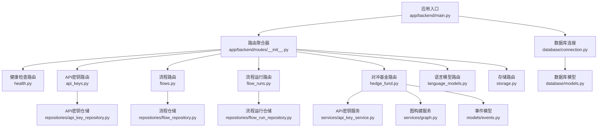
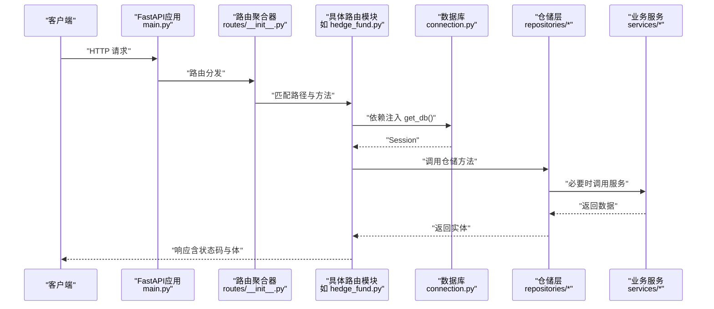
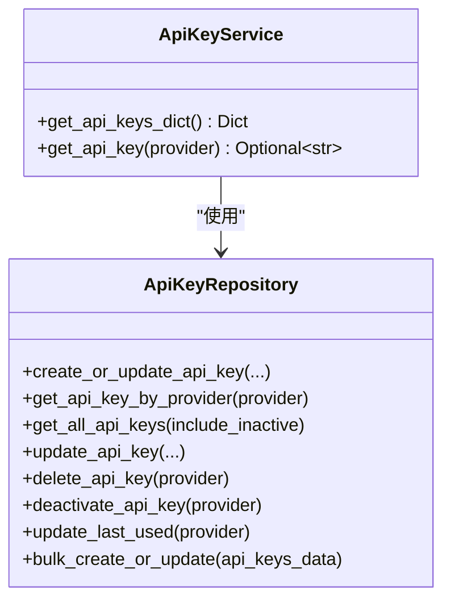
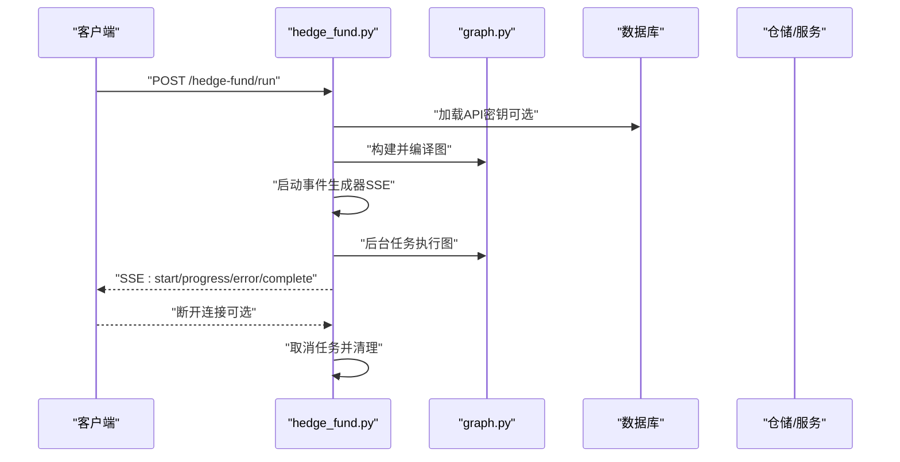
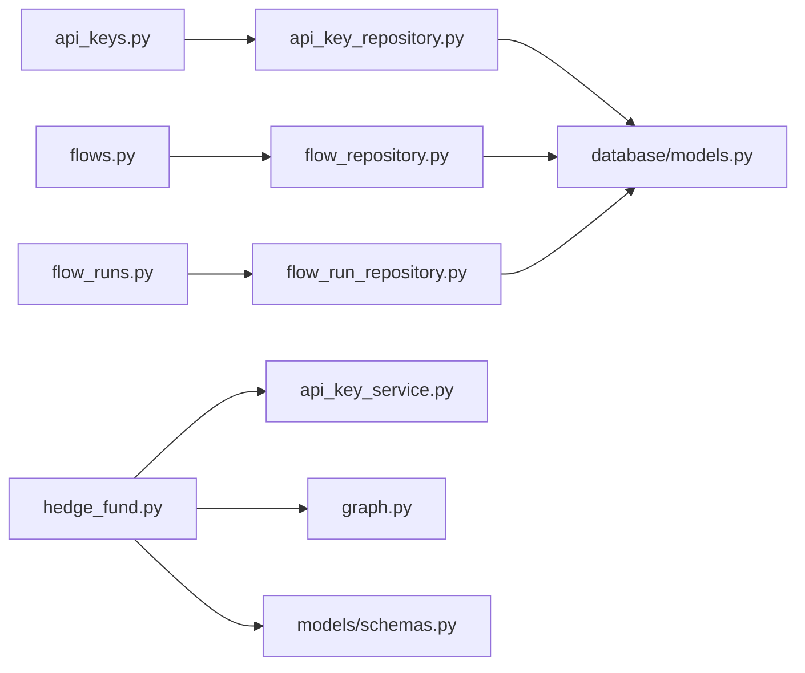

# API路由系统

<cite>
**本文档引用的文件**
- [app/backend/main.py](file://app/backend/main.py)
- [app/backend/routes/__init__.py](file://app/backend/routes/__init__.py)
- [app/backend/routes/health.py](file://app/backend/routes/health.py)
- [app/backend/routes/api_keys.py](file://app/backend/routes/api_keys.py)
- [app/backend/routes/flows.py](file://app/backend/routes/flows.py)
- [app/backend/routes/flow_runs.py](file://app/backend/routes/flow_runs.py)
- [app/backend/routes/hedge_fund.py](file://app/backend/routes/hedge_fund.py)
- [app/backend/routes/language_models.py](file://app/backend/routes/language_models.py)
- [app/backend/routes/storage.py](file://app/backend/routes/storage.py)
- [app/backend/models/schemas.py](file://app/backend/models/schemas.py)
- [app/backend/database/connection.py](file://app/backend/database/connection.py)
- [app/backend/database/models.py](file://app/backend/database/models.py)
- [app/backend/repositories/api_key_repository.py](file://app/backend/repositories/api_key_repository.py)
- [app/backend/repositories/flow_repository.py](file://app/backend/repositories/flow_repository.py)
- [app/backend/repositories/flow_run_repository.py](file://app/backend/repositories/flow_run_repository.py)
- [app/backend/services/api_key_service.py](file://app/backend/services/api_key_service.py)
- [app/backend/services/graph.py](file://app/backend/services/graph.py)
- [app/backend/models/events.py](file://app/backend/models/events.py)
</cite>

## 目录
1. [简介](#简介)
2. [项目结构](#项目结构)
3. [核心组件](#核心组件)
4. [架构总览](#架构总览)
5. [详细组件分析](#详细组件分析)
6. [依赖关系分析](#依赖关系分析)
7. [性能考虑](#性能考虑)
8. [故障排除指南](#故障排除指南)
9. [结论](#结论)

## 简介
本文件系统性梳理了基于 FastAPI 的后端 API 路由体系，涵盖路由设计原则、组织结构、注册机制、URL 模式匹配与 HTTP 方法映射；逐项说明各端点功能、请求参数与响应格式；阐述中间件、异常处理与错误响应标准化；提供路由扩展指南、新增端点流程与最佳实践；并给出性能优化、缓存策略与安全建议，以及调试与故障排除方法。

## 项目结构
后端采用分层与按功能模块划分的组织方式：
- 应用入口与中间件：在应用启动时初始化数据库表、配置 CORS，并挂载主路由。
- 路由聚合：通过统一的路由聚合器将子路由按功能域分组注册。
- 功能路由：健康检查、API 密钥管理、流程与执行运行、对冲基金运行与回测、语言模型、存储等。
- 数据访问层：SQLAlchemy 连接、模型定义与仓储层。
- 业务服务：图构建、代理服务、回测服务、API 密钥服务等。
- 数据模型与校验：Pydantic 模型定义请求/响应结构与字段校验。

**图表来源**
- [app/backend/main.py:1-56](file://app/backend/main.py#L1-L56)
- [app/backend/routes/__init__.py:1-24](file://app/backend/routes/__init__.py#L1-L24)
- [app/backend/database/connection.py:1-32](file://app/backend/database/connection.py#L1-L32)
- [app/backend/database/models.py:1-115](file://app/backend/database/models.py#L1-L115)

**章节来源**
- [app/backend/main.py:1-56](file://app/backend/main.py#L1-L56)
- [app/backend/routes/__init__.py:1-24](file://app/backend/routes/__init__.py#L1-L24)

## 核心组件
- 应用实例与中间件
  - 创建 FastAPI 实例，配置日志、CORS（允许本地前端地址）、数据库表初始化。
  - 在应用启动事件中检查 Ollama 状态并记录信息。
- 路由聚合器
  - 定义主 APIRouter，并按标签将各子路由注册到主路由下，形成清晰的功能域分组。
- 数据库与依赖注入
  - 使用 SQLAlchemy SQLite 引擎与 SessionLocal，提供 get_db 依赖供路由函数注入。
- 事件与流式响应
  - 基于 Server-Sent Events（SSE）实现长连接流式输出，支持断开检测与清理。

**章节来源**
- [app/backend/main.py:1-56](file://app/backend/main.py#L1-L56)
- [app/backend/routes/__init__.py:1-24](file://app/backend/routes/__init__.py#L1-L24)
- [app/backend/database/connection.py:1-32](file://app/backend/database/connection.py#L1-L32)
- [app/backend/models/events.py:1-46](file://app/backend/models/events.py#L1-L46)

## 架构总览
路由系统遵循“应用入口 → 路由聚合器 → 子路由 → 仓储/服务 → 数据库”的分层结构。每个子路由以 APIRouter 包裹，统一前缀与标签，便于文档生成与维护。异常通过 HTTPException 标准化返回，结合 Pydantic 模型进行请求/响应校验与序列化。

**图表来源**
- [app/backend/main.py:1-56](file://app/backend/main.py#L1-L56)
- [app/backend/routes/__init__.py:1-24](file://app/backend/routes/__init__.py#L1-L24)
- [app/backend/database/connection.py:1-32](file://app/backend/database/connection.py#L1-L32)

## 详细组件分析

### 健康检查路由（health）
- 路径与方法
  - GET "/" 返回欢迎消息
  - GET "/ping" 返回 Server-Sent Events 流，用于心跳检测
- 流程要点
  - SSE 事件生成器按固定间隔发送数据，客户端可实时接收心跳
- 错误处理
  - 未见显式异常抛出，保持简单稳定

**章节来源**
- [app/backend/routes/health.py:1-28](file://app/backend/routes/health.py#L1-L28)

### API 密钥路由（api-keys）
- 路径与方法
  - POST "/": 创建或更新 API 密钥
  - GET "/": 获取所有 API 密钥（摘要视图）
  - GET "/{provider}": 按提供商获取单个密钥
  - PUT "/{provider}": 更新指定密钥
  - DELETE "/{provider}": 删除指定密钥
  - PATCH "/{provider}/deactivate": 暂停指定密钥
  - POST "/bulk": 批量创建/更新
  - PATCH "/{provider}/last-used": 更新最后使用时间
- 请求与响应
  - 使用 Pydantic 模型进行输入校验与输出序列化
  - 支持 404/500 等错误响应模型
- 仓储与服务
  - 通过 ApiKeyRepository 执行数据库操作
  - ApiKeyService 提供从数据库加载密钥字典的能力

**图表来源**
- [app/backend/repositories/api_key_repository.py:1-131](file://app/backend/repositories/api_key_repository.py#L1-L131)
- [app/backend/services/api_key_service.py:1-23](file://app/backend/services/api_key_service.py#L1-L23)

**章节来源**
- [app/backend/routes/api_keys.py:1-201](file://app/backend/routes/api_keys.py#L1-L201)
- [app/backend/repositories/api_key_repository.py:1-131](file://app/backend/repositories/api_key_repository.py#L1-L131)
- [app/backend/services/api_key_service.py:1-23](file://app/backend/services/api_key_service.py#L1-L23)

### 流程路由（flows）
- 路径与方法
  - POST "/": 创建流程
  - GET "/": 获取流程列表（摘要）
  - GET "/{flow_id}": 获取指定流程详情
  - PUT "/{flow_id}": 更新流程
  - DELETE "/{flow_id}": 删除流程
  - POST "/{flow_id}/duplicate": 复制流程
  - GET "/search/{name}": 按名称搜索流程
- 关键逻辑
  - 使用 FlowRepository 进行 CRUD 操作
  - 支持模板与标签过滤、名称模糊查询

**章节来源**
- [app/backend/routes/flows.py:1-174](file://app/backend/routes/flows.py#L1-L174)
- [app/backend/repositories/flow_repository.py:1-103](file://app/backend/repositories/flow_repository.py#L1-L103)

### 流程运行路由（flow-runs）
- 路径与方法
  - POST "/": 创建运行
  - GET "/": 分页获取运行列表（带 limit/offset）
  - GET "/active": 获取当前进行中的运行
  - GET "/latest": 获取最新运行
  - GET "/{run_id}": 获取指定运行
  - PUT "/{run_id}": 更新运行状态/结果
  - DELETE "/{run_id}": 删除运行
  - DELETE "/": 删除某流程的所有运行
  - GET "/count": 获取运行总数
- 关键逻辑
  - 先验证流程存在性，再执行运行相关操作
  - 使用 FlowRunRepository 管理运行生命周期与计数

**章节来源**
- [app/backend/routes/flow_runs.py:1-303](file://app/backend/routes/flow_runs.py#L1-L303)
- [app/backend/repositories/flow_run_repository.py:1-133](file://app/backend/repositories/flow_run_repository.py#L1-L133)

### 对冲基金路由（hedge-fund）
- 路径与方法
  - POST "/run": 启动一次性的对冲基金运行，返回 SSE 流
  - POST "/backtest": 启动回测，返回 SSE 流
  - GET "/agents": 获取可用代理列表
- 流程要点
  - 自动从数据库补全 API 密钥
  - 构建 LangGraph 图并异步执行
  - 使用事件模型（Start/Progress/Error/Complete）通过 SSE 推送进度与结果
  - 支持客户端断开检测与资源清理
- 数据模型
  - 使用 HedgeFundRequest/BacktestRequest 等 Pydantic 模型进行参数校验
  - 事件模型定义 SSE 输出格式

**图表来源**
- [app/backend/routes/hedge_fund.py:1-353](file://app/backend/routes/hedge_fund.py#L1-L353)
- [app/backend/services/graph.py:1-193](file://app/backend/services/graph.py#L1-L193)
- [app/backend/models/events.py:1-46](file://app/backend/models/events.py#L1-L46)

**章节来源**
- [app/backend/routes/hedge_fund.py:1-353](file://app/backend/routes/hedge_fund.py#L1-L353)
- [app/backend/models/schemas.py:1-292](file://app/backend/models/schemas.py#L1-L292)
- [app/backend/services/graph.py:1-193](file://app/backend/services/graph.py#L1-L193)
- [app/backend/models/events.py:1-46](file://app/backend/models/events.py#L1-L46)

### 语言模型路由（language-models）
- 路径与方法
  - GET "/": 获取云模型与本地 Ollama 模型列表
  - GET "/providers": 按提供商分组列出模型
- 实现要点
  - 调用 OllamaService 获取本地可用模型
  - 聚合云模型列表并返回

**章节来源**
- [app/backend/routes/language_models.py:1-62](file://app/backend/routes/language_models.py#L1-L62)

### 存储路由（storage）
- 路径与方法
  - POST "/save-json": 将 JSON 数据保存至项目 outputs 目录
- 实现要点
  - 使用 Pydantic 校验请求体
  - 绝对路径定位项目根目录下的 outputs 文件夹

**章节来源**
- [app/backend/routes/storage.py:1-44](file://app/backend/routes/storage.py#L1-L44)

## 依赖关系分析
- 路由到仓储/服务
  - 各路由模块通过依赖注入获取数据库会话，再调用对应仓储类完成数据持久化。
  - 业务服务（如图构建、回测）在路由层被调用，负责复杂逻辑封装。
- 数据模型与校验
  - Pydantic 模型贯穿请求/响应，确保类型安全与字段约束。
- 数据库模型
  - SQLAlchemy 模型定义了流程、运行、运行周期与 API 密钥的表结构。

**图表来源**
- [app/backend/routes/api_keys.py:1-201](file://app/backend/routes/api_keys.py#L1-L201)
- [app/backend/repositories/api_key_repository.py:1-131](file://app/backend/repositories/api_key_repository.py#L1-L131)
- [app/backend/routes/flows.py:1-174](file://app/backend/routes/flows.py#L1-L174)
- [app/backend/repositories/flow_repository.py:1-103](file://app/backend/repositories/flow_repository.py#L1-L103)
- [app/backend/routes/flow_runs.py:1-303](file://app/backend/routes/flow_runs.py#L1-L303)
- [app/backend/repositories/flow_run_repository.py:1-133](file://app/backend/repositories/flow_run_repository.py#L1-L133)
- [app/backend/routes/hedge_fund.py:1-353](file://app/backend/routes/hedge_fund.py#L1-L353)
- [app/backend/services/api_key_service.py:1-23](file://app/backend/services/api_key_service.py#L1-L23)
- [app/backend/services/graph.py:1-193](file://app/backend/services/graph.py#L1-L193)
- [app/backend/models/schemas.py:1-292](file://app/backend/models/schemas.py#L1-L292)
- [app/backend/database/models.py:1-115](file://app/backend/database/models.py#L1-L115)

**章节来源**
- [app/backend/models/schemas.py:1-292](file://app/backend/models/schemas.py#L1-L292)
- [app/backend/database/models.py:1-115](file://app/backend/database/models.py#L1-L115)

## 性能考虑
- 异步与并发
  - 对冲基金运行与回测通过 asyncio 任务与队列实现非阻塞事件推送，避免主线程阻塞。
- 数据库访问
  - 使用依赖注入的 SessionLocal，确保每次请求独立会话；注意批量写入时的事务提交策略。
- SSE 流式输出
  - 事件生成器按需产出数据，减少一次性大对象传输；客户端断开检测可及时释放资源。
- 缓存策略
  - 可在路由层引入内存缓存（如 LRU）缓存热点查询结果（如模型列表），但需注意缓存失效与一致性。
- 中间件与限流
  - 可在现有 CORS 中加入速率限制中间件，防止突发流量冲击。
- I/O 优化
  - 文件写入（/storage/save-json）建议使用异步文件系统或线程池，避免阻塞事件循环。

[本节为通用性能建议，不直接分析具体文件，故无“章节来源”]

## 故障排除指南
- 常见问题与定位
  - 404 未找到：检查路径参数与关联实体是否存在（如流程/运行）。
  - 500 服务器错误：查看路由层捕获的异常并结合服务/仓储日志定位。
  - SSE 不断流：确认客户端未提前断开；检查事件生成器与断开检测逻辑。
- 调试技巧
  - 启用更详细的日志级别，观察应用启动与路由注册过程。
  - 使用最小化请求体复现问题，逐步缩小范围。
  - 对流式接口，可在客户端使用浏览器网络面板观察 SSE 事件流。
- 错误响应标准化
  - 统一使用 HTTPException 并返回 ErrorResponse 模型，便于前端一致处理。

**章节来源**
- [app/backend/routes/api_keys.py:1-201](file://app/backend/routes/api_keys.py#L1-L201)
- [app/backend/routes/flow_runs.py:1-303](file://app/backend/routes/flow_runs.py#L1-L303)
- [app/backend/routes/hedge_fund.py:1-353](file://app/backend/routes/hedge_fund.py#L1-L353)
- [app/backend/models/schemas.py:55-58](file://app/backend/models/schemas.py#L55-L58)

## 结论
该 API 路由系统以 FastAPI 为核心，采用模块化与分层设计，具备清晰的路由组织、完善的异常处理与标准化响应、以及基于 SSE 的流式能力。通过仓储与服务分离，保证了业务逻辑与数据访问的内聚性。建议在后续迭代中进一步完善中间件（如认证、限流）、缓存策略与监控埋点，以提升安全性与可观测性。