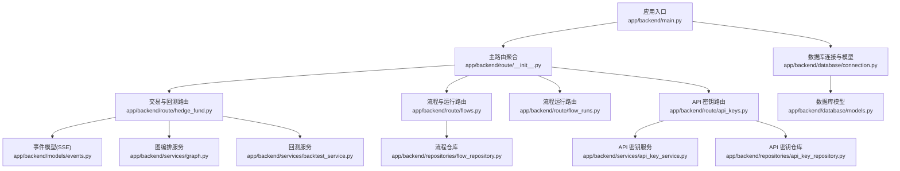
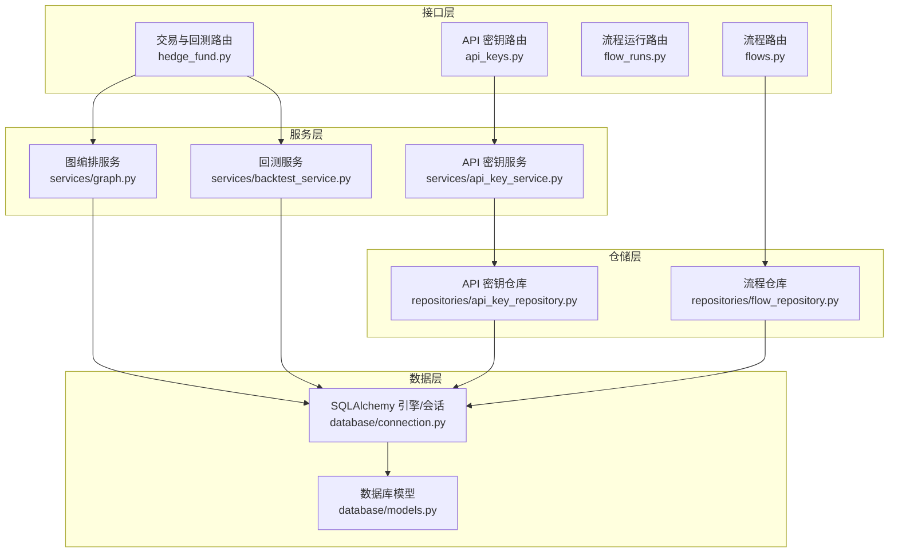
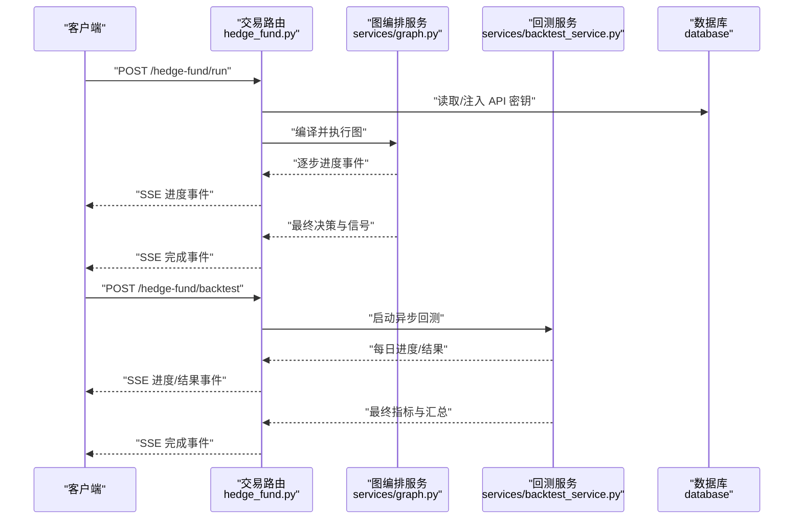
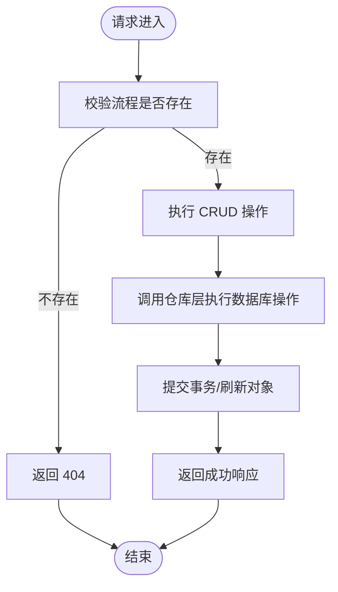
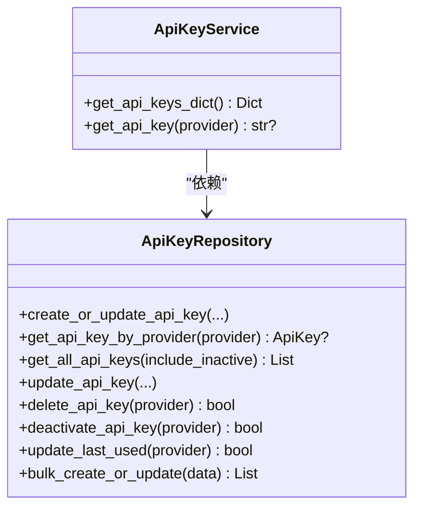
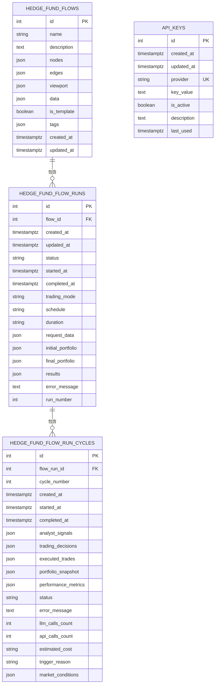
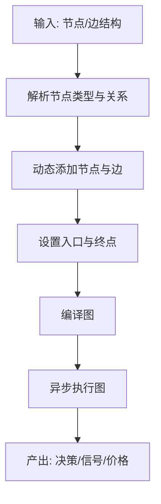
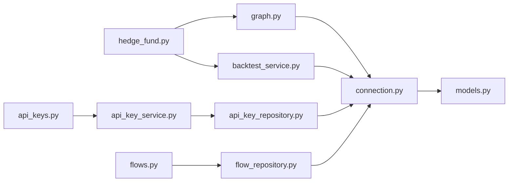

# 后端API

<cite>
**本文引用的文件**
- [app/backend/main.py](file://app/backend/main.py)
- [app/backend/route/__init__.py](file://app/backend/route/__init__.py)
- [app/backend/route/hedge_fund.py](file://app/backend/route/hedge_fund.py)
- [app/backend/route/flows.py](file://app/backend/route/flows.py)
- [app/backend/route/flow_runs.py](file://app/backend/route/flow_runs.py)
- [app/backend/route/api_keys.py](file://app/backend/route/api_keys.py)
- [app/backend/models/schemas.py](file://app/backend/models/schemas.py)
- [app/backend/models/events.py](file://app/backend/models/events.py)
- [app/backend/database/connection.py](file://app/backend/database/connection.py)
- [app/backend/database/models.py](file://app/backend/database/models.py)
- [app/backend/services/graph.py](file://app/backend/services/graph.py)
- [app/backend/services/backtest_service.py](file://app/backend/services/backtest_service.py)
- [app/backend/services/api_key_service.py](file://app/backend/services/api_key_service.py)
- [app/backend/repositories/api_key_repository.py](file://app/backend/repositories/api_key_repository.py)
- [app/backend/repositories/flow_repository.py](file://app/backend/repositories/flow_repository.py)
</cite>

## 目录
1. [简介](#简介)
2. [项目结构](#项目结构)
3. [核心组件](#核心组件)
4. [架构总览](#架构总览)
5. [详细组件分析](#详细组件分析)
6. [依赖分析](#依赖分析)
7. [性能考虑](#性能考虑)
8. [故障排查指南](#故障排查指南)
9. [结论](#结论)
10. [附录](#附录)

## 简介
本文件面向后端开发者，系统性梳理基于 FastAPI 的后端 API 设计与实现，覆盖路由组织、请求响应模型、中间件配置、RESTful 端点设计原则、参数校验与错误处理、数据库模型与 ORM 操作、事务管理、认证授权与 API 密钥管理、安全策略、API 使用示例、SDK 集成与客户端开发指南、性能优化与限流策略、监控告警以及部署与扩展建议。

## 项目结构
后端采用分层架构：入口应用负责初始化、CORS 中间件与路由注册；路由层按功能域拆分子路由；模型层定义 Pydantic 校验模型与 SSE 事件；数据库层使用 SQLAlchemy 定义模型与连接；服务层封装业务流程（如图编排、回测、API 密钥管理）；仓库层封装数据访问。

图表来源
- [app/backend/main.py:1-56](file://app/backend/main.py#L1-L56)
- [app/backend/route/__init__.py:1-24](file://app/backend/route/__init__.py#L1-L24)
- [app/backend/route/hedge_fund.py:1-353](file://app/backend/route/hedge_fund.py#L1-L353)
- [app/backend/route/flows.py:1-174](file://app/backend/route/flows.py#L1-L174)
- [app/backend/route/flow_runs.py:1-303](file://app/backend/route/flow_runs.py#L1-L303)
- [app/backend/route/api_keys.py:1-201](file://app/backend/route/api_keys.py#L1-L201)
- [app/backend/models/events.py:1-46](file://app/backend/models/events.py#L1-L46)
- [app/backend/services/graph.py:1-193](file://app/backend/services/graph.py#L1-L193)
- [app/backend/services/backtest_service.py:1-539](file://app/backend/services/backtest_service.py#L1-L539)
- [app/backend/services/api_key_service.py:1-23](file://app/backend/services/api_key_service.py#L1-L23)
- [app/backend/repositories/api_key_repository.py:1-131](file://app/backend/repositories/api_key_repository.py#L1-L131)
- [app/backend/repositories/flow_repository.py:1-103](file://app/backend/repositories/flow_repository.py#L1-L103)
- [app/backend/database/connection.py:1-32](file://app/backend/database/connection.py#L1-L32)
- [app/backend/database/models.py:1-115](file://app/backend/database/models.py#L1-L115)

章节来源
- [app/backend/main.py:1-56](file://app/backend/main.py#L1-L56)
- [app/backend/route/__init__.py:1-24](file://app/backend/route/__init__.py#L1-L24)

## 核心组件
- 应用入口与中间件
  - 初始化 FastAPI 应用，配置日志、CORS 允许前端地址、数据库表初始化、启动事件检查本地推理服务可用性。
- 路由聚合
  - 主路由统一挂载健康检查、交易与回测、存储、流程、流程运行、Ollama、语言模型、API 密钥等子路由。
- 数据模型与连接
  - 使用 SQLAlchemy 声明式基类与会话工厂，SQLite 绝对路径存储，提供依赖注入 get_db。
- 请求/响应模型与事件
  - 使用 Pydantic 定义请求体、响应体与枚举；SSE 事件模型统一输出格式。
- 服务与仓库
  - 图编排服务、回测服务、API 密钥服务与仓库，分别封装业务逻辑与数据访问。

章节来源
- [app/backend/main.py:1-56](file://app/backend/main.py#L1-L56)
- [app/backend/database/connection.py:1-32](file://app/backend/database/connection.py#L1-L32)
- [app/backend/database/models.py:1-115](file://app/backend/database/models.py#L1-L115)
- [app/backend/models/schemas.py:1-292](file://app/backend/models/schemas.py#L1-L292)
- [app/backend/models/events.py:1-46](file://app/backend/models/events.py#L1-L46)

## 架构总览
后端采用“路由-服务-仓库-模型”分层，结合 SSE 实时流式输出，支持长耗时任务的渐进式反馈。数据库采用 SQLite，便于本地开发与部署；生产环境可替换为 PostgreSQL 并启用连接池与事务隔离。

图表来源
- [app/backend/route/hedge_fund.py:1-353](file://app/backend/route/hedge_fund.py#L1-L353)
- [app/backend/route/flows.py:1-174](file://app/backend/route/flows.py#L1-L174)
- [app/backend/route/flow_runs.py:1-303](file://app/backend/route/flow_runs.py#L1-L303)
- [app/backend/route/api_keys.py:1-201](file://app/backend/route/api_keys.py#L1-L201)
- [app/backend/services/graph.py:1-193](file://app/backend/services/graph.py#L1-L193)
- [app/backend/services/backtest_service.py:1-539](file://app/backend/services/backtest_service.py#L1-L539)
- [app/backend/services/api_key_service.py:1-23](file://app/backend/services/api_key_service.py#L1-L23)
- [app/backend/repositories/api_key_repository.py:1-131](file://app/backend/repositories/api_key_repository.py#L1-L131)
- [app/backend/repositories/flow_repository.py:1-103](file://app/backend/repositories/flow_repository.py#L1-L103)
- [app/backend/database/connection.py:1-32](file://app/backend/database/connection.py#L1-L32)
- [app/backend/database/models.py:1-115](file://app/backend/database/models.py#L1-L115)

## 详细组件分析

### 路由与中间件
- CORS 配置
  - 允许本地前端地址进行跨域访问，支持凭证、任意方法与头。
- 启动事件
  - 在应用启动时检测本地推理服务状态并记录日志。
- 子路由组织
  - 通过主路由聚合器统一 include，按标签分组，便于文档化与维护。

章节来源
- [app/backend/main.py:1-56](file://app/backend/main.py#L1-L56)
- [app/backend/route/__init__.py:1-24](file://app/backend/route/__init__.py#L1-L24)

### 交易与回测路由（SSE 流）
- 端点设计
  - POST /hedge-fund/run：实时流式返回执行进度与最终结果。
  - POST /hedge-fund/backtest：连续回测流式输出每日结果与最终指标。
  - GET /hedge-fund/agents：返回可用代理列表。
- 参数与响应
  - 请求体使用 Pydantic 模型校验，响应通过 SSE 事件模型统一序列化。
- 错误处理
  - 捕获 HTTPException 与通用异常，统一映射到 4xx/5xx 与错误响应模型。
- 流式控制
  - 基于 asyncio 队列与任务，支持客户端断开检测与取消执行。

图表来源
- [app/backend/route/hedge_fund.py:18-161](file://app/backend/route/hedge_fund.py#L18-L161)
- [app/backend/route/hedge_fund.py:170-336](file://app/backend/route/hedge_fund.py#L170-L336)
- [app/backend/services/graph.py:132-177](file://app/backend/services/graph.py#L132-L177)
- [app/backend/services/backtest_service.py:285-512](file://app/backend/services/backtest_service.py#L285-L512)
- [app/backend/models/events.py:16-46](file://app/backend/models/events.py#L16-L46)

章节来源
- [app/backend/route/hedge_fund.py:1-353](file://app/backend/route/hedge_fund.py#L1-L353)
- [app/backend/models/events.py:1-46](file://app/backend/models/events.py#L1-L46)

### 流程与流程运行路由
- 流程管理
  - 创建、查询、更新、删除、复制、按名称搜索流程。
- 流程运行管理
  - 为指定流程创建运行、列出运行、获取当前活动运行、最新运行、指定运行详情、更新、删除、批量删除、统计数量。
- 参数与分页
  - 支持 limit/offset 分页查询，限制单次返回数量。

图表来源
- [app/backend/route/flows.py:18-174](file://app/backend/route/flows.py#L18-L174)
- [app/backend/route/flow_runs.py:20-303](file://app/backend/route/flow_runs.py#L20-L303)
- [app/backend/repositories/flow_repository.py:12-103](file://app/backend/repositories/flow_repository.py#L12-L103)

章节来源
- [app/backend/route/flows.py:1-174](file://app/backend/route/flows.py#L1-L174)
- [app/backend/route/flow_runs.py:1-303](file://app/backend/route/flow_runs.py#L1-L303)
- [app/backend/repositories/flow_repository.py:1-103](file://app/backend/repositories/flow_repository.py#L1-L103)

### API 密钥路由与服务
- 功能
  - 创建/更新、查询、按提供方查询、更新、删除、停用、批量更新、更新最后使用时间。
- 安全
  - 查询返回摘要模型，不暴露真实密钥值；仅在需要时注入到请求上下文。
- 事务
  - 仓库层逐条提交，保证一致性。

图表来源
- [app/backend/services/api_key_service.py:6-23](file://app/backend/services/api_key_service.py#L6-L23)
- [app/backend/repositories/api_key_repository.py:9-131](file://app/backend/repositories/api_key_repository.py#L9-L131)

章节来源
- [app/backend/route/api_keys.py:1-201](file://app/backend/route/api_keys.py#L1-L201)
- [app/backend/services/api_key_service.py:1-23](file://app/backend/services/api_key_service.py#L1-L23)
- [app/backend/repositories/api_key_repository.py:1-131](file://app/backend/repositories/api_key_repository.py#L1-L131)

### 数据模型与 ORM
- 模型
  - HedgeFundFlow：保存 React Flow 配置与元数据。
  - HedgeFundFlowRun：单次执行跟踪与结果。
  - HedgeFundFlowRunCycle：交易会话内的分析周期与成本统计。
  - ApiKey：第三方服务密钥存储。
- 关系
  - FlowRun 外键关联 Flow；FlowRunCycle 外键关联 FlowRun。
- ORM 操作
  - 通过仓库层封装 CRUD；服务层组合业务逻辑；路由层负责依赖注入与异常转换。

图表来源
- [app/backend/database/models.py:6-115](file://app/backend/database/models.py#L6-L115)

章节来源
- [app/backend/database/models.py:1-115](file://app/backend/database/models.py#L1-L115)
- [app/backend/database/connection.py:1-32](file://app/backend/database/connection.py#L1-L32)

### 图编排与回测服务
- 图编排
  - 基于 React Flow 结构动态构建 StateGraph，自动连接分析师、风险经理与投资组合管理节点，最终汇聚至 END。
  - 提供同步/异步执行包装，支持并发与取消。
- 回测
  - 预取多源数据，按工作日回放，计算每日收益、暴露、最大回撤等指标，支持进度回调与流式输出。

图表来源
- [app/backend/services/graph.py:36-129](file://app/backend/services/graph.py#L36-L129)
- [app/backend/services/backtest_service.py:225-512](file://app/backend/services/backtest_service.py#L225-L512)

章节来源
- [app/backend/services/graph.py:1-193](file://app/backend/services/graph.py#L1-L193)
- [app/backend/services/backtest_service.py:1-539](file://app/backend/services/backtest_service.py#L1-L539)

## 依赖分析
- 路由依赖
  - 所有路由均依赖 get_db 会话工厂，确保每个请求独立事务。
- 服务依赖
  - 交易路由依赖图编排与回测服务；API 密钥路由依赖服务与仓库。
- 数据依赖
  - 仓库层依赖 SQLAlchemy 模型与引擎；模型层依赖基础 Base 类。

图表来源
- [app/backend/route/hedge_fund.py:1-353](file://app/backend/route/hedge_fund.py#L1-L353)
- [app/backend/route/api_keys.py:1-201](file://app/backend/route/api_keys.py#L1-L201)
- [app/backend/route/flows.py:1-174](file://app/backend/route/flows.py#L1-L174)
- [app/backend/services/graph.py:1-193](file://app/backend/services/graph.py#L1-L193)
- [app/backend/services/backtest_service.py:1-539](file://app/backend/services/backtest_service.py#L1-L539)
- [app/backend/services/api_key_service.py:1-23](file://app/backend/services/api_key_service.py#L1-L23)
- [app/backend/repositories/api_key_repository.py:1-131](file://app/backend/repositories/api_key_repository.py#L1-L131)
- [app/backend/repositories/flow_repository.py:1-103](file://app/backend/repositories/flow_repository.py#L1-L103)
- [app/backend/database/connection.py:1-32](file://app/backend/database/connection.py#L1-L32)
- [app/backend/database/models.py:1-115](file://app/backend/database/models.py#L1-L115)

章节来源
- [app/backend/route/hedge_fund.py:1-353](file://app/backend/route/hedge_fund.py#L1-L353)
- [app/backend/route/api_keys.py:1-201](file://app/backend/route/api_keys.py#L1-L201)
- [app/backend/route/flows.py:1-174](file://app/backend/route/flows.py#L1-L174)
- [app/backend/services/graph.py:1-193](file://app/backend/services/graph.py#L1-L193)
- [app/backend/services/backtest_service.py:1-539](file://app/backend/services/backtest_service.py#L1-L539)
- [app/backend/services/api_key_service.py:1-23](file://app/backend/services/api_key_service.py#L1-L23)
- [app/backend/repositories/api_key_repository.py:1-131](file://app/backend/repositories/api_key_repository.py#L1-L131)
- [app/backend/repositories/flow_repository.py:1-103](file://app/backend/repositories/flow_repository.py#L1-L103)
- [app/backend/database/connection.py:1-32](file://app/backend/database/connection.py#L1-L32)
- [app/backend/database/models.py:1-115](file://app/backend/database/models.py#L1-L115)

## 性能考虑
- 异步与并发
  - SSE 事件生成与任务执行解耦，使用 asyncio 队列与任务，避免阻塞。
- 数据预取
  - 回测服务在开始前预取所需数据，减少运行期 IO。
- 事务与连接
  - 使用独立会话与提交，避免长事务锁表；生产环境建议使用连接池与只读副本。
- 缓存与限流
  - 对外部 API 调用增加缓存与限流策略，防止抖动与超卖。
- 监控与告警
  - 记录关键指标（执行时延、错误率、资源占用），设置阈值告警。

## 故障排查指南
- 常见问题
  - SSE 断开：路由中检测 http.disconnect 并取消任务，确认客户端正确处理断连。
  - 参数校验失败：Pydantic 字段校验错误，检查请求体字段与范围。
  - 数据库未初始化：首次启动需创建表；确认 SQLite 文件路径与权限。
  - API 密钥缺失：路由中自动从数据库注入，若为空需先创建密钥。
- 日志与可观测性
  - 启动事件记录本地推理服务状态；SSE 输出事件便于前端调试。
- 错误响应
  - 统一使用错误响应模型，包含 message 与可选 error 字段。

章节来源
- [app/backend/route/hedge_fund.py:51-155](file://app/backend/route/hedge_fund.py#L51-L155)
- [app/backend/route/hedge_fund.py:179-331](file://app/backend/route/hedge_fund.py#L179-L331)
- [app/backend/main.py:32-56](file://app/backend/main.py#L32-L56)
- [app/backend/models/schemas.py:55-58](file://app/backend/models/schemas.py#L55-L58)

## 结论
该后端 API 以 FastAPI 为核心，采用清晰的分层架构与 SSE 实时流式输出，满足交易执行与回测场景的交互需求。通过 Pydantic 模型与 SQLAlchemy ORM 实现强约束的数据校验与持久化，配合仓库层抽象出稳定的数据库访问。建议在生产环境中引入鉴权、限流、缓存与监控体系，并根据业务演进扩展路由与服务模块。

## 附录

### RESTful 端点设计原则
- 资源命名
  - 使用名词复数形式，如 /flows、/flow-runs、/api-keys。
- 方法语义
  - GET 获取列表或单个资源；POST 创建；PUT 更新；DELETE 删除。
- 分页与过滤
  - 使用查询参数 limit/offset 控制分页，布尔参数控制模板包含。
- 响应一致性
  - 成功返回标准模型；错误返回统一错误响应模型。

章节来源
- [app/backend/route/flows.py:18-174](file://app/backend/route/flows.py#L18-L174)
- [app/backend/route/flow_runs.py:20-303](file://app/backend/route/flow_runs.py#L20-L303)
- [app/backend/route/api_keys.py:19-201](file://app/backend/route/api_keys.py#L19-L201)

### 参数验证与错误处理机制
- 参数验证
  - 使用 Pydantic 字段约束（长度、类型、默认值、枚举）与自定义校验器。
- 错误处理
  - 路由层捕获异常并抛出 HTTPException；SSE 事件统一序列化输出。

章节来源
- [app/backend/models/schemas.py:16-92](file://app/backend/models/schemas.py#L16-L92)
- [app/backend/route/hedge_fund.py:26-160](file://app/backend/route/hedge_fund.py#L26-L160)
- [app/backend/route/hedge_fund.py:170-336](file://app/backend/route/hedge_fund.py#L170-L336)

### 数据库模型设计与 ORM 操作
- 模型设计
  - 使用 JSON 字段存储动态结构（节点、边、视口、数据、结果），支持灵活扩展。
- ORM 操作
  - 仓库层封装 CRUD，服务层组合业务，路由层依赖注入与异常转换。

章节来源
- [app/backend/database/models.py:6-115](file://app/backend/database/models.py#L6-L115)
- [app/backend/repositories/flow_repository.py:12-103](file://app/backend/repositories/flow_repository.py#L12-L103)
- [app/backend/repositories/api_key_repository.py:15-131](file://app/backend/repositories/api_key_repository.py#L15-L131)

### 事务管理
- 事务边界
  - 每个请求使用独立会话，提交后刷新对象；批量操作逐条提交。
- 并发控制
  - SQLite 默认串行写入，生产环境建议使用支持并发的数据库与连接池。

章节来源
- [app/backend/database/connection.py:27-32](file://app/backend/database/connection.py#L27-L32)
- [app/backend/repositories/api_key_repository.py:22-46](file://app/backend/repositories/api_key_repository.py#L22-L46)

### 认证授权与 API 密钥管理
- 当前实现
  - 未内置鉴权中间件；API 密钥通过路由自动注入，查询返回摘要模型。
- 建议
  - 引入 JWT/OAuth2 或 API Key Header 鉴权；对敏感端点启用鉴权；密钥加密存储与轮换。

章节来源
- [app/backend/route/hedge_fund.py:28-31](file://app/backend/route/hedge_fund.py#L28-L31)
- [app/backend/services/api_key_service.py:12-18](file://app/backend/services/api_key_service.py#L12-L18)
- [app/backend/route/api_keys.py:49-56](file://app/backend/route/api_keys.py#L49-L56)

### 安全策略
- CORS 与传输
  - 严格限定允许来源，生产环境启用 HTTPS。
- 敏感信息
  - 不在响应中返回真实密钥值；最小化日志输出敏感字段。
- 输入校验
  - 严格的 Pydantic 校验与边界检查。

章节来源
- [app/backend/main.py:21-27](file://app/backend/main.py#L21-L27)
- [app/backend/models/schemas.py:244-292](file://app/backend/models/schemas.py#L244-L292)

### API 使用示例与客户端开发指南
- SSE 客户端
  - 使用 EventSource 接收 start/progress/error/complete 事件，解析 data 字段。
- 请求体示例
  - 交易请求包含 tickers、graph_nodes、graph_edges、初始资金、模型配置等；回测请求包含日期区间与初始资本。
- SDK 集成
  - 建议生成 OpenAPI 文档并通过 Swagger UI/Redoc 自动化生成客户端 SDK。

章节来源
- [app/backend/models/events.py:16-46](file://app/backend/models/events.py#L16-L46)
- [app/backend/models/schemas.py:61-141](file://app/backend/models/schemas.py#L61-L141)
- [app/backend/models/schemas.py:94-129](file://app/backend/models/schemas.py#L94-L129)

### 性能优化、限流策略与监控告警
- 性能优化
  - 预取数据、异步执行、队列化进度事件、合理分页。
- 限流策略
  - 基于 IP/Key 的速率限制，区分读写与长耗时任务。
- 监控告警
  - 指标：QPS、P95/P99 时延、错误率、数据库连接数、外部 API 延迟与错误率。

章节来源
- [app/backend/services/backtest_service.py:225-512](file://app/backend/services/backtest_service.py#L225-L512)
- [app/backend/route/hedge_fund.py:63-155](file://app/backend/route/hedge_fund.py#L63-L155)

### 扩展、服务集成与部署配置
- 扩展建议
  - 新增路由模块遵循现有分层；新增服务封装复杂业务；新增仓库处理新实体。
- 服务集成
  - 外部 API 通过工具模块统一封装，支持缓存与重试。
- 部署建议
  - 生产环境使用 PostgreSQL、连接池、反向代理、HTTPS、容器化与自动化部署流水线。

章节来源
- [app/backend/services/backtest_service.py:8-17](file://app/backend/services/backtest_service.py#L8-L17)
- [app/backend/main.py:15-56](file://app/backend/main.py#L15-L56)