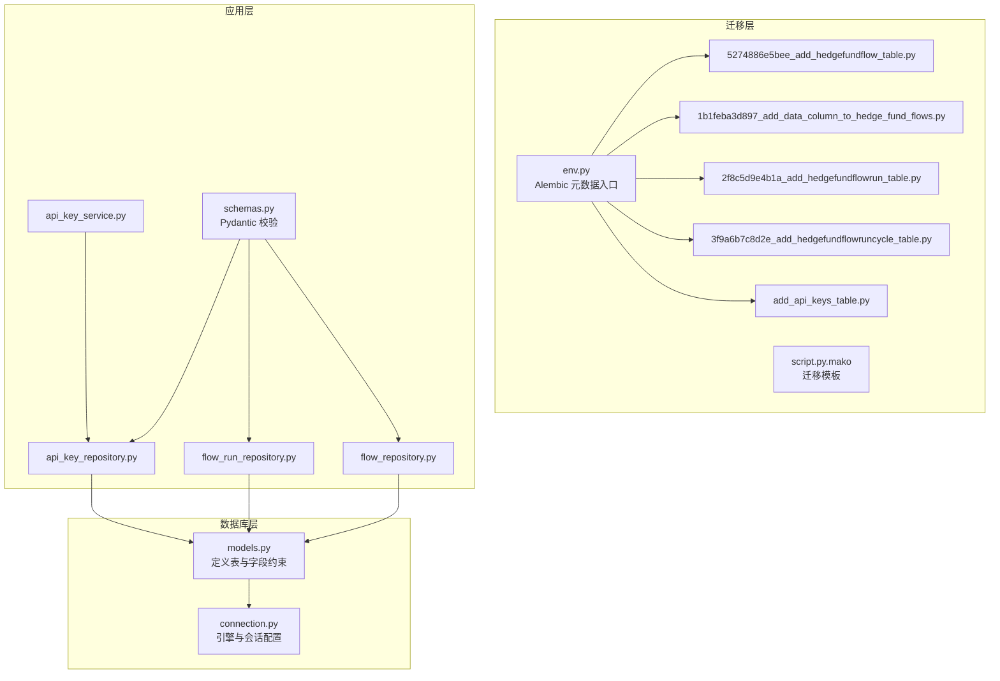
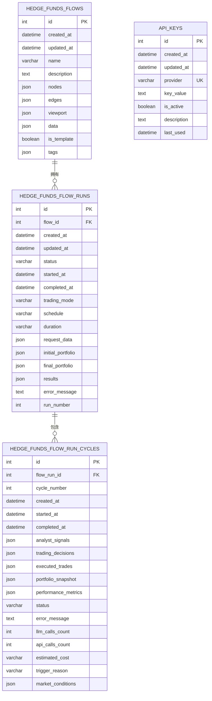
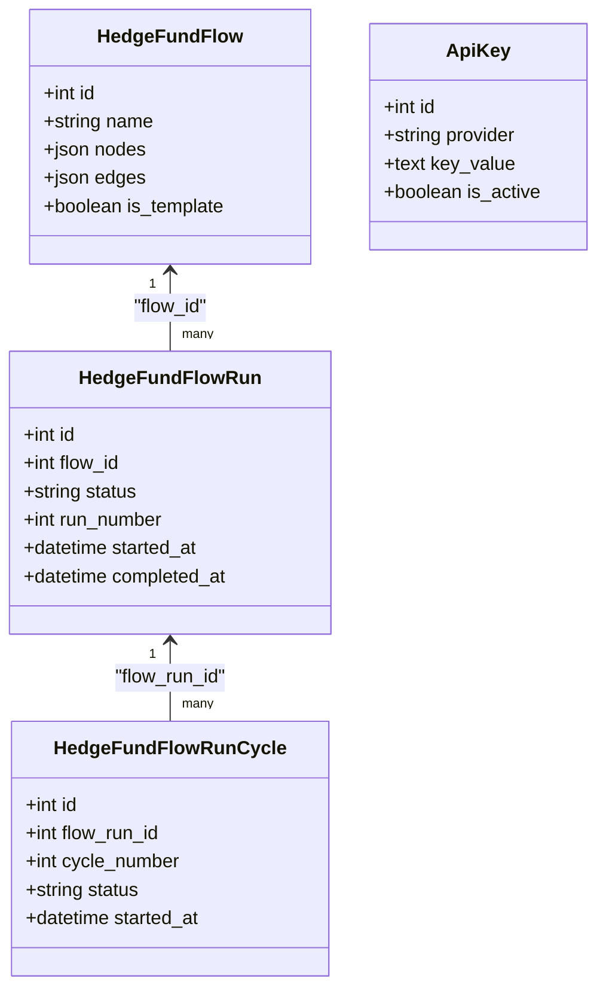
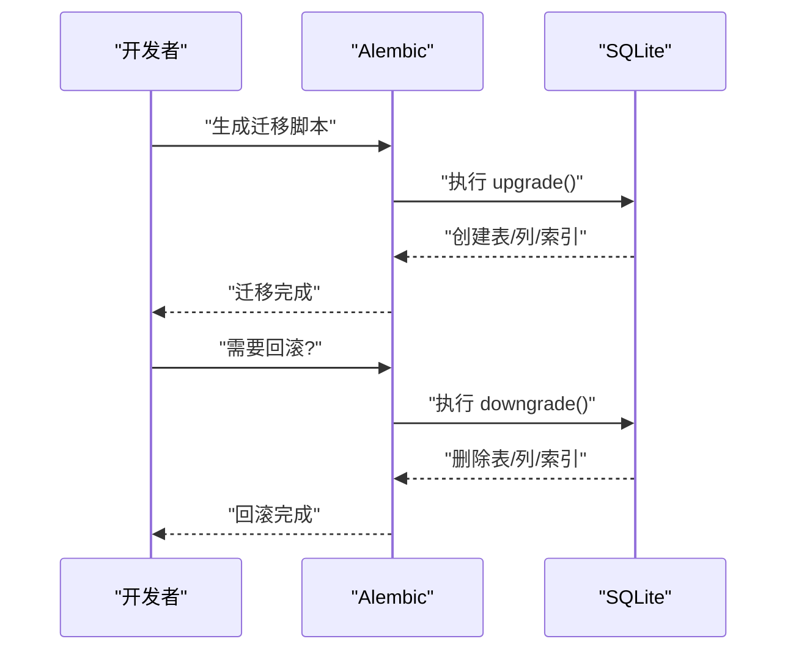
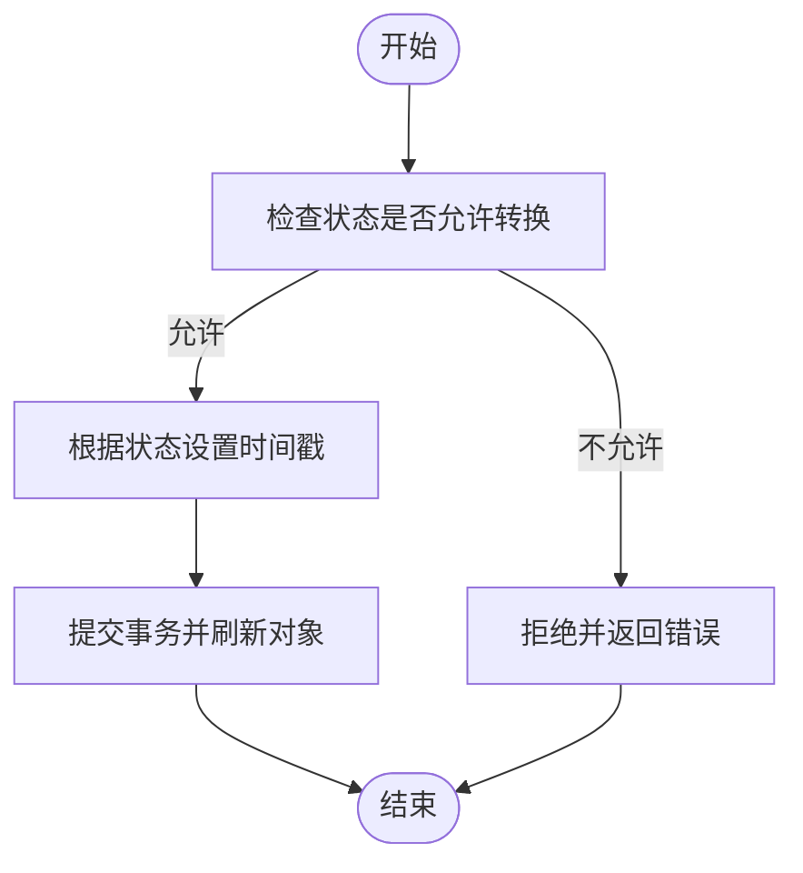
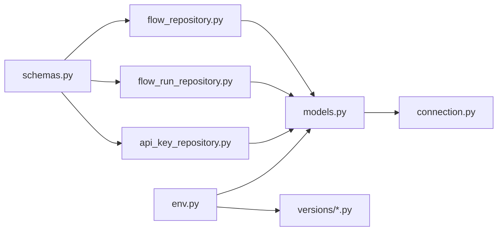

# 数据完整性与约束

<cite>
**本文引用的文件**
- [models.py](file://app/backend/database/models.py)
- [connection.py](file://app/backend/database/connection.py)
- [env.py](file://app/backend/alembic/env.py)
- [script.py.mako](file://app/backend/alembic/script.py.mako)
- [5274886e5bee_add_hedgefundflow_table.py](file://app/backend/alembic/versions/5274886e5bee_add_hedgefundflow_table.py)
- [1b1feba3d897_add_data_column_to_hedge_fund_flows.py](file://app/backend/alembic/versions/1b1feba3d897_add_data_column_to_hedge_fund_flows.py)
- [2f8c5d9e4b1a_add_hedgefundflowrun_table.py](file://app/backend/alembic/versions/2f8c5d9e4b1a_add_hedgefundflowrun_table.py)
- [3f9a6b7c8d2e_add_hedgefundflowruncycle_table.py](file://app/backend/alembic/versions/3f9a6b7c8d2e_add_hedgefundflowruncycle_table.py)
- [add_api_keys_table.py](file://app/backend/alembic/versions/add_api_keys_table.py)
- [schemas.py](file://app/backend/models/schemas.py)
- [flow_repository.py](file://app/backend/repositories/flow_repository.py)
- [flow_run_repository.py](file://app/backend/repositories/flow_run_repository.py)
- [api_key_repository.py](file://app/backend/repositories/api_key_repository.py)
- [api_key_service.py](file://app/backend/services/api_key_service.py)
</cite>

## 目录
1. [简介](#简介)
2. [项目结构](#项目结构)
3. [核心组件](#核心组件)
4. [架构总览](#架构总览)
5. [详细组件分析](#详细组件分析)
6. [依赖分析](#依赖分析)
7. [性能考虑](#性能考虑)
8. [故障排查指南](#故障排查指南)
9. [结论](#结论)
10. [附录](#附录)

## 简介
本文件聚焦于本项目的数据库约束设计与实现，系统性阐述主键、外键、唯一性约束与检查约束在模型与迁移中的落地方式；解释数据验证规则（Pydantic 字段校验）、业务逻辑约束（运行状态机、序号生成）与数据一致性保障机制；总结索引策略、性能影响与优化建议；并给出数据清理、修复与维护的最佳实践，以及备份、恢复与灾难恢复策略。

## 项目结构
后端数据库采用 SQLAlchemy 声明式模型与 Alembic 迁移管理，模型定义位于数据库层，迁移脚本位于 alembic/versions 目录，服务与仓库层负责业务逻辑与数据访问控制。

图表来源
- [models.py:1-115](file://app/backend/database/models.py#L1-L115)
- [connection.py:1-32](file://app/backend/database/connection.py#L1-L32)
- [env.py:1-78](file://app/backend/alembic/env.py#L1-L78)
- [script.py.mako:1-29](file://app/backend/alembic/script.py.mako#L1-L29)
- [5274886e5bee_add_hedgefundflow_table.py:1-47](file://app/backend/alembic/versions/5274886e5bee_add_hedgefundflow_table.py#L1-L47)
- [1b1feba3d897_add_data_column_to_hedge_fund_flows.py:1-33](file://app/backend/alembic/versions/1b1feba3d897_add_data_column_to_hedge_fund_flows.py#L1-L33)
- [2f8c5d9e4b1a_add_hedgefundflowrun_table.py:1-49](file://app/backend/alembic/versions/2f8c5d9e4b1a_add_hedgefundflowrun_table.py#L1-L49)
- [3f9a6b7c8d2e_add_hedgefundflowruncycle_table.py:1-102](file://app/backend/alembic/versions/3f9a6b7c8d2e_add_hedgefundflowruncycle_table.py#L1-L102)
- [add_api_keys_table.py:1-44](file://app/backend/alembic/versions/add_api_keys_table.py#L1-L44)
- [flow_repository.py:1-103](file://app/backend/repositories/flow_repository.py#L1-L103)
- [flow_run_repository.py:1-133](file://app/backend/repositories/flow_run_repository.py#L1-L133)
- [api_key_repository.py:1-131](file://app/backend/repositories/api_key_repository.py#L1-L131)
- [api_key_service.py:1-23](file://app/backend/services/api_key_service.py#L1-L23)
- [schemas.py:1-292](file://app/backend/models/schemas.py#L1-L292)

章节来源
- [models.py:1-115](file://app/backend/database/models.py#L1-L115)
- [connection.py:1-32](file://app/backend/database/connection.py#L1-L32)
- [env.py:1-78](file://app/backend/alembic/env.py#L1-L78)
- [script.py.mako:1-29](file://app/backend/alembic/script.py.mako#L1-L29)

## 核心组件
- 数据模型与约束
  - 主键：所有表的主键均为自增整型 id，并在模型中声明为主键。
  - 外键：运行与周期表通过外键关联到上游实体，确保引用完整性。
  - 唯一性：API Key 的 provider 字段在数据库层设置唯一约束；模型中也体现为唯一索引。
  - 检查约束：通过 Pydantic 字段校验实现业务规则（如交易价格必须为正），并在仓库层进行输入过滤与更新控制。
- 迁移与版本化
  - 使用 Alembic 管理模式演进，每个版本脚本精确描述新增/删除列、表与索引。
- 业务层约束
  - 流运行状态机：IDLE → IN_PROGRESS → COMPLETE/ERROR，状态转换由仓库层控制并自动记录时间戳。
  - 序号生成：按 flow_id 分组取最大 run_number 并递增，避免重复与冲突。
  - API Key 唯一性：按 provider 唯一存储，支持启用/禁用与最后使用时间追踪。

章节来源
- [models.py:6-115](file://app/backend/database/models.py#L6-L115)
- [2f8c5d9e4b1a_add_hedgefundflowrun_table.py:24-39](file://app/backend/alembic/versions/2f8c5d9e4b1a_add_hedgefundflowrun_table.py#L24-L39)
- [3f9a6b7c8d2e_add_hedgefundflowruncycle_table.py:41-67](file://app/backend/alembic/versions/3f9a6b7c8d2e_add_hedgefundflowruncycle_table.py#L41-L67)
- [add_api_keys_table.py:24-37](file://app/backend/alembic/versions/add_api_keys_table.py#L24-L37)
- [schemas.py:27-32](file://app/backend/models/schemas.py#L27-L32)
- [flow_run_repository.py:126-133](file://app/backend/repositories/flow_run_repository.py#L126-L133)
- [api_key_repository.py:23-46](file://app/backend/repositories/api_key_repository.py#L23-L46)

## 架构总览
下图展示数据库约束在模型、迁移与应用层的协同工作方式。

图表来源
- [models.py:6-115](file://app/backend/database/models.py#L6-L115)
- [5274886e5bee_add_hedgefundflow_table.py:24-36](file://app/backend/alembic/versions/5274886e5bee_add_hedgefundflow_table.py#L24-L36)
- [2f8c5d9e4b1a_add_hedgefundflowrun_table.py:24-39](file://app/backend/alembic/versions/2f8c5d9e4b1a_add_hedgefundflowrun_table.py#L24-L39)
- [3f9a6b7c8d2e_add_hedgefundflowruncycle_table.py:41-67](file://app/backend/alembic/versions/3f9a6b7c8d2e_add_hedgefundflowruncycle_table.py#L41-L67)
- [add_api_keys_table.py:24-35](file://app/backend/alembic/versions/add_api_keys_table.py#L24-L35)

## 详细组件分析

### 数据模型与约束（主键、外键、唯一性、检查）
- 主键
  - 所有表的主键均在模型中显式声明为自增整数类型，并在迁移脚本中创建表时指定主键约束。
- 外键
  - 运行表通过 flow_id 引用流表；周期表通过 flow_run_id 引用运行表，形成层级引用链。
- 唯一性
  - API Key 的 provider 在数据库层设置唯一约束，并在模型中建立唯一索引，防止重复注册同一提供商密钥。
- 检查约束
  - 通过 Pydantic 字段校验实现业务规则（如交易价格必须为正），在请求进入仓库层前进行拦截与拒绝，避免非法数据写入。

图表来源
- [models.py:6-115](file://app/backend/database/models.py#L6-L115)
- [2f8c5d9e4b1a_add_hedgefundflowrun_table.py:24-39](file://app/backend/alembic/versions/2f8c5d9e4b1a_add_hedgefundflowrun_table.py#L24-L39)
- [3f9a6b7c8d2e_add_hedgefundflowruncycle_table.py:41-67](file://app/backend/alembic/versions/3f9a6b7c8d2e_add_hedgefundflowruncycle_table.py#L41-L67)
- [add_api_keys_table.py:24-35](file://app/backend/alembic/versions/add_api_keys_table.py#L24-L35)

章节来源
- [models.py:6-115](file://app/backend/database/models.py#L6-L115)
- [schemas.py:27-32](file://app/backend/models/schemas.py#L27-L32)
- [add_api_keys_table.py:24-37](file://app/backend/alembic/versions/add_api_keys_table.py#L24-L37)

### 迁移与版本化（约束的演进）
- 表与列的新增/删除通过独立版本脚本精确控制，确保每次变更可追溯、可回滚。
- 新增列时，脚本明确设置默认值与可空性；删除列时保留回滚路径。
- 索引创建集中在迁移脚本中，覆盖常用查询字段（如 flow_id、status、started_at）。

图表来源
- [script.py.mako:21-28](file://app/backend/alembic/script.py.mako#L21-L28)
- [5274886e5bee_add_hedgefundflow_table.py:21-38](file://app/backend/alembic/versions/5274886e5bee_add_hedgefundflow_table.py#L21-L38)
- [2f8c5d9e4b1a_add_hedgefundflowrun_table.py:21-40](file://app/backend/alembic/versions/2f8c5d9e4b1a_add_hedgefundflowrun_table.py#L21-L40)
- [3f9a6b7c8d2e_add_hedgefundflowruncycle_table.py:18-68](file://app/backend/alembic/versions/3f9a6b7c8d2e_add_hedgefundflowruncycle_table.py#L18-L68)
- [add_api_keys_table.py:21-37](file://app/backend/alembic/versions/add_api_keys_table.py#L21-L37)

章节来源
- [env.py:17-25](file://app/backend/alembic/env.py#L17-L25)
- [script.py.mako:21-28](file://app/backend/alembic/script.py.mako#L21-L28)
- [5274886e5bee_add_hedgefundflow_table.py:21-38](file://app/backend/alembic/versions/5274886e5bee_add_hedgefundflow_table.py#L21-L38)
- [2f8c5d9e4b1a_add_hedgefundflowrun_table.py:21-40](file://app/backend/alembic/versions/2f8c5d9e4b1a_add_hedgefundflowrun_table.py#L21-L40)
- [3f9a6b7c8d2e_add_hedgefundflowruncycle_table.py:18-68](file://app/backend/alembic/versions/3f9a6b7c8d2e_add_hedgefundflowruncycle_table.py#L18-L68)
- [add_api_keys_table.py:21-37](file://app/backend/alembic/versions/add_api_keys_table.py#L21-L37)

### 业务逻辑约束与一致性（状态机、序号、唯一性）
- 流运行状态机
  - 状态枚举与转换由仓库层控制，首次进入 IN_PROGRESS 时写入 started_at，结束时写入 completed_at。
- 序号生成
  - 按 flow_id 分组取最大 run_number 并加一，保证同一流内的运行序号严格递增且不冲突。
- 唯一性与可用性
  - API Key 按 provider 唯一存储，支持启用/禁用；读取时仅返回激活项。

图表来源
- [flow_run_repository.py:66-96](file://app/backend/repositories/flow_run_repository.py#L66-L96)
- [schemas.py:9-14](file://app/backend/models/schemas.py#L9-L14)

章节来源
- [flow_run_repository.py:66-96](file://app/backend/repositories/flow_run_repository.py#L66-L96)
- [flow_run_repository.py:126-133](file://app/backend/repositories/flow_run_repository.py#L126-L133)
- [api_key_repository.py:48-60](file://app/backend/repositories/api_key_repository.py#L48-L60)
- [api_key_service.py:12-23](file://app/backend/services/api_key_service.py#L12-L23)

### 数据验证规则与输入过滤
- Pydantic 字段校验
  - 对交易价格等数值字段进行正数校验，违反规则直接抛出异常，阻止非法数据进入数据库。
- 请求/响应模型
  - 统一的请求与响应模型定义了必填字段、长度限制与默认值，减少脏数据进入系统。

章节来源
- [schemas.py:27-32](file://app/backend/models/schemas.py#L27-L32)
- [schemas.py:144-164](file://app/backend/models/schemas.py#L144-L164)
- [schemas.py:244-257](file://app/backend/models/schemas.py#L244-L257)

### 索引策略、性能影响与优化建议
- 已创建的索引
  - 流表与运行表的 id 均创建了索引；运行表的 flow_id、周期表的 flow_run_id、cycle_number、status、started_at 等字段建立了索引，提升查询与排序效率。
- 性能影响
  - 索引提升查询性能，但写入时需维护索引，带来额外开销；应结合实际查询模式权衡。
- 优化建议
  - 针对高频过滤条件（如 status、flow_id、started_at）建立复合索引；定期统计查询计划，识别慢查询并调整索引。
  - 对大字段（JSON）的过滤尽量避免在 WHERE 子句中使用，必要时考虑物化列或二级索引。

章节来源
- [2f8c5d9e4b1a_add_hedgefundflowrun_table.py:38-39](file://app/backend/alembic/versions/2f8c5d9e4b1a_add_hedgefundflowrun_table.py#L38-L39)
- [3f9a6b7c8d2e_add_hedgefundflowruncycle_table.py:63-67](file://app/backend/alembic/versions/3f9a6b7c8d2e_add_hedgefundflowruncycle_table.py#L63-L67)
- [add_api_keys_table.py:36-37](file://app/backend/alembic/versions/add_api_keys_table.py#L36-L37)

### 数据清理、修复与维护最佳实践
- 清理策略
  - 定期清理过期运行记录与失败周期，保留关键结果与错误信息以便审计。
- 修复策略
  - 对缺失时间戳的状态转换进行补记；对重复的 provider 进行去重与合并。
- 维护策略
  - 使用 Alembic 版本化管理，先在测试环境验证再上线；对大表操作（如重建索引）安排在低峰时段。

章节来源
- [flow_run_repository.py:98-116](file://app/backend/repositories/flow_run_repository.py#L98-L116)
- [api_key_repository.py:86-105](file://app/backend/repositories/api_key_repository.py#L86-L105)

## 依赖分析
- 组件耦合
  - 仓库层依赖 SQLAlchemy 会话与模型；服务层依赖仓库层；模型与迁移脚本相互独立，通过 Alembic 元数据统一管理。
- 外部依赖
  - SQLAlchemy 与 Alembic；SQLite 文件存储（绝对路径）。

图表来源
- [schemas.py:1-292](file://app/backend/models/schemas.py#L1-L292)
- [flow_repository.py:1-103](file://app/backend/repositories/flow_repository.py#L1-L103)
- [flow_run_repository.py:1-133](file://app/backend/repositories/flow_run_repository.py#L1-L133)
- [api_key_repository.py:1-131](file://app/backend/repositories/api_key_repository.py#L1-L131)
- [models.py:1-115](file://app/backend/database/models.py#L1-L115)
- [connection.py:1-32](file://app/backend/database/connection.py#L1-L32)
- [env.py:17-25](file://app/backend/alembic/env.py#L17-L25)

章节来源
- [schemas.py:1-292](file://app/backend/models/schemas.py#L1-L292)
- [flow_repository.py:1-103](file://app/backend/repositories/flow_repository.py#L1-L103)
- [flow_run_repository.py:1-133](file://app/backend/repositories/flow_run_repository.py#L1-L133)
- [api_key_repository.py:1-131](file://app/backend/repositories/api_key_repository.py#L1-L131)
- [models.py:1-115](file://app/backend/database/models.py#L1-L115)
- [connection.py:1-32](file://app/backend/database/connection.py#L1-L32)
- [env.py:17-25](file://app/backend/alembic/env.py#L17-L25)

## 性能考虑
- 查询热点
  - 按 flow_id 聚合查询、按状态过滤、按时间范围排序是高频场景，现有索引已覆盖主要字段。
- 写入压力
  - 运行与周期频繁写入，注意批量提交与事务粒度控制，避免长事务锁表。
- 存储与归档
  - 将历史数据归档至离线存储，保留近期活跃数据在在线库中，降低在线表规模。

## 故障排查指南
- 唯一性冲突
  - 当 provider 重复时，数据库唯一约束会报错；应先查询是否存在再进行创建或更新。
- 外键约束失败
  - 插入运行或周期记录时，若 flow_id 或 flow_run_id 不存在，会触发外键约束错误；请先确认上游实体存在。
- 状态转换异常
  - 若状态转换不符合预期（如未设置时间戳），检查仓库层状态更新逻辑与事务提交顺序。
- 数据校验失败
  - Pydantic 抛出校验错误时，检查请求模型字段是否满足最小/最大长度、默认值与类型要求。

章节来源
- [add_api_keys_table.py:34-35](file://app/backend/alembic/versions/add_api_keys_table.py#L34-L35)
- [2f8c5d9e4b1a_add_hedgefundflowrun_table.py:26-27](file://app/backend/alembic/versions/2f8c5d9e4b1a_add_hedgefundflowrun_table.py#L26-L27)
- [3f9a6b7c8d2e_add_hedgefundflowruncycle_table.py:44-44](file://app/backend/alembic/versions/3f9a6b7c8d2e_add_hedgefundflowruncycle_table.py#L44-L44)
- [schemas.py:27-32](file://app/backend/models/schemas.py#L27-L32)
- [flow_run_repository.py:78-86](file://app/backend/repositories/flow_run_repository.py#L78-L86)

## 结论
本项目通过 SQLAlchemy 模型与 Alembic 迁移实现了清晰的主键、外键与唯一性约束；借助 Pydantic 字段校验强化了输入层面的数据质量；仓库层的状态机与序号生成机制保障了业务一致性。配合合理的索引策略与版本化迁移，系统在可维护性与数据完整性方面具备良好基础。建议持续关注查询性能与索引成本，在生产环境中完善备份与回滚流程。

## 附录
- 备份与恢复
  - 定期导出 SQLite 文件；在升级前创建快照；回滚时使用 Alembic downgrade。
- 灾难恢复
  - 准备最小可用数据库（仅核心表与索引）；快速恢复 API Key 与最近运行记录；逐步补齐历史数据。