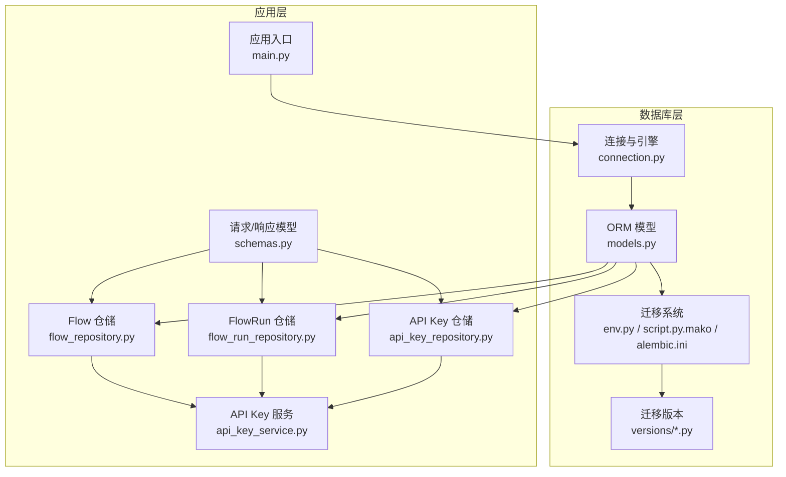
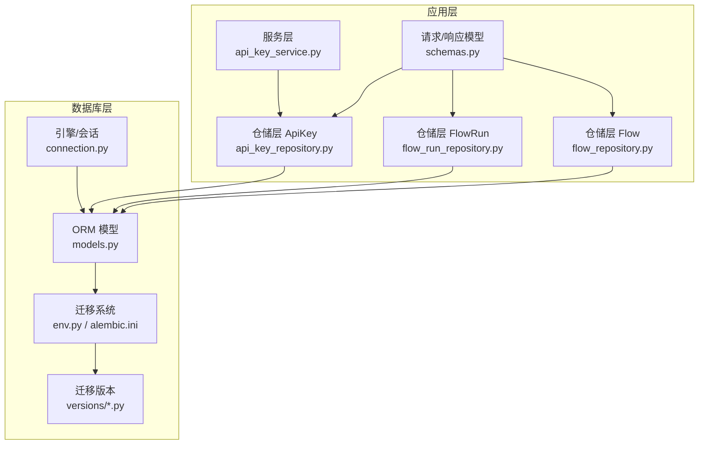
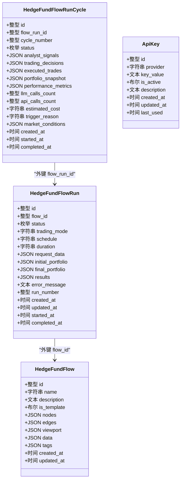
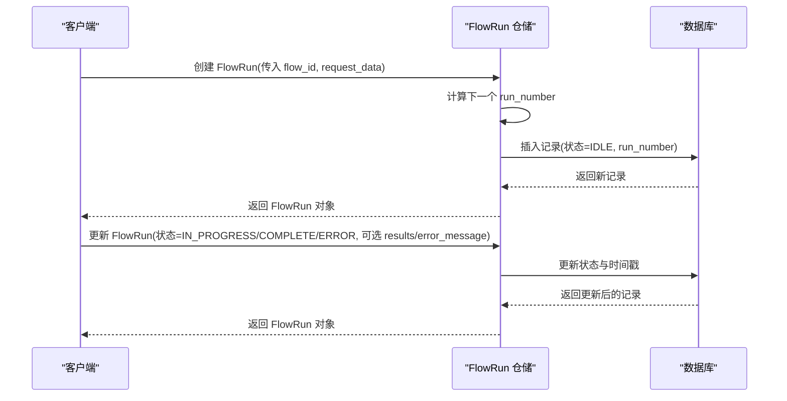
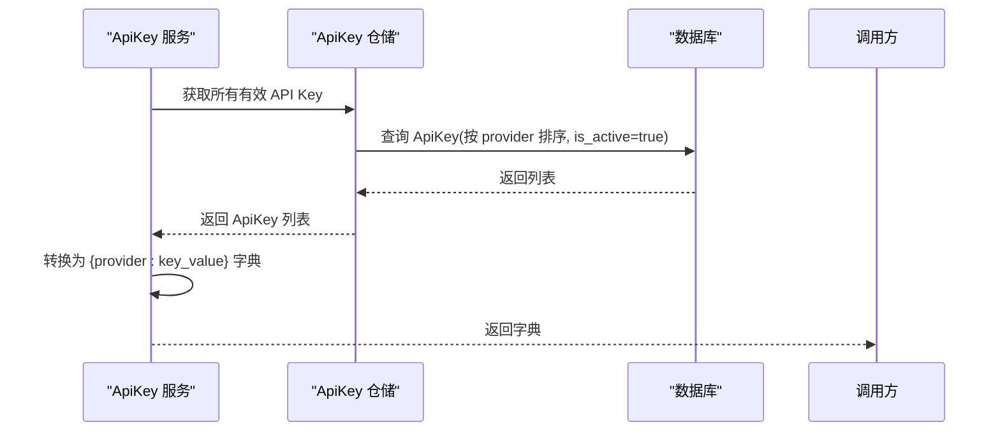
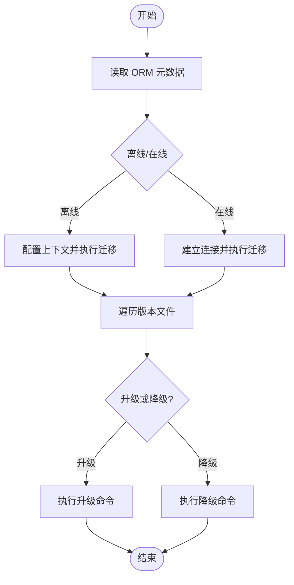
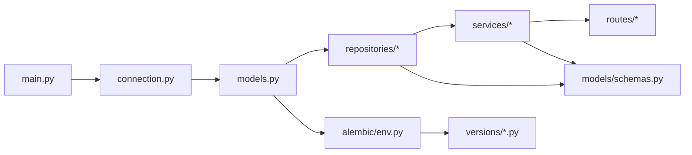

# 数据库模型

<cite>
**本文引用的文件**
- [models.py](file://app/backend/database/models.py)
- [connection.py](file://app/backend/database/connection.py)
- [env.py](file://app/backend/alembic/env.py)
- [script.py.mako](file://app/backend/alembic/script.py.mako)
- [alembic.ini](file://app/backend/alembic.ini)
- [5274886e5bee_add_hedgefundflow_table.py](file://app/backend/alembic/versions/5274886e5bee_add_hedgefundflow_table.py)
- [1b1feba3d897_add_data_column_to_hedge_fund_flows.py](file://app/backend/alembic/versions/1b1feba3d897_add_data_column_to_hedge_fund_flows.py)
- [2f8c5d9e4b1a_add_hedgefundflowrun_table.py](file://app/backend/alembic/versions/2f8c5d9e4b1a_add_hedgefundflowrun_table.py)
- [3f9a6b7c8d2e_add_hedgefundflowruncycle_table.py](file://app/backend/alembic/versions/3f9a6b7c8d2e_add_hedgefundflowruncycle_table.py)
- [add_api_keys_table.py](file://app/backend/alembic/versions/add_api_keys_table.py)
- [flow_repository.py](file://app/backend/repositories/flow_repository.py)
- [flow_run_repository.py](file://app/backend/repositories/flow_run_repository.py)
- [api_key_repository.py](file://app/backend/repositories/api_key_repository.py)
- [schemas.py](file://app/backend/models/schemas.py)
- [api_key_service.py](file://app/backend/services/api_key_service.py)
- [main.py](file://app/backend/main.py)
</cite>

## 目录
1. [简介](#简介)
2. [项目结构](#项目结构)
3. [核心组件](#核心组件)
4. [架构总览](#架构总览)
5. [详细组件分析](#详细组件分析)
6. [依赖分析](#依赖分析)
7. [性能考虑](#性能考虑)
8. [故障排除指南](#故障排除指南)
9. [结论](#结论)
10. [附录](#附录)

## 简介
本文件系统性梳理后端数据库模型与迁移体系，覆盖 SQLAlchemy ORM 模型设计、字段定义与关系映射；重点解析 HedgeFundFlow、ApiKeys、FlowRun（含 FlowRunCycle）等核心实体的结构与约束；阐述数据库迁移系统、版本管理与数据演进策略；总结索引优化、查询性能与事务管理实践；提供模型扩展指南、新增表流程与数据完整性保障方法；并给出连接池配置、并发处理与备份恢复建议，以及数据库调试、性能监控与故障排除指导。

## 项目结构
数据库相关代码主要分布在以下模块：
- 数据库引擎与会话：app/backend/database/connection.py
- ORM 模型定义：app/backend/database/models.py
- 迁移环境与脚手架：app/backend/alembic/env.py、app/backend/alembic/script.py.mako、app/backend/alembic.ini
- 迁移版本文件：app/backend/alembic/versions/*.py
- 仓储层（Repository）：app/backend/repositories/*
- 服务层（Service）：app/backend/services/*
- 应用入口与初始化：app/backend/main.py

图表来源
- [connection.py:1-32](file://app/backend/database/connection.py#L1-L32)
- [models.py:1-115](file://app/backend/database/models.py#L1-L115)
- [env.py:1-78](file://app/backend/alembic/env.py#L1-L78)
- [script.py.mako:1-29](file://app/backend/alembic/script.py.mako#L1-L29)
- [alembic.ini:1-120](file://app/backend/alembic/ini#L1-L120)
- [flow_repository.py:1-103](file://app/backend/repositories/flow_repository.py#L1-L103)
- [flow_run_repository.py:1-133](file://app/backend/repositories/flow_run_repository.py#L1-L133)
- [api_key_repository.py:1-131](file://app/backend/repositories/api_key_repository.py#L1-L131)
- [api_key_service.py:1-23](file://app/backend/services/api_key_service.py#L1-L23)
- [schemas.py:1-292](file://app/backend/models/schemas.py#L1-L292)
- [main.py:1-56](file://app/backend/main.py#L1-L56)

章节来源
- [connection.py:1-32](file://app/backend/database/connection.py#L1-L32)
- [models.py:1-115](file://app/backend/database/models.py#L1-L115)
- [env.py:1-78](file://app/backend/alembic/env.py#L1-L78)
- [script.py.mako:1-29](file://app/backend/alembic/script.py.mako#L1-L29)
- [alembic.ini:1-120](file://app/backend/alembic/ini#L1-L120)
- [main.py:1-56](file://app/backend/main.py#L1-L56)

## 核心组件
本节聚焦 SQLAlchemy ORM 模型的设计要点、字段语义与关系映射，并结合仓储层操作说明其使用方式。

- HedgeFundFlow（交易流配置）
  - 表名：hedge_fund_flows
  - 主键：id（整数，自增，带索引）
  - 时间戳：created_at、updated_at（自动维护）
  - 元数据：name（字符串，非空）、description（文本，可空）、is_template（布尔，默认否）、tags（JSON 数组，可空）
  - React Flow 状态：nodes、edges、viewport（均为 JSON），data（JSON，可空）
  - 约束：name 非空；is_template 默认 false；data 列在后续迁移中加入
  - 索引：主键索引（由 SQLAlchemy 自动创建）

- HedgeFundFlowRun（单次执行记录）
  - 表名：hedge_fund_flow_runs
  - 主键：id（整数，自增，带索引）
  - 外键：flow_id → hedge_fund_flows.id（非空，带索引）
  - 时间戳：created_at、updated_at、started_at、completed_at（可空）
  - 执行状态：status（字符串，默认 IDLE；枚举值见 FlowRunStatus）
  - 运行配置：trading_mode（默认一次性）、schedule、duration（连续运行参数）
  - 数据存储：request_data、initial_portfolio、final_portfolio、results（JSON，可空）
  - 错误信息：error_message（文本，可空）
  - 元数据：run_number（整数，默认 1，按 flow_id 分组递增）
  - 约束：status 默认值；run_number 默认值；flow_id 非空
  - 索引：主键索引、flow_id 索引

- HedgeFundFlowRunCycle（单次执行内的分析周期）
  - 表名：hedge_fund_flow_run_cycles
  - 主键：id（整数，自增，带索引）
  - 外键：flow_run_id → hedge_fund_flow_runs.id（非空，带索引）
  - 周期编号：cycle_number（整数，非空）
  - 时间戳：created_at、started_at、completed_at（可空）
  - 结果与指标：analyst_signals、trading_decisions、executed_trades、portfolio_snapshot、performance_metrics（JSON，可空）
  - 执行状态：status（字符串，默认 IN_PROGRESS；枚举值见 FlowRunStatus）
  - 成本跟踪：llm_calls_count、api_calls_count（整数，默认 0）、estimated_cost（字符串，可空）
  - 触发条件与市场快照：trigger_reason（字符串，可空）、market_conditions（JSON，可空）
  - 约束：status 默认值；flow_run_id 非空；cycle_number 非空
  - 索引：flow_run_id、cycle_number、status、started_at

- ApiKey（第三方服务密钥）
  - 表名：api_keys
  - 主键：id（整数，自增，带索引）
  - 时间戳：created_at、updated_at、last_used（可空）
  - 密钥详情：provider（字符串，非空，唯一，带索引）、key_value（文本，非空）、is_active（布尔，默认 true）
  - 元数据：description（文本，可空）
  - 约束：provider 唯一；is_active 默认 true
  - 索引：主键索引、provider 索引

章节来源
- [models.py:6-115](file://app/backend/database/models.py#L6-L115)
- [flow_repository.py:12-28](file://app/backend/repositories/flow_repository.py#L12-L28)
- [flow_run_repository.py:15-29](file://app/backend/repositories/flow_run_repository.py#L15-L29)
- [api_key_repository.py:15-46](file://app/backend/repositories/api_key_repository.py#L15-L46)

## 架构总览
下图展示数据库模型、迁移系统与应用层之间的交互关系，包括仓储层对模型的 CRUD 操作、服务层对密钥的加载与注入，以及应用启动时的表初始化。

图表来源
- [api_key_service.py:1-23](file://app/backend/services/api_key_service.py#L1-L23)
- [flow_repository.py:1-103](file://app/backend/repositories/flow_repository.py#L1-L103)
- [flow_run_repository.py:1-133](file://app/backend/repositories/flow_run_repository.py#L1-L133)
- [api_key_repository.py:1-131](file://app/backend/repositories/api_key_repository.py#L1-L131)
- [schemas.py:1-292](file://app/backend/models/schemas.py#L1-L292)
- [models.py:1-115](file://app/backend/database/models.py#L1-L115)
- [connection.py:1-32](file://app/backend/database/connection.py#L1-L32)
- [env.py:1-78](file://app/backend/alembic/env.py#L1-L78)
- [alembic.ini:1-120](file://app/backend/alembic/ini#L1-L120)

## 详细组件分析

### 类关系与继承

图表来源
- [models.py:6-115](file://app/backend/database/models.py#L6-L115)

章节来源
- [models.py:6-115](file://app/backend/database/models.py#L6-L115)

### API 工作流（创建与更新 FlowRun）

图表来源
- [flow_run_repository.py:15-96](file://app/backend/repositories/flow_run_repository.py#L15-L96)
- [schemas.py:9-14](file://app/backend/models/schemas.py#L9-L14)

章节来源
- [flow_run_repository.py:15-96](file://app/backend/repositories/flow_run_repository.py#L15-L96)
- [schemas.py:9-14](file://app/backend/models/schemas.py#L9-L14)

### API 密钥加载流程

图表来源
- [api_key_service.py:12-23](file://app/backend/services/api_key_service.py#L12-L23)
- [api_key_repository.py:55-60](file://app/backend/repositories/api_key_repository.py#L55-L60)

章节来源
- [api_key_service.py:12-23](file://app/backend/services/api_key_service.py#L12-L23)
- [api_key_repository.py:55-60](file://app/backend/repositories/api_key_repository.py#L55-L60)

### 数据库迁移与演进
- 迁移系统
  - 使用 Alembic 管理数据库版本，目标元数据来自 ORM 模型。
  - 支持离线与在线两种迁移模式，通过 env.py 配置。
  - 版本脚手架由 script.py.mako 提供，生成标准升级/降级模板。
  - alembic.ini 定义脚本位置、日志级别与 SQLAlchemy URL。

- 迁移版本概览
  - 5274886e5bee：创建 HedgeFundFlow 表，包含基础字段与索引。
  - 1b1feba3d897：向 HedgeFundFlow 添加 data 列。
  - 2f8c5d9e4b1a：创建 HedgeFundFlowRun 表，增加索引。
  - 3f9a6b7c8d2e：向 HedgeFundFlowRun 增加运行配置列；创建 HedgeFundFlowRunCycle 表并建立索引；兼容性降级。
  - add_api_keys_table：创建 ApiKey 表，包含唯一 provider 索引。

图表来源
- [env.py:28-77](file://app/backend/alembic/env.py#L28-L77)
- [script.py.mako:21-28](file://app/backend/alembic/script.py.mako#L21-L28)
- [alembic.ini:66](file://app/backend/alembic/ini#L66)

章节来源
- [env.py:1-78](file://app/backend/alembic/env.py#L1-L78)
- [script.py.mako:1-29](file://app/backend/alembic/script.py.mako#L1-L29)
- [alembic.ini:1-120](file://app/backend/alembic/ini#L1-L120)
- [5274886e5bee_add_hedgefundflow_table.py:1-47](file://app/backend/alembic/versions/5274886e5bee_add_hedgefundflow_table.py#L1-L47)
- [1b1feba3d897_add_data_column_to_hedge_fund_flows.py:1-33](file://app/backend/alembic/versions/1b1feba3d897_add_data_column_to_hedge_fund_flows.py#L1-L33)
- [2f8c5d9e4b1a_add_hedgefundflowrun_table.py:1-49](file://app/backend/alembic/versions/2f8c5d9e4b1a_add_hedgefundflowrun_table.py#L1-L49)
- [3f9a6b7c8d2e_add_hedgefundflowruncycle_table.py:1-102](file://app/backend/alembic/versions/3f9a6b7c8d2e_add_hedgefundflowruncycle_table.py#L1-L102)
- [add_api_keys_table.py:1-44](file://app/backend/alembic/versions/add_api_keys_table.py#L1-L44)

## 依赖分析
- 组件耦合
  - 仓储层直接依赖 SQLAlchemy 会话与模型类，职责清晰。
  - 服务层仅依赖仓储接口，便于替换实现与单元测试。
  - 模型之间通过外键建立层次关系，避免循环依赖。
- 外部依赖
  - SQLAlchemy 作为 ORM 与迁移工具。
  - Alembic 用于版本化迁移。
  - FastAPI 应用在启动时初始化数据库表。

图表来源
- [models.py:1-115](file://app/backend/database/models.py#L1-L115)
- [flow_repository.py:1-103](file://app/backend/repositories/flow_repository.py#L1-L103)
- [flow_run_repository.py:1-133](file://app/backend/repositories/flow_run_repository.py#L1-L133)
- [api_key_repository.py:1-131](file://app/backend/repositories/api_key_repository.py#L1-L131)
- [api_key_service.py:1-23](file://app/backend/services/api_key_service.py#L1-L23)
- [schemas.py:1-292](file://app/backend/models/schemas.py#L1-L292)
- [env.py:19-20](file://app/backend/alembic/env.py#L19-L20)
- [connection.py:14-24](file://app/backend/database/connection.py#L14-L24)
- [main.py:17-18](file://app/backend/main.py#L17-L18)

章节来源
- [models.py:1-115](file://app/backend/database/models.py#L1-L115)
- [flow_repository.py:1-103](file://app/backend/repositories/flow_repository.py#L1-L103)
- [flow_run_repository.py:1-133](file://app/backend/repositories/flow_run_repository.py#L1-L133)
- [api_key_repository.py:1-131](file://app/backend/repositories/api_key_repository.py#L1-L131)
- [api_key_service.py:1-23](file://app/backend/services/api_key_service.py#L1-L23)
- [schemas.py:1-292](file://app/backend/models/schemas.py#L1-L292)
- [env.py:19-20](file://app/backend/alembic/env.py#L19-L20)
- [connection.py:14-24](file://app/backend/database/connection.py#L14-L24)
- [main.py:17-18](file://app/backend/main.py#L17-L18)

## 性能考虑
- 索引策略
  - 主键索引：所有模型的主键均自动创建索引，确保唯一性与快速查找。
  - 外键索引：FlowRun 的 flow_id、FlowRunCycle 的 flow_run_id、ApiKey 的 provider 均显式创建索引，提升关联查询与过滤效率。
  - 辅助索引：FlowRunCycle 的 status、started_at 等字段具备索引，有利于按状态与时间范围检索。
- 查询优化
  - 使用分页与限制数量（仓储层已支持 limit/offset）。
  - 尽量使用等值过滤与范围过滤，避免在大字段（JSON）上进行复杂计算。
  - 对频繁排序的字段（如 created_at、updated_at）保持索引。
- 事务与并发
  - 使用 SQLAlchemy 会话进行事务控制，提交前批量写入，减少往返次数。
  - SQLite 在多线程场景下需谨慎，生产环境建议使用更健壮的数据库。
- 连接池与并发
  - 当前使用 SQLAlchemy 默认会话工厂，未显式配置连接池参数。
  - 建议在生产环境中启用连接池（如设置 pool_size、max_overflow、pool_recycle），以提升并发吞吐与资源复用。
- 日志与监控
  - Alembic/SQLAlchemy 日志已在 alembic.ini 中配置，便于定位慢查询与异常。
  - 建议在应用层增加数据库操作耗时埋点与错误统计。

[本节为通用性能建议，不直接分析具体文件]

## 故障排除指南
- 启动时表未创建
  - 现象：首次启动后查询报错。
  - 处理：确认应用入口是否调用初始化表逻辑，检查数据库路径与权限。
  - 参考：应用入口初始化表与数据库连接配置。
- 迁移失败或版本不一致
  - 现象：执行迁移时报错或提示版本缺失。
  - 处理：核对 alembic.ini 中的 URL 与版本目录；确保 env.py 正确导入模型元数据；按顺序执行升级/降级。
  - 参考：迁移环境与脚手架配置。
- 外键约束错误
  - 现象：插入 FlowRun 或 FlowRunCycle 时提示外键不存在。
  - 处理：先创建父记录（Flow 或 FlowRun），再插入子记录；检查外键列类型与非空约束。
  - 参考：模型字段定义与外键关系。
- JSON 字段解析问题
  - 现象：读取 JSON 字段为空或格式异常。
  - 处理：确保写入时为合法 JSON；读取后进行空值判断与默认值处理。
  - 参考：模型字段类型与仓储层写入逻辑。
- API Key 重复或不可用
  - 现象：provider 冲突或返回空值。
  - 处理：确认 provider 唯一性；检查 is_active 状态；必要时更新 last_used。
  - 参考：ApiKey 仓储与服务层。

章节来源
- [main.py:17-18](file://app/backend/main.py#L17-L18)
- [env.py:19-20](file://app/backend/alembic/env.py#L19-L20)
- [models.py:34](file://app/backend/database/models.py#L34)
- [models.py:64](file://app/backend/database/models.py#L64)
- [api_key_repository.py:48-53](file://app/backend/repositories/api_key_repository.py#L48-L53)
- [api_key_service.py:12-23](file://app/backend/services/api_key_service.py#L12-L23)

## 结论
该数据库模型围绕“交易流配置—执行记录—周期分析—密钥管理”的主线构建，采用清晰的外键关系与合理的索引策略，配合 Alembic 的版本化迁移，实现了从初始表到扩展字段与新表的平滑演进。仓储层封装了常用 CRUD 与聚合查询，服务层负责密钥加载与注入，整体结构利于扩展与维护。建议在生产环境中引入连接池、完善监控与日志，并持续通过迁移管理数据演进。

[本节为总结性内容，不直接分析具体文件]

## 附录

### 数据库迁移最佳实践
- 新增表
  - 在 models.py 中定义模型与字段，确保主键与必要索引。
  - 使用 Alembic 生成迁移脚本，明确升级/降级命令。
  - 在版本脚本中显式创建索引，避免遗漏。
- 字段变更
  - 使用条件判断避免重复添加列；降级时注意删除顺序与异常处理。
  - 对于 JSON 字段，提供默认值与空值处理策略。
- 兼容性
  - 升级前备份数据库；在测试环境验证迁移后再上线。
  - 对外键与唯一约束变更，先清理冲突数据再执行。

章节来源
- [models.py:1-115](file://app/backend/database/models.py#L1-L115)
- [env.py:28-77](file://app/backend/alembic/env.py#L28-L77)
- [script.py.mako:21-28](file://app/backend/alembic/script.py.mako#L21-L28)
- [3f9a6b7c8d2e_add_hedgefundflowruncycle_table.py:18-68](file://app/backend/alembic/versions/3f9a6b7c8d2e_add_hedgefundflowruncycle_table.py#L18-L68)

### 数据完整性与一致性
- 约束与默认值：模型中已设置非空、默认值与唯一性（如 ApiKey.provider），迁移脚本中亦显式声明。
- 外键关系：FlowRun→Flow、FlowRunCycle→FlowRun，确保删除级联与引用一致性。
- 事务边界：仓储层在单次操作内完成写入与刷新，避免部分提交。

章节来源
- [models.py:34](file://app/backend/database/models.py#L34)
- [models.py:64](file://app/backend/database/models.py#L64)
- [models.py:106](file://app/backend/database/models.py#L106)
- [flow_run_repository.py:26-28](file://app/backend/repositories/flow_run_repository.py#L26-L28)
- [api_key_repository.py:43-46](file://app/backend/repositories/api_key_repository.py#L43-L46)

### 并发与连接池配置建议
- 当前连接配置未显式设置连接池参数，建议在生产环境补充：
  - pool_size：连接池大小
  - max_overflow：溢出连接数
  - pool_recycle：连接回收时间（秒）
  - pool_pre_ping：连接前校验
- 配置位置参考：连接引擎创建处。

章节来源
- [connection.py:15-21](file://app/backend/database/connection.py#L15-L21)

### 备份与恢复策略
- 备份
  - SQLite 数据库为单一文件，可直接复制数据库文件进行备份。
  - 建议在迁移前与重大变更后执行备份。
- 恢复
  - 使用备份文件替换当前数据库文件；若迁移失败，回滚至最近一次备份。
  - 恢复后验证表结构与数据完整性。

章节来源
- [connection.py:9](file://app/backend/database/connection.py#L9)