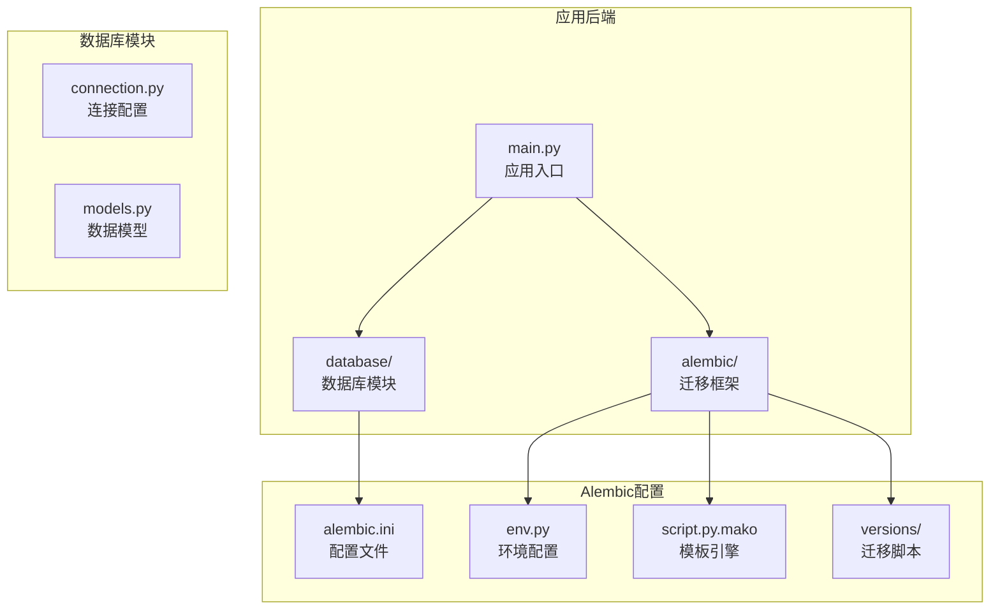
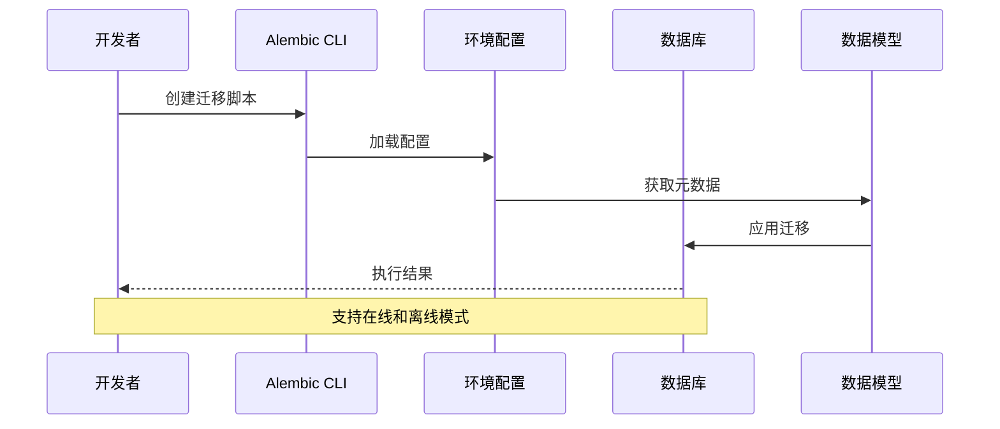
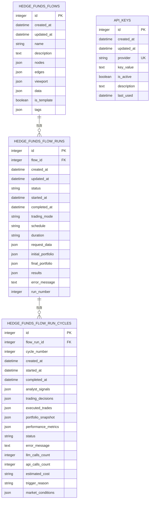
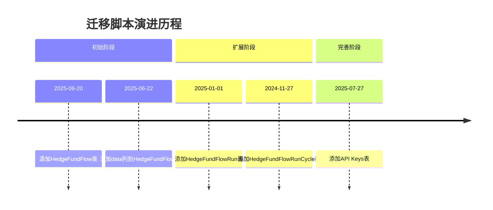
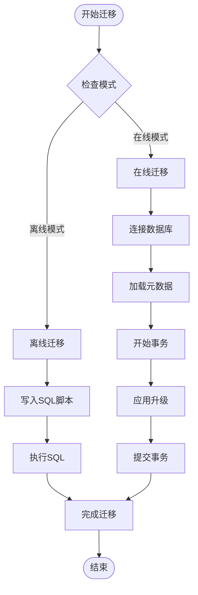
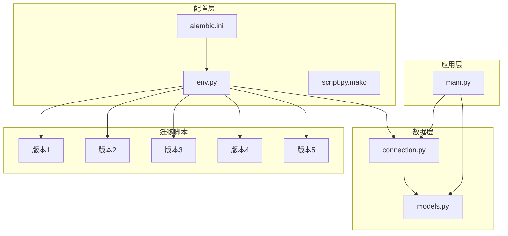
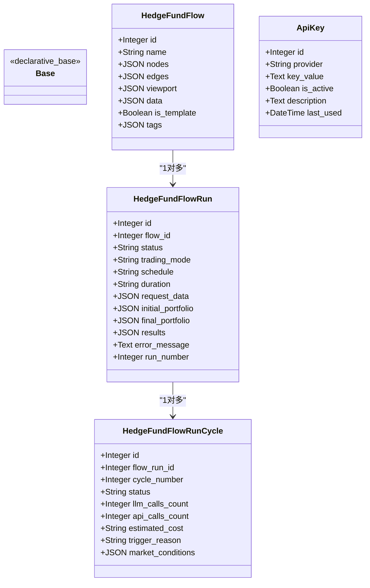
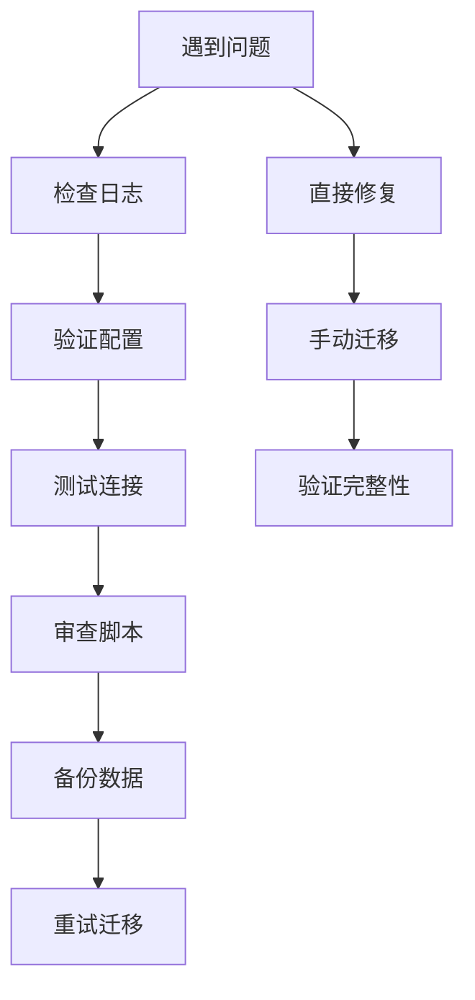

# 数据库迁移系统

<cite>
**本文档引用的文件**
- [alembic.ini](file://app/backend/alembic.ini)
- [env.py](file://app/backend/alembic/env.py)
- [script.py.mako](file://app/backend/alembic/script.py.mako)
- [models.py](file://app/backend/database/models.py)
- [connection.py](file://app/backend/database/connection.py)
- [1b1feba3d897_add_data_column_to_hedge_fund_flows.py](file://app/backend/alembic/versions/1b1feba3d897_add_data_column_to_hedge_fund_flows.py)
- [add_api_keys_table.py](file://app/backend/alembic/versions/add_api_keys_table.py)
- [5274886e5bee_add_hedgefundflow_table.py](file://app/backend/alembic/versions/5274886e5bee_add_hedgefundflow_table.py)
- [2f8c5d9e4b1a_add_hedgefundflowrun_table.py](file://app/backend/alembic/versions/2f8c5d9e4b1a_add_hedgefundflowrun_table.py)
- [3f9a6b7c8d2e_add_hedgefundflowruncycle_table.py](file://app/backend/alembic/versions/3f9a6b7c8d2e_add_hedgefundflowruncycle_table.py)
- [main.py](file://app/backend/main.py)
- [README](file://app/backend/alembic/README)
</cite>

## 目录
1. [简介](#简介)
2. [项目结构](#项目结构)
3. [核心组件](#核心组件)
4. [架构概览](#架构概览)
5. [详细组件分析](#详细组件分析)
6. [依赖关系分析](#依赖关系分析)
7. [性能考虑](#性能考虑)
8. [故障排除指南](#故障排除指南)
9. [结论](#结论)
10. [附录](#附录)

## 简介

本项目采用Alembic作为数据库迁移框架，实现了完整的数据库模式演进管理。系统基于SQLite数据库，通过SQLAlchemy ORM定义数据模型，并使用Alembic自动生成和执行迁移脚本。

数据库迁移系统的核心目标是：
- 提供安全可靠的数据库模式变更管理
- 确保开发、测试和生产环境的一致性
- 支持向后兼容性和数据完整性保护
- 实现自动化迁移流程和版本控制

## 项目结构

项目采用分层架构组织，数据库相关文件集中在`app/backend`目录下：

**图表来源**
- [main.py:1-56](file://app/backend/main.py#L1-L56)
- [alembic.ini:1-120](file://app/backend/alembic.ini#L1-L120)
- [connection.py:1-32](file://app/backend/database/connection.py#L1-L32)

**章节来源**
- [main.py:1-56](file://app/backend/main.py#L1-L56)
- [alembic.ini:1-120](file://app/backend/alembic.ini#L1-L120)
- [connection.py:1-32](file://app/backend/database/connection.py#L1-L32)

## 核心组件

### Alembic配置系统

Alembic配置系统由三个核心文件组成：

1. **alembic.ini**: 主配置文件，定义迁移脚本位置、数据库连接和日志设置
2. **env.py**: 运行时环境配置，处理在线和离线迁移模式
3. **script.py.mako**: 模板引擎，生成标准化的迁移脚本结构

### 数据模型层

系统使用SQLAlchemy ORM定义数据模型，包含四个核心表：

1. **HedgeFundFlow**: 存储React Flow配置（节点、边、视口）
2. **HedgeFundFlowRun**: 跟踪单个执行运行
3. **HedgeFundFlowRunCycle**: 交易会话内的分析周期
4. **ApiKey**: 存储各种服务的API密钥

### 迁移脚本管理

迁移脚本按时间顺序组织，每个脚本包含升级和降级逻辑，确保双向兼容性。

**章节来源**
- [alembic.ini:1-120](file://app/backend/alembic.ini#L1-L120)
- [env.py:1-78](file://app/backend/alembic/env.py#L1-L78)
- [script.py.mako:1-29](file://app/backend/alembic/script.py.mako#L1-L29)
- [models.py:1-115](file://app/backend/database/models.py#L1-L115)

## 架构概览

数据库迁移系统的整体架构如下：

**图表来源**
- [env.py:28-77](file://app/backend/alembic/env.py#L28-L77)
- [alembic.ini:66](file://app/backend/alembic.ini#L66)

系统支持两种迁移模式：

1. **在线模式**: 直接连接数据库执行迁移
2. **离线模式**: 使用SQL语句直接写入迁移脚本

**章节来源**
- [env.py:28-77](file://app/backend/alembic/env.py#L28-L77)
- [alembic.ini:66](file://app/backend/alembic.ini#L66)

## 详细组件分析

### 数据模型设计

系统采用清晰的表结构设计，支持复杂的金融数据存储需求：

**图表来源**
- [models.py:6-115](file://app/backend/database/models.py#L6-L115)

### 迁移脚本演进历史

系统经历了以下关键演进阶段：

**图表来源**
- [5274886e5bee_add_hedgefundflow_table.py:1-47](file://app/backend/alembic/versions/5274886e5bee_add_hedgefundflow_table.py#L1-L47)
- [1b1feba3d897_add_data_column_to_hedge_fund_flows.py:1-33](file://app/backend/alembic/versions/1b1feba3d897_add_data_column_to_hedge_fund_flows.py#L1-L33)
- [2f8c5d9e4b1a_add_hedgefundflowrun_table.py:1-49](file://app/backend/alembic/versions/2f8c5d9e4b1a_add_hedgefundflowrun_table.py#L1-L49)
- [3f9a6b7c8d2e_add_hedgefundflowruncycle_table.py:1-102](file://app/backend/alembic/versions/3f9a6b7c8d2e_add_hedgefundflowruncycle_table.py#L1-L102)
- [add_api_keys_table.py:1-44](file://app/backend/alembic/versions/add_api_keys_table.py#L1-L44)

### 迁移执行流程

**图表来源**
- [env.py:28-77](file://app/backend/alembic/env.py#L28-L77)

**章节来源**
- [models.py:6-115](file://app/backend/database/models.py#L6-L115)
- [5274886e5bee_add_hedgefundflow_table.py:1-47](file://app/backend/alembic/versions/5274886e5bee_add_hedgefundflow_table.py#L1-L47)
- [2f8c5d9e4b1a_add_hedgefundflowrun_table.py:1-49](file://app/backend/alembic/versions/2f8c5d9e4b1a_add_hedgefundflowrun_table.py#L1-L49)
- [3f9a6b7c8d2e_add_hedgefundflowruncycle_table.py:1-102](file://app/backend/alembic/versions/3f9a6b7c8d2e_add_hedgefundflowruncycle_table.py#L1-L102)
- [add_api_keys_table.py:1-44](file://app/backend/alembic/versions/add_api_keys_table.py#L1-L44)

## 依赖关系分析

### 组件依赖图

**图表来源**
- [alembic.ini:1-120](file://app/backend/alembic.ini#L1-L120)
- [env.py:1-78](file://app/backend/alembic/env.py#L1-L78)
- [connection.py:1-32](file://app/backend/database/connection.py#L1-L32)
- [models.py:1-115](file://app/backend/database/models.py#L1-L115)
- [main.py:1-56](file://app/backend/main.py#L1-L56)

### 数据模型依赖关系

**图表来源**
- [models.py:6-115](file://app/backend/database/models.py#L6-L115)

**章节来源**
- [alembic.ini:1-120](file://app/backend/alembic.ini#L1-L120)
- [env.py:1-78](file://app/backend/alembic/env.py#L1-L78)
- [connection.py:1-32](file://app/backend/database/connection.py#L1-L32)
- [models.py:1-115](file://app/backend/database/models.py#L1-L115)

## 性能考虑

### 迁移性能优化

1. **批量操作**: 在迁移脚本中尽量使用批量操作减少数据库往返
2. **索引优化**: 合理创建索引提升查询性能
3. **事务管理**: 使用事务确保数据一致性
4. **内存管理**: 避免在迁移中创建过大的对象

### 数据库性能特性

- **SQLite优势**: 文件级数据库，部署简单，适合开发和小型生产环境
- **并发限制**: SQLite在高并发场景下可能成为瓶颈
- **数据完整性**: 通过外键约束和唯一约束保证数据完整性

## 故障排除指南

### 常见迁移问题

1. **迁移失败**: 检查数据库连接和权限设置
2. **版本冲突**: 使用`alembic current`查看当前版本状态
3. **数据丢失风险**: 在执行降级操作前务必备份数据

### 调试技巧

**图表来源**
- [alembic.ini:86-120](file://app/backend/alembic.ini#L86-L120)

**章节来源**
- [alembic.ini:86-120](file://app/backend/alembic.ini#L86-L120)

## 结论

本数据库迁移系统通过Alembic框架实现了完整的数据库模式管理，具有以下特点：

1. **结构清晰**: 分层架构便于维护和扩展
2. **安全性高**: 支持在线和离线模式，提供数据备份保护
3. **可扩展性强**: 模块化设计支持未来功能扩展
4. **开发友好**: 自动生成迁移脚本，简化开发流程

系统为AI对冲基金应用提供了可靠的数据存储基础，支持复杂的金融数据处理需求。

## 附录

### 迁移最佳实践

1. **版本控制**: 每个迁移脚本对应单一功能变更
2. **测试验证**: 在测试环境充分验证后再部署到生产环境
3. **文档记录**: 详细记录每次迁移的目的和影响范围
4. **回滚准备**: 始终准备相应的降级脚本

### 生产环境迁移策略

1. **零停机迁移**: 使用在线模式进行滚动更新
2. **渐进式部署**: 分批次部署到不同服务器组
3. **监控告警**: 实时监控迁移过程中的数据库状态
4. **应急响应**: 准备快速回滚方案