# 数据库连接管理

<cite>
**本文档引用的文件**
- [connection.py](file://app/backend/database/connection.py)
- [__init__.py](file://app/backend/database/__init__.py)
- [models.py](file://app/backend/database/models.py)
- [main.py](file://app/backend/main.py)
- [env.py](file://app/backend/alembic/env.py)
- [alembic.ini](file://app/backend/alembic.ini)
- [flow_repository.py](file://app/backend/repositories/flow_repository.py)
- [api_key_repository.py](file://app/backend/repositories/api_key_repository.py)
- [flows.py](file://app/backend/routes/flows.py)
- [api_keys.py](file://app/backend/routes/api_keys.py)
- [schemas.py](file://app/backend/models/schemas.py)
- [pyproject.toml](file://pyproject.toml)
</cite>

## 目录
1. [简介](#简介)
2. [项目结构](#项目结构)
3. [核心组件](#核心组件)
4. [架构概览](#架构概览)
5. [详细组件分析](#详细组件分析)
6. [依赖关系分析](#依赖关系分析)
7. [性能考虑](#性能考虑)
8. [故障排除指南](#故障排除指南)
9. [结论](#结论)

## 简介

本项目采用SQLAlchemy作为ORM框架，使用SQLite作为默认数据库存储。系统实现了完整的数据库连接管理机制，包括连接配置、连接池设置、会话管理和异步操作支持。本文档将详细说明数据库连接管理的最佳实践，涵盖开发环境和生产环境的不同配置选项、连接超时和重连机制、错误处理策略，以及异步数据库操作的实现方案。

## 项目结构

项目采用分层架构设计，数据库相关组件主要集中在`app/backend/database`目录中：

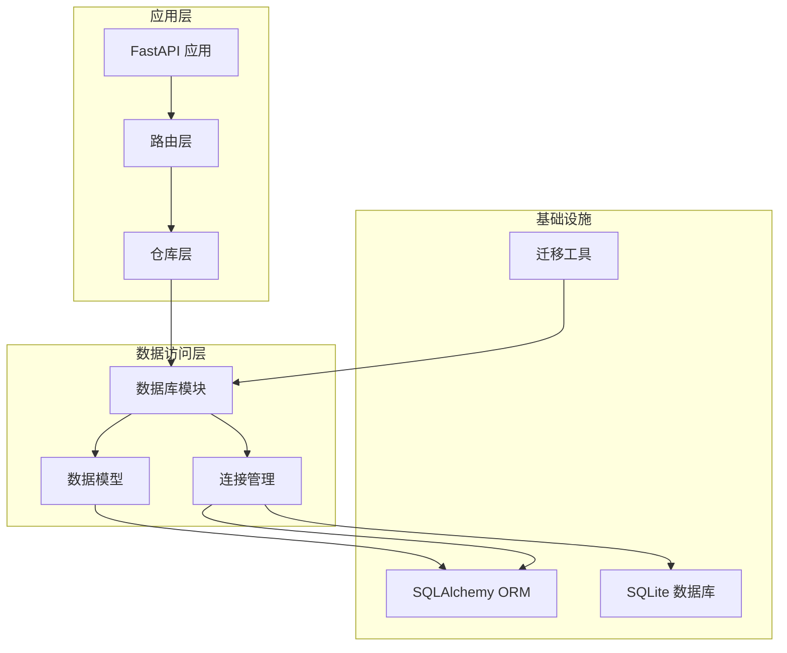

**图表来源**
- [main.py:15-30](file://app/backend/main.py#L15-L30)
- [connection.py:15-24](file://app/backend/database/connection.py#L15-L24)

**章节来源**
- [main.py:1-56](file://app/backend/main.py#L1-56)
- [connection.py:1-32](file://app/backend/database/connection.py#L1-L32)

## 核心组件

### 数据库连接配置

系统使用SQLite作为默认数据库，通过绝对路径确保跨平台兼容性：

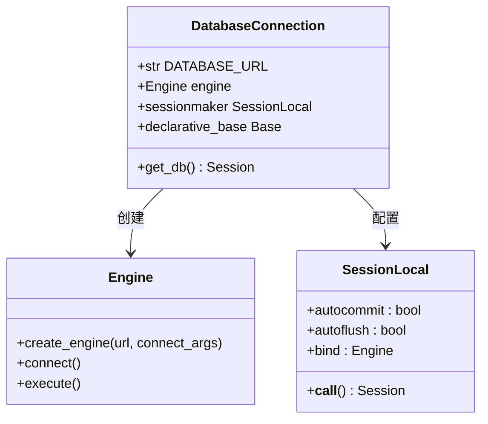

**图表来源**
- [connection.py:15-24](file://app/backend/database/connection.py#L15-L24)

### 数据模型定义

系统定义了三个核心数据表：交易流配置、执行运行跟踪和API密钥管理：

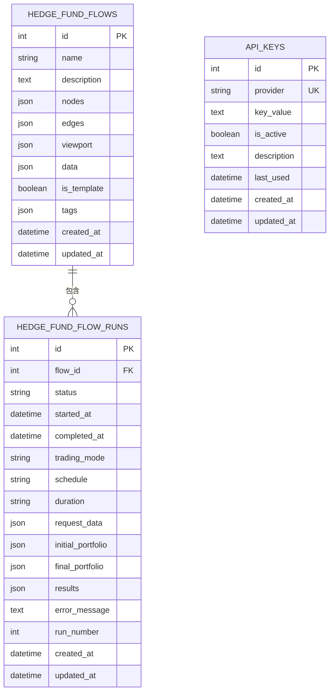

**图表来源**
- [models.py:6-115](file://app/backend/database/models.py#L6-L115)

**章节来源**
- [connection.py:1-32](file://app/backend/database/connection.py#L1-L32)
- [models.py:1-115](file://app/backend/database/models.py#L1-L115)

## 架构概览

系统采用依赖注入模式管理数据库连接，确保每个请求都有独立的数据库会话：

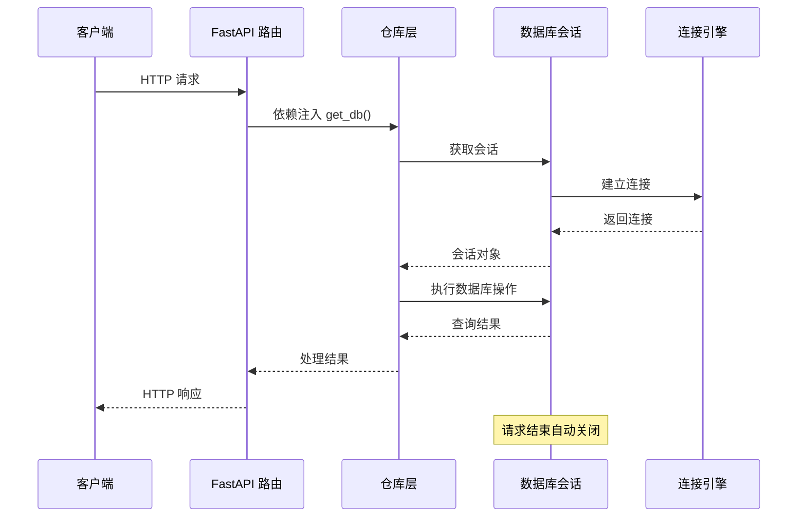

**图表来源**
- [flows.py:26-42](file://app/backend/routes/flows.py#L26-L42)
- [connection.py:27-32](file://app/backend/database/connection.py#L27-L32)

## 详细组件分析

### 连接管理器

连接管理器负责创建和配置数据库引擎，实现连接池管理和会话生命周期控制：

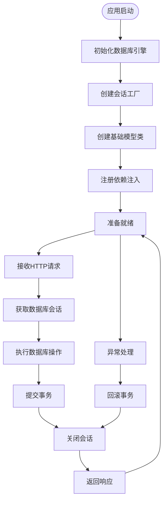

**图表来源**
- [connection.py:15-32](file://app/backend/database/connection.py#L15-L32)
- [main.py:17-18](file://app/backend/main.py#L17-L18)

### 仓库模式实现

系统采用仓库模式封装数据库操作，提供清晰的数据访问接口：

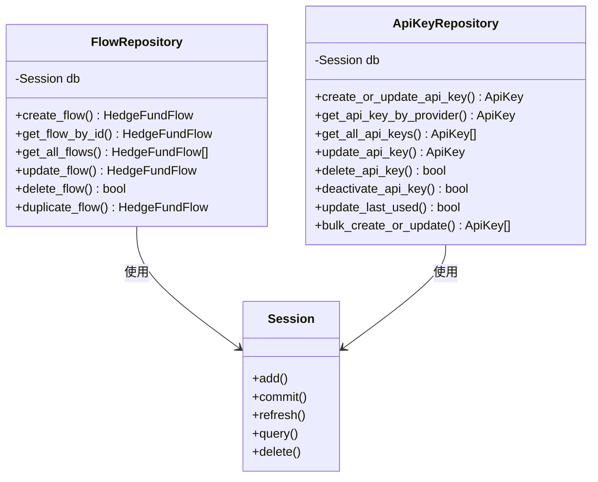

**图表来源**
- [flow_repository.py:6-103](file://app/backend/repositories/flow_repository.py#L6-L103)
- [api_key_repository.py:9-131](file://app/backend/repositories/api_key_repository.py#L9-L131)

### 异步操作支持

虽然当前实现主要基于同步操作，但系统已为异步数据库操作做好了架构准备：

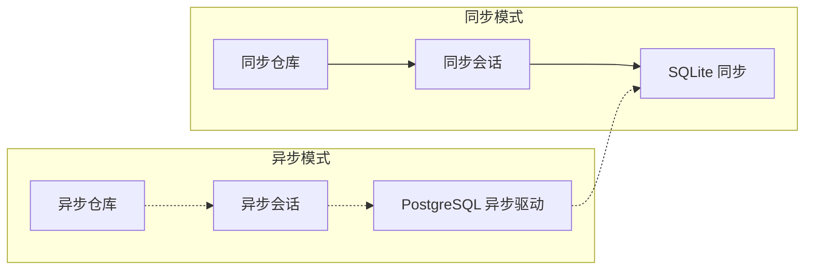

**图表来源**
- [pyproject.toml:36](file://pyproject.toml#L36)
- [connection.py:15-18](file://app/backend/database/connection.py#L15-L18)

**章节来源**
- [connection.py:1-32](file://app/backend/database/connection.py#L1-L32)
- [flow_repository.py:1-103](file://app/backend/repositories/flow_repository.py#L1-L103)
- [api_key_repository.py:1-131](file://app/backend/repositories/api_key_repository.py#L1-L131)

## 依赖关系分析

### 外部依赖

系统依赖以下关键组件：

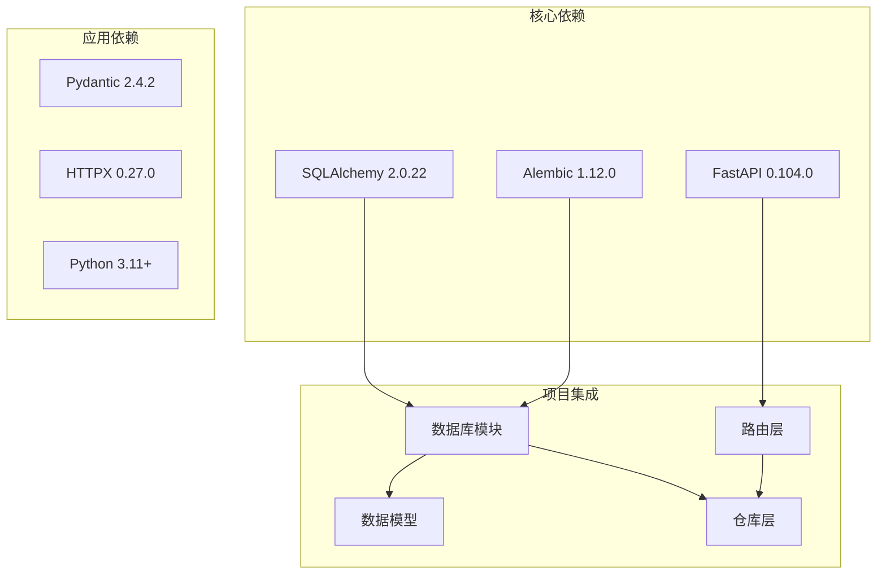

**图表来源**
- [pyproject.toml:36](file://pyproject.toml#L36)
- [pyproject.toml:32](file://pyproject.toml#L32)

### 内部模块依赖

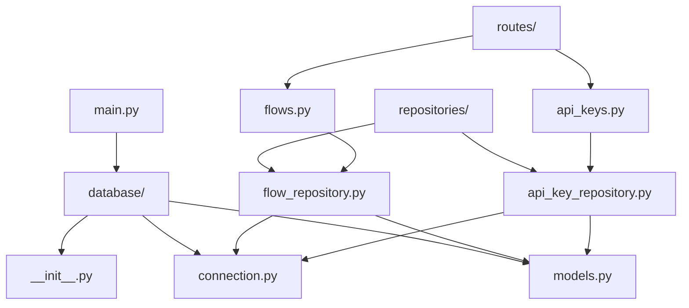

**图表来源**
- [main.py:6-30](file://app/backend/main.py#L6-L30)
- [__init__.py:1-4](file://app/backend/database/__init__.py#L1-L4)

**章节来源**
- [pyproject.toml:1-64](file://pyproject.toml#L1-L64)
- [main.py:1-56](file://app/backend/main.py#L1-L56)

## 性能考虑

### 连接池配置

当前配置使用默认的SQLite连接池设置，适用于开发和小规模生产环境：

| 参数 | 默认值 | 生产环境建议 |
|------|--------|-------------|
| pool_size | 未指定 | 5-10 |
| max_overflow | 未指定 | 10-20 |
| pool_timeout | 未指定 | 30-60秒 |
| pool_recycle | 未指定 | 3600秒 |
| echo | False | 根据需要开启 |

### 会话管理优化

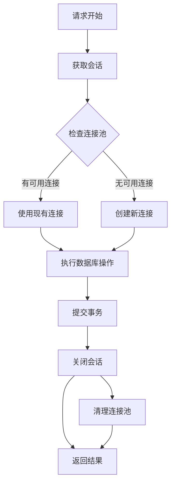

**图表来源**
- [connection.py:27-32](file://app/backend/database/connection.py#L27-L32)

### 查询优化策略

1. **索引优化**：为常用查询字段添加索引
2. **批量操作**：使用批量插入和更新减少往返次数
3. **懒加载**：避免不必要的关联查询
4. **分页查询**：对大数据集实施分页

## 故障排除指南

### 常见问题及解决方案

| 问题类型 | 症状 | 解决方案 |
|----------|------|---------|
| 连接超时 | OperationalError: connection timeout | 增加pool_timeout，检查网络连接 |
| 数据库锁定 | OperationalError: database is locked | 减少并发连接数，使用事务批处理 |
| 内存泄漏 | 内存使用持续增长 | 确保会话正确关闭，检查循环引用 |
| 迁移失败 | Alembic错误 | 检查数据库权限，验证迁移脚本 |

### 错误处理策略

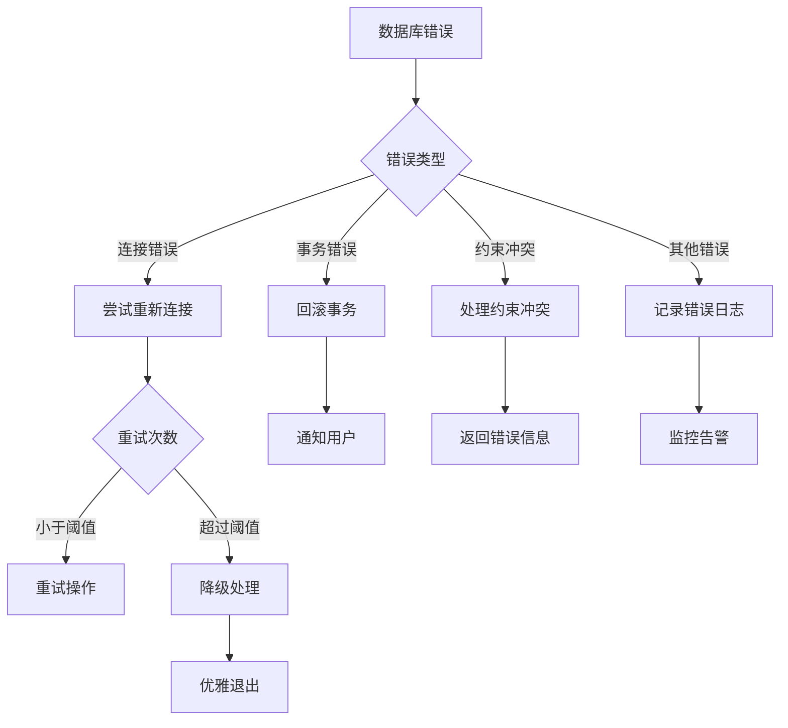

**图表来源**
- [flows.py:28-42](file://app/backend/routes/flows.py#L28-L42)
- [api_keys.py:29-39](file://app/backend/routes/api_keys.py#L29-L39)

### 监控指标

建议监控以下关键指标：

1. **连接池指标**
   - 连接使用率
   - 等待时间
   - 连接创建/销毁频率

2. **查询性能指标**
   - 平均查询响应时间
   - 查询失败率
   - 慢查询统计

3. **系统健康指标**
   - 数据库可用性
   - 存储空间使用率
   - 进程资源使用情况

**章节来源**
- [connection.py:15-32](file://app/backend/database/connection.py#L15-L32)
- [flows.py:18-174](file://app/backend/routes/flows.py#L18-L174)
- [api_keys.py:19-201](file://app/backend/routes/api_keys.py#L19-L201)

## 结论

本项目的数据库连接管理实现了清晰的分层架构和良好的可维护性。当前基于SQLite的实现适合开发和小规模生产环境，具备以下优势：

1. **简单易用**：无需额外的数据库服务器配置
2. **开发友好**：快速部署和调试
3. **成本效益**：零运维成本
4. **可靠性**：ACID特性保证数据一致性

对于生产环境，建议考虑以下改进方向：

1. **数据库迁移**：从SQLite迁移到PostgreSQL或MySQL
2. **连接池优化**：根据负载调整连接池参数
3. **异步支持**：引入异步数据库驱动提升性能
4. **监控完善**：建立全面的数据库监控体系
5. **备份策略**：实现定期备份和灾难恢复

通过这些改进，系统将能够更好地支持高并发场景和企业级应用需求。