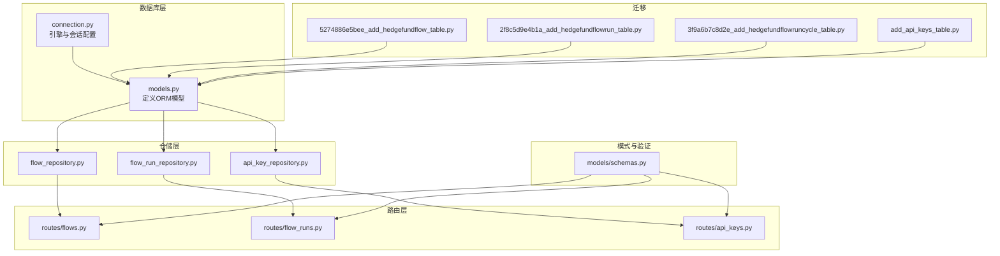
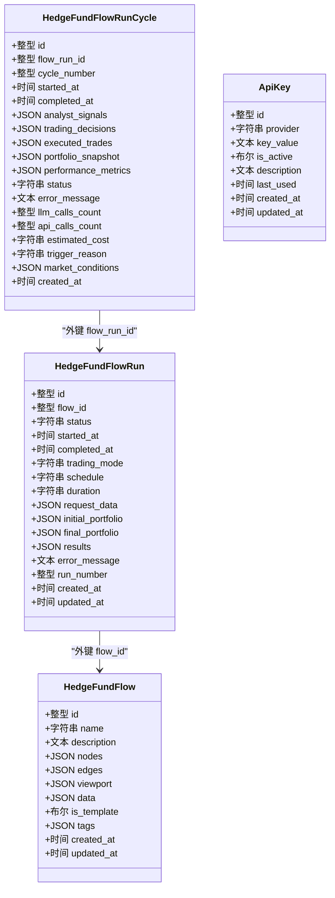
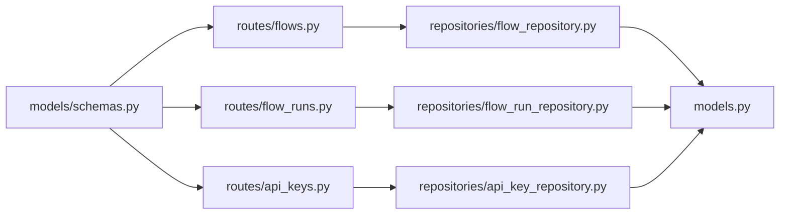

# 核心数据模型

<cite>
**本文引用的文件**
- [models.py](file://app/backend/database/models.py)
- [connection.py](file://app/backend/database/connection.py)
- [schemas.py](file://app/backend/models/schemas.py)
- [flow_repository.py](file://app/backend/repositories/flow_repository.py)
- [flow_run_repository.py](file://app/backend/repositories/flow_run_repository.py)
- [api_key_repository.py](file://app/backend/repositories/api_key_repository.py)
- [flows.py](file://app/backend/routes/flows.py)
- [flow_runs.py](file://app/backend/routes/flow_runs.py)
- [api_keys.py](file://app/backend/routes/api_keys.py)
- [5274886e5bee_add_hedgefundflow_table.py](file://app/backend/alembic/versions/5274886e5bee_add_hedgefundflow_table.py)
- [2f8c5d9e4b1a_add_hedgefundflowrun_table.py](file://app/backend/alembic/versions/2f8c5d9e4b1a_add_hedgefundflowrun_table.py)
- [3f9a6b7c8d2e_add_hedgefundflowruncycle_table.py](file://app/backend/alembic/versions/3f9a6b7c8d2e_add_hedgefundflowruncycle_table.py)
- [add_api_keys_table.py](file://app/backend/alembic/versions/add_api_keys_table.py)
</cite>

## 目录
1. [简介](#简介)
2. [项目结构](#项目结构)
3. [核心组件](#核心组件)
4. [架构总览](#架构总览)
5. [详细组件分析](#详细组件分析)
6. [依赖分析](#依赖分析)
7. [性能考虑](#性能考虑)
8. [故障排查指南](#故障排查指南)
9. [结论](#结论)
10. [附录](#附录)

## 简介
本文件系统性梳理并深入解析本项目的核心数据模型：HedgeFundFlow、HedgeFundFlowRun、HedgeFundFlowRunCycle、ApiKey。内容涵盖字段定义与数据类型、约束条件与业务含义、模型间关系映射（主键、外键、索引）、JSON字段的使用场景与结构、字段验证规则与默认值、数据完整性保障机制，以及实例化与常见使用模式的最佳实践。

## 项目结构
后端采用SQLAlchemy ORM + Alembic 迁移管理，数据库为SQLite（本地开发），模型定义集中在数据库层，配合仓储层与路由层完成CRUD与业务流程编排。

图表来源
- [models.py:1-115](file://app/backend/database/models.py#L1-L115)
- [connection.py:1-32](file://app/backend/database/connection.py#L1-L32)
- [flow_repository.py:1-103](file://app/backend/repositories/flow_repository.py#L1-L103)
- [flow_run_repository.py:1-133](file://app/backend/repositories/flow_run_repository.py#L1-L133)
- [api_key_repository.py:1-131](file://app/backend/repositories/api_key_repository.py#L1-L131)
- [flows.py:1-174](file://app/backend/routes/flows.py#L1-L174)
- [flow_runs.py:1-303](file://app/backend/routes/flow_runs.py#L1-L303)
- [api_keys.py:1-201](file://app/backend/routes/api_keys.py#L1-L201)
- [5274886e5bee_add_hedgefundflow_table.py:1-47](file://app/backend/alembic/versions/5274886e5bee_add_hedgefundflow_table.py#L1-L47)
- [2f8c5d9e4b1a_add_hedgefundflowrun_table.py:1-49](file://app/backend/alembic/versions/2f8c5d9e4b1a_add_hedgefundflowrun_table.py#L1-L49)
- [3f9a6b7c8d2e_add_hedgefundflowruncycle_table.py:1-102](file://app/backend/alembic/versions/3f9a6b7c8d2e_add_hedgefundflowruncycle_table.py#L1-L102)
- [add_api_keys_table.py:1-44](file://app/backend/alembic/versions/add_api_keys_table.py#L1-L44)

章节来源
- [models.py:1-115](file://app/backend/database/models.py#L1-L115)
- [connection.py:1-32](file://app/backend/database/connection.py#L1-L32)

## 核心组件
本节对四个核心模型进行逐项说明，包括字段、类型、约束、默认值、业务语义与典型用途。

- HedgeFundFlow
  - 表名：hedge_fund_flows
  - 主键：id（整型，自增）
  - 时间戳：created_at（服务器默认当前时间）、updated_at（更新时自动更新）
  - 元数据：name（字符串，非空，长度上限200）、description（文本，可空）
  - React Flow状态：nodes（JSON，非空，存储节点列表）、edges（JSON，非空，存储连线列表）、viewport（JSON，可空，存储视口缩放与平移）
  - 数据：data（JSON，可空，存储节点内部状态如代码片段、模型参数等）
  - 模板标记：is_template（布尔，默认False）
  - 标签：tags（JSON，可空，用于分类）
  - 索引：对id建立普通索引（迁移脚本显式创建）

- HedgeFundFlowRun
  - 表名：hedge_fund_flow_runs
  - 主键：id（整型，自增）
  - 外键：flow_id → hedge_fund_flows.id（整型，非空，索引）
  - 时间戳：created_at、updated_at
  - 执行状态：status（字符串，非空，默认“IDLE”；枚举：IDLE、IN_PROGRESS、COMPLETE、ERROR）
  - 起止时间：started_at（可空）、completed_at（可空）
  - 交易模式：trading_mode（字符串，默认“one-time”，取值示例：one-time、continuous、advisory）
  - 调度与周期：schedule（字符串，可空，如hourly/daily/weekly）、duration（字符串，可空，如1day/1week/1month）
  - 运行数据：request_data（JSON，可空，请求参数如标的、代理、模型等）、initial_portfolio（JSON，可空，初始组合快照）、final_portfolio（JSON，可空，最终组合快照）、results（JSON，可空，运行结果）
  - 错误信息：error_message（文本，可空）
  - 序号：run_number（整型，非空，默认1）
  - 索引：对id与flow_id建立索引

- HedgeFundFlowRunCycle
  - 表名：hedge_fund_flow_run_cycles
  - 主键：id（整型，自增）
  - 外键：flow_run_id → hedge_fund_flow_runs.id（整型，非空，索引）
  - 周期序号：cycle_number（整型，非空）
  - 时间线：created_at、started_at（非空）、completed_at（可空）
  - 分析结果：analyst_signals（JSON，可空，各代理决策/信号）、trading_decisions（JSON，可空，组合经理决策）、executed_trades（JSON，可空，已执行交易，用于模拟盘）
  - 组合快照：portfolio_snapshot（JSON，可空，包含现金、持仓与指标）
  - 性能指标：performance_metrics（JSON，可空，如收益、夏普比率等）
  - 状态与错误：status（字符串，默认“IN_PROGRESS”，取值：IN_PROGRESS、COMPLETED、ERROR）、error_message（文本，可空）
  - 成本追踪：llm_calls_count（整型，默认0）、api_calls_count（整型，默认0）、estimated_cost（字符串，可空，美元估算）
  - 触发原因与市场条件：trigger_reason（字符串，可空，如scheduled/manual/market_event）、market_conditions（JSON，可空，开始时的市场快照）
  - 索引：对flow_run_id、cycle_number、status、started_at建立索引

- ApiKey
  - 表名：api_keys
  - 主键：id（整型，自增）
  - 时间戳：created_at、updated_at
  - 提供方：provider（字符串，非空，唯一，索引），用于标识不同服务提供商（如“ANTHROPIC_API_KEY”）
  - 密钥：key_value（文本，非空），生产环境建议加密存储
  - 激活状态：is_active（布尔，默认True）
  - 描述与使用追踪：description（文本，可空）、last_used（时间戳，可空）
  - 约束：provider唯一
  - 索引：对id与provider建立索引

章节来源
- [models.py:6-115](file://app/backend/database/models.py#L6-L115)
- [5274886e5bee_add_hedgefundflow_table.py:24-37](file://app/backend/alembic/versions/5274886e5bee_add_hedgefundflow_table.py#L24-L37)
- [2f8c5d9e4b1a_add_hedgefundflowrun_table.py:24-37](file://app/backend/alembic/versions/2f8c5d9e4b1a_add_hedgefundflowrun_table.py#L24-L37)
- [3f9a6b7c8d2e_add_hedgefundflowruncycle_table.py:41-67](file://app/backend/alembic/versions/3f9a6b7c8d2e_add_hedgefundflowruncycle_table.py#L41-L67)
- [add_api_keys_table.py:24-35](file://app/backend/alembic/versions/add_api_keys_table.py#L24-L35)

## 架构总览
下图展示模型间的层次关系与依赖方向：路由层通过仓储层访问模型，模型由SQLAlchemy映射到数据库表，迁移脚本确保表结构演进一致。

图表来源
- [models.py:6-115](file://app/backend/database/models.py#L6-L115)

## 详细组件分析

### HedgeFundFlow 模型
- 字段与约束
  - name：非空，长度限制200；用于标识流程名称
  - nodes/edges：非空JSON，分别存储React Flow节点与边的完整结构
  - viewport/data/tags：可空JSON，分别存储视口状态、节点内部状态与标签
  - is_template：布尔，默认False，用于模板复用
- 业务含义
  - 存储可复用的交易流程蓝图（节点、连线、视口、元数据）
  - 支持模板化保存与复制
- JSON字段使用场景
  - nodes/edges：前端可视化编辑器的完整状态
  - data：节点内部状态（如代码、模型参数）
  - tags：分类与检索
- 验证与默认值
  - Pydantic层对Flow相关请求体有长度与必填校验（见模式文件）
  - 模型层未设置字段默认值，依赖仓储层或调用方传入
- 最佳实践
  - 创建时同时提供nodes与edges，保持流程完整性
  - 使用is_template区分模板与实例
  - tags统一格式，便于搜索与过滤

章节来源
- [models.py:6-27](file://app/backend/database/models.py#L6-L27)
- [flow_repository.py:12-28](file://app/backend/repositories/flow_repository.py#L12-L28)
- [flows.py:18-42](file://app/backend/routes/flows.py#L18-L42)
- [schemas.py:144-152](file://app/backend/models/schemas.py#L144-L152)

### HedgeFundFlowRun 模型
- 字段与约束
  - flow_id：非空外键，指向HedgeFundFlow
  - status：枚举（IDLE/IN_PROGRESS/COMPLETE/ERROR），默认IDLE
  - trading_mode：one-time/continuous/advisory，默认one-time
  - schedule/duration：仅在continuous模式下生效
  - run_number：非空，默认1，按flow_id递增生成
  - request_data/initial_portfolio/final_portfolio/results/error_message：JSON/文本，可空
- 业务含义
  - 记录一次流程的执行实例，支持一次性与持续运行模式
  - 通过run_number实现同一流程多次运行的有序记录
- JSON字段使用场景
  - request_data：运行时输入参数（如标的、代理、模型）
  - initial_portfolio/final_portfolio：组合状态快照
  - results：运行输出（如决策、信号、回测指标）
- 验证与默认值
  - status默认值在模型层设置
  - run_number由仓储层计算并写入
- 最佳实践
  - 在进入IN_PROGRESS时填充started_at
  - 在COMPLETE/ERROR时填充completed_at
  - continuous模式下合理设置schedule/duration

章节来源
- [models.py:29-54](file://app/backend/database/models.py#L29-L54)
- [flow_run_repository.py:15-29](file://app/backend/repositories/flow_run_repository.py#L15-L29)
- [flow_runs.py:20-51](file://app/backend/routes/flow_runs.py#L20-L51)
- [schemas.py:9-13](file://app/backend/models/schemas.py#L9-L13)

### HedgeFundFlowRunCycle 模型
- 字段与约束
  - flow_run_id：非空外键，指向HedgeFundFlowRun
  - cycle_number：非空，单次运行内的周期序号
  - 时间线：started_at非空，completed_at可空
  - analyst_signals/trading_decisions/executed_trades/portfolio_snapshot/performance_metrics：JSON，可空
  - status：枚举（IN_PROGRESS/COMPLETED/ERROR），默认IN_PROGRESS
  - 成本追踪：llm_calls_count/api_calls_count默认0，estimated_cost可空
  - trigger_reason/market_conditions：可空
- 业务含义
  - 将一次运行拆分为多个分析周期，便于监控与成本统计
  - 记录每轮分析的决策、交易与组合变化
- JSON字段使用场景
  - 各类信号与决策的聚合
  - 组合快照与性能指标
  - 市场条件快照
- 验证与默认值
  - status默认值在模型层设置
  - 成本计数器默认0
- 最佳实践
  - 每个周期结束时更新status与completed_at
  - 定期同步estimated_cost与实际调用计数

章节来源
- [models.py:59-95](file://app/backend/database/models.py#L59-L95)
- [3f9a6b7c8d2e_add_hedgefundflowruncycle_table.py:41-67](file://app/backend/alembic/versions/3f9a6b7c8d2e_add_hedgefundflowruncycle_table.py#L41-L67)

### ApiKey 模型
- 字段与约束
  - provider：非空且唯一，作为外部服务的标识
  - key_value：非空（生产环境建议加密）
  - is_active：布尔，默认True
  - description/last_used：可空
- 业务含义
  - 统一管理各类外部服务密钥，支持启用/停用与使用追踪
- 最佳实践
  - 生产环境对key_value进行加密存储
  - 通过is_active实现灰度与降级
  - 定期更新last_used用于审计与清理

章节来源
- [models.py:97-113](file://app/backend/database/models.py#L97-L113)
- [add_api_keys_table.py:24-35](file://app/backend/alembic/versions/add_api_keys_table.py#L24-L35)
- [api_key_repository.py:15-46](file://app/backend/repositories/api_key_repository.py#L15-L46)
- [api_keys.py:19-39](file://app/backend/routes/api_keys.py#L19-L39)

## 依赖分析
- 外部依赖
  - SQLAlchemy：ORM映射与查询
  - Alembic：迁移管理
  - FastAPI：路由与依赖注入
- 内部依赖
  - 路由层依赖仓储层，仓储层依赖模型层
  - 模式层（Pydantic）为路由层提供输入/输出验证
- 关系耦合
  - HedgeFundFlowRun → HedgeFundFlow：一对多（一个流程可有多个运行）
  - HedgeFundFlowRunCycle → HedgeFundFlowRun：一对多（一次运行可有多个周期）
  - ApiKey：独立实体，被服务层读取注入到请求

图表来源
- [flows.py:1-174](file://app/backend/routes/flows.py#L1-L174)
- [flow_runs.py:1-303](file://app/backend/routes/flow_runs.py#L1-L303)
- [api_keys.py:1-201](file://app/backend/routes/api_keys.py#L1-L201)
- [flow_repository.py:1-103](file://app/backend/repositories/flow_repository.py#L1-L103)
- [flow_run_repository.py:1-133](file://app/backend/repositories/flow_run_repository.py#L1-L133)
- [api_key_repository.py:1-131](file://app/backend/repositories/api_key_repository.py#L1-L131)
- [schemas.py:1-292](file://app/backend/models/schemas.py#L1-L292)
- [models.py:1-115](file://app/backend/database/models.py#L1-L115)

## 性能考虑
- 索引策略
  - HedgeFundFlow：对id建立索引（迁移脚本显式创建）
  - HedgeFundFlowRun：对id与flow_id建立索引（加速按流程查询与外键关联）
  - HedgeFundFlowRunCycle：对flow_run_id、cycle_number、status、started_at建立索引（支持分页、状态筛选与时间排序）
  - ApiKey：对id与provider建立索引（唯一约束+索引）
- 查询优化建议
  - 按flow_id过滤运行与周期时优先使用索引列
  - 对周期查询结合status与started_at进行范围筛选
  - 对密钥查询优先使用provider索引
- JSON字段注意事项
  - JSON字段不参与索引，复杂查询建议在应用层做结构化处理或增加派生列

## 故障排查指南
- 常见问题与定位
  - 外键约束失败：检查flow_id是否存在且未被删除
  - provider重复：ApiKey的provider需唯一，避免重复插入
  - 状态流转异常：确认started_at/updated_at/created_at是否正确更新
  - JSON结构异常：核对nodes/edges/data与各运行阶段的JSON字段结构一致性
- 排查步骤
  - 通过路由接口获取对应实体详情，确认字段值
  - 使用仓储层方法进行最小化复现（如创建/更新/删除）
  - 查看迁移脚本确认表结构是否与当前版本一致
- 相关接口参考
  - 流程：创建/查询/更新/删除/复制
  - 运行：创建/查询/更新/删除/批量删除/计数
  - 密钥：创建/更新/删除/停用/批量更新/最后使用时间更新

章节来源
- [flows.py:18-174](file://app/backend/routes/flows.py#L18-L174)
- [flow_runs.py:20-303](file://app/backend/routes/flow_runs.py#L20-L303)
- [api_keys.py:19-201](file://app/backend/routes/api_keys.py#L19-L201)
- [flow_repository.py:12-103](file://app/backend/repositories/flow_repository.py#L12-L103)
- [flow_run_repository.py:15-133](file://app/backend/repositories/flow_run_repository.py#L15-L133)
- [api_key_repository.py:15-131](file://app/backend/repositories/api_key_repository.py#L15-L131)

## 结论
本项目通过清晰的模型分层与严格的迁移管理，实现了从流程蓝图到执行实例再到周期分析的完整闭环。JSON字段灵活承载了前端可视化与运行时动态数据，配合仓储层与路由层的职责分离，既保证了扩展性也兼顾了可维护性。建议在生产环境中强化密钥安全与索引策略，并持续完善JSON结构的校验与归档。

## 附录

### 字段验证规则与默认值清单
- HedgeFundFlow
  - name：非空，长度≤200（模式层约束）
  - nodes/edges：非空（模型层约束）
  - is_template：默认False（模型层约束）
  - tags/data/viewport：可空（模型层约束）
- HedgeFundFlowRun
  - status：默认“IDLE”（模型层约束）
  - trading_mode：默认“one-time”（模型层约束）
  - run_number：默认1（仓储层逻辑）
  - started_at/completed_at：可空（模型层约束）
- HedgeFundFlowRunCycle
  - status：默认“IN_PROGRESS”（模型层约束）
  - llm_calls_count/api_calls_count：默认0（模型层约束）
  - trigger_reason/market_conditions：可空（模型层约束）
- ApiKey
  - provider：唯一（约束），非空（模型层约束）
  - is_active：默认True（模型层约束）
  - key_value：非空（模型层约束）

章节来源
- [models.py:6-115](file://app/backend/database/models.py#L6-L115)
- [schemas.py:144-152](file://app/backend/models/schemas.py#L144-L152)
- [flow_run_repository.py:126-133](file://app/backend/repositories/flow_run_repository.py#L126-L133)