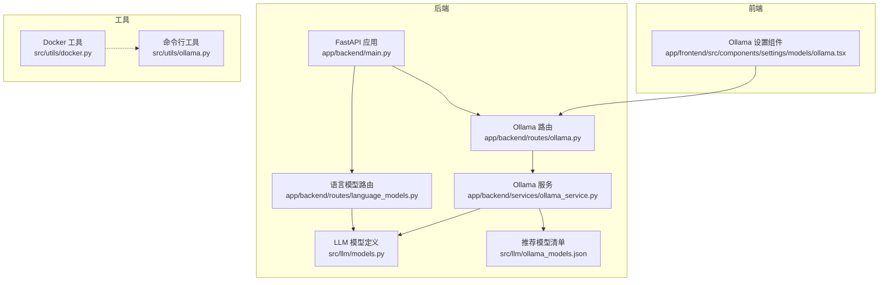
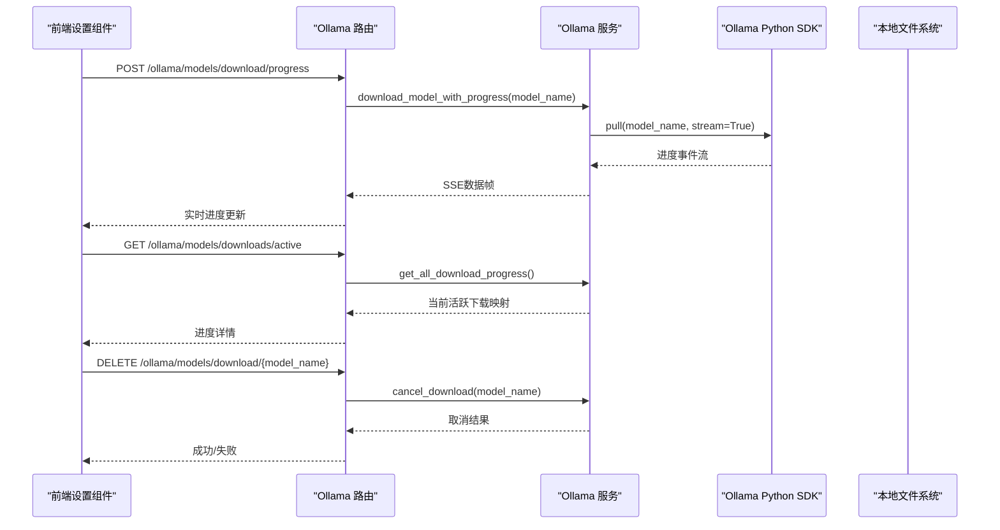
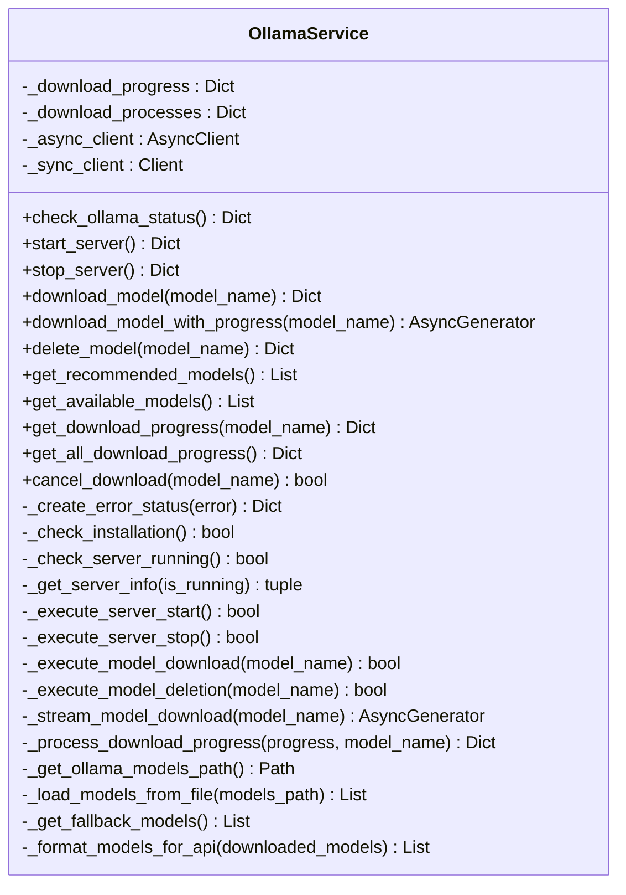
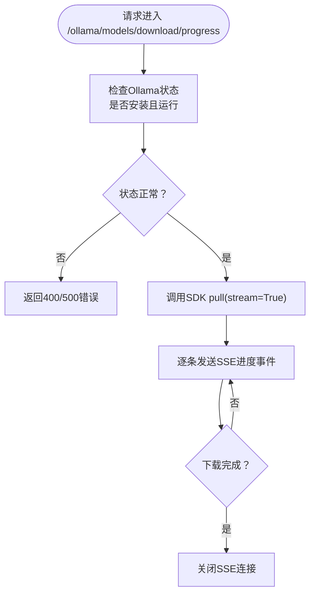
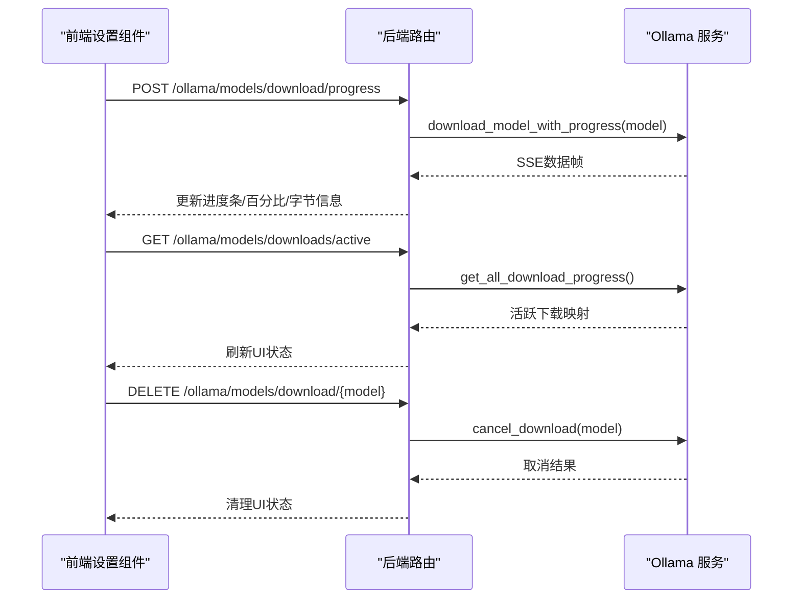
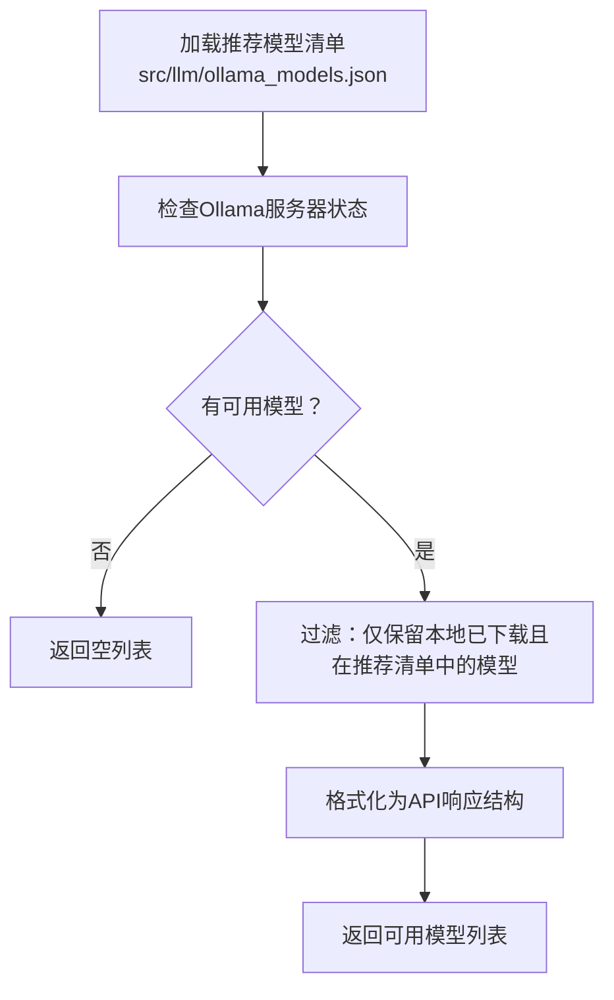
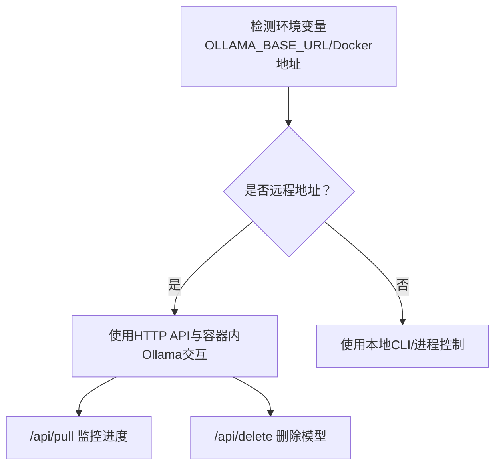
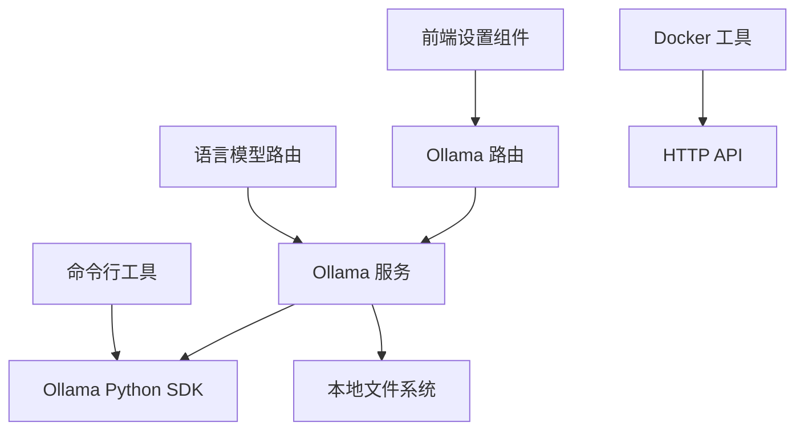

# Ollama服务

<cite>
**本文档引用的文件**
- [ollama_service.py](file://app/backend/services/ollama_service.py)
- [ollama.py](file://src/utils/ollama.py)
- [ollama.py（路由）](file://app/backend/routes/ollama.py)
- [ollama_models.json](file://src/llm/ollama_models.json)
- [models.py](file://src/llm/models.py)
- [main.py](file://app/backend/main.py)
- [docker.py](file://src/utils/docker.py)
- [ollama.tsx（前端设置组件）](file://app/frontend/src/components/settings/models/ollama.tsx)
- [language_models.py（路由）](file://app/backend/routes/language_models.py)
</cite>

## 目录
1. [简介](#简介)
2. [项目结构](#项目结构)
3. [核心组件](#核心组件)
4. [架构总览](#架构总览)
5. [详细组件分析](#详细组件分析)
6. [依赖关系分析](#依赖关系分析)
7. [性能考虑](#性能考虑)
8. [故障排除指南](#故障排除指南)
9. [结论](#结论)
10. [附录](#附录)

## 简介
本文件面向开发者，系统性阐述Ollama服务在AI对冲基金项目中的集成与使用，重点覆盖以下方面：
- OllamaService大语言模型集成与推理服务机制
- 模型加载、推理调用与响应处理流程
- OllamaService与LLM服务的接口设计、参数传递与错误处理
- 配置管理、模型选择与性能优化策略
- 健康检查、重连机制与超时处理
- 开发者集成、调试技巧与生产部署最佳实践

## 项目结构
Ollama服务在后端以FastAPI服务形式提供REST接口，在前端通过设置页面进行可视化管理。核心文件分布如下：
- 后端服务：app/backend/services/ollama_service.py
- 后端路由：app/backend/routes/ollama.py
- LLM模型定义：src/llm/models.py、src/llm/ollama_models.json
- 前端设置组件：app/frontend/src/components/settings/models/ollama.tsx
- 启动入口与CORS：app/backend/main.py
- Docker环境工具：src/utils/docker.py
- 命令行工具（可选）：src/utils/ollama.py

**图表来源**
- [main.py:15-31](file://app/backend/main.py#L15-L31)
- [ollama.py（路由）:12-319](file://app/backend/routes/ollama.py#L12-L319)
- [language_models.py（路由）:1-62](file://app/backend/routes/language_models.py#L1-L62)
- [ollama_service.py:19-519](file://app/backend/services/ollama_service.py#L19-L519)
- [models.py:106-121](file://src/llm/models.py#L106-L121)
- [ollama_models.json:1-57](file://src/llm/ollama_models.json#L1-L57)
- [ollama.tsx（前端设置组件）:1-931](file://app/frontend/src/components/settings/models/ollama.tsx#L1-L931)
- [docker.py:1-124](file://src/utils/docker.py#L1-L124)
- [ollama.py（工具）:1-408](file://src/utils/ollama.py#L1-L408)

**章节来源**
- [main.py:15-31](file://app/backend/main.py#L15-L31)
- [ollama.py（路由）:12-319](file://app/backend/routes/ollama.py#L12-L319)
- [language_models.py（路由）:1-62](file://app/backend/routes/language_models.py#L1-L62)
- [ollama_service.py:19-519](file://app/backend/services/ollama_service.py#L19-L519)
- [models.py:106-121](file://src/llm/models.py#L106-L121)
- [ollama_models.json:1-57](file://src/llm/ollama_models.json#L1-L57)
- [ollama.tsx（前端设置组件）:1-931](file://app/frontend/src/components/settings/models/ollama.tsx#L1-L931)
- [docker.py:1-124](file://src/utils/docker.py#L1-L124)
- [ollama.py（工具）:1-408](file://src/utils/ollama.py#L1-L408)

## 核心组件
- OllamaService：封装Ollama安装检测、服务器启停、模型下载/删除、进度追踪与可用模型聚合等能力，提供异步客户端与同步客户端协同工作。
- Ollama路由：暴露/status、/start、/stop、/models/download、/models/download/progress、/models/downloads/active、/models/{model_name}、/models/recommended、/models/download/{model_name}等接口。
- LLM模型定义：集中管理模型清单与提供方枚举，并支持从JSON加载推荐模型列表。
- 前端设置组件：提供Ollama状态查看、服务器启停、模型下载进度监控、取消下载与删除模型等交互。
- Docker工具：在容器化环境中检测Ollama可用性、拉取模型、删除模型。

**章节来源**
- [ollama_service.py:19-519](file://app/backend/services/ollama_service.py#L19-L519)
- [ollama.py（路由）:12-319](file://app/backend/routes/ollama.py#L12-L319)
- [models.py:18-121](file://src/llm/models.py#L18-L121)
- [ollama.tsx（前端设置组件）:1-931](file://app/frontend/src/components/settings/models/ollama.tsx#L1-L931)
- [docker.py:1-124](file://src/utils/docker.py#L1-L124)

## 架构总览
Ollama服务采用“后端服务 + 前端设置界面”的双层架构：
- 后端通过FastAPI提供REST接口，内部使用Ollama官方Python SDK进行模型管理与状态查询。
- 前端通过Server-Sent Events或轮询方式接收下载进度，实时更新UI状态。
- 在Docker环境下，通过HTTP API直接与容器内Ollama通信，避免本地进程控制。

**图表来源**
- [ollama.py（路由）:158-196](file://app/backend/routes/ollama.py#L158-L196)
- [ollama_service.py:93-173](file://app/backend/services/ollama_service.py#L93-L173)
- [ollama_service.py:405-441](file://app/backend/services/ollama_service.py#L405-L441)

**章节来源**
- [ollama.py（路由）:158-196](file://app/backend/routes/ollama.py#L158-L196)
- [ollama_service.py:93-173](file://app/backend/services/ollama_service.py#L93-L173)
- [ollama_service.py:405-441](file://app/backend/services/ollama_service.py#L405-L441)

## 详细组件分析

### OllamaService类
- 职责：封装Ollama生命周期管理、模型操作与状态查询；提供异步/同步客户端；维护下载进度缓存。
- 关键方法：
  - check_ollama_status：检查安装状态、服务器运行状态、可用模型与服务器URL。
  - start_server/stop_server：启动/停止Ollama服务，跨平台处理进程信号与终止。
  - download_model/download_model_with_progress：下载模型并支持SSE进度流。
  - delete_model：删除已下载模型。
  - get_recommended_models/get_available_models：加载推荐模型清单与聚合可用模型供前端展示。
  - cancel_download：取消下载（模拟取消，实际委托SDK不支持直接取消）。
- 数据结构：使用字典缓存下载进度，键为模型名，值为进度对象。

**图表来源**
- [ollama_service.py:19-519](file://app/backend/services/ollama_service.py#L19-L519)

**章节来源**
- [ollama_service.py:19-519](file://app/backend/services/ollama_service.py#L19-L519)

### 后端路由与接口设计
- /ollama/status：返回安装状态、运行状态、可用模型与服务器URL。
- /ollama/start：启动Ollama服务，若已运行则提示。
- /ollama/stop：停止Ollama服务，若已停止则提示。
- /ollama/models/download：下载模型（传统接口）。
- /ollama/models/download/progress：SSE流式返回下载进度。
- /ollama/models/downloads/active：获取所有活跃下载。
- /ollama/models/{model_name}：删除指定模型。
- /ollama/models/recommended：获取推荐模型清单。
- /ollama/models/download/{model_name}：取消下载（DELETE）。

**图表来源**
- [ollama.py（路由）:158-196](file://app/backend/routes/ollama.py#L158-L196)
- [ollama_service.py:405-441](file://app/backend/services/ollama_service.py#L405-L441)

**章节来源**
- [ollama.py（路由）:41-319](file://app/backend/routes/ollama.py#L41-L319)
- [ollama_service.py:93-173](file://app/backend/services/ollama_service.py#L93-L173)
- [ollama_service.py:405-441](file://app/backend/services/ollama_service.py#L405-L441)

### 前端设置组件与交互
- 功能：显示Ollama状态、启动/停止服务器、下载模型（SSE）、取消下载、删除模型、轮询活跃下载。
- 交互细节：
  - 使用fetch发起POST到progress端点，读取ReadableStream并通过SSE解析器更新进度。
  - 对于已完成/失败/取消的下载，清理UI状态并刷新可用模型列表。
  - 轮询/重连：当页面加载或发现活跃下载时，定时轮询/主动重连以恢复进度跟踪。

**图表来源**
- [ollama.tsx（前端设置组件）:136-311](file://app/frontend/src/components/settings/models/ollama.tsx#L136-L311)
- [ollama.py（路由）:197-240](file://app/backend/routes/ollama.py#L197-L240)
- [ollama_service.py:160-173](file://app/backend/services/ollama_service.py#L160-L173)

**章节来源**
- [ollama.tsx（前端设置组件）:1-931](file://app/frontend/src/components/settings/models/ollama.tsx#L1-L931)
- [ollama.py（路由）:197-240](file://app/backend/routes/ollama.py#L197-L240)
- [ollama_service.py:160-173](file://app/backend/services/ollama_service.py#L160-L173)

### 模型加载与可用模型聚合
- 推荐模型：从src/llm/ollama_models.json加载，作为前端可选模型清单。
- 可用模型：通过OllamaService聚合本地已下载模型，并仅返回同时满足“服务器运行”“本地已下载”“在推荐清单中”的模型。
- 格式化输出：将模型转换为统一的API响应格式，包含display_name、model_name、provider。

**图表来源**
- [models.py:106-121](file://src/llm/models.py#L106-L121)
- [ollama_service.py:124-151](file://app/backend/services/ollama_service.py#L124-L151)
- [ollama_service.py:502-516](file://app/backend/services/ollama_service.py#L502-L516)

**章节来源**
- [models.py:106-121](file://src/llm/models.py#L106-L121)
- [ollama_service.py:124-151](file://app/backend/services/ollama_service.py#L124-L151)
- [ollama_service.py:502-516](file://app/backend/services/ollama_service.py#L502-L516)

### Docker环境与远程Ollama
- 当检测到环境变量指定远程Ollama地址（如Docker默认地址）时，使用HTTP API与容器内Ollama交互。
- 提供ensure_ollama_and_model、download_model、delete_model等函数，支持在容器环境中自动拉取与删除模型。

**图表来源**
- [ollama.py（工具）:311-357](file://src/utils/ollama.py#L311-L357)
- [docker.py:8-31](file://src/utils/docker.py#L8-L31)
- [docker.py:63-105](file://src/utils/docker.py#L63-L105)

**章节来源**
- [ollama.py（工具）:311-357](file://src/utils/ollama.py#L311-L357)
- [docker.py:8-31](file://src/utils/docker.py#L8-L31)
- [docker.py:63-105](file://src/utils/docker.py#L63-L105)

## 依赖关系分析
- 组件耦合：
  - 路由依赖OllamaService；OllamaService依赖Ollama Python SDK与本地文件系统。
  - 前端组件依赖后端路由；语言模型路由依赖OllamaService与LLM模型定义。
  - Docker工具与命令行工具独立于后端，但共享相同的Ollama API语义。
- 外部依赖：
  - Ollama Python SDK用于异步/同步客户端调用。
  - requests用于Docker环境下的HTTP API调用。
  - FastAPI/CORS用于后端接口暴露。

**图表来源**
- [ollama.py（路由）:12-319](file://app/backend/routes/ollama.py#L12-L319)
- [language_models.py（路由）:1-62](file://app/backend/routes/language_models.py#L1-L62)
- [ollama_service.py:19-519](file://app/backend/services/ollama_service.py#L19-L519)
- [docker.py:1-124](file://src/utils/docker.py#L1-L124)
- [ollama.py（工具）:1-408](file://src/utils/ollama.py#L1-L408)

**章节来源**
- [ollama.py（路由）:12-319](file://app/backend/routes/ollama.py#L12-L319)
- [language_models.py（路由）:1-62](file://app/backend/routes/language_models.py#L1-L62)
- [ollama_service.py:19-519](file://app/backend/services/ollama_service.py#L19-L519)
- [docker.py:1-124](file://src/utils/docker.py#L1-L124)
- [ollama.py（工具）:1-408](file://src/utils/ollama.py#L1-L408)

## 性能考虑
- 异步I/O：使用AsyncClient进行模型下载与状态查询，避免阻塞主线程。
- SSE流式传输：下载进度通过SSE实时推送，减少轮询开销。
- 进度缓存：在内存中缓存下载进度，便于快速查询与UI更新。
- 超时与重试：建议在SDK调用处增加超时参数与指数退避重试策略（当前实现未显式设置，可在扩展时加入）。
- 并发控制：限制同时下载的模型数量，避免带宽与磁盘IO争用。
- 前端轮询：活跃下载轮询间隔建议在2-5秒之间，避免频繁请求。

[本节为通用性能建议，无需特定文件引用]

## 故障排除指南
- 安装与运行状态检查
  - 使用/status端点确认Ollama是否安装且运行。
  - 若未安装，先执行安装流程；若未运行，调用/start启动。
- 下载失败
  - 检查网络连通性与磁盘空间。
  - 查看SSE进度事件中的错误字段，定位具体问题。
  - 使用/ollama/models/downloads/active确认是否存在活跃下载。
- 取消下载
  - 当前SDK不支持直接取消，服务会模拟取消并将状态标记为cancelled。
- Docker环境
  - 确认OLLAMA_BASE_URL指向正确容器地址。
  - 使用/docker.py提供的工具函数验证可用性与模型列表。

**章节来源**
- [ollama.py（路由）:41-120](file://app/backend/routes/ollama.py#L41-L120)
- [ollama_service.py:160-173](file://app/backend/services/ollama_service.py#L160-L173)
- [docker.py:33-46](file://src/utils/docker.py#L33-L46)

## 结论
Ollama服务通过清晰的后端接口与前端交互，实现了本地/容器化环境下的模型管理与状态监控。其异步流式下载与进度缓存机制提升了用户体验，结合Docker工具可在多环境下稳定运行。建议在生产环境中增加超时与重试策略、并发控制与日志审计，以进一步提升稳定性与可观测性。

[本节为总结性内容，无需特定文件引用]

## 附录

### 接口规范概览
- GET /ollama/status：返回安装与运行状态、可用模型列表、服务器URL。
- POST /ollama/start：启动Ollama服务。
- POST /ollama/stop：停止Ollama服务。
- POST /ollama/models/download：下载模型（传统接口）。
- POST /ollama/models/download/progress：SSE流式下载进度。
- GET /ollama/models/downloads/active：获取活跃下载映射。
- DELETE /ollama/models/download/{model_name}：取消下载。
- DELETE /ollama/models/{model_name}：删除模型。
- GET /ollama/models/recommended：获取推荐模型清单。

**章节来源**
- [ollama.py（路由）:41-319](file://app/backend/routes/ollama.py#L41-L319)

### 配置与环境变量
- OLLAMA_BASE_URL：指定Ollama服务器地址（可为本地或容器内地址）。
- OLLAMA_HOST：在Docker环境下覆盖主机名，默认localhost。
- 其他模型提供商API密钥：用于非Ollama模型的调用（与Ollama服务解耦）。

**章节来源**
- [models.py:183-191](file://src/llm/models.py#L183-L191)
- [ollama.py（工具）:14-22](file://src/utils/ollama.py#L14-L22)