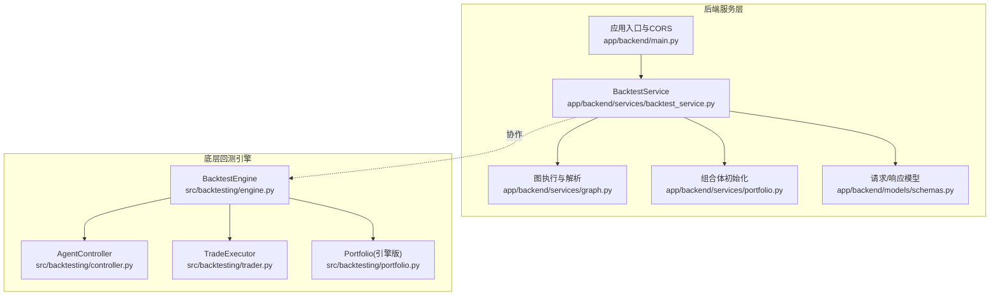
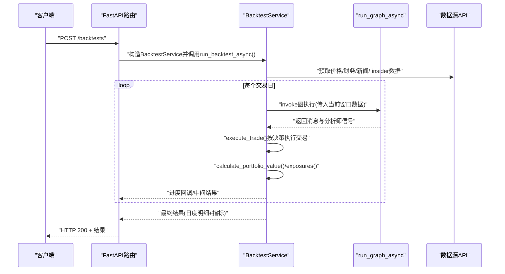
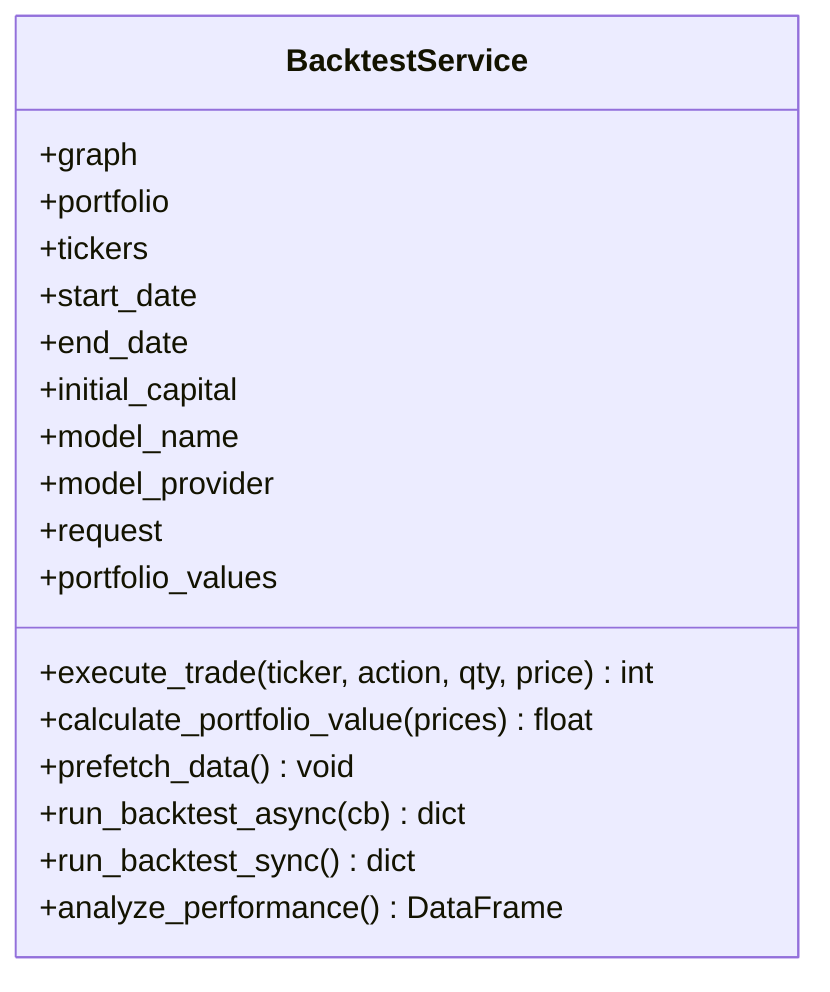
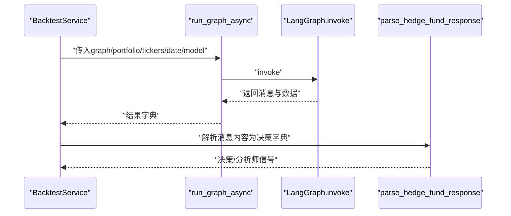
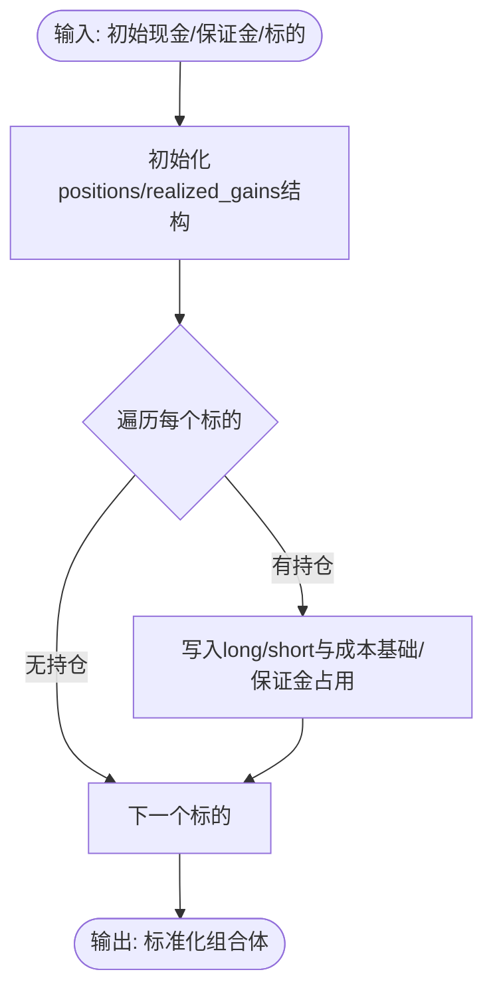
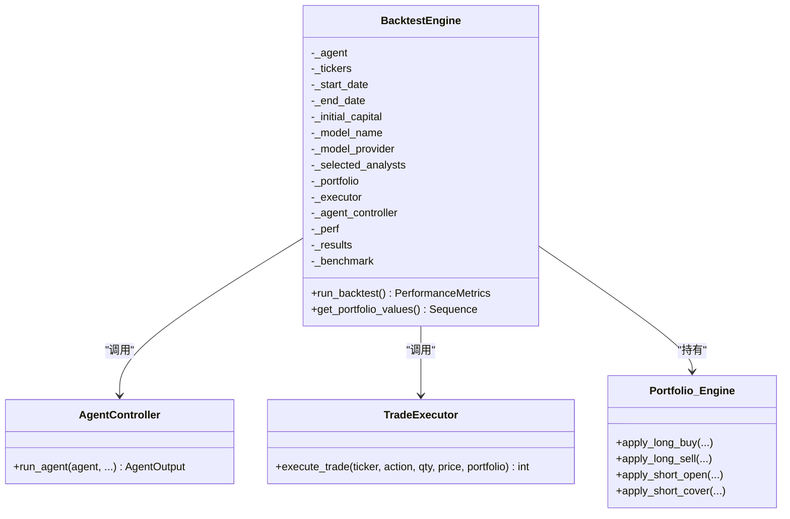
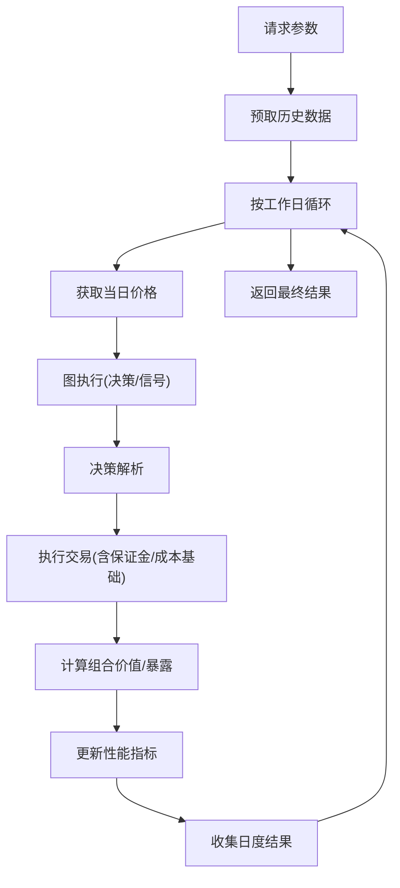
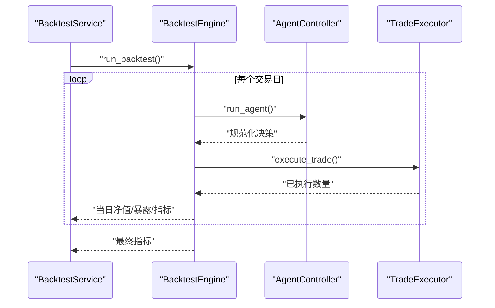
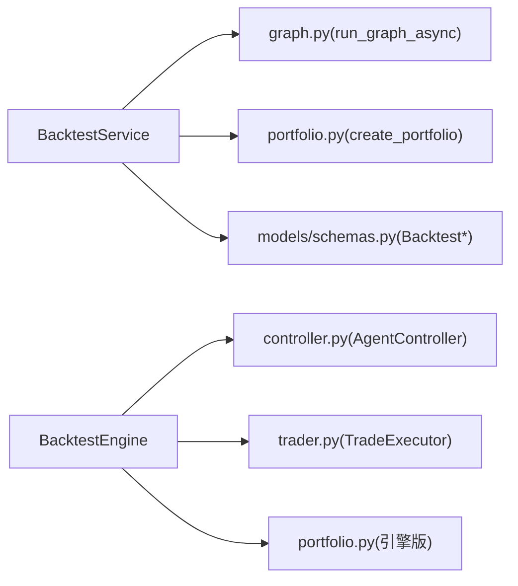

# 回测服务

<cite>
**本文引用的文件**
- [app/backend/services/backtest_service.py](file://app/backend/services/backtest_service.py)
- [app/backend/services/graph.py](file://app/backend/services/graph.py)
- [app/backend/services/portfolio.py](file://app/backend/services/portfolio.py)
- [app/backend/models/schemas.py](file://app/backend/models/schemas.py)
- [app/backend/main.py](file://app/backend/main.py)
- [src/backtesting/engine.py](file://src/backtesting/engine.py)
- [src/backtesting/controller.py](file://src/backtesting/controller.py)
- [src/backtesting/trader.py](file://src/backtesting/trader.py)
- [src/backtesting/portfolio.py](file://src/backtesting/portfolio.py)
- [src/backtesting/cli.py](file://src/backtesting/cli.py)
- [src/backtester.py](file://src/backtester.py)
- [src/graph/state.py](file://src/graph/state.py)
- [tests/backtesting/test_controller.py](file://tests/backtesting/test_controller.py)
- [tests/backtesting/integration/test_integration_long_only.py](file://tests/backtesting/integration/test_integration_long_only.py)
</cite>

## 目录
1. [简介](#简介)
2. [项目结构](#项目结构)
3. [核心组件](#核心组件)
4. [架构总览](#架构总览)
5. [详细组件分析](#详细组件分析)
6. [依赖分析](#依赖分析)
7. [性能考虑](#性能考虑)
8. [故障排查指南](#故障排查指南)
9. [结论](#结论)
10. [附录](#附录)

## 简介
本文件系统性阐述“回测服务”的架构设计与实现细节，重点覆盖以下方面：
- BacktestService 的职责边界与与后端图执行器的协作方式
- 回测任务调度、状态管理与结果收集流程
- 与 BacktestEngine 的交互协议、数据传递与异常处理
- 配置项、性能监控与资源管理策略
- 测试框架、模拟数据集成与并发处理机制
- 开发、调试与性能优化的实践建议

## 项目结构
回测服务横跨后端服务层与底层回测引擎两部分：
- 后端服务层（FastAPI）：负责请求解析、图构建与执行、回测结果聚合与返回
- 底层回测引擎：提供可复用的回测循环、交易执行、估值与指标计算

**图表来源**
- [app/backend/services/backtest_service.py:18-539](file://app/backend/services/backtest_service.py#L18-L539)
- [app/backend/services/graph.py:132-193](file://app/backend/services/graph.py#L132-L193)
- [app/backend/services/portfolio.py:6-52](file://app/backend/services/portfolio.py#L6-L52)
- [app/backend/models/schemas.py:94-129](file://app/backend/models/schemas.py#L94-L129)
- [app/backend/main.py:1-56](file://app/backend/main.py#L1-L56)
- [src/backtesting/engine.py:27-195](file://src/backtesting/engine.py#L27-L195)
- [src/backtesting/controller.py:9-68](file://src/backtesting/controller.py#L9-L68)
- [src/backtesting/trader.py:7-40](file://src/backtesting/trader.py#L7-L40)
- [src/backtesting/portfolio.py:9-196](file://src/backtesting/portfolio.py#L9-L196)

**章节来源**
- [app/backend/main.py:1-56](file://app/backend/main.py#L1-L56)
- [app/backend/models/schemas.py:94-129](file://app/backend/models/schemas.py#L94-L129)
- [src/backtesting/engine.py:27-195](file://src/backtesting/engine.py#L27-L195)

## 核心组件
- BacktestService：后端回测服务的核心类，负责预取数据、逐日回测循环、交易执行、暴露计算、性能指标更新与结果聚合。支持同步与异步两种运行模式。
- 图执行与解析：封装 LangGraph 执行器，提供异步包装与响应解析，将图执行结果转换为交易决策与分析师信号。
- 组合体初始化：根据输入参数生成标准化的初始投资组合结构，供回测使用。
- 请求/响应模型：定义回测请求、每日结果与性能指标的数据结构，确保前后端一致的契约。

**章节来源**
- [app/backend/services/backtest_service.py:18-539](file://app/backend/services/backtest_service.py#L18-L539)
- [app/backend/services/graph.py:132-193](file://app/backend/services/graph.py#L132-L193)
- [app/backend/services/portfolio.py:6-52](file://app/backend/services/portfolio.py#L6-L52)
- [app/backend/models/schemas.py:94-129](file://app/backend/models/schemas.py#L94-L129)

## 架构总览
回测服务采用“后端服务 + 引擎”双层架构：
- 后端服务层：接收请求、构建图、驱动回测循环、汇总结果
- 引擎层：提供可复用的回测循环、交易执行、估值与指标计算

**图表来源**
- [app/backend/services/backtest_service.py:285-512](file://app/backend/services/backtest_service.py#L285-L512)
- [app/backend/services/graph.py:132-177](file://app/backend/services/graph.py#L132-L177)
- [src/backtesting/engine.py:96-189](file://src/backtesting/engine.py#L96-L189)

## 详细组件分析

### BacktestService 组件分析
BacktestService 是后端回测服务的核心，承担以下职责：
- 初始化与状态管理：保存图、初始组合体、标的列表、日期范围、初始资金、模型信息与请求上下文
- 数据预取：在回测开始前拉取所需的历史数据，减少运行时 IO 延迟
- 回测循环：按工作日遍历，逐日执行图推理、交易执行、估值与暴露计算，并维护每日结果
- 性能指标：基于日度净值序列计算夏普、索提诺、最大回撤等指标
- 结果聚合：输出日度明细、最终组合体、累计净值序列与最终指标

**图表来源**
- [app/backend/services/backtest_service.py:18-539](file://app/backend/services/backtest_service.py#L18-L539)

**章节来源**
- [app/backend/services/backtest_service.py:24-539](file://app/backend/services/backtest_service.py#L24-L539)

### 图执行与解析组件分析
- run_graph_async：将同步图执行包装为异步，避免阻塞事件循环
- run_graph：向图注入消息、数据与元信息，返回图执行结果
- parse_hedge_fund_response：安全解析图返回的 JSON 字符串，兼容异常情况

**图表来源**
- [app/backend/services/graph.py:132-193](file://app/backend/services/graph.py#L132-L193)

**章节来源**
- [app/backend/services/graph.py:132-193](file://app/backend/services/graph.py#L132-L193)

### 组合体初始化组件分析
- create_portfolio：根据标的列表与期初现金/保证金要求，生成标准化的组合体结构，包含长/空头寸、成本基础与已实现损益字段

**图表来源**
- [app/backend/services/portfolio.py:6-52](file://app/backend/services/portfolio.py#L6-L52)

**章节来源**
- [app/backend/services/portfolio.py:6-52](file://app/backend/services/portfolio.py#L6-L52)

### 引擎层组件分析
- BacktestEngine：协调回测循环，调用 AgentController 获取决策，通过 TradeExecutor 执行交易，计算估值与暴露，输出每日明细与指标
- AgentController：规范化代理输出，确保决策字典覆盖所有标的且类型正确
- TradeExecutor：根据动作枚举执行买入/卖出/做空/平仓，遵循保证金约束与成本基础规则
- 引擎版 Portfolio：与后端服务版结构相似，但以方法形式暴露操作，便于引擎直接使用

**图表来源**
- [src/backtesting/engine.py:27-195](file://src/backtesting/engine.py#L27-L195)
- [src/backtesting/controller.py:9-68](file://src/backtesting/controller.py#L9-L68)
- [src/backtesting/trader.py:7-40](file://src/backtesting/trader.py#L7-L40)
- [src/backtesting/portfolio.py:9-196](file://src/backtesting/portfolio.py#L9-L196)

**章节来源**
- [src/backtesting/engine.py:27-195](file://src/backtesting/engine.py#L27-L195)
- [src/backtesting/controller.py:9-68](file://src/backtesting/controller.py#L9-L68)
- [src/backtesting/trader.py:7-40](file://src/backtesting/trader.py#L7-L40)
- [src/backtesting/portfolio.py:9-196](file://src/backtesting/portfolio.py#L9-L196)

### 数据流与状态管理
- 输入：tickers、start_date、end_date、initial_capital、model_name/provider、request(api_keys)
- 中间态：每日价格、组合体快照、已实现损益、保证金占用、暴露与净值序列
- 输出：日度明细、最终组合体、累计净值、性能指标

**图表来源**
- [app/backend/services/backtest_service.py:285-512](file://app/backend/services/backtest_service.py#L285-L512)
- [src/backtesting/engine.py:96-189](file://src/backtesting/engine.py#L96-L189)

**章节来源**
- [app/backend/services/backtest_service.py:285-512](file://app/backend/services/backtest_service.py#L285-L512)
- [src/backtesting/engine.py:96-189](file://src/backtesting/engine.py#L96-L189)

### 与 BacktestEngine 的交互协议
- 调用方：BacktestService 在后端服务中驱动回测循环
- 引擎方：BacktestEngine 提供统一的回测循环、交易执行与指标计算
- 数据契约：双方共享相同的输入参数、输出结构与中间态约定（如组合体快照、每日净值）

**图表来源**
- [src/backtesting/engine.py:96-189](file://src/backtesting/engine.py#L96-L189)
- [src/backtesting/controller.py:12-65](file://src/backtesting/controller.py#L12-L65)
- [src/backtesting/trader.py:10-37](file://src/backtesting/trader.py#L10-L37)

**章节来源**
- [src/backtesting/engine.py:96-189](file://src/backtesting/engine.py#L96-L189)
- [src/backtesting/controller.py:12-65](file://src/backtesting/controller.py#L12-L65)
- [src/backtesting/trader.py:10-37](file://src/backtesting/trader.py#L10-L37)

## 依赖分析
- 后端服务层依赖：
  - 图执行模块：用于异步执行 LangGraph 并解析响应
  - 组合体初始化：用于生成标准化初始组合体
  - 请求/响应模型：用于参数校验与结果序列化
- 引擎层依赖：
  - AgentController：规范化代理输出
  - TradeExecutor：执行交易
  - 引擎版 Portfolio：管理组合体状态

**图表来源**
- [app/backend/services/backtest_service.py:8-16](file://app/backend/services/backtest_service.py#L8-L16)
- [app/backend/services/graph.py:1-13](file://app/backend/services/graph.py#L1-L13)
- [app/backend/services/portfolio.py:1-6](file://app/backend/services/portfolio.py#L1-L6)
- [app/backend/models/schemas.py:94-129](file://app/backend/models/schemas.py#L94-L129)
- [src/backtesting/engine.py:9-16](file://src/backtesting/engine.py#L9-L16)
- [src/backtesting/controller.py:5-6](file://src/backtesting/controller.py#L5-L6)
- [src/backtesting/trader.py:3-4](file://src/backtesting/trader.py#L3-L4)
- [src/backtesting/portfolio.py:6-7](file://src/backtesting/portfolio.py#L6-L7)

**章节来源**
- [app/backend/services/backtest_service.py:8-16](file://app/backend/services/backtest_service.py#L8-L16)
- [src/backtesting/engine.py:9-16](file://src/backtesting/engine.py#L9-L16)

## 性能考虑
- 数据预取：在回测开始前批量拉取所需数据，降低运行时 IO 延迟
- 异步执行：图执行通过线程池异步包装，避免阻塞事件循环
- 指标计算：仅在具备足够样本时更新夏普/索提诺/最大回撤，避免无效计算
- 内存与序列化：日度明细与净值序列按需累积，避免一次性加载全部数据
- 并发与限流：对外部数据源调用应结合速率限制与重试策略，避免触发限流

[本节为通用性能建议，不直接分析具体文件]

## 故障排查指南
- 图执行异常：当图执行抛出异常时，BacktestService 记录错误并降级为空决策，保证回测继续进行
- 缺失数据：若某交易日价格缺失，跳过该日，避免中断回测
- 解析失败：parse_hedge_fund_response 对 JSON 解码与类型错误进行容错处理
- 进度回调：通过回调函数上报进度与中间结果，便于前端或外部系统实时感知

**章节来源**
- [app/backend/services/backtest_service.py:366-390](file://app/backend/services/backtest_service.py#L366-L390)
- [app/backend/services/graph.py:180-193](file://app/backend/services/graph.py#L180-L193)

## 结论
BacktestService 将后端服务与回测引擎有机结合，既满足了后端异步与并发需求，又复用了成熟的引擎组件。通过标准化的输入/输出契约、完善的异常处理与性能指标计算，为回测系统的稳定性与可观测性提供了坚实基础。

[本节为总结性内容，不直接分析具体文件]

## 附录

### 配置选项与数据契约
- 请求模型（BacktestRequest）：包含标的、图节点/边、模型配置、保证金要求、期初资金、日期范围、API 密钥等
- 日度结果模型（BacktestDayResult）：包含当日净值、现金、决策、已执行交易、分析师信号、价格、暴露与回报率
- 性能指标模型（BacktestPerformanceMetrics）：包含夏普、索提诺、最大回撤及其日期

**章节来源**
- [app/backend/models/schemas.py:94-129](file://app/backend/models/schemas.py#L94-L129)

### 回测服务与引擎的交互协议
- 输入参数：tickers、start_date、end_date、initial_capital、model_name、model_provider、selected_analysts、initial_margin_requirement
- 输出：results（日度明细）、performance_metrics（指标）、final_portfolio（最终组合体）
- 引擎侧：BacktestEngine.run_backtest() 返回指标；get_portfolio_values() 返回净值序列

**章节来源**
- [src/backtesting/engine.py:35-80](file://src/backtesting/engine.py#L35-L80)
- [src/backtesting/engine.py:96-195](file://src/backtesting/engine.py#L96-L195)

### 测试框架与模拟数据
- 控制器单元测试：验证 AgentController 的规范化行为与快照生成
- 集成测试：通过可配置代理模拟交易序列，验证多周期长仓策略的收益与成本基础处理

**章节来源**
- [tests/backtesting/test_controller.py:1-36](file://tests/backtesting/test_controller.py#L1-L36)
- [tests/backtesting/integration/test_integration_long_only.py:1-403](file://tests/backtesting/integration/test_integration_long_only.py#L1-L403)

### 并发处理机制
- 异步回测：run_backtest_async 支持进度回调与中间结果推送
- 图执行异步包装：run_graph_async 使用线程池避免阻塞事件循环
- 前端/外部系统：可通过回调实时接收进度与中间结果

**章节来源**
- [app/backend/services/backtest_service.py:285-512](file://app/backend/services/backtest_service.py#L285-L512)
- [app/backend/services/graph.py:132-138](file://app/backend/services/graph.py#L132-L138)

### 开发与调试建议
- 使用 CLI 引擎快速验证逻辑：src/backtesting/cli.py 与 src/backtester.py 提供命令行入口
- 在本地启用 Ollama：app/backend/main.py 在启动时检查 Ollama 安装与可用模型
- 逐步增加复杂度：先从长仓策略开始，再扩展到做空与多周期交易

**章节来源**
- [src/backtesting/cli.py:18-164](file://src/backtesting/cli.py#L18-L164)
- [src/backtester.py:13-67](file://src/backtester.py#L13-L67)
- [app/backend/main.py:32-56](file://app/backend/main.py#L32-L56)