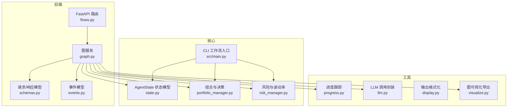
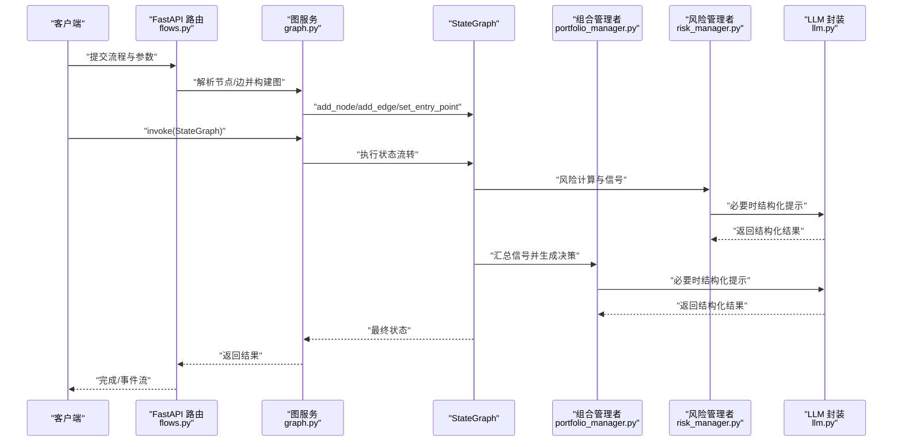
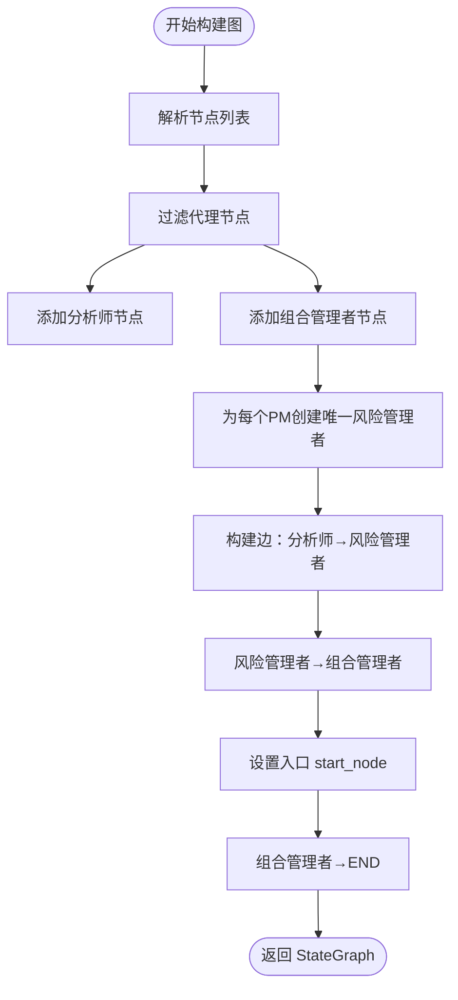
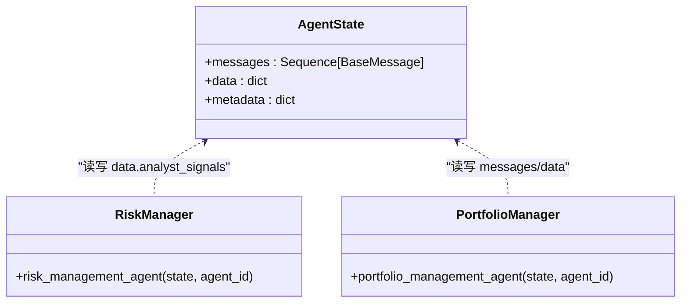
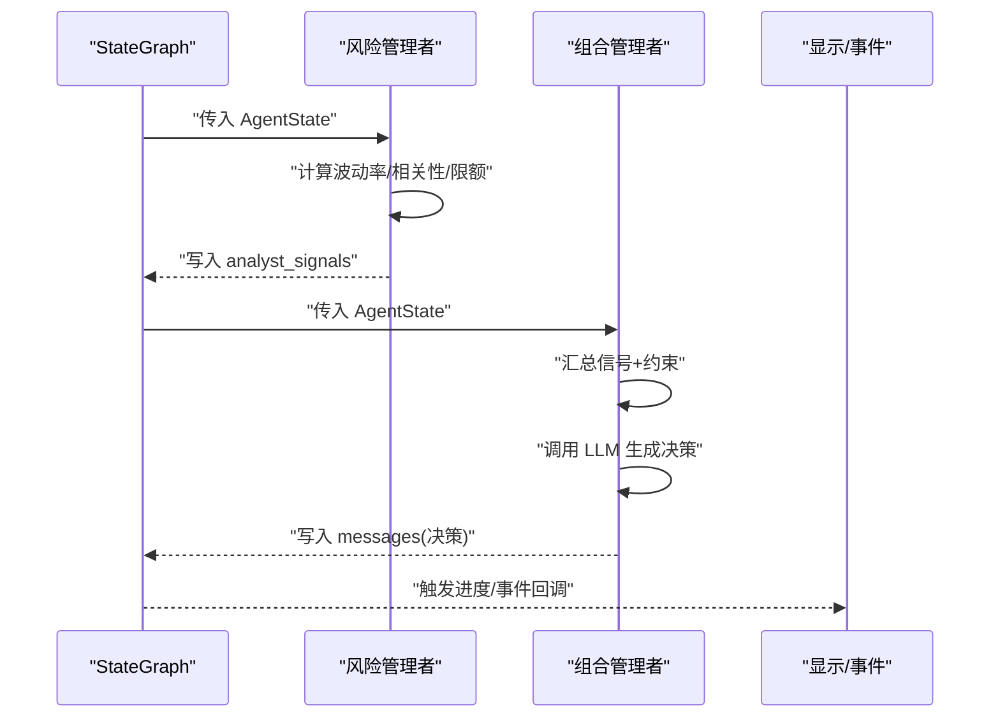
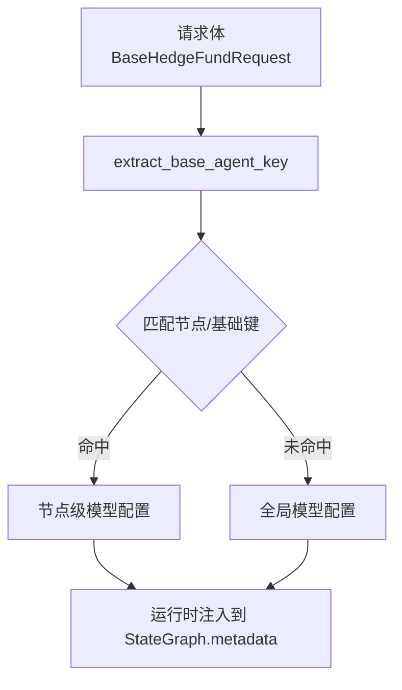
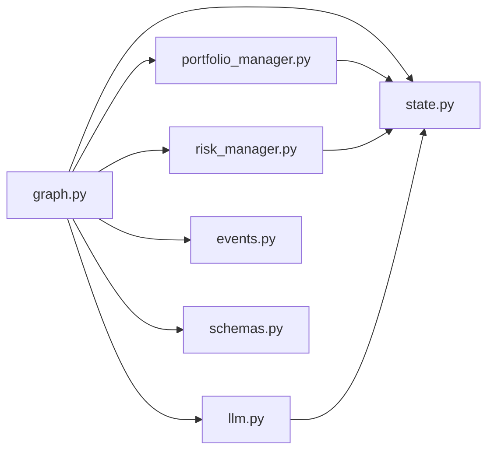

# 图服务

<cite>
**本文引用的文件**
- [app/backend/services/graph.py](file://app/backend/services/graph.py)
- [src/graph/state.py](file://src/graph/state.py)
- [app/backend/models/schemas.py](file://app/backend/models/schemas.py)
- [app/backend/models/events.py](file://app/backend/models/events.py)
- [src/main.py](file://src/main.py)
- [src/agents/portfolio_manager.py](file://src/agents/portfolio_manager.py)
- [src/agents/risk_manager.py](file://src/agents/risk_manager.py)
- [src/utils/display.py](file://src/utils/display.py)
- [src/utils/progress.py](file://src/utils/progress.py)
- [src/utils/visualize.py](file://src/utils/visualize.py)
- [src/utils/llm.py](file://src/utils/llm.py)
- [src/backtesting/engine.py](file://src/backtesting/engine.py)
- [app/backend/routes/flows.py](file://app/backend/routes/flows.py)
</cite>

## 目录
1. [简介](#简介)
2. [项目结构](#项目结构)
3. [核心组件](#核心组件)
4. [架构总览](#架构总览)
5. [详细组件分析](#详细组件分析)
6. [依赖分析](#依赖分析)
7. [性能考虑](#性能考虑)
8. [故障排查指南](#故障排查指南)
9. [结论](#结论)
10. [附录](#附录)

## 简介
本文件系统性阐述图服务（GraphService）在工作流编排中的核心作用与实现机制，重点覆盖以下方面：
- StateGraph 管理与运行时状态流转
- 图状态管理、节点连接与消息传递
- GraphService 与 AgentState 的交互协议、状态同步与事件处理
- 配置管理、图结构验证与动态修改机制
- 监控指标、性能分析与故障诊断方法
- 扩展、调试技巧与最佳实践

## 项目结构
后端以 FastAPI 提供 API，前端通过 React/TypeScript 构建可视化编辑器；核心工作流由 LangGraph 的 StateGraph 驱动，状态模型定义于共享模块，Agent 实现位于 src/agents 下，工具与可视化位于 src/utils。

**图表来源**
- [app/backend/services/graph.py:1-193](file://app/backend/services/graph.py#L1-L193)
- [src/graph/state.py:1-52](file://src/graph/state.py#L1-L52)
- [app/backend/models/schemas.py:1-292](file://app/backend/models/schemas.py#L1-L292)
- [app/backend/models/events.py:1-46](file://app/backend/models/events.py#L1-L46)
- [src/main.py:1-180](file://src/main.py#L1-L180)
- [src/agents/portfolio_manager.py:1-263](file://src/agents/portfolio_manager.py#L1-L263)
- [src/agents/risk_manager.py:1-318](file://src/agents/risk_manager.py#L1-L318)
- [src/utils/progress.py:1-117](file://src/utils/progress.py#L1-L117)
- [src/utils/llm.py:1-148](file://src/utils/llm.py#L1-L148)
- [src/utils/display.py:1-396](file://src/utils/display.py#L1-L396)
- [src/utils/visualize.py:1-9](file://src/utils/visualize.py#L1-L9)

**章节来源**
- [app/backend/services/graph.py:1-193](file://app/backend/services/graph.py#L1-L193)
- [src/graph/state.py:1-52](file://src/graph/state.py#L1-L52)
- [app/backend/models/schemas.py:1-292](file://app/backend/models/schemas.py#L1-L292)
- [app/backend/models/events.py:1-46](file://app/backend/models/events.py#L1-L46)
- [src/main.py:1-180](file://src/main.py#L1-L180)
- [src/agents/portfolio_manager.py:1-263](file://src/agents/portfolio_manager.py#L1-L263)
- [src/agents/risk_manager.py:1-318](file://src/agents/risk_manager.py#L1-L318)
- [src/utils/progress.py:1-117](file://src/utils/progress.py#L1-L117)
- [src/utils/llm.py:1-148](file://src/utils/llm.py#L1-L148)
- [src/utils/display.py:1-396](file://src/utils/display.py#L1-L396)
- [src/utils/visualize.py:1-9](file://src/utils/visualize.py#L1-L9)

## 核心组件
- 图服务与工作流编排：基于 LangGraph StateGraph，统一管理节点、边与状态流转，支持异步执行与同步包装。
- AgentState 状态模型：三段式结构 messages/data/metadata，支持消息合并与字典合并，作为所有 Agent 的共享状态载体。
- Agent 实现：风险管理者负责波动率与相关性分析并生成头寸限额信号；组合管理者聚合信号并生成交易决策。
- 配置与模型选择：通过请求模型提取每个节点的模型配置，支持按节点或基础键回退到全局配置。
- 事件与进度：Server-Sent Events 事件模型与进度跟踪器，用于实时反馈 Agent 状态与分析过程。
- 可视化与输出：Mermaid 导出图结构，控制台表格化输出结果。

**章节来源**
- [app/backend/services/graph.py:36-129](file://app/backend/services/graph.py#L36-L129)
- [src/graph/state.py:14-18](file://src/graph/state.py#L14-L18)
- [src/agents/risk_manager.py:11-219](file://src/agents/risk_manager.py#L11-L219)
- [src/agents/portfolio_manager.py:25-94](file://src/agents/portfolio_manager.py#L25-L94)
- [app/backend/models/schemas.py:76-91](file://app/backend/models/schemas.py#L76-L91)
- [app/backend/models/events.py:5-46](file://app/backend/models/events.py#L5-L46)
- [src/utils/visualize.py:5-9](file://src/utils/visualize.py#L5-L9)
- [src/utils/display.py:17-255](file://src/utils/display.py#L17-L255)

## 架构总览
下图展示从 API 到图服务、再到 Agent 的调用链路与状态传播路径。

**图表来源**
- [app/backend/routes/flows.py:18-174](file://app/backend/routes/flows.py#L18-L174)
- [app/backend/services/graph.py:36-129](file://app/backend/services/graph.py#L36-L129)
- [src/agents/risk_manager.py:11-219](file://src/agents/risk_manager.py#L11-L219)
- [src/agents/portfolio_manager.py:25-94](file://src/agents/portfolio_manager.py#L25-L94)
- [src/utils/llm.py:10-84](file://src/utils/llm.py#L10-L84)

## 详细组件分析

### 组件一：图服务与 StateGraph 管理
- 节点与边构建：根据前端传入的节点与边列表，过滤非代理节点，识别组合管理者节点，动态创建对应的风险管理者节点，并建立分析师→风险→组合管理者的路由。
- 入口与终止：显式设置入口节点为 start_node，并将组合管理者指向 END。
- 异步执行：提供异步包装函数，避免阻塞事件循环。
- 运行时输入：以 HumanMessage 初始化 messages，data 中注入 tickers、portfolio、时间窗口与空的 analyst_signals，metadata 注入模型名、提供商与请求对象。

**图表来源**
- [app/backend/services/graph.py:36-129](file://app/backend/services/graph.py#L36-L129)

**章节来源**
- [app/backend/services/graph.py:36-129](file://app/backend/services/graph.py#L36-L129)
- [app/backend/services/graph.py:141-177](file://app/backend/services/graph.py#L141-L177)

### 组件二：AgentState 状态模型与消息传递
- 结构设计：messages 支持消息拼接，data/metadata 支持字典合并，确保跨 Agent 的状态增量更新。
- 消息传递：风险管理者将分析结果写入 analyst_signals，组合管理者读取并生成最终决策消息，最终决策以 HumanMessage 形式追加至 messages。
- 显示与调试：提供 show_agent_reasoning 辅助打印可序列化输出，便于调试。

**图表来源**
- [src/graph/state.py:14-18](file://src/graph/state.py#L14-L18)
- [src/agents/risk_manager.py:205-219](file://src/agents/risk_manager.py#L205-L219)
- [src/agents/portfolio_manager.py:79-93](file://src/agents/portfolio_manager.py#L79-L93)

**章节来源**
- [src/graph/state.py:14-18](file://src/graph/state.py#L14-L18)
- [src/agents/risk_manager.py:205-219](file://src/agents/risk_manager.py#L205-L219)
- [src/agents/portfolio_manager.py:79-93](file://src/agents/portfolio_manager.py#L79-L93)

### 组件三：Agent 交互协议与状态同步
- 协议要点：
  - 风险管理者：读取 portfolio、tickers、日期范围，计算波动率与相关性，生成每个 ticker 的头寸限额与理由，写入 analyst_signals。
  - 组合管理者：汇总各分析师信号与头寸限制，结合允许动作集合，调用 LLM 生成最终决策，将决策以 HumanMessage 写入 messages。
- 同步与事件：
  - 进度通过 progress.update_status 实时更新，事件模型 events.py 定义 start/progress/error/complete 四类事件，可用于 SSE 推送。
  - CLI 与后端均可使用相同的 AgentState 与 Agent 实现，保证一致性。

**图表来源**
- [src/agents/risk_manager.py:11-219](file://src/agents/risk_manager.py#L11-L219)
- [src/agents/portfolio_manager.py:25-94](file://src/agents/portfolio_manager.py#L25-L94)
- [app/backend/models/events.py:16-46](file://app/backend/models/events.py#L16-L46)
- [src/utils/progress.py:44-64](file://src/utils/progress.py#L44-L64)

**章节来源**
- [src/agents/risk_manager.py:11-219](file://src/agents/risk_manager.py#L11-L219)
- [src/agents/portfolio_manager.py:25-94](file://src/agents/portfolio_manager.py#L25-L94)
- [app/backend/models/events.py:16-46](file://app/backend/models/events.py#L16-L46)
- [src/utils/progress.py:44-64](file://src/utils/progress.py#L44-L64)

### 组件四：配置管理、图结构验证与动态修改
- 配置提取：BaseHedgeFundRequest 提供 get_agent_model_config，支持按唯一节点 ID 或基础键匹配，优先使用节点级配置，否则回退到全局配置。
- 图结构验证：后端模型 GraphNode/GraphEdge 作为输入校验层，确保节点/边字段完整；前端编辑器负责拓扑合法性，后端在构建图时再次过滤非代理节点与非法边。
- 动态修改：后端提供 /flows 接口进行流程的增删改查与复制，支持模板化复用；运行时可通过更新请求中的 agent_models 与模型参数影响具体节点的模型选择。

**图表来源**
- [app/backend/models/schemas.py:72-91](file://app/backend/models/schemas.py#L72-L91)
- [app/backend/services/graph.py:15-32](file://app/backend/services/graph.py#L15-L32)

**章节来源**
- [app/backend/models/schemas.py:72-91](file://app/backend/models/schemas.py#L72-L91)
- [app/backend/services/graph.py:15-32](file://app/backend/services/graph.py#L15-L32)
- [app/backend/routes/flows.py:18-174](file://app/backend/routes/flows.py#L18-L174)

### 组件五：监控指标、性能分析与故障诊断
- 指标与输出：
  - 控制台表格化输出：display.py 提供多表输出，包括各股票的信号与决策、组合汇总与策略说明。
  - 回测引擎：engine.py 驱动逐日回测，计算净值曲线、暴露度、最大回撤、夏普/索提诺比率等指标。
- 故障诊断：
  - LLM 调用封装：llm.py 提供重试与默认回退，支持 JSON 模式与非 JSON 模式的结构化解析。
  - 进度与事件：progress.py 提供实时状态，events.py 提供标准事件类型，便于前端/外部系统订阅。
  - 可视化：visualize.py 导出图结构 PNG，辅助定位连接问题。

**章节来源**
- [src/utils/display.py:17-255](file://src/utils/display.py#L17-L255)
- [src/backtesting/engine.py:27-195](file://src/backtesting/engine.py#L27-L195)
- [src/utils/llm.py:10-84](file://src/utils/llm.py#L10-L84)
- [src/utils/progress.py:44-64](file://src/utils/progress.py#L44-L64)
- [app/backend/models/events.py:16-46](file://app/backend/models/events.py#L16-L46)
- [src/utils/visualize.py:5-9](file://src/utils/visualize.py#L5-L9)

## 依赖分析
- 组件耦合：
  - graph.py 对 Agent 实现与状态模型存在直接依赖；对 llm.py 的依赖集中在结构化输出与模型选择。
  - agents 之间通过 AgentState 的 analyst_signals 解耦，仅依赖数据结构约定。
- 外部依赖：
  - LangGraph StateGraph 作为核心运行时；LangChain Core 用于消息与提示模板；Rich 用于进度可视化；Pandas/Numpy 用于数据分析。

**图表来源**
- [app/backend/services/graph.py:1-12](file://app/backend/services/graph.py#L1-L12)
- [src/agents/portfolio_manager.py:1-11](file://src/agents/portfolio_manager.py#L1-L11)
- [src/agents/risk_manager.py:1-11](file://src/agents/risk_manager.py#L1-L11)
- [src/utils/llm.py:1-8](file://src/utils/llm.py#L1-L8)
- [app/backend/models/events.py:1-14](file://app/backend/models/events.py#L1-L14)
- [app/backend/models/schemas.py:1-7](file://app/backend/models/schemas.py#L1-L7)

**章节来源**
- [app/backend/services/graph.py:1-12](file://app/backend/services/graph.py#L1-L12)
- [src/agents/portfolio_manager.py:1-11](file://src/agents/portfolio_manager.py#L1-L11)
- [src/agents/risk_manager.py:1-11](file://src/agents/risk_manager.py#L1-L11)
- [src/utils/llm.py:1-8](file://src/utils/llm.py#L1-L8)
- [app/backend/models/events.py:1-14](file://app/backend/models/events.py#L1-L14)
- [app/backend/models/schemas.py:1-7](file://app/backend/models/schemas.py#L1-L7)

## 性能考虑
- 并发与阻塞：run_graph_async 使用线程池执行同步调用，避免阻塞事件循环；建议在高并发场景下合理配置线程池大小。
- 数据预取：回测引擎在运行前预取价格与因子数据，减少运行时 IO 延迟。
- 输出与可视化：Mermaid 导出与 Rich 表格渲染开销可控，建议在生产环境关闭冗余调试输出。
- LLM 调用：结构化输出与重试策略降低失败成本，但需关注令牌与速率限制。

## 故障排查指南
- JSON 解析错误：parse_hedge_fund_response 与 llm.py 的 JSON 提取均提供错误捕获与回退，检查响应内容与模型 JSON 模式支持。
- Agent 状态异常：通过 show_agent_reasoning 与 progress 更新状态定位卡点；确认 analyst_signals 是否正确写入。
- 模型配置不生效：核对请求中 agent_models 与节点 ID/基础键匹配逻辑，确保回退到全局配置。
- 连接断开：使用 visualize 导出图结构，检查边是否按预期从分析师→风险→组合管理者。

**章节来源**
- [app/backend/services/graph.py:180-193](file://app/backend/services/graph.py#L180-L193)
- [src/utils/llm.py:109-121](file://src/utils/llm.py#L109-L121)
- [src/graph/state.py:21-52](file://src/graph/state.py#L21-L52)
- [src/utils/progress.py:44-64](file://src/utils/progress.py#L44-L64)
- [src/utils/visualize.py:5-9](file://src/utils/visualize.py#L5-L9)

## 结论
图服务以 StateGraph 为核心，通过 AgentState 在多智能体间传递状态与信号，形成“分析师→风险→组合管理”的稳健工作流。借助统一的配置提取、事件与进度体系以及可视化与回测能力，系统在可扩展性、可观测性与可维护性上具备良好基础。建议在生产环境中强化并发与缓存策略，完善监控告警与事件订阅机制。

## 附录
- 最佳实践
  - 保持 AgentState 字段最小化，仅传递必要数据；通过 metadata 注入运行时配置。
  - 为每个节点实现稳定的默认回退与错误处理，避免单点失败导致整个流程中断。
  - 使用 visualize 导出图结构进行联调，确保边与入口/终止点符合预期。
  - 在高负载场景下启用 run_graph_async 并配合限流与重试策略。
- 扩展建议
  - 新增 Agent：遵循 AgentState 约定，仅读写所需字段；在 graph.py 中注册节点与边。
  - 自定义模型：通过 get_agent_model_config 与 llm.py 的结构化输出适配新模型。
  - 事件集成：在 progress 回调中推送 events，前端使用 SSE 订阅实时状态。