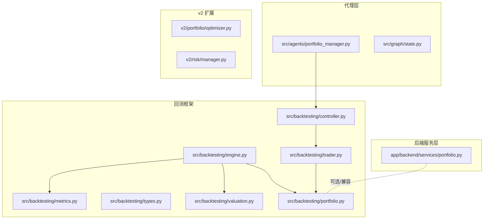
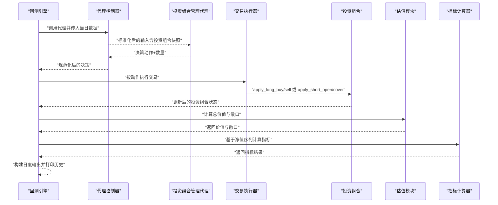
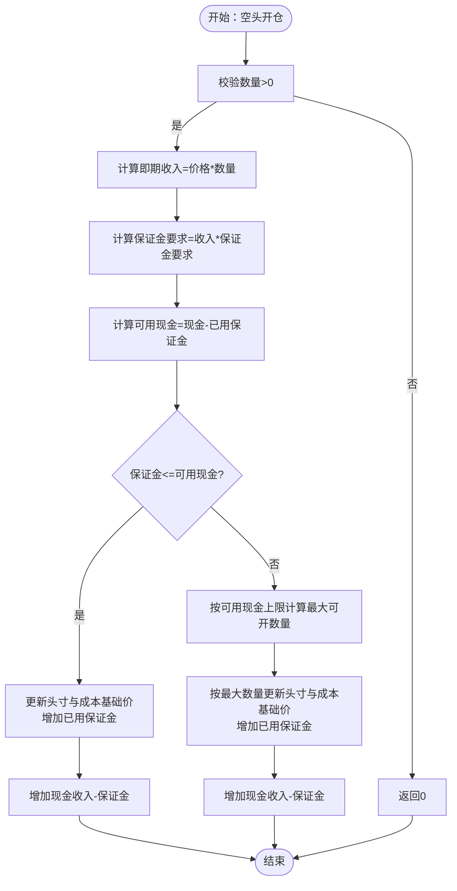
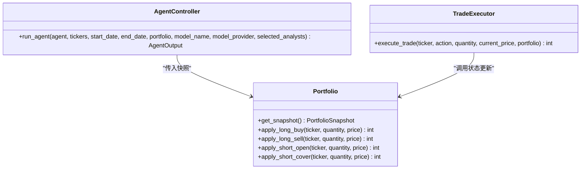
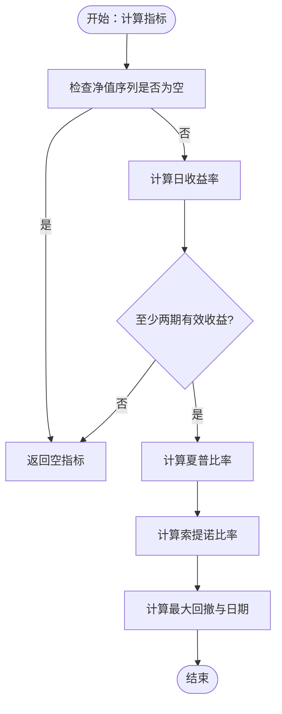
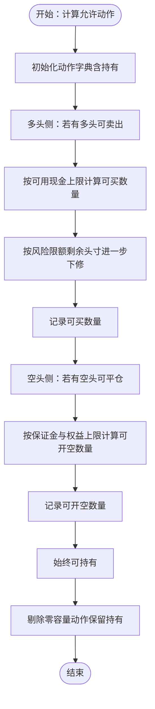
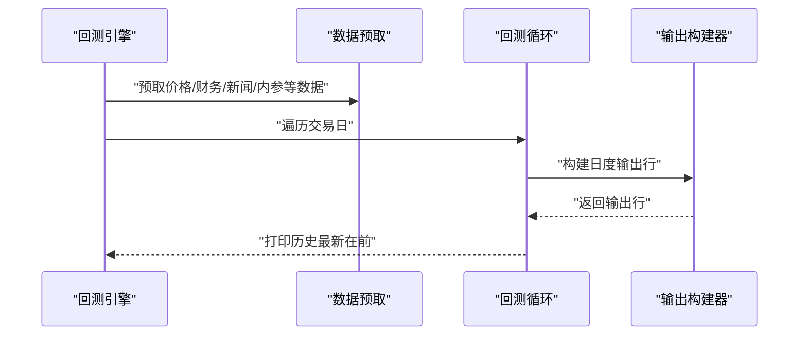
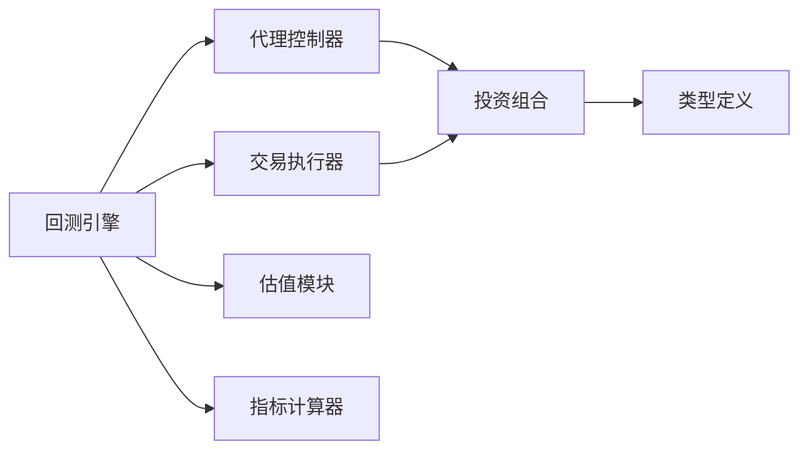

# 投资组合服务

<cite>
**本文引用的文件**
- [app/backend/services/portfolio.py](file://app/backend/services/portfolio.py)
- [src/backtesting/portfolio.py](file://src/backtesting/portfolio.py)
- [src/backtesting/types.py](file://src/backtesting/types.py)
- [src/backtesting/engine.py](file://src/backtesting/engine.py)
- [src/backtesting/controller.py](file://src/backtesting/controller.py)
- [src/backtesting/trader.py](file://src/backtesting/trader.py)
- [src/backtesting/valuation.py](file://src/backtesting/valuation.py)
- [src/backtesting/metrics.py](file://src/backtesting/metrics.py)
- [src/agents/portfolio_manager.py](file://src/agents/portfolio_manager.py)
- [src/graph/state.py](file://src/graph/state.py)
- [v2/portfolio/optimizer.py](file://v2/portfolio/optimizer.py)
- [v2/risk/manager.py](file://v2/risk/manager.py)
- [tests/backtesting/test_portfolio.py](file://tests/backtesting/test_portfolio.py)
</cite>

## 目录
1. [简介](#简介)
2. [项目结构](#项目结构)
3. [核心组件](#核心组件)
4. [架构总览](#架构总览)
5. [详细组件分析](#详细组件分析)
6. [依赖分析](#依赖分析)
7. [性能考虑](#性能考虑)
8. [故障排除指南](#故障排除指南)
9. [结论](#结论)
10. [附录](#附录)

## 简介
本文件系统性梳理并说明投资组合服务（PortfolioService）在该代码库中的实现与使用方式，重点覆盖以下方面：
- 投资组合管理功能：支持多标的、多方向（多头/空头）持仓、成本基础价与已实现损益跟踪、保证金占用与维持机制。
- 资产配置机制：通过代理决策生成器结合风险约束，确定可下单动作与数量；支持基于保证金限制的空头仓位扩展能力。
- 持仓管理、资金控制与风险指标计算：在回测引擎中统一执行交易、估值与风险指标计算。
- 与风险管理系统、交易执行引擎的协作关系：代理控制器规范化输出，交易执行器按动作执行，估值模块计算总值与敞口，指标计算器产出夏普/索提诺/最大回撤等指标。
- 配置参数、实时监控与历史回放：引擎初始化参数、每日输出与历史回放打印。
- 测试策略、数据验证与异常处理：单元测试覆盖、输入校验与容错、异常捕获与降级。
- 开发者指南：开发要点、性能优化建议与故障排除方法。

## 项目结构
围绕投资组合服务的关键目录与文件如下：
- 后端服务层：提供基础投资组合字典结构与初始化逻辑。
- 回测框架：封装投资组合状态、交易执行、估值与指标计算。
- 代理层：生成交易决策，结合风险约束与当前投资组合状态。
- v2 优化与风控：提供优化器与风险模块的占位说明，便于后续扩展。

图表来源
- [app/backend/services/portfolio.py:1-52](file://app/backend/services/portfolio.py#L1-L52)
- [src/backtesting/portfolio.py:1-196](file://src/backtesting/portfolio.py#L1-L196)
- [src/backtesting/types.py:1-106](file://src/backtesting/types.py#L1-L106)
- [src/backtesting/engine.py:1-195](file://src/backtesting/engine.py#L1-L195)
- [src/backtesting/controller.py:1-68](file://src/backtesting/controller.py#L1-L68)
- [src/backtesting/trader.py:1-40](file://src/backtesting/trader.py#L1-L40)
- [src/backtesting/valuation.py:1-83](file://src/backtesting/valuation.py#L1-L83)
- [src/backtesting/metrics.py:1-78](file://src/backtesting/metrics.py#L1-L78)
- [src/agents/portfolio_manager.py:1-263](file://src/agents/portfolio_manager.py#L1-L263)
- [src/graph/state.py:1-52](file://src/graph/state.py#L1-L52)
- [v2/portfolio/optimizer.py:1-6](file://v2/portfolio/optimizer.py#L1-L6)
- [v2/risk/manager.py:1-6](file://v2/risk/manager.py#L1-L6)

章节来源
- [app/backend/services/portfolio.py:1-52](file://app/backend/services/portfolio.py#L1-L52)
- [src/backtesting/portfolio.py:1-196](file://src/backtesting/portfolio.py#L1-L196)
- [src/backtesting/types.py:1-106](file://src/backtesting/types.py#L1-L106)
- [src/backtesting/engine.py:1-195](file://src/backtesting/engine.py#L1-L195)
- [src/backtesting/controller.py:1-68](file://src/backtesting/controller.py#L1-L68)
- [src/backtesting/trader.py:1-40](file://src/backtesting/trader.py#L1-L40)
- [src/backtesting/valuation.py:1-83](file://src/backtesting/valuation.py#L1-L83)
- [src/backtesting/metrics.py:1-78](file://src/backtesting/metrics.py#L1-L78)
- [src/agents/portfolio_manager.py:1-263](file://src/agents/portfolio_manager.py#L1-L263)
- [src/graph/state.py:1-52](file://src/graph/state.py#L1-L52)
- [v2/portfolio/optimizer.py:1-6](file://v2/portfolio/optimizer.py#L1-L6)
- [v2/risk/manager.py:1-6](file://v2/risk/manager.py#L1-L6)

## 核心组件
- 投资组合数据结构与初始化
  - 后端服务层提供字典形式的初始投资组合结构，包含现金、保证金要求、已用保证金、各标的多/空头寸、成本基础价与已实现损益等字段，并支持从已有头寸列表进行初始化填充。
  - 回测框架提供类封装的投资组合状态，包含相同关键字段与快照导出接口，便于在回测循环中安全读取与更新。
- 交易执行器
  - 将动作（买入/卖出/做空/平仓/持有）映射到投资组合状态变更函数，严格遵循价格、可用资金/保证金与头寸限制。
- 代理控制器
  - 规范化代理输出，确保动作枚举与数量类型一致，避免空值或非法值进入执行阶段。
- 估值与风险指标
  - 计算总价值、多/空敞口、总/净敞口与长/短比率；基于净值曲线计算夏普/索提诺比与最大回撤等指标。
- 代理决策生成器
  - 基于分析师信号与风险约束（如剩余头寸限额、当前价格、保证金要求），计算允许动作与最大数量，再由LLM生成最终决策。

章节来源
- [app/backend/services/portfolio.py:6-52](file://app/backend/services/portfolio.py#L6-L52)
- [src/backtesting/portfolio.py:9-196](file://src/backtesting/portfolio.py#L9-L196)
- [src/backtesting/trader.py:7-40](file://src/backtesting/trader.py#L7-L40)
- [src/backtesting/controller.py:9-68](file://src/backtesting/controller.py#L9-L68)
- [src/backtesting/valuation.py:8-83](file://src/backtesting/valuation.py#L8-L83)
- [src/backtesting/metrics.py:8-78](file://src/backtesting/metrics.py#L8-L78)
- [src/agents/portfolio_manager.py:24-263](file://src/agents/portfolio_manager.py#L24-L263)

## 架构总览
投资组合服务在回测引擎中承担“状态容器+交易执行”的双重职责，配合代理控制器与交易执行器完成从决策到执行再到估值与指标的闭环。

图表来源
- [src/backtesting/engine.py:96-195](file://src/backtesting/engine.py#L96-L195)
- [src/backtesting/controller.py:12-68](file://src/backtesting/controller.py#L12-L68)
- [src/agents/portfolio_manager.py:25-94](file://src/agents/portfolio_manager.py#L25-L94)
- [src/backtesting/trader.py:10-38](file://src/backtesting/trader.py#L10-L38)
- [src/backtesting/portfolio.py:82-195](file://src/backtesting/portfolio.py#L82-L195)
- [src/backtesting/valuation.py:8-51](file://src/backtesting/valuation.py#L8-L51)
- [src/backtesting/metrics.py:22-78](file://src/backtesting/metrics.py#L22-L78)

## 详细组件分析

### 组件A：投资组合状态与交易执行（回测框架）
- 数据结构
  - 投资组合快照包含现金、已用保证金、保证金要求、各标的多/空头寸、成本基础价与已实现损益。
  - 提供快照导出、只读访问与内部状态更新方法。
- 交易执行逻辑
  - 多头买入：检查可用现金是否足以覆盖成本，按加权平均法更新成本基础价与头寸。
  - 多头卖出：按当前头寸与平均成本计算已实现损益，更新现金与头寸。
  - 空头开仓：按保证金要求占用现金，记录已用保证金与头寸，支持按可用保证金上限执行。
  - 空头平仓：按比例释放已用保证金，计算已实现损益，更新现金与头寸。
- 关键流程图（以空头开仓为例）

图表来源
- [src/backtesting/portfolio.py:128-170](file://src/backtesting/portfolio.py#L128-L170)

章节来源
- [src/backtesting/portfolio.py:9-196](file://src/backtesting/portfolio.py#L9-L196)
- [src/backtesting/types.py:21-50](file://src/backtesting/types.py#L21-L50)

### 组件B：代理控制器与交易执行器
- 代理控制器
  - 将投资组合对象转换为快照字典，规范化代理输出的动作与数量，确保类型与枚举合法。
- 交易执行器
  - 将字符串动作映射为枚举，调用对应的投资组合状态更新方法，返回实际成交数量。

图表来源
- [src/backtesting/controller.py:9-68](file://src/backtesting/controller.py#L9-L68)
- [src/backtesting/trader.py:7-40](file://src/backtesting/trader.py#L7-L40)
- [src/backtesting/portfolio.py:44-195](file://src/backtesting/portfolio.py#L44-L195)

章节来源
- [src/backtesting/controller.py:12-68](file://src/backtesting/controller.py#L12-L68)
- [src/backtesting/trader.py:10-38](file://src/backtesting/trader.py#L10-L38)

### 组件C：估值与风险指标
- 总价值计算
  - 现金 + 多头市值 - 空头市值。
- 敞口计算
  - 多头/空头/总/净敞口与长/短比率。
- 指标计算
  - 基于日度净值序列计算日收益、超额收益、波动率、下行波动与指标值，同时识别最大回撤及其日期。

图表来源
- [src/backtesting/metrics.py:22-78](file://src/backtesting/metrics.py#L22-L78)

章节来源
- [src/backtesting/valuation.py:8-83](file://src/backtesting/valuation.py#L8-L83)
- [src/backtesting/metrics.py:8-78](file://src/backtesting/metrics.py#L8-L78)

### 组件D：代理决策生成器（投资组合管理）
- 功能概述
  - 从代理信号压缩为紧凑格式，结合风险约束（剩余头寸限额、当前价格、保证金要求、已用保证金）计算允许动作与最大数量。
  - 对无交易能力的标的预填“持有”，对可交易标的将信号与允许动作传递给LLM，最终合并输出。
- 允许动作与数量计算流程

图表来源
- [src/agents/portfolio_manager.py:96-157](file://src/agents/portfolio_manager.py#L96-L157)

章节来源
- [src/agents/portfolio_manager.py:24-263](file://src/agents/portfolio_manager.py#L24-L263)

### 组件E：回测引擎（配置、监控与历史回放）
- 初始化参数
  - 代理、标的列表、起止日期、初始资本、模型名称与提供商、分析师选择、初始保证金要求。
- 运行流程
  - 预取数据、逐交易日运行、代理决策、执行交易、估值与敞口、构建日度输出、打印历史、更新指标。
- 输出与监控
  - 每日输出包含决策、成交、价格、头寸、净值与指标；历史回放在控制台打印最新一天在前。

图表来源
- [src/backtesting/engine.py:81-195](file://src/backtesting/engine.py#L81-L195)

章节来源
- [src/backtesting/engine.py:27-195](file://src/backtesting/engine.py#L27-L195)

### 组件F：后端服务层（兼容与初始化）
- 字典式投资组合初始化
  - 支持从已有头寸列表填充初始状态，计算空头保证金占用与已用保证金累计。

章节来源
- [app/backend/services/portfolio.py:6-52](file://app/backend/services/portfolio.py#L6-L52)

## 依赖分析
- 组件耦合
  - 回测引擎依赖代理控制器、交易执行器、估值模块与指标计算器，形成清晰的分层。
  - 代理控制器与交易执行器均依赖投资组合状态，形成强耦合但职责明确。
- 外部依赖
  - 引擎通过工具模块获取价格、财务、新闻与内参数据，用于代理决策与基准比较。
- 潜在环路
  - 当前结构为单向依赖，未见循环依赖。

图表来源
- [src/backtesting/engine.py:9-16](file://src/backtesting/engine.py#L9-L16)
- [src/backtesting/controller.py:5-6](file://src/backtesting/controller.py#L5-L6)
- [src/backtesting/trader.py:3-4](file://src/backtesting/trader.py#L3-L4)
- [src/backtesting/valuation.py:5](file://src/backtesting/valuation.py#L5)
- [src/backtesting/metrics.py:5](file://src/backtesting/metrics.py#L5)
- [src/backtesting/types.py:4-5](file://src/backtesting/types.py#L4-L5)

章节来源
- [src/backtesting/engine.py:18-24](file://src/backtesting/engine.py#L18-L24)
- [src/backtesting/controller.py:12-68](file://src/backtesting/controller.py#L12-L68)
- [src/backtesting/trader.py:10-38](file://src/backtesting/trader.py#L10-L38)
- [src/backtesting/valuation.py:8-51](file://src/backtesting/valuation.py#L8-L51)
- [src/backtesting/metrics.py:22-78](file://src/backtesting/metrics.py#L22-L78)
- [src/backtesting/types.py:21-50](file://src/backtesting/types.py#L21-L50)

## 性能考虑
- 交易执行路径
  - 在执行器中对动作进行枚举校验与数量归一，减少后续分支判断开销。
- 估值与指标
  - 指标计算使用向量化操作（pandas/numpy），注意数据长度与空序列保护。
- 内存与拷贝
  - 快照导出采用浅拷贝副本，避免直接修改内部状态；在高频回测中应关注拷贝成本。
- I/O 与缓存
  - 数据预取在引擎启动时进行，减少回测过程中的I/O等待；可结合外部缓存策略进一步优化。

## 故障排除指南
- 输入校验与异常处理
  - 代理控制器对动作与数量进行类型与枚举校验，非法值回退为持有；交易执行器对未知动作返回0。
  - 回测引擎在获取价格数据失败时跳过当日，避免中断整个回测流程。
- 默认行为与降级
  - 代理决策生成器在LLM失败时提供默认“持有”决策，保证系统稳定。
- 单元测试
  - 投资组合相关测试覆盖状态更新、成交数量与已实现损益等关键路径，建议在新增功能时同步补充测试。

章节来源
- [src/backtesting/controller.py:40-65](file://src/backtesting/controller.py#L40-L65)
- [src/backtesting/trader.py:18-37](file://src/backtesting/trader.py#L18-L37)
- [src/backtesting/engine.py:114-131](file://src/backtesting/engine.py#L114-L131)
- [src/agents/portfolio_manager.py:241-257](file://src/agents/portfolio_manager.py#L241-L257)
- [tests/backtesting/test_portfolio.py](file://tests/backtesting/test_portfolio.py)

## 结论
该投资组合服务以“字典结构（后端服务层）+ 类封装（回测框架）”双形态实现，既满足快速初始化与兼容需求，又提供严谨的状态管理与交易执行。通过代理控制器与交易执行器解耦决策与执行，配合估值与指标模块完成闭环评估。v2 层的优化与风控模块为未来扩展提供了清晰路径。建议在生产环境中强化输入校验、完善异常处理与测试覆盖，并结合缓存与批量化数据获取提升性能。

## 附录
- 配置参数清单（回测引擎）
  - 代理、标的列表、起止日期、初始资本、模型名称与提供商、分析师选择、初始保证金要求。
- 实时监控与历史回放
  - 每日输出包含决策、成交、价格、头寸、净值与指标；历史回放在控制台打印最新一天在前。
- v2 扩展
  - 优化器与风险模块提供占位说明，便于后续集成均值-方差、黑-拉特曼、风险平价等策略与波动率头寸规模、相关性暴露上限、尾部风险与压力测试等风控能力。

章节来源
- [src/backtesting/engine.py:35-80](file://src/backtesting/engine.py#L35-L80)
- [src/backtesting/engine.py:166-181](file://src/backtesting/engine.py#L166-L181)
- [v2/portfolio/optimizer.py:1-6](file://v2/portfolio/optimizer.py#L1-L6)
- [v2/risk/manager.py:1-6](file://v2/risk/manager.py#L1-L6)