# 智能体服务

<cite>
**本文引用的文件**
- [agent_service.py](file://app/backend/services/agent_service.py)
- [graph.py](file://app/backend/services/graph.py)
- [state.py](file://src/graph/state.py)
- [portfolio_manager.py](file://src/agents/portfolio_manager.py)
- [risk_manager.py](file://src/agents/risk_manager.py)
- [fundamentals.py](file://src/agents/fundamentals.py)
- [technicals.py](file://src/agents/technicals.py)
- [analysts.py](file://src/utils/analysts.py)
- [progress.py](file://src/utils/progress.py)
- [llm.py](file://src/utils/llm.py)
- [backtest_service.py](file://app/backend/services/backtest_service.py)
- [flows.py](file://app/backend/routes/flows.py)
</cite>

## 目录
1. [简介](#简介)
2. [项目结构](#项目结构)
3. [核心组件](#核心组件)
4. [架构总览](#架构总览)
5. [组件详解](#组件详解)
6. [依赖关系分析](#依赖关系分析)
7. [性能考量](#性能考量)
8. [故障排查指南](#故障排查指南)
9. [结论](#结论)
10. [附录](#附录)

## 简介
本文件系统性阐述智能体服务的设计与实现，重点覆盖以下方面：
- AgentService 的设计原则与职责边界
- 智能体函数包装机制：create_agent_function 如何将通用智能体函数转换为 LangGraph 可调用形式
- 智能体 ID 管理策略、函数偏置化（偏函数）与状态传递机制
- 扩展接口、新增智能体流程与性能优化策略
- 测试方法、Mock 集成与调试技巧
- 开发者最佳实践：智能体开发、状态管理与错误处理

## 项目结构
智能体服务位于后端服务层，围绕 LangGraph 工作流组织，通过统一的状态结构 AgentState 在节点间传递数据，并通过 create_agent_function 将“通用智能体函数”偏置化为“带 agent_id 的可调用函数”。分析师配置集中于 ANALYST_CONFIG，支持动态注册与批量构建图。

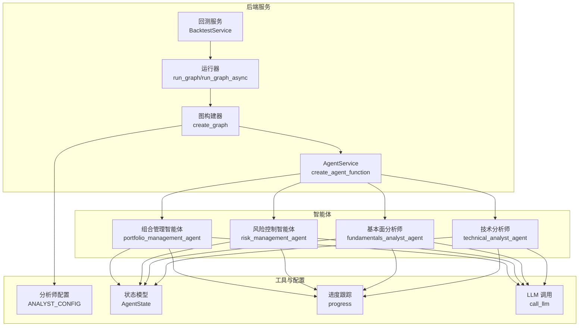

**图表来源**
- [graph.py:36-129](file://app/backend/services/graph.py#L36-L129)
- [agent_service.py:5-12](file://app/backend/services/agent_service.py#L5-L12)
- [analysts.py:24-178](file://src/utils/analysts.py#L24-L178)
- [state.py:15-18](file://src/graph/state.py#L15-L18)
- [portfolio_manager.py:25-93](file://src/agents/portfolio_manager.py#L25-L93)
- [risk_manager.py:11-219](file://src/agents/risk_manager.py#L11-L219)
- [fundamentals.py:11-163](file://src/agents/fundamentals.py#L11-L163)
- [technicals.py:35-157](file://src/agents/technicals.py#L35-L157)
- [progress.py:12-117](file://src/utils/progress.py#L12-L117)
- [llm.py:10-148](file://src/utils/llm.py#L10-L148)
- [backtest_service.py:18-58](file://app/backend/services/backtest_service.py#L18-L58)

**章节来源**
- [graph.py:36-129](file://app/backend/services/graph.py#L36-L129)
- [agent_service.py:5-12](file://app/backend/services/agent_service.py#L5-L12)
- [analysts.py:24-178](file://src/utils/analysts.py#L24-L178)
- [state.py:15-18](file://src/graph/state.py#L15-L18)

## 核心组件
- AgentService（函数包装器）
  - 提供 create_agent_function，将任意 agent_function(state, agent_id=...) 包装为 LangGraph 可直接调用的函数，固定注入 agent_id，简化图节点定义。
- 图构建器（Graph Builder）
  - 基于前端传入的节点与边，结合 ANALYST_CONFIG 动态生成 StateGraph，自动连接分析师、风险控制与组合管理节点，并注入唯一 agent_id。
- 状态模型（AgentState）
  - 统一的消息、数据与元信息容器，支持合并与序列化，确保跨节点状态一致性。
- 智能体实现
  - 组合管理、风险控制、技术/基本面等多类智能体，均遵循统一签名与状态写入规范。
- 运行器（Runner）
  - 同步/异步执行图，构造初始状态并返回最终结果；提供解析响应的辅助函数。
- 回测服务（BacktestService）
  - 封装回测流程，按交易日循环调用图并执行交易，计算收益与风险指标。

**章节来源**
- [agent_service.py:5-12](file://app/backend/services/agent_service.py#L5-L12)
- [graph.py:36-129](file://app/backend/services/graph.py#L36-L129)
- [state.py:15-18](file://src/graph/state.py#L15-L18)
- [portfolio_manager.py:25-93](file://src/agents/portfolio_manager.py#L25-L93)
- [risk_manager.py:11-219](file://src/agents/risk_manager.py#L11-L219)
- [backtest_service.py:18-58](file://app/backend/services/backtest_service.py#L18-L58)

## 架构总览
智能体服务采用“配置驱动 + 函数包装 + 图编排”的分层架构：
- 配置层：ANALYST_CONFIG 定义可用智能体清单与顺序
- 包装层：create_agent_function 将通用智能体函数偏置化
- 编排层：create_graph 根据节点/边构建 StateGraph 并设置入口点
- 执行层：run_graph/run_graph_async 执行图并返回结果
- 输出层：parse_hedge_fund_response 解析最终决策消息

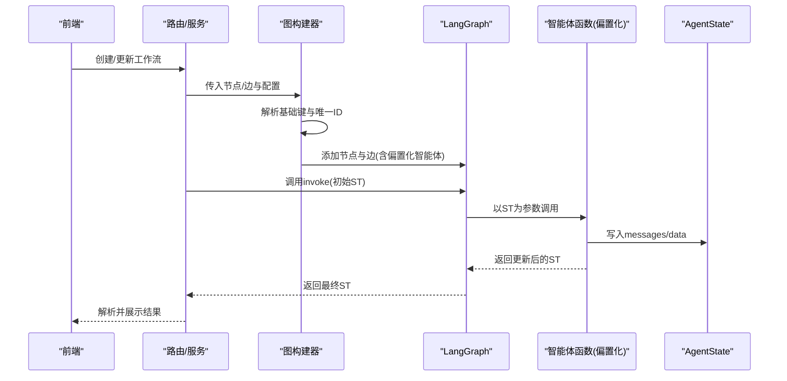

**图表来源**
- [graph.py:36-129](file://app/backend/services/graph.py#L36-L129)
- [agent_service.py:5-12](file://app/backend/services/agent_service.py#L5-L12)
- [state.py:15-18](file://src/graph/state.py#L15-L18)

**章节来源**
- [graph.py:36-129](file://app/backend/services/graph.py#L36-L129)
- [agent_service.py:5-12](file://app/backend/services/agent_service.py#L5-L12)
- [state.py:15-18](file://src/graph/state.py#L15-L18)

## 组件详解

### AgentService 设计与 create_agent_function
- 设计原则
  - 低耦合：仅负责函数包装，不关心具体业务逻辑
  - 可复用：对任意符合签名的智能体函数均可包装
  - 易扩展：通过 ANALYST_CONFIG 注册新智能体，无需修改图构建逻辑
- 实现要点
  - 使用 functools.partial 固定 agent_id 参数，使智能体函数在 LangGraph 调用时只需接收 AgentState
  - LangGraph 节点调用约定：函数签名需接受 AgentState 并返回 dict，包含 messages 与 data 字段
- 与图构建器协作
  - 图构建器在遍历节点时，根据基础键从 ANALYST_CONFIG 获取对应智能体函数，再经 create_agent_function 包装后注册为节点

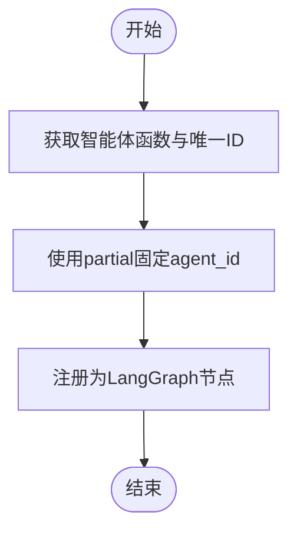

**图表来源**
- [agent_service.py:5-12](file://app/backend/services/agent_service.py#L5-L12)
- [graph.py:64-66](file://app/backend/services/graph.py#L64-L66)

**章节来源**
- [agent_service.py:5-12](file://app/backend/services/agent_service.py#L5-L12)
- [graph.py:64-66](file://app/backend/services/graph.py#L64-L66)

### 智能体 ID 管理与唯一性
- 唯一性规则
  - 节点 ID 形如 “{基础键}_{6位随机后缀}”，用于区分同一类型的不同实例
  - 基础键由 ANALYST_CONFIG 中的键决定；组合管理器节点以 “portfolio_manager” 作为基础键
- 解析与映射
  - extract_base_agent_key 从唯一 ID 中提取基础键，用于匹配 ANALYST_CONFIG
  - 对组合管理器，为其动态创建对应的 “risk_management_agent_{suffix}” 风控节点
- 作用域隔离
  - 不同实例共享同一智能体函数，但通过 agent_id 区分状态与输出名称，避免冲突

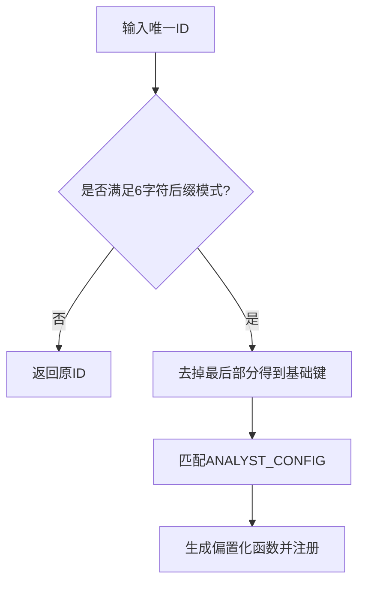

**图表来源**
- [graph.py:15-32](file://app/backend/services/graph.py#L15-L32)
- [graph.py:64-81](file://app/backend/services/graph.py#L64-L81)

**章节来源**
- [graph.py:15-32](file://app/backend/services/graph.py#L15-L32)
- [graph.py:64-81](file://app/backend/services/graph.py#L64-L81)

### 函数偏置化与状态传递机制
- 偏置化流程
  - create_agent_function(agent_function, agent_id) → partial(agent_function, agent_id=...)
  - LangGraph 调用时仅传入 AgentState，内部自动注入 agent_id
- 状态结构
  - AgentState 包含 messages、data、metadata 三部分，使用 operator.add 合并消息，merge_dicts 合并字典
  - 智能体在处理完成后返回包含 messages 与 data 的字典，LangGraph 自动合并到全局状态
- 典型写法
  - 组合管理器将决策封装为 HumanMessage，name 字段为 agent_id，便于后续解析与可视化
  - 风控/分析师智能体将信号写入 state["data"]["analyst_signals"][agent_id]，供组合管理器聚合

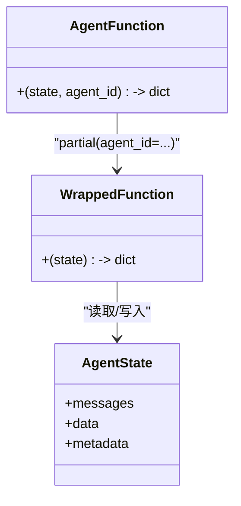

**图表来源**
- [state.py:15-18](file://src/graph/state.py#L15-L18)
- [agent_service.py:5-12](file://app/backend/services/agent_service.py#L5-L12)
- [portfolio_manager.py:79-93](file://src/agents/portfolio_manager.py#L79-L93)
- [risk_manager.py:205-219](file://src/agents/risk_manager.py#L205-L219)

**章节来源**
- [state.py:15-18](file://src/graph/state.py#L15-L18)
- [agent_service.py:5-12](file://app/backend/services/agent_service.py#L5-L12)
- [portfolio_manager.py:79-93](file://src/agents/portfolio_manager.py#L79-L93)
- [risk_manager.py:205-219](file://src/agents/risk_manager.py#L205-L219)

### 智能体函数包装与 LangGraph 可调用性
- 签名约定
  - 输入：AgentState
  - 输出：dict，包含 "messages" 与 "data"
- 包装策略
  - create_agent_function 将 agent_id 固定注入，避免在节点定义中重复传参
- 调用链路
  - 图构建器注册节点时，传入包装后的函数；LangGraph 在每轮迭代中调用该函数并合并返回值

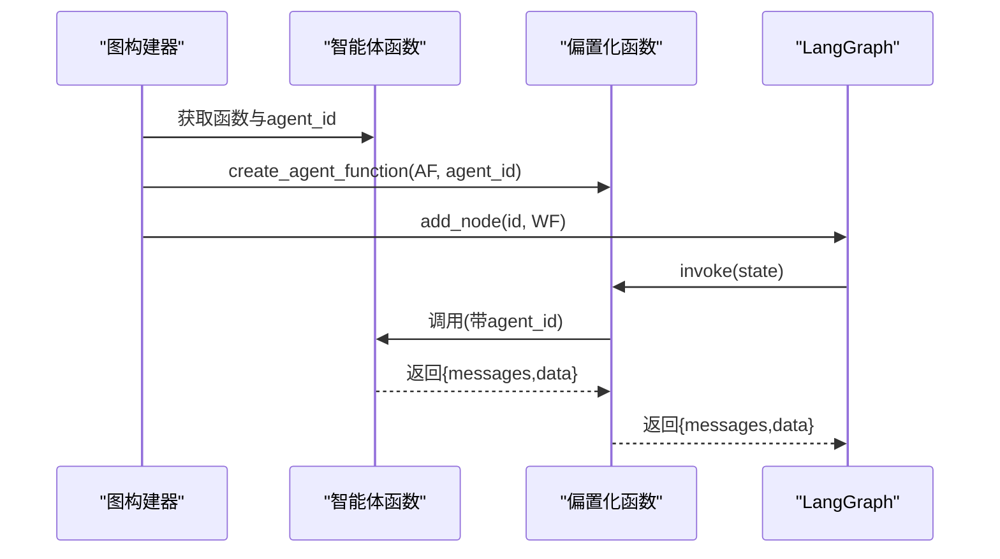

**图表来源**
- [agent_service.py:5-12](file://app/backend/services/agent_service.py#L5-L12)
- [graph.py:64-66](file://app/backend/services/graph.py#L64-L66)

**章节来源**
- [agent_service.py:5-12](file://app/backend/services/agent_service.py#L5-L12)
- [graph.py:64-66](file://app/backend/services/graph.py#L64-L66)

### 组合管理智能体与风控智能体
- 组合管理智能体
  - 聚合各分析师信号与风控限制，生成多标的交易决策
  - 通过 call_llm 结构化输出，结合预填充“持有”决策减少 LLM 负担
  - 将决策封装为 HumanMessage，name 为 agent_id，便于调试与展示
- 风控智能体
  - 计算波动率与相关性调整后的头寸上限，写入 analyst_signals
  - 支持活跃头寸识别与总净值估算，输出详细推理信息

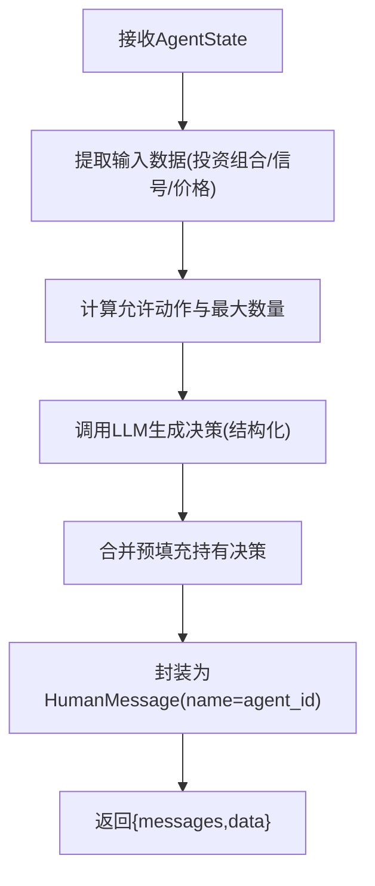

**图表来源**
- [portfolio_manager.py:177-263](file://src/agents/portfolio_manager.py#L177-L263)
- [llm.py:10-84](file://src/utils/llm.py#L10-L84)

**章节来源**
- [portfolio_manager.py:25-93](file://src/agents/portfolio_manager.py#L25-L93)
- [portfolio_manager.py:177-263](file://src/agents/portfolio_manager.py#L177-L263)
- [risk_manager.py:11-219](file://src/agents/risk_manager.py#L11-L219)
- [llm.py:10-84](file://src/utils/llm.py#L10-L84)

### 分析师智能体（示例：技术/基本面）
- 技术分析师
  - 多策略加权融合趋势、均值回归、动量、波动率与统计套利信号
  - 输出每个策略的信号与置信度，并汇总为最终信号
- 基本面分析师
  - 基于财务指标评分（盈利能力、成长性、健康状况、估值比率）
  - 计算总体信号与置信度，并记录详细理由

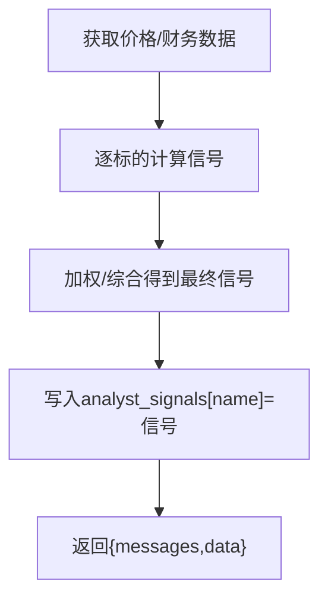

**图表来源**
- [technicals.py:35-157](file://src/agents/technicals.py#L35-L157)
- [fundamentals.py:11-163](file://src/agents/fundamentals.py#L11-L163)

**章节来源**
- [technicals.py:35-157](file://src/agents/technicals.py#L35-L157)
- [fundamentals.py:11-163](file://src/agents/fundamentals.py#L11-L163)

### 图构建与运行流程
- 图构建
  - 从 ANALYST_CONFIG 获取节点与函数映射
  - 依据节点/边关系建立连接，特殊处理组合管理器与风控节点的配对
  - 设置入口节点与结束节点
- 运行
  - 构造初始 AgentState（包含 tickers、portfolio、时间窗口、空信号容器、元信息）
  - 调用 graph.invoke 返回最终状态，解析消息中的决策 JSON

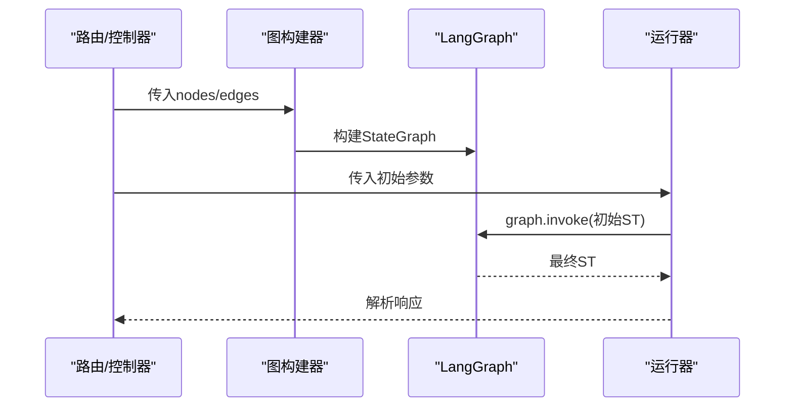

**图表来源**
- [graph.py:36-129](file://app/backend/services/graph.py#L36-L129)
- [graph.py:141-177](file://app/backend/services/graph.py#L141-L177)

**章节来源**
- [graph.py:36-129](file://app/backend/services/graph.py#L36-L129)
- [graph.py:141-177](file://app/backend/services/graph.py#L141-L177)

### 回测服务与交易执行
- 数据预取：在回测前拉取所需历史数据，降低运行时 IO 建立
- 逐日循环：按交易日切片，计算价格、调用图获取决策、执行交易
- 风险指标：计算日收益、夏普/索提诺比率、最大回撤等
- 暴露度统计：计算总/净暴露与多空比

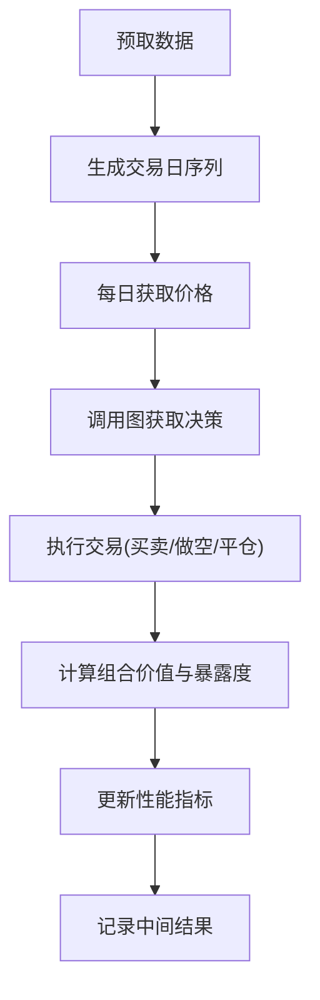

**图表来源**
- [backtest_service.py:225-391](file://app/backend/services/backtest_service.py#L225-L391)
- [backtest_service.py:391-512](file://app/backend/services/backtest_service.py#L391-L512)

**章节来源**
- [backtest_service.py:225-391](file://app/backend/services/backtest_service.py#L225-L391)
- [backtest_service.py:391-512](file://app/backend/services/backtest_service.py#L391-L512)

## 依赖关系分析
- 组件内聚与耦合
  - AgentService 与图构建器松耦合：前者只负责函数包装，后者负责节点/边与连接
  - 智能体函数与状态模型强内聚：所有智能体均遵循统一签名与状态写入规范
- 外部依赖
  - LangGraph：工作流编排与状态合并
  - LLM：结构化输出与重试机制
  - 数据源：金融数据 API（价格、财务、新闻、大股东交易）

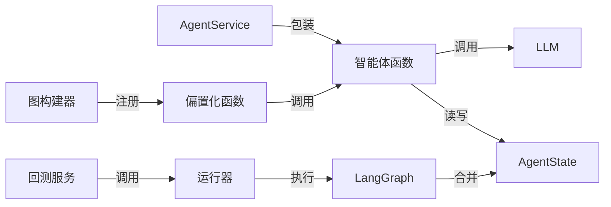

**图表来源**
- [agent_service.py:5-12](file://app/backend/services/agent_service.py#L5-L12)
- [graph.py:36-129](file://app/backend/services/graph.py#L36-L129)
- [state.py:15-18](file://src/graph/state.py#L15-L18)
- [llm.py:10-84](file://src/utils/llm.py#L10-L84)
- [backtest_service.py:367-376](file://app/backend/services/backtest_service.py#L367-L376)

**章节来源**
- [agent_service.py:5-12](file://app/backend/services/agent_service.py#L5-L12)
- [graph.py:36-129](file://app/backend/services/graph.py#L36-L129)
- [state.py:15-18](file://src/graph/state.py#L15-L18)
- [llm.py:10-84](file://src/utils/llm.py#L10-L84)
- [backtest_service.py:367-376](file://app/backend/services/backtest_service.py#L367-L376)

## 性能考量
- 函数包装与图构建
  - 使用 functools.partial 避免重复传参，减少闭包捕获开销
  - ANALYST_CONFIG 集中式管理，避免重复导入与硬编码
- 状态合并
  - operator.add 与 merge_dicts 保证高效合并，避免深拷贝
- LLM 调用
  - 结构化输出与 JSON 模式减少后处理成本
  - 重试与默认工厂保障稳定性，降低失败率
- 回测优化
  - 预取数据与异步执行，减少 IO 阻塞
  - 日志与进度回调，便于监控与中断

[本节为通用指导，无需特定文件引用]

## 故障排查指南
- LLM 调用失败
  - 检查模型配置与 API Key 注入路径
  - 利用默认工厂与重试机制兜底，必要时打印错误日志
- 状态字段缺失
  - 确认智能体返回值包含 "messages" 与 "data"
  - 检查 AgentState 的合并逻辑是否正确
- 图执行异常
  - 核对节点/边映射与基础键解析
  - 确保组合管理器与风控节点一一对应
- 回测中断
  - 捕获异常并记录日期与错误信息
  - 逐步缩小范围定位数据缺失或计算异常

**章节来源**
- [llm.py:72-84](file://src/utils/llm.py#L72-L84)
- [graph.py:108-125](file://app/backend/services/graph.py#L108-L125)
- [backtest_service.py:386-390](file://app/backend/services/backtest_service.py#L386-L390)

## 结论
智能体服务通过“配置驱动 + 函数包装 + 图编排”的方式，实现了高内聚、低耦合的可扩展架构。create_agent_function 将通用智能体函数标准化为 LangGraph 可调用形式，配合统一的 AgentState 与 ANALYST_CONFIG，使得新增智能体与工作流变更变得简单而稳健。结合回测服务与进度/LLM 工具，整体具备良好的可观测性与鲁棒性。

[本节为总结，无需特定文件引用]

## 附录

### 扩展接口与新增智能体流程
- 新增智能体步骤
  - 在 ANALYST_CONFIG 中注册新智能体键，指定显示名、描述、类型与 agent_func
  - 实现智能体函数，遵循 (state, agent_id=...) 签名，返回 {messages, data}
  - 在图构建阶段自动识别基础键并注册节点
- 扩展接口建议
  - 为智能体增加元信息（如 order、权重），便于排序与组合
  - 提供统一的错误处理与默认输出工厂，提升稳定性

**章节来源**
- [analysts.py:24-178](file://src/utils/analysts.py#L24-L178)
- [graph.py:42-66](file://app/backend/services/graph.py#L42-L66)

### 测试方法、Mock 集成与调试技巧
- 单元测试
  - Mock LLM 返回值，验证智能体输出结构与状态写入
  - Mock 数据源，隔离网络依赖
- 集成测试
  - 使用小规模图与少量节点验证端到端流程
  - 通过 parse_hedge_fund_response 校验最终决策格式
- 调试技巧
  - 启用 show_reasoning 输出，查看推理细节
  - 使用 progress 实时观察各智能体状态
  - 在关键节点断点或日志输出 agent_id 与当前 tickers

**章节来源**
- [llm.py:10-84](file://src/utils/llm.py#L10-L84)
- [state.py:21-52](file://src/graph/state.py#L21-L52)
- [progress.py:12-117](file://src/utils/progress.py#L12-L117)
- [graph.py:180-192](file://app/backend/services/graph.py#L180-L192)

### 最佳实践
- 智能体开发
  - 保持函数纯度：尽量通过状态读写而非全局变量
  - 明确输出格式：统一使用 HumanMessage，name 为 agent_id
- 状态管理
  - 严格遵循 AgentState 字段命名与合并策略
  - 对大字典进行增量更新，避免全量替换
- 错误处理
  - 为 LLM 调用提供默认工厂，确保降级可用
  - 对外部 API 调用增加超时与重试，记录失败原因

[本节为通用指导，无需特定文件引用]