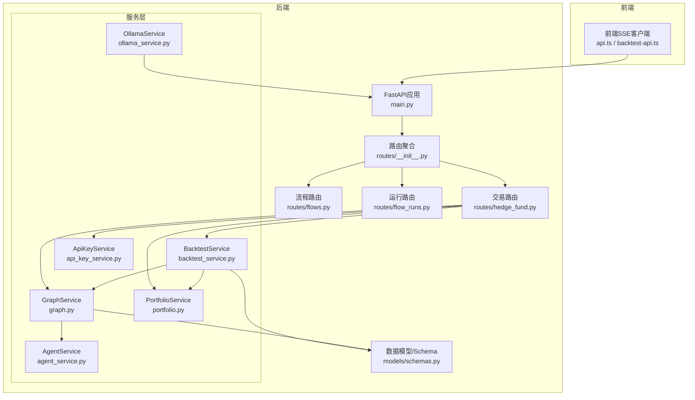
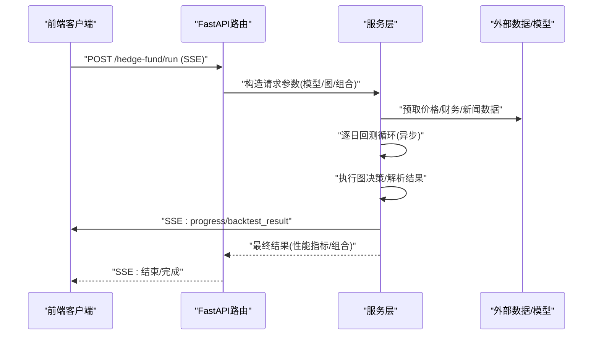
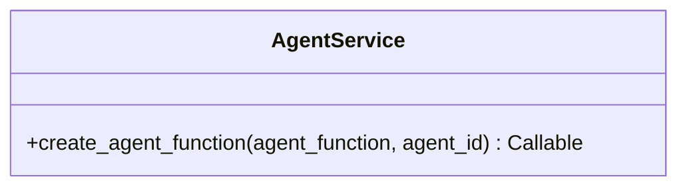
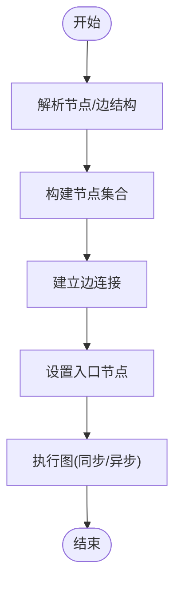
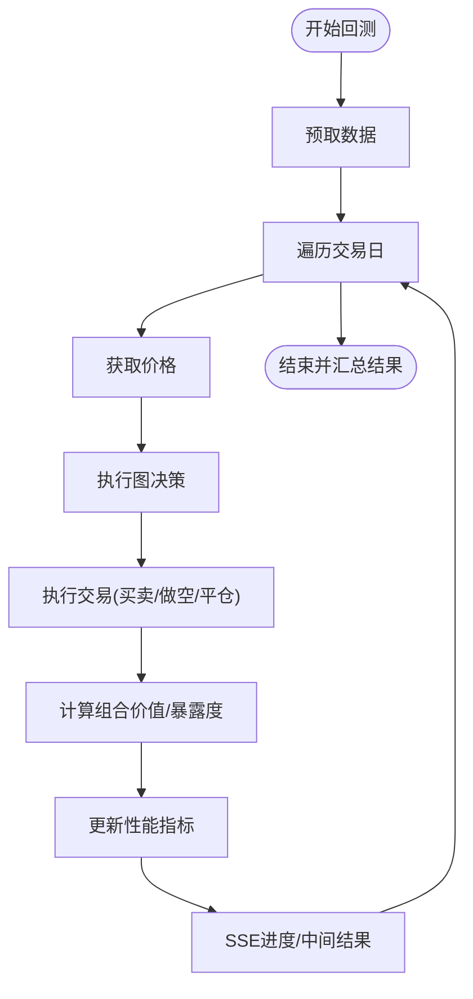
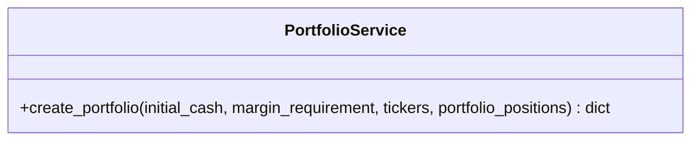
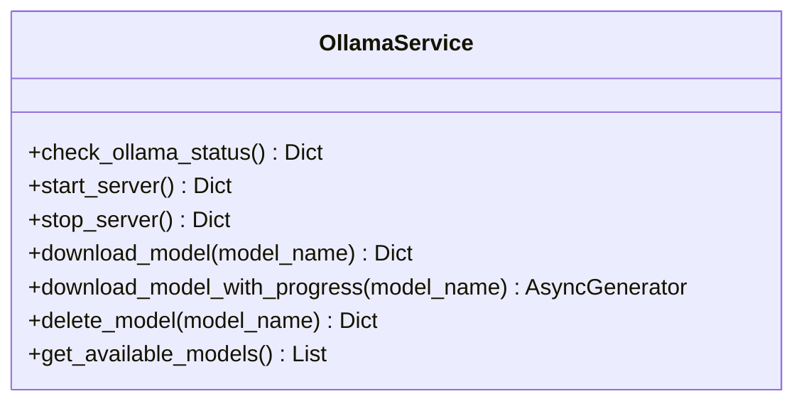
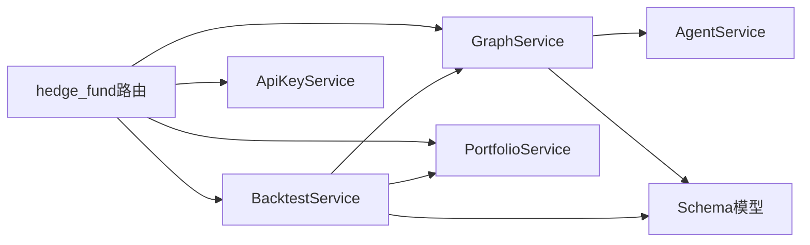
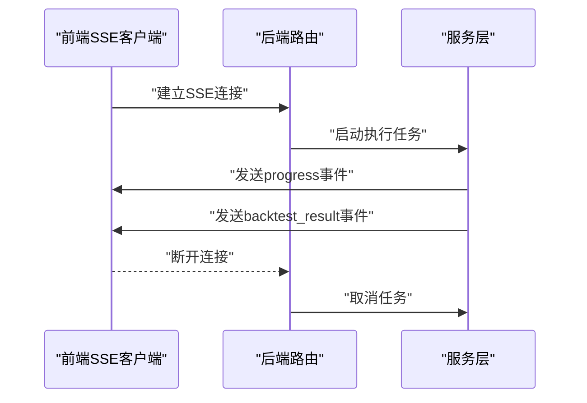

# 服务层架构

<cite>
**本文档引用的文件**
- [app/backend/services/agent_service.py](file://app/backend/services/agent_service.py)
- [app/backend/services/backtest_service.py](file://app/backend/services/backtest_service.py)
- [app/backend/services/graph.py](file://app/backend/services/graph.py)
- [app/backend/services/portfolio.py](file://app/backend/services/portfolio.py)
- [app/backend/services/ollama_service.py](file://app/backend/services/ollama_service.py)
- [app/backend/services/api_key_service.py](file://app/backend/services/api_key_service.py)
- [app/backend/models/schemas.py](file://app/backend/models/schemas.py)
- [app/backend/main.py](file://app/backend/main.py)
- [app/backend/routes/__init__.py](file://app/backend/routes/__init__.py)
- [app/backend/routes/hedge_fund.py](file://app/backend/routes/hedge_fund.py)
- [app/backend/routes/flows.py](file://app/backend/routes/flows.py)
- [app/backend/routes/flow_runs.py](file://app/backend/routes/flow_runs.py)
- [app/frontend/src/services/api.ts](file://app/frontend/src/services/api.ts)
- [app/frontend/src/services/backtest-api.ts](file://app/frontend/src/services/backtest-api.ts)
</cite>

## 目录
1. [引言](#引言)
2. [项目结构](#项目结构)
3. [核心组件](#核心组件)
4. [架构总览](#架构总览)
5. [详细组件分析](#详细组件分析)
6. [依赖分析](#依赖分析)
7. [性能考虑](#性能考虑)
8. [故障排查指南](#故障排查指南)
9. [结论](#结论)
10. [附录](#附录)

## 引言
本文件系统性梳理后端服务层的架构设计与实现，重点覆盖以下方面：
- 服务层设计模式：以职责单一、可组合、可扩展为核心原则
- 业务逻辑封装：交易回测、图执行、投资组合管理、模型与本地推理(Ollama)集成等
- 依赖注入与解耦：通过路由层注入服务实例，避免硬编码依赖
- 服务间通信协议：SSE流式事件、异步任务与取消机制、错误传播
- 扩展机制与新增服务流程：基于FastAPI路由与Pydantic模型的标准化接入
- 性能优化策略：数据预取、异步并发、进度回调、暴露度计算
- 测试与集成：Mock集成、前端SSE消费、数据库与外部API交互
- 监控、日志与故障恢复：启动时Ollama状态检查、异常捕获与降级

## 项目结构
后端采用分层组织方式，服务层位于应用核心，路由层负责HTTP接口与SSE流，模型层定义请求/响应结构，数据库层通过SQLAlchemy管理。

**图表来源**
- [app/backend/main.py:1-56](file://app/backend/main.py#L1-L56)
- [app/backend/routes/__init__.py:1-24](file://app/backend/routes/__init__.py#L1-L24)
- [app/backend/routes/hedge_fund.py:86-115](file://app/backend/routes/hedge_fund.py#L86-L115)
- [app/backend/services/backtest_service.py:1-539](file://app/backend/services/backtest_service.py#L1-L539)
- [app/backend/services/graph.py:1-193](file://app/backend/services/graph.py#L1-L193)
- [app/backend/services/agent_service.py:1-13](file://app/backend/services/agent_service.py#L1-L13)
- [app/backend/services/portfolio.py:1-52](file://app/backend/services/portfolio.py#L1-L52)
- [app/backend/services/ollama_service.py:1-519](file://app/backend/services/ollama_service.py#L1-L519)
- [app/backend/services/api_key_service.py:1-23](file://app/backend/services/api_key_service.py#L1-L23)
- [app/backend/models/schemas.py:1-292](file://app/backend/models/schemas.py#L1-L292)

**章节来源**
- [app/backend/main.py:1-56](file://app/backend/main.py#L1-L56)
- [app/backend/routes/__init__.py:1-24](file://app/backend/routes/__init__.py#L1-L24)

## 核心组件
- AgentService：将通用代理函数包装为LangGraph节点可用的函数，支持按agent_id注入上下文
- GraphService：构建动态工作流图，连接分析师节点、风险管理和组合管理节点，并提供同步/异步执行入口
- BacktestService：核心回测引擎，支持长/短交易、保证金占用、收益计算、暴露度统计与性能指标
- PortfolioService：投资组合初始化与更新，支持长/空头仓位与成本基础价维护
- OllamaService：本地大模型服务管理，包括安装检测、服务器启停、模型下载/删除与进度流
- ApiKeyService：从数据库加载API密钥字典，供外部数据源调用

**章节来源**
- [app/backend/services/agent_service.py:1-13](file://app/backend/services/agent_service.py#L1-L13)
- [app/backend/services/graph.py:1-193](file://app/backend/services/graph.py#L1-L193)
- [app/backend/services/backtest_service.py:1-539](file://app/backend/services/backtest_service.py#L1-L539)
- [app/backend/services/portfolio.py:1-52](file://app/backend/services/portfolio.py#L1-L52)
- [app/backend/services/ollama_service.py:1-519](file://app/backend/services/ollama_service.py#L1-L519)
- [app/backend/services/api_key_service.py:1-23](file://app/backend/services/api_key_service.py#L1-L23)

## 架构总览
服务层围绕“请求-执行-流式输出”的主路径展开：
- 路由层接收HTTP请求，解析Schema，构造服务参数
- 服务层执行业务逻辑（回测/图执行/组合管理），必要时异步执行
- 使用SSE向客户端推送进度事件与中间结果
- 错误在服务层捕获并转换为统一错误响应，前端进行可视化反馈

**图表来源**
- [app/backend/routes/hedge_fund.py:86-115](file://app/backend/routes/hedge_fund.py#L86-L115)
- [app/backend/services/backtest_service.py:285-512](file://app/backend/services/backtest_service.py#L285-L512)
- [app/frontend/src/services/api.ts:117-309](file://app/frontend/src/services/api.ts#L117-L309)

## 详细组件分析

### AgentService 分析
- 职责：将通用代理函数包装为带agent_id的函数，供LangGraph节点调用
- 设计要点：使用偏函数绑定agent_id，保持代理函数签名一致；与GraphService配合，动态生成节点函数
- 复杂度：O(1)包装，无额外数据结构

**图表来源**
- [app/backend/services/agent_service.py:5-13](file://app/backend/services/agent_service.py#L5-L13)

**章节来源**
- [app/backend/services/agent_service.py:1-13](file://app/backend/services/agent_service.py#L1-L13)

### GraphService 分析
- 职责：根据React Flow结构创建LangGraph工作流，连接分析师、风险管理与组合管理节点
- 关键流程：
  - 解析节点ID，提取基础代理键
  - 为每个分析师节点创建唯一代理函数
  - 为组合管理节点创建对应的风险管理节点
  - 建立边连接规则，保证分析师→风险→组合管理的顺序
  - 提供同步/异步执行入口，返回决策与信号
- 异步处理：run_graph_async通过线程池执行阻塞调用，避免阻塞事件循环

**图表来源**
- [app/backend/services/graph.py:36-129](file://app/backend/services/graph.py#L36-L129)
- [app/backend/services/graph.py:132-177](file://app/backend/services/graph.py#L132-L177)

**章节来源**
- [app/backend/services/graph.py:1-193](file://app/backend/services/graph.py#L1-L193)

### BacktestService 分析
- 职责：执行回测，支持长/短交易、保证金占用、收益与暴露度计算、性能指标
- 数据流：
  - 预取阶段：批量拉取价格、财务、内幕交易、新闻数据
  - 逐日循环：获取当日价格，复制组合状态，执行图决策，解析动作，执行交易，计算价值与指标
  - 进度回调：支持SSE进度事件与中间结果推送
- 交易执行：
  - 买入/卖出：整数股，加权平均成本基础价更新
  - 做空/平仓：保证金要求校验，按比例释放保证金
- 指标计算：夏普/索提诺比率、最大回撤、暴露度、多空比率

**图表来源**
- [app/backend/services/backtest_service.py:225-512](file://app/backend/services/backtest_service.py#L225-L512)

**章节来源**
- [app/backend/services/backtest_service.py:1-539](file://app/backend/services/backtest_service.py#L1-L539)

### PortfolioService 分析
- 职责：初始化投资组合结构，支持从已有仓位填充
- 数据结构：现金、保证金要求、各标的长/空头仓位、成本基础价、已实现损益、保证金占用
- 复杂度：初始化O(T)，填充O(P)，T为标的数，P为仓位条目数

**图表来源**
- [app/backend/services/portfolio.py:6-52](file://app/backend/services/portfolio.py#L6-L52)

**章节来源**
- [app/backend/services/portfolio.py:1-52](file://app/backend/services/portfolio.py#L1-L52)

### OllamaService 分析
- 职责：管理Ollama本地推理服务，提供安装检测、服务器启停、模型下载/删除与进度流
- 异步能力：使用AsyncClient与线程池执行阻塞操作，支持SSE进度流
- 平台适配：Unix/Windows进程管理与终止策略
- API集成：格式化可用模型列表，供语言模型API使用

**图表来源**
- [app/backend/services/ollama_service.py:19-519](file://app/backend/services/ollama_service.py#L19-L519)

**章节来源**
- [app/backend/services/ollama_service.py:1-519](file://app/backend/services/ollama_service.py#L1-L519)

### ApiKeyService 分析
- 职责：从数据库加载API密钥字典，便于注入到外部数据请求中
- 复杂度：O(N)，N为有效密钥数量

**章节来源**
- [app/backend/services/api_key_service.py:1-23](file://app/backend/services/api_key_service.py#L1-L23)

## 依赖分析
- 路由到服务：路由层通过依赖注入获取数据库会话与服务实例，避免直接导入服务类
- 服务内聚：BacktestService依赖GraphService与PortfolioService；GraphService依赖AgentService
- 外部依赖：OllamaService依赖外部进程与网络；BacktestService依赖外部金融数据API
- 模型契约：所有请求/响应通过Pydantic模型约束，确保类型安全与序列化一致性

**图表来源**
- [app/backend/routes/hedge_fund.py:86-115](file://app/backend/routes/hedge_fund.py#L86-L115)
- [app/backend/services/backtest_service.py:1-539](file://app/backend/services/backtest_service.py#L1-L539)
- [app/backend/services/graph.py:1-193](file://app/backend/services/graph.py#L1-L193)
- [app/backend/models/schemas.py:1-292](file://app/backend/models/schemas.py#L1-L292)

**章节来源**
- [app/backend/routes/hedge_fund.py:86-115](file://app/backend/routes/hedge_fund.py#L86-L115)
- [app/backend/models/schemas.py:1-292](file://app/backend/models/schemas.py#L1-L292)

## 性能考虑
- 数据预取：回测开始前批量拉取所需数据，减少每日查询开销
- 异步并发：回测循环中使用await asyncio.sleep(0)让出控制权，允许其他协程运行
- 进度回调：通过回调/事件流及时反馈进度，避免长时间阻塞
- 暴露度与收益：每日计算长/短暴露度与收益，降低后续统计成本
- I/O优化：Ollama下载使用流式进度，避免一次性内存压力

[本节为通用性能建议，无需特定文件引用]

## 故障排查指南
- 启动时Ollama状态检查：应用启动时记录Ollama安装、运行与可用模型信息，便于快速定位问题
- 回测过程中的异常：Graph执行异常会被捕获并降级为空决策，继续推进回测
- SSE连接中断：前端SSE读取过程中若发生中断，会标记所有代理节点为错误并清理连接状态
- 数据缺失：当日价格缺失时跳过该日，避免中断整个回测流程

**章节来源**
- [app/backend/main.py:32-56](file://app/backend/main.py#L32-L56)
- [app/backend/services/backtest_service.py:344-390](file://app/backend/services/backtest_service.py#L344-L390)
- [app/frontend/src/services/api.ts:257-295](file://app/frontend/src/services/api.ts#L257-L295)

## 结论
服务层通过清晰的职责划分与标准化的接口，实现了从图执行到回测的完整闭环。结合SSE流式输出与完善的错误处理，既保证了用户体验，也为扩展与测试提供了良好基础。建议在新增服务时遵循现有Schema与路由模式，确保一致的依赖注入与错误传播机制。

[本节为总结性内容，无需特定文件引用]

## 附录

### 服务间通信协议与异步处理
- SSE事件类型：progress/backtest_result/开始事件
- 断连检测：后台任务监听客户端断开，触发任务取消
- 事件流解析：前端按双换行分割事件块，解析事件类型与数据

**图表来源**
- [app/backend/routes/hedge_fund.py:86-115](file://app/backend/routes/hedge_fund.py#L86-L115)
- [app/frontend/src/services/api.ts:117-309](file://app/frontend/src/services/api.ts#L117-L309)

**章节来源**
- [app/backend/routes/hedge_fund.py:86-115](file://app/backend/routes/hedge_fund.py#L86-L115)
- [app/frontend/src/services/api.ts:117-309](file://app/frontend/src/services/api.ts#L117-L309)

### 错误传播与统一响应
- 路由层捕获异常并转换为HTTP 500与统一错误模型
- 服务层内部捕获外部API/模型异常，返回安全默认值或降级结果
- 前端根据事件状态更新UI，展示错误信息

**章节来源**
- [app/backend/routes/flows.py:41-81](file://app/backend/routes/flows.py#L41-L81)
- [app/backend/routes/flow_runs.py:50-113](file://app/backend/routes/flow_runs.py#L50-L113)
- [app/backend/services/backtest_service.py:344-390](file://app/backend/services/backtest_service.py#L344-L390)

### 服务扩展与新增流程
- 定义Schema：在模型层新增请求/响应模型
- 编写服务：实现业务逻辑，尽量复用现有工具与数据访问
- 注册路由：在路由聚合中注册子路由
- 接入前端：通过SSE或常规REST消费服务结果

**章节来源**
- [app/backend/models/schemas.py:61-141](file://app/backend/models/schemas.py#L61-L141)
- [app/backend/routes/__init__.py:1-24](file://app/backend/routes/__init__.py#L1-L24)

### 测试与集成指导
- 单元测试：针对服务方法编写单元测试，Mock外部依赖（如API/模型）
- 集成测试：使用真实数据库与外部API进行端到端验证
- Mock集成：在测试中替换OllamaService与外部数据源，确保可重复性
- 前端SSE：模拟SSE事件流，验证进度与结果展示

**章节来源**
- [tests/backtesting/integration/mocks.py](file://tests/backtesting/integration/mocks.py)
- [app/frontend/src/services/api.ts:117-309](file://app/frontend/src/services/api.ts#L117-L309)
- [app/frontend/src/services/backtest-api.ts:34-76](file://app/frontend/src/services/backtest-api.ts#L34-L76)

### 监控、日志与故障恢复
- 启动日志：记录Ollama状态、可用模型数量与URL
- 服务日志：关键操作与异常捕获均记录日志，便于追踪
- 故障恢复：断连自动取消任务，避免僵尸进程；Ollama服务启停失败有降级提示

**章节来源**
- [app/backend/main.py:32-56](file://app/backend/main.py#L32-L56)
- [app/backend/services/ollama_service.py:232-275](file://app/backend/services/ollama_service.py#L232-L275)