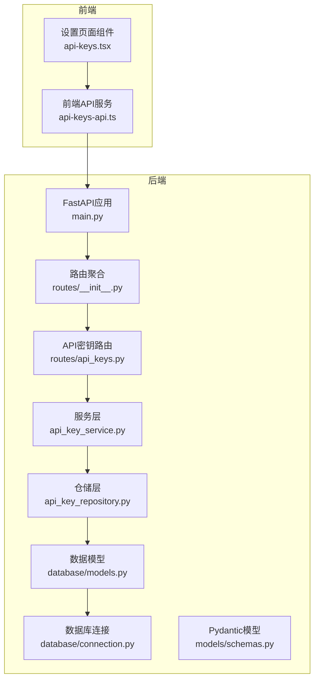
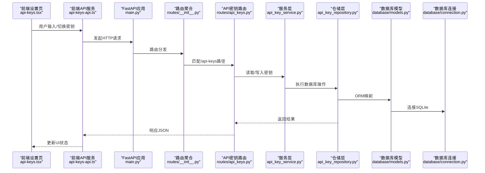
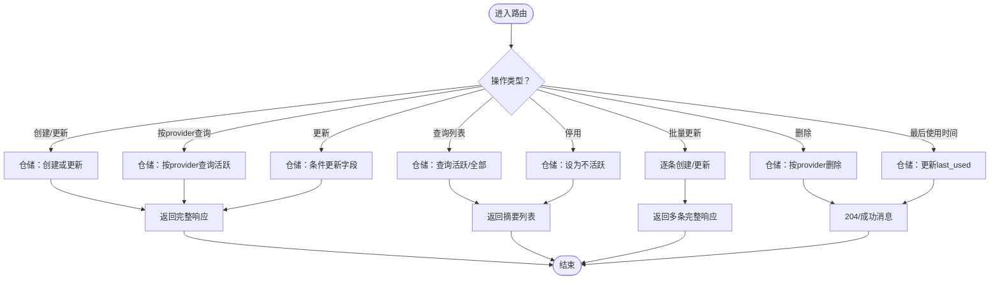
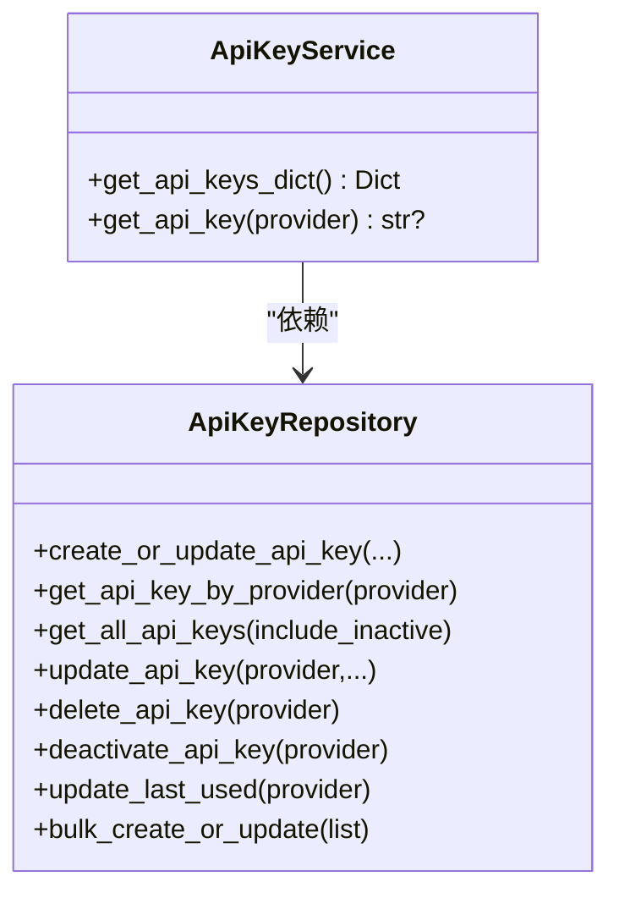
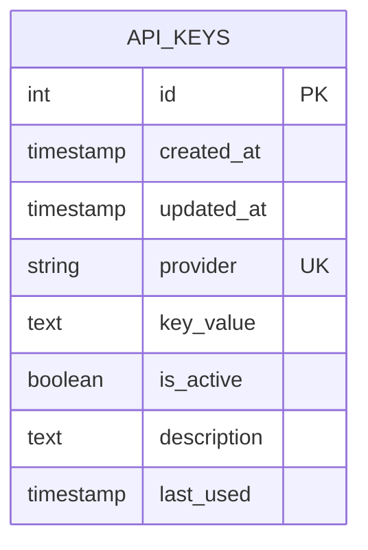
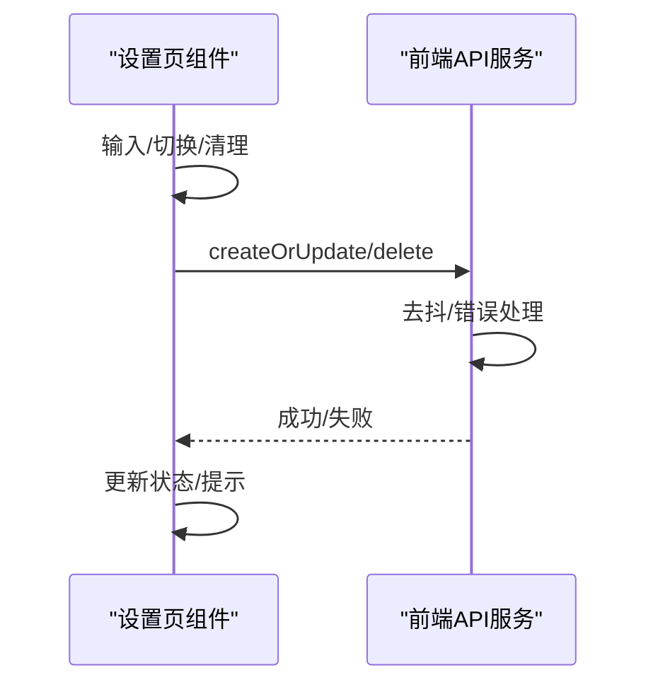
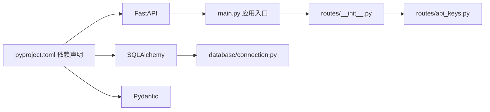
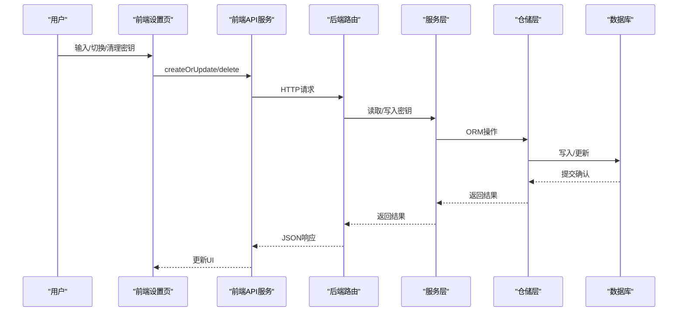

# 认证与授权

<cite>
**本文引用的文件**
- [app/backend/main.py](file://app/backend/main.py)
- [app/backend/routes/__init__.py](file://app/backend/routes/__init__.py)
- [app/backend/routes/api_keys.py](file://app/backend/routes/api_keys.py)
- [app/backend/services/api_key_service.py](file://app/backend/services/api_key_service.py)
- [app/backend/repositories/api_key_repository.py](file://app/backend/repositories/api_key_repository.py)
- [app/backend/database/models.py](file://app/backend/database/models.py)
- [app/backend/database/connection.py](file://app/backend/database/connection.py)
- [app/backend/models/schemas.py](file://app/backend/models/schemas.py)
- [app/frontend/src/services/api-keys-api.ts](file://app/frontend/src/services/api-keys-api.ts)
- [app/frontend/src/components/settings/api-keys.tsx](file://app/frontend/src/components/settings/api-keys.tsx)
- [app/backend/alembic/versions/add_api_keys_table.py](file://app/backend/alembic/versions/add_api_keys_table.py)
- [pyproject.toml](file://pyproject.toml)
</cite>

## 目录
1. [简介](#简介)
2. [项目结构](#项目结构)
3. [核心组件](#核心组件)
4. [架构总览](#架构总览)
5. [详细组件分析](#详细组件分析)
6. [依赖分析](#依赖分析)
7. [性能考虑](#性能考虑)
8. [故障排查指南](#故障排查指南)
9. [结论](#结论)
10. [附录](#附录)

## 简介
本文件面向“认证与授权”主题，聚焦于本项目中的API密钥管理机制与前端设置界面。当前后端已实现本地SQLite数据库存储的API密钥表，并提供REST接口用于创建、查询、更新、删除及批量管理密钥；前端提供可视化设置界面，支持密钥的自动保存、显示/隐藏切换与清理操作。本文将从系统架构、数据流、处理逻辑、安全策略与最佳实践等维度进行深入说明，并给出扩展与运维建议。

## 项目结构
围绕认证与授权的关键目录与文件如下：
- 后端FastAPI应用入口与路由聚合：[app/backend/main.py](file://app/backend/main.py)、[app/backend/routes/__init__.py](file://app/backend/routes/__init__.py)
- API密钥路由与业务：[app/backend/routes/api_keys.py](file://app/backend/routes/api_keys.py)
- 服务层与仓储层：[app/backend/services/api_key_service.py](file://app/backend/services/api_key_service.py)、[app/backend/repositories/api_key_repository.py](file://app/backend/repositories/api_key_repository.py)
- 数据模型与数据库连接：[app/backend/database/models.py](file://app/backend/database/models.py)、[app/backend/database/connection.py](file://app/backend/database/connection.py)
- Pydantic请求/响应模型：[app/backend/models/schemas.py](file://app/backend/models/schemas.py)
- 前端API密钥服务与设置组件：[app/frontend/src/services/api-keys-api.ts](file://app/frontend/src/services/api-keys-api.ts)、[app/frontend/src/components/settings/api-keys.tsx](file://app/frontend/src/components/settings/api-keys.tsx)
- 数据库迁移脚本（新增api_keys表）：[app/backend/alembic/versions/add_api_keys_table.py](file://app/backend/alembic/versions/add_api_keys_table.py)
- 项目依赖声明：[pyproject.toml](file://pyproject.toml)

图表来源
- [app/backend/main.py:15-30](file://app/backend/main.py#L15-L30)
- [app/backend/routes/__init__.py:12-24](file://app/backend/routes/__init__.py#L12-L24)
- [app/backend/routes/api_keys.py:16](file://app/backend/routes/api_keys.py#L16)
- [app/backend/services/api_key_service.py:6-23](file://app/backend/services/api_key_service.py#L6-L23)
- [app/backend/repositories/api_key_repository.py:9-131](file://app/backend/repositories/api_key_repository.py#L9-L131)
- [app/backend/database/models.py:97-115](file://app/backend/database/models.py#L97-L115)
- [app/backend/database/connection.py:14-32](file://app/backend/database/connection.py#L14-L32)
- [app/backend/models/schemas.py:243-292](file://app/backend/models/schemas.py#L243-L292)

章节来源
- [app/backend/main.py:15-30](file://app/backend/main.py#L15-L30)
- [app/backend/routes/__init__.py:12-24](file://app/backend/routes/__init__.py#L12-L24)

## 核心组件
- API密钥路由层：提供创建/查询/更新/删除/停用/批量更新/最后使用时间更新等接口，返回安全摘要或完整信息视情况而定。
- 服务层：负责从仓储层加载活跃密钥字典，便于下游请求注入。
- 仓储层：封装数据库读写、更新、删除、停用与批量更新等操作。
- 数据模型：定义api_keys表结构，含唯一provider索引、活跃状态、描述、最后使用时间等字段。
- 前端服务与UI：封装HTTP调用、自动保存、可见性切换、清理密钥与错误提示。
- 数据库连接：基于SQLite，绝对路径定位，使用SQLAlchemy ORM。

章节来源
- [app/backend/routes/api_keys.py:19-201](file://app/backend/routes/api_keys.py#L19-L201)
- [app/backend/services/api_key_service.py:6-23](file://app/backend/services/api_key_service.py#L6-L23)
- [app/backend/repositories/api_key_repository.py:9-131](file://app/backend/repositories/api_key_repository.py#L9-L131)
- [app/backend/database/models.py:97-115](file://app/backend/database/models.py#L97-L115)
- [app/frontend/src/services/api-keys-api.ts:42-158](file://app/frontend/src/services/api-keys-api.ts#L42-L158)
- [app/frontend/src/components/settings/api-keys.tsx:85-319](file://app/frontend/src/components/settings/api-keys.tsx#L85-L319)
- [app/backend/database/connection.py:14-32](file://app/backend/database/connection.py#L14-L32)

## 架构总览
下图展示从前端到后端的典型交互路径，以及数据库层的数据持久化。

图表来源
- [app/backend/main.py:15-30](file://app/backend/main.py#L15-L30)
- [app/backend/routes/__init__.py:12-24](file://app/backend/routes/__init__.py#L12-L24)
- [app/backend/routes/api_keys.py:19-201](file://app/backend/routes/api_keys.py#L19-L201)
- [app/backend/services/api_key_service.py:6-23](file://app/backend/services/api_key_service.py#L6-L23)
- [app/backend/repositories/api_key_repository.py:9-131](file://app/backend/repositories/api_key_repository.py#L9-L131)
- [app/backend/database/models.py:97-115](file://app/backend/database/models.py#L97-L115)
- [app/backend/database/connection.py:14-32](file://app/backend/database/connection.py#L14-L32)
- [app/frontend/src/services/api-keys-api.ts:42-158](file://app/frontend/src/services/api-keys-api.ts#L42-L158)
- [app/frontend/src/components/settings/api-keys.tsx:85-319](file://app/frontend/src/components/settings/api-keys.tsx#L85-L319)

## 详细组件分析

### API密钥路由与业务流程
- 创建/更新：接收provider、key_value、description、is_active，返回完整响应。
- 查询列表：默认仅返回摘要（不含实际key_value），可选包含未激活项。
- 按provider查询：返回完整响应。
- 更新：可选择性更新key_value、description、is_active。
- 删除：按provider删除。
- 停用：将is_active置为False但不删除记录。
- 批量更新：一次提交多个密钥条目。
- 最后使用时间更新：记录最近使用时间戳。

图表来源
- [app/backend/routes/api_keys.py:19-201](file://app/backend/routes/api_keys.py#L19-L201)
- [app/backend/repositories/api_key_repository.py:15-131](file://app/backend/repositories/api_key_repository.py#L15-L131)

章节来源
- [app/backend/routes/api_keys.py:19-201](file://app/backend/routes/api_keys.py#L19-L201)
- [app/backend/repositories/api_key_repository.py:15-131](file://app/backend/repositories/api_key_repository.py#L15-L131)

### 服务层与仓储层职责
- 服务层：对外暴露简洁方法，如获取所有活跃密钥字典、按provider获取单个密钥值，便于在请求处理时注入。
- 仓储层：封装SQLAlchemy查询与事务提交，支持条件更新、批量处理与索引优化。

图表来源
- [app/backend/services/api_key_service.py:6-23](file://app/backend/services/api_key_service.py#L6-L23)
- [app/backend/repositories/api_key_repository.py:9-131](file://app/backend/repositories/api_key_repository.py#L9-L131)

章节来源
- [app/backend/services/api_key_service.py:6-23](file://app/backend/services/api_key_service.py#L6-L23)
- [app/backend/repositories/api_key_repository.py:9-131](file://app/backend/repositories/api_key_repository.py#L9-L131)

### 数据模型与数据库设计
- 表名：api_keys
- 关键字段：provider（唯一索引）、key_value、is_active、description、last_used、创建/更新时间戳
- 设计要点：通过provider唯一标识不同服务的密钥；is_active支持启用/停用而不删除；last_used便于审计追踪

图表来源
- [app/backend/database/models.py:97-115](file://app/backend/database/models.py#L97-L115)
- [app/backend/alembic/versions/add_api_keys_table.py:24-35](file://app/backend/alembic/versions/add_api_keys_table.py#L24-L35)

章节来源
- [app/backend/database/models.py:97-115](file://app/backend/database/models.py#L97-L115)
- [app/backend/alembic/versions/add_api_keys_table.py:24-35](file://app/backend/alembic/versions/add_api_keys_table.py#L24-L35)

### 前端设置与交互
- 自动保存：输入框变更触发去抖保存，空值则删除对应provider的密钥。
- 可见性切换：支持明文/密码模式切换。
- 清理密钥：一键删除按钮调用删除接口。
- 错误处理：统一捕获并提示，支持重试加载。
- 安全提示：强调密钥存储在本地系统且需妥善保管。

图表来源
- [app/frontend/src/components/settings/api-keys.tsx:85-319](file://app/frontend/src/components/settings/api-keys.tsx#L85-L319)
- [app/frontend/src/services/api-keys-api.ts:42-158](file://app/frontend/src/services/api-keys-api.ts#L42-L158)

章节来源
- [app/frontend/src/components/settings/api-keys.tsx:85-319](file://app/frontend/src/components/settings/api-keys.tsx#L85-L319)
- [app/frontend/src/services/api-keys-api.ts:42-158](file://app/frontend/src/services/api-keys-api.ts#L42-L158)

## 依赖分析
- 后端框架与ORM：FastAPI + SQLAlchemy
- 数据库：SQLite（本地文件）
- 前端：Vite + TypeScript + React（通过fetch与后端交互）

图表来源
- [pyproject.toml:31-40](file://pyproject.toml#L31-L40)
- [app/backend/main.py:15-30](file://app/backend/main.py#L15-L30)
- [app/backend/routes/__init__.py:12-24](file://app/backend/routes/__init__.py#L12-L24)
- [app/backend/routes/api_keys.py:16](file://app/backend/routes/api_keys.py#L16)
- [app/backend/database/connection.py:14-32](file://app/backend/database/connection.py#L14-L32)

章节来源
- [pyproject.toml:31-40](file://pyproject.toml#L31-L40)
- [app/backend/main.py:15-30](file://app/backend/main.py#L15-L30)
- [app/backend/routes/__init__.py:12-24](file://app/backend/routes/__init__.py#L12-L24)

## 性能考虑
- 数据库连接：SQLite单进程写入，建议避免高并发写入；当前实现为本地开发环境，满足演示需求。
- ORM查询：仓储层已使用索引字段（provider/id），查询效率较高。
- 前端去抖保存：减少频繁网络请求，提升用户体验。
- 批量更新：一次提交多条密钥，降低往返次数。

## 故障排查指南
- 密钥不存在：查询/更新/停用接口在未找到时返回404，前端组件已捕获并提示。
- 服务器内部错误：接口捕获异常并返回500，前端提示重试。
- 数据库初始化：首次启动时自动创建表；若未出现预期表，请检查数据库文件是否存在与可写。
- CORS配置：后端已允许前端开发地址跨域访问，确保浏览器未被CORS拦截。

章节来源
- [app/backend/routes/api_keys.py:67-78](file://app/backend/routes/api_keys.py#L67-L78)
- [app/backend/routes/api_keys.py:89-105](file://app/backend/routes/api_keys.py#L89-L105)
- [app/backend/routes/api_keys.py:116-127](file://app/backend/routes/api_keys.py#L116-L127)
- [app/backend/routes/api_keys.py:138-152](file://app/backend/routes/api_keys.py#L138-L152)
- [app/backend/routes/api_keys.py:190-201](file://app/backend/routes/api_keys.py#L190-L201)
- [app/backend/main.py:21-27](file://app/backend/main.py#L21-L27)

## 结论
本项目在认证与授权方面以“本地密钥管理”为核心，通过API密钥表与REST接口实现密钥的生命周期管理，前端提供直观的设置界面与自动保存能力。当前实现适合本地开发与演示场景，具备良好的可扩展性。后续可在以下方向增强：引入传输加密、令牌刷新与安全退出、细粒度权限控制、审计日志与合规校验等。

## 附录

### API密钥管理流程（序列图）

图表来源
- [app/frontend/src/components/settings/api-keys.tsx:122-150](file://app/frontend/src/components/settings/api-keys.tsx#L122-L150)
- [app/frontend/src/services/api-keys-api.ts:69-100](file://app/frontend/src/services/api-keys-api.ts#L69-L100)
- [app/backend/routes/api_keys.py:27-37](file://app/backend/routes/api_keys.py#L27-L37)
- [app/backend/services/api_key_service.py:12-18](file://app/backend/services/api_key_service.py#L12-L18)
- [app/backend/repositories/api_key_repository.py:22-46](file://app/backend/repositories/api_key_repository.py#L22-L46)

### 安全策略与最佳实践（建议）
- 传输安全：生产环境启用HTTPS与TLS，确保前后端通信加密。
- 存储安全：当前key_value为明文存储，建议在生产中采用加密存储（如对称加密+密钥管理服务）。
- 权限控制：引入基于角色的访问控制（RBAC），限制对密钥管理接口的访问范围。
- 审计与合规：记录密钥创建/更新/停用/删除事件，保留审计日志以便合规检查。
- 令牌刷新与安全退出：如引入会话/令牌机制，需实现刷新与撤销流程。
- 配置与测试：提供安全配置清单与渗透测试指引，定期评估漏洞。