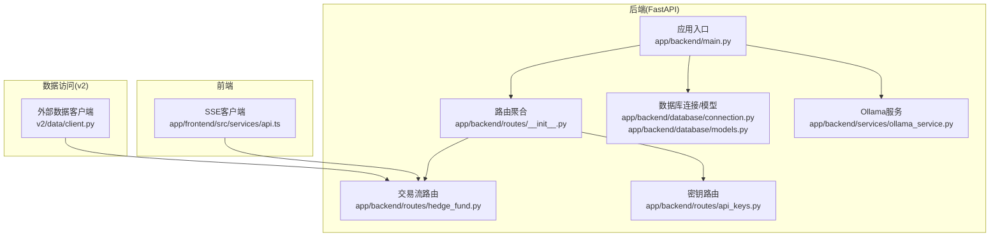
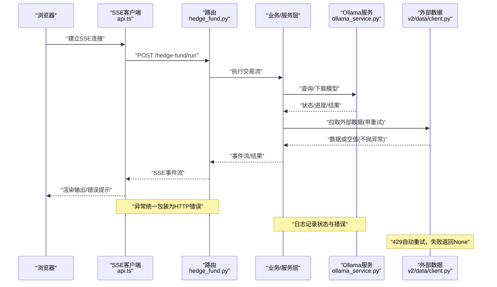
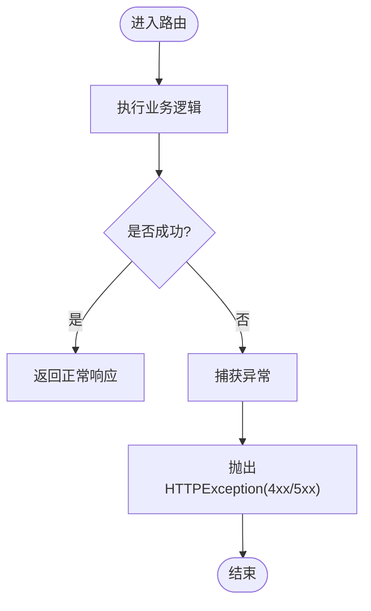
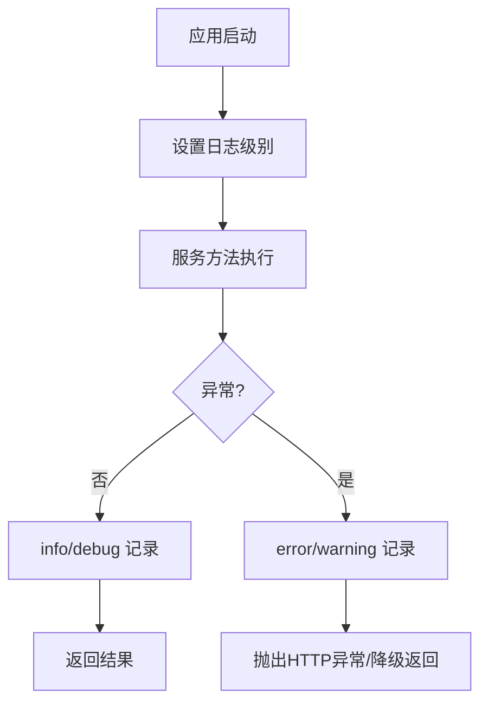
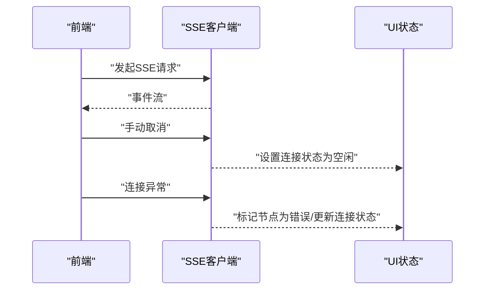
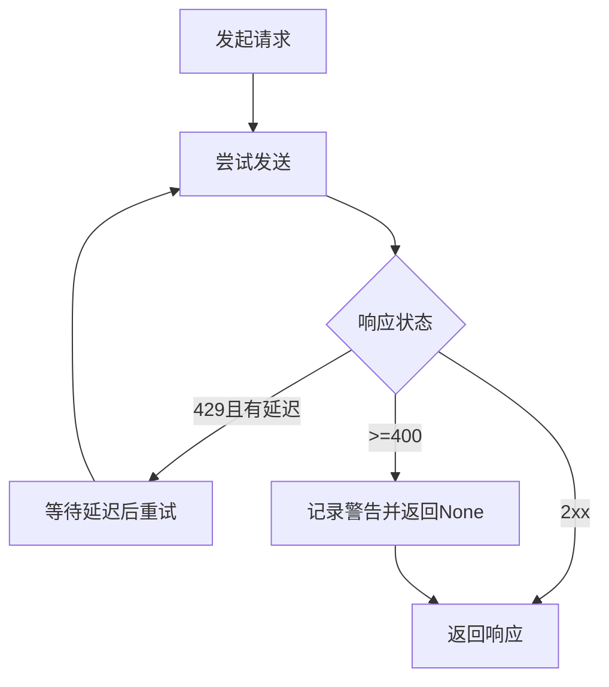
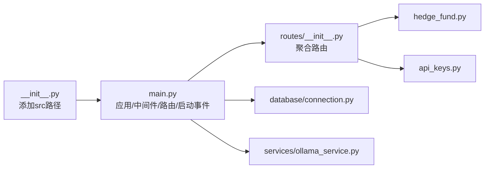

# 错误处理与日志

<cite>
**本文引用的文件**
- [app/backend/main.py](file://app/backend/main.py)
- [app/backend/__init__.py](file://app/backend/__init__.py)
- [app/backend/routes/__init__.py](file://app/backend/routes/__init__.py)
- [app/backend/routes/hedge_fund.py](file://app/backend/routes/hedge_fund.py)
- [app/backend/routes/api_keys.py](file://app/backend/routes/api_keys.py)
- [app/backend/services/ollama_service.py](file://app/backend/services/ollama_service.py)
- [app/backend/database/connection.py](file://app/backend/database/connection.py)
- [app/backend/database/models.py](file://app/backend/database/models.py)
- [app/frontend/src/services/api.ts](file://app/frontend/src/services/api.ts)
- [app/frontend/src/utils/text-utils.ts](file://app/frontend/src/utils/text-utils.ts)
- [v2/data/client.py](file://v2/data/client.py)
- [tests/test_api_rate_limiting.py](file://tests/test_api_rate_limiting.py)
- [app/backend/alembic.ini](file://app/backend/alembic.ini)
</cite>

## 目录
1. [简介](#简介)
2. [项目结构](#项目结构)
3. [核心组件](#核心组件)
4. [架构总览](#架构总览)
5. [详细组件分析](#详细组件分析)
6. [依赖分析](#依赖分析)
7. [性能考量](#性能考量)
8. [故障排查指南](#故障排查指南)
9. [结论](#结论)
10. [附录](#附录)

## 简介
本文件聚焦于本项目的错误处理与日志系统，目标包括：
- 统一错误响应格式、HTTP 状态码映射与错误消息标准化
- 异常捕获机制、错误分类与处理策略
- 日志记录策略、日志级别与日志格式规范
- 错误监控、告警机制与故障诊断流程
- 最佳实践、调试技巧与性能影响分析
- 日志轮转、存储管理与隐私保护措施
- 面向开发者的错误预防、快速定位与问题解决指导

## 项目结构
后端基于 FastAPI 构建，采用模块化路由组织；前端通过 SSE 流式接收后端事件；部分数据访问层在 v2 模块中实现重试与限流逻辑；数据库使用 SQLAlchemy（SQLite）。

图表来源
- [app/backend/main.py:1-56](file://app/backend/main.py#L1-L56)
- [app/backend/routes/__init__.py:1-24](file://app/backend/routes/__init__.py#L1-L24)
- [app/backend/routes/hedge_fund.py:145-177](file://app/backend/routes/hedge_fund.py#L145-L177)
- [app/backend/routes/api_keys.py:1-75](file://app/backend/routes/api_keys.py#L1-L75)
- [app/backend/database/connection.py:1-32](file://app/backend/database/connection.py#L1-L32)
- [app/backend/database/models.py:1-115](file://app/backend/database/models.py#L1-L115)
- [app/backend/services/ollama_service.py:1-519](file://app/backend/services/ollama_service.py#L1-L519)
- [app/frontend/src/services/api.ts:117-309](file://app/frontend/src/services/api.ts#L117-L309)
- [v2/data/client.py:186-226](file://v2/data/client.py#L186-L226)

章节来源
- [app/backend/main.py:1-56](file://app/backend/main.py#L1-L56)
- [app/backend/routes/__init__.py:1-24](file://app/backend/routes/__init__.py#L1-L24)

## 核心组件
- 应用入口与日志初始化：在应用启动时配置基础日志级别，并在启动事件中检查本地大模型服务可用性，记录信息与警告。
- 路由层错误处理：在关键路由中捕获异常并统一抛出 HTTP 异常，确保错误消息标准化。
- 数据访问层重试与降级：对外部数据请求实现指数退避重试与 429 处理，避免异常向上冒泡。
- 前端 SSE 客户端：对连接中断与读取异常进行处理，更新节点状态与连接状态，保证用户体验与可观测性。
- 数据库模型：在运行记录与周期记录中保留错误信息字段，便于持久化诊断。

章节来源
- [app/backend/main.py:11-56](file://app/backend/main.py#L11-L56)
- [app/backend/routes/hedge_fund.py:157-160](file://app/backend/routes/hedge_fund.py#L157-L160)
- [v2/data/client.py:186-226](file://v2/data/client.py#L186-L226)
- [app/frontend/src/services/api.ts:259-295](file://app/frontend/src/services/api.ts#L259-L295)
- [app/backend/database/models.py:29-95](file://app/backend/database/models.py#L29-L95)

## 架构总览
下图展示从浏览器到后端路由、服务与外部数据源的调用链路，以及错误与日志在各层的落点。

图表来源
- [app/frontend/src/services/api.ts:117-309](file://app/frontend/src/services/api.ts#L117-L309)
- [app/backend/routes/hedge_fund.py:145-177](file://app/backend/routes/hedge_fund.py#L145-L177)
- [app/backend/services/ollama_service.py:34-56](file://app/backend/services/ollama_service.py#L34-L56)
- [v2/data/client.py:186-226](file://v2/data/client.py#L186-L226)

## 详细组件分析

### 后端统一错误响应与 HTTP 映射
- 路由层异常捕获：在关键路由中捕获通用异常并抛出标准 HTTP 异常，确保错误消息可被前端识别与展示。
- 错误模型：路由响应定义了错误模型用于标准化错误载荷。
- 典型场景：
  - 参数无效：返回 400 并携带错误模型
  - 未找到资源：返回 404
  - 内部错误：返回 500 并携带错误模型
- 建议补充：为每类错误定义稳定的消息模板与错误码，便于前端一致化处理与国际化。

图表来源
- [app/backend/routes/hedge_fund.py:157-160](file://app/backend/routes/hedge_fund.py#L157-L160)
- [app/backend/routes/api_keys.py:38-75](file://app/backend/routes/api_keys.py#L38-L75)

章节来源
- [app/backend/routes/hedge_fund.py:157-160](file://app/backend/routes/hedge_fund.py#L157-L160)
- [app/backend/routes/api_keys.py:19-75](file://app/backend/routes/api_keys.py#L19-L75)

### 异常捕获机制、错误分类与处理策略
- 分类维度：
  - 运行时异常：路由层捕获并转换为 HTTP 错误
  - 外部依赖异常：如网络请求异常，记录警告并返回空值或降级结果
  - 速率限制：针对 429 自动重试，超过重试上限记录警告
- 处理策略：
  - 不让异常穿透到上游：所有异常在路由层或数据层被捕获并标准化
  - 降级与容错：外部数据失败不中断主流程，记录日志并继续执行
  - 取消与清理：在 SSE 场景中检测断连并取消任务，释放资源

章节来源
- [app/backend/routes/hedge_fund.py:92-115](file://app/backend/routes/hedge_fund.py#L92-L115)
- [v2/data/client.py:186-226](file://v2/data/client.py#L186-L226)

### 日志记录策略、级别与格式
- 后端日志：
  - 应用启动时设置基础日志级别
  - 服务层使用结构化日志记录状态、警告与错误
  - Alembic 日志配置示例：定义日志器、处理器与格式器
- 前端日志：
  - 对 SSE 连接错误与读取异常进行控制台输出
- 建议：
  - 使用统一的日志格式（时间戳、级别、模块、消息）
  - 在生产环境启用结构化日志（JSON），便于集中采集与检索
  - 区分 info/debug/warning/error/fatal 等级别，按需调整阈值

图表来源
- [app/backend/main.py:11-13](file://app/backend/main.py#L11-L13)
- [app/backend/services/ollama_service.py:50-55](file://app/backend/services/ollama_service.py#L50-L55)
- [app/backend/alembic.ini:86-119](file://app/backend/alembic.ini#L86-L119)

章节来源
- [app/backend/main.py:11-13](file://app/backend/main.py#L11-L13)
- [app/backend/services/ollama_service.py:34-56](file://app/backend/services/ollama_service.py#L34-L56)
- [app/backend/alembic.ini:86-119](file://app/backend/alembic.ini#L86-L119)

### 前端错误处理与用户反馈
- SSE 连接错误：记录错误并标记所有代理节点为错误状态，更新连接状态
- 手动中断：支持取消操作，恢复连接状态为空闲
- 文本高亮与格式化工具：对 JSON 输出进行安全渲染，异常时回退到纯文本

图表来源
- [app/frontend/src/services/api.ts:259-295](file://app/frontend/src/services/api.ts#L259-L295)
- [app/frontend/src/utils/text-utils.ts:227-234](file://app/frontend/src/utils/text-utils.ts#L227-L234)

章节来源
- [app/frontend/src/services/api.ts:117-309](file://app/frontend/src/services/api.ts#L117-L309)
- [app/frontend/src/utils/text-utils.ts:1-271](file://app/frontend/src/utils/text-utils.ts#L1-L271)

### 数据访问层重试与降级
- v2 数据客户端对 429 实现指数退避重试，超过上限记录警告并返回空值
- 对请求异常记录警告并返回空值，避免异常上浮

图表来源
- [v2/data/client.py:186-226](file://v2/data/client.py#L186-L226)

章节来源
- [v2/data/client.py:186-226](file://v2/data/client.py#L186-L226)
- [tests/test_api_rate_limiting.py:36-141](file://tests/test_api_rate_limiting.py#L36-L141)

### 数据库模型中的错误持久化
- 运行记录与周期记录均包含错误消息字段，便于后续审计与诊断

章节来源
- [app/backend/database/models.py:29-95](file://app/backend/database/models.py#L29-L95)

## 依赖分析
- 路由聚合：后端路由统一挂载健康检查、交易流、存储、流程、Ollama、语言模型与 API 密钥等子路由
- 启动事件：应用启动时检查本地大模型服务状态，记录信息与警告
- 数据库：SQLite 引擎与会话工厂，提供依赖注入

图表来源
- [app/backend/__init__.py:1-9](file://app/backend/__init__.py#L1-L9)
- [app/backend/main.py:15-31](file://app/backend/main.py#L15-L31)
- [app/backend/routes/__init__.py:1-24](file://app/backend/routes/__init__.py#L1-24)

章节来源
- [app/backend/__init__.py:1-9](file://app/backend/__init__.py#L1-L9)
- [app/backend/main.py:15-31](file://app/backend/main.py#L15-L31)
- [app/backend/routes/__init__.py:1-24](file://app/backend/routes/__init__.py#L1-L24)

## 性能考量
- SSE 断连检测与任务取消：及时释放资源，避免僵尸任务占用 CPU/内存
- 外部请求重试：指数退避减少对下游的压力峰值，但需控制最大重试次数与总耗时
- 日志级别与格式：生产环境建议降低 info/warn 频率，使用结构化日志以提升写入效率
- 数据库事务与锁：批量写入时注意事务大小与索引，避免长事务阻塞

## 故障排查指南
- 快速定位
  - 查看后端日志：关注启动事件与服务层日志，确认本地大模型服务状态
  - 检查路由异常：确认是否抛出 HTTP 异常，查看错误模型载荷
  - 前端断连：确认 SSE 是否被取消，节点状态是否置为错误
- 常见问题
  - 429 限流：检查重试策略与延迟配置，必要时降低并发
  - 外部数据不可达：确认网络与凭据，观察降级行为
  - 数据库异常：检查连接字符串与表结构迁移
- 诊断步骤
  - 启用更细粒度日志（debug/info），重现问题
  - 截取错误消息与时间戳，结合数据库错误字段定位
  - 对比前后版本变更，确认引入问题的提交

章节来源
- [app/backend/main.py:32-56](file://app/backend/main.py#L32-L56)
- [app/backend/routes/hedge_fund.py:92-115](file://app/backend/routes/hedge_fund.py#L92-L115)
- [app/frontend/src/services/api.ts:259-295](file://app/frontend/src/services/api.ts#L259-L295)

## 结论
本项目在错误处理与日志方面已具备基础能力：路由层统一异常、服务层结构化日志、前端断连处理与外部数据重试降级。建议进一步完善错误模型标准化、日志格式规范化与集中化采集，强化监控与告警闭环，以提升稳定性与可维护性。

## 附录

### 错误响应与状态码映射建议
- 400 Bad Request：参数校验失败、请求体格式错误
- 404 Not Found：资源不存在（如 API 密钥）
- 500 Internal Server Error：未预期异常，统一包装为错误模型
- 503 Service Unavailable：服务不可用（如本地大模型未安装/未运行）

### 日志级别与格式建议
- 级别：DEBUG < INFO < WARNING < ERROR < CRITICAL
- 格式：时间戳、级别、模块名、消息、上下文键值对（如请求ID、用户ID）
- 存储：按天切分、压缩归档、保留期策略；敏感字段脱敏

### 隐私保护与合规
- 避免在日志中记录敏感信息（API Key、Token、个人数据）
- 使用掩码或哈希处理敏感字段
- 遵循最小可见原则，仅记录必要上下文

### 最佳实践清单
- 在路由层统一捕获异常并返回标准化错误模型
- 对外部依赖实现指数退避重试与超时控制
- 前端对断连与异常进行用户友好提示与状态恢复
- 使用结构化日志与唯一请求ID贯穿全链路
- 将错误统计与日志采集接入监控平台，设置阈值告警