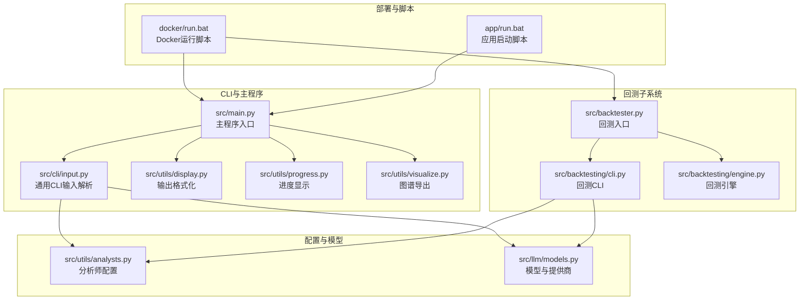
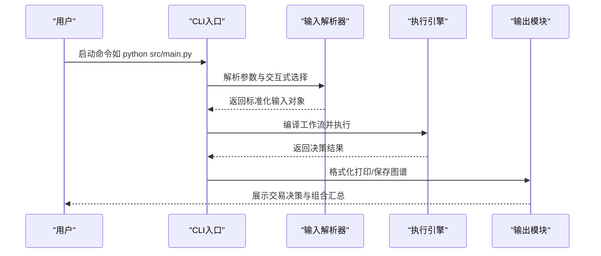
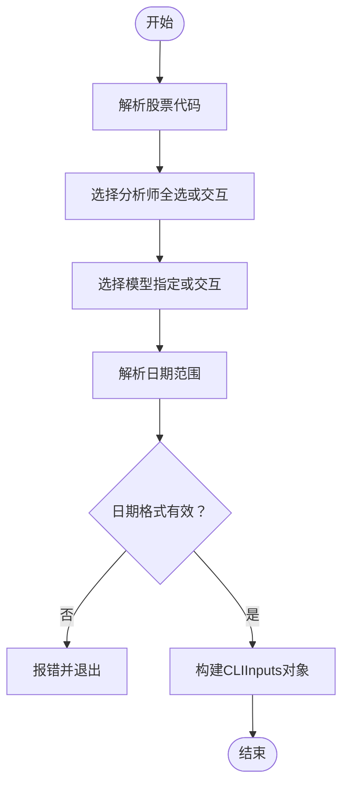
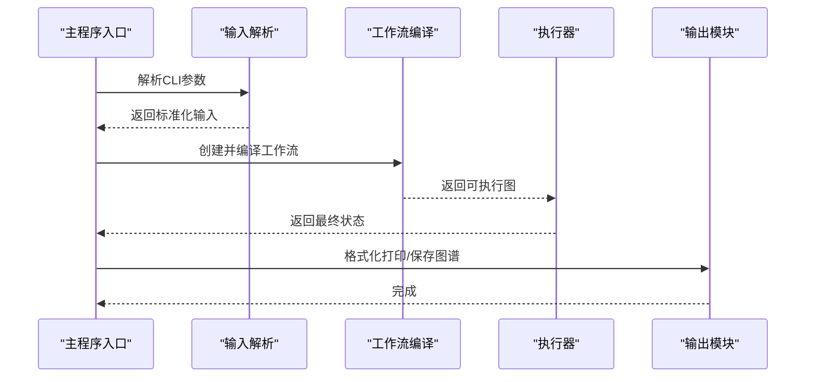
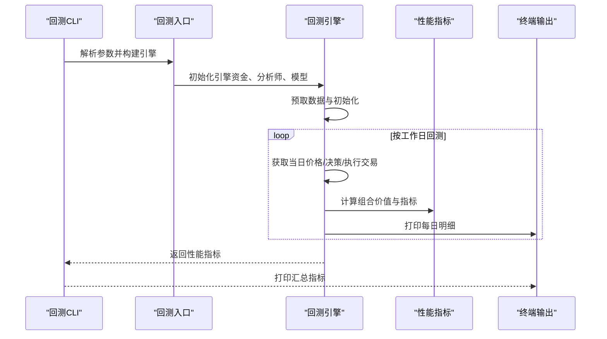
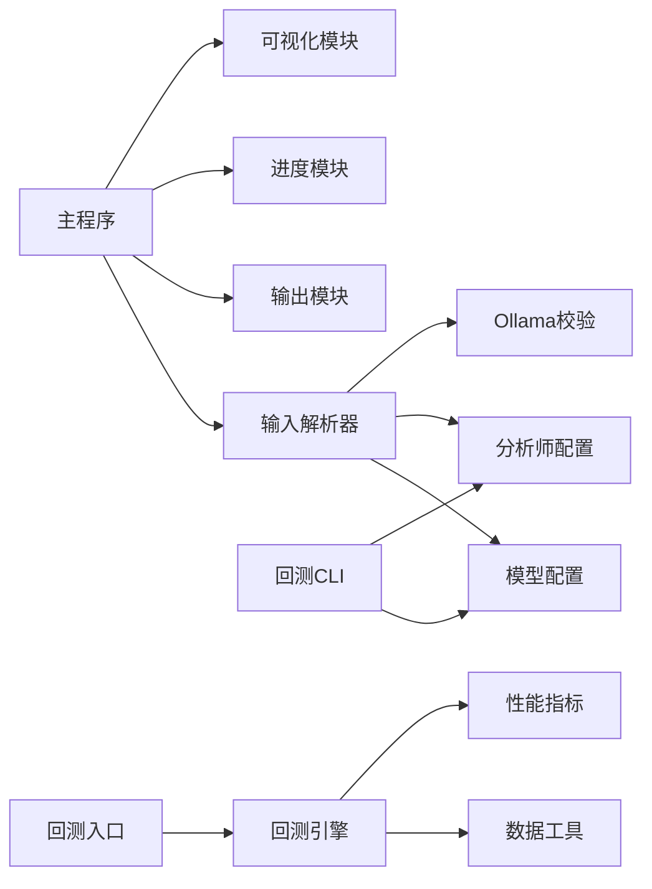

# 命令行界面

<cite>
**本文档引用的文件**
- [src/cli/input.py](file://src/cli/input.py)
- [src/backtesting/cli.py](file://src/backtesting/cli.py)
- [src/main.py](file://src/main.py)
- [src/backtester.py](file://src/backtester.py)
- [src/utils/display.py](file://src/utils/display.py)
- [src/utils/progress.py](file://src/utils/progress.py)
- [src/utils/visualize.py](file://src/utils/visualize.py)
- [src/backtesting/engine.py](file://src/backtesting/engine.py)
- [src/utils/analysts.py](file://src/utils/analysts.py)
- [src/llm/models.py](file://src/llm/models.py)
- [docker/run.bat](file://docker/run.bat)
- [app/run.bat](file://app/run.bat)
</cite>

## 目录
1. [简介](#简介)
2. [项目结构](#项目结构)
3. [核心组件](#核心组件)
4. [架构总览](#架构总览)
5. [详细组件分析](#详细组件分析)
6. [依赖分析](#依赖分析)
7. [性能考虑](#性能考虑)
8. [故障排除指南](#故障排除指南)
9. [结论](#结论)
10. [附录](#附录)

## 简介
本文件为该AI对冲基金项目的命令行界面（CLI）完整使用文档。内容覆盖主程序与回测器的命令行接口设计、参数与交互流程、参数校验与错误提示、批量处理与自动化脚本集成、性能优化与日志输出配置等。目标是帮助用户从基础使用到高级定制，全面掌握CLI的使用方法。

## 项目结构
CLI相关的核心文件分布于以下模块：
- 主程序入口与通用CLI输入解析：src/main.py、src/cli/input.py
- 回测器CLI与引擎：src/backtesting/cli.py、src/backtester.py、src/backtesting/engine.py
- 输出与可视化：src/utils/display.py、src/utils/progress.py、src/utils/visualize.py
- 分析师与模型配置：src/utils/analysts.py、src/llm/models.py
- Docker与Windows脚本：docker/run.bat、app/run.bat

**图表来源**
- [src/main.py:133-180](file://src/main.py#L133-L180)
- [src/cli/input.py:227-289](file://src/cli/input.py#L227-L289)
- [src/backtesting/cli.py:18-173](file://src/backtesting/cli.py#L18-L173)
- [src/backtester.py:42-67](file://src/backtester.py#L42-L67)
- [docker/run.bat:292-409](file://docker/run.bat#L292-L409)
- [app/run.bat:225-272](file://app/run.bat#L225-L272)

**章节来源**
- [src/main.py:133-180](file://src/main.py#L133-L180)
- [src/cli/input.py:227-289](file://src/cli/input.py#L227-L289)
- [src/backtesting/cli.py:18-173](file://src/backtesting/cli.py#L18-L173)
- [src/backtester.py:42-67](file://src/backtester.py#L42-L67)
- [docker/run.bat:292-409](file://docker/run.bat#L292-L409)
- [app/run.bat:225-272](file://app/run.bat#L225-L272)

## 核心组件
- 通用CLI输入解析器：负责股票代码、日期范围、分析师选择、模型选择、资金参数等的解析与交互式选择。
- 主程序CLI入口：整合输入解析、工作流构建、执行与输出展示。
- 回测CLI与引擎：支持批量化历史回测、性能指标输出与进度展示。
- 输出与可视化：交易决策表格、组合汇总、进度条、图谱导出PNG。
- 模型与分析师配置：统一管理可用模型列表、提供商、分析师节点映射。

**章节来源**
- [src/cli/input.py:16-289](file://src/cli/input.py#L16-L289)
- [src/main.py:46-180](file://src/main.py#L46-L180)
- [src/backtesting/cli.py:18-173](file://src/backtesting/cli.py#L18-L173)
- [src/backtesting/engine.py:27-195](file://src/backtesting/engine.py#L27-L195)
- [src/utils/display.py:17-396](file://src/utils/display.py#L17-L396)
- [src/utils/progress.py:12-117](file://src/utils/progress.py#L12-L117)
- [src/utils/visualize.py:5-9](file://src/utils/visualize.py#L5-L9)
- [src/utils/analysts.py:24-201](file://src/utils/analysts.py#L24-L201)
- [src/llm/models.py:17-258](file://src/llm/models.py#L17-L258)

## 架构总览
CLI整体采用“输入解析 → 参数校验 → 工作流编译 → 执行 → 输出”的流水线设计。主程序与回测器共享同一套输入解析逻辑，但执行路径不同：主程序实时交易决策，回测器按日回放历史数据并计算收益曲线与风险指标。

**图表来源**
- [src/main.py:133-180](file://src/main.py#L133-L180)
- [src/cli/input.py:227-289](file://src/cli/input.py#L227-L289)
- [src/utils/display.py:17-396](file://src/utils/display.py#L17-L396)

## 详细组件分析

### 通用CLI输入解析器（src/cli/input.py）
- 功能要点
  - 股票代码：支持逗号分隔的多股票输入，并进行去空格处理。
  - 日期范围：支持显式YYYY-MM-DD或基于默认月份数自动推算起始日期。
  - 分析师选择：支持全选或交互式勾选；必选至少一个。
  - 模型选择：支持外部指定模型名或交互式选择；支持自定义模型名；支持Ollama本地推理。
  - 资金参数：初始现金与保证金比例，支持别名参数。
  - 可选开关：显示推理过程、显示代理图。
- 参数校验与错误提示
  - 日期格式严格校验，不符合则抛出异常。
  - 未选择分析师时中断退出并提示。
  - 指定模型不存在时提示并引导重新选择。
- 交互式体验
  - 使用彩色提示与键盘快捷键（Space、a、Enter）提升易用性。
  - 对Ollama模型进行可用性检查，不可用则终止。

**图表来源**
- [src/cli/input.py:67-209](file://src/cli/input.py#L67-L209)
- [src/cli/input.py:227-289](file://src/cli/input.py#L227-L289)

**章节来源**
- [src/cli/input.py:16-289](file://src/cli/input.py#L16-L289)

### 主程序CLI入口（src/main.py）
- 入口行为
  - 调用通用输入解析器，要求必须提供股票代码。
  - 构建初始投资组合字典（含现金、保证金、头寸、已实现损益）。
  - 编译工作流（默认包含所有分析师），执行后打印格式化输出。
- 关键流程
  - 进度跟踪：开始/停止由进度模块管理。
  - 图谱导出：可选保存为PNG。
  - 输出展示：使用表格化方式呈现每个标的的信号、决策与组合汇总。

**图表来源**
- [src/main.py:133-180](file://src/main.py#L133-L180)
- [src/utils/display.py:17-396](file://src/utils/display.py#L17-L396)
- [src/utils/visualize.py:5-9](file://src/utils/visualize.py#L5-L9)

**章节来源**
- [src/main.py:46-180](file://src/main.py#L46-L180)

### 回测CLI与引擎（src/backtesting/cli.py、src/backtester.py、src/backtesting/engine.py）
- 回测CLI
  - 支持股票代码、日期范围、初始资金、保证金比例、分析师选择、Ollama开关。
  - 交互式选择分析师与模型，支持Ollama本地模型校验。
  - 执行回测后输出总收益、夏普比率、索提诺比率、最大回撤等指标。
- 回测引擎
  - 预取一年内价格与因子数据，按工作日循环回测。
  - 每日根据代理输出执行交易，计算组合价值与敞口，累积性能指标。
  - 实时输出每日明细与滚动指标，支持中断后部分结果展示。

**图表来源**
- [src/backtesting/cli.py:18-173](file://src/backtesting/cli.py#L18-L173)
- [src/backtester.py:42-67](file://src/backtester.py#L42-L67)
- [src/backtesting/engine.py:96-195](file://src/backtesting/engine.py#L96-L195)

**章节来源**
- [src/backtesting/cli.py:18-173](file://src/backtesting/cli.py#L18-L173)
- [src/backtester.py:42-67](file://src/backtester.py#L42-L67)
- [src/backtesting/engine.py:27-195](file://src/backtesting/engine.py#L27-L195)

### 输出与可视化（src/utils/display.py、src/utils/progress.py、src/utils/visualize.py）
- 输出模块
  - 交易决策表格：按标的输出动作、数量、置信度与推理摘要。
  - 组合汇总：统计每个标的的信号计数与最终决策。
  - 回测结果：支持清屏与最新汇总展示，包含收益、基准收益与风险指标。
- 进度模块
  - 实时显示各代理状态（进行中/完成/错误），支持注册更新处理器。
- 可视化模块
  - 将编译后的图导出为PNG图像，便于调试与分享。

**章节来源**
- [src/utils/display.py:17-396](file://src/utils/display.py#L17-L396)
- [src/utils/progress.py:12-117](file://src/utils/progress.py#L12-L117)
- [src/utils/visualize.py:5-9](file://src/utils/visualize.py#L5-L9)

### 模型与分析师配置（src/utils/analysts.py、src/llm/models.py）
- 分析师配置
  - 统一定义分析师清单与显示顺序，提供节点映射与API列表。
- 模型配置
  - 定义支持的提供商枚举与模型信息，加载本地JSON生成排序列表。
  - 提供模型查找、自定义模型识别、JSON模式支持判断与提供商实例化。

**章节来源**
- [src/utils/analysts.py:24-201](file://src/utils/analysts.py#L24-L201)
- [src/llm/models.py:17-258](file://src/llm/models.py#L17-L258)

## 依赖分析
- 输入解析器依赖
  - 与模型配置（LLM/OLLAMA）、分析师配置、Ollama可用性检查集成。
- 主程序依赖
  - 与输入解析器、输出模块、进度模块、可视化模块耦合，形成闭环。
- 回测CLI/引擎依赖
  - 与主程序的代理函数解耦，通过回调注入；与数据工具、性能计算器、基准比较器协作。

**图表来源**
- [src/cli/input.py:10-11](file://src/cli/input.py#L10-L11)
- [src/main.py:15-17](file://src/main.py#L15-L17)
- [src/backtesting/cli.py:12-15](file://src/backtesting/cli.py#L12-L15)
- [src/backtesting/engine.py:18-24](file://src/backtesting/engine.py#L18-L24)

**章节来源**
- [src/cli/input.py:10-11](file://src/cli/input.py#L10-L11)
- [src/main.py:15-17](file://src/main.py#L15-L17)
- [src/backtesting/cli.py:12-15](file://src/backtesting/cli.py#L12-L15)
- [src/backtesting/engine.py:18-24](file://src/backtesting/engine.py#L18-L24)

## 性能考虑
- 数据预取策略：回测引擎在开始前预取一年内价格与因子数据，减少运行期IO开销。
- 日频回测：按工作日推进，避免非交易日重复计算。
- 指标滚动：仅在足够样本后计算指标，降低噪声影响。
- 进度显示：使用轻量级Live表刷新，避免阻塞主执行流程。
- Docker集成：提供一键构建与Compose运行，便于在容器环境中快速部署与测试。

**章节来源**
- [src/backtesting/engine.py:81-94](file://src/backtesting/engine.py#L81-L94)
- [src/backtesting/engine.py:96-195](file://src/backtesting/engine.py#L96-L195)
- [src/utils/progress.py:12-117](file://src/utils/progress.py#L12-L117)
- [docker/run.bat:272-395](file://docker/run.bat#L272-L395)

## 故障排除指南
- 模型选择失败
  - 现象：指定模型不存在或Ollama不可用。
  - 处理：检查模型名称与提供商是否匹配；确认Ollama服务运行与模型存在。
- 日期格式错误
  - 现象：输入日期不符合YYYY-MM-DD格式。
  - 处理：修正日期格式或使用默认月份数自动推算。
- 未选择分析师
  - 现象：交互式选择时未选择任何分析师。
  - 处理：至少选择一个分析师，或使用全选标志。
- 中断回测
  - 现象：用户中断回测。
  - 处理：程序会尝试输出部分结果（初始/末尾组合价值与总收益）。
- Docker环境问题
  - 现象：Compose不可用或Ollama容器未就绪。
  - 处理：安装Compose并确保容器健康检查通过；必要时手动拉取模型。

**章节来源**
- [src/cli/input.py:190-209](file://src/cli/input.py#L190-L209)
- [src/backtesting/cli.py:97-103](file://src/backtesting/cli.py#L97-L103)
- [src/backtester.py:19-39](file://src/backtester.py#L19-L39)
- [docker/run.bat:179-226](file://docker/run.bat#L179-L226)

## 结论
本CLI以统一的输入解析器为核心，分别驱动主程序的实时交易决策与回测器的历史回放。通过交互式选择、参数校验与错误提示、进度显示与可视化导出，既满足新手快速上手，也支持高级用户的批量与自动化集成。配合Docker与Windows脚本，可在多种环境下高效运行。

## 附录

### 常用命令与参数说明
- 主程序（实时交易）
  - 必需：股票代码（--tickers）
  - 可选：--start-date/--end-date、--initial-cash/--initial-capital、--margin-requirement、--analysts、--analysts-all、--ollama、--model、--show-reasoning、--show-agent-graph
- 回测器（历史回放）
  - 可选：--tickers、--start-date/--end-date、--initial-capital、--margin-requirement、--analysts、--analysts-all、--ollama
- Docker运行
  - run.bat支持：--ticker、--start-date、--end-date、--initial-cash、--margin-requirement、--ollama、--ollama-base-url、--show-reasoning、main/backtest/build/compose/ollama/pull/help
- Windows应用脚本
  - app\run.bat用于一键启动Web应用，包含依赖检查与服务启动流程。

**章节来源**
- [src/main.py:133-180](file://src/main.py#L133-L180)
- [src/backtesting/cli.py:18-39](file://src/backtesting/cli.py#L18-L39)
- [docker/run.bat:17-50](file://docker/run.bat#L17-L50)
- [app/run.bat:1-272](file://app/run.bat#L1-L272)