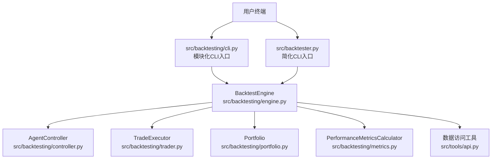
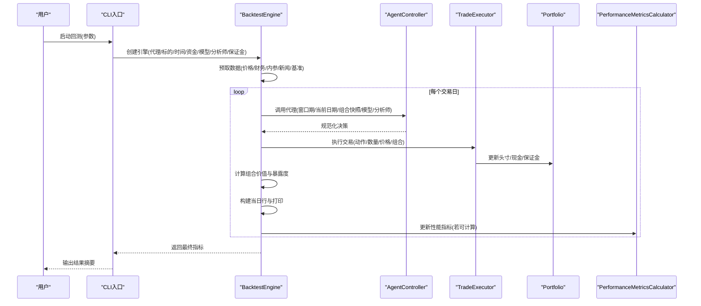
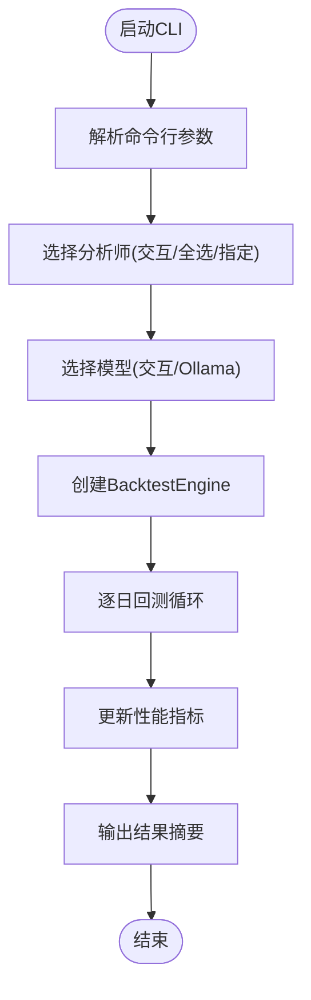
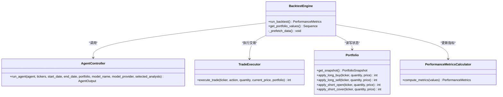
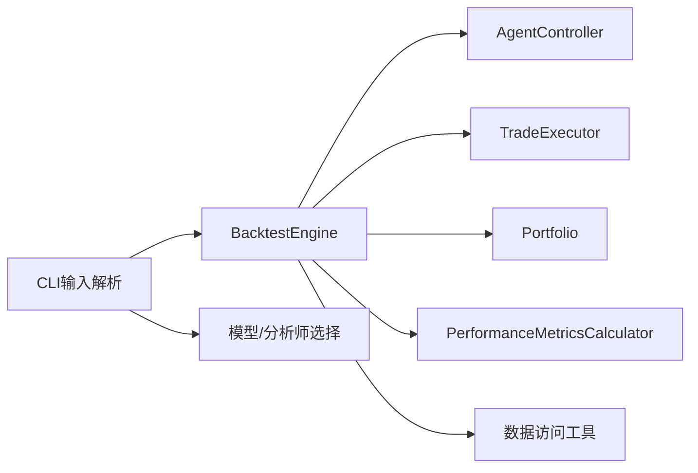
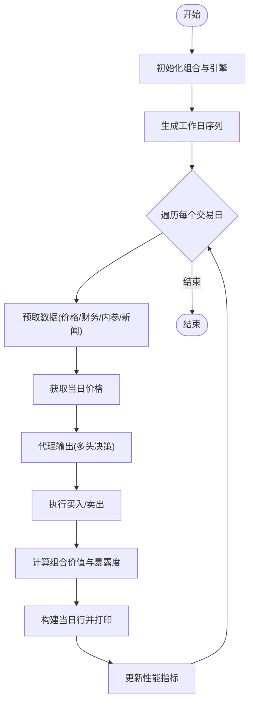

# 回测命令行接口

<cite>
**本文档引用的文件**
- [src/backtester.py](file://src/backtester.py)
- [src/backtesting/cli.py](file://src/backtesting/cli.py)
- [src/backtesting/engine.py](file://src/backtesting/engine.py)
- [src/backtesting/controller.py](file://src/backtesting/controller.py)
- [src/backtesting/portfolio.py](file://src/backtesting/portfolio.py)
- [src/backtesting/trader.py](file://src/backtesting/trader.py)
- [src/backtesting/metrics.py](file://src/backtesting/metrics.py)
- [src/backtesting/types.py](file://src/backtesting/types.py)
- [src/cli/input.py](file://src/cli/input.py)
- [src/main.py](file://src/main.py)
- [tests/backtesting/integration/test_integration_long_only.py](file://tests/backtesting/integration/test_integration_long_only.py)
- [tests/backtesting/integration/test_integration_short_only.py](file://tests/backtesting/integration/test_integration_short_only.py)
- [tests/backtesting/integration/test_integration_long_short.py](file://tests/backtesting/integration/test_integration_long_short.py)
- [README.md](file://README.md)
</cite>

## 目录
1. [简介](#简介)
2. [项目结构](#项目结构)
3. [核心组件](#核心组件)
4. [架构总览](#架构总览)
5. [详细组件分析](#详细组件分析)
6. [依赖关系分析](#依赖关系分析)
7. [性能考量](#性能考量)
8. [故障排除指南](#故障排除指南)
9. [结论](#结论)
10. [附录](#附录)

## 简介
本文件面向回测命令行接口（CLI）的使用者与维护者，系统性说明 backtester.py 脚本的功能、命令行参数配置、回测参数设置与运行选项，并详细描述 CLI 的交互流程（数据准备、参数输入、执行监控与结果查看）。同时，文档阐述三种主要回测模式：长期多头、短期空头与多空混合策略的配置方法；提供参数调优技巧、批量回测方法与结果比较策略；给出常见使用场景的命令示例、故障排除指南与性能优化建议，并包含自动化脚本编写与集成方法。

## 项目结构
回测 CLI 由两条并行路径构成：
- src/backtester.py：面向简化/遗留风格的直接回测入口，通过解析 CLI 输入后创建 BacktestEngine 并运行。
- src/backtesting/cli.py：模块化回测 CLI 入口，支持更丰富的交互式模型选择、分析师选择与输出格式控制。

两条路径共享核心回测引擎与数据访问层，确保行为一致。

图表来源
- [src/backtesting/cli.py:18-164](file://src/backtesting/cli.py#L18-L164)
- [src/backtester.py:42-66](file://src/backtester.py#L42-L66)
- [src/backtesting/engine.py:27-194](file://src/backtesting/engine.py#L27-L194)

章节来源
- [src/backtesting/cli.py:18-164](file://src/backtesting/cli.py#L18-L164)
- [src/backtester.py:42-66](file://src/backtester.py#L42-L66)
- [src/backtesting/engine.py:27-194](file://src/backtesting/engine.py#L27-L194)

## 核心组件
- BacktestEngine：协调回测循环，负责预取数据、逐日推进、调用代理、执行交易、计算组合价值与暴露度、构建每日行与输出、更新性能指标。
- AgentController：标准化代理输出，将决策规范化为统一格式，兼容历史期望。
- TradeExecutor：根据动作与数量在 Portfolio 上执行交易，返回实际成交数量。
- Portfolio：管理现金、头寸与保证金，支持多标的同时长/短仓与成本基础跟踪。
- PerformanceMetricsCalculator：计算夏普比率、索提诺比率与最大回撤等指标。
- CLI 输入解析：统一处理 tickers、日期范围、初始资金、保证金要求、分析师与模型选择等参数。

章节来源
- [src/backtesting/engine.py:27-194](file://src/backtesting/engine.py#L27-L194)
- [src/backtesting/controller.py:9-66](file://src/backtesting/controller.py#L9-L66)
- [src/backtesting/trader.py:7-39](file://src/backtesting/trader.py#L7-L39)
- [src/backtesting/portfolio.py:9-196](file://src/backtesting/portfolio.py#L9-L196)
- [src/backtesting/metrics.py:8-77](file://src/backtesting/metrics.py#L8-L77)
- [src/cli/input.py:227-286](file://src/cli/input.py#L227-L286)

## 架构总览
下图展示回测引擎在每日循环中的关键步骤与组件交互：

图表来源
- [src/backtesting/engine.py:96-189](file://src/backtesting/engine.py#L96-L189)
- [src/backtesting/controller.py:12-65](file://src/backtesting/controller.py#L12-L65)
- [src/backtesting/trader.py:10-37](file://src/backtesting/trader.py#L10-L37)
- [src/backtesting/metrics.py:22-75](file://src/backtesting/metrics.py#L22-L75)

## 详细组件分析

### 命令行参数与运行选项
- tickers：逗号分隔的股票代码列表（如 AAPL,MSFT,NVDA），用于指定回测标的。
- start-date/end-date：YYYY-MM-DD 格式的开始/结束日期，默认滚动窗口或按参数设定。
- initial-cash/--initial-capital：初始资金，默认 100000.0。
- margin-requirement：初始保证金比例（空头保证金要求），默认 0.0。
- analysts：指定分析师集合（逗号分隔）。
- analysts-all：使用全部可用分析师。
- ollama：使用本地 Ollama 推理，自动校验模型可用性。
- model：显式指定模型名称（优先级高于交互选择）。
- show-reasoning/show-agent-graph：仅在主程序 CLI 中可用（非 backtester.py）。

章节来源
- [src/cli/input.py:16-44](file://src/cli/input.py#L16-L44)
- [src/cli/input.py:227-286](file://src/cli/input.py#L227-L286)
- [src/backtesting/cli.py:18-39](file://src/backtesting/cli.py#L18-L39)
- [src/backtester.py:42-50](file://src/backtester.py#L42-L50)

### 数据准备与预取
- 引擎在回测前预取标的的历史价格、财务指标、 insider 交易与公司新闻，并加载基准（SPY）价格序列，确保每日价格可用。
- 预取窗口通常覆盖回测起始日期前一年，以满足策略信号所需的滚动窗口。

章节来源
- [src/backtesting/engine.py:81-94](file://src/backtesting/engine.py#L81-L94)

### 参数输入与交互流程
- 模块化 CLI（src/backtesting/cli.py）：支持交互式选择分析师与模型；可选 Ollama 模式；输出简洁的引擎运行完成信息与关键指标。
- 简化 CLI（src/backtester.py）：通过 parse_cli_inputs 解析参数，创建 BacktestEngine 并运行，支持键盘中断时输出部分结果摘要。

图表来源
- [src/backtesting/cli.py:18-164](file://src/backtesting/cli.py#L18-L164)
- [src/cli/input.py:227-286](file://src/cli/input.py#L227-L286)

章节来源
- [src/backtesting/cli.py:18-164](file://src/backtesting/cli.py#L18-L164)
- [src/cli/input.py:227-286](file://src/cli/input.py#L227-L286)

### 执行监控与结果查看
- 每日输出：打印最新交易日的行记录（含决策、成交、持仓、净值等），最新一天在顶部显示。
- 性能指标：在具备足够样本后逐步更新夏普、索提诺与最大回撤等指标。
- 键盘中断：简化 CLI 在用户中断时尝试输出部分结果摘要（初始/最终净值与总回报）。

章节来源
- [src/backtesting/engine.py:166-181](file://src/backtesting/engine.py#L166-L181)
- [src/backtesting/metrics.py:22-75](file://src/backtesting/metrics.py#L22-L75)
- [src/backtester.py:13-39](file://src/backtester.py#L13-L39)

### 回测模式与策略配置
- 长期多头（多标买入并持有/部分卖出）
  - 关键点：使用 buy/sell 动作；验证多标买入、部分卖出与完全清仓后的现金占比一致性。
  - 参考测试：多标买入→部分卖出→完全清仓；多轮买卖周期；再平衡策略。
- 短期空头（做空并覆盖）
  - 关键点：使用 short/cover 动作；验证部分覆盖与完全平仓后的成本基础重置。
  - 参考测试：做空→部分覆盖→完全平仓；多轮做空覆盖周期；加仓做空与再平衡。
- 多空混合（同时持有多头与空头）
  - 关键点：同日对不同标进行相反方向操作；验证部分平仓与方向转换后的成本基础与已实现损益。
  - 参考测试：多标多空→部分平仓→完全清仓至现金；方向转换（先多后空/先空后多）；双向加仓与部分平仓。

章节来源
- [tests/backtesting/integration/test_integration_long_only.py:4-403](file://tests/backtesting/integration/test_integration_long_only.py#L4-L403)
- [tests/backtesting/integration/test_integration_short_only.py:5-404](file://tests/backtesting/integration/test_integration_short_only.py#L5-L404)
- [tests/backtesting/integration/test_integration_long_short.py:5-313](file://tests/backtesting/integration/test_integration_long_short.py#L5-L313)

### 类与关系图（代码级）

图表来源
- [src/backtesting/engine.py:27-194](file://src/backtesting/engine.py#L27-L194)
- [src/backtesting/controller.py:9-66](file://src/backtesting/controller.py#L9-L66)
- [src/backtesting/trader.py:7-39](file://src/backtesting/trader.py#L7-L39)
- [src/backtesting/portfolio.py:9-196](file://src/backtesting/portfolio.py#L9-L196)
- [src/backtesting/metrics.py:8-77](file://src/backtesting/metrics.py#L8-L77)

## 依赖关系分析
- 组件耦合与内聚
  - BacktestEngine 内聚地协调控制器、执行器、组合与指标计算，日志输出与结果构建相对独立。
  - AgentController 将代理输出标准化，降低上游代理变化对下游的影响。
  - TradeExecutor 与 Portfolio 之间存在直接依赖，但通过方法边界清晰。
- 外部依赖
  - 数据访问：通过工具函数获取价格、财务、内参与新闻数据。
  - 模型与分析师：通过 CLI 输入解析模块选择模型与分析师集合。
- 潜在循环依赖
  - 当前模块间为单向依赖，未发现循环导入。

图表来源
- [src/backtesting/engine.py:18-24](file://src/backtesting/engine.py#L18-L24)
- [src/cli/input.py:8-10](file://src/cli/input.py#L8-L10)

章节来源
- [src/backtesting/engine.py:18-24](file://src/backtesting/engine.py#L18-L24)
- [src/cli/input.py:8-10](file://src/cli/input.py#L8-L10)

## 性能考量
- 数据预取：预取一年窗口的价格与因子数据，减少回测过程中的 IO 开销。
- 日频循环：使用工作日序列推进，避免非交易日无效计算。
- 指标计算：仅在具备足够样本后更新指标，避免早期波动导致的不稳定。
- 交易执行：按需计算最大可成交数量，避免超出现金或保证金约束。
- I/O 输出：每日增量输出与表格行构建，建议在批量运行时关注终端刷新频率。

[本节为通用性能讨论，不直接分析具体文件]

## 故障排除指南
- 模型不可用（Ollama）
  - 现象：选择 Ollama 模型后无法继续。
  - 处理：确认本地 Ollama 服务与所选模型已安装；CLI 会进行可用性检查。
- 键盘中断
  - 现象：用户中断回测。
  - 处理：简化 CLI 会在中断后尝试输出部分结果摘要（初始/最终净值与总回报）。
- 缺失数据
  - 现象：某交易日价格为空，跳过该日。
  - 处理：确保数据源可用且日期范围内有连续交易日；必要时调整日期范围。
- 权限与环境变量
  - 现象：运行失败或报错。
  - 处理：检查 .env 文件中至少配置一个 LLM API 密钥；确认 FINANCIAL_DATASETS_API_KEY 等数据密钥正确。

章节来源
- [src/backtesting/cli.py:97-99](file://src/backtesting/cli.py#L97-L99)
- [src/backtester.py:19-39](file://src/backtester.py#L19-L39)
- [README.md:65-82](file://README.md#L65-L82)

## 结论
回测命令行接口提供了灵活、可扩展的回测框架，支持多标、多策略与多模型配置。通过模块化设计与清晰的组件职责划分，用户可以快速搭建从长期多头到短期空头再到多空混合的完整回测流程，并结合性能指标与可视化输出进行策略评估与优化。

[本节为总结性内容，不直接分析具体文件]

## 附录

### 常见使用场景与命令示例
- 运行简化回测（默认 1 个月窗口）
  - 示例：poetry run python src/backtester.py --tickers AAPL,MSFT,NVDA --initial-cash 200000
- 使用 Ollama 本地模型
  - 示例：poetry run python src/backtester.py --tickers AAPL,MSFT --ollama
- 指定日期范围
  - 示例：poetry run python src/backtester.py --tickers AAPL,MSFT --start-date 2024-01-01 --end-date 2024-03-01
- 模块化 CLI（交互式选择分析师与模型）
  - 示例：poetry run python -m src.backtesting.cli --tickers AAPL,MSFT --analysts-all --ollama

章节来源
- [README.md:121-131](file://README.md#L121-L131)
- [src/backtesting/cli.py:18-39](file://src/backtesting/cli.py#L18-L39)

### 参数调优技巧
- 初始资金与保证金
  - 提高初始资金可增强策略的可执行性；空头策略应合理设置保证金比例以避免爆仓。
- 交易量与滑点
  - 在策略设计中考虑最大可成交数量与价格冲击，避免过度下单导致的偏差。
- 滚动窗口与信号频率
  - 调整 lookback 窗口与交易频率，观察对收益与波动的影响。
- 分析师信号融合
  - 通过 --analysts 或 --analysts-all 控制分析师集合，评估不同观点组合的效果。

章节来源
- [src/backtesting/engine.py:107-131](file://src/backtesting/engine.py#L107-L131)
- [src/cli/input.py:227-286](file://src/cli/input.py#L227-L286)

### 批量回测与结果比较
- 批量运行
  - 使用 shell 脚本或批处理文件循环执行不同参数组合的回测任务。
- 结果比较
  - 保存每次运行的性能指标（夏普、索提诺、最大回撤）与净值曲线，进行横向对比。
- 自动化集成
  - 将回测封装为函数或服务，供上层调度系统调用；在 CI/CD 中定期运行回归测试。

[本节为通用实践建议，不直接分析具体文件]

### 代码级流程图（示例：多头策略）

图表来源
- [src/backtesting/engine.py:96-189](file://src/backtesting/engine.py#L96-L189)